# 第4章 HTTPS协议

## 4.1 为什么需要HTTPS

### 4.1.1 HTTP的安全问题

HTTP协议设计之初并未考虑安全性，存在三大核心风险：

| 安全问题 | 描述 | 后果 |
|---------|------|------|
| **窃听风险** | 数据以明文传输 | 敏感信息（如密码、信用卡号）被第三方获取 |
| **篡改风险** | 数据在传输过程中被修改 | 网页内容被植入广告或恶意代码 |
| **冒充风险** | 无法验证服务器身份 | 伪基站、DNS劫持等攻击 |

```
┌─────────────────────────────────────────────────────────────────┐
│                     HTTP 明文传输示意                            │
├─────────────────────────────────────────────────────────────────┤
│                                                                 │
│   客户端                                                    服务端 │
│      │                                                         │ │
│      │────── 用户名: admin, 密码: 123456 ──────>                │ │
│      │              (明文，可被截获)                            │ │
│      │                                                         │ │
│      │<────────────── 返回用户数据 ─────────────────            │ │
│      │              (明文，可被篡改)                            │ │
│                                                                 │
│           ↓                                                    │
│     攻击者可能截获、篡改数据                                     │
└─────────────────────────────────────────────────────────────────┘
```

### 4.1.2 HTTPS的核心特性

HTTPS（HTTP Secure）是HTTP的安全版本，通过以下三种机制解决上述问题：

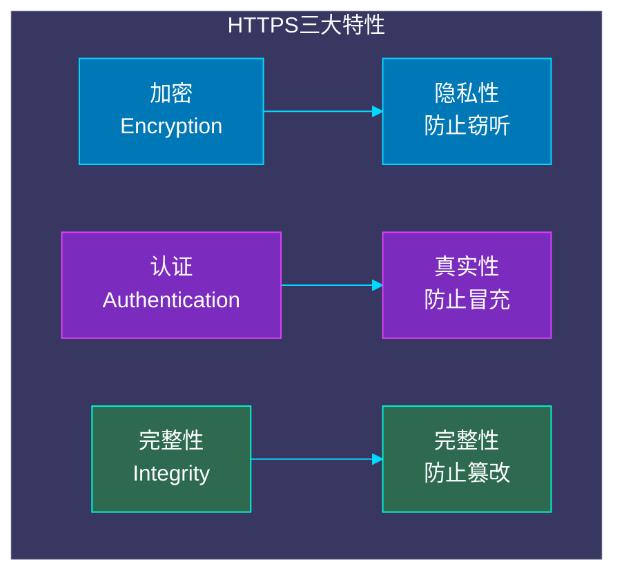

**HTTPS解决的三个问题：**

1. **加密（Encryption）**：对传输数据进行加密，即使被截获也无法解读
2. **认证（Authentication）**：通过数字证书验证服务器身份，防止冒充
3. **完整性（Integrity）**：数据签名机制，检测传输过程中是否被篡改

### 4.1.3 HTTP vs HTTPS 对比

| 特性 | HTTP | HTTPS |
|------|------|------|
| 端口 | 80 | 443 |
| 协议 | HTTP/1.0, HTTP/1.1, HTTP/2 | HTTP/1.1 over TLS, HTTP/2 over TLS |
| 加密 | 无 | TLS/SSL加密 |
| 证书 | 无 | 需要CA证书 |
| 性能 | 较快（无加密开销） | 略慢（加密解密计算） |
| 兼容性 | 所有浏览器 | 现代浏览器都支持 |
| SEO影响 | 无 | 搜索引擎优先收录 |

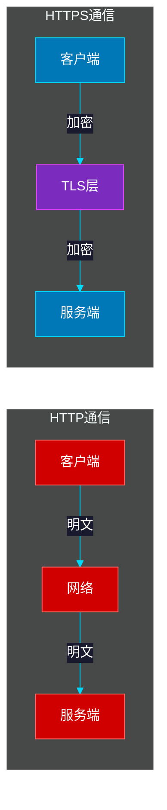

---

## 4.2 加密技术基础

### 4.2.1 对称加密

**对称加密**是最古老的加密形式，使用相同的密钥进行加密和解密。

```
┌─────────────────────────────────────────────────────────────────┐
│                      对称加密原理                                │
├─────────────────────────────────────────────────────────────────┤
│                                                                 │
│   明文 ──────[加密算法]────────> 密文                           │
│           密钥: password123                                    │
│                                                                 │
│   明文 <──────[解密算法]──────── 密文                           │
│           密钥: password123                                    │
│                                                                 │
│   特点：加密解密使用同一个密钥                                  │
└─────────────────────────────────────────────────────────────────┘
```

**常见对称加密算法：**

| 算法 | 密钥长度 | 安全性 | 速度 | 说明 |
|------|---------|--------|------|------|
| AES | 128/192/256位 | 高 | 快 | 取代DES成为标准 |
| ChaCha20 | 256位 | 高 | 快 | 移动设备友好 |
| DES | 56位 | 低 | 快 | 已淘汰 |
| 3DES | 168位 | 中 | 慢 | 逐渐淘汰 |

**OpenSSL对称加密示例：**

```bash
# 使用AES-256-CBC加密文件
openssl enc -aes-256-cbc -salt -in plaintext.txt -out encrypted.bin -k mypassword

# 解密文件
openssl enc -aes-256-cbc -d -in encrypted.bin -out decrypted.txt -k mypassword

# 使用ChaCha20加密（需要OpenSSL 1.1.1+）
openssl enc -chacha20 -in plaintext.txt -out encrypted.bin -k mypassword

# 查看文件加密后的内容
hexdump -C encrypted.bin
```

**对称加密的优缺点：**

```
优点：
├── 算法简单，计算速度快
├── 加密效率高，适合大量数据传输
└── 密钥相对较短

缺点：
├── 密钥传输问题：如何安全传递密钥？
├── 密钥管理问题：每个通信方需要维护多个密钥
└── 无法用于数字签名
```

### 4.2.2 非对称加密

非对称加密使用一对密钥：**公钥**和**私钥**。公钥可以公开分发，私钥必须严格保密。

```
┌─────────────────────────────────────────────────────────────────┐
│                     非对称加密原理                               │
├─────────────────────────────────────────────────────────────────┤
│                                                                 │
│   明文 ──────[公钥加密]────────> 密文                           │
│              公钥: 可以公开                                    │
│                                                                 │
│   明文 <──────[私钥解密]──────── 密文                           │
│              私钥: 必须保密                                    │
│                                                                 │
│   特点：用公钥加密，只能用配对的私钥解密                         │
└─────────────────────────────────────────────────────────────────┘
```

**RSA加密流程图：**

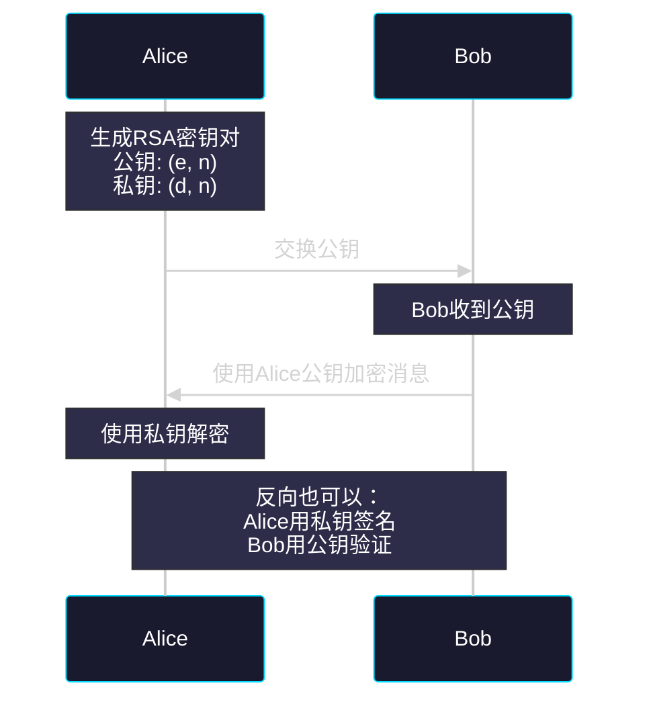

**常见非对称加密算法：**

| 算法 | 密钥长度 | 安全性 | 速度 | 主要用途 |
|------|---------|--------|------|---------|
| RSA | 2048/4096位 | 高 | 慢 | 密钥交换、数字签名 |
| ECDSA | 256/384位 | 高 | 快 | 数字签名（TLS 1.3） |
| Ed25519 | 256位 | 高 | 快 | 数字签名（现代推荐） |
| DH | 2048位 | 中 | 中 | 密钥交换 |
| ECDH | 256位 | 高 | 快 | 密钥交换 |

**OpenSSL非对称加密示例：**

```bash
# 生成RSA 2048位密钥对
openssl genrsa -out private.pem 2048

# 提取公钥
openssl rsa -in private.pem -pubout -out public.pem

# 使用公钥加密
echo "secret message" > plaintext.txt
openssl rsautl -encrypt -pubin -inkey public.pem -in plaintext.txt -out encrypted.bin

# 使用私钥解密
openssl rsautl -decrypt -inkey private.pem -in encrypted.bin -out decrypted.txt
cat decrypted.txt

# 生成ECDSA密钥对（P-256曲线）
openssl ecparam -genkey -name prime256v1 -noout -out ecdsa_private.pem
openssl ec -in ecdsa_private.pem -pubout -out ecdsa_public.pem
```

**非对称加密的优缺点：**

```
优点：
├── 密钥传输安全：公钥可公开，私钥不传输
├── 解决了密钥管理问题
├── 可用于数字签名
└── 支持密钥交换

缺点：
├── 算法复杂，计算速度慢（比对称加密慢100-1000倍）
├── 密钥长度长
└── 不适合加密大量数据
```

### 4.2.3 混合加密体系

实际应用中，HTTPS采用混合加密体系，结合两者的优点：

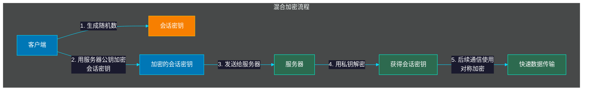

**混合加密的工作原理：**

1. **密钥交换阶段**：使用非对称加密传递会话密钥
2. **数据传输阶段**：使用对称加密进行实际数据传输

```
┌─────────────────────────────────────────────────────────────────┐
│                      混合加密示意                                │
├─────────────────────────────────────────────────────────────────┤
│                                                                 │
│  密钥交换（慢但安全）          数据传输（快且安全）              │
│  ┌───────────────┐            ┌───────────────┐                │
│  │ 非对称加密    │            │ 对称加密      │                │
│  │               │            │               │                │
│  │ 公钥加密      │ ──────>    │ 会话密钥      │                │
│  │ 会话密钥      │            │ AES/ChaCha20  │                │
│  │               │            │               │                │
│  └───────────────┘            └───────────────┘                │
│                                                                 │
│  一次性传输                持续传输                              │
│                                                                 │
└─────────────────────────────────────────────────────────────────┘
```

---

## 4.3 TLS协议详解

### 4.3.1 TLS协议概述

TLS（Transport Layer Security，传输层安全）是HTTPS的底层协议，用于在两个通信应用程序之间提供保密性和数据完整性。

```
┌─────────────────────────────────────────────────────────────────┐
│                        TLS协议栈                                │
├─────────────────────────────────────────────────────────────────┤
│                                                                 │
│                      ┌─────────────┐                           │
│                      │  HTTP/1.1   │                           │
│                      │  HTTP/2     │                           │
│                      │  HTTP/3     │                           │
│                      └──────┬──────┘                           │
│                             │                                  │
│                      ┌──────▼──────┐                           │
│                      │    TLS      │  1.3 / 1.2               │
│                      │  Handshake  │                           │
│                      │  Record     │                           │
│                      └──────┬──────┘                           │
│                             │                                  │
│                      ┌──────▼──────┐                           │
│                      │    TCP      │                           │
│                      └─────────────┘                           │
│                                                                 │
└─────────────────────────────────────────────────────────────────┘
```

### 4.3.2 TLS 1.2 握手流程

TLS 1.2是2008年发布的版本，目前仍被广泛使用。以下是完整的TLS 1.2握手流程：

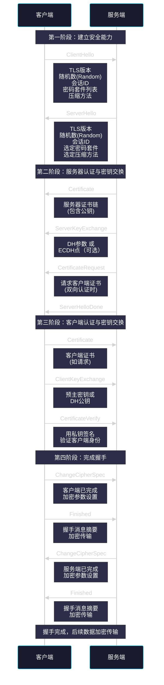

**TLS 1.2 RSA握手详解：**

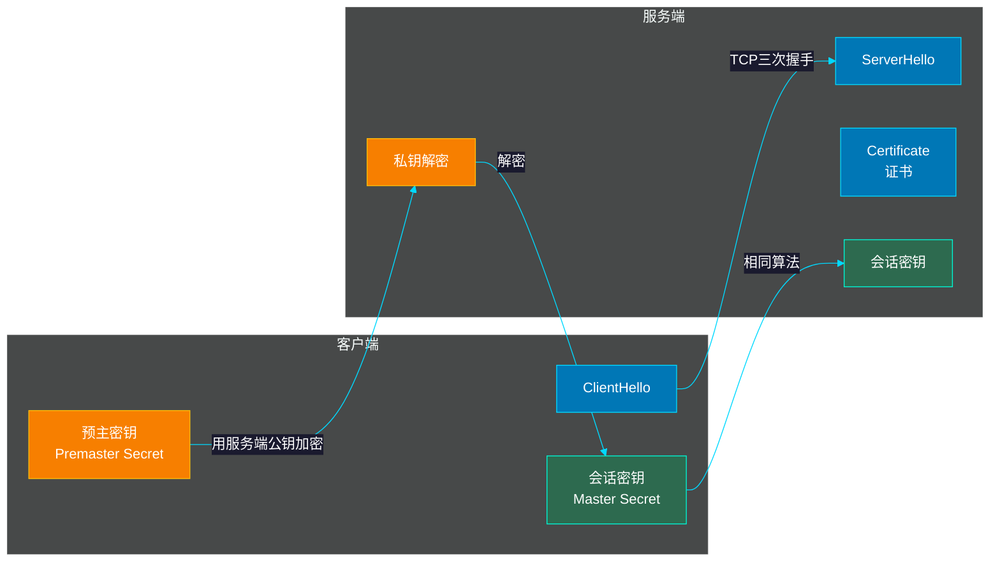

**TLS 1.2 RSA握手步骤：**

```
1. ClientHello
   - 客户端生成随机数(Random)
   - 发送支持的TLS版本、密码套件

2. ServerHello
   - 服务端生成随机数(Random)
   - 选择密码套件，发送证书

3. 证书验证（后续详述）

4. ClientKeyExchange
   - 客户端生成"预主密钥"(Premaster Secret)
   - 用服务端公钥加密后发送

5. 生成会话密钥
   - 客户端：master_secret = PRF(premaster_secret, "master secret", random1+random2)
   - 服务端：使用私钥解密获取premaster_secret，计算相同的master_secret

6. ChangeCipherSpec + Finished
   - 双方切换到加密模式
   - 发送加密的握手消息摘要验证
```

### 4.3.3 TLS 1.3 握手流程

TLS 1.3是2018年发布的最新版本，相比1.2有重大改进：

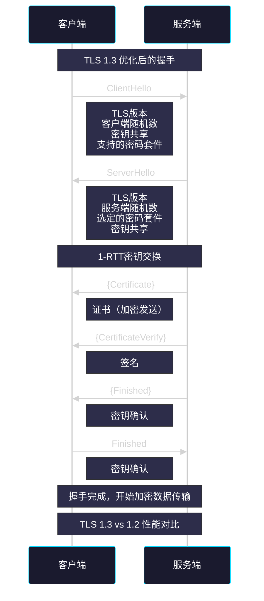

**TLS 1.3 的改进：**

| 特性 | TLS 1.2 | TLS 1.3 | 改进效果 |
|------|---------|---------|---------|
| 握手轮次 | 2-RTT | 1-RTT | 减少延迟50% |
| 加密时机 | 服务器证书后明文 | 握手全程加密 | 提高安全性 |
| 密码套件 | 37种可选 | 5种强制 | 简化配置，减少攻击面 |
| 0-RTT | 可选 | 支持 | 降低延迟（但有重放风险） |
| 前向保密 | 可选 | 必须 | 更好的安全性 |

**TLS 1.3 完整握手图示：**

```mermaid
%%{init: {'theme': 'dark', 'themeVariables': {
    'edgeLabelBackground': '#1a1a2e',
    'edgeColor': '#00d9ff',
    'lineColor': '#00d9ff',
    'textColor': '#ffffff',
    'nodeBorder': '#00d9ff',
    'fontFamily': 'Microsoft YaHei, sans-serif'
}}}%%
graph TB
    subgraph TLS 1.3 握手过程
        A["ClientHello<br/>key_share"] --> B["ServerHello<br/>key_share"]
        B --> C["Encrypted Extensions"]
        C --> D["Certificate<br/>加密"]
        D --> E["CertificateVerify<br/>签名"]
        E --> F["Finished<br/>密钥确认"]
        F --> G["加密数据传输"]
        G --> H["Application Data"]
    end

    subgraph 时间线
        T1["0ms"] --> T2["~50ms"]
        T2 --> T3["~100ms"]
        T3 --> T4["~150ms"]
    end

    style A fill:#0077b6,stroke:#00d9ff,color:#ffffff
    style B fill:#0077b6,stroke:#00d9ff,color:#ffffff
    style C fill:#7b2cbf,stroke:#e040fb,color:#ffffff
    style D fill:#7b2cbf,stroke:#e040fb,color:#ffffff
    style E fill:#7b2cbf,stroke:#e040fb,color:#ffffff
    style F fill:#7b2cbf,stroke:#e040fb,color:#ffffff
    style G fill:#2d6a4f,stroke:#00f5d4,color:#ffffff
    style H fill:#2d6a4f,stroke:#00f5d4,color:#ffffff
    style T1 fill:#2d2d4a,stroke:#4a4a6a,color:#ffffff
    style T2 fill:#2d2d4a,stroke:#4a4a6a,color:#ffffff
    style T3 fill:#2d2d4a,stroke:#4a4a6a,color:#ffffff
    style T4 fill:#2d2d4a,stroke:#4a4a6a,color:#ffffff
```

### 4.3.4 TLS 1.2 vs TLS 1.3 对比

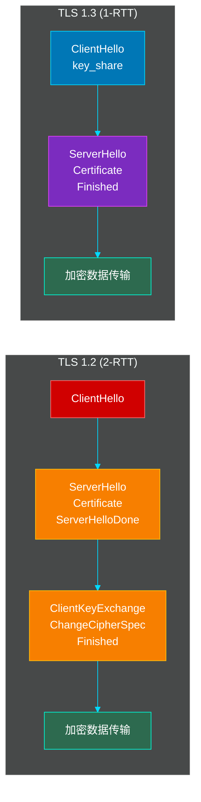

---

## 4.4 数字证书与PKI

### 4.4.1 数字证书原理

数字证书是用来证明公钥归属的身份凭证，基于PKI（Public Key Infrastructure，公开密钥基础设施）。

```
┌─────────────────────────────────────────────────────────────────┐
│                      数字证书结构                                │
├─────────────────────────────────────────────────────────────────┤
│                                                                 │
│  ┌─────────────────────────────────────────────────────────┐   │
│  │                     X.509 证书                          │   │
│  ├─────────────────────────────────────────────────────────┤   │
│  │ 版本: V3                                                  │   │
│  │ 序列号: 04:A5:B2:...                                     │   │
│  │ 签名算法: SHA256withRSA                                   │   │
│  │ 颁发者: DigiCert Inc                                     │   │
│  │ 有效期: 2024-01-01 至 2025-01-01                         │   │
│  │ 主体: www.example.com                                     │   │
│  │ 公钥: RSA 2048 bits                                      │   │
│  │ 扩展: SAN, KeyUsage, ...                                │   │
│  │                                                      ←───┼───│ CA签名
│  └─────────────────────────────────────────────────────────┘   │
│                                                                 │
└─────────────────────────────────────────────────────────────────┘
```

**证书各字段说明：**

| 字段 | 说明 | 示例 |
|------|------|------|
| Version | X.509版本，通常V3 | V3 |
| Serial Number | CA分配的唯一序列号 | 04:A5:B2:3C:D1 |
| Signature Algorithm | CA签名使用的算法 | SHA256withRSA |
| Issuer | 颁发者（CA）信息 | DigiCert Inc |
| Validity | 证书有效期 | 2024-01-01 至 2025-01-01 |
| Subject | 证书持有者信息 | www.example.com |
| Subject Public Key | 公钥信息 | RSA 2048位 |
| Extensions | 扩展信息 | SAN, KeyUsage等 |

### 4.4.2 证书类型

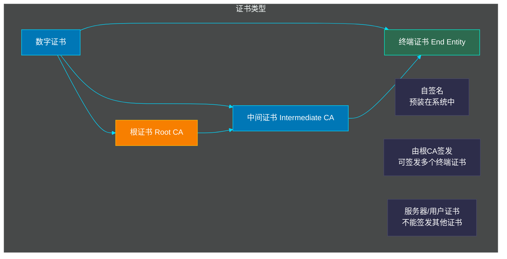

**三种证书类型：**

1. **根证书（Root Certificate）**
   - 自签名证书，预装在操作系统和浏览器中
   - 信任链的起点
   - 代表：如DigiCert Global Root

2. **中间证书（Intermediate Certificate）**
   - 由根CA签发
   - 可签发多个终端证书
   - 增加安全性：根CA私钥离线存储

3. **终端证书（End Entity Certificate）**
   - 服务器或用户使用的证书
   - 由中间CA签发
   - 不能签发其他证书

### 4.4.3 证书链验证

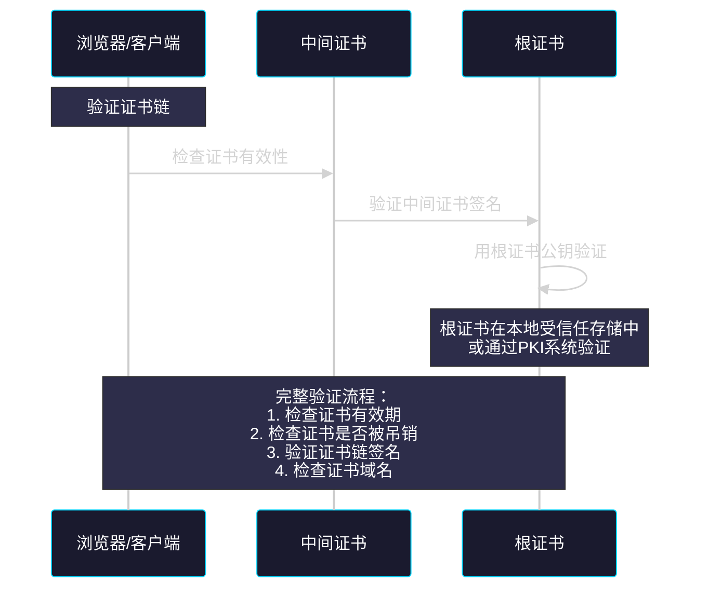

**证书链示例：**

```
证书链: www.example.com
│
├── Leaf: www.example.com (终端证书)
│   签发者: Let's Encrypt Authority X3
│   用中间CA私钥签名
│
├── Intermediate: Let's Encrypt Authority X3 (中间证书)
│   签发者: DST Root CA X3
│   用根CA私钥签名
│
└── Root: DST Root CA X3 (根证书)
    自签名，预装在系统中
```

### 4.4.4 OpenSSL查看证书信息

```bash
# 查看证书信息
openssl x509 -in certificate.pem -text -noout

# 查看证书序列号
openssl x509 -in certificate.pem -serial -noout

# 查看证书颁发者
openssl x509 -in certificate.pem -issuer -noout

# 查看证书主题
openssl x509 -in certificate.pem -subject -noout

# 查看证书有效期
openssl x509 -in certificate.pem -dates -noout

# 验证证书域名
openssl x509 -in certificate.pem -ext subjectAltName -noout

# 验证证书链
openssl verify -CAFile chain.pem server.pem

# 查看证书的指纹
openssl x509 -in certificate.pem -fingerprint -sha256 -noout
openssl x509 -in certificate.pem -fingerprint -sha1 -noout
```

---

## 4.5 证书验证流程

### 4.5.1 完整的证书验证过程

当客户端（如浏览器）连接HTTPS服务器时，会执行以下验证流程：

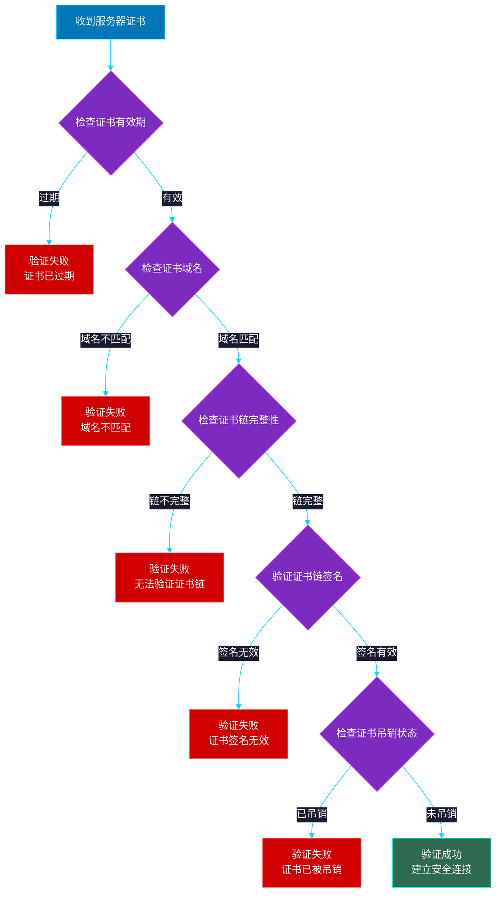

### 4.5.2 证书吊销检查

**CRL（证书吊销列表）：**

```
┌─────────────────────────────────────────────────────────────────┐
│                     CRL 机制                                     │
├─────────────────────────────────────────────────────────────────┤
│                                                                 │
│  CRL: 已被吊销的证书序列号列表                                   │
│                                                                 │
│  缺点：                                   │
│  - 文件可能很大                          │
│  - 客户端需要定期下载更新                │
│  - 无法实时检查                          │
│                                                                 │
└─────────────────────────────────────────────────────────────────┘
```

**OCSP（在线证书状态协议）：**

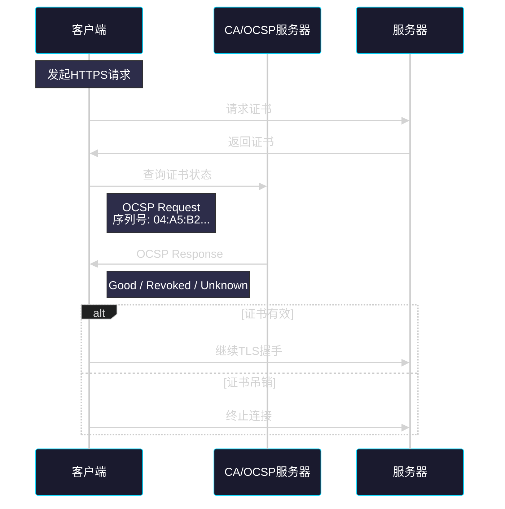

### 4.5.3 证书验证的代码示例

**使用OpenSSL验证证书链：**

```bash
# 下载证书链并验证
openssl s_client -connect www.example.com:443 -showcerts </dev/null

# 验证证书吊销状态
openssl ocsp -CAfile ca-bundle.crt \
    -issuer intermediate.crt \
    -cert server.crt \
    -url http://ocsp.example.com

# 验证证书域名匹配
openssl s_client -connect example.com:443 \
    -servername www.example.com
```

---

## 4.6 HTTPS连接建立完整流程

### 4.6.1 完整连接流程图

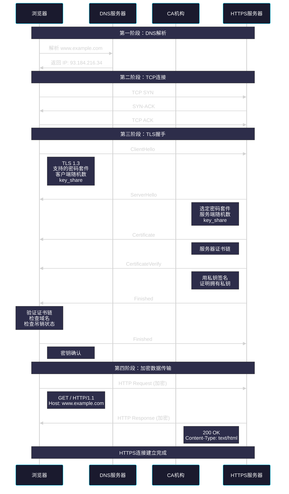

### 4.6.2 完整流程时序图

```
┌──────────────────────────────────────────────────────────────────────────────┐
│                         HTTPS 连接建立时序图                                  │
├──────────────────────────────────────────────────────────────────────────────┤
│                                                                              │
│  时间        浏览器                        服务器                            │
│  │           │                             │                                │
│  ├───────────┼─────────────────────────────┼─────────────────────────────►  │
│  │           │     1. DNS Query             │                                │
│  │           │────────────────────────────►│                                │
│  │           │                             │                                │
│  ├───────────┼◄────────────────────────────┼                                │
│  │           │     2. DNS Response         │                                │
│  │           │                             │                                │
│  ├───────────┼─────────────────────────────┼─────────────────────────────►  │
│  │           │     3. TCP SYN              │                                │
│  │           │────────────────────────────►│                                │
│  │           │                             │                                │
│  ├───────────┼◄────────────────────────────┼                                │
│  │           │     4. TCP SYN-ACK          │                                │
│  │           │                             │                                │
│  ├───────────┼─────────────────────────────┼─────────────────────────────►  │
│  │           │     5. TCP ACK              │                                │
│  │           │                             │                                │
│  ├───────────┼─────────────────────────────┼─────────────────────────────►  │
│  │           │     6. TLS ClientHello     │                                │
│  │           │     (TLS版本,随机数,        │                                │
│  │           │      密码套件,key_share)    │                                │
│  │           │                             │                                │
│  ├───────────┼◄────────────────────────────┼                                │
│  │           │     7. TLS ServerHello      │                                │
│  │           │     (选定密码套件,           │                                │
│  │           │      服务端随机数)         │                                │
│  │           │                             │                                │
│  ├───────────┼◄────────────────────────────┼                                │
│  │           │     8. Certificate          │                                │
│  │           │     (服务器证书链)         │                                │
│  │           │                             │                                │
│  ├───────────┼◄────────────────────────────┼                                │
│  │           │     9. CertificateVerify    │                                │
│  │           │     (签名)                  │                                │
│  │           │                             │                                │
│  ├───────────┼◄────────────────────────────┼                                │
│  │           │     10. Finished            │                                │
│  │           │     (密钥确认)              │                                │
│  │           │                             │                                │
│  │           │  ┌──────────────────┐       │                                │
│  │           │  │ 证书验证流程:   │       │                                │
│  │           │  │ 1. 验证签名    │       │                                │
│  │           │  │ 2. 验证域名    │       │                                │
│  │           │  │ 3. 验证有效期  │       │                                │
│  │           │  │ 4. 检查吊销    │       │                                │
│  │           │  └──────────────────┘       │                                │
│  │           │                             │                                │
│  ├───────────┼─────────────────────────────┼─────────────────────────────►  │
│  │           │     11. Finished            │                                │
│  │           │     (加密的握手摘要)        │                                │
│  │           │                             │                                │
│  ├════════───┼═════════════════════════════╪════════════════════════════►  │
│  │           │     12. Application Data    │                                │
│  │           │     (加密的HTTP请求)        │                                │
│  │           │                             │                                │
│  ├───────────┼◄────────────────────────────┼                                │
│  │           │     13. Application Data    │                                │
│  │           │     (加密的HTTP响应)        │                                │
│  │           │                             │                                │
└──────────────────────────────────────────────────────────────────────────────┘
```

---

## 4.7 工程实践

### 4.7.1 生成自签名证书

**使用OpenSSL生成自签名证书：**

```bash
# 1. 生成私钥
openssl genrsa -out server.key 2048

# 2. 生成证书签名请求(CSR)
openssl req -new -key server.key -out server.csr

# 3. 生成自签名证书（有效期365天）
openssl x509 -req -days 365 -in server.csr -signkey server.key -out server.crt

# 4. 查看生成的证书
openssl x509 -in server.crt -text -noout
```

**生成RSA 4096位证书（高安全等级）：**

```bash
# 生成RSA 4096位私钥
openssl genrsa -out server4096.key 4096

# 生成CSR
openssl req -new -key server4096.key -out server4096.csr

# 生成证书
openssl x509 -req -days 365 -in server4096.csr -signkey server4096.key -out server4096.crt
```

### 4.7.2 生成ECC证书

ECC（椭圆曲线密码学）使用更短的密钥提供相同的安全性：

```bash
# 1. 生成ECC私钥（P-256曲线）
openssl ecparam -genkey -name prime256v1 -out ecc.key

# 2. 生成CSR
openssl req -new -key ecc.key -out ecc.csr

# 3. 生成证书
openssl x509 -req -days 365 -in ecc.csr -signkey ecc.key -out ecc.crt

# 4. 查看证书信息（显示EC算法）
openssl x509 -in ecc.crt -text -noout | grep -A 2 "Subject Public Key"
```

### 4.7.3 生成带SAN的证书

SAN（Subject Alternative Name）允许一个证书绑定多个域名：

```bash
# 创建OpenSSL配置文件
cat > san.cnf << 'EOF'
[req]
distinguished_name = req_distinguished_name
req_extensions = v3_req
default_bits = 2048

[req_distinguished_name]
countryName = CN
stateOrProvinceName = Beijing
localityName = Beijing
organizationName = MyCompany
commonName = www.example.com

[v3_req]
keyUsage = keyEncipherment, dataEncipherment
extendedKeyUsage = serverAuth
subjectAltName = @alt_names

[alt_names]
DNS.1 = www.example.com
DNS.2 = example.com
DNS.3 = api.example.com
IP.1 = 192.168.1.1
EOF

# 生成私钥
openssl genrsa -out san.key 2048

# 生成CSR
openssl req -new -key san.key -out san.csr -config san.cnf

# 生成证书
openssl x509 -req -days 365 -in san.csr -signkey san.key -out san.crt -extensions v3_req -extfile san.cnf

# 验证SAN
openssl x509 -in san.crt -text -noout | grep -A 1 "Subject Alternative Name"
```

### 4.7.4 搭建本地CA并签发证书

```bash
# ==================== 创建本地CA ====================

# 1. 创建CA私钥
openssl genrsa -aes256 -out ca.key 4096

# 2. 创建CA证书（自签名）
openssl req -x509 -new -nodes -key ca.key -sha256 -days 3650 \
    -out ca.crt \
    -subj "/C=CN/ST=Beijing/L=Beijing/O=MyCA/CN=My Local CA"

# 3. 查看CA证书
openssl x509 -in ca.crt -text -noout

# ==================== 用CA签发证书 ====================

# 4. 创建服务器私钥
openssl genrsa -out server.key 2048

# 5. 创建服务器CSR
openssl req -new -key server.key -out server.csr \
    -subj "/C=CN/ST=Beijing/L=Beijing/O=MyCompany/CN=www.example.com"

# 6. 创建证书配置
cat > server_ext.cnf << 'EOF'
authorityKeyIdentifier=keyid,issuer
basicConstraints=CA:FALSE
keyUsage = digitalSignature, keyEncipherment
extendedKeyUsage = serverAuth
subjectAltName = @alt_names

[alt_names]
DNS.1 = www.example.com
DNS.2 = example.com
EOF

# 7. 用CA签发证书
openssl x509 -req -in server.csr -CA ca.crt -CAkey ca.key \
    -CAcreateserial -out server.crt \
    -days 365 -sha256 -extfile server_ext.cnf

# 8. 验证证书链
openssl verify -CAfile ca.crt server.crt

# 9. 查看完整证书链
openssl s_client -connect www.example.com:443 -showcerts </dev/null
```

### 4.7.5 配置Nginx HTTPS

```nginx
# /etc/nginx/conf.d/https.conf

server {
    listen 443 ssl http2;
    server_name www.example.com;

    # 证书配置（推荐使用ECC证书）
    ssl_certificate /etc/nginx/ssl/ecc.crt;
    ssl_certificate_key /etc/nginx/ssl/ecc.key;

    # 证书链（如果需要）
    # ssl_trusted_certificate /etc/nginx/ssl/ca.crt;

    # TLS协议版本（禁用1.0和1.1）
    ssl_protocols TLSv1.2 TLSv1.3;

    # 密码套件（TLS 1.3不需要配置）
    ssl_ciphers 'ECDHE-ECDSA-AES128-GCM-SHA256:ECDHE-RSA-AES128-GCM-SHA256';
    ssl_prefer_server_ciphers off;

    # 椭圆曲线（用于TLS 1.2）
    ssl_ecdh_curve prime256v1;

    # 会话票据（会话复用）
    ssl_session_timeout 1d;
    ssl_session_cache shared:SSL:50m;
    ssl_session_tickets off;

    # OCSP stapling（推荐启用）
    ssl_stapling on;
    ssl_stapling_verify on;
    resolver 8.8.8.8 8.8.4.4 valid=300s;
    resolver_timeout 5s;

    # 安全头
    add_header X-Frame-Options "SAMEORIGIN" always;
    add_header X-Content-Type-Options "nosniff" always;
    add_header X-XSS-Protection "1; mode=block" always;
    add_header Strict-Transport-Security "max-age=31536000; includeSubDomains" always;

    root /var/www/html;
    index index.html;

    location / {
        try_files $uri $uri/ =404;
    }
}

# HTTP重定向到HTTPS
server {
    listen 80;
    server_name www.example.com;
    return 301 https://$server_name$request_uri;
}
```

### 4.7.6 测试HTTPS配置

```bash
# 测试HTTPS连接
openssl s_client -connect www.example.com:443

# 测试特定TLS版本
openssl s_client -tls1_2 -connect www.example.com:443
openssl s_client -tls1_3 -connect www.example.com:443

# 测试证书链
openssl s_client -connect www.example.com:443 -showcerts

# 测试OCSP stapling
openssl s_client -connect www.example.com:443 -status

# 测试服务器证书信息
openssl s_client -connect www.example.com:443 -servername www.example.com </dev/null | \
    openssl x509 -text -noout

# 使用curl测试
curl -I https://www.example.com
curl -Iv https://www.example.com

# 使用wget测试
wget --no-check-certificate https://www.example.com
```

---

## 4.8 HTTPS性能优化

### 4.8.1 会话复用

会话复用允许客户端重用之前建立的TLS会话，避免完整的握手过程。

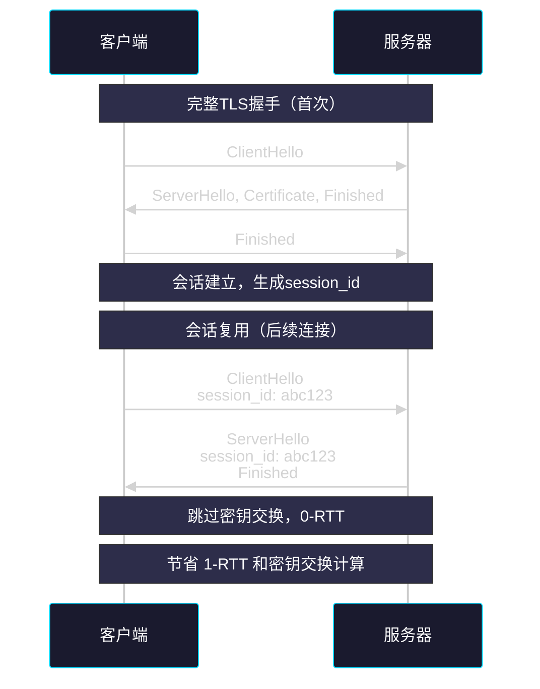

**两种会话复用机制：**

| 机制 | 原理 | 优点 | 缺点 |
|------|------|------|------|
| Session ID | 服务器保存会话状态 | 无需客户端存储 | 服务端内存压力 |
| Session Ticket | 服务器加密会话状态发给客户端 | 可扩展性好 | 需要加解密 |

**Nginx配置会话复用：**

```nginx
# 会话票据（推荐）
ssl_session_tickets on;
ssl_session_ticket_key /etc/nginx/ssl/ticket.key;

# 会话缓存
ssl_session_timeout 1d;
ssl_session_cache shared:SSL:50m;
```

### 4.8.2 HTTP/2多路复用

HTTP/2通过多路复用机制，可以在单个TCP连接上并行传输多个请求/响应：

```
┌─────────────────────────────────────────────────────────────────┐
│                    HTTP/1.1 vs HTTP/2                           │
├─────────────────────────────────────────────────────────────────┤
│                                                                 │
│  HTTP/1.1: 串行请求                                              │
│  ┌────┐ ┌────┐ ┌────┐ ┌────┐                                    │
│  │req1│ │req2│ │req3│ │req4│  顺序等待                          │
│  └──┬─┘ └────┘ └────┘ └────┘                                    │
│     ▼                                                          │
│  ┌────┐ ┌────┐ ┌────┐ ┌────┐                                    │
│  │resp1│ │resp2│ │resp3│ │resp4│                                  │
│  └────┘ └────┘ └────┘ └────┘                                    │
│                                                                 │
│  HTTP/2: 并行传输                                               │
│  ┌────┬────┬────┬────┐                                          │
│  │req1│req2│req3│req4│ 并行发送                                │
│  └────┴────┴────┴────┘                                          │
│       │                                                      │
│  ┌────┴────┬────┬────┐                                          │
│  │resp1│resp2│resp3│resp4│ 并行接收                            │
│  └────┴────┴────┴────┘                                          │
│                                                                 │
│  优势：减少TCP连接数，降低延迟                                   │
│                                                                 │
└─────────────────────────────────────────────────────────────────┘
```

**Nginx启用HTTP/2：**

```nginx
server {
    listen 443 ssl http2;
    # HTTP/2 需要 HTTPS
}
```

### 4.8.3 OCSP Stapling

OCSP Stapling将证书状态检查转移到服务器，减少客户端的延迟：

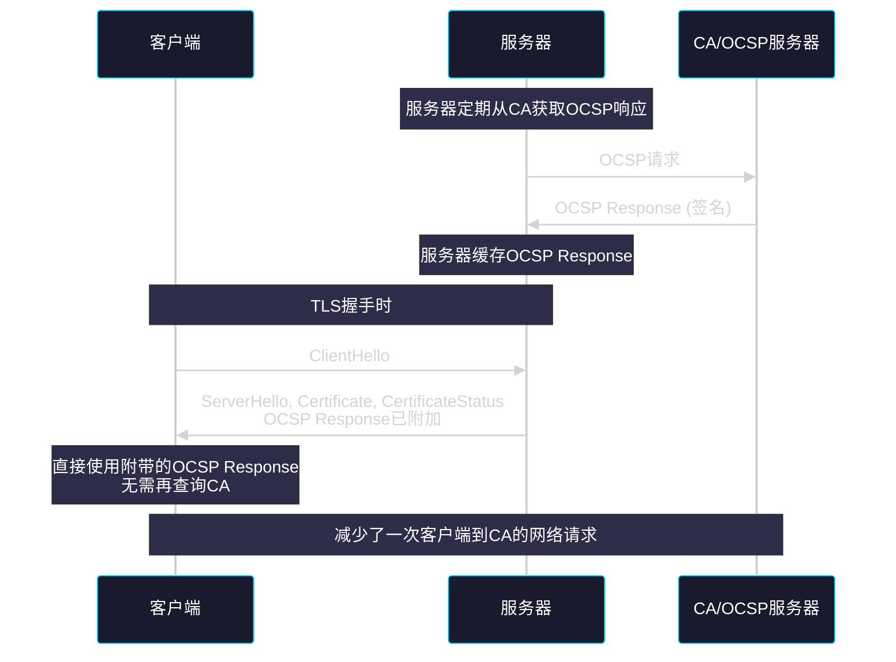

**Nginx启用OCSP Stapling：**

```nginx
ssl_stapling on;
ssl_stapling_verify on;
resolver 8.8.8.8 8.8.4.4 valid=300s;
resolver_timeout 5s;
```

### 4.8.4 其他优化措施

| 优化项 | 说明 | 配置建议 |
|-------|------|---------|
| 使用ECC证书 | 更短的密钥，更低的CPU开销 | prime256v1或secp384r1曲线 |
| 启用TLS 1.3 | 更快的握手（1-RTT） | ssl_protocols TLSv1.2 TLSv1.3 |
| 启用HTTP/2 | 多路复用，减少连接数 | listen 443 ssl http2 |
| 使用CDN | 就近接入，减少RTT | 将静态资源放到CDN |
| 优化证书链 | 减少握手时的数据传输 | 只包含必要的中间证书 |
| 启用Brotli压缩 | 比Gzip更高的压缩率 | brotli on |

**完整的优化配置示例：**

```nginx
# /etc/nginx/conf.d/optimized-https.conf

server {
    listen 443 ssl http2;
    server_name www.example.com;

    # 证书（ECC）
    ssl_certificate /etc/nginx/ssl/server.crt;
    ssl_certificate_key /etc/nginx/ssl/server.key;
    ssl_trusted_certificate /etc/nginx/ssl/ca.crt;

    # TLS配置
    ssl_protocols TLSv1.2 TLSv1.3;
    ssl_ciphers 'ECDHE-ECDSA-AES128-GCM-SHA256:ECDHE-RSA-AES128-GCM-SHA256';
    ssl_prefer_server_ciphers off;

    # 椭圆曲线
    ssl_ecdh_curve prime256v1;

    # 会话复用
    ssl_session_timeout 1d;
    ssl_session_cache shared:SSL:50m;
    ssl_session_tickets on;
    ssl_session_ticket_key /etc/nginx/ssl/ticket.key;

    # OCSP Stapling
    ssl_stapling on;
    ssl_stapling_verify on;
    resolver 8.8.8.8 8.8.4.4 valid=300s;
    resolver_timeout 5s;

    # 安全头
    add_header Strict-Transport-Security "max-age=31536000; includeSubDomains; preload" always;
    add_header X-Frame-Options "SAMEORIGIN" always;
    add_header X-Content-Type-Options "nosniff" always;
    add_header Referrer-Policy "strict-origin-when-cross-origin" always;

    # 压缩
    gzip on;
    gzip_types text/plain text/css application/json application/javascript;
    brotli on;
    brotli_types text/plain text/css application/json application/javascript;

    root /var/www/html;
    index index.html;
}
```

---

## 4.9 常见问题与排查

### 4.9.1 证书问题排查

```bash
# 1. 证书过期
openssl x509 -in cert.pem -dates -noout
# 输出: notBefore=Jan  1 00:00:00 2024 GMT
#       notAfter=Jan  1 00:00:00 2025 GMT

# 2. 证书链不完整
openssl s_client -connect www.example.com:443 -showcerts
# 检查是否包含完整的证书链

# 3. 域名不匹配
openssl s_client -connect example.com:443 -servername www.example.com

# 4. 自签名证书不被信任
# 方案A: 将证书加入系统信任存储
sudo cp cert.pem /usr/local/share/ca-certificates/
sudo update-ca-certificates

# 方案B: 让curl忽略证书验证（仅测试用）
curl -k https://self-signed.example.com
```

### 4.9.2 TLS配置问题排查

```bash
# 测试支持的TLS版本
openssl s_client -tls1_2 -connect www.example.com:443
openssl s_client -tls1_3 -connect www.example.com:443

# 测试密码套件
openssl s_client -connect www.example.com:443 -cipher 'ECDHE-RSA-AES128-GCM-SHA256'

# 列出所有支持的密码套件
openssl ciphers -v 'ECDHE:+RSA:+AES256:+SHA'

# 检查POODLE漏洞
openssl s_client -connect www.example.com:443 -ssl3
# 如果连接成功，说明存在漏洞

# 检查Heartbleed漏洞
openssl s_client -connect www.example.com:443 -tlsextdebug
# 然后发送: Q
```

### 4.9.3 使用在线工具检测

```bash
# 推荐使用以下在线工具检测HTTPS配置：
# - https://www.ssllabs.com/ssltest/
# - https://www.htbridge.com/ssl/
# - https://myssl.com/

# 命令行使用ssllabs API（如果有）
curl -s "https://api.ssllabs.com/api/v3/analyze?host=www.example.com&publish=off"
```

---

## 4.10 本章小结

### 4.10.1 核心概念回顾

```
┌─────────────────────────────────────────────────────────────────┐
│                      HTTPS 知识图谱                             │
├─────────────────────────────────────────────────────────────────┤
│                                                                 │
│   HTTPS                                                           │
│   ├── HTTP over TLS                                               │
│   ├── 三大特性: 加密、认证、完整性                                │
│   │                                                            │
│   ├── 加密技术                                                    │
│   │   ├── 对称加密: AES, ChaCha20                                │
│   │   ├── 非对称加密: RSA, ECDSA                                 │
│   │   └── 混合加密: 密钥交换用非对称，数据传输用对称               │
│   │                                                            │
│   ├── TLS协议                                                    │
│   │   ├── TLS 1.2: 2-RTT, RSA/DH密钥交换                        │
│   │   └── TLS 1.3: 1-RTT, 强制前向保密, 全程加密                 │
│   │                                                            │
│   ├── 数字证书                                                    │
│   │   ├── X.509格式                                              │
│   │   ├── 证书链: 根CA -> 中间CA -> 终端证书                      │
│   │   └── 验证: 签名、域名、有效期、吊销状态                      │
│   │                                                            │
│   └── 优化手段                                                    │
│       ├── 会话复用: Session ID / Session Ticket                  │
│       ├── HTTP/2多路复用                                         │
│       ├── OCSP Stapling                                          │
│       └── ECC证书                                                │
│                                                                 │
└─────────────────────────────────────────────────────────────────┘
```

### 4.10.2 关键知识点速查表

| 问题 | 答案 |
|------|------|
| HTTPS默认端口 | 443 |
| TLS 1.3握手次数 | 1-RTT |
| TLS 1.2握手次数 | 2-RTT |
| HTTPS三大特性 | 加密、认证、完整性 |
| 证书格式 | X.509 v3 |
| 根证书特点 | 自签名，预装在系统中 |
| 混合加密原理 | 密钥交换用非对称，数据传输用对称 |
| TLS 1.3强制要求 | 前向保密 |
| OCSP作用 | 在线检查证书是否吊销 |
| 证书链验证顺序 | 终端证书 -> 中间CA -> 根CA |

### 4.10.3 进一步学习

- **深入TLS**：阅读RFC 8446 (TLS 1.3)、RFC 5246 (TLS 1.2)
- **PKI标准**：阅读RFC 5280 (X.509 PKI)
- **密码学**：《应用密码学》、《深入理解密码学》
- **实际部署**：研究Let's Encrypt自动证书管理

---

*本章完*
