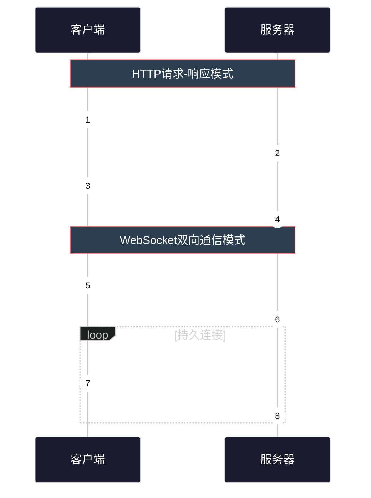
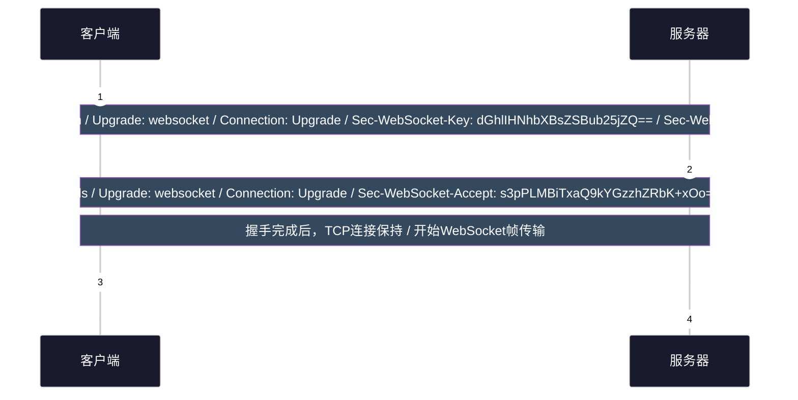
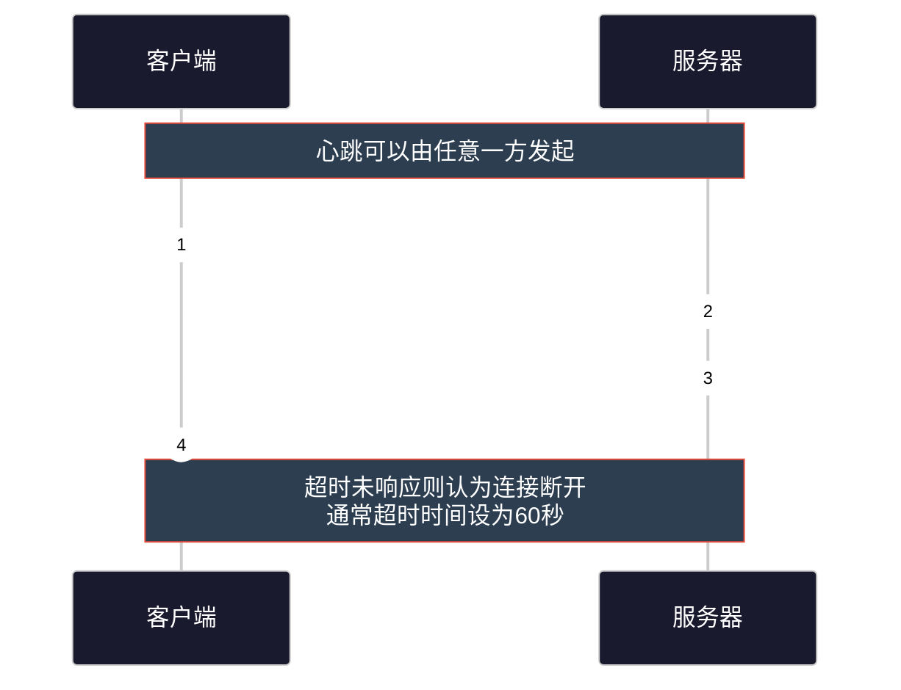
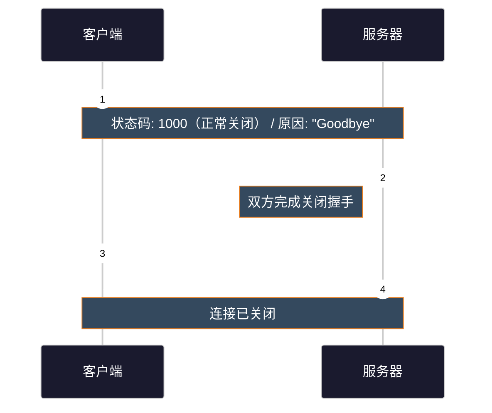
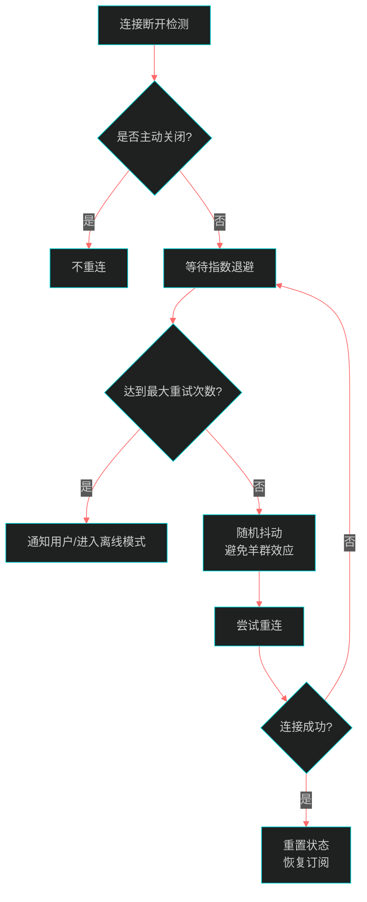
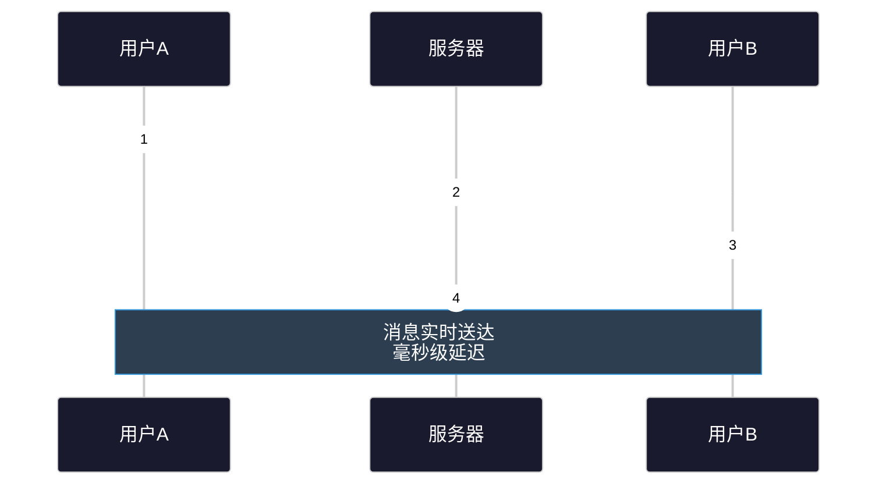
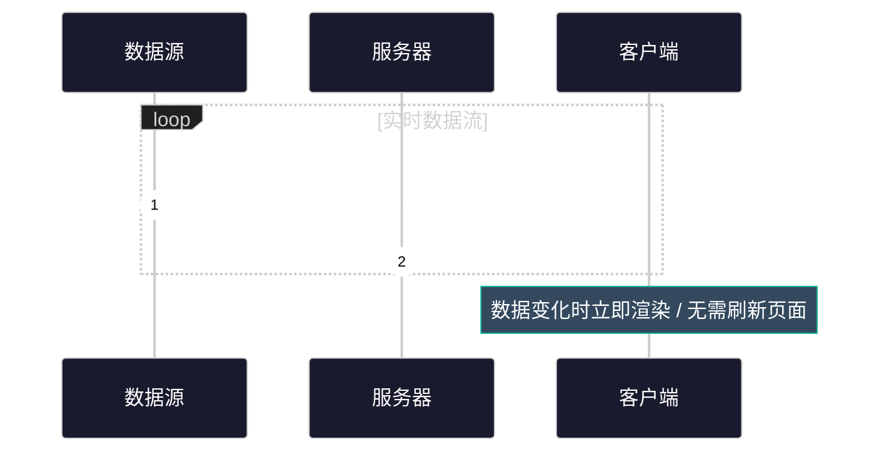
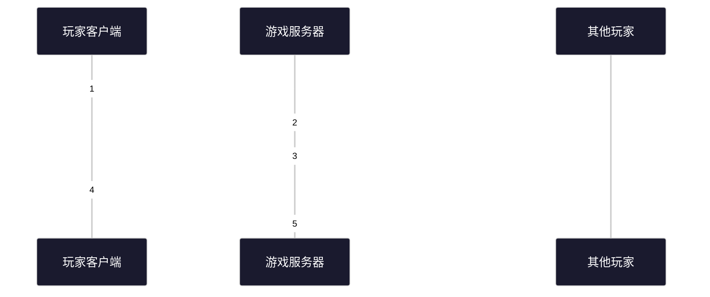

# WebSocket协议

## 1. 协议概述

### 1.1 什么是WebSocket

WebSocket是一种基于TCP的全双工通信协议，最初在RFC 6455中定义。它实现了客户端与服务器之间的持久连接，双方可以在任何时刻主动发送数据，无需像HTTP那样每次请求都需要重新建立连接。

WebSocket协议的设计目标是在Web浏览器和服务器之间提供低延迟、双向通信的能力，特别适用于需要实时数据更新的应用场景。

### 1.2 WebSocket与HTTP的核心区别

| 特性 | HTTP | WebSocket |
|------|------|-----------|
| 通信模式 | 请求-响应（半双工） | 双向通信（全双工） |
| 连接方式 | 每次请求新建连接 | 持久连接 |
| 数据格式 | 请求/响应成对 | 帧（Frame） |
| 服务器推送 | 需要轮询或长轮询 | 原生支持 |
| 头部开销 | 每次请求携带完整头部 | 仅首次握手需要头部 |
| 延迟 | 较高（每次新建连接） | 低（保持连接） |



### 1.3 WebSocket在OSI模型中的位置

```
┌─────────────────────────────────────────┐
│           应用层 (Application)           │
│         HTTP / WebSocket / FTP          │
├─────────────────────────────────────────┤
│           表示层 (Presentation)          │
│          TLS / SSL / 数据编解码          │
├─────────────────────────────────────────┤
│           会话层 (Session)               │
│        WebSocket会话管理 / TLS           │
├─────────────────────────────────────────┤
│           传输层 (Transport)             │
│              TCP / UDP                  │
├─────────────────────────────────────────┤
│           网络层 (Network)               │
│               IP                        │
└─────────────────────────────────────────┘
```

WebSocket通常使用TCP的80端口（ws://）或443端口（wss://），与HTTP/HTTPS共享端口。

---

## 2. 协议原理

### 2.1 WebSocket握手流程

WebSocket握手采用HTTP的Upgrade机制，将HTTP连接升级为WebSocket连接。



#### 客户端握手请求头部

| 头部字段 | 说明 | 示例 |
|----------|------|------|
| Upgrade | 必须设置为"websocket" | Upgrade: websocket |
| Connection | 必须设置为"Upgrade" | Connection: Upgrade |
| Sec-WebSocket-Key | Base64编码的16字节随机数 | dGhlIHNhbXBsZSBub25jZQ== |
| Sec-WebSocket-Version | 协议版本，当前为13 | 13 |
| Sec-WebSocket-Protocol | 可选，子协议协商 | chat, game |
| Origin | 请求来源（安全考量） | http://example.com |

#### 服务器握手响应

服务器收到请求后：
1. 验证`Sec-WebSocket-Key`
2. 计算`Sec-WebSocket-Accept`：
   ```
   Sec-WebSocket-Accept = BASE64(SHA1(Sec-WebSocket-Key + "258EAFA5-E914-47DA-95CA-C5AB0DC85B11"))
   ```
3. 返回101状态码和对应头部

### 2.2 WebSocket帧格式

WebSocket协议使用帧（Frame）作为基本传输单元。

```
┌─────────────── 帧首部 ────────────────┬───────────── 载荷 ───────────────┐
│  FIN  │ RSV1-3  │   Opcode   │ MASK │   Payload Len   │ Extended Length  │
│  1bit │  3bits  │   4bits    │ 1bit │     7bits       │   0/8/64bits     │
├────────┴─────────┴──────────────┴──────┴─────────────────┴─────────────────┤
│                              │                  │                          │
│         帧控制信息            │    掩码密钥       │          应用数据         │
│                              │   (若MASK=1)     │     (Payload Data)       │
└──────────────────────────────┴──────────────────┴──────────────────────────┘
```

#### 首部字段详解

| 字段 | 位数 | 说明 |
|------|------|------|
| FIN | 1bit | 1=这是消息的最后一帧，0=还有后续帧 |
| RSV1-3 | 3bits | 扩展用，默认必须为0 |
| Opcode | 4bits | 帧类型 |
| MASK | 1bit | 1=载荷被掩码，客户端→服务器必须为1 |
| Payload Len | 7bits | 载荷长度（0-125） |
| Extended Length | 0/8/64bits | 扩展长度（载荷>125时使用） |

#### Opcode类型

| Opcode | 名称 | 说明 |
|--------|------|------|
| 0x0 | CONTINUATION | 继续传输分片消息 |
| 0x1 | TEXT | 文本帧（UTF-8） |
| 0x2 | BINARY | 二进制帧 |
| 0x8 | CLOSE | 关闭连接 |
| 0x9 | PING | 心跳请求 |
| 0xA | PONG | 心跳响应 |

#### 掩码机制

客户端发送给服务器的所有帧必须使用掩码（MASK=1），服务器发送给客户端的帧不使用掩码（MASK=0）。

掩码计算：
```javascript
// 掩码密钥：4字节随机数
// 载荷与密钥逐字节XOR运算
for (i = 0; i < payload.length; i++) {
    maskedData[i] = payload[i] ^ maskingKey[i % 4];
}
```

### 2.3 分片传输（Fragmentation）

当消息过大或需要流式传输时，WebSocket支持分片：

```
┌─────────────────────────────────────────────────────────────┐
│  消息: "Hello, WebSocket!" (15字节)                          │
├─────────────────────────────────────────────────────────────┤
│  分片1: FIN=0, Opcode=0x1, Payload="Hello, "                │
│  分片2: FIN=0, Opcode=0x0, Payload="WebSocket "             │
│  分片3: FIN=1, Opcode=0x0, Payload="World!"                 │
└─────────────────────────────────────────────────────────────┘
```

规则：
- 第一个分片：Opcode=实际类型（0x1文本/0x2二进制），FIN=0
- 中间分片：Opcode=0x0（CONTINUATION），FIN=0
- 最后分片：Opcode=0x0，FIN=1

---

## 3. 心跳机制（Ping/Pong）

WebSocket内置心跳机制用于检测连接存活状态。



应用场景：
- 保活（Keep-Alive）：防止空闲连接被中间设备关闭
- 延迟检测：测量RTT
- 连接状态监控

---

## 4. 连接关闭

### 4.1 正常关闭流程



### 4.2 关闭状态码

| 状态码 | 名称 | 说明 |
|--------|------|------|
| 1000 | CLOSE_NORMAL | 正常关闭 |
| 1001 | CLOSE_GOING_AWAY | 服务器将关闭 |
| 1002 | CLOSE_PROTOCOL_ERROR | 协议错误 |
| 1003 | CLOSE_UNSUPPORTED | 不支持的数据类型 |
| 1005 | CLOSE_NO_STATUS | 保留，禁止传输 |
| 1006 | CLOSE_ABNORMAL | 异常关闭（禁止发送） |
| 1007 | Invalid payload | 数据格式错误 |
| 1008 | Policy violation | 策略违规 |
| 1009 | Message too big | 消息过大 |
| 1010 | Required extension | 需要扩展 |
| 1011 | Unexpected condition | 服务器内部错误 |

---

## 5. 断线重连策略

### 5.1 断开原因

常见的断线原因：
- 网络波动（移动网络切换WiFi）
- NAT超时（运营商网关清理空闲连接）
- 中间代理断开
- 服务器重启
- 恶意攻击

### 5.2 重连策略设计



推荐的重连参数：

```javascript
const reconnectConfig = {
    initialDelay: 1000,      // 初始延迟 1秒
    maxDelay: 30000,          // 最大延迟 30秒
    maxRetries: 10,          // 最大重试次数
    jitter: 0.3               // 抖动系数 30%
};

// 计算下次重连延迟
function getReconnectDelay(attempt) {
    const exponentialDelay = Math.min(
        config.initialDelay * Math.pow(2, attempt),
        config.maxDelay
    );
    const jitter = exponentialDelay * config.jitter * Math.random();
    return exponentialDelay + jitter;
}
```

---

## 6. 适用场景

### 6.1 聊天应用



优势：相比轮询，减少服务器负载和网络流量。

### 6.2 实时数据看板

适用场景：
- 股票行情交易系统
- 实时监控系统
- 在线游戏状态
- IoT设备数据采集



### 6.3 在线游戏

对于实时性要求高的游戏：
- 帧同步：每帧状态同步
- 位置同步：玩家移动
- 战斗数据：技能释放、伤害计算



---

## 7. 工程实现

### 7.1 Node.js - ws库

ws是Node.js生态中最流行的WebSocket库。

#### 安装

```bash
npm install ws
```

#### 服务器端

```javascript
const WebSocket = require('ws');

const server = new WebSocket.Server({ port: 8080 });

// 广播消息给所有客户端
function broadcast(data, excludeWs = null) {
    server.clients.forEach(client => {
        if (client !== excludeWs && client.readyState === WebSocket.OPEN) {
            client.send(JSON.stringify(data));
        }
    });
}

server.on('connection', (ws, req) => {
    const clientIp = req.socket.remoteAddress;
    console.log(`客户端连接: ${clientIp}`);

    // 发送欢迎消息
    ws.send(JSON.stringify({ type: 'welcome', message: '连接成功' }));

    // 处理消息
    ws.on('message', (data) => {
        try {
            const message = JSON.parse(data);
            console.log('收到消息:', message);

            switch (message.type) {
                case 'chat':
                    broadcast({ type: 'chat', user: clientIp, text: message.text });
                    break;
                case 'ping':
                    ws.send(JSON.stringify({ type: 'pong', timestamp: Date.now() }));
                    break;
            }
        } catch (e) {
            console.error('消息解析失败:', e);
        }
    });

    // 处理关闭
    ws.on('close', () => {
        console.log('客户端断开');
        broadcast({ type: 'system', message: '有用户离开' });
    });

    // 处理错误
    ws.on('error', (error) => {
        console.error('WebSocket错误:', error);
    });

    // 心跳保活（应用层）
    ws.isAlive = true;
    ws.on('pong', () => { ws.isAlive = true; });
});

// 心跳检测（每30秒）
const heartbeatInterval = setInterval(() => {
    server.clients.forEach(ws => {
        if (ws.isAlive === false) {
            console.log('终止无效连接');
            return ws.terminate();
        }
        ws.isAlive = false;
        ws.ping();
    });
}, 30000);

server.on('close', () => {
    clearInterval(heartbeatInterval);
});

console.log('WebSocket服务器启动: ws://localhost:8080');
```

#### 客户端

```javascript
const WebSocket = require('ws');

class WebSocketClient {
    constructor(url) {
        this.url = url;
        this.ws = null;
        this.reconnectAttempts = 0;
        this.maxReconnectAttempts = 10;
        this.reconnectDelay = 1000;
    }

    connect() {
        this.ws = new WebSocket(this.url);

        this.ws.on('open', () => {
            console.log('连接已建立');
            this.reconnectAttempts = 0;
            this.startHeartbeat();
        });

        this.ws.on('message', (data) => {
            try {
                const message = JSON.parse(data);
                this.handleMessage(message);
            } catch (e) {
                console.error('消息解析失败:', e);
            }
        });

        this.ws.on('close', (code, reason) => {
            console.log(`连接关闭: ${code} - ${reason}`);
            this.stopHeartbeat();
            this.reconnect();
        });

        this.ws.on('error', (error) => {
            console.error('WebSocket错误:', error);
        });
    }

    handleMessage(message) {
        switch (message.type) {
            case 'welcome':
                console.log('收到欢迎消息:', message.message);
                break;
            case 'chat':
                console.log(`[${message.user}] ${message.text}`);
                break;
            case 'pong':
                console.log('心跳响应延迟:', Date.now() - message.timestamp, 'ms');
                break;
        }
    }

    send(data) {
        if (this.ws && this.ws.readyState === WebSocket.OPEN) {
            this.ws.send(JSON.stringify(data));
        }
    }

    reconnect() {
        if (this.reconnectAttempts >= this.maxReconnectAttempts) {
            console.log('达到最大重连次数');
            return;
        }

        this.reconnectAttempts++;
        const delay = Math.min(
            this.reconnectDelay * Math.pow(2, this.reconnectAttempts - 1),
            30000
        );

        console.log(`${delay}ms后尝试第${this.reconnectAttempts}次重连...`);
        setTimeout(() => this.connect(), delay);
    }

    startHeartbeat() {
        this.heartbeatTimer = setInterval(() => {
            this.send({ type: 'ping', timestamp: Date.now() });
        }, 5000);
    }

    stopHeartbeat() {
        if (this.heartbeatTimer) {
            clearInterval(this.heartbeatTimer);
            this.heartbeatTimer = null;
        }
    }

    close() {
        this.maxReconnectAttempts = 0; // 防止重连
        this.stopHeartbeat();
        this.ws?.close();
    }
}

// 使用
const client = new WebSocketClient('ws://localhost:8080');
client.connect();

// 发送消息
setTimeout(() => {
    client.send({ type: 'chat', text: 'Hello, WebSocket!' });
}, 1000);

// 关闭连接
// client.close();
```

### 7.2 Python - websockets库

websockets是Python中功能完善的异步WebSocket库。

#### 安装

```bash
pip install websockets
```

#### 服务器端

```python
import asyncio
import json
from datetime import datetime
from websockets.server import serve

# 连接的客户端
connected_clients = set()


async def broadcast(message: dict, exclude=None):
    """广播消息给所有客户端"""
    for client in connected_clients:
        if client != exclude:
            try:
                await client.send(json.dumps(message))
            except Exception as e:
                print(f"发送失败: {e}")


async def handle_client(websocket):
    """处理客户端连接"""
    connected_clients.add(websocket)
    client_addr = websocket.remote_address
    print(f"客户端连接: {client_addr}")

    try:
        # 发送欢迎消息
        await websocket.send(json.dumps({
            "type": "welcome",
            "message": "连接成功",
            "timestamp": datetime.now().isoformat()
        }))

        # 广播用户加入
        await broadcast({
            "type": "system",
            "message": f"用户 {client_addr} 加入"
        }, exclude=websocket)

        # 消息处理循环
        async for raw_message in websocket:
            try:
                message = json.loads(raw_message)
                await process_message(websocket, message)
            except json.JSONDecodeError:
                await websocket.send(json.dumps({
                    "type": "error",
                    "message": "无效的JSON格式"
                }))

    except websockets.exceptions.ConnectionClosedOK:
        print(f"客户端正常关闭: {client_addr}")
    except websockets.exceptions.ConnectionClosedError:
        print(f"客户端异常关闭: {client_addr}")
    finally:
        connected_clients.discard(websocket)
        await broadcast({
            "type": "system",
            "message": f"用户 {client_addr} 离开"
        })


async def process_message(websocket, message: dict):
    """处理不同类型的消息"""
    msg_type = message.get("type")

    if msg_type == "chat":
        # 广播聊天消息
        await broadcast({
            "type": "chat",
            "user": str(websocket.remote_address),
            "text": message.get("text", ""),
            "timestamp": datetime.now().isoformat()
        })

    elif msg_type == "ping":
        # 响应心跳
        await websocket.send(json.dumps({
            "type": "pong",
            "timestamp": message.get("timestamp")
        }))

    elif msg_type == "broadcast":
        # 系统广播
        await broadcast({
            "type": "broadcast",
            "text": message.get("text", ""),
            "sender": str(websocket.remote_address)
        })


async def main():
    async with serve(handle_client, "localhost", 8080):
        print("WebSocket服务器启动: ws://localhost:8080")
        await asyncio.Future()  # 永久运行


if __name__ == "__main__":
    asyncio.run(main())
```

#### 客户端

```python
import asyncio
import json
from websockets.client import connect


class WebSocketClient:
    def __init__(self, uri: str):
        self.uri = uri
        self.websocket = None
        self.running = True

    async def connect(self):
        """连接服务器"""
        self.websocket = await connect(self.uri)
        print(f"连接到 {self.uri}")

    async def receive_messages(self):
        """接收消息"""
        try:
            async for raw_message in self.websocket:
                message = json.loads(raw_message)
                self.handle_message(message)
        except Exception as e:
            print(f"接收消息出错: {e}")

    def handle_message(self, message: dict):
        """处理接收到的消息"""
        msg_type = message.get("type")

        if msg_type == "welcome":
            print(f"[系统] {message.get('message')}")

        elif msg_type == "chat":
            user = message.get("user", "未知")
            text = message.get("text", "")
            print(f"[{user}] {text}")

        elif msg_type == "pong":
            print(f"[心跳] 响应时间: {message.get('timestamp')}")

        elif msg_type == "system":
            print(f"[系统] {message.get('message')}")

    async def send_message(self, data: dict):
        """发送消息"""
        if self.websocket:
            await self.websocket.send(json.dumps(data))

    async def close(self):
        """关闭连接"""
        self.running = False
        if self.websocket:
            await self.websocket.close()


async def main():
    client = WebSocketClient("ws://localhost:8080")

    try:
        await client.connect()

        # 同时运行接收和发送
        receive_task = asyncio.create_task(client.receive_messages())

        # 模拟发送消息
        await asyncio.sleep(1)
        await client.send_message({
            "type": "chat",
            "text": "你好，WebSocket！"
        })

        await asyncio.sleep(2)
        await client.send_message({
            "type": "ping",
            "timestamp": 1234567890
        })

        # 保持连接
        await asyncio.sleep(10)

    except KeyboardInterrupt:
        print("\n用户中断")
    finally:
        await client.close()


if __name__ == "__main__":
    asyncio.run(main())
```

---

## 8. 安全性考虑

### 8.1 使用WSS（WebSocket Secure）

生产环境必须使用WSS（基于TLS的WebSocket），否则：
- 数据明文传输，容易被窃听
- 中间人攻击风险
- 无法通过代理

```
ws://example.com/chat    # 不安全
wss://example.com/chat   # 安全（加密）
```

### 8.2 验证Origin头部

服务器应验证Origin头部，防止跨站WebSocket劫持（CSWSH）。

```javascript
const server = new WebSocket.Server({
    port: 8080,
    verifyClient: (info, done) => {
        const origin = info.origin;
        const allowedOrigins = ['http://localhost:3000', 'https://example.com'];

        if (allowedOrigins.includes(origin)) {
            done(true); // 允许连接
        } else {
            console.warn(`拒绝非法Origin: ${origin}`);
            done(false, 403, 'Forbidden');
        }
    }
});
```

### 8.3 输入验证

- 验证消息格式和类型
- 限制消息大小
- 清理用户输入（防止XSS）

```javascript
const MAX_MESSAGE_SIZE = 64 * 1024; // 64KB

ws.on('message', (data) => {
    if (data.length > MAX_MESSAGE_SIZE) {
        ws.close(1009, 'Message too big');
        return;
    }

    // 解析和验证JSON
    try {
        const message = JSON.parse(data);
        if (typeof message.text !== 'string') {
            throw new Error('Invalid message format');
        }
        // 清理HTML标签
        message.text = message.text.replace(/<[^>]*>/g, '');
    } catch (e) {
        ws.close(1007, 'Invalid payload');
    }
});
```

### 8.4 速率限制

防止恶意客户端发送大量消息耗尽服务器资源。

```javascript
const rateLimit = new Map(); // clientId -> { count, resetTime }

function checkRateLimit(clientId, maxMessages = 100, windowMs = 60000) {
    const now = Date.now();
    const clientData = rateLimit.get(clientId) || { count: 0, resetTime: now + windowMs };

    if (now > clientData.resetTime) {
        clientData.count = 1;
        clientData.resetTime = now + windowMs;
        rateLimit.set(clientId, clientData);
        return true;
    }

    if (clientData.count >= maxMessages) {
        return false;
    }

    clientData.count++;
    rateLimit.set(clientId, clientData);
    return true;
}
```

### 8.5 认证与授权

WebSocket握手时进行身份验证。

```javascript
server.on('connection', (ws, req) => {
    // 从Cookie或查询参数获取token
    const url = new URL(req.url, 'http://localhost');
    const token = url.searchParams.get('token') || req.headers.cookie?.split('=')[1];

    if (!validateToken(token)) {
        ws.close(1008, 'Unauthorized');
        return;
    }

    // 将用户信息附加到连接
    ws.userId = getUserIdFromToken(token);
    ws.username = getUsernameFromToken(token);
});
```

---

## 9. 常见问题与调试

### 9.1 连接失败排查

| 问题 | 可能原因 | 解决方案 |
|------|----------|----------|
| 握手失败 | 协议错误、Key不正确 | 检查握手头部格式 |
| 连接被拒绝 | 防火墙、端口未开放 | 检查网络和服务器状态 |
| 连接立即断开 | 认证失败、协议不匹配 | 检查服务器日志 |
| 心跳超时 | 网络不稳定、服务器负载高 | 调整超时时间、增加重连 |

### 9.2 调试工具

使用浏览器开发者工具：
1. 打开Network标签
2. 筛选WebSocket连接（ws://或wss://）
3. 查看Frames子标签可看到收发消息

Chrome扩展推荐：
- WebSocket Test Client
- Advanced REST client

命令行工具：
```bash
# 使用wscat
npm install -g wscat
wscat -c ws://localhost:8080
```

### 9.3 性能优化建议

1. **消息压缩**：启用 permessage-deflate 扩展
2. **二进制传输**：结构化数据使用二进制帧而非JSON
3. **批量发送**：合并小消息减少帧数量
4. **连接池**：合理复用连接

```javascript
// 启用压缩
const server = new WebSocket.Server({
    port: 8080,
    perMessageDeflate: {
        threshold: 1024, // 超过1KB的消息压缩
    }
});
```

---

## 10. 总结

WebSocket协议是现代实时Web应用的基础协议，它：

1. **全双工通信**：突破HTTP请求-响应模式的限制
2. **低延迟**：避免反复建立连接的开销
3. **轻量级帧**：相比HTTP头部开销更小
4. **原生支持**：现代浏览器和服务器均原生支持

适用场景总结：
- 聊天应用、协作工具
- 实时数据监控、股票行情
- 在线游戏
- IoT设备控制
- 消息推送

注意事项：
- 始终使用WSS保障安全
- 实现心跳机制保持连接
- 设计合理的断线重连策略
- 做好输入验证和速率限制

---

## 参考资料

- RFC 6455 - The WebSocket Protocol
- MDN Web Docs - WebSocket
- WebSocket API - W3C

---
