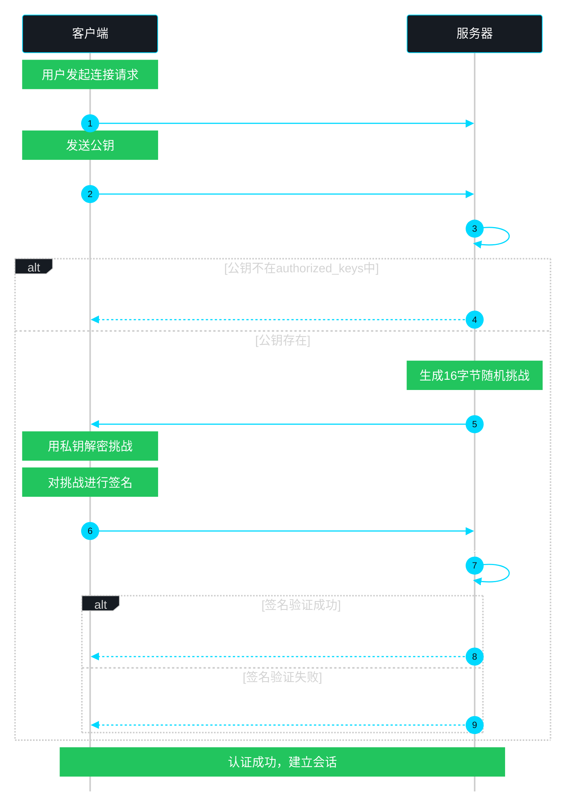

# SSH协议

## 1. 协议概述

### 1.1 什么是SSH

SSH（Secure Shell，安全外壳协议）是一种加密的网络传输协议，用于在不安全的网络中提供安全的远程登录和其他网络服务。SSH通过加密技术解决了Telnet、FTP等传统协议明文传输的安全隐患。

**核心特点：**
- 加密传输：所有通信内容均经过加密，无法被窃听
- 身份认证：支持多种认证方式，确保用户身份可靠
- 数据完整性：使用MAC（Message Authentication Code）保证数据不被篡改
- 端口转发：支持加密通道功能，可安全传输其他协议

**协议基本信息：**
| 属性 | 值 |
|------|-----|
| 默认端口 | 22 |
| OSI层级 | 应用层（第7层） |
| 传输协议 | TCP |
| 加密算法 | AES、ChaCha20、3DES等 |
| 密钥交换 | Diffie-Hellman、ECDH等 |

### 1.2 SSH vs Telnet

Telnet是早期的远程登录协议，因其明文传输特性存在严重安全风险。SSH作为其安全替代品，在设计之初就考虑了安全性问题。

```
┌─────────────────────────────────────────────────────────────────┐
│                        Telnet vs SSH 对比                        │
├─────────────────────┬─────────────────────┬─────────────────────┤
│       特性          │       Telnet         │        SSH          │
├─────────────────────┼─────────────────────┼─────────────────────┤
│     传输方式        │     明文传输         │     加密传输         │
├─────────────────────┼─────────────────────┼─────────────────────┤
│     默认端口        │       23             │        22            │
├─────────────────────┼─────────────────────┼─────────────────────┤
│     认证方式        │   用户名/密码明文    │   多种加密认证       │
├─────────────────────┼─────────────────────┼─────────────────────┤
│     数据完整性      │      无             │      MAC校验        │
├─────────────────────┼─────────────────────┼─────────────────────┤
│     端口转发          │      不支持          │      支持           │
├─────────────────────┼─────────────────────┼─────────────────────┤
│     安全性          │      危险           │      安全           │
└─────────────────────┴─────────────────────┴─────────────────────┘
```

**Telnet明文传输风险示意：**
```
攻击者可以在网络上轻易捕获Telnet通信，获取用户名和密码：

正常登录：  Client ─── 用户名/密码(明文) ───> Server
                │
                └── 攻击者可以轻易截获 ───> 密码: mypassword

SSH加密传输：
Client ─── 加密数据 ───> Server
       (攻击者只能看到密文)
```

### 1.3 SSH协议版本

SSH协议经历了两个主要版本的演进：

**SSH-1（1995年）**
- 最初版本，由Tatu Ylonen开发
- 支持Diffie-Hellman密钥交换
- 存在一些设计缺陷，已被废弃
- 不建议使用

**SSH-2（2006年）**
- 目前的现行标准（RFC 4251-4256）
- 安全性更高，修复了SSH-1的漏洞
- 支持更快的密钥交换算法
- 支持多种认证方式
- 支持AES和ChaCha20-Poly1305等现代加密算法

**版本检测：**
```bash
# 查看SSH版本
ssh -V
OpenSSH_8.9p1, OpenSSL 3.0.2

# 强制使用特定版本连接
ssh -1 user@host    # SSH-1（已废弃）
ssh -2 user@host     # SSH-2（推荐）
```

---

## 2. 协议原理

### 2.1 SSH协议架构

SSH协议采用分层设计，由三个子协议组成：

```
┌─────────────────────────────────────────────────────────────────┐
│                        SSH协议架构                              │
├─────────────────────────────────────────────────────────────────┤
│                                                                 │
│   ┌───────────────┐                                             │
│   │  应用层       │  用户认证协议 (SSH-AUTH)                     │
│   │  (用户接口)   │  - 密码认证                                   │
│   │               │  - 密钥认证                                   │
│   │               │  - 键盘交互认证                               │
│   └───────────────┘                                             │
│                                                                 │
│   ┌───────────────┐                                             │
│   │  连接协议      │  SSH连接协议 (SSH-CONN)                      │
│   │  (通道复用)    │  - 会话通道                                   │
│   │               │  - 端口转发                                   │
│   │               │  - X11转发                                    │
│   └───────────────┘                                             │
│                                                                 │
│   ┌───────────────┐                                             │
│   │  传输层        │  SSH传输协议 (SSH-TRANS)                      │
│   │  (加密通道)    │  - 加密算法协商                               │
│   │               │  - 密钥交换                                   │
│   │               │  - 数据加密/解密                              │
│   └───────────────┘                                             │
│                                                                 │
└─────────────────────────────────────────────────────────────────┘
```

### 2.2 SSH连接建立流程

SSH连接建立分为多个阶段，涉及密钥协商、认证等步骤。

```
┌─────────────────────────────────────────────────────────────────┐
│                    SSH连接建立流程                               │
└─────────────────────────────────────────────────────────────────┘

    客户端                                        服务器
      │                                              │
      │  1. TCP连接建立 (端口22)                       │
      │ ─────────────────────────────────────────────>│
      │                                              │
      │  2. 版本协商 (SSH-2.0)                        │
      │ <─────────────────────────────────────────────>
      │                                              │
      │  3. 密钥交换初始化                            │
      │ ─────────────────────────────────────────────>│
      │                                              │
      │  4. 密钥交换 (Diffie-Hellman/ECDH)            │
      │ <─────────────────────────────────────────────>
      │                                              │
      │  5. 加密算法协商                              │
      │ ─────────────────────────────────────────────>│
      │                                              │
      │  6. 建立安全通道                              │
      │ <─────────────────────────────────────────────>
      │                                              │
      │  7. 用户认证                                  │
      │ ─────────────────────────────────────────────>│
      │                                              │
      │  8. 认证成功，建立会话                        │
      │ <─────────────────────────────────────────────>
      │                                              │
      │  9. 开始数据传输                              │
      │ <─────────────────────────────────────────────>
```

### 2.3 密钥交换过程详解

SSH-2的密钥交换过程采用Diffie-Hellman（DH）或Elliptic Curve Diffie-Hellman（ECDH）算法，确保双方能够在不安全的网络上协商出共享密钥。

#### 2.3.1 Diffie-Hellman密钥交换

```
┌─────────────────────────────────────────────────────────────────┐
│               Diffie-Hellman 密钥交换原理                        │
└─────────────────────────────────────────────────────────────────┘

    A (客户端)                                      B (服务器)
      │                                                   │
      │                                                   │
      │  选择随机数 a                   选择随机数 b      │
      │      │                               │           │
      │      ▼                               ▼           │
      │  A = g^a mod p                   B = g^b mod p  │
      │      │                               │           │
      │      │                               │           │
      │      │────────  A (公开值) ──────────>│           │
      │      │                               │           │
      │      │<───────  B (公开值) ───────────│           │
      │      │                               │           │
      │  K = B^a mod p                   K = A^b mod p  │
      │      │                               │           │
      │      ▼                               ▼           │
      │  共享密钥 K = g^(ab) mod p                          │
      │  (攻击者无法计算出K，因为不知道a和b)                  │
```

#### 2.3.2 ECDH密钥交换（更现代）

ECDH使用椭圆曲线密码学，相比传统DH具有更短的密钥长度和更高的安全性：

```bash
# ECDH优势
- 密钥长度更短（256位ECDH ≈ 2048位DH）
- 计算效率更高
- 当前SSH默认使用的密钥交换算法
```

#### 2.3.3 完整密钥交换消息流

```
┌─────────────────────────────────────────────────────────────────┐
│                   SSH-2 密钥交换消息流                           │
└─────────────────────────────────────────────────────────────────┘

Client                                                Server
  │                                                     │
  │  SSH_MSG_KEXINIT (我的算法支持列表)                  │
  │ ───────────────────────────────────────────────────>│
  │                                                     │
  │                          SSH_MSG_KEXINIT (我的算法支持列表)
  │ <───────────────────────────────────────────────────│
  │                                                     │
  │  SSH_MSG_KEX31_ECDH_INIT (客户端ECDH公钥)           │
  │ ───────────────────────────────────────────────────>│
  │                                                     │
  │                       SSH_MSG_KEX32_ECDH_REPLY       │
  │                    (服务器ECDH公钥 + 证书 + 签名)     │
  │ <───────────────────────────────────────────────────│
  │                                                     │
  │  验证服务器主机密钥                                  │
  │  计算共享密钥                                        │
  │  派生会话密钥                                        │
  │                                                     │
  │  SSH_MSG_NEWKEYS (开始使用新密钥)                    │
  │ ───────────────────────────────────────────────────>│
  │                                                     │
  │                          SSH_MSG_NEWKEYS            │
  │ <───────────────────────────────────────────────────│
  │                                                     │
  │  密钥交换完成，后续通信使用会话密钥加密               │
```

### 2.4 用户认证方式

SSH提供三种主要的用户认证方式，从低安全级别到高安全级别排列：

#### 2.4.1 密码认证（Password Authentication）

最简单的认证方式，用户输入用户名和密码。

```bash
# 基本密码认证连接
ssh user@hostname

# 指定端口
ssh -p 2222 user@hostname

# 示例会话
$ ssh admin@192.168.1.100
admin@192.168.1.100's password: ********
Last login: Fri May 23 10:30:00 2026 from 192.168.1.50
```

**认证流程：**
```
客户端                                          服务器
  │                                               │
  │  用户输入密码                                 │
  │  ───────────────────────────────────────────>│
  │       (密码经过会话密钥加密传输)               │
  │                                               │
  │                                    验证密码   │
  │                                               │
  │  认证成功/失败                                │
  │ <────────────────────────────────────────────
```

#### 2.4.2 密钥认证（Public Key Authentication）

基于非对称加密的认证方式，安全性更高，是生产环境推荐的方式。

```
┌─────────────────────────────────────────────────────────────────┐
│                   SSH公钥认证原理                                 │
└─────────────────────────────────────────────────────────────────┘

密钥对：
┌────────────────┐          ┌────────────────┐
│   私钥文件     │          │   公钥文件     │
│  id_rsa       │  ──>     │  id_rsa.pub   │
│  (本地保存)    │          │  (服务器保存)  │
└────────────────┘          └────────────────┘
     ▲                            │
     │  签名验证                   │ 追加到
     │                            │ authorized_keys
     │                            ▼
┌─────────────────────────────────────────────────────┐
│                    认证流程                          │
├─────────────────────────────────────────────────────┤
│ 1. 客户端发送公钥给服务器                            │
│ 2. 服务器检查公钥是否在authorized_keys中            │
│ 3. 服务器生成随机挑战，用公钥加密后发送给客户端      │
│ 4. 客户端用私钥解密挑战并签名，返回给服务器           │
│ 5. 服务器验证签名，确认客户端持有对应私钥             │
└─────────────────────────────────────────────────────┘
```

#### 2.4.3 密钥认证流程图



#### 2.4.4 键盘交互认证（Keyboard-Interactive）

灵活的认证方式，服务器向客户端发送一系列提示问题，适用于多因素认证场景。

```
┌─────────────────────────────────────────────────────────────────┐
│               键盘交互认证流程                                   │
└─────────────────────────────────────────────────────────────────┘

服务器                                              客户端
   │                                                   │
   │  发送问题列表 (如: 密码 + PIN码)                   │
   │ ────────────────────────────────────────────────>│
   │                                                   │
   │                                    用户依次输入   │
   │                                    答案列表       │
   │ <────────────────────────────────────────────────
   │                                                   │
   │  验证所有答案                                       │
   │                                                   │
   │  认证成功/失败                                      │
   │ <────────────────────────────────────────────────
```

---

## 3. 端口转发

SSH端口转发是SSH协议的重要功能，可以将其他TCP连接通过SSH加密通道安全传输。

### 3.1 本地端口转发（Local Port Forwarding）

将本地端口的流量转发到远程服务器的指定端口。

```
┌─────────────────────────────────────────────────────────────────┐
│                   本地端口转发原理                               │
└─────────────────────────────────────────────────────────────────┘

命令格式：
ssh -L [本地IP:]本地端口:目标主机:目标端口 用户@服务器

┌─────────────┐         SSH隧道          ┌─────────────┐
│  本地客户端  │ ════════════════════════│   SSH服务器  │
│             │    (加密通道)            │             │
│  :8080 ─────┼─── :22 ─────────────────┼──── :80     │
│  (监听)     │                          │  (访问)     │
└─────────────┘                          └─────────────┘
     │                                          │
     │  应用请求                                 │  转发到目标服务器
     ▼                                          ▼
  通过SSH隧道 ───────────────────────────> 实际目标服务器

示例场景：
- 访问内网web服务：ssh -L 8080:internal-web:80 user@gateway
- 安全访问数据库：ssh -L 3306:remote-mysql:3306 user@gateway
```

**示例：安全访问内网Web服务**
```bash
# 本地监听8080端口，通过SSH服务器访问内网10.0.0.5的Web服务
ssh -L 8080:10.0.0.5:80 user@gateway-server

# 之后在浏览器访问 http://localhost:8080
# 流量通过SSH加密通道传输
```

### 3.2 远程端口转发（Remote Port Forwarding）

将远程服务器上的端口转发到本地客户端的指定端口，用于从外部访问内网服务。

```
┌─────────────────────────────────────────────────────────────────┐
│                   远程端口转发原理                               │
└─────────────────────────────────────────────────────────────────┘

命令格式：
ssh -R [远程IP:]远程端口:目标主机:目标端口 用户@服务器

┌─────────────┐         SSH隧道          ┌─────────────┐
│   本地内网   │ ════════════════════════│  远程客户端  │
│   客户端    │    (加密通道)            │             │
│             │                          │  :8080 ─────┼─── :22 ──────> 本地:80
│  :80        │                          │  (监听)     │
└─────────────┘                          └─────────────┘
     ▲                                          │
     │  提供服务                                 │  远程访问
     │                                          ▼
     │                              外部用户通过gateway:8080
     │                              访问本地内网服务
```

**示例：让外部访问本地开发服务**
```bash
# 将本地3000端口的服务暴露到远程服务器
ssh -R 8080:localhost:3000 user@gateway-server

# 远程用户可以通过 gateway:8080 访问你的本地3000端口服务
```

### 3.3 动态端口转发（Dynamic Port Forwarding）

创建SOCKS代理，自动根据目标地址选择转发的远程端口。

```bash
# 动态端口转发，建立SOCKS代理
ssh -D 1080 user@gateway-server

# 配置浏览器或应用程序使用localhost:1080作为SOCKS代理
# 所有流量通过SSH服务器转发
```

**应用场景对比：**
| 类型 | 命令示例 | 典型用途 |
|------|----------|----------|
| 本地转发 | `-L 8080:内网服务:80` | 访问内网Web服务 |
| 远程转发 | `-R 8080:本地服务:3000` | 从外网访问内网服务 |
| 动态转发 | `-D 1080` | 本地SOCKS代理 |

---

## 4. 文件传输

### 4.1 SCP（Secure Copy）

基于SSH的文件传输命令，语法与cp类似。

```bash
# 基本语法
scp [选项] 源路径 目标路径

# 本地文件复制到远程服务器
scp /local/file.txt user@host:/remote/path/

# 远程文件复制到本地
scp user@host:/remote/file.txt /local/path/

# 复制目录（使用-r选项）
scp -r /local/directory user@host:/remote/path/

# 指定SSH端口（使用-P选项，大写P）
scp -P 2222 /local/file.txt user@host:/remote/path/

# 保留文件属性（使用-p选项）
scp -p /local/file.txt user@host:/remote/path/

# 详细输出（使用-v选项）
scp -v /local/file.txt user@host:/remote/path/

# 示例操作
# 1. 上传单个文件
$ scp index.html admin@192.168.1.100:/var/www/html/
index.html                                    100%  15KB  1.2MB/s   00:00

# 2. 下载整个目录
$ scp -r admin@192.168.1.100:/var/www/html/ ./local-backup/
index.html                                    100%  15KB  1.2MB/s   00:00
style.css                                     100%   8KB  0.8MB/s   00:00

# 3. 使用密钥文件
scp -i ~/.ssh/my_key.pem /local/file.txt user@host:/remote/path/
```

### 4.2 SFTP（SSH File Transfer Protocol）

提供交互式文件传输界面，功能更丰富。

```bash
# 启动SFTP会话
sftp user@host

# 基本命令
help                    # 显示帮助
ls                      # 列出远程目录
lls                     # 列出本地目录
cd /remote/path        # 切换远程目录
lcd /local/path        # 切换本地目录
pwd                     # 显示当前远程目录
lpwd                    # 显示当前本地目录

# 文件操作
get remote.txt          # 下载文件
get remote.txt local.txt  # 下载并重命名
put local.txt           # 上传文件
mget *.txt              # 批量下载
mput *.txt              # 批量上传

# 目录操作
mkdir newdir            # 创建远程目录
lmkdir newdir           # 创建本地目录
rmdir olddir            # 删除远程空目录
rm remote.txt           # 删除远程文件

# 退出
bye / exit / quit        # 退出SFTP

# SFTP示例会话
$ sftp admin@192.168.1.100
Connected to 192.168.1.100.
sftp> ls -la
drwxr-xr-x 2 admin admin 4096 May 23 10:00 .
drwxr-xr-x 2 admin admin 4096 May 23 10:00 ..
-rw-r--r-- 1 admin admin  123 May 23 10:00 readme.txt
sftp> get readme.txt
Fetching /home/admin/readme.txt to readme.txt
sftp> put test.txt
Uploading test.txt to /home/admin/test.txt
sftp> bye

# 非交互式SFTP命令
echo "put local.txt" | sftp user@host
sftp user@host <<EOF
put local.txt
get remote.txt
bye
EOF
```

---

## 5. 工程示例

### 5.1 ssh-keygen 生成和管理密钥

`ssh-keygen`是SSH官方提供的密钥生成工具，用于创建SSH密钥对。

```bash
# 基本语法
ssh-keygen [选项]

# 常用选项
# -t 算法类型 (rsa | ecdsa | ed25519 | dsa)
# -b 密钥位数
# -f 密钥文件路径
# -N 新密码（私钥密码）
# -C 注释（通常是邮箱）
# -p 修改私钥密码

# 生成RSA密钥对（传统方式，兼容性好）
ssh-keygen -t rsa -b 4096 -C "your.email@example.com"

# 生成过程：
# $ ssh-keygen -t rsa -b 4096 -C "your.email@example.com"
# Generating public/private rsa key pair.
# Enter file in which to save the key (/home/user/.ssh/id_rsa):
# Enter passphrase (empty for no passphrase):
# Enter same passphrase again:
# Your identification has been saved in /home/user/.ssh/id_rsa
# Your public key has been saved in /home/user/.ssh/id_rsa.pub

# 生成Ed25519密钥对（现代推荐，更安全更短）
ssh-keygen -t ed25519 -C "your.email@example.com"

# 生成Ed25519密钥（指定文件位置）
ssh-keygen -t ed25519 -f ~/.ssh/my_ed25519 -C "work-key"

# 生成ECDSA密钥（指定曲线类型）
ssh-keygen -t ecdsa -b 521 -C "your.email@example.com"

# 更改私钥密码
ssh-keygen -p -f ~/.ssh/id_rsa
# Enter old passphrase:
# Enter new passphrase (empty for no passphrase):
# Enter same passphrase again:

# 查看密钥指纹
ssh-keygen -lf ~/.ssh/id_rsa.pub
# 4096 SHA256:xxxxxxxxxxxxxxxxxxxxxxxxxxxxxxxxxxxxxxxxxxx your.email@example.com (RSA)

# 显示密钥指纹（ASCII艺术格式）
ssh-keygen -lv -f ~/.ssh/id_rsa.pub

# 从私钥提取公钥
ssh-keygen -y -f ~/.ssh/id_rsa
# ssh-rsa AAAAB3NzaC1yc2EAAAADAQABAAACAQDK...

# 将公钥复制到远程服务器（简化版）
ssh-copy-id user@host
ssh-copy-id -i ~/.ssh/my_key.pub user@host

# 手动复制公钥到远程服务器
cat ~/.ssh/id_rsa.pub | ssh user@host "mkdir -p ~/.ssh && cat >> ~/.ssh/authorized_keys"
```

**密钥类型对比：**
| 算法 | 密钥长度 | 安全性 | 兼容性 | 推荐程度 |
|------|----------|--------|--------|----------|
| RSA | 2048-4096 | 高 | 最好 | 一般 |
| ECDSA | 256/384/521 | 高 | 较好 | 较少使用 |
| Ed25519 | 256 | 最高 | 良好 | **推荐** |
| DSA | 1024 | 低 | 差 | **不推荐** |

### 5.2 SSH配置文件

SSH支持客户端配置文件，可以简化连接命令，提供更灵活的管理。

#### 5.2.1 用户配置文件 ~/.ssh/config

```
# ~/.ssh/config 示例

# 默认配置
Host *
    # 连接超时
    ConnectTimeout 10
    # 保持连接
    ServerAliveInterval 60
    ServerAliveCountMax 3
    # 压缩
    Compression yes

# 生产服务器配置
Host prod-server
    HostName 192.168.1.100
    User admin
    Port 22
    IdentityFile ~/.ssh/id_ed25519
    # 超时设置
    ConnectTimeout 30
    # 保持连接
    ServerAliveInterval 120

# 开发服务器配置
Host dev-server
    HostName dev.example.com
    User developer
    Port 2222
    IdentityFile ~/.ssh/id_rsa
    # 转发代理
    ForwardAgent yes

# GitHub 配置
Host github.com
    HostName github.com
    User git
    IdentityFile ~/.ssh/github_ed25519
    # 禁用严格主机密钥检查（仅供测试）
    # StrictHostKeyChecking no
    # 已知主机文件
    # UserKnownHostsFile=/dev/null

# 内网跳板机配置
Host jump-gateway
    HostName gateway.internal.example.com
    User admin
    ProxyJump bastion@example.com
    IdentityFile ~/.ssh/bastion_key

# 远程端口转发配置
Host home-server
    HostName home.example.com
    User user
    RemoteForward 8080 localhost:3000
    IdentityFile ~/.ssh/home_key

# 别名支持
Host myserver
    HostName 192.168.1.100
    User admin
    # 别名配置
    LocalForward 3306 localhost:3306
    LocalForward 8080 localhost:8080
```

#### 5.2.2 使用配置文件连接

```bash
# 使用别名连接（简化版）
ssh prod-server

# 指定用户连接
ssh admin@prod-server

# 查看SSH配置
ssh -G prod-server

# 调试连接
ssh -v prod-server
ssh -vv prod-server   # 更详细
ssh -vvv prod-server  # 最详细
```

#### 5.2.3 服务器端配置 /etc/ssh/sshd_config

```bash
# 服务器端主要配置项

# 基础配置
Port 22
ListenAddress 0.0.0.0
Protocol 2

# 安全配置
PermitRootLogin no                    # 禁止root登录
PasswordAuthentication no            # 禁用密码认证
PermitEmptyPasswords no              # 禁止空密码
PubkeyAuthentication yes             # 启用公钥认证
AuthorizedKeysFile .ssh/authorized_keys  # 公钥文件位置

# 超时配置
ClientAliveInterval 300             # 客户端存活检测
ClientAliveCountMax 2               # 最大未响应次数
LoginGraceTime 60                   # 登录宽限期

# 日志配置
SyslogFacility AUTH
LogLevel INFO

# SFTP配置
Subsystem sftp /usr/lib/openssh/sftp-server

# 限制用户访问
AllowUsers user1 user2
AllowGroups sshusers

# 端口转发配置
AllowTcpForwarding yes
GatewayPorts no
X11Forwarding no

# 重启SSH服务（Linux）
sudo systemctl restart sshd

# 重启SSH服务（macOS）
sudo launchctl unload /System/Library/LaunchDaemons/ssh.plist
sudo launchctl load /System/Library/LaunchDaemons/ssh.plist
```

### 5.3 SSH命令高级用法

```bash
# 基本连接
ssh user@hostname                    # 标准连接
ssh -p 2222 user@hostname            # 指定端口
ssh -i ~/.ssh/my_key user@host       # 指定密钥文件

# 执行远程命令（不进入交互shell）
ssh user@host "ls -la /home/user"
ssh user@host "systemctl restart nginx"

# 端口转发
ssh -L 8080:localhost:80 user@host   # 本地转发
ssh -R 8080:localhost:3000 user@host # 远程转发
ssh -D 1080 user@host                # 动态SOCKS代理

# 跳板机连接
ssh -J jump@jump-host user@target-host
ssh -o ProxyJump=jump@jump-host user@target-host

# 保持连接（长期会话）
ssh -o ServerAliveInterval=60 user@host

# X11转发
ssh -X user@host                     # 开启X11转发
ssh -Y user@host                      # 信任X11转发

# 文件传输
ssh user@host "tar czf - /path" | tar xzf -  # 通过SSH管道传输目录

# SSH多路复用（复用已存在的连接）
ssh -M user@host                     # 主连接
# 后续连接会复用主连接，更快

# 配置示例文件传输
scp -3 user1@host1:/path1 user2@host2:/path2  # 主机间直接传输
```

### 5.4 SSH密钥管理最佳实践

```bash
# 1. 创建专用密钥（用于不同用途）
ssh-keygen -t ed25519 -f ~/.ssh/work_ed25519 -C "work-key"
ssh-keygen -t ed25519 -f ~/.ssh/personal_ed25519 -C "personal-key"

# 2. 设置密钥密码（保护私钥）
ssh-keygen -p -f ~/.ssh/work_ed25519

# 3. 将公钥添加到远程服务器
ssh-copy-id -i ~/.ssh/work_ed25519.pub user@work-server

# 4. 验证密钥登录
ssh -i ~/.ssh/work_ed25519 user@work-server

# 5. 吊销密钥（从远程服务器移除公钥）
# 编辑远程服务器的 ~/.ssh/authorized_keys 文件
# 删除对应的公钥行

# 6. 定期更换密钥（建议每年）
ssh-keygen -t ed25519 -f ~/.ssh/new_key -C "new-key"
ssh-copy-id -i ~/.ssh/new_key.pub user@host
# 验证新密钥可用后，删除旧公钥

# 7. 备份密钥（重要！）
# 私钥备份到安全位置
cp ~/.ssh/id_ed25519 ~/backup/id_ed25519_backup
# 注意：备份后删除原文件
```

---

## 6. 常见问题与调试

### 6.1 常见错误及解决方案

#### 6.1.1 连接被拒绝

```bash
# 错误信息
# ssh: connect to host example.com port 22: Connection refused

# 可能原因
# 1. SSH服务未运行
sudo systemctl status sshd
sudo systemctl start sshd

# 2. 防火墙阻止
sudo ufw allow 22    # Ubuntu/Debian
sudo firewall-cmd --add-port=22/tcp  # CentOS/RHEL

# 3. 端口配置错误
# 检查服务器sshd_config中的Port设置
```

#### 6.1.2 密钥认证失败

```bash
# 错误信息
# Permission denied (publickey)

# 排查步骤
# 1. 检查公钥是否正确添加到服务器
cat ~/.ssh/id_rsa.pub
ssh user@host "cat ~/.ssh/authorized_keys"

# 2. 检查文件权限
chmod 700 ~/.ssh
chmod 600 ~/.ssh/authorized_keys
chmod 600 ~/.ssh/id_rsa

# 3. 检查SELinux上下文（如果启用）
sudo restorecon -Rv ~/.ssh

# 4. 查看服务器日志
sudo tail -f /var/log/auth.log   # Linux
sudo tail -f /var/log/secure      # CentOS

# 5. 调试模式连接
ssh -vvv user@host
```

#### 6.1.3 主机密钥验证失败

```bash
# 错误信息
# WARNING: REMOTE HOST IDENTIFICATION HAS CHANGED!
# IT IS POSSIBLE THAT SOMEONE IS DOING SOMETHING NASTY!

# 原因：远程服务器的主机密钥发生变化
# 可能是服务器重新安装、系统迁移、或遭受攻击

# 解决方案
# 1. 确认是合法变更后，移除旧主机密钥
ssh-keygen -R hostname
ssh-keygen -R 192.168.1.100

# 2. 或者手动编辑known_hosts文件
vim ~/.ssh/known_hosts
# 删除对应行

# 3. 首次连接时禁用严格检查（仅供测试）
ssh -o StrictHostKeyChecking=no user@host
```

#### 6.1.4 连接超时

```bash
# 错误信息
# Connection timed out

# 排查步骤
# 1. 检查网络连通性
ping hostname
telnet hostname 22

# 2. 检查DNS解析
nslookup hostname

# 3. 增加超时时间
ssh -o ConnectTimeout=30 user@host

# 4. 检查路由
traceroute hostname
```

### 6.2 SSH调试技巧

```bash
# 1. 详细输出模式
ssh -v user@host          # 基本详细信息
ssh -vv user@host         # 更详细信息
ssh -vvv user@host        # 最详细信息

# 2. 测试SSH协议版本
ssh -V                    # 显示客户端版本
nc -zv host 22           # 测试端口连通性

# 3. 查看SSH配置
ssh -G user@host         # 显示完整配置
ssh -T user@host         # 不执行远程命令（测试配置）

# 4. 模拟SSH握手（获取服务器支持的算法）
ssh -vv -G user@host 2>&1 | grep -i kex

# 5. 使用sshd日志调试服务器
# 编辑 /etc/ssh/sshd_config 添加
LogLevel DEBUG3

# 6. 抓包分析（谨慎使用，注意隐私）
sudo tcpdump -i any -nn port 22 -w ssh.pcap
# 使用Wireshark分析
```

### 6.3 安全建议

```bash
# 1. 使用强密钥
ssh-keygen -t ed25519 -b 256

# 2. 私钥设置密码保护
ssh-keygen -p -f ~/.ssh/id_ed25519

# 3. 禁用密码认证（生产环境）
# 编辑 /etc/ssh/sshd_config
PasswordAuthentication no
PubkeyAuthentication yes

# 4. 更改默认端口
Port 2222

# 5. 限制登录用户
AllowUsers specificuser

# 6. 禁用root登录
PermitRootLogin no

# 7. 使用fail2ban防护
sudo apt install fail2ban
sudo systemctl enable fail2ban

# 8. 配置防火墙规则
sudo ufw allow 22/tcp
sudo ufw enable

# 9. 定期审计SSH配置
ssh-audit hostname
```

---

## 7. 总结

### 7.1 SSH协议核心要点

```
┌─────────────────────────────────────────────────────────────────┐
│                     SSH协议核心要点                              │
├─────────────────────────────────────────────────────────────────┤
│                                                                 │
│  1. 协议基础                                                     │
│     - 默认端口：22                                               │
│     - 当前标准：SSH-2                                            │
│     - 加密传输，安全性高                                         │
│                                                                 │
│  2. 密钥交换                                                     │
│     - Diffie-Hellman / ECDH                                      │
│     - 协商会话密钥                                               │
│     - 加密算法协商                                               │
│                                                                 │
│  3. 认证方式                                                     │
│     - 密码认证（简单但不安全）                                    │
│     - 公钥认证（推荐方式）                                       │
│     - 键盘交互（多因素认证）                                     │
│                                                                 │
│  4. 端口转发                                                     │
│     - 本地转发：-L                                               │
│     - 远程转发：-R                                               │
│     - 动态转发：-D（SOCKS代理）                                  │
│                                                                 │
│  5. 文件传输                                                     │
│     - SCP：简单快速                                              │
│     - SFTP：功能丰富                                             │
│                                                                 │
└─────────────────────────────────────────────────────────────────┘
```

### 7.2 SSH vs 其他协议对比

| 场景 | 推荐协议 | 说明 |
|------|----------|------|
| 远程登录 | SSH | 加密传输，高安全性 |
| 文件传输 | SFTP/SCP | 基于SSH，安全可靠 |
| FTP传输 | SFTP | 替代传统FTP |
| X11图形 | SSH X11转发 | 加密X11会话 |
| 代理上网 | SSH动态转发 | 创建SOCKS代理 |

---
