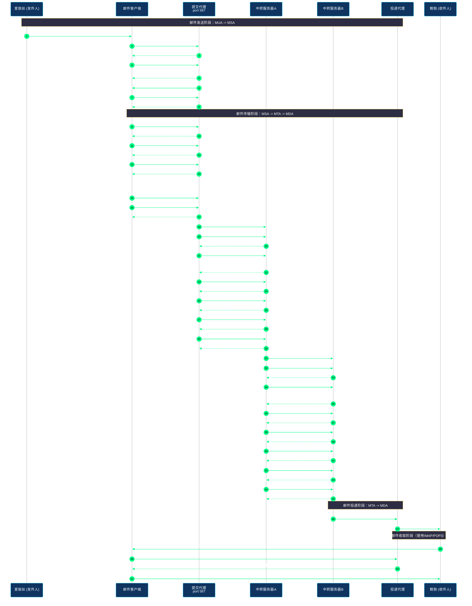
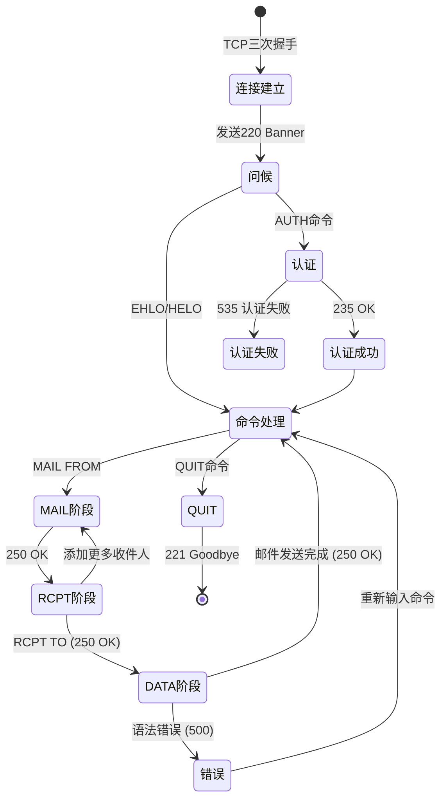
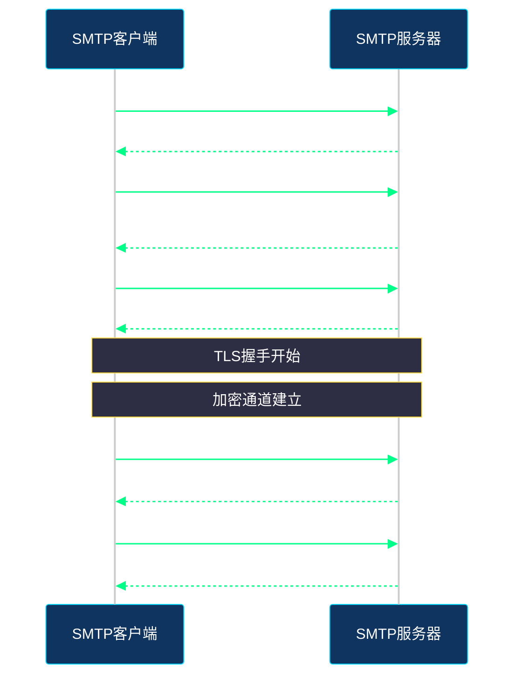

# SMTP协议

## 1. 协议概述

SMTP（Simple Mail Transfer Protocol，简单邮件传输协议）是互联网上用于电子邮件传输的标准应用层协议。1982年由RFC 821定义，经过多次扩展（RFC 2821、RFC 5321），至今仍是邮件系统的核心基础设施。

### 1.1 协议基本信息

| 属性 | 值 |
|------|-----|
| 协议名称 | SMTP (Simple Mail Transfer Protocol) |
| 默认端口 | 25（明文）、587（提交）、465（SMTPS） |
| OSI层级 | 应用层（第7层） |
| 传输层协议 | TCP |
| 面向连接 | 是（建立持久连接） |
| 状态 | 有状态（会话状态机） |

### 1.2 协议设计目标

SMTP协议的设计哲学遵循"简单"原则：

- **简单会话流程**：仅支持邮件发送，不支持邮件接收
- **文本协议**：基于ASCII文本，易于调试和分析
- **无中心化**：采用分布式中继架构，邮件在各邮件服务器间传递
- **可靠传输**：基于TCP的可靠传输，SMTP本身不保证可靠性

### 1.3 SMTP与其他邮件协议的关系

```
┌─────────────────────────────────────────────────────────────────┐
│                        邮件系统架构                              │
├─────────────────────────────────────────────────────────────────┤
│                                                                 │
│   ┌─────┐      SMTP       ┌─────┐      SMTP      ┌─────┐       │
│   │ MUA │───────────────>│ MSA │───────────────>│ MTA │       │
│   └─────┘   (提交端口587) └─────┘   (中继端口25)  └─────┘       │
│                                                   │             │
│                                                   │ SMTP        │
│                                                   ▼             │
│   ┌─────┐      IMAP/POP3   ┌─────┐      SMTP      ┌─────┐       │
│   │ MUA │<───────────────│ MDA │<───────────────│ MTA │       │
│   └─────┘   (收取)        └─────┘                └─────┘       │
│                                                                 │
│   图例：                                                          │
│   MUA (Mail User Agent)    - 邮件客户端（Outlook、Thunderbird）  │
│   MSA (Mail Submission Agent) - 邮件提交代理                      │
│   MTA (Mail Transfer Agent)  - 邮件传输代理（Sendmail、Postfix）  │
│   MDA (Mail Delivery Agent)  - 邮件投递代理                       │
│                                                                 │
└─────────────────────────────────────────────────────────────────┘
```

---

## 2. 协议工作原理

### 2.1 邮件完整发送流程



### 2.2 SMTP会话状态机



### 2.3 协议消息格式

SMTP协议采用请求-响应模型，每条消息以`<CRLF>`（回车换行）结束。

**SMTP命令格式：**
```
Command [Parameters] <CRLF>
```

**SMTP响应格式：**
```
XYZ Message Text<CRLF>
```

其中：
- `XYZ`：3位数字状态码
- `Message Text`：人类可读的解释文本
- 多行响应以`-`连接，最后一行以空格结束

---

## 3. SMTP命令详解

### 3.1 连接与问候

#### EHLO（扩展问候）

现代SMTP客户端使用的问候命令，会获取服务器支持的功能列表：

```bash
EHLO client.example.com
```

**响应示例：**
```
250-mail.example.com Hello client.example.com [192.168.1.100]
250-SIZE 10240000
250-8BITMIME
250-STARTTLS
250-AUTH PLAIN LOGIN
250 AUTH=CRAM-MD5
```

#### HELO（简单问候）

较旧的问候命令，不返回服务器功能列表：

```bash
HELO client.example.com
```

**响应：**
```
250 mail.example.com Hello client.example.com
```

### 3.2 邮件信封命令

#### MAIL FROM（发件人）

指定邮件的发件人地址（邮件信封发件人，可能与From头不同）：

```bash
MAIL FROM:<alice@example.com>
```

**响应：**
```
250 OK
```

#### RCPT TO（收件人）

指定邮件的收件人地址（可以指定多个）：

```bash
RCPT TO:<bob@example.org>
```

**响应：**
```
250 OK
```

**添加多个收件人：**
```
RCPT TO:<charles@example.org>
250 OK
```

### 3.3 DATA命令（邮件正文）

DATA命令标志邮件正文的开始：

```bash
DATA
```

**响应：**
```
354 Start mail input; end with <CRLF>.<CRLF>
```

**邮件正文格式要求：**

1. 邮件头与邮件体之间以空行分隔
2. 每行不超过1000个字符
3. 邮件体以单独一行`.`（点号）结束

**示例：**
```
Subject: Hello from SMTP

Hi Bob,

This is a test email sent via SMTP protocol.
Best regards,
Alice

.
```

**响应：**
```
250 OK Message accepted for delivery
```

### 3.4 其他常用命令

#### NOOP（无操作）

保持连接活跃，不做任何操作：

```bash
NOOP
```

**响应：**
```
250 OK
```

#### RSET（重置）

重置当前会话状态，清除所有收件人和邮件数据：

```bash
RSET
```

**响应：**
```
250 OK
```

#### QUIT（退出）

关闭SMTP会话：

```bash
QUIT
```

**响应：**
```
221 mail.example.com closing connection
```

---

## 4. SMTP响应码

### 4.1 响应码分类

| 首位 | 类别 | 含义 |
|------|------|------|
| 1xx | 信息性应答 | 请求已接收，继续处理 |
| 2xx | 成功应答 | 命令成功执行 |
| 3xx | 中间应答 | 请求已接收，需要更多信息 |
| 4xx | 暂时失败 | 命令失败，但可重试 |
| 5xx | 永久失败 | 命令失败，不应重试 |

### 4.2 常见响应码详解

| 响应码 | 含义 | 场景 |
|--------|------|------|
| 220 | Service ready | 服务器准备就绪 |
| 221 | Service closing | 连接关闭 |
| 235 | Authentication successful | 认证成功 |
| 250 | Requested mail action okay | 请求的邮件操作成功 |
| 251 | User not local; forward | 用户不在本地，将转发 |
| 252 | Cannot VRFY user | 无法验证用户，但会尝试投递 |
| 354 | Start mail input | 开始输入邮件正文 |
| 421 | Service not available | 服务不可用 |
| 450 | Mailbox unavailable | 邮箱不可用（如忙） |
| 451 | Requested action aborted | 操作中止（如本地错误） |
| 452 | Requested action not taken | 存储空间不足 |
| 500 | Syntax error | 语法错误 |
| 501 | Parameter syntax error | 参数语法错误 |
| 502 | Command not implemented | 命令未实现 |
| 503 | Bad sequence of commands | 命令顺序错误 |
| 504 | Command parameter not implemented | 命令参数未实现 |
| 535 | Authentication failed | 认证失败 |
| 550 | Mailbox unavailable | 邮箱不可用（如不存在） |
| 551 | User not local | 用户不在本地 |
| 552 | Mailbox storage exceeded | 存储空间超限 |
| 553 | Mailbox name not allowed | 邮箱名不允许 |
| 554 | Transaction failed | 事务失败 |

---

## 5. MIME协议

### 5.1 MIME简介

MIME（Multipurpose Internet Mail Extensions，多用途互联网邮件扩展）允许SMTP传输非ASCII字符内容和二进制附件（如图片、文档）。

### 5.2 MIME邮件结构

```
MIME-Version: 1.0
Content-Type: multipart/mixed; boundary="----=_Part_12345"

------=_Part_12345
Content-Type: text/plain; charset=UTF-8

这是邮件正文。

------=_Part_12345
Content-Type: image/png; name="photo.png"
Content-Transfer-Encoding: base64
Content-Disposition: attachment; filename="photo.png"

iVBORw0KGgoAAAANSUhEUgAAAAEAAAABCAYAAAAfFcSJAAAADUlEQVR42mNk+M9QDwADhgGAWjR9awAAAABJRU5ErkJggg==
------=_Part_12345--
```

### 5.3 Content-Transfer-Encoding（内容传输编码）

| 编码方式 | 描述 | 适用场景 |
|----------|------|----------|
| 7bit | 纯ASCII，无编码 | 仅含ASCII文本 |
| 8bit | 8位字符 | 含非ASCII文本（如UTF-8中文） |
| binary | 二进制 | 极少使用 |
| quoted-printable | 可打印字符编码 | 少量非ASCII字符 |
| base64 | 64位编码 | 二进制附件 |

### 5.4 Base64编码示例

```python
import base64

# 编码附件
with open('document.pdf', 'rb') as f:
    content = f.read()
encoded = base64.b64encode(content).decode('ascii')

# 分割为多行（每行不超过76字符）
lines = [encoded[i:i+76] for i in range(0, len(encoded), 76)]
base64_content = '\r\n'.join(lines)
```

---

## 6. SMTP认证

### 6.1 认证机制

现代邮件服务器要求客户端认证以防止垃圾邮件中继。SMTP认证在EHLO之后、AMTP命令之前进行。

### 6.2 AUTH PLAIN

最简单的认证方式，用户名和密码以`\0`分隔后Base64编码：

**原始格式：**
```
<authentication identity>\0<authorization identity>\0<password>
```

**AUTH PLAIN流程：**

```bash
AUTH PLAIN
334 
dXNlcm5hbWUAdXNlcm5hbWUAcGFzc3dvcmQ=
235 Authentication successful
```

**Python示例：**
```python
import base64

username = "alice"
password = "secret123"
auth_string = f"\0{username}\0{password}"
encoded = base64.b64encode(auth_string.encode()).decode()
# encoded = "AHVzZXJuYW1lAHBhc3N3b3JkMTIz"
```

### 6.3 AUTH LOGIN

基于用户名和密码的简单认证，分别传输：

```bash
AUTH LOGIN
334 VXNlcm5hbWU6
dXNlcm5hbWU=
334 UGFzc3dvcmQ6
c2VjcmV0MTIz
235 Authentication successful
```

**Python示例：**
```python
import base64

username = base64.b64encode(b"alice").decode()
password = base64.b64encode(b"secret123").decode()

# 依次发送 username 和 password 的Base64编码
```

---

## 7. SMTPS与STARTTLS

### 7.1 SMTPS（隐式TLS）

使用TLS/SSL加密的SMTP连接，从一开始就建立加密通道：

| 端口 | 协议 | 说明 |
|------|------|------|
| 465 | smtps | SMTPS（已被废弃，后重新启用） |
| 25 | smtps | 加密SMTP中继（较少使用） |

### 7.2 STARTTLS（显式TLS）

在明文SMTP会话中升级到TLS加密：



### 7.3 端口对比

| 端口 | 加密方式 | 使用场景 |
|------|----------|----------|
| 25 | 明文或STARTTLS | MTA间中继 |
| 587 | 明文或STARTTLS | MUA->MSA提交（推荐） |
| 465 | 隐式TLS | 历史原因，现重新启用 |

---

## 8. 工程示例

### 8.1 Telnet发送邮件

使用telnet直接与SMTP服务器交互：

```bash
# 连接到SMTP服务器（需要支持STARTTLS）
$ telnet smtp.example.com 587

# 服务器响应
220 smtp.example.com ESMTP Postfix

# 发送扩展问候
EHLO client.example.com

250-smtp.example.com
250-PIPELINING
250-SIZE 10240000
250-ETRN
250-STARTTLS
250-AUTH PLAIN LOGIN
250-ENHANCEDSTATUSCODES
250-8BITMIME
250 DSN

# 启动TLS加密（如果服务器支持）
STARTTLS
220 2.0.0 Ready to start TLS

# TLS握手完成后，重新发送EHLO（在TLS加密后）
EHLO client.example.com

# 开始认证
AUTH LOGIN
334 VXNlcm5hbWU6
dXNlcm5hbWU=
334 UGFzc3dvcmQ6
c2VjcmV0
235 2.7.0 Authentication successful

# 指定发件人
MAIL FROM:<alice@example.com>
250 2.1.0 Ok

# 指定收件人
RCPT TO:<bob@example.org>
250 2.1.5 Ok

# 开始发送邮件正文
DATA
354 End data with <CR><LF>.<CR><LF>

# 邮件内容
Subject: Test Email

Hi Bob,
This is a test email sent via telnet.
Best regards,
Alice
.
250 2.0.0 Ok: queued as 12345

# 退出
QUIT
221 2.0.0 Bye
```

### 8.2 Python smtplib发送邮件

#### 基本发送

```python
import smtplib
from email.mime.text import MIMEText
from email.mime.multipart import MIMEMultipart

# 创建邮件
msg = MIMEMultipart()
msg['From'] = 'alice@example.com'
msg['To'] = 'bob@example.org'
msg['Subject'] = 'Test Email'

# 添加正文
body = 'Hi Bob,\n\nThis is a test email sent via Python smtplib.'
msg.attach(MIMEText(body, 'plain'))

# 发送邮件
try:
    with smtplib.SMTP('smtp.example.com', 587) as server:
        server.ehlo()  # 向服务器标识自己
        server.starttls()  # 启用TLS加密
        server.ehlo()  # TLS后重新发送EHLO
        server.login('alice@example.com', 'password')

        server.send_message(msg)

    print('邮件发送成功')
except smtplib.SMTPException as e:
    print(f'发送失败: {e}')
```

#### 带附件的邮件

```python
import smtplib
from email.mime.text import MIMEText
from email.mime.multipart import MIMEMultipart
from email.mime.base import MIMEBase
from email import encoders

# 创建邮件
msg = MIMEMultipart()
msg['From'] = 'alice@example.com'
msg['To'] = 'bob@example.org'
msg['Subject'] = 'Email with Attachment'

# 添加正文
body = 'Please find the attached document.'
msg.attach(MIMEText(body, 'plain'))

# 添加附件
attachment = open('document.pdf', 'rb')
part = MIMEBase('application', 'octet-stream')
part.set_payload(attachment.read())
encoders.encode_base64(part)
part.add_header(
    'Content-Disposition',
    'attachment',
    filename='document.pdf'
)
msg.attach(part)
attachment.close()

# 发送邮件
try:
    with smtplib.SMTP('smtp.example.com', 587) as server:
        server.starttls()
        server.login('alice@example.com', 'password')
        server.send_message(msg)

    print('邮件发送成功')
except Exception as e:
    print(f'发送失败: {e}')
```

#### 使用AUTH PLAIN认证

```python
import smtplib
import base64

# AUTH PLAIN 认证
username = 'alice@example.com'
password = 'password123'

# 构建AUTH PLAIN字符串
auth_string = f'\0{username}\0{password}'
auth_plain = base64.b64encode(auth_string.encode()).decode()

with smtplib.SMTP('smtp.example.com', 587) as server:
    server.ehlo()
    server.starttls()
    server.ehlo()

    # 使用AUTH PLAIN
    server.docmd('AUTH', 'PLAIN')
    server.putcmd(auth_plain)
    code, message = server.getreply()

    if code == 235:
        print('认证成功')
        # 发送邮件
        server.send_message(msg)
```

### 8.3 使用Outlook/Gmail SMTP配置

#### Gmail SMTP配置

| 配置项 | 值 |
|--------|-----|
| SMTP服务器 | smtp.gmail.com |
| 端口 | 587（STARTTLS）或 465（SSL） |
| 要求SSL | 是 |
| 要求TLS | 是（STARTTLS） |
| 认证 | 是（需要应用专用密码） |

```python
import smtplib
from email.mime.text import MIMEText

msg = MIMEText('Test from Python')
msg['Subject'] = 'Test'
msg['From'] = 'your-email@gmail.com'
msg['To'] = 'recipient@example.com'

with smtplib.SMTP('smtp.gmail.com', 587) as server:
    server.starttls()
    # 使用应用专用密码登录
    server.login('your-email@gmail.com', 'your-app-password')
    server.send_message(msg)
```

> **注意**：Gmail需要启用"低安全性应用访问"或使用应用专用密码。

#### Outlook SMTP配置

| 配置项 | 值 |
|--------|-----|
| SMTP服务器 | smtp-mail.outlook.com |
| 端口 | 587（STARTTLS） |
| 要求TLS | 是 |
| 认证 | 是 |

---

## 9. SMTP安全最佳实践

### 9.1 传输层安全

| 实践 | 说明 |
|------|------|
| 强制STARTTLS | 拒绝不加密的连接 |
| 禁用SSLv2/SSLv3 | 使用TLS 1.2+ |
| 证书验证 | 验证服务器证书有效性 |
| 客户端证书 | 双向TLS认证 |

### 9.2 认证安全

| 实践 | 说明 |
|------|------|
| 使用强认证 | 优先使用PLAIN/LOGIN over TLS |
| 限制尝试次数 | 防止暴力破解 |
| 账户锁定 | 多次失败后锁定账户 |
| 日志审计 | 记录所有认证尝试 |

### 9.3 反垃圾邮件措施

- **SPF（Sender Policy Framework）**：验证发件服务器IP
- **DKIM（DomainKeys Identified Mail）**：邮件签名验证
- **DMARC（Domain-based Message Authentication）**：SPF+DKIM策略

---

## 10. 常见问题与调试

### 10.1 常见错误

| 错误 | 原因 | 解决方案 |
|------|------|----------|
| 530 Authentication required | 未认证 | 使用AUTH命令登录 |
| 535 Authentication failed | 用户名/密码错误 | 检查凭据 |
| 550 Mailbox not found | 收件人不存在 | 检查收件人地址 |
| 552 Storage exceeded | 邮箱满 | 清理邮箱空间 |
| 421 Service not available | 服务器过载 | 稍后重试 |

### 10.2 调试技巧

#### 使用OpenSSL测试SMTPS

```bash
# 测试STARTTLS
openssl s_client -connect smtp.example.com:587 -starttls smtp

# 测试隐式SMTPS
openssl s_client -connect smtp.example.com:465
```

#### 使用nc（netcat）发送邮件

```bash
# 连接到SMTP服务器
nc smtp.example.com 25

# 或者使用-s选项指定源IP
nc -s 192.168.1.100 smtp.example.com 25
```

### 10.3 日志分析

Postfix邮件日志示例：

```
May 23 10:30:45 mail postfix/smtp[12345]: 123ABC: to=<bob@example.org>,
 relay=mx.example.org[192.0.2.1]:25, status=sent (250 OK)
May 23 10:30:46 mail postfix/smtpd[12346]: 456DEF: client=unknown[192.0.2.100]
May 23 10:30:47 mail postfix/smtpd[12346]: 456DEF: message size=1234
```

---

## 11. 总结

### 11.1 关键知识点

```
┌─────────────────────────────────────────────────────────────┐
│                      SMTP协议要点                           │
├─────────────────────────────────────────────────────────────┤
│  协议基础      │  端口25/587/465  │  TCP持久连接            │
│                │  文本协议        │  有状态会话             │
├────────────────┼─────────────────┼────────────────────────┤
│  会话流程      │  EHLO -> AUTH -> │  MAIL FROM ->         │
│                │  RCPT TO -> DATA │  -> DATA -> QUIT      │
├────────────────┼─────────────────┼────────────────────────┤
│  响应码        │  2xx成功  │  3xx需更多信息  │  4xx/5xx失败  │
├────────────────┼─────────────────┼────────────────────────┤
│  认证机制      │  AUTH PLAIN      │  AUTH LOGIN           │
│                │  (需TLS保护)      │  (需TLS保护)          │
├────────────────┼─────────────────┼────────────────────────┤
│  传输安全      │  STARTTLS (587)  │  SMTPS (465)         │
└─────────────────────────────────────────────────────────────┘
```

### 11.2 与相关协议的关系

```
┌──────────────┐     SMTP      ┌──────────────┐
│     MUA      │──────────────>│     MSA      │
│  (客户端)     │   提交587     │  (提交代理)   │
└──────────────┘               └──────────────┘
       │                              │
       │ IMAP/POP3                    │ SMTP 25
       │ 收取                          │ 转发
       ▼                              ▼
┌──────────────┐               ┌──────────────┐
│     MDA      │               │     MTA      │
│  (投递代理)   │               │  (传输代理)   │
└──────────────┘               └──────────────┘
```

---

## 参考资源

- RFC 5321 - Simple Mail Transfer Protocol
- RFC 2045-2049 - MIME协议
- RFC 4954 - SMTP Authentication
- RFC 3207 - SMTP STARTTLS Extension

