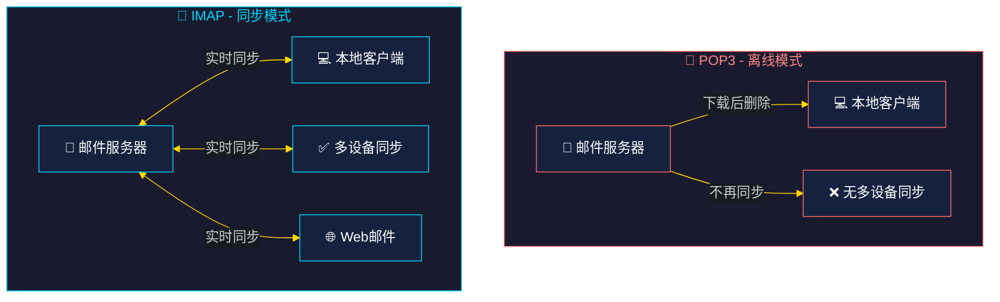
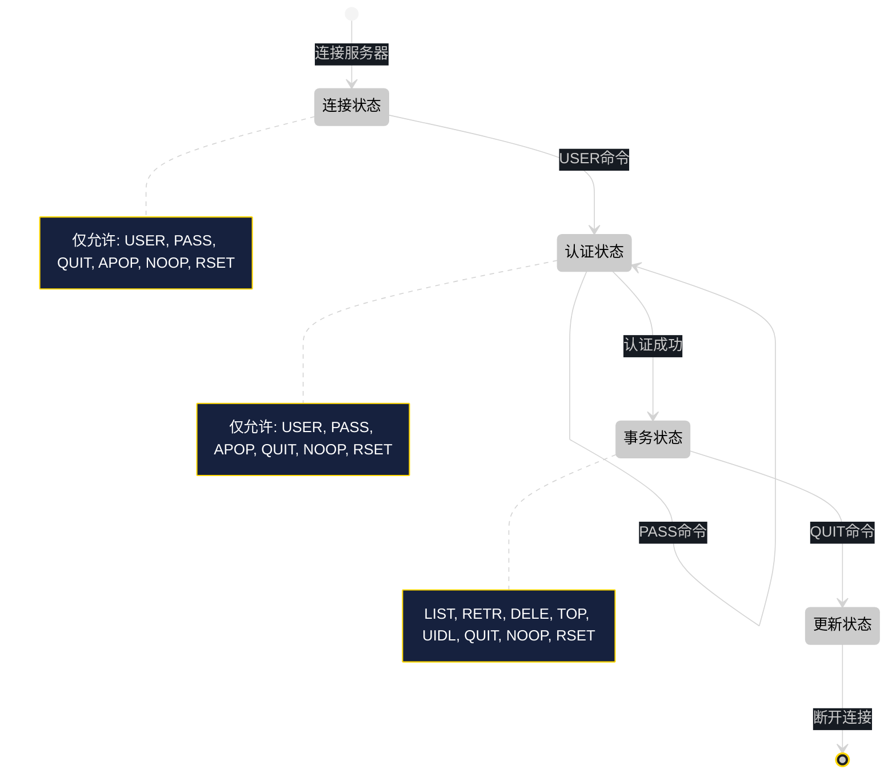
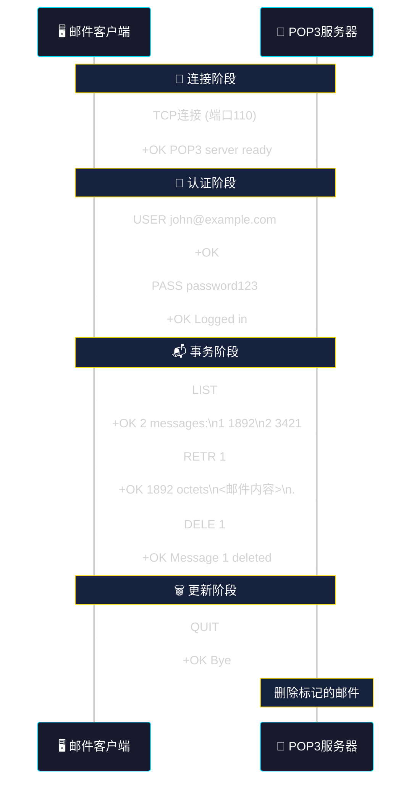
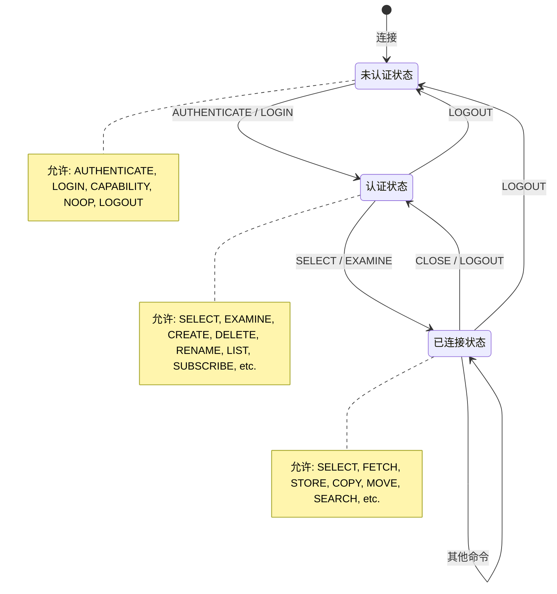
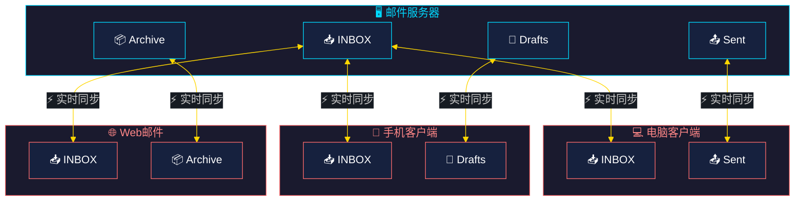
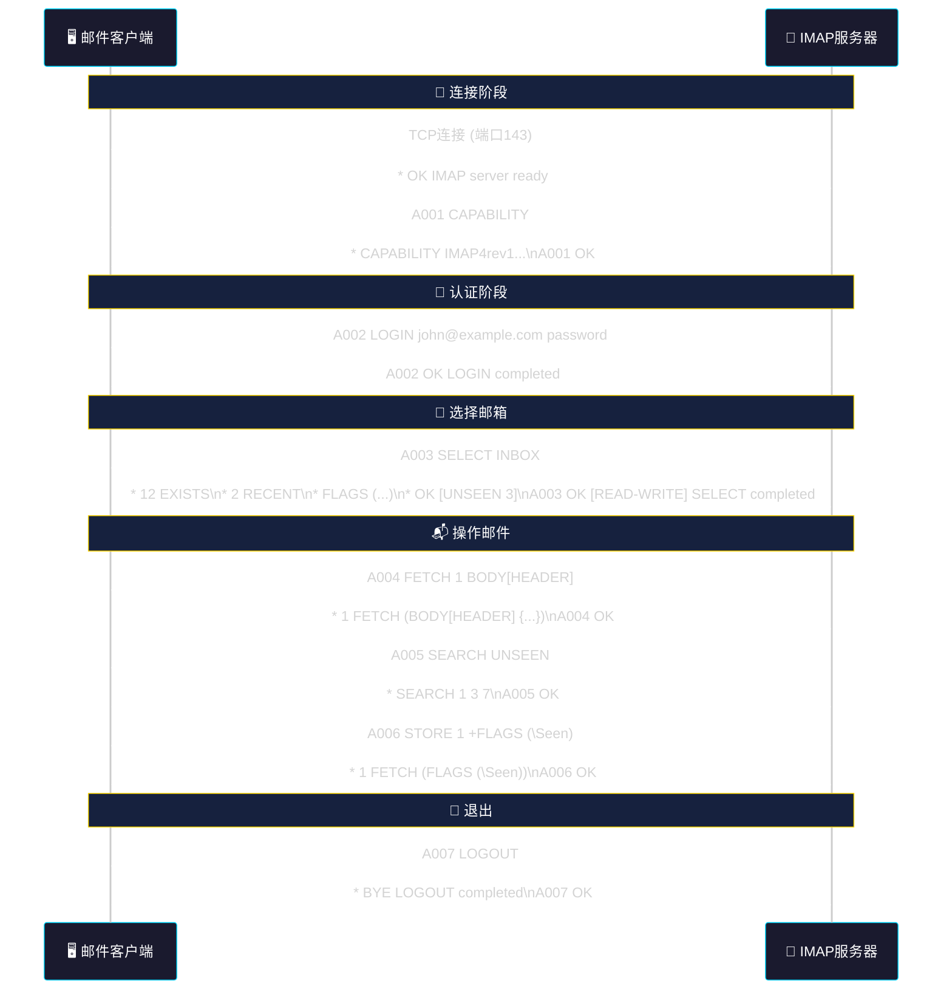

# 第9章 POP3与IMAP协议

## 1. 协议概述

### 1.1 什么是邮件收取协议

当用户从邮件服务器获取邮件时，需要使用专门的邮件收取协议。主要有两种：

- **POP3 (Post Office Protocol Version 3)** - 邮局协议第3版
- **IMAP (Internet Message Access Protocol)** - 互联网消息访问协议

这两种协议解决了同一个问题：如何从邮件服务器将邮件下载到客户端。但它们采用了完全不同的设计理念。

### 1.2 协议基本信息

| 属性 | POP3 | IMAP |
|------|------|------|
| 默认端口 | 110 (明文) / 995 (SSL) | 143 (明文) / 993 (SSL) |
| OSI层 | 应用层 | 应用层 |
| 协议类型 | 请求-响应 | 请求-响应 |
| 连接类型 | 短连接 | 长连接 |
| 状态管理 | 无状态（除会话状态） | 有状态 |

### 1.3 协议设计理念对比



### 1.4 工作流程对比

```mermaid
%%{
    init: {
        'theme': 'dark',
        'themeVariables': {
            'fontFamily': 'Consolas, Monaco, monospace',
            'primaryColor': '#e94560',
            'primaryTextColor': '#ffffff',
            'primaryBorderColor': '#e94560',
            'lineColor': '#ffd700',
            'secondaryColor': '#2d2d44',
            'tertiaryColor': '#1e1e32',
            'background': '#0d1117',
            'nodeBorder': '#e94560',
            'clusterBkg': '#161b22',
            'clusterBorder': '#30363d',
            'titleColor': '#f0f6fc',
            'edgeLabelBackground': '#161b22'
        }
    }
}%%
flowchart LR
    subgraph POP3流程 ["🔴 POP3 工作流程"]
        direction TB
        P1["1️⃣ 连接服务器"] --> P2["2️⃣ 身份验证"]
        P2 --> P3["3️⃣ 列出邮件"]
        P3 --> P4["4️⃣ 下载邮件"]
        P4 --> P5["5️⃣ 删除邮件"]
        P5 --> P6["6️⃣ 断开连接"]
    end

    subgraph IMAP流程 ["🔵 IMAP 工作流程"]
        direction TB
        I1["1️⃣ 连接服务器"] --> I2["2️⃣ 身份验证"]
        I2 --> I3["3️⃣ 选择邮箱"]
        I3 --> I4["4️⃣ 浏览/搜索"]
        I4 --> I5["5️⃣ 获取邮件"]
        I5 --> I6["6️⃣ 标记状态"]
        I6 --> I7["7️⃣ 保持连接"]
        I7 --> I8["8️⃣ 随时操作"]
    end

    style POP3流程 fill:#1a1a2e,stroke:#ff6b6b,color:#ff8787
    style IMAP流程 fill:#1a1a2e,stroke:#00d9ff,color:#00d9ff
    style P1 fill:#16213e,stroke:#ff6b6b,color:#ffffff
    style P2 fill:#16213e,stroke:#ff6b6b,color:#ffffff
    style P3 fill:#16213e,stroke:#ff6b6b,color:#ffffff
    style P4 fill:#16213e,stroke:#ff6b6b,color:#ffffff
    style P5 fill:#16213e,stroke:#ff6b6b,color:#ffffff
    style P6 fill:#16213e,stroke:#ff6b6b,color:#ffffff
    style I1 fill:#16213e,stroke:#00d9ff,color:#ffffff
    style I2 fill:#16213e,stroke:#00d9ff,color:#ffffff
    style I3 fill:#16213e,stroke:#00d9ff,color:#ffffff
    style I4 fill:#16213e,stroke:#00d9ff,color:#ffffff
    style I5 fill:#16213e,stroke:#00d9ff,color:#ffffff
    style I6 fill:#16213e,stroke:#00d9ff,color:#ffffff
    style I7 fill:#16213e,stroke:#00d9ff,color:#ffffff
    style I8 fill:#16213e,stroke:#00d9ff,color:#ffffff
```



---

## 2. POP3协议详解

### 2.1 协议简介

POP3是一种简单的邮件收取协议，设计初衷是将邮件从服务器"下载到本地"后删除服务器副本。这适合离线使用场景。

### 2.2 连接状态

POP3会话有三种状态：



### 2.3 POP3命令详解

#### 连接与认证阶段

```bash
# 建立连接
$ telnet mail.example.com 110
Trying 192.168.1.100...
Connected to mail.example.com.
Escape character is '^]'.
+OK POP3 server ready

# 用户名认证
USER john@example.com
+OK

# 密码认证
PASS mypassword123
+OK Logged in.

# 或者使用APOP认证（更安全）
APOP john@example.com <digest>
+OK Logged in.
```

#### 事务阶段命令

```bash
# 列出所有邮件（简短列表）
LIST
+OK 3 messages:
1 1892
2 3421
3 1205
.

# 列出指定邮件
LIST 2
+OK 2 3421
.

# 查看邮件内容
RETR 1
+OK 1892 octets
Received: from sender@example.com
Date: Thu, 22 May 2026 10:00:00 +0800
From: sender@example.com
To: john@example.com
Subject: Test Email

Hello, this is a test email.
.
```

```bash
# 删除邮件（标记删除，会话结束时生效）
DELE 1
+OK Message 1 deleted

# 查看邮件前几行（不需要下载整个邮件）
TOP 2 10
+OK
Received: from ...
Date: ...
From: ...
Subject: ...
To: ...
X-Mailer: ...

This is the body...

# 获取邮件唯一标识列表
UIDL
+OK
1 ABC123DEF456
2 GHI789JKL012
3 MNO345PQR678
.

# 重置删除标记
RSET
+OK

# 心跳检测
NOOP
+OK
```

#### 更新阶段

```bash
# 退出（如果有过删除操作，进入更新阶段）
QUIT
+OK Bye
```

### 2.4 POP3响应格式

```
+OK <描述信息>     # 成功响应
-ERR <描述信息>    # 错误响应
```

多行响应以`.`结束：

```bash
RETR 1
+OK 1892 octets
第一行邮件内容
第二行邮件内容
.
```

### 2.5 POP3会话完整示例



---

## 3. IMAP协议详解

### 3.1 协议简介

IMAP是一种功能强大的邮件访问协议，设计理念是"邮件始终保存在服务器上"，客户端可以随时同步查看。最适合多设备同步场景。

### 3.2 IMAP vs POP3 核心区别

| 特性 | POP3 | IMAP |
|------|------|------|
| 邮件存储位置 | 下载后本地存储 | 服务器统一存储 |
| 多设备同步 | 不支持 | 完全支持 |
| 邮件夹支持 | 仅收件箱 | 多文件夹/目录 |
| 选择性下载 | 仅全部 | 可仅下载头/部分 |
| 在线操作 | 困难 | 完全支持 |
| 带宽占用 | 首次高，后续低 | 持续较低 |
| 离线支持 | 完全支持 | 需缓存 |

### 3.3 连接状态



### 3.4 IMAP命令详解

#### 连接与认证阶段

```bash
# 建立连接
$ telnet mail.example.com 143
Trying 192.168.1.100...
Connected to mail.example.com.
Escape character is '^]'.
* OK [CAPABILITY IMAP4rev1 AUTH=PLAIN AUTH=LOGIN] IMAP server ready

# 认证登录
A001 LOGIN john@example.com mypassword123
A001 OK LOGIN completed

# 或者使用AUTHENTICATE（更安全）
A001 AUTHENTICATE PLAIN dXNlcm5hbWUAdXNlcm5hbWUAcGFzc3dvcmQ=
A001 OK AUTHENTICATE completed
```

#### 邮箱操作

```bash
# 查看支持的capabilities
A001 CAPABILITY
* CAPABILITY IMAP4rev1 AUTH=PLAIN AUTH=LOGIN SORT DISPLAY
  THREAD=REFERENCES THREAD=REFS THREAD=ORDEREDSUBJECT
A001 OK CAPABILITY completed

# 列出所有邮箱
A001 LIST "" *
* LIST (\HasNoChildren) "." INBOX
* LIST (\HasNoChildren) "." Sent
* LIST (\HasNoChildren) "." Drafts
* LIST (\HasNoChildren) "." Trash
* LIST (\HasNoChildren) "." Archive
A001 OK LIST completed

# 选择邮箱
A002 SELECT INBOX
* 12 EXISTS
* 2 RECENT
* FLAGS (\Answered \Flagged \Deleted \Seen \Draft)
* OK [UNSEEN 3] Message 3 is first unseen
* OK [UIDVALIDITY 1234567890] UIDVALIDITY
* OK [UIDNEXT 15] Predicted next UID
A002 OK [READ-WRITE] SELECT completed
```

#### 邮件查看与获取

```bash
# 查看邮件列表
A003 FETCH 1:* FLAGS
* 1 FETCH (FLAGS (\Seen))
* 2 FETCH (FLAGS (\Seen \Answered))
* 3 FETCH (FLAGS (\Recent))
A003 OK FETCH completed

# 获取邮件完整内容
A004 FETCH 1 ALL
* 1 FETCH (FLAGS (\Seen) INTERNALDATE "22-May-2026 10:00:00 +0800"
  ENVELOPE ("Thu, 22 May 2026 10:00:00 +0800"
  "Test Subject" (("Sender" NIL "sender" "example.com"))
  (("Sender" NIL "sender" "example.com"))
  (("John" NIL "john" "example.com"))
  (("John" NIL "john" "example.com"))
  NIL NIL NIL "ABC123")
  BODY[TEXT] {1892}
Hello, this is a test email...
)
A004 OK FETCH completed

# 仅获取邮件头
A005 FETCH 1 BODY[HEADER]
* 1 FETCH (BODY[HEADER] {342}
Received: from sender.example.com
Date: Thu, 22 May 2026 10:00:00 +0800
From: sender@example.com
To: john@example.com
Subject: Test Email
Message-ID: <ABC123@example.com>
)
A005 OK FETCH completed

# 获取邮件指定部分（如仅正文）
A006 FETCH 1 BODY[TEXT]
* 1 FETCH (BODY[TEXT] {45}
Hello, this is a test email body.
)
A006 OK FETCH completed
```

#### 搜索功能

```bash
# 搜索所有未读邮件
A007 SEARCH UNSEEN
* SEARCH 1 3 7
A007 OK SEARCH completed (3 messages)

# 搜索特定发件人
A008 SEARCH FROM "newsletter@example.com"
* SEARCH 5 8 12
A008 OK SEARCH completed

# 搜索特定主题
A009 SEARCH SUBJECT "meeting"
* SEARCH 2 6
A009 OK SEARCH completed

# 组合搜索（AND）
A010 SEARCH UNSEEN FROM "boss@example.com"
* SEARCH 3
A010 OK SEARCH completed

# 搜索特定日期之后的邮件
A011 SEARCH SINCE "01-Jan-2026"
* SEARCH 1 2 3 4 5
A011 OK SEARCH completed
```

#### 状态管理

```bash
# 标记为已读
A012 STORE 1 +FLAGS (\Seen)
* 1 FETCH (FLAGS (\Seen))
A012 OK STORE completed

# 标记为未读
A013 STORE 1 -FLAGS (\Seen)
* 1 FETCH (FLAGS ())
A013 OK STORE completed

# 添加旗标
A014 STORE 1 +FLAGS (\Flagged)
* 1 FETCH (FLAGS (\Flagged))
A014 OK STORE completed

# 删除邮件（带\Deleted标记）
A015 STORE 3 +FLAGS (\Deleted)
* 3 FETCH (FLAGS (\Deleted))
A015 OK STORE completed

# 移动邮件到其他文件夹
A016 COPY 1:3 "[Gmail]/Sent"
* OK [COPYUID 1234567891 1:3 100:102] Exported
A016 OK COPY completed

# 彻底删除（需要先CLOSE或EXPUNGE）
A017 EXPUNGE
* 3 EXPUNGE
A017 OK EXPUNGE completed
```

#### 文件夹同步机制



### 3.5 IMAP响应格式

```bash
# 标签响应（每个命令的最终响应）
A001 OK LOGIN completed
A002 BAD Command invalid

# 非标签响应（服务器主动推送）
* 12 EXISTS          # 邮箱中有12封邮件
* 2 RECENT           # 2封新邮件
* FETCH (FLAGS ...)  # 邮件状态变化
* BYE Server closing # 服务器即将关闭
```

### 3.6 IMAP完整会话示例



---

## 4. POP3与IMAP对比总结

### 4.1 核心差异一览

```mermaid
%%{
    init: {
        'theme': 'dark',
        'themeVariables': {
            'fontFamily': 'Consolas, Monaco, monospace',
            'primaryColor': '#ffd700',
            'primaryTextColor': '#ffffff',
            'primaryBorderColor': '#ffd700',
            'lineColor': '#00ff88',
            'secondaryColor': '#2d2d44',
            'tertiaryColor': '#1e1e32',
            'background': '#0d1117',
            'nodeBorder': '#ffd700',
            'clusterBkg': '#161b22',
            'clusterBorder': '#30363d',
            'titleColor': '#f0f6fc',
            'edgeLabelBackground': '#161b22'
        }
    }
}%%
flowchart TB
    subgraph 维度 ["📊 对比维度"]
        direction TB
        D1["🎯 使用场景"]
        D2["📱 多设备支持"]
        D3["🖥️ 服务器资源"]
        D4["📶 带宽消耗"]
        D5["💾 离线支持"]
    end

    subgraph POP3特征 ["🔴 POP3"]
        P1["离线/单设备"]
        P2["❌ 不支持"]
        P3["⬇️ 低"]
        P4["📈 首次高，后续低"]
        P5["✅ 完全支持"]
    end

    subgraph IMAP特征 ["🔵 IMAP"]
        I1["🔄 多设备/实时同步"]
        I2["✅ 完全支持"]
        I3["⬆️ 高"]
        I4["📉 持续较低"]
        I5["📦 需本地缓存"]
    end

    D1 --> P1
    D1 --> I1
    D2 --> P2
    D2 --> I2
    D3 --> P3
    D3 --> I3
    D4 --> P4
    D4 --> I4
    D5 --> P5
    D5 --> I5

    style 维度 fill:#1a1a2e,stroke:#ffd700,color:#ffd700
    style D1 fill:#16213e,stroke:#ffd700,color:#ffffff
    style D2 fill:#16213e,stroke:#ffd700,color:#ffffff
    style D3 fill:#16213e,stroke:#ffd700,color:#ffffff
    style D4 fill:#16213e,stroke:#ffd700,color:#ffffff
    style D5 fill:#16213e,stroke:#ffd700,color:#ffffff
    style POP3特征 fill:#1a1a2e,stroke:#ff6b6b,color:#ff8787
    style P1 fill:#16213e,stroke:#ff6b6b,color:#ffffff
    style P2 fill:#16213e,stroke:#ff6b6b,color:#ffffff
    style P3 fill:#16213e,stroke:#ff6b6b,color:#ffffff
    style P4 fill:#16213e,stroke:#ff6b6b,color:#ffffff
    style P5 fill:#16213e,stroke:#ff6b6b,color:#ffffff
    style IMAP特征 fill:#1a1a2e,stroke:#00d9ff,color:#00d9ff
    style I1 fill:#16213e,stroke:#00d9ff,color:#ffffff
    style I2 fill:#16213e,stroke:#00d9ff,color:#ffffff
    style I3 fill:#16213e,stroke:#00d9ff,color:#ffffff
    style I4 fill:#16213e,stroke:#00d9ff,color:#ffffff
    style I5 fill:#16213e,stroke:#00d9ff,color:#ffffff
```



### 4.2 选择建议

| 场景 | 推荐协议 | 原因 |
|------|----------|------|
| 单设备离线使用 | POP3 | 简单高效，节省服务器资源 |
| 多设备同步需求 | IMAP | 实时同步，多设备一致 |
| 移动设备邮件 | IMAP | 节省流量，可选择性同步 |
| 邮件归档备份 | POP3 | 下载后本地管理 |
| 企业邮箱 | IMAP | 多终端同步，协作方便 |
| Web邮件系统 | IMAP | 与服务器深度集成 |

---

## 5. 工程示例

### 5.1 Telnet测试POP3

```bash
# 连接到POP3服务器
$ telnet pop.example.com 110

# 完整会话
Trying 192.168.1.100...
Connected to pop.example.com.
Escape character is '^]'.
+OK POP3 server ready

USER john@example.com
+OK

PASS securepassword123
+OK Logged in.

STAT
+OK 5 15234

LIST
+OK 5 messages:
1 2345
2 1892
3 3421
4 1205
5 5678
.

RETR 1
+OK 2345 octets
Received: from [10.0.0.1] by mail.example.com
Return-Path: newsletter@example.com
Date: Thu, 22 May 2026 08:00:00 +0800
From: Newsletter <newsletter@example.com>
To: john@example.com
Subject: Weekly Newsletter #23

Hi John,

Here is this week's newsletter content...

Thank you for subscribing!
.
QUIT
+OK Bye
Connection closed by foreign host.
```

### 5.2 Telnet测试IMAP

```bash
# 连接到IMAP服务器
$ telnet imap.example.com 143

# 完整会话
Trying 192.168.1.100...
Connected to imap.example.com.
Escape character is '^]'.
* OK [CAPABILITY IMAP4rev1 AUTH=PLAIN AUTH=LOGIN] IMAP server ready

A001 LOGIN john@example.com securepassword123
A001 OK LOGIN completed

A002 LIST "" *
* LIST (\HasNoChildren) "." INBOX
* LIST (\HasNoChildren) "." Sent
* LIST (\HasNoChildren) "." Drafts
* LIST (\HasNoChildren) "." Trash
* LIST (\HasNoChildren) "." Archive
A002 OK LIST completed

A003 SELECT INBOX
* 12 EXISTS
* 2 RECENT
* FLAGS (\Answered \Flagged \Deleted \Seen \Draft)
* OK [UNSEEN 3] Message 3 is first unseen
* OK [UIDVALIDITY 1620000000] UIDs valid
* OK [UIDNEXT 25] Next predicted UID
A003 OK [READ-WRITE] SELECT completed

A004 FETCH 1:* (FLAGS)
* 1 FETCH (FLAGS (\Seen))
* 2 FETCH (FLAGS (\Seen \Answered))
* 3 FETCH (FLAGS (\Recent))
* 4 FETCH (FLAGS (\Flagged))
A004 OK FETCH completed

A005 SEARCH UNSEEN
* SEARCH 3 7 11
A005 OK SEARCH completed (3 messages)

A006 FETCH 3 BODY[HEADER]
* 3 FETCH (BODY[HEADER] {342}
Received: from mail.example.com
Date: Thu, 22 May 2026 10:30:00 +0800
From: boss@example.com
To: john@example.com
Subject: Urgent: Meeting Today

)
A006 OK FETCH completed

A007 STORE 3 +FLAGS (\Seen)
* 3 FETCH (FLAGS (\Seen))
A007 OK STORE completed

A008 LOGOUT
* BYE IMAP server closing connection
A008 OK LOGOUT completed
Connection closed by foreign host.
```

### 5.3 Python imaplib示例

```python
import imaplib
import email
from email.header import decode_header

class IMAPEmailClient:
    """IMAP邮件客户端封装"""

    def __init__(self, server, username, password, port=143, use_ssl=False):
        """初始化IMAP客户端

        Args:
            server: IMAP服务器地址
            username: 用户名
            password: 密码
            port: 端口，默认143
            use_ssl: 是否使用SSL
        """
        if use_ssl:
            self.mail = imaplib.IMAP4_SSL(server, port)
        else:
            self.mail = imaplib.IMAP4(server, port)

        self.mail.login(username, password)
        print(f"已登录: {username}")

    def list_mailboxes(self):
        """列出所有邮箱文件夹"""
        status, folders = self.mail.list()
        if status == 'OK':
            print("邮箱列表:")
            for folder in folders:
                print(f"  - {folder.decode()}")
        return folders

    def select_mailbox(self, mailbox="INBOX"):
        """选择邮箱"""
        status, messages = self.mail.select(mailbox)
        if status == 'OK':
            print(f"已选择邮箱: {mailbox}")
        return messages

    def search_emails(self, criterion, value):
        """搜索邮件

        Args:
            criterion: 搜索条件 (FROM, TO, SUBJECT, SINCE, etc.)
            value: 搜索值
        Returns:
            邮件ID列表
        """
        status, message_ids = self.mail.search(None, criterion, value)
        if status == 'OK':
            return message_ids[0].split()
        return []

    def fetch_email(self, message_id):
        """获取邮件内容

        Args:
            message_id: 邮件ID
        Returns:
            Email对象
        """
        status, msg_data = self.mail.fetch(message_id, '(RFC822)')
        if status == 'OK':
            raw_email = msg_data[0][1]
            return email.message_from_bytes(raw_email)
        return None

    def fetch_email_body(self, message_id):
        """仅获取邮件正文（文本部分）"""
        status, msg_data = self.mail.fetch(message_id, '(BODY[TEXT])')
        if status == 'OK':
            return msg_data[0][1].decode('utf-8', errors='replace')
        return None

    def mark_as_read(self, message_id):
        """标记邮件为已读"""
        self.mail.store(message_id, '+FLAGS', '\\Seen')

    def mark_as_unread(self, message_id):
        """标记邮件为未读"""
        self.mail.store(message_id, '-FLAGS', '\\Seen')

    def flag_email(self, message_id):
        """标记邮件为星标"""
        self.mail.store(message_id, '+FLAGS', '\\Flagged')

    def delete_email(self, message_id):
        """删除邮件（标记\\Deleted）"""
        self.mail.store(message_id, '+FLAGS', '\\Deleted')

    def copy_to_folder(self, message_ids, folder):
        """复制邮件到指定文件夹"""
        result = self.mail.copy(message_ids, folder)
        return result[0] == 'OK'

    def expunge(self):
        """执行EXPUNGE，永久删除标记的邮件"""
        return self.mail.expunge()

    def logout(self):
        """登出"""
        self.mail.logout()
        print("已登出")


def parse_email_headers(msg):
    """解析邮件头信息"""
    headers = {}

    # 解码Subject
    subject = decode_header(msg['Subject'])[0]
    if subject[1]:
        headers['subject'] = subject[0].decode(subject[1])
    else:
        headers['subject'] = subject[0]

    headers['from'] = msg['From']
    headers['to'] = msg['To']
    headers['date'] = msg['Date']

    return headers


def get_email_body(msg):
    """提取邮件正文（优先文本，其次HTML）"""
    if msg.is_multipart():
        for part in msg.walk():
            content_type = part.get_content_type()
            content_disposition = str(part.get('Content-Disposition'))

            if content_type == 'text/plain' and 'attachment' not in content_disposition:
                return part.get_payload(decode=True).decode('utf-8', errors='replace')
    else:
        return msg.get_payload(decode=True).decode('utf-8', errors='replace')

    return ""


# 使用示例
if __name__ == "__main__":
    # 创建客户端（使用SSL）
    client = IMAPEmailClient(
        server="imap.example.com",
        username="john@example.com",
        password="password123",
        port=993,
        use_ssl=True
    )

    # 列出所有邮箱
    client.list_mailboxes()

    # 选择收件箱
    client.select_mailbox("INBOX")

    # 搜索未读邮件
    unread_ids = client.search_emails("UNSEEN", "")
    print(f"未读邮件数: {len(unread_ids)}")

    # 获取最新一封邮件
    if unread_ids:
        latest_id = unread_ids[-1]
        msg = client.fetch_email(latest_id)

        if msg:
            headers = parse_email_headers(msg)
            print(f"发件人: {headers['from']}")
            print(f"主题: {headers['subject']}")
            print(f"正文: {get_email_body(msg)[:100]}...")

            # 标记为已读
            client.mark_as_read(latest_id)

    # 登出
    client.logout()
```

### 5.4 Python poplib示例

```python
import poplib
import email
from email.header import decode_header

class POP3EmailClient:
    """POP3邮件客户端封装"""

    def __init__(self, server, username, password, port=110, use_ssl=False):
        """初始化POP3客户端

        Args:
            server: POP3服务器地址
            username: 用户名
            password: 密码
            port: 端口，默认110
            use_ssl: 是否使用SSL
        """
        if use_ssl:
            self.mail = poplib.POP3_SSL(server, port)
        else:
            self.mail = poplib.POP3(server, port)

        self.mail.user(username)
        self.mail.pass_(password)
        print(f"已登录: {username}")

    def stat(self):
        """获取邮箱状态 (邮件数, 总大小)"""
        return self.mail.stat

    def list_all(self):
        """列出所有邮件"""
        return self.mail.list()

    def retrieve_email(self, message_id):
        """获取邮件内容

        Args:
            message_id: 邮件ID (从1开始)
        Returns:
            Email对象
        """
        lines = self.mail.retr(message_id)[1]
        raw_email = b'\r\n'.join(lines)
        return email.message_from_bytes(raw_email)

    def get_email_headers(self, message_id):
        """获取邮件头"""
        msg = self.retrieve_email(message_id)
        return {
            'subject': decode_header(msg['Subject'])[0],
            'from': msg['From'],
            'to': msg['To'],
            'date': msg['Date']
        }

    def delete(self, message_id):
        """标记删除邮件（会话结束时生效）"""
        self.mail.dele(message_id)
        print(f"已标记删除邮件 #{message_id}")

    def reset(self):
        """重置会话，取消所有删除标记"""
        self.mail.rset()
        print("已取消所有删除标记")

    def noop(self):
        """心跳检测"""
        self.mail.noop()

    def quit(self):
        """退出并应用所有操作"""
        self.mail.quit()
        print("已退出")


def decode_email_subject(msg):
    """解码邮件主题"""
    subject, encoding = decode_header(msg['Subject'])[0]
    if encoding:
        return subject.decode(encoding)
    return subject


# 使用示例
if __name__ == "__main__":
    # 创建客户端（使用SSL）
    client = POP3EmailClient(
        server="pop.example.com",
        username="john@example.com",
        password="password123",
        port=995,
        use_ssl=True
    )

    # 查看状态
    count, size = client.stat()
    print(f"邮件数: {count}, 总大小: {size} bytes")

    # 列出所有邮件
    print("\n邮件列表:")
    for msg_id, msg_size in client.list_all()[1]:
        msg_id = int(msg_id)
        headers = client.get_email_headers(msg_id)
        subject, enc = decode_header(headers['subject'])[0]
        if enc:
            subject = subject.decode(enc)
        print(f"  #{msg_id} [{msg_size} bytes] - {subject}")

    # 获取最新邮件
    if count > 0:
        latest = client.retrieve_email(count)
        print(f"\n最新邮件:")
        print(f"  主题: {decode_email_subject(latest)}")
        print(f"  发件人: {latest['From']}")

        # 删除旧邮件（如新闻邮件）
        # client.delete(count)

    # 退出
    client.quit()
```

### 5.5 IMAP IDLE（推送通知）

IMAP IDLE是一种让服务器主动推送新邮件通知的扩展：

```python
import imaplib
import time

class IMAPIdleClient:
    """支持IDLE的IMAP客户端"""

    def __init__(self, server, username, password, port=143, use_ssl=True):
        if use_ssl:
            self.mail = imaplib.IMAP4_SSL(server, port)
        else:
            self.mail = imaplib.IMAP4(server, port)

        self.mail.login(username, password)
        self.mail.select("INBOX")
        print("已连接，等待新邮件通知...")

    def idle(self, timeout_seconds=120):
        """进入IDLE模式等待新邮件

        Args:
            timeout_seconds: 超时时间
        Returns:
            是否有新邮件
        """
        # 发送IDLE命令
        resp = self.mail.idle()

        # 等待响应或超时
        try:
            response = self.mail.idle_callback(timeout=timeout_seconds)
            if response:
                # 检查是否有新邮件
                status, messages = self.mail.status("INBOX", "(UNSEEN)")
                if status == 'OK':
                    unseen = int(messages[0].decode().split()[2])
                    print(f"有新邮件！未读数: {unseen}")
                    return True
        except Exception as e:
            print(f"IDLE超时或出错: {e}")

        return False

    def poll_continuously(self, callback=None, interval=60):
        """持续轮询新邮件

        Args:
            callback: 新邮件到达时的回调函数
            interval: 检查间隔（秒）
        """
        while True:
            try:
                has_new = self.idle(timeout_seconds=interval)
                if has_new and callback:
                    callback()
            except KeyboardInterrupt:
                print("\n停止轮询")
                break

    def logout(self):
        self.mail.logout()


# 使用示例
def on_new_email():
    print("收到新邮件！")

client = IMAPIdleClient(
    server="imap.example.com",
    username="john@example.com",
    password="password123"
)

# 持续监听（可按Ctrl+C停止）
try:
    client.idle(timeout_seconds=120)
except KeyboardInterrupt:
    pass
finally:
    client.logout()
```

---

## 6. 常见问题与调试

### 6.1 连接问题

| 问题 | 可能原因 | 解决方案 |
|------|----------|----------|
| 连接超时 | 防火墙/端口不通 | 检查端口是否开放 |
| 认证失败 | 用户名密码错误 | 确认凭据或重置密码 |
| SSL错误 | 证书问题 | 检查SSL配置或更新证书 |
| 连接被拒绝 | 服务未启动 | 确认服务状态 |

### 6.2 调试技巧

```bash
# 使用openssl测试SSL连接
openssl s_client -connect mail.example.com:995 -quiet
openssl s_client -connect mail.example.com:993 -quiet

# 查看详细协议交互
telnet mail.example.com 110
telnet mail.example.com 143

# Python调试
import imaplib
imaplib.Debug = 4  # 开启调试级别

# Wireshark过滤器
pop3 || imap || imaps
```

### 6.3 安全建议

1. **始终使用SSL/TLS** - 避免明文传输密码
2. **使用应用专用密码** - 如Gmail的16位应用密码
3. **限制IP访问** - 仅允许信任的IP连接
4. **定期更新密码** - 避免密码长期不变
5. **启用双因素认证** - 增强账户安全

---

## 7. 章节小结

### 7.1 核心要点

- **POP3**：简单邮件收取协议，适合离线单设备使用。邮件下载后服务器删除，不支持多设备同步
- **IMAP**：功能强大的邮件同步协议，适合多设备实时同步。邮件保存在服务器，客户端本地缓存
- **端口**：POP3使用110/995，IMAP使用143/993
- **选择依据**：根据使用场景选择，频繁多设备使用选IMAP，单设备离线选POP3

### 7.2 命令对照表

| 功能 | POP3命令 | IMAP命令 |
|------|----------|----------|
| 登录 | USER/PASS | LOGIN |
| 列出邮件 | LIST | SEARCH |
| 获取邮件 | RETR | FETCH |
| 删除 | DELE | STORE +FLAGS \\Deleted |
| 退出 | QUIT | LOGOUT |

### 7.3 下章预告

下一章我们将学习 **DHCP协议**（动态主机配置协议），了解如何自动分配IP地址等网络配置参数。

---
