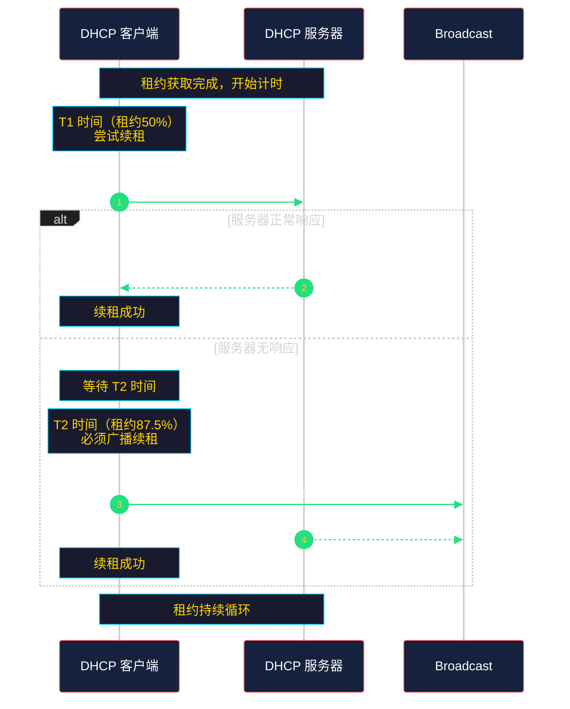
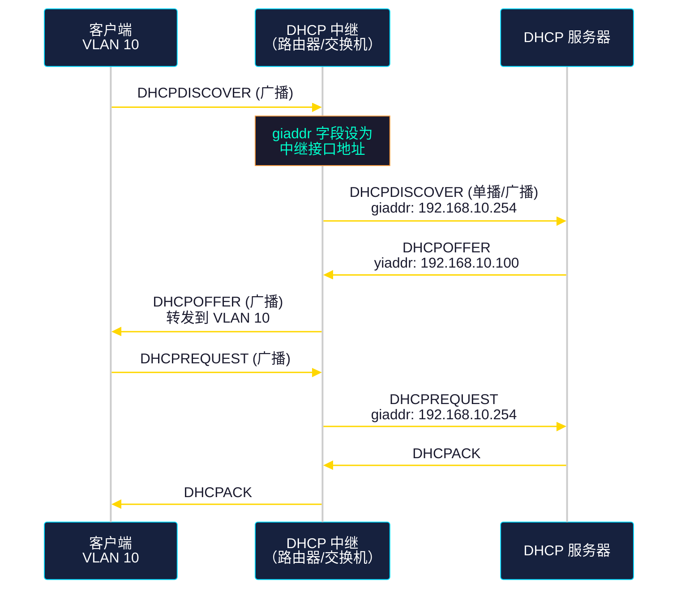

# DHCP 协议

## 1. 协议概述

### 1.1 什么是 DHCP

**DHCP（Dynamic Host Configuration Protocol，动态主机配置协议）** 是用于自动分配 IP 地址及其他网络配置参数的网络协议。它的核心作用是**简化网络管理**，避免手动配置 IP 地址带来的繁琐和错误。

在没有 DHCP 的网络中，管理员需要为每台设备手动设置：
- IP 地址
- 子网掩码
- 默认网关
- DNS 服务器

这在大型网络中是不可维护的。DHCP 实现了**集中化、自动化的 IP 地址管理**。

### 1.2 协议位置

| 属性 | 值 |
|------|-----|
| OSI 层 | 应用层（第 7 层） |
| 传输层协议 | UDP |
| 服务器端口 | 67 |
| 客户端端口 | 68 |
| RFC 文档 | RFC 2131、RFC 2132 |

### 1.3 DHCP 与其他协议的关系

```
┌─────────────────────────────────────────────────────────────┐
│                      应用层                                  │
│  ┌─────────┐  ┌─────────┐  ┌─────────┐  ┌─────────┐        │
│  │   DNS   │  │  HTTP   │  │  DHCP   │  │  SMTP   │   ...  │
│  └────┬────┘  └────┬────┘  └────┬────┘  └────┬────┘        │
│       │            │            │            │              │
├───────┴────────────┴────────────┴────────────┴─────────────┤
│                      传输层 (TCP/UDP)                        │
├─────────────────────────────────────────────────────────────┤
│                      网络层 (IP)                             │
├─────────────────────────────────────────────────────────────┤
│                    数据链路层 (Ethernet)                      │
└─────────────────────────────────────────────────────────────┘
```

### 1.4 DHCP 的核心特点

- **集中管理**：所有 IP 配置由 DHCP 服务器统一分配
- **动态分配**：地址可以重复使用，仅在需要时分配
- **租约机制**：地址分配有期限，支持续租和回收
- **广泛兼容**：支持多种操作系统和网络设备
- **廉价高效**：相比静态配置，大幅降低管理成本

---

## 2. 协议原理

### 2.1 地址分配方式

DHCP 支持三种 IP 地址分配方式：

| 模式 | 说明 | 适用场景 |
|------|------|----------|
| **动态分配** | 服务器从地址池中动态分配，租约到期可回收 | 办公网络、Wi-Fi 热点 |
| **自动分配** | 服务器永久分配一个地址给客户端 | 打印机、服务器等固定设备 |
| **手动分配** | 管理员指定，DHCP 仅负责传达 | 需要固定 IP 但又想集中管理 |

### 2.2 DHCP 消息类型

DHCP 共有 8 种消息类型，通过 `htype`、`htype` 和 `chaddr` 等字段区分：

| 消息类型 | 值 | 说明 |
|----------|-----|------|
| **DHCPDISCOVER** | 1 | 客户端广播寻找 DHCP 服务器 |
| **DHCPOFFER** | 2 | 服务器响应，提供可用 IP |
| **DHCPREQUEST** | 3 | 客户端选择某个服务器的 offer |
| **DHCPACK** | 4 | 服务器确认，租约正式生效 |
| **DHCPDECLINE** | 5 | 客户端拒绝，IP 冲突 |
| **DHCPNAK** | 6 | 服务器拒绝请求（无效请求） |
| **DHCPRELEASE** | 7 | 客户端主动释放地址 |
| **DHCPINFORM** | 8 | 客户端已有 IP，向服务器请求配置 |

### 2.3 DHCP 消息格式

```
┌─────────────────────────────────────────────────────────────┐
│  字段                    字节数    说明                      │
├─────────────────────────────────────────────────────────────┤
│  op                     1         操作码：1=请求，2=响应      │
│  htype                  1         硬件类型：1=以太网          │
│  hlen                   1         硬件地址长度：6 (MAC)       │
│  hops                   1         中继跳转数                 │
│  xid                    4         事务 ID，客户端随机生成     │
│  secs                   2         已消耗的秒数                │
│  flags                  2         标志位                     │
│  ciaddr                 4         客户端 IP（已在用）         │
│  yiaddr                 4         客户端 IP（服务器分配）      │
│  siaddr                 4         服务器 IP                  │
│  giaddr                 4         中继代理 IP                 │
│  chaddr                 16        客户端 MAC 地址             │
│  sname                  64        服务器主机名（可选）         │
│  file                   128       启动文件名（可选）          │
│  options                可变      DHCP 选项（魔法泡+选项）     │
└─────────────────────────────────────────────────────────────┘
```

### 2.4 DHCP 租约获取流程（四步交互）

当客户端首次接入网络时，通过经典的 **DORA** 流程获取 IP 地址：

```mermaid
%%{
  init: {
    'theme': 'dark',
    'themeVariables': {
      'primaryColor': '#1a1a2e',
      'primaryTextColor': '#00ffcc',
      'primaryBorderColor': '#00d9ff',
      'lineColor': '#ff6b9d',
      'secondaryColor': '#16213e',
      'tertiaryColor': '#0f3460',
      'noteBkgColor': '#1a1a2e',
      'noteTextColor': '#ffd700',
      'noteBorderColor': '#26de81',
      'actorBkg': '#16213e',
      'actorBorder': '#a855f7',
      'actorTextColor': '#ffffff',
      'signalColor': '#00ffcc',
      'signalTextColor': '#ffffff',
      'sequenceNumberColor': '#ffd700',
      'activationBkgColor': '#5b2c6f',
      'activationBorderColor': '#a855f7'
    }
  }
}%%
sequenceDiagram
    autonumber
    participant Client as DHCP 客户端<br/>(68端口)
    participant Server as DHCP 服务器<br/>(67端口)
    participant Relay as 中继代理<br/>(可选)

    Note over Client: 初始化状态：<br/>无 IP 地址

    Client->>Client: 生成事务ID (xid)<br/>构造 DHCPDISCOVER 消息

    rect rgb(26, 33, 51)
        Note over Client, Relay: 广播 DHCPDISCOVER
    end

    Client->>Broadcast: DHCPDISCOVER<br/>源: 0.0.0.0:68<br/>目标: 255.255.255.255:67
    Broadcast->>Server: DHCPDISCOVER 转发
    Broadcast->>Relay: DHCPDISCOVER 转发

    Note over Server: 服务器接收到请求<br/>选择可用 IP 地址<br/>构造 DHCPOFFER

    Server-->>Broadcast: DHCPOFFER<br/>包含: IP地址、子网掩码、<br/>网关、DNS、租约时间
    Relay-->>Client: DHCPOFFER (通过giaddr)

    Note over Client: 收到第一个 OFFER<br/>记录提供的 IP 和服务器

    Client->>Broadcast: DHCPREQUEST<br/>广播选择该服务器<br/>包含请求的 IP 地址

    Note over Server: 收到 REQUEST<br/>验证 IP 可用<br/>准备 DHCPACK

    Server-->>Broadcast: DHCPACK<br/>确认租约生效
    Relay-->>Client: DHCPACK (通过giaddr)

    Note over Client: 租约正式生效<br/>配置 IP 地址<br/>完成初始化

    Note over Client: 免费 ARP 检测<br/>验证 IP 无冲突
```



#### 流程详解

**第一步：DHCPDISCOVER（发现）**

客户端首次联网，没有 IP 地址。它会：
1. 生成一个随机的事务 ID（xid）
2. 在数据链路层广播 `ff:ff:ff:ff:ff:ff`
3. 在网络层广播 `255.255.255.255`
4. 发送 DHCPDISCOVER 消息

```
源地址：0.0.0.0（客户端尚无 IP）
目标地址：255.255.255.255（广播）
源端口：68（客户端）
目标端口：67（服务器）
```

**第二步：DHCPOFFER（提供）**

服务器收到 DISCOVER 后：
1. 从地址池中选择一个可用 IP
2. 检查该 IP 是否在租约中（避免重复分配）
3. 构造 DHCPOFFER 消息，包含：
   - 分配的 IP 地址（yiaddr）
   - 子网掩码
   - 网关地址
   - DNS 服务器
   - 租约时间
   - 服务器标识

**第三步：DHCPREQUEST（请求）**

客户端可能收到多个服务器的 OFFER：
1. 选择第一个收到的 OFFER
2. 广播 DHCPREQUEST，表明选择该服务器
3. REQUEST 中包含：
   - 请求的 IP 地址
   - 服务器标识（siaddr）

**第四步：DHCPACK（确认）**

服务器收到 REQUEST 后：
1. 确认 IP 地址未被占用
2. 将该 IP 标记为已分配
3. 发送 DHCPACK 完成租约确认
4. 客户端收到后，正式启用该 IP

### 2.5 DHCP 续租流程

IP 地址是有租约期限的，通常为几个小时到几天。在租约过期前，客户端需要续租。



#### T1 和 T2 时间

| 时间点 | 默认比例 | 说明 |
|--------|----------|------|
| **T1** | 50% 租约时间 | 首次尝试续租，单播发给服务器 |
| **T2** | 87.5% 租约时间 | 续租失败，广播重试 |

**示例**：如果租约为 8 小时
- T1 = 4 小时后，首次尝试单播续租
- T2 = 7 小时后，广播续租

**续租失败的后果**：
- T2 时刻再次广播续租
- 若仍无响应，租约到期
- 客户端必须释放 IP，进入重新发现流程

### 2.6 DHCP 选项（Options）

DHCP 通过 Options 字段传递丰富的网络配置信息。最重要的选项：

| 选项码 | 名称 | 说明 | 示例 |
|--------|------|------|------|
| 1 | Subnet Mask | 子网掩码 | 255.255.255.0 |
| 3 | Routers | 默认网关 | 192.168.1.1 |
| 6 | Domain Name Servers | DNS 服务器 | 8.8.8.8, 8.8.4.4 |
| 15 | Domain Name | 域名后缀 | example.com |
| 28 | Broadcast Address | 广播地址 | 192.168.1.255 |
| 51 | IP Address Lease Time | 租约时间（秒） | 7200（2小时） |
| 53 | DHCP Message Type | 消息类型 | 1-8 |
| 54 | Server Identifier | 服务器标识 | 192.168.1.1 |
| 58 | Renewal (T1) Time | 续租时间 | 3600（1小时） |
| 59 | Rebinding (T2) Time | 重绑定时间 | 6300（1.75小时） |
| 255 | End | 选项结束 | - |

---

## 3. DHCP 与静态 IP 对比

| 特性 | DHCP 动态分配 | 静态 IP 配置 |
|------|----------------|--------------|
| **配置方式** | 自动获取 | 手动指定 |
| **IP 地址** | 由服务器分配 | 管理员指定 |
| **管理复杂度** | 低（集中管理） | 高（需逐台配置） |
| **适用场景** | 办公网络、Wi-Fi | 服务器、打印机、网络设备 |
| **IP 冲突** | 极少（服务器统一管理） | 较易发生（人为错误） |
| **移动性** | 强（随网络自动切换） | 弱（需重新配置） |
| **可靠性** | 依赖 DHCP 服务器 | 高（无单点故障） |
| **安全性** | 相对较低 | 相对较高（地址固定） |
| **成本** | 需要 DHCP 服务器 | 无额外成本 |

---

## 4. 工程示例

### 4.1 使用 dhclient 获取 IP（Linux）

dhclient 是 Linux 下最常用的 DHCP 客户端工具。

**查看当前 IP 配置**

```bash
# 查看所有网卡的 IP 配置
ip addr show

# 查看特定网卡
ip addr show eth0
```

**释放/获取 IP**

```bash
# 释放当前 DHCP 地址
sudo dhclient -r eth0

# 重新获取 DHCP 地址
sudo dhclient eth0

# 释放所有网卡的 DHCP 地址
sudo dhclient -r

# 重新获取所有网卡的 DHCP 地址
sudo dhclient
```

**指定超时时间和重试**

```bash
# -timeout: 超时时间（秒）
# -retry: 重试次数
sudo dhclient -timeout 30 -retry 5 eth0
```

**查看 dhclient 状态**

```bash
# 查看租约信息
cat /var/lib/dhcp/dhclient.leases

# 查看特定网卡的租约
cat /var/lib/dhcp/dhclient.leases.eth0
```

**租约文件示例**

```
lease {
  interface "eth0";
  fixed-address 192.168.1.100;
  option subnet-mask 255.255.255.0;
  option routers 192.168.1.1;
  option dhcp-lease-time 7200;
  option dhcp-message-type 5;
  option domain-name-servers 8.8.8.8,8.8.4.4;
  renew 2 2026/5/23 09:00:00;
  rebind 2 2026/5/23 09:30:00;
  expire 2 2026/5/23 09:45:00;
}
```

### 4.2 使用 nmcli（NetworkManager）

```bash
# 查看连接
nmcli connection show

# 激活 DHCP 获取
sudo nmcli connection up "Wired connection 1"

# 设置为 DHCP 模式（修改现有连接）
sudo nmcli connection modify "Wired connection 1" \
  ipv4.method auto \
  ipv4.address "" \
  ipv4.gateway "" \
  ipv4.dns ""

# 重新加载配置
sudo nmcli connection down "Wired connection 1"
sudo nmcli connection up "Wired connection 1"
```

### 4.3 使用 systemd-networkd

```bash
# 配置文件示例 /etc/systemd/network/eth0.network

[Match]
Name=eth0

[Network]
DHCP=yes

[DHCP]
UseRoutes=true
UseDNS=true
UseNTP=true
```

### 4.4 Windows DHCP 命令

```cmd
# 查看 IP 配置
ipconfig /all

# 释放 DHCP 地址
ipconfig /release

# 重新获取 DHCP 地址
ipconfig /renew

# 释放特定网卡的 DHCP 地址
ipconfig /release "以太网"

# 重新获取特定网卡的 DHCP 地址
ipconfig /renew "以太网"

# 查看详细租约信息
ipconfig /all
```

### 4.5 防火墙配置

**iptables 放行 DHCP（客户端）**

```bash
# 放行 DHCP 客户端请求（输出 UDP 68）
sudo iptables -A OUTPUT -p udp --dport 68 -j ACCEPT

# 放行 DHCP 服务器响应（输入 UDP 67）
sudo iptables -A INPUT -p udp --sport 67 -j ACCEPT

# 放行 DHCP 响应（输入 UDP 68）
sudo iptables -A INPUT -p udp --sport 67 --dport 68 -j ACCEPT

# 查看规则
sudo iptables -L -n -v
```

**放行 DHCP 中继（服务器端）**

```bash
# 放行 DHCP 服务器端口 UDP 67
sudo iptables -A INPUT -p udp --dport 67 -j ACCEPT

# 放行 DHCP 中继转发
sudo iptables -A FORWARD -p udp --dport 67 -j ACCEPT
sudo iptables -A FORWARD -p udp --dport 68 -j ACCEPT
```

**nftables 配置**

```bash
# 添加 DHCP 相关规则
sudo nft add rule ip filter input udp dport 67 accept
sudo nft add rule ip filter input udp dport 68 accept
sudo nft add rule ip filter output udp dport 68 accept
```

### 4.6 Wireshark 抓包分析

**过滤 DHCP 流量**

```
# 过滤所有 DHCP 消息
dhcp

# 过滤 BOOTP（DHCP 底层协议）
bootp

# 过滤特定 DHCP 操作
dhcp.option.dhcp == 1    # DISCOVER
dhcp.option.dhcp == 2    # OFFER
dhcp.option.dhcp == 3    # REQUEST
dhcp.option.dhcp == 5    # ACK

# 过滤特定客户端
eth.addr == 00:11:22:33:44:55
```

**Wireshark 中的 DHCP 字段**

```
Frame           # 数据帧信息
Ethinet II      # 数据链路层（MAC 地址）
Internet Protocol Version 4   # 网络层（源/目标 IP）
User Datagram Protocol        # 传输层（UDP 端口）
Dynamic Host Configuration... # 应用层（DHCP 消息）
  Message Type: DHCPACK       # 消息类型
  Hardware Address: ...       # 客户端 MAC
  Your (client) IP Address: 192.168.1.100   # 分配的 IP
  Server Identifier: 192.168.1.1             # DHCP 服务器
  Subnet Mask: 255.255.255.0                # 子网掩码
  Router: 192.168.1.1                        # 默认网关
  Domain Name Server: 8.8.8.8,8.8.4.4       # DNS 服务器
  IP Address Lease Time: 7200 (2 hours)     # 租约时间
```

---

## 5. 常见问题与排查

### 5.1 常见问题

| 问题 | 可能原因 | 解决方案 |
|------|----------|----------|
| 获取 IP 失败 | 网络中无 DHCP 服务器 | 检查服务器是否运行 |
| 获取 IP 失败 | 防火墙阻止 | 放行 UDP 67/68 端口 |
| 获取 IP 失败 | 地址池耗尽 | 扩大地址池范围 |
| 获取的 IP 不对 | 多个 DHCP 服务器冲突 | 检查网络中是否有 rogue DHCP |
| 续租失败 | 服务器不可达 | 检查网络连接 |
| IP 冲突 | 两个客户端同 IP | 服务器端检查租约记录 |

### 5.2 排查命令

```bash
# 1. 检查网络连接
ping 192.168.1.1

# 2. 检查 DHCP 服务器是否可达
nmap -sU -p 67,68 192.168.1.1

# 3. 抓包分析 DHCP 过程
sudo tcpdump -i eth0 -vv port 67 or port 68

# 4. 检查 dhclient 状态
systemctl status NetworkManager

# 5. 查看系统日志
journalctl -u NetworkManager | grep -i dhcp
```

### 5.3 DHCP Snooping（安全防护）

在交换机上启用 DHCP Snooping 防止恶意 DHCP 服务器：

```bash
# Cisco 交换机示例
ip dhcp snooping
ip dhcp snooping vlan 10,20
interface GigabitEthernet0/1
  ip dhcp snooping trust
```

---

## 6. DHCP 中继代理

当 DHCP 服务器与客户端不在同一广播域时，需要 DHCP 中继代理转发请求。



**路由器配置示例（Cisco）**

```bash
interface GigabitEthernet0/0
  ip address 192.168.10.254 255.255.255.0
  ip helper-address 10.0.0.1  ! DHCP 服务器地址
```

---

## 7. 总结

### 7.1 核心要点

1. **DHCP 使用 UDP 67/68 端口**，是应用层协议
2. **租约获取四步流程（DORA）**：DISCOVER → OFFER → REQUEST → ACK
3. **续租机制**：T1（50%）单播、T2（87.5%）广播
4. **Options 传递网络配置**：子网掩码、网关、DNS 等
5. **租约文件**：Linux 位于 `/var/lib/dhcp/`

### 7.2 命令速查

| 操作 | Linux | Windows |
|------|-------|---------|
| 查看 IP | `ip addr` | `ipconfig` |
| 释放 IP | `dhclient -r` | `ipconfig /release` |
| 获取 IP | `dhclient` | `ipconfig /renew` |
| 查看租约 | `cat /var/lib/dhcp/dhclient.leases` | `ipconfig /all` |
| 抓包 | `tcpdump port 67 or 68` | `Wireshark` |

---
