# 第十一章 MQTT协议

MQTT（Message Queuing Telemetry Transport，消息队列遥测传输协议）是一种轻量级的发布/订阅模式消息传输协议，专为物联网（IoT）场景设计，由IBM的Andy Stanford-Clark和Arcom的Arlen Nipper于1999年发明。MQTT协议以极低的带宽占用和极低的功耗著称，使其成为连接资源受限的物联网设备与服务器的理想选择。本章将详细介绍MQTT协议的原理、特性及其在物联网通信中的应用。

## 11.1 MQTT协议概述

### 11.1.1 物联网通信挑战

物联网场景具有区别于传统互联网应用的独特通信挑战。首先是网络环境复杂，物联网设备通常通过不稳定的有线网络、WiFi、蜂窝网络甚至卫星链路连接，带宽有限且延迟不稳定。其次是设备资源受限，大多数物联网设备采用低功耗MCU，内存仅为KB级别，处理器性能有限，无法承载复杂的协议栈。再次是功耗敏感，许多物联网设备依靠电池供电，需要在保持通信能力的同时最大限度降低能耗。最后是设备数量庞大，一个物联网系统可能需要管理数百万台设备，传统请求-响应模式的连接管理开销难以承受。

MQTT协议的设计正是针对这些挑战。MQTT采用轻量级的协议头，最小仅为2字节，显著降低网络带宽消耗。MQTT基于TCP传输，支持可靠的双向通信，同时通过发布/订阅模式实现设备间的高效解耦。协议支持三种QoS级别，开发者可以根据应用场景在可靠性和性能之间做出权衡。MQTT还提供了遗嘱消息和保留消息等特性，满足物联网场景中的特殊需求。

### 11.1.2 MQTT协议特点

MQTT协议具有以下几个核心特点。第一是轻量级，协议设计简洁，固定头部仅2字节，最小数据包可以小到2字节，这使得MQTT能够在极低的网络开销下工作。第二是发布/订阅模式，消息的生产者（发布者）和消费者（订阅者）不需要直接连接，它们通过主题（Topic）进行匹配，实现生产者和消费者的解耦，这是MQTT与HTTP请求-响应模式的根本区别。第三是服务质量（QoS）选项，MQTT提供三种不同的消息传递可靠性级别，开发者可以根据应用需求选择合适的级别。第四是会话感知，MQTT支持持久会话，客户端断开连接后，服务器可以保留其订阅信息，待客户端重新连接后继续工作。第五是双向通信，MQTT支持设备向服务器上报数据，也支持服务器向设备下发控制指令。

### 11.1.3 MQTT应用场景

MQTT协议广泛应用于各类物联网场景。智能家居是MQTT的典型应用，灯光、空调、窗帘等设备通过MQTT协议与家庭中控系统通信，用户可以通过手机App实时控制和查看设备状态。工业物联网（IIoT）中，传感器和执行器使用MQTT将采集到的数据上传到SCADA系统或云平台，同时接收来自控制中心的指令。车联网中，车载设备通过MQTT与后台服务保持连接，实现远程诊断、OTA更新和车队管理。能源管理领域，智能电表、水表、燃气表定期通过MQTT上报用能数据。农业物联网中，温室大棚的温湿度传感器、灌溉系统通过MQTT实现自动化监控和控制。

### 11.1.4 MQTT协议位置

MQTT是一种应用层协议，工作在TCP/IP协议栈之上。MQTT默认使用TCP端口1883进行非加密通信，使用端口8883进行SSL/TLS加密通信。在WebSocket场景中，MQTT可以通过WebSocket传输，WebSocket端口通常为8083（非加密）和8084（加密）。MQTT协议本身定义了多层协议级别（Protocol Level），当前普遍使用的是MQTT 3.1.1和MQTT 5.0两个主要版本。

## 11.2 MQTT vs HTTP

HTTP和MQTT都是应用层协议，但它们的设计理念和适用场景有着本质的区别。理解两者的差异有助于在实际项目中选择合适的协议。

### 11.2.1 通信模型对比

HTTP采用请求-响应（Request-Response）模式，客户端主动发起请求，服务器被动响应。客户端想要获取数据，必须主动发起请求。这种模式下，服务器不知道客户端的存在，客户端也不知道服务器上还有哪些其他客户端。每次通信都需要客户端明确知道服务器的地址。

MQTT采用发布-订阅（Publish-Subscribe）模式。发布者将消息发送到特定主题（Topic），订阅者通过订阅主题来接收消息。发布者和订阅者不需要知道彼此的存在，它们通过主题进行解耦。这种模式下，服务器（Broker）充当中介角色，将发布者的消息路由到所有订阅了该主题的订阅者。

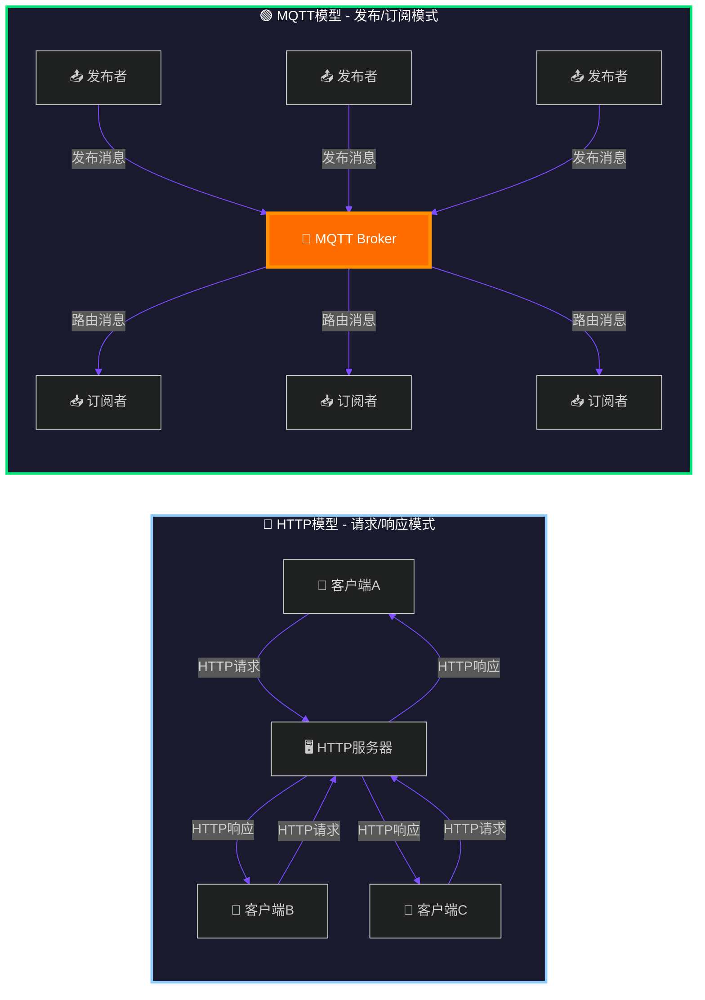

### 11.2.2 开销与性能对比

HTTP协议头相对较大，一个GET请求通常包含状态行、多个头部字段，即使请求没有body，HTTP头部也可能达到数百字节。响应同样包含状态行和多个头部字段。此外，HTTP是文本协议，解析效率不如二进制协议。

MQTT协议头最小仅为2字节，可变头部和载荷根据实际内容而定。这使得MQTT在带宽受限的环境中有显著优势。以一个温度传感器上报数据的场景为例，MQTT每次只需要发送几个字节的有效载荷，而HTTP可能需要发送数百字节的协议头。

### 11.2.3 实时性与效率对比

HTTP的实时性受限主要体现在两个方面。首先，HTTP是无状态的，每次请求都需要建立连接（短连接）或保持连接（长连接），即使使用HTTP/1.1的Keep-Alive，请求-响应模型也限制了双向通信的效率。其次，HTTP客户端必须轮询才能获取新数据，或者依赖WebSocket等补充协议实现服务器推送。

MQTT天然支持服务器推送，订阅者一旦订阅了某个主题，任何时候该主题有新消息，服务器都会立即推送给所有订阅者。这种机制使得MQTT非常适合需要实时响应的物联网场景，如报警触发、远程控制等。

### 11.2.4 选型建议

选择MQTT还是HTTP需要根据具体场景判断。以下情况建议选择MQTT：物联网设备数据采集与监控场景；需要服务器主动向设备下发指令的场景；设备数量庞大，需要高效管理的主题化通信；带宽和功耗受限的嵌入式设备；需要多对一（多个传感器对一个数据中心）的通信模式。

以下情况建议选择HTTP：基于RESTful API的Web服务集成；简单的请求-响应场景；与现有HTTP生态系统集成；需要广泛工具链和中间件支持；单向数据获取为主的场景。

| 特性 | MQTT | HTTP |
|------|------|------|
| 通信模式 | 发布/订阅 | 请求/响应 |
| 协议开销 | 2-字节最小头部 | 数百字节头部 |
| 双向通信 | 原生支持 | 需要WebSocket补充 |
| 服务器推送 | 原生支持 | 需要轮询或WebSocket |
| 适用场景 | 物联网、车联网 | Web API、REST服务 |
| 复杂度 | 协议简单 | 协议复杂，功能丰富 |

## 11.3 发布订阅模型

MQTT的发布/订阅模型是其核心特性，这种模型实现了消息生产者与消费者的完全解耦。在本节中，我们将详细了解发布订阅模型的各个组成部分以及工作原理。

### 11.3.1 发布订阅模型架构

发布/订阅模型由三个核心角色组成：发布者（Publisher）、订阅者（Subscriber）和代理（Broker）。发布者是消息的生产者，它将消息发布到特定的主题。订阅者从代理订阅自己感兴趣的主题，当有消息发布到订阅的主题时，代理会将消息推送给订阅者。代理是整个模型的核心枢纽，负责接收发布者的消息，并将消息路由到所有订阅了相应主题的订阅者。

这种架构的关键优势是解耦。发布者不需要知道有多少订阅者，订阅者也不需要知道消息来自哪个发布者。它们通过主题进行间接通信，只要主题匹配，消息就能正确传递。这种设计使得系统具有很好的可扩展性，可以随时添加或移除发布者和订阅者，而不需要修改其他组件。

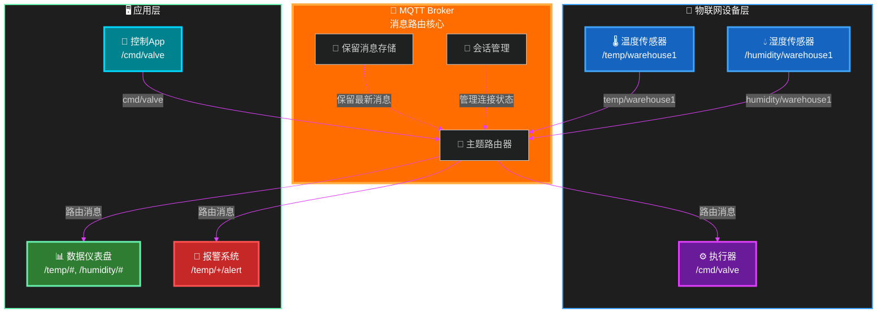

### 11.3.2 主题与通配符

主题（Topic）是MQTT中消息路由的核心。主题是一个UTF-8字符串，使用斜杠（/）作为层级分隔符。例如，"home/livingroom/temperature"表示家居场景下客厅的温度主题，"factory/assemblyline/robot01/status"表示工厂装配线01号机器人的状态主题。

主题名称对大小写敏感，"Temperature"和"temperature"是两个不同的主题。主题不能包含空格，应使用下划线或驼峰命名。空主题（""）是合法的，用于MQTT 5.0的某些高级特性。

MQTT定义了两种通配符用于订阅时的批量匹配。单层通配符（Single-level Wildcard）用加号（+）表示，匹配单一层级。例如，订阅"home/+/temperature"可以匹配"home/livingroom/temperature"和"home/bedroom/temperature"，但不匹配"home/livingroom/humidity"。

多层通配符（Multi-level Wildcard）用井号（#）表示，匹配当前层级及其所有子层级。例如，订阅"home/#"可以匹配"home"、"home/livingroom"、"home/livingroom/temperature"等。通配符只能用于订阅，不能用于发布。发布时必须使用完整的主题名称。

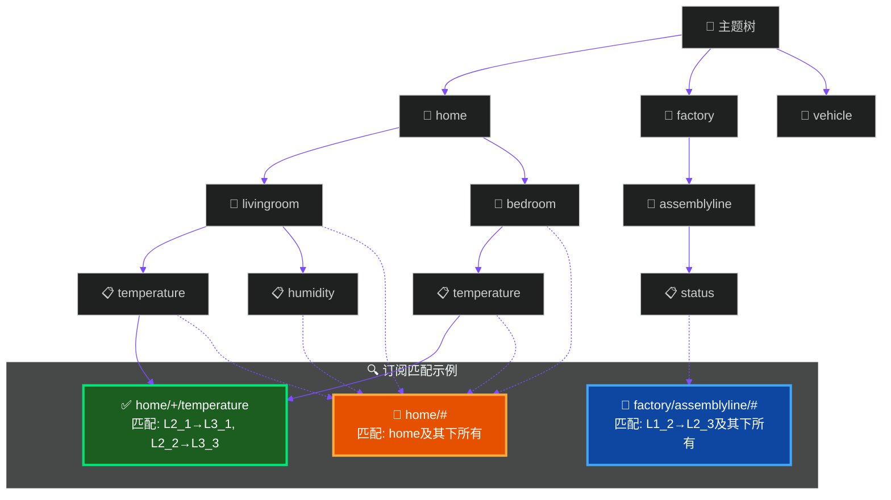

### 11.3.3 系统主题

MQTT定义了一些以美元符（$）开头的主题，称为系统主题（System Topics）。这些主题用于获取代理的内部状态和统计信息，而不是用于用户消息的发布订阅。

常用的系统主题包括：$SYS/broker/clients/connected表示当前连接的客户端数量；$SYS/broker/clients/maximum表示历史最大客户端连接数；$SYS/broker/messages/received表示代理已接收的消息总数；$SYS/broker/messages/sent表示代理已发送的消息总数；$SYS/broker/uptime表示代理运行时间。

需要注意的是，系统主题的命名和内容可能因不同的MQTT代理实现而有所差异。开发者在使用时应当参考具体代理的文档。

### 11.3.4 主题设计最佳实践

良好的主题设计是构建可扩展MQTT系统的基础。主题命名应具有描述性，使用清晰的层级结构。常见的主题结构模式包括基于位置的命名（如"building/floor/room"）、基于设备的命名（如"device/sensor/type"）、基于功能的命名（如"command/response/event"）等。

对于大规模部署，建议在主题中包含租户或组织标识以实现多租户隔离。建议在主题层级中包含版本标识，以便未来协议升级。建议避免主题层级过深，一般不超过5层。订阅者应尽可能精确地订阅需要的主题，避免使用过于宽泛的通配符导致收到无关消息。

## 11.4 MQTT QoS级别

MQTT定义了三种服务质量（Quality of Service）级别，用于在不同场景下平衡消息传递的可靠性和性能。QoS级别决定了消息从发布者到订阅者的传递保证程度。

### 11.4.1 QoS 0：最多交付一次

QoS 0（At Most Once）是最低的服务级别，消息最多交付一次。发布者发送消息后，不等待确认，消息被标记为已发送。如果网络中断或接收方未收到消息，发布者不会重试，消息可能丢失。

QoS 0的工作流程最为简单：发布者发送PUBLISH报文，包含QoS 0标志；代理收到后直接投递消息给订阅者，不做任何确认；发布者也不等待任何响应，继续发送下一条消息。这种模式的性能最高、开销最小，但无法保证消息是否到达。

适用场景包括：环境传感器的周期性数据上报，数据丢失可以接受；视频或音频流的实时传输，丢失少量数据不影响整体体验；日志收集，允许偶尔丢失一些日志记录。

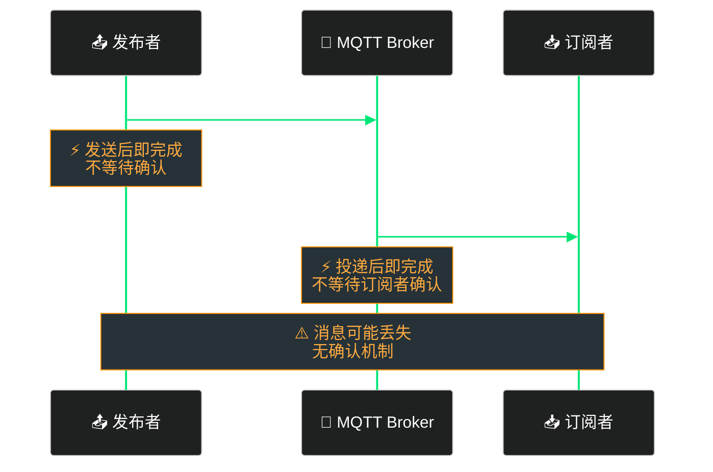

### 11.4.2 QoS 1：至少交付一次

QoS 1（At Least Once）确保消息至少交付一次。发布者发送消息后，会等待代理的PUBACK确认。如果在规定时间内未收到确认，发布者会重发消息。这可能导致订阅者收到重复消息。

QoS 1的工作流程引入了确认机制：发布者发送PUBLISH报文，设置QoS 1标志；代理收到后投递消息给订阅者，然后发送PUBACK确认；发布者收到PUBACK后确认消息已传递；如果发布者在超时时间内未收到PUBACK，会重新发送消息（设置DUP=1标志）。

QoS 1需要订阅者具备处理重复消息的能力，通常通过在消息中包含唯一ID或序列号来实现幂等处理。

适用场景包括：重要的状态更新，不允许丢失但可以接受重复；控制指令的确认反馈，需要确保指令到达；告警通知，必须送达但不介意重复。

```mermaid
%%{
    init: {
        'theme': 'dark',
        'themeVariables': {
            'primaryColor': '#00D9FF',
            'primaryTextColor': '#FFFFFF',
            'primaryBorderColor': '#00B8D4',
            'lineColor': '#7C4DFF',
            'secondaryColor': '#00E676',
            'tertiaryColor': '#1E1E1E',
            'noteBkgColor': '#263238',
            'noteTextColor': '#FFAB40',
            'noteBorderColor': '#FF9100',
            'actorBkgColor': '#1A1A2E',
            'actorBorderColor': '#00D9FF',
            'actorTextColor': '#FFFFFF',
            'actorLineColor': '#00E676',
            'signalColor': '#00E676',
            'signalTextColor': '#FFFFFF'
        }
    }
}%%
sequenceDiagram
    participant Pub as 📤 发布者
    participant Broker as 🔶 MQTT Broker
    participant Sub as 📥 订阅者

    Pub->>Broker: PUBLISH (QoS 1, DUP=0, Packet ID=5)
    Note over Pub: ⏳ 等待PUBACK确认

    Broker->>Sub: 投递消息 📬

    Broker->>Pub: PUBACK (Packet ID=5) ✓
    Note over Broker: ✅ 确认消息已接收

    Note over Pub,Sub: 🔁 消息可能重复<br/>但不会丢失

    rect rgb(30, 50, 70)
        Note over Pub: ⏰ 超时未收到PUBACK
        Pub->>Broker: PUBLISH (QoS 1, DUP=1, Packet ID=5) 🔄
        Broker->>Pub: PUBACK (Packet ID=5) ✓
    end
```

### 11.4.3 QoS 2：恰好交付一次

QoS 2（Exactly Once）是最高的QoS级别，确保消息恰好交付一次。这通过四步握手（Two-Step Handshake）实现，消息不会丢失也不会重复。QoS 2的开销最大，适用于对消息重复极度敏感的场景。

QoS 2的工作流程分为四个阶段。第一阶段：发布者发送PUBLISH报文（QoS 2，DUP=0），代理回复PUBREC报文。第二阶段：发布者收到PUBREC后发送PUBREL报文。第三阶段：代理收到PUBREL后投递消息给订阅者，并发送PUBCOMP报文。第四阶段：发布者收到PUBCOMP后完成传递。

整个流程确保了发布者和代理之间的消息传递是可靠的，同时代理到订阅者的传递也是可靠的。订阅者需要使用Packet ID来避免重复处理消息。

适用场景包括：金融交易指令，必须保证恰好执行一次；计费数据采集，不能丢失也不能重复计费；关键设备控制命令，防止重复执行造成事故。

```mermaid
%%{
    init: {
        'theme': 'dark',
        'themeVariables': {
            'primaryColor': '#00D9FF',
            'primaryTextColor': '#FFFFFF',
            'primaryBorderColor': '#00B8D4',
            'lineColor': '#E040FB',
            'secondaryColor': '#00E676',
            'tertiaryColor': '#1E1E1E',
            'noteBkgColor': '#263238',
            'noteTextColor': '#FFAB40',
            'noteBorderColor': '#FF9100',
            'actorBkgColor': '#1A1A2E',
            'actorBorderColor': '#00D9FF',
            'actorTextColor': '#FFFFFF',
            'actorLineColor': '#00E676',
            'signalColor': '#00E676',
            'signalTextColor': '#FFFFFF'
        }
    }
}%%
sequenceDiagram
    participant Pub as 📤 发布者
    participant Broker as 🔶 MQTT Broker
    participant Sub as 📥 订阅者

    Note over Pub,Sub: 🎯 QoS 2 四步握手流程

    rect rgb(20, 40, 60)
        Note over Pub,Broker: 📤 第一阶段：发布
        Pub->>Broker: PUBLISH (QoS 2, DUP=0, Packet ID=10)
        Broker->>Pub: PUBREC (Packet ID=10) ✓
    end

    rect rgb(30, 50, 70)
        Note over Pub,Broker: 🔓 第二阶段：释放
        Pub->>Broker: PUBREL (Packet ID=10)
        Broker->>Pub: PUBCOMP (Packet ID=10) ✓
    end

    rect rgb(40, 60, 80)
        Note over Broker,Sub: 📬 第三阶段：投递
        Broker->>Sub: PUBLISH (QoS 2, Packet ID=10)
        Sub->>Broker: PUBREC (Packet ID=10) ✓
        Broker->>Sub: PUBREL (Packet ID=10)
        Sub->>Broker: PUBCOMP (Packet ID=10) ✓
    end

    Note over Pub,Sub: ✨ 消息恰好交付一次<br/>无丢失无重复
```

### 11.4.4 QoS级别选择指南

选择合适的QoS级别需要考虑应用对可靠性的要求、网络条件和性能需求。对于大多数物联网传感器数据采集场景，QoS 0通常是最佳选择，因为这些数据是周期性的，丢失少量数据不会影响整体判断，且QoS 0的开销最小，适合资源受限的设备。

对于控制指令和关键状态同步，建议使用QoS 1。这些场景不能丢失消息，但偶发的重复可以通过应用层的幂等处理来应对。对于金融支付、设备控制等绝对不能重复的场景，必须使用QoS 2，即使这会带来更大的协议开销。

需要注意的是，QoS级别不会跨订阅者降级。如果发布者以QoS 2发送消息，但订阅者的订阅使用QoS 0，那么该订阅者收到的是QoS 0的消息。QoS实际上是在发布者和代理之间协商的最低保证级别。

## 11.5 保留消息

保留消息（Retained Message）是MQTT的一个独特特性，它允许新订阅的客户端立即接收到该主题的最新消息，而不必等待消息发布者下次发送消息。这对于刚启动的客户端获取当前系统状态非常有用。

### 11.5.1 保留消息的工作原理

当发布者发布消息时，可以将RETAIN标志设置为true来发送保留消息。代理会为该主题存储这条保留消息。当新的客户端订阅该主题时，代理会立即将保留消息发送给该客户端。如果某个主题没有保留消息，新订阅者不会收到任何消息。

保留消息的存储机制是每个主题只保留最新的一条。发布新的保留消息会覆盖旧的保留消息。当保留消息被删除时，代理会向订阅者发送一条空消息（Payload为空）的保留消息。

保留消息适用于多种场景。设备状态同步是新设备连接时获取当前状态的理想方式。配置下发是服务器可以预先设置配置信息，新的设备订阅配置主题后立即获取最新配置。在线状态检测可以通过保留消息让新订阅者知道设备当前状态。

### 11.5.2 保留消息的示例

考虑一个智能家居场景。温度传感器定期发布温度数据，使用保留消息：

```
发布保留消息: home/livingroom/temperature
Payload: {"value": 23.5, "unit": "celsius"}
RETAIN: true
```

新用户打开手机App，订阅home/livingroom/temperature主题。代理立即将保留消息推送给手机App，用户立刻看到当前温度，而不必等待下一个周期性的数据上报。

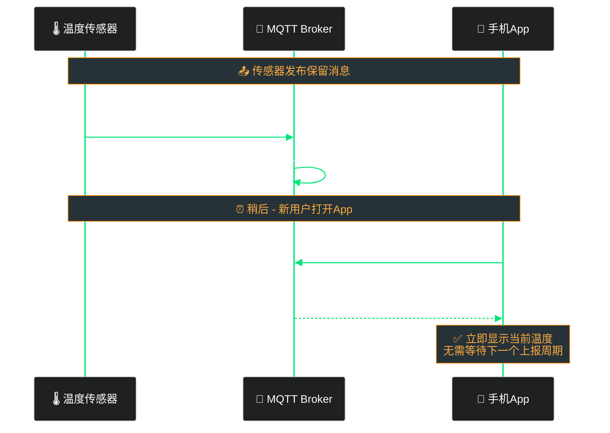

### 11.5.3 保留消息的管理

删除保留消息有几种方式。发布者可以发布一条空Payload的保留消息来删除该主题的保留消息。某些代理支持通过管理接口或命令删除保留消息。保留消息通常有过期时间（MQTT 5.0支持），过期后自动删除。

在应用设计中，应当注意保留消息的存储空间管理。大量主题的保留消息可能占用较多代理存储空间。某些场景下，可以定期发布新的保留消息来更新状态，而不是累积大量保留消息。

## 11.6 遗嘱消息

遗嘱消息（Last Will and Testament，LWT）是MQTT为物联网场景设计的一个独特特性。它允许客户端在连接时向代理注册一个遗嘱消息，当客户端异常断开连接时（比如网络中断或客户端崩溃），代理会自动将这个遗嘱消息发布到指定的主题。

### 11.6.1 遗嘱消息的用途

遗嘱消息的主要用途是检测客户端的异常断开。当客户端正常调用DISCONNECT断开连接时，代理不会发送遗嘱消息。但如果客户端因为网络故障、电源中断等原因非正常断开，代理会在一定超时时间后检测到连接丢失，然后发布预先注册的遗嘱消息。

遗嘱消息的典型应用场景包括：设备在线状态监控，后台系统订阅设备的遗嘱消息主题，当设备异常断开时收到通知；设备故障报警，可以通过遗嘱消息通知后台设备发生了故障；分布式协调，在集群系统中利用遗嘱消息实现故障检测和节点选举。

### 11.6.2 遗嘱消息的配置

客户端在建立连接时，通过CONNECT报文指定遗嘱消息的各个参数。Will Topic指定遗嘱消息发布到哪个主题。Will Payload指定遗嘱消息的内容。Will QoS指定发布遗嘱消息时使用的QoS级别。Will Retain指定遗嘱消息是否作为保留消息发布。Will Flag必须设置为true才能启用遗嘱消息功能。

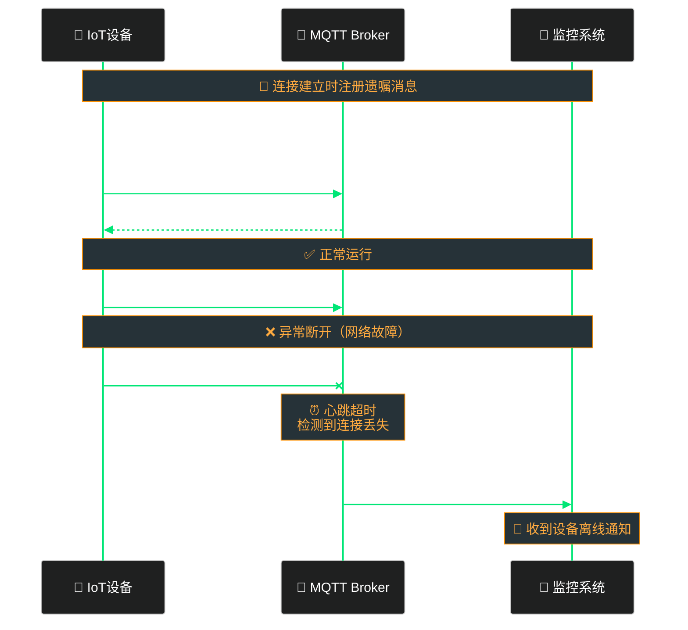

### 11.6.3 遗嘱消息与Clean Session

遗嘱消息的行为受到Clean Session标志的影响。如果Clean Session设置为0（持久会话），客户端断开连接后，代理会保留该客户端的订阅信息和离线消息。当客户端重新连接时，可以使用相同的Client ID恢复之前的会话。如果客户端异常断开且Clean Session为0，代理仍会发布遗嘱消息。

如果Clean Session设置为1（新会话），代理在客户端断开连接时删除该客户端的所有会话信息，包括订阅信息和离线消息。遗嘱消息仍然会在检测到异常断开时发布。

### 11.6.4 遗嘱消息的应用示例

考虑一个车队管理系统。每一辆运输车安装一个GPS追踪器，通过MQTT与后台系统通信。追踪器配置如下遗嘱消息：

```
Will Topic: fleet/truck/001/status
Will Payload: {"truck_id": "001", "status": "offline", "last_location": {"lat": 39.9, "lon": 116.4}, "timestamp": "2026-05-23T10:30:00Z"}
Will QoS: 1
Will Retain: true
```

当运输车进入信号不好的隧道导致连接中断时，代理会在超时后发布遗嘱消息。后台监控系统订阅fleet/truck/+/status主题，立即收到卡车的离线通知，可以采取相应措施如联系司机确认安全。卡车驶出隧道恢复信号后，会重新连接并继续上报位置数据。

## 11.7 客户端标识符与会话

客户端标识符（Client Identifier，Client ID）和会话（Session）是MQTT连接管理的核心概念。它们共同决定了客户端与代理之间的连接状态和消息传递行为。

### 11.7.1 客户端标识符

Client ID是用于唯一标识MQTT客户端的字符串。代理使用Client ID来区分不同的客户端，并在连接层面进行管理。每个MQTT客户端必须有一个唯一的Client ID，否则可能会出现连接冲突。

Client ID的规则包括：最大长度23字节（MQTT 3.1.1），MQTT 5.0扩展到更长的长度；可以包含字母、数字和可见字符的组合；通常建议使用有意义的标识符，如设备序列号或UUID。

Broker对重复Client ID的处理取决于服务器配置。默认情况下，Broker会断开之前的连接，让新的客户端接入。这为客户端重新连接（如网络中断后恢复）提供了便利。

MQTT允许在连接时设置Clean Session标志来决定是否创建新会话或恢复已存在的会话。如果设置Clean Session为false且Broker支持持久会话，客户端可以使用与之前相同的Client ID来恢复之前的会话状态，包括订阅信息和未接收的离线消息。

### 11.7.2 会话管理

MQTT中的会话（Session）是指客户端与代理之间持续连接的状态信息。会话包含了客户端的订阅信息、离线消息（未接收的消息）以及可能的客户端状态数据。

会话的类型分为两种。Clean Session（干净会话）在连接时设置Clean Session为true，代理会为这个连接创建一个全新的会话。断开连接后，代理删除该会话的所有信息，包括订阅关系和离线消息。客户端重新连接时需要重新订阅所有主题。这适合大多数场景，特别是那些不关心离线消息的情况。

Persistent Session（持久会话）在连接时设置Clean Session为false，代理会持久化存储这个会话的相关信息。即使客户端断开连接，代理仍然保留订阅信息，并缓存客户端离线期间的消息。当客户端重新连接并使用相同的Client ID时，可以恢复之前的会话，继续接收离线期间积压的消息。这适合需要可靠消息传递但可能频繁断开连接的物联网设备。

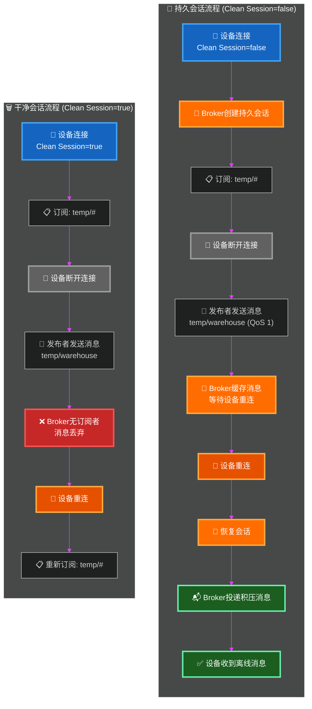

### 11.7.3 会话过期间隔

MQTT 5.0引入了会话过期间隔（Session Expiry Interval）概念，允许客户端指定会话保留的时长。在CONNECT报文中，客户端可以设置Session Expiry Interval属性，表示断开连接后会话保留的秒数。如果设置为0，会话立即过期；如果设置为0xFFFFFFFF（最大值），会话永不过期。

这为移动网络等场景提供了更好的支持。移动设备可能在网络切换时短暂断开，如果设置较长的会话过期间隔，设备重连后仍然可以恢复之前的会话，继续接收之前积压的消息。

## 11.8 MQTT连接流程

MQTT的连接建立过程是一个精心设计的握手流程，确保客户端和代理之间的通信是可靠和安全的。整个流程包括TCP连接建立、TLS握手（可选）、MQTT CONNECT握手和CONNACK响应。

### 11.8.1 MQTT CONNECT报文结构

CONNECT报文是客户端发送给代理的第一个报文，用于启动MQTT连接。CONNECT报文的结构包括固定头部、可变头部和载荷。

固定头部第一个字节是报文类型，CONNECT为1。第二个字节开始是剩余长度字段，表示可变头部和载荷的总字节数。

可变头部包含多个字段。Protocol Name是字符串"MQTT"（用于MQTT 3.1.1）或变长的协议名称和版本。Protocol Level用于MQTT 3.1.1，值为4；MQTT 5.0使用协议版本为5。Connect Flags包含多个布尔标志位，包括Clean Session、Will Flag、Will QoS、Will Retain、Password Flag和User Name Flag。Keep Alive是一个16位整数，表示客户端和代理之间的最大通信间隔（秒）。

载荷部分依次包含Client ID、Will Topic（如果Will Flag为1）、Will Payload（如果Will Flag为1）、User Name（如果User Name Flag为1）和Password（如果Password Flag为1）。

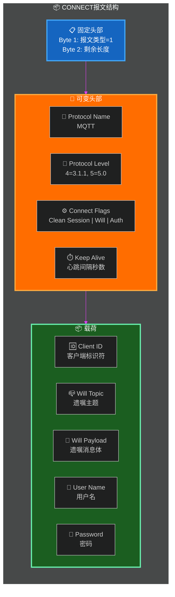

### 11.8.2 CONNECT握手流程

MQTT连接建立的详细流程如下。首先是底层连接建立，客户端与代理建立TCP连接，通常连接到1883端口（非加密）或8883端口（加密）。

然后是MQTT CONNECT发送，客户端组装并发送CONNECT报文，包含协议版本、客户端ID、连接标志、遗嘱消息配置、用户名密码等信息。

代理收到CONNECT后进行验证，包括检查协议版本是否支持、验证用户名密码、检查Client ID格式、检查各项标志设置是否合法等。验证通过后，代理向客户端发送CONNACK报文作为响应。

```mermaid
%%{
    init: {
        'theme': 'dark',
        'themeVariables': {
            'primaryColor': '#00D9FF',
            'primaryTextColor': '#FFFFFF',
            'primaryBorderColor': '#00B8D4',
            'lineColor': '#E040FB',
            'secondaryColor': '#00E676',
            'tertiaryColor': '#1E1E1E',
            'noteBkgColor': '#263238',
            'noteTextColor': '#FFAB40',
            'noteBorderColor': '#FF9100',
            'actorBkgColor': '#1A1A2E',
            'actorBorderColor': '#00D9FF',
            'actorTextColor': '#FFFFFF',
            'actorLineColor': '#00E676',
            'signalColor': '#00E676',
            'signalTextColor': '#FFFFFF'
        }
    }
}%%
sequenceDiagram
    participant Client as 📤 MQTT客户端
    participant Broker as 🔶 MQTT Broker

    Note over Client,Broker: 🔌 TCP连接建立

    Client->>Broker: TCP SYN (端口1883) 📨
    Broker-->>Client: TCP SYN-ACK ✅
    Client->>Broker: TCP ACK ✅
    Note over Client,Broker: ✅ TCP连接就绪

    Note over Client,Broker: 📝 MQTT CONNECT握手

    Client->>Broker: CONNECT<br/>Protocol Level: 4 (MQTT 3.1.1)<br/>Client ID: device_001<br/>Clean Session: true<br/>Keep Alive: 60<br/>Will: disabled<br/>Username: sensor01<br/>Password: ****

    Note over Broker: 🔍 验证阶段<br/>检查协议版本<br/>验证认证信息<br/>检查Client ID

    Broker-->>Client: CONNACK<br/>Return Code: 0 (Connection Accepted)<br/>Session Present: false ✅

    Note over Client,Broker: 🎉 连接建立成功<br/>开始业务通信

    rect rgb(30, 50, 70)
        Note over Client,Broker: 💓 周期性心跳保活
        loop 心跳
            Client->>Broker: PINGREQ 📤
            Broker-->>Client: PINGRESP 📥 ✅
        end
    end
```

### 11.8.3 CONNACK响应码

CONNACK报文包含两个字段：连接确认标志（Connect Acknowledge Flags）和连接返回码（Return Code）。连接确认标志的Session Present位指示是否有一个持久会话被恢复。

返回码表示连接尝试的结果。0表示连接被接受，连接成功建立。1表示协议版本不被支持，客户端使用的MQTT协议版本代理不支持。2表示客户端标识符被拒绝，Client ID格式不正确或被保留。3表示服务器不可用，代理暂时无法接受连接。4表示用户名或密码无效。5表示未经授权，客户端没有权限连接。6-255为保留值。

MQTT 5.0扩展了返回码，增加了多个原因码（Reason Code），提供更详细的连接失败原因，并引入了属性（Properties）字段用于传递额外的连接信息。

### 11.8.4 心跳机制

MQTT使用心跳机制（Keep Alive）来检测连接的存活状态。客户端在CONNECT报文中设置Keep Alive值，表示客户端愿意保持连接的最大时间间隔（秒）。如果设置为0，心跳机制被禁用。

心跳流程如下。客户端在每个Keep Alive间隔内发送PINGREQ报文。代理收到后回复PINGRESP报文。如果代理在1.5倍Keep Alive时间内未收到客户端的任何消息，会认为连接断开，关闭连接并触发遗嘱消息。同样，如果客户端在发送消息后等待超过1.5倍Keep Alive时间未收到代理的响应，也会认为连接断开。

大多数MQTT客户端库会自动处理心跳，开发者通常不需要手动发送PINGREQ。但如果需要精确控制连接状态，可以手动管理心跳。

## 11.9 工程示例

本节将通过实际代码示例和配置演示，展示如何使用Python paho-mqtt库开发MQTT应用，以及如何配置Mosquitto代理服务器。

### 11.9.1 Python paho-mqtt简介

paho-mqtt是Eclipse基金会维护的MQTT客户端库，是Python中使用最广泛的MQTT客户端库。它提供了完整的MQTT协议支持，包括QoS 0/1/2、保留消息、遗嘱消息、持久会话等特性。

安装paho-mqtt非常简单，使用pip即可：

```bash
pip install paho-mqtt
```

### 11.9.2 基础发布者示例

以下是一个基础的MQTT发布者示例，展示如何连接到MQTT代理并发布消息：

```python
#!/usr/bin/env python3
"""
MQTT发布者示例 - 温度传感器数据上报
"""
import paho.mqtt.client as mqtt
import json
import time
import random
from datetime import datetime

# MQTT Broker配置
BROKER_HOST = "localhost"
BROKER_PORT = 1883
KEEPALIVE = 60

# 主题配置
TOPIC_TEMPERATURE = "home/livingroom/temperature"
TOPIC_HUMIDITY = "home/livingroom/humidity"
TOPIC_STATUS = "home/livingroom/status"

# 客户端配置
CLIENT_ID = "temperature_sensor_001"

def on_connect(client, userdata, flags, reason_code, properties=None):
    """连接回调函数"""
    if reason_code == 0:
        print(f"[{datetime.now()}] 成功连接到MQTT Broker")
        # 连接成功后发布在线状态（保留消息）
        client.publish(
            TOPIC_STATUS,
            payload=json.dumps({
                "status": "online",
                "timestamp": datetime.now().isoformat()
            }),
            qos=1,
            retain=True
        )
    else:
        print(f"[{datetime.now()}] 连接失败，原因码: {reason_code}")

def on_disconnect(client, userdata, reason_code, properties=None):
    """断开连接回调函数"""
    print(f"[{datetime.now()}] 断开连接，原因码: {reason_code}")

def on_publish(client, userdata, mid, reason_codes, properties=None):
    """发布回调函数"""
    print(f"[{datetime.now()}] 消息{mid}发布成功")

def publish_sensor_data(client):
    """模拟传感器数据上报"""
    # 生成模拟温度数据
    temperature = round(random.uniform(18.0, 30.0), 1)
    humidity = round(random.uniform(40.0, 70.0), 1)

    # 发布温度数据 (QoS 0)
    client.publish(
        TOPIC_TEMPERATURE,
        payload=json.dumps({
            "value": temperature,
            "unit": "celsius",
            "timestamp": datetime.now().isoformat()
        }),
        qos=0,
        retain=False
    )
    print(f"[{datetime.now()}] 发布温度: {temperature}°C")

    # 发布湿度数据 (QoS 0)
    client.publish(
        TOPIC_HUMIDITY,
        payload=json.dumps({
            "value": humidity,
            "unit": "percent",
            "timestamp": datetime.now().isoformat()
        }),
        qos=0,
        retain=False
    )
    print(f"[{datetime.now()}] 发布湿度: {humidity}%")

def main():
    """主函数"""
    # 创建客户端实例
    client = mqtt.Client(
        client_id=CLIENT_ID,
        protocol=mqtt.MQTTv311,
        clean_session=True
    )

    # 设置回调函数
    client.on_connect = on_connect
    client.on_disconnect = on_disconnect
    client.on_publish = on_publish

    # 设置遗嘱消息
    client.will_set(
        TOPIC_STATUS,
        payload=json.dumps({
            "status": "offline",
            "reason": "unexpected_disconnect",
            "timestamp": datetime.now().isoformat()
        }),
        qos=1,
        retain=True
    )

    # 连接Broker
    print(f"[{datetime.now()}] 正在连接 {BROKER_HOST}:{BROKER_PORT}...")
    client.connect(BROKER_HOST, BROKER_PORT, KEEPALIVE)

    # 启动消息循环（处理网络通信和回调）
    client.loop_start()

    try:
        # 每5秒发布一次数据
        while True:
            publish_sensor_data(client)
            time.sleep(5)
    except KeyboardInterrupt:
        print(f"\n[{datetime.now()}] 收到中断信号，正在关闭...")
    finally:
        # 发布离线状态
        client.publish(
            TOPIC_STATUS,
            payload=json.dumps({
                "status": "offline",
                "reason": "normal_shutdown",
                "timestamp": datetime.now().isoformat()
            }),
            qos=1,
            retain=True
        )
        client.loop_stop()
        client.disconnect()
        print(f"[{datetime.now()}] 已断开连接")

if __name__ == "__main__":
    main()
```

### 11.9.3 基础订阅者示例

以下是一个基础的MQTT订阅者示例，展示如何订阅主题并接收消息：

```python
#!/usr/bin/env python3
"""
MQTT订阅者示例 - 家居设备控制器
"""
import paho.mqtt.client as mqtt
import json
from datetime import datetime

# MQTT Broker配置
BROKER_HOST = "localhost"
BROKER_PORT = 1883
KEEPALIVE = 60

# 主题配置
TOPIC_TEMPERATURE = "home/+/temperature"      # 单层通配符订阅
TOPIC_ALL_STATUS = "home/#"                    # 多层通配符订阅
TOPIC_COMMAND = "home/livingroom/command"     # 控制命令主题

class HomeController:
    """家居控制器"""

    def __init__(self):
        self.temperature_threshold = 26.0  # 温度阈值
        self.devices = {
            "air_conditioner": {"status": "off", "temperature": 24},
            "fan": {"status": "off"},
            "dehumidifier": {"status": "off"}
        }

    def on_temperature_update(self, temperature):
        """温度更新处理"""
        print(f"[{datetime.now()}] 收到温度更新: {temperature}°C")

        if temperature > self.temperature_threshold:
            print(f"[{datetime.now()}] 温度超过阈值{self.temperature_threshold}°C，开启空调")
            self.devices["air_conditioner"]["status"] = "on"
        else:
            print(f"[{datetime.now()}] 温度正常，关闭空调")
            self.devices["air_conditioner"]["status"] = "off"

    def execute_command(self, command):
        """执行控制命令"""
        device = command.get("device")
        action = command.get("action")

        if device in self.devices:
            if action == "on":
                self.devices[device]["status"] = "on"
                print(f"[{datetime.now()}] 设备 {device} 已开启")
            elif action == "off":
                self.devices[device]["status"] = "off"
                print(f"[{datetime.now()}] 设备 {device} 已关闭")
            else:
                print(f"[{datetime.now()}] 未知动作: {action}")
        else:
            print(f"[{datetime.now()}] 未知设备: {device}")

    def get_status(self):
        """获取设备状态"""
        return self.devices

def on_connect(client, userdata, flags, reason_code, properties=None):
    """连接回调函数"""
    if reason_code == 0:
        print(f"[{datetime.now()}] 成功连接到MQTT Broker")
        # 订阅主题
        client.subscribe(TOPIC_TEMPERATURE, qos=1)
        print(f"[{datetime.now()}] 已订阅: {TOPIC_TEMPERATURE}")
        client.subscribe(TOPIC_COMMAND, qos=1)
        print(f"[{datetime.now()}] 已订阅: {TOPIC_COMMAND}")
        # 也可以使用多主题订阅
        # client.subscribe([(TOPIC_TEMPERATURE, 1), (TOPIC_COMMAND, 1)])
    else:
        print(f"[{datetime.now()}] 连接失败，原因码: {reason_code}")

def on_message(client, userdata, message):
    """消息回调函数"""
    topic = message.topic
    payload = message.payload.decode('utf-8')
    qos = message.qos

    print(f"\n[{datetime.now()}] 收到消息:")
    print(f"  主题: {topic}")
    print(f"  QoS: {qos}")
    print(f"  内容: {payload}")

    try:
        data = json.loads(payload)

        # 根据主题处理不同的消息
        if topic.endswith("/temperature"):
            # 温度数据
            if "value" in data:
                controller = userdata
                controller.on_temperature_update(data["value"])

        elif topic.endswith("/command"):
            # 控制命令
            controller = userdata
            controller.execute_command(data)

    except json.JSONDecodeError:
        print(f"[{datetime.now()}] JSON解析失败: {payload}")
    except Exception as e:
        print(f"[{datetime.now()}] 处理消息时出错: {e}")

def on_subscribe(client, userdata, mid, reason_codes, properties=None):
    """订阅回调函数"""
    print(f"[{datetime.now()}] 订阅完成，消息ID: {mid}")

def on_disconnect(client, userdata, reason_code, properties=None):
    """断开连接回调函数"""
    print(f"[{datetime.now()}] 断开连接，原因码: {reason_code}")

def main():
    """主函数"""
    controller = HomeController()

    # 创建客户端实例（持久会话）
    client = mqtt.Client(
        client_id="home_controller_001",
        protocol=mqtt.MQTTv311,
        clean_session=False  # 使用持久会话
    )

    # 传递控制器实例到回调
    client.user_data_set(controller)

    # 设置回调函数
    client.on_connect = on_connect
    client.on_message = on_message
    client.on_subscribe = on_subscribe
    client.on_disconnect = on_disconnect

    # 设置遗嘱消息
    client.will_set(
        "home/controller/status",
        payload=json.dumps({
            "status": "offline",
            "reason": "unexpected_disconnect"
        }),
        qos=1,
        retain=True
    )

    # 连接Broker
    print(f"[{datetime.now()}] 正在连接 {BROKER_HOST}:{BROKER_PORT}...")
    client.connect(BROKER_HOST, BROKER_PORT, KEEPALIVE)

    # 启动消息循环
    client.loop_forever()

if __name__ == "__main__":
    main()
```

### 11.9.4 QoS与持久会话示例

以下示例展示如何利用QoS和持久会话实现可靠的消息传递：

```python
#!/usr/bin/env python3
"""
MQTT QoS与持久会话示例 - 关键数据采集
"""
import paho.mqtt.client as mqtt
import json
import time
from datetime import datetime

BROKER_HOST = "localhost"
BROKER_PORT = 1883

class ReliableCollector:
    """可靠数据采集器"""

    def __init__(self, client_id):
        self.client_id = client_id
        self.received_messages = set()  # 用于去重

    def on_connect(self, client, userdata, flags, reason_code, properties=None):
        """连接回调"""
        if reason_code == 0:
            print(f"[{datetime.now()}] 连接成功，Session Present: {flags.get('session_present', False)}")
            # 订阅关键数据主题，使用QoS 2确保恰好一次交付
            client.subscribe("sensors/+/critical", qos=2)
            print(f"[{datetime.now()}] 已订阅 QoS 2: sensors/+/critical")
        else:
            print(f"[{datetime.now()}] 连接失败: {reason_code}")

    def on_message(self, client, userdata, message):
        """消息回调 - 演示如何处理重复消息"""
        topic = message.topic
        payload = message.payload.decode('utf-8')
        mid = message.mid  # 消息ID

        # 使用消息ID进行幂等处理
        if mid in self.received_messages:
            print(f"[{datetime.now()}] 忽略重复消息 MID: {mid}")
            return

        self.received_messages.add(mid)
        print(f"[{datetime.now()}] 处理新消息 MID: {mid}")
        print(f"  主题: {topic}")
        print(f"  内容: {payload}")

        # 业务处理逻辑
        try:
            data = json.loads(payload)
            print(f"  数据ID: {data.get('id')}, 值: {data.get('value')}")
        except json.JSONDecodeError:
            pass

    def on_disconnect(self, client, userdata, reason_code, properties=None):
        """断开回调"""
        print(f"[{datetime.now()}] 断开连接: {reason_code}")

def main():
    collector = ReliableCollector("collector_001")

    # 使用持久会话，确保离线消息被保留
    client = mqtt.Client(
        client_id=collector.client_id,
        protocol=mqtt.MQTTv311,
        clean_session=False  # 关键：持久会话
    )

    client.on_connect = collector.on_connect
    client.on_message = collector.on_message
    client.on_disconnect = collector.on_disconnect

    print(f"[{datetime.now()}] 连接到 Broker...")
    client.connect(BROKER_HOST, BROKER_PORT, 60)
    client.loop_forever()

if __name__ == "__main__":
    main()
```

### 11.9.5 Mosquitto服务器配置

Mosquitto是最流行的开源MQTT代理服务器。以下是Mosquitto的配置示例和说明。

首先安装Mosquitto：

```bash
# Ubuntu/Debian
sudo apt update
sudo apt install mosquitto mosquitto-clients

# macOS
brew install mosquitto
```

Mosquitto的配置文件位于`/etc/mosquitto/mosquitto.conf`。以下是常用的配置选项：

```properties
# /etc/mosquitto/mosquitto.conf

# 基础配置
listener 1883              # 监听端口
protocol mqtt             # MQTT协议

# 安全配置
allow_anonymous false     # 禁止匿名访问
password_file /etc/mosquitto/passwd  # 密码文件路径

# TLS/SSL配置（生产环境建议启用）
# listener 8883
# protocol mqtt
# cafile /etc/mosquitto/ca.crt
# certfile /etc/mosquitto/server.crt
# keyfile /etc/mosquitto/server.key
# require_certificate true

# 持久化配置
persistence true                 # 启用持久化
persistence_location /var/lib/mosquitto/  # 持久化存储位置
persistence_file mosquitto.db    # 持久化数据库文件
persistence_timestamp_granularity ws  # 时间戳精度

# 日志配置
log_dest stdout                 # 日志输出到标准输出
log_dest file /var/log/mosquitto/mosquitto.log  # 日志文件
log_type error                  # 错误日志
log_type warning                # 警告日志
log_type notice                 # 通知日志
# log_type information          # 信息日志（较详细）
# log_type all                  # 所有日志

# 连接设置
max_connections -1             # 最大连接数（-1无限制）
max_keepalive 65535            # 最大心跳间隔

# 消息存储限制
max_queued_messages 1000       # 队列最大消息数
message_size_limit 0           # 单条消息最大大小（0=默认64KB）

# 会话超时设置
session_expiry_interval 3600  # MQTT 5.0 会话过期时间（秒）
```

创建用户和密码文件：

```bash
# 创建密码文件（第一个用户）
sudo mosquitto_passwd -c /etc/mosquitto/passwd sensor01

# 添加更多用户
sudo mosquitto_passwd /etc/mosquitto/passwd controller01

# 删除用户
sudo mosquitto_passwd -D /etc/mosquitto/passwd sensor01
```

启动Mosquitto服务：

```bash
# 启动服务
sudo systemctl start mosquitto

# 设置开机自启
sudo systemctl enable mosquitto

# 查看状态
sudo systemctl status mosquitto

# 测试发布（使用 mosquitto-clients）
mosquitto_pub -h localhost -p 1883 -u controller01 -P password \
    -t "home/livingroom/temperature" \
    -m '{"value": 24.5, "unit": "celsius"}'

# 测试订阅
mosquitto_sub -h localhost -p 1883 -u sensor01 -P password \
    -t "home/#" -v
```

### 11.9.6 TLS加密连接配置

在生产环境中，应该使用TLS加密MQTT连接。以下是Mosquitto的TLS配置：

```properties
# TLS配置
listener 8883
protocol mqtt

# 证书配置
cafile /etc/mosquitto/certs/ca.crt           # CA证书
certfile /etc/mosquitto/certs/server.crt      # 服务器证书
keyfile /etc/mosquitto/certs/server.key       # 服务器私钥

# 可选：要求客户端证书
# require_certificate true
# use_identity_as_username true

# TLS版本配置（安全设置）
# tls_version tlsv1.2
# ciphers ECDHA+AESGCM:ECDHA+CHACHA20:ECDHA+AESCCM
```

Python客户端使用TLS连接：

```python
import paho.mqtt.client as mqtt
import ssl

def on_connect(client, userdata, flags, reason_code, properties=None):
    if reason_code == 0:
        print("TLS连接成功")
    else:
        print(f"连接失败: {reason_code}")

client = mqtt.Client(client_id="tls_client_001")

# TLS配置
client.tls_set(
    ca_certs="/path/to/ca.crt",           # CA证书
    certfile="/path/to/client.crt",       # 客户端证书（双向认证时）
    keyfile="/path/to/client.key",         # 客户端私钥（双向认证时）
    cert_reqs=ssl.CERT_REQUIRED,          # 要求服务器证书
    tls_version=ssl.PROTOCOL_TLSv1_2,     # TLS版本
    ciphers=None
)

client.tls_insecure_set(False)  # 验证主机名
client.on_connect = on_connect
client.connect("broker.example.com", 8883, 60)
client.loop_forever()
```

## 11.10 MQTT 5.0新特性

MQTT 5.0是2019年发布的重大版本更新，在MQTT 3.1.1的基础上增加了许多新特性和改进。本节简要介绍MQTT 5.0的主要新特性。

### 11.10.1 原因码与属性

MQTT 5.0引入了更详细的原因码（Reason Code）和属性（Properties）机制。CONNACK报文不再只是简单的返回码，而是包含了丰富的原因信息和属性数据。

新增的连接属性包括：Session Expiry Interval指定会话过期时间；Receive Maximum限制未确认的QoS报文数；Maximum Packet Size限制单包最大大小；Topic Alias Maximum设置主题别名最大值；User Property允许在报文中携带用户自定义的键值对属性。

### 11.10.2 主题别名

主题别名（Topic Alias）是一种减少带宽占用的优化机制。客户端和服务器可以协商一组主题别名，客户端在后续消息中用简短的别名数字代替完整的主题字符串。这对于主题层级较深或主题名称较长的场景可以显著减少开销。

### 11.10.3 用户属性

用户属性（User Properties）是MQTT 5.0引入的键值对结构，可以在PUBLISH报文中携带任意数量的用户自定义属性。这些属性会被透传到订阅者，可以用于消息的分类、追踪、路由等用途。

```python
# MQTT 5.0 用户属性示例
import paho.mqtt.client as mqtt

def on_connect(client, userdata, flags, reason_code, properties=None):
    if reason_code == 0:
        # 订阅时指定用户属性
        properties = mqtt.Properties(mqtt.PacketTypes.CONNECT)
        properties.UserProperty = ("client_type", "sensor")
        # ... 连接逻辑
        pass

def on_message(client, userdata, message):
    # 读取消息的用户属性
    if hasattr(message, 'properties') and message.properties.UserProperty:
        for key, value in message.properties.UserProperty:
            print(f"User Property: {key}={value}")

# 发布带用户属性的消息
properties = mqtt.Properties(mqtt.PacketTypes.PUBLISH)
properties.UserProperty = ("device_id", "sensor_001"), ("location", "living_room")
client.publish(
    "home/temperature",
    payload='{"value": 25.0}',
    qos=1,
    properties=properties
)
```

### 11.10.4 共享订阅

共享订阅（Shared Subscriptions）是MQTT 5.0的重要特性，允许多个订阅者组成一个订阅组，消息只会被投递到组中的一个订阅者。这实现了订阅端的负载均衡，非常适合需要水平扩展订阅者数量的场景。

共享订阅的主题格式为：`$share/{group}/{topic_filter}`

例如：`$share/sensors/home/#`表示传感器组共享订阅home/#主题。

```python
# 共享订阅示例
# 订阅者A
client_a.subscribe("$share/sensor_group/home/#", qos=1)

# 订阅者B
client_b.subscribe("$share/sensor_group/home/#", qos=1)

# 发布者
client.publish("home/temperature", "25.0")
# 消息只会投递给A或B中的一个，实现负载均衡
```

## 11.11 常见问题与调试

### 11.11.1 连接常见问题

连接失败是最常见的问题。错误码1表示协议版本不被支持，需要检查客户端和服务器的MQTT版本是否兼容。错误码2表示Client ID被拒绝，在MQTT 3.1.1中Client ID不能为空且不能超过23字节。错误码4或5表示认证失败，检查用户名密码是否正确。

网络问题也是常见原因。确认防火墙允许1883端口（MQTT）和8883端口（MQTTS）的流量。检查网络地址转换（NAT）配置是否正确。使用`telnet broker_address 1883`或`nc -zv broker_address 1883`测试端口连通性。

### 11.11.2 消息丢失问题

如果发现消息丢失，首先确认发布者使用的QoS级别。如果使用QoS 0，消息可能因网络问题丢失。如果需要可靠传递，使用QoS 1或2，并确保订阅者使用持久会话（Clean Session=false）。

检查代理的消息队列设置，确认max_queued_messages足够大。检查代理的持久化配置，如果启用持久化，确认存储空间足够。

### 11.11.3 消息重复问题

消息重复通常发生在QoS 1或QoS 2场景下。如果订阅者收到重复消息，说明网络曾经不稳定导致确认报文未及时送达，发布者重发了消息。订阅者应当实现幂等处理，通过消息ID或业务ID进行去重。

### 11.11.4 调试工具

常用的MQTT调试工具包括：Mosquitto客户端（mosquitto_sub、mosquitto_pub）是命令行工具，适合快速测试；MQTT Explorer是图形化工具，可以浏览主题树、查看消息、订阅主题；Wireshark可以抓包分析MQTT协议细节；paho-mqtt的日志功能可以开启调试输出查看通信详情。

```bash
# mosquitto_sub 订阅示例
mosquitto_sub -h broker.example.com -p 1883 -u user -P pass \
    -t "home/#" -v -i "test_subscriber"

# mosquitto_pub 发布示例
mosquitto_pub -h broker.example.com -p 1883 -u user -P pass \
    -t "home/livingroom/temperature" \
    -m '{"value": 23.5, "unit": "celsius"}' \
    -q 1 -r
```

## 附录：MQTT报文类型汇总

| 报文类型 | 方向 | QoS | 描述 |
|---------|------|-----|------|
| CONNECT | Client to Broker | - | 客户端请求连接 |
| CONNACK | Broker to Client | - | 连接确认 |
| PUBLISH | 双向 | 0/1/2 | 发布消息 |
| PUBACK | 双向 | 1 | QoS 1发布确认 |
| PUBREC | 双向 | 2 | QoS 2第一步确认 |
| PUBREL | 双向 | 2 | QoS 2第二步释放 |
| PUBCOMP | 双向 | 2 | QoS 2完成确认 |
| SUBSCRIBE | Client to Broker | 1 | 订阅主题 |
| SUBACK | Broker to Client | - | 订阅确认 |
| UNSUBSCRIBE | Client to Broker | 1 | 取消订阅 |
| UNSUBACK | Broker to Client | - | 取消订阅确认 |
| PINGREQ | Client to Broker | - | 心跳请求 |
| PINGRESP | Broker to Client | - | 心跳响应 |
| DISCONNECT | Client to Broker | - | 客户端断开连接 |
| AUTH | 双向 | - | MQTT 5.0认证 |

---
