# 第12章：协议安全与加固

## 1. 安全概述

应用层协议是网络通信的最后一环，直接面向用户应用程序和敏感数据，因此成为攻击者的主要目标。本章将深入分析常见应用层攻击类型，并提供系统性的安全加固方案。

### 1.1 安全三角模型

任何安全机制都围绕三个核心目标展开：

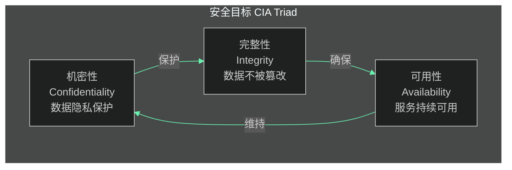

- **机密性（Confidentiality）**：确保数据只能被授权方访问
- **完整性（Integrity）**：确保数据在传输过程中不被篡改
- **可用性（Availability）**：确保合法用户能持续获得服务

### 1.2 应用层安全威胁全景图

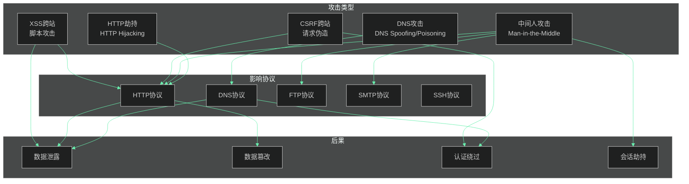

---

## 2. 常见应用层攻击类型详解

### 2.1 DNS欺骗与DNS投毒

#### 2.1.1 攻击原理

DNS欺骗（DNS Spoofing）和DNS投毒（DNS Poisoning）是针对域名解析系统的攻击，攻击者伪造DNS响应，将用户重定向到恶意服务器。

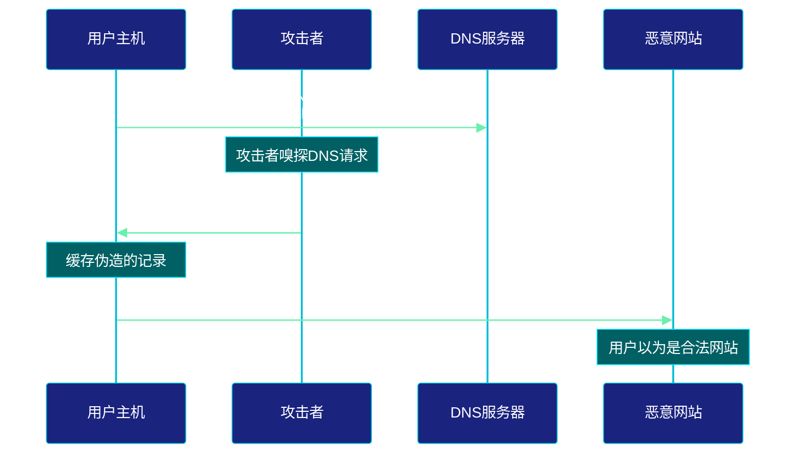

#### 2.1.2 DNS投毒攻击场景

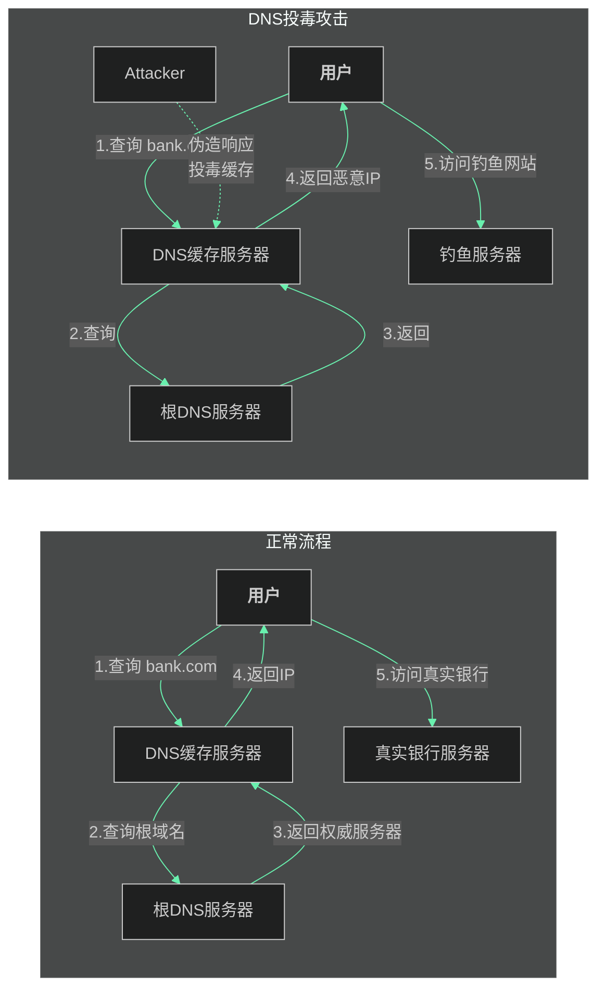

#### 2.1.3 防御措施

| 防御技术 | 描述 | 实施难度 |
|---------|------|---------|
| DNSSEC | DNS签名验证 | 中等 |
| DNS over HTTPS | 加密DNS查询 | 低 |
| DNS over TLS | 加密DNS查询 | 低 |
| 短TTL | 减少缓存时间 | 低 |
| 源端口随机化 | 防止预测 | 中等 |

### 2.2 HTTP劫持

#### 2.2.1 攻击原理

HTTP劫持是指在HTTP通信过程中，攻击者拦截并修改通信内容，常见于未加密的HTTP连接。

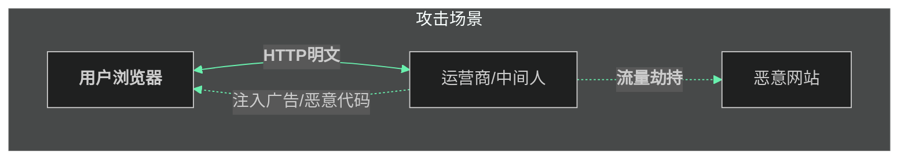

#### 2.2.2 HTTP劫持常见形式

1. **内容注入**：在网页中注入广告、追踪代码
2. **脚本注入**：植入恶意JavaScript代码
3. **流量劫持**：将用户重定向到其他网站
4. **Cookie劫持**：窃取会话Cookie

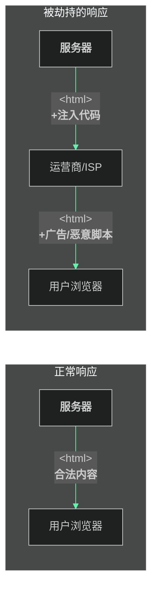

#### 2.2.3 防御措施

- **全站HTTPS**：强制使用HTTPS加密所有通信
- **HSTS头**：浏览器记住只使用HTTPS
- **CSP内容安全策略**：限制页面可加载的资源
- **Subresource Integrity (SRI)**：验证外部资源完整性

### 2.3 中间人攻击（MITM）

#### 2.3.1 攻击原理

中间人攻击是指攻击者秘密插入到通信双方之间，能够窃听、篡改通信内容。

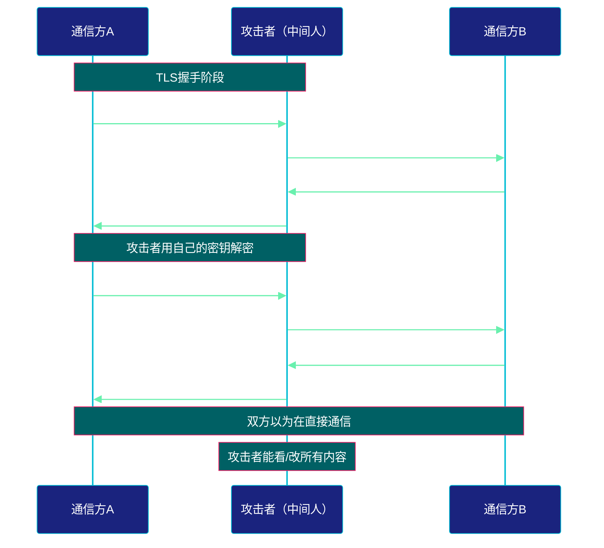

#### 2.3.2 MITM攻击类型分类

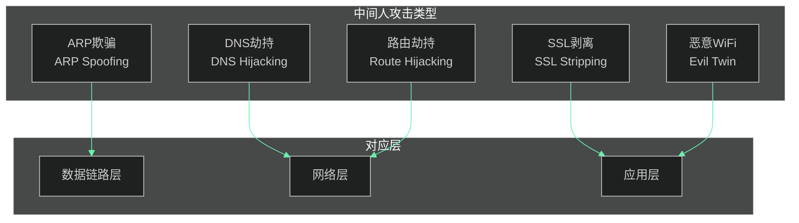

#### 2.3.3 SSL剥离攻击详解

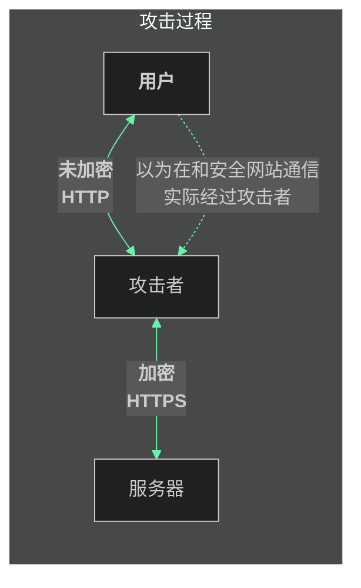

攻击步骤：
1. 用户访问 `http://bank.com`（而非`https://`）
2. 攻击者作为代理，用自己的证书与用户通信
3. 攻击者用真实证书与银行服务器通信
4. 所有通信都被攻击者解密查看和修改

### 2.4 CSRF跨站请求伪造

#### 2.4.1 攻击原理

CSRF（Cross-Site Request Forgery）利用用户已登录的身份，诱导用户浏览器向目标网站发起恶意请求。

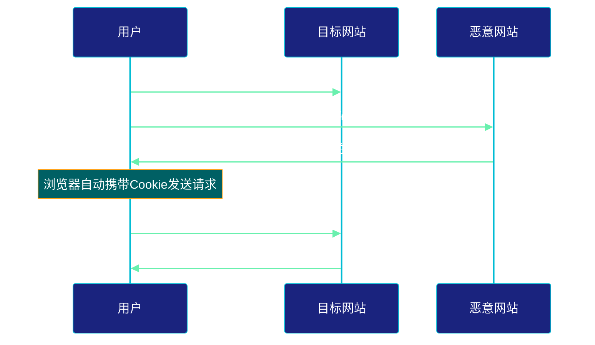

#### 2.4.2 CSRF攻击流程图

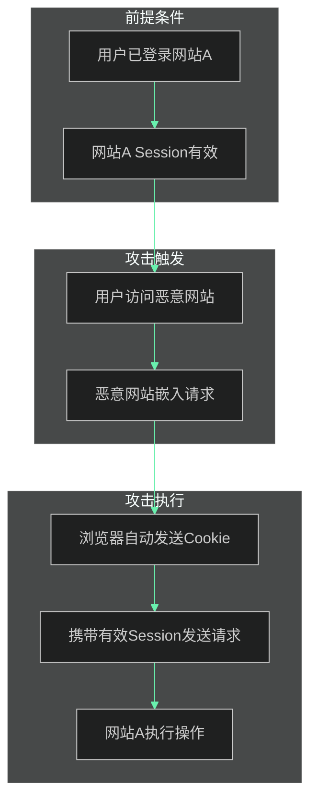

#### 2.4.3 防御措施

| 防御方法 | 原理 | 安全性 |
|---------|------|-------|
| CSRF Token | 随机令牌验证请求来源 | 高 |
| SameSite Cookie | 限制Cookie发送范围 | 中高 |
| Referer检查 | 验证请求来源 | 低 |
| 双重验证 | 重要操作需二次确认 | 高 |
| Origin头 | 验证请求来源 | 中 |

### 2.5 XSS跨站脚本攻击

#### 2.5.1 攻击原理

XSS（Cross-Site Scripting）允许攻击者在目标网站上注入恶意脚本代码，当其他用户访问时执行。

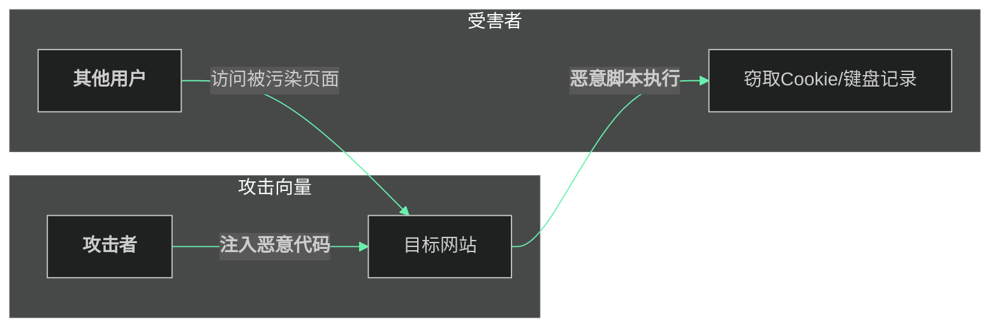

#### 2.5.2 XSS类型分类

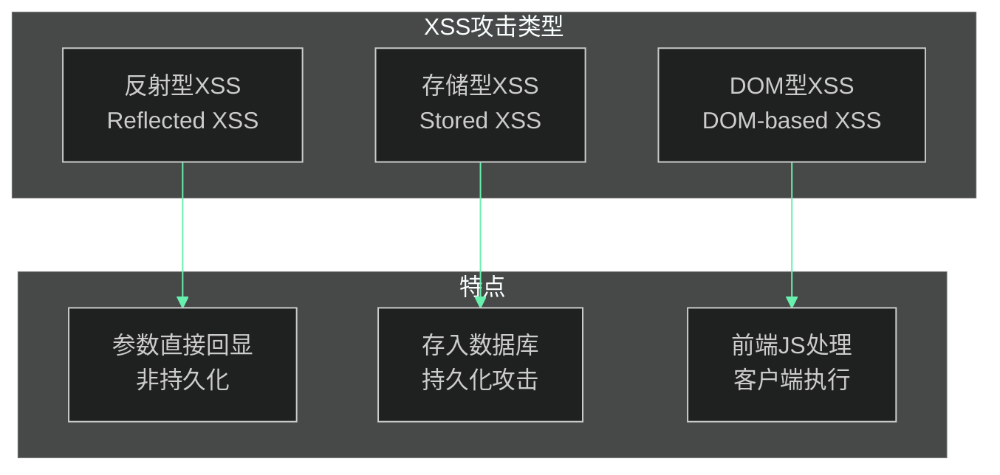

#### 2.5.3 反射型XSS示例

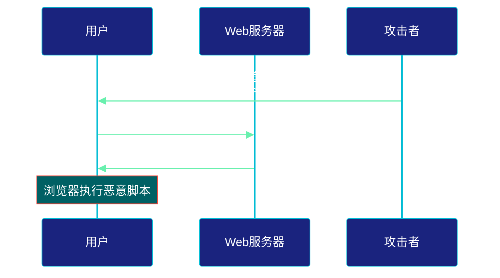

#### 2.5.4 防御措施

| 防御技术 | 说明 |
|---------|------|
| 输入过滤 | 过滤用户输入中的特殊字符 |
| 输出编码 | HTML实体编码输出内容 |
| Content Security Policy | 禁止执行内联脚本 |
| HTTPOnly Cookie | 禁止JavaScript访问Cookie |
| SameSite Cookie | 限制跨站请求携带Cookie |

---

## 3. 协议安全加固方案

### 3.1 HTTPS全面启用

#### 3.1.1 HTTPS工作原理

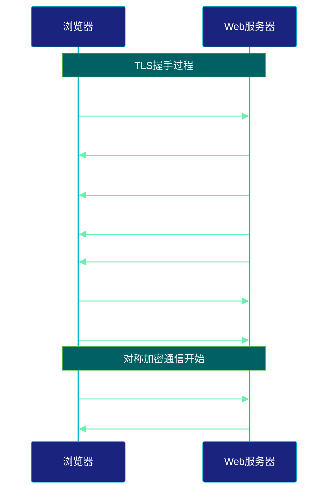

#### 3.1.2 HTTPS加固配置

**Nginx配置示例：**

```nginx
server {
    listen 443 ssl http2;
    server_name example.com;

    # 证书配置
    ssl_certificate /etc/ssl/certs/example.com.crt;
    ssl_certificate_key /etc/ssl/private/example.com.key;

    # 安全协议版本（禁用SSLv3和TLS1.0/1.1）
    ssl_protocols TLSv1.2 TLSv1.3;

    # 安全加密套件
    ssl_ciphers ECDHE-ECDSA-AES128-GCM-SHA256:
                 ECDHE-RSA-AES128-GCM-SHA256:
                 ECDHE-ECDSA-AES256-GCM-SHA384:
                 ECDHE-RSA-AES256-GCM-SHA384;
    ssl_prefer_server_ciphers on;

    # OCSP stapling
    ssl_stapling on;
    ssl_stapling_verify on;

    # HSTS头（强制HTTPS）
    add_header Strict-Transport-Security
        "max-age=31536000; includeSubDomains; preload" always;

    # 安全头
    add_header X-Frame-Options "SAMEORIGIN" always;
    add_header X-Content-Type-Options "nosniff" always;
    add_header X-XSS-Protection "1; mode=block" always;
    add_header Referrer-Policy "strict-origin-when-cross-origin" always;

    # CSP内容安全策略
    add_header Content-Security-Policy
        "default-src 'self'; script-src 'self' 'unsafe-inline';
         style-src 'self' 'unsafe-inline';" always;
}

# 强制HTTP重定向到HTTPS
server {
    listen 80;
    server_name example.com;
    return 301 https://$server_name$request_uri;
}
```

#### 3.1.3 HTTPS强制启用检查清单

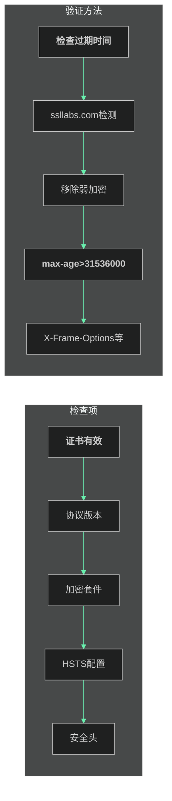

### 3.2 SSH密钥认证

#### 3.2.1 SSH密钥认证原理

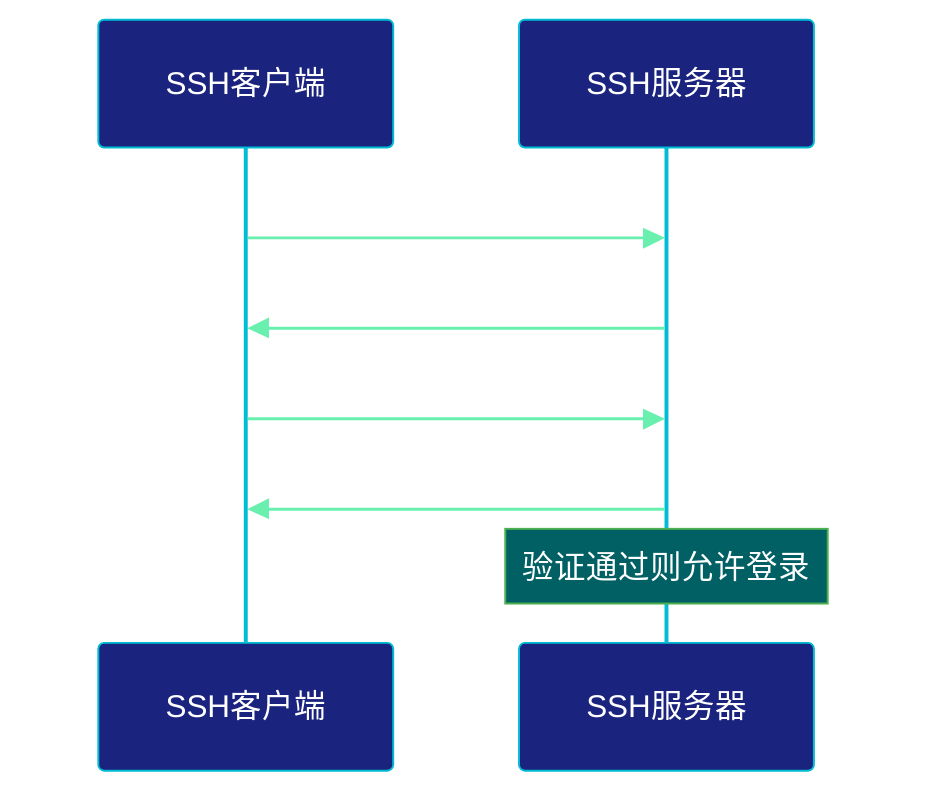

#### 3.2.2 SSH密钥生成与配置

**生成密钥对：**

```bash
# 生成ED25519密钥（推荐）
ssh-keygen -t ed25519 -C "描述注释"

# 或生成RSA密钥（传统方式）
ssh-keygen -t rsa -b 4096 -C "描述注释"
```

**部署公钥到服务器：**

```bash
# 方法1：使用ssh-copy-id
ssh-copy-id -i ~/.ssh/id_ed25519.pub user@server

# 方法2：手动部署
cat ~/.ssh/id_ed25519.pub >> ~/.ssh/authorized_keys
chmod 600 ~/.ssh/authorized_keys
```

#### 3.2.3 SSH安全加固配置

```bash
# /etc/ssh/sshd_config 安全配置

# 协议版本
Protocol 2

# 端口更改（非默认22）
Port 2222

# 禁用密码认证
PasswordAuthentication no
PermitRootLogin no
ChallengeResponseAuthentication no

# 密钥认证
PubkeyAuthentication yes
AuthorizedKeysFile .ssh/authorized_keys

# 限制用户登录
AllowUsers admin deploy
AllowGroups sshusers

# 超时配置
ClientAliveInterval 300
ClientAliveCountMax 2
LoginGraceTime 60

# 禁用危险功能
 PermitEmptyPasswords no
 X11Forwarding no
 AllowAgentForwarding no
 AllowTcpForwarding no

# 登录记录
LogLevel VERBOSE
```

```mermaid
%%{init: {'theme': 'dark', 'themeVariables': {
    'primaryColor': '#1A237E',
    'primaryTextColor': '#FFFFFF',
    'primaryBorderColor': '#00BCD4',
    'lineColor': '#69F0AE',
    'secondaryColor': '#311B92',
    'tertiaryColor': '#0D47A1'
}}}%%
flowchart TB
    subgraph "SSH安全加固层次"
        A["<span style='color:#00BCD4;font-weight:bold'>密钥认证</span>"] --> B["<span style='color:#03A9F4;font-weight:bold'>禁用密码</span>"]
        B --> C["<span style='color:#2196F3;font-weight:bold'>限制用户</span>"]
        C --> D["<span style='color:#5C6BC0;font-weight:bold'>更改端口</span>"]
        D --> E["<span style='color:#9C27B0;font-weight:bold'>超时控制</span>"]
    end

    subgraph "安全收益"
        A1["<span style='color:#69F0AE;font-weight:bold'>防止暴力破解</span>"]
        A1 --> B1["<span style='color:#4CAF50;font-weight:bold'>消除密码泄露</span>"]
        B1 --> C1["<span style='color:#8BC34A;font-weight:bold'>最小权限</span>"]
        C1 --> D1["<span style='color:#CDDC39;font-weight:bold'>减少暴露面</span>"]
        D1 --> E1["<span style='color:#FFC107;font-weight:bold'>防止会话劫持</span>"]
    end
```

### 3.3 FTP升级到SFTP

#### 3.3.1 FTP vs SFTP对比

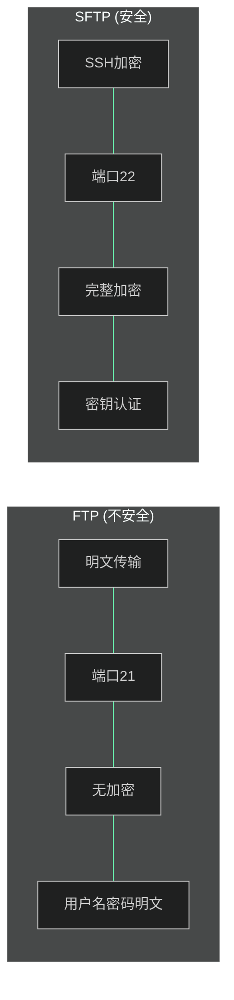

| 特性 | FTP | SFTP |
|-----|-----|------|
| 传输协议 | TCP | SSH |
| 加密 | 无 | 端到端加密 |
| 端口 | 21 | 22 |
| 认证 | 明文密码 | 密钥/密码 |
| 数据传输 | 分离通道 | 同一通道 |

#### 3.3.2 SFTP配置示例

**OpenSSH服务器配置：**

```bash
# /etc/ssh/sshd_config

# 启用SFTP子系统
Subsystem sftp internal-sftp

# 针对SFTP用户的特殊配置
Match Group sftpusers
    ChrootDirectory /home/%u
    ForceCommand internal-sftp
    AllowTcpForwarding no
    X11Forwarding no
```

**创建SFTP用户：**

```bash
# 创建组
groupadd sftpusers

# 创建用户（无shell登录）
useradd -g sftpusers -s /usr/sbin/nologin -d /home/sftpuser sftpuser

# 设置目录权限
chown root:sftpusers /home/sftpuser
chmod 755 /home/sftpuser

# 设置SSH密钥
mkdir -p /home/sftpuser/.ssh
chmod 700 /home/sftpuser/.ssh
```

#### 3.3.3 FTP到SFTP迁移检查清单

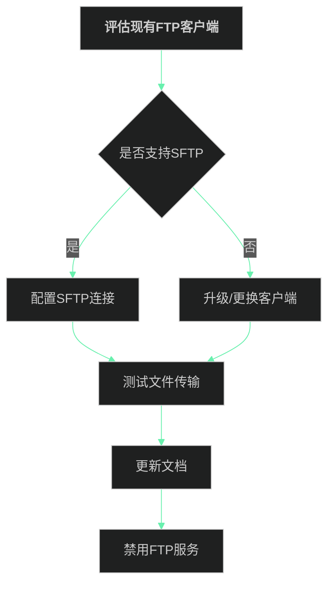

### 3.4 SMTP STARTTLS

#### 3.4.1 STARTTLS工作原理

STARTTLS将明文SMTP连接升级为加密连接。

```mermaid
%%{init: {'theme': 'dark', 'themeVariables': {
    'actorBkg': '#1A237E',
    'actorBorder': '#00BCD4',
    'actorTextColor': '#FFFFFF',
    'actorLineColor': '#00BCD4',
    'signalColor': '#69F0AE',
    'signalTextColor': '#FFFFFF',
    'labelBoxBkgColor': '#311B92',
    'labelBoxBorderColor': '#00E5FF',
    'labelTextColor': '#FFFFFF',
    'noteBkgColor': '#006064',
    'noteTextColor': '#FFFFFF',
    'noteBorderColor': '#4CAF50',
    'activationBkgColor': '#7C4DFF',
    'activationBorderColor': '#B388FF'
}}}%%
sequenceDiagram
    participant MUA as 邮件客户端
    participant MTA as 邮件服务器

    Note over MUA,MTA: 明文阶段
    MUA->>MTA: EHLO example.com
    MTA->>MUA: 250-STARTTLS
    MTA->>MUA: 250 SIZE
    MUA->>MTA: STARTTLS
    MTA->>MTA: 开始TLS握手
    Note over MUA,MTA: TLS加密阶段
    MUA->>MTA: EHLO example.com
    MTA->>MTA: 协商加密参数
    MUA->>MTA: 加密的邮件内容
    MTA->>MUA: 250 OK
```

#### 3.4.2 Postfix配置STARTTLS

```bash
# /etc/postfix/main.cf

# SMTP TLS配置
smtpd_tls_security_level = may
smtpd_tls_wrappermode = no
smtpd_tls_cert_file = /etc/ssl/certs/server.crt
smtpd_tls_key_file = /etc/ssl/private/server.key
smtpd_tls_protocols = !SSLv2, !SSLv3, !TLSv1, !TLSv1.1
smtpd_tls_ciphers = medium
smtpd_tls_exclude_ciphers = aNULL, eNULL, EXPORT
smtpd_tls_loglevel = 1

# 客户端TLS配置（连接其他服务器）
smtp_tls_security_level = may
smtp_tls_protocols = !SSLv2, !SSLv3, !TLSv1, !TLSv1.1
smtp_tls_ciphers = medium

# 证书验证
smtp_tls_CAfile = /etc/ssl/certs/ca-certificates.crt
smtp_tls_verify_cert_match = hostname

# 强制某些域使用TLS
smtp_tls_policy_maps = hash:/etc/postfix/tls_policy
```

```bash
# /etc/postfix/tls_policy
gmail.com secure match=gmail.com
yahoo.com encrypt
```

```bash
# 生成策略哈希
postmap /etc/postfix/tls_policy
postfix reload
```

#### 3.4.3 邮件加密配置检查表

```mermaid
%%{init: {'theme': 'dark', 'themeVariables': {
    'primaryColor': '#1A237E',
    'primaryTextColor': '#FFFFFF',
    'primaryBorderColor': '#00BCD4',
    'lineColor': '#69F0AE',
    'secondaryColor': '#311B92',
    'tertiaryColor': '#0D47A1'
}}}%%
flowchart LR
    subgraph "配置项"
        A["<span style='color:#4CAF50;font-weight:bold'>证书配置</span>"] --> B["<span style='color:#00BCD4;font-weight:bold'>协议版本</span>"]
        B --> C["<span style='color:#2196F3;font-weight:bold'>加密套件</span>"]
        C --> D["<span style='color:#9C27B0;font-weight:bold'>证书验证</span>"]
    end

    subgraph "验证命令"
        A1["<span style='color:#69F0AE;font-weight:bold'>openssl测试</span>"]
        A1 --> B1["<span style='color:#00E5FF;font-weight:bold'>日志检查</span>"]
        B1 --> C1["<span style='color:#18FFFF;font-weight:bold'>连接测试</span>"]
        C1 --> D1["<span style='color:#64FFDA;font-weight:bold'>加密强度测试</span>"]
    end
```

---

## 4. 安全最佳实践

### 4.1 密码管理

```mermaid
%%{init: {'theme': 'dark', 'themeVariables': {
    'primaryColor': '#1A237E',
    'primaryTextColor': '#FFFFFF',
    'primaryBorderColor': '#00BCD4',
    'lineColor': '#69F0AE',
    'secondaryColor': '#311B92',
    'tertiaryColor': '#0D47A1'
}}}%%
flowchart TB
    subgraph "密码安全"
        A["<span style='color:#F44336;font-weight:bold'>密码强度</span>"] -->|至少12位| B["<span style='color:#FF5722;font-weight:bold'>混合字符</span>"]
        B -->|大小写+数字+特殊| C["<span style='color:#FF9800;font-weight:bold'>密码短语</span>"]
        C -->|随机单词组合| D["<span style='color:#FFC107;font-weight:bold'>密码管理器</span>"]
        D -->|唯一密码| E["<span style='color:#4CAF50;font-weight:bold'>多因素认证</span>"]
    end
```

**密码最佳实践：**

| 要求 | 说明 |
|-----|------|
| 最小长度 | 至少12个字符 |
| 复杂性 | 大小写字母、数字、特殊字符 |
| 唯一性 | 每个账户使用不同密码 |
| 定期更换 | 高风险账户每90天更换 |
| 存储方式 | 使用密码管理器 |
| 传输方式 | 始终加密传输 |

### 4.2 会话安全

```mermaid
%%{init: {'theme': 'dark', 'themeVariables': {
    'primaryColor': '#1A237E',
    'primaryTextColor': '#FFFFFF',
    'primaryBorderColor': '#00BCD4',
    'lineColor': '#69F0AE',
    'secondaryColor': '#311B92',
    'tertiaryColor': '#0D47A1'
}}}%%
flowchart LR
    subgraph "会话攻击"
        A["<span style='color:#F44336;font-weight:bold'>Session Fixation</span>"] --> B["<span style='color:#FF5722;font-weight:bold'>Session Hijacking</span>"]
        B --> C["<span style='color:#E91E63;font-weight:bold'>Session Prediction</span>"]
    end

    subgraph "防御措施"
        D["<span style='color:#69F0AE;font-weight:bold'>新会话ID</span>"] --> E["<span style='color:#00BCD4;font-weight:bold'>安全Cookie属性</span>"]
        E --> F["<span style='color:#03A9F4;font-weight:bold'>会话超时</span>"]
        F --> G["<span style='color:#9C27B0;font-weight:bold'>频繁刷新ID</span>"]
    end
```

**会话安全配置：**

```php
<?php
// 安全会话配置示例
session_start([
    'cookie_httponly' => true,    // 禁止JavaScript访问
    'cookie_secure' => true,      // 仅HTTPS传输
    'cookie_samesite' => 'Strict', // CSRF防护
    'cookie_lifetime' => 0,        // 浏览器关闭时失效
    'use_strict_mode' => true,     // 严格模式
    'use_trans_sid' => false       // 禁用透明SID
]);

// 活动期间定期刷新会话ID
if (isset($_SESSION['last_regeneration'])) {
    if (time() - $_SESSION['last_regeneration'] > 300) {
        session_regenerate_id(true);
        $_SESSION['last_regeneration'] = time();
    }
}
```

### 4.3 输入验证

```mermaid
%%{init: {'theme': 'dark', 'themeVariables': {
    'primaryColor': '#1A237E',
    'primaryTextColor': '#FFFFFF',
    'primaryBorderColor': '#00BCD4',
    'lineColor': '#69F0AE',
    'secondaryColor': '#311B92',
    'tertiaryColor': '#0D47A1'
}}}%%
flowchart TB
    subgraph "输入验证层次"
        A["<span style='color:#00BCD4;font-weight:bold'>客户端验证</span>"] --> B["<span style='color:#03A9F4;font-weight:bold'>服务器端验证</span>"]
        B --> C["<span style='color:#2196F3;font-weight:bold'>数据库层验证</span>"]
    end

    subgraph "验证类型"
        D["<span style='color:#69F0AE;font-weight:bold'>类型检查</span>"] --> E["<span style='color:#4CAF50;font-weight:bold'>长度检查</span>"]
        E --> F["<span style='color:#8BC34A;font-weight:bold'>格式检查</span>"]
        F --> G["<span style='color:#CDDC39;font-weight:bold'>业务规则</span>"]
    end

    subgraph "安全问题"
        H["<span style='color:#F44336;font-weight:bold'>SQL注入</span>"] --> I["<span style='color:#FF5722;font-weight:bold'>XSS</span>"]
        I --> J["<span style='color:#FF9800;font-weight:bold'>命令注入</span>"]
    end
```

**输入验证原则：**

```python
# 示例：Flask输入验证
from flask import Flask, request
import re

app = Flask(__name__)

# 白名单验证
@app.route('/search')
def search():
    # 仅允许字母和数字
    query = request.args.get('q', '')
    if not re.match(r'^[a-zA-Z0-9]+$', query):
        return 'Invalid input', 400
    
    # 查询数据库（使用参数化查询）
    results = db.execute(
        'SELECT * FROM items WHERE name LIKE ?',
        (f'%{query}%',)
    )
    return results

# 邮箱格式验证
def validate_email(email):
    pattern = r'^[a-zA-Z0-9._%+-]+@[a-zA-Z0-9.-]+\.[a-zA-Z]{2,}$'
    return re.match(pattern, email) is not None

# 数字范围验证
def validate_port(port):
    try:
        port = int(port)
        return 1 <= port <= 65535
    except (ValueError, TypeError):
        return False
```

### 4.4 输出编码

```mermaid
%%{init: {'theme': 'dark', 'themeVariables': {
    'primaryColor': '#1A237E',
    'primaryTextColor': '#FFFFFF',
    'primaryBorderColor': '#00BCD4',
    'lineColor': '#69F0AE',
    'secondaryColor': '#311B92',
    'tertiaryColor': '#0D47A1'
}}}%%
flowchart LR
    subgraph "上下文"
        A["<span style='color:#E91E63;font-weight:bold'>HTML内容</span>"] --> B["<span style='color:#9C27B0;font-weight:bold'>HTML属性</span>"]
        B --> C["<span style='color:#673AB7;font-weight:bold'>JavaScript</span>"]
        C --> D["<span style='color:#3F51B5;font-weight:bold'>URL</span>"]
        D --> E["<span style='color:#5C6BC0;font-weight:bold'>CSS</span>"]
    end

    subgraph "编码方式"
        A1["<span style='color:#FF9800;font-weight:bold'>&lt; &gt; &amp;</span>"] --> B1["<span style='color:#FFC107;font-weight:bold'>双引号包裹</span>"]
        B1 --> C1["<span style='color:#FFEB3B;font-weight:bold'>JSON转义</span>"]
        C1 --> D1["<span style='color:#CDDC39;font-weight:bold'>URL编码</span>"]
        D1 --> E1["<span style='color:#8BC34A;font-weight:bold'>CSS转义</span>"]
    end
```

**输出编码示例：**

```html
<!-- HTML内容编码 -->
<p>{{ username | escape }}</p>
<!-- 或 -->
<p>{{ username | html }}</p>

<!-- JavaScript上下文 -->
<script>
    var username = "{{ username | tojson | safe }}";
</script>

<!-- URL上下文 -->
<a href="/user?name={{ username | urlencode }}">链接</a>

<!-- CSS上下文 -->
<div style="color: {{ color | css_escape }}">文字</div>
```

---

## 5. 防火墙配置

### 5.1 防火墙类型

```mermaid
%%{init: {'theme': 'dark', 'themeVariables': {
    'primaryColor': '#1A237E',
    'primaryTextColor': '#FFFFFF',
    'primaryBorderColor': '#00BCD4',
    'lineColor': '#69F0AE',
    'secondaryColor': '#311B92',
    'tertiaryColor': '#0D47A1'
}}}%%
flowchart TB
    subgraph "防火墙类型"
        A["<span style='color:#00BCD4;font-weight:bold'>包过滤防火墙</span>"]
        B["<span style='color:#03A9F4;font-weight:bold'>状态检测防火墙</span>"]
        C["<span style='color:#2196F3;font-weight:bold'>应用层防火墙</span>"]
        D["<span style='color:#9C27B0;font-weight:bold'>下一代防火墙</span>"]
    end

    subgraph "工作层次"
        A1["<span style='color:#69F0AE;font-weight:bold'>网络层</span>"]
        B1["<span style='color:#4CAF50;font-weight:bold'>传输层</span>"]
        C1["<span style='color:#8BC34A;font-weight:bold'>应用层</span>"]
        D1["<span style='color:#CDDC39;font-weight:bold'>多层检测</span>"]
    end

    A --> A1
    B --> B1
    C --> C1
    D --> D1
```

### 5.2 iptables基础配置

```bash
# 查看当前规则
iptables -L -n -v

# 默认策略：拒绝所有入站
iptables -P INPUT DROP
iptables -P FORWARD DROP
iptables -P OUTPUT ACCEPT

# 允许已建立连接的返回流量
iptables -A INPUT -m state --state ESTABLISHED,RELATED -j ACCEPT

# 允许本地回环
iptables -A INPUT -i lo -j ACCEPT

# 允许SSH（限制来源）
iptables -A INPUT -p tcp --dport 22 -s 10.0.0.0/8 -j ACCEPT
iptables -A INPUT -p tcp --dport 22 -m state --state NEW -m recent --set
iptables -A INPUT -p tcp --dport 22 -m state --state NEW -m recent --update --seconds 60 --hitcount 4 -j DROP

# 允许HTTP/HTTPS
iptables -A INPUT -p tcp --dport 80 -j ACCEPT
iptables -A INPUT -p tcp --dport 443 -j ACCEPT

# 允许DNS
iptables -A INPUT -p udp --dport 53 -j ACCEPT

# 允许SMTP
iptables -A INPUT -p tcp --dport 25 -j ACCEPT
iptables -A INPUT -p tcp --dport 587 -j ACCEPT

# 记录被拒绝的包
iptables -A INPUT -m limit --limit 5/min -j LOG --log-prefix "iptables-dropped: "
```

### 5.3 UFW简化配置（Ubuntu）

```bash
# 安装
sudo apt install ufw

# 默认策略
sudo ufw default deny incoming
sudo ufw default allow outgoing

# 允许SSH
sudo ufw allow ssh
sudo ufw limit ssh  # 限流

# 允许常用服务
sudo ufw allow http
sudo ufw allow https

# 允许特定端口范围
sudo ufw allow 8000:9000/tcp

# 允许特定IP
sudo ufw allow from 10.0.0.0/8 to any port 22

# 启用防火墙
sudo ufw enable

# 查看状态
sudo ufw status verbose
```

### 5.4 应用层防火墙（WAF）

```mermaid
%%{init: {'theme': 'dark', 'themeVariables': {
    'primaryColor': '#1A237E',
    'primaryTextColor': '#FFFFFF',
    'primaryBorderColor': '#00BCD4',
    'lineColor': '#69F0AE',
    'secondaryColor': '#311B92',
    'tertiaryColor': '#0D47A1'
}}}%%
flowchart TB
    subgraph "WAF功能"
        A["<span style='color:#F44336;font-weight:bold'>SQL注入防护</span>"]
        B["<span style='color:#FF5722;font-weight:bold'>XSS防护</span>"]
        C["<span style='color:#E91E63;font-weight:bold'>CSRF防护</span>"]
        D["<span style='color:#9C27B0;font-weight:bold'>速度限制</span>"]
    end

    subgraph "部署模式"
        E["<span style='color:#00BCD4;font-weight:bold'>透明模式</span>"]
        F["<span style='color:#4CAF50;font-weight:bold'>反向代理</span>"]
        G["<span style='color:#FFC107;font-weight:bold'>旁路模式</span>"]
    end
```

**ModSecurity配置示例：**

```apache
# /etc/modsecurity/modsecurity.conf

# 启用规则引擎
SecRuleEngine On

# 检测级别
SecAuditEngine RelevantOnly
SecDebugLog /var/log/modsecurity/debug.log
SecDebugLogLevel 0

# 基本规则
SecRule ARG_script "^(.*)$" "deny,log,status:403"
SecRule ARGS "<script>" "deny,log,status:403"
SecRule ARGS "javascript:" "deny,log,status:403"

# SQL注入防护
SecRule REQUEST_URI|REQUEST_BODY "@rx (?i)(union.*select|select.*from|insert.*into|delete.*from|drop.*table|update.*set)"
    "deny,log,status:403,id:1001"

# XSS防护
SecRule REQUEST_URI|ARGS "@rx (?i)<script>|</script>|javascript:|onerror=|onload="
    "deny,log,status:403,id:1002"
```

---

## 6. 证书管理

### 6.1 证书类型与选择

```mermaid
%%{init: {'theme': 'dark', 'themeVariables': {
    'primaryColor': '#1A237E',
    'primaryTextColor': '#FFFFFF',
    'primaryBorderColor': '#00BCD4',
    'lineColor': '#69F0AE',
    'secondaryColor': '#311B92',
    'tertiaryColor': '#0D47A1'
}}}%%
flowchart TB
    subgraph "证书类型"
        A["<span style='color:#FFC107;font-weight:bold'>DV域名验证</span><br/>Domain Validation"]
        B["<span style='color:#FF9800;font-weight:bold'>OV组织验证</span><br/>Organization Validation"]
        C["<span style='color:#4CAF50;font-weight:bold'>EV扩展验证</span><br/>Extended Validation"]
    end

    subgraph "验证方式"
        A1["<span style='color:#00BCD4;font-weight:bold'>DNS/邮箱验证</span>"]
        B1["<span style='color:#03A9F4;font-weight:bold'>组织信息验证</span>"]
        C1["<span style='color:#2196F3;font-weight:bold'>严格身份验证</span>"]
    end

    subgraph "浏览器显示"
        A2["<span style='color:#9E9E9E;font-weight:bold'>锁图标</span>"]
        B2["<span style='color:#90A4AE;font-weight:bold'>锁图标+组织名</span>"]
        C2["<span style='color:#69F0AE;font-weight:bold'>绿色地址栏</span>"]
    end

    A --> A1
    B --> B1
    C --> C1
    A1 --> A2
    B1 --> B2
    C1 --> C2
```

| 类型 | 验证级别 | 适用场景 | 颁发时间 |
|-----|---------|---------|---------|
| DV | 域名所有权 | 个人网站、博客 | 分钟级 |
| OV | 域名+组织信息 | 企业网站 | 1-3天 |
| EV | 严格身份验证 | 金融、电商 | 3-7天 |

### 6.2 Let's Encrypt免费证书

```bash
# 安装Certbot
sudo apt install certbot python3-certbot-nginx

# 获取并自动配置证书
sudo certbot --nginx -d example.com -d www.example.com

# 仅获取证书（手动配置）
sudo certbot certonly --nginx -d example.com

# 查看证书
sudo certbot certificates

# 续期（通常自动）
sudo certbot renew --dry-run

# 手动续期
sudo certbot renew
```

### 6.3 证书存储与备份

```mermaid
%%{init: {'theme': 'dark', 'themeVariables': {
    'primaryColor': '#1A237E',
    'primaryTextColor': '#FFFFFF',
    'primaryBorderColor': '#00BCD4',
    'lineColor': '#69F0AE',
    'secondaryColor': '#311B92',
    'tertiaryColor': '#0D47A1'
}}}%%
flowchart LR
    subgraph "证书文件"
        A["<span style='color:#4CAF50;font-weight:bold'>公钥证书</span><br/>.crt/.pem"]
        B["<span style='color:#F44336;font-weight:bold'>私钥文件</span><br/>.key"]
        C["<span style='color:#2196F3;font-weight:bold'>证书链</span><br/>.chain"]
    end

    subgraph "存储位置"
        A1["<span style='color:#69F0AE;font-weight:bold'>/etc/ssl/certs</span>"]
        B1["<span style='color:#00BCD4;font-weight:bold'>/etc/ssl/private</span>"]
        C1["<span style='color:#FF9800;font-weight:bold'>安全备份</span>"]
    end

    A --> A1
    B --> B1
    C --> A1
    A1 --> C1
    B1 --> C1
```

**证书备份脚本：**

```bash
#!/bin/bash
# cert-backup.sh

CERT_DIR="/etc/letsencrypt/live/example.com"
BACKUP_DIR="/backup/certs"
DATE=$(date +%Y%m%d)

mkdir -p "$BACKUP_DIR"

# 备份证书和私钥
tar -czf "$BACKUP_DIR/certs-$DATE.tar.gz" "$CERT_DIR"

# 加密备份
openssl enc -aes256 -in "$BACKUP_DIR/certs-$DATE.tar.gz" \
    -out "$BACKUP_DIR/certs-$DATE.tar.gz.enc" -pass pass:your-password

# 删除未加密备份
rm "$BACKUP_DIR/certs-$DATE.tar.gz"

# 上传到安全存储
rclone copy "$BACKUP_DIR/certs-$DATE.tar.gz.enc" \
    remote:cert-backups/

echo "Certificate backup completed: $DATE"
```

### 6.4 证书监控与告警

```yaml
# prometheus证书监控配置
groups:
  - name: certificate
    rules:
      - record: ssl_cert_days_until_expiry
        expr: |
          avg(ssl_cert_not_after) - time()
        labels:
          service: example.com
```

```bash
#!/bin/bash
# check-cert.sh - 检查证书过期

HOST="example.com"
PORT="443"
DAYS_WARNING=30

# 获取证书信息
CERT_END=$(echo | openssl s_client -servername $HOST -connect $HOST:$PORT 2>/dev/null \
    | openssl x509 -noout -enddate 2>/dev/null | cut -d= -f2)

if [ -z "$CERT_END" ]; then
    echo "无法获取证书信息"
    exit 1
fi

# 计算剩余天数
END_DATE=$(date -d "$CERT_END" +%s)
NOW=$(date +%s)
DAYS_LEFT=$(( ($END_DATE - $NOW) / 86400 ))

echo "证书剩余天数: $DAYS_LEFT"

if [ $DAYS_LEFT -lt $DAYS_WARNING ]; then
    echo "警告：证书将在 $DAYS_LEFT 天后过期！"
    # 发送告警（邮件/钉钉/飞书等）
fi
```

### 6.5 证书撤销检查

```bash
# 检查证书是否被撤销
openssl verify -CRL_check -CAfile ca-bundle.crt certificate.crt

# 检查OCSP状态
openssl s_client -connect example.com:443 -status \
    -servername example.com 2>/dev/null | grep -A 17 "OCSP Response"

# 手动查询OCSP
CERT="/etc/ssl/certs/example.crt"
ISSUER="/etc/ssl/certs/ca.crt"

openssl ocsp -issuer $ISSUER -cert $CERT \
    -url http://ocsp.example.com -resp_text
```

---

## 7. 安全配置检查清单

### 7.1 Web服务安全检查表

```mermaid
%%{init: {'theme': 'dark', 'themeVariables': {
    'primaryColor': '#1A237E',
    'primaryTextColor': '#FFFFFF',
    'primaryBorderColor': '#00BCD4',
    'lineColor': '#69F0AE',
    'secondaryColor': '#311B92',
    'tertiaryColor': '#0D47A1'
}}}%%
flowchart TB
    subgraph "Web安全检查项"
        direction TB
        A["<span style='color:#F44336;font-weight:bold'>HTTPS配置</span>"] --> B["<span style='color:#FF5722;font-weight:bold'>安全头</span>"]
        B --> C["<span style='color:#E91E63;font-weight:bold'>认证机制</span>"]
        C --> D["<span style='color:#9C27B0;font-weight:bold'>会话管理</span>"]
        D --> E["<span style='color:#673AB7;font-weight:bold'>输入处理</span>"]
        E --> F["<span style='color:#3F51B5;font-weight:bold'>输出编码</span>"]
        F --> G["<span style='color:#5C6BC0;font-weight:bold'>日志监控</span>"]
    end

    subgraph "状态"
        A1["<span style='color:#69F0AE;font-weight:bold'>已配置</span>"]
        B1["<span style='color:#69F0AE;font-weight:bold'>已配置</span>"]
        C1["<span style='color:#69F0AE;font-weight:bold'>已配置</span>"]
        D1["<span style='color:#69F0AE;font-weight:bold'>已配置</span>"]
        E1["<span style='color:#69F0AE;font-weight:bold'>已配置</span>"]
        F1["<span style='color:#69F0AE;font-weight:bold'>已配置</span>"]
        G1["<span style='color:#69F0AE;font-weight:bold'>已配置</span>"]
    end

    A --> A1
    B --> B1
    C --> C1
    D --> D1
    E --> E1
    F --> F1
    G --> G1
```

| 检查项 | 要求 | 验证方法 |
|-------|------|---------|
| HTTPS | 强制启用，TLS 1.2+ | SSL Labs测试 |
| HSTS | max-age≥31536000 | 响应头检查 |
| 安全头 | X-Frame-Options等 | 响应头检查 |
| 密码 | 加盐哈希 | 代码审查 |
| 会话 | HttpOnly/Secure/SameSite | Cookie检查 |
| 输入 | 白名单验证 | 渗透测试 |
| 输出 | 上下文编码 | 代码审查 |
| 日志 | 完整审计日志 | 日志检查 |

### 7.2 SSH安全检查表

| 检查项 | 推荐值 | 检查命令 |
|-------|-------|---------|
| 协议版本 | SSHv2 | `ssh -Q protocol` |
| 最小密钥长度 | 2048位(RSA) 或 256位(Ed25519) | `ssh-keygen -l` |
| 密码认证 | 禁用 | `/etc/ssh/sshd_config` |
| Root登录 | 禁用 | `PermitRootLogin no` |
| 空密码 | 禁用 | `PermitEmptyPasswords no` |
| 空闲超时 | ≤300秒 | `ClientAliveInterval` |
| 端口 | 非22 | `Port 2222` |

### 7.3 定期安全审计

```bash
#!/bin/bash
# security-audit.sh - 安全审计脚本

echo "=== 安全审计报告 $(date) ==="

echo -e "\n[1] 开放端口检查"
netstat -tuln | grep LISTEN

echo -e "\n[2] 失败登录尝试"
lastb | head -20

echo -e "\n[3] 当前登录用户"
who

echo -e "\n[4] sudo使用记录"
sudo lastlog | head -10

echo -e "\n[5] 系统账户"
cat /etc/passwd | grep -E ":/bin/(bash|sh)$"

echo -e "\n[6] SSH密钥"
ls -la ~/.ssh/

echo -e "\n[7] 最近修改的文件"
find /etc -type f -mtime -7 2>/dev/null

echo -e "\n[8] SSL证书状态"
for cert in /etc/ssl/certs/*.crt; do
    echo -n "$cert: "
    openssl x509 -enddate -noout -in "$cert" 2>/dev/null
done

echo -e "\n=== 审计完成 ==="
```

---

## 8. 总结

### 8.1 核心要点回顾

```mermaid
%%{init: {'theme': 'dark', 'themeVariables': {
    'primaryColor': '#1A237E',
    'primaryTextColor': '#FFFFFF',
    'primaryBorderColor': '#00BCD4',
    'lineColor': '#69F0AE',
    'secondaryColor': '#311B92',
    'tertiaryColor': '#0D47A1'
}}}%%
mindmap
  root("<span style='color:#00E5FF;font-weight:bold'>协议安全</span>")
    DNS安全
      DNSSEC部署
      DNS over HTTPS
      启用加密DNS
    HTTP安全
      全站HTTPS
      HSTS配置
      安全头设置
    SSH安全
      密钥认证
      禁用密码
      端口修改
    邮件安全
      STARTTLS
      证书验证
    证书管理
      定期续期
      安全存储
      监控告警
    防御体系
      防火墙
      WAF
      入侵检测
```

### 8.2 安全加固路线图

```mermaid
%%{init: {'theme': 'dark', 'themeVariables': {
    'primaryColor': '#1A237E',
    'primaryTextColor': '#FFFFFF',
    'primaryBorderColor': '#00BCD4',
    'lineColor': '#69F0AE',
    'secondaryColor': '#311B92',
    'tertiaryColor': '#0D47A1'
}}}%%
flowchart TB
    subgraph "第一阶段：基础加固"
        A1["<span style='color:#00BCD4;font-weight:bold'>评估现状</span>"]
        A2["<span style='color:#03A9F4;font-weight:bold'>部署HTTPS</span>"]
        A3["<span style='color:#2196F3;font-weight:bold'>SSH密钥认证</span>"]
    end

    subgraph "第二阶段：深度防御"
        B1["<span style='color:#4CAF50;font-weight:bold'>防火墙配置</span>"]
        B2["<span style='color:#8BC34A;font-weight:bold'>安全头部署</span>"]
        B3["<span style='color:#CDDC39;font-weight:bold'>输入输出验证</span>"]
    end

    subgraph "第三阶段：持续监控"
        C1["<span style='color:#FFC107;font-weight:bold'>日志集中</span>"]
        C2["<span style='color:#FF9800;font-weight:bold'>证书监控</span>"]
        C3["<span style='color:#FF5722;font-weight:bold'>渗透测试</span>"]
    end

    subgraph "第四阶段：优化完善"
        D1["<span style='color:#E91E63;font-weight:bold'>性能优化</span>"]
        D2["<span style='color:#9C27B0;font-weight:bold'>自动化运维</span>"]
        D3["<span style='color:#673AB7;font-weight:bold'>合规检查</span>"]
    end

    A1 --> A2 --> A3
    A3 --> B1 --> B2 --> B3
    B3 --> C1 --> C2 --> C3
    C3 --> D1 --> D2 --> D3
```

---

## 附录：常用安全工具

| 工具 | 用途 | 链接 |
|-----|------|------|
| SSL Labs | SSL/TLS检测 | ssllabs.com/ssltest |
| Mozilla SSL Config | 配置生成器 | ssl-config.mozilla.org |
| Security Headers | 安全头检测 | securityheaders.com |
| OWASP ZAP | 渗透测试 | owasp.org/www-project-zap |
| Certbot | 证书管理 | certbot.eff.org |
| Nmap | 端口扫描 | nmap.org |
| Wireshark | 协议分析 | wireshark.org |

---
