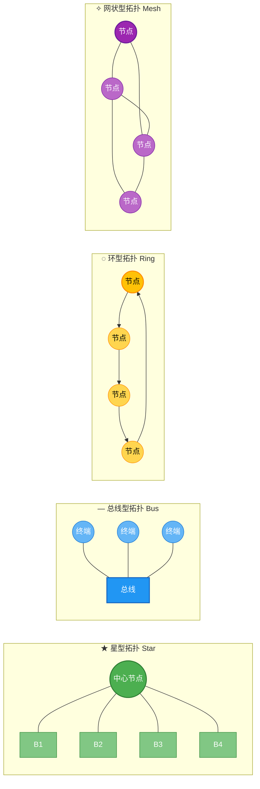
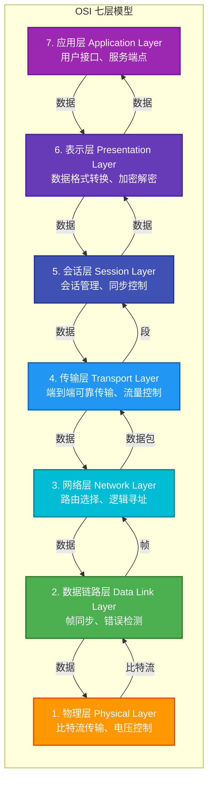
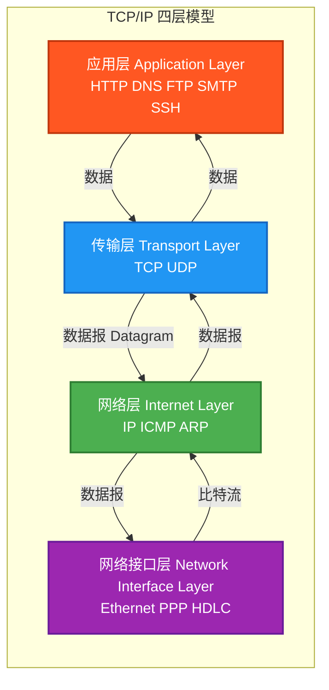
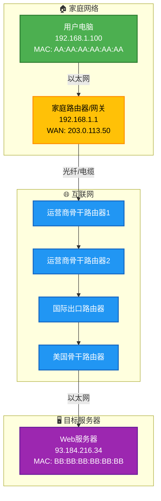
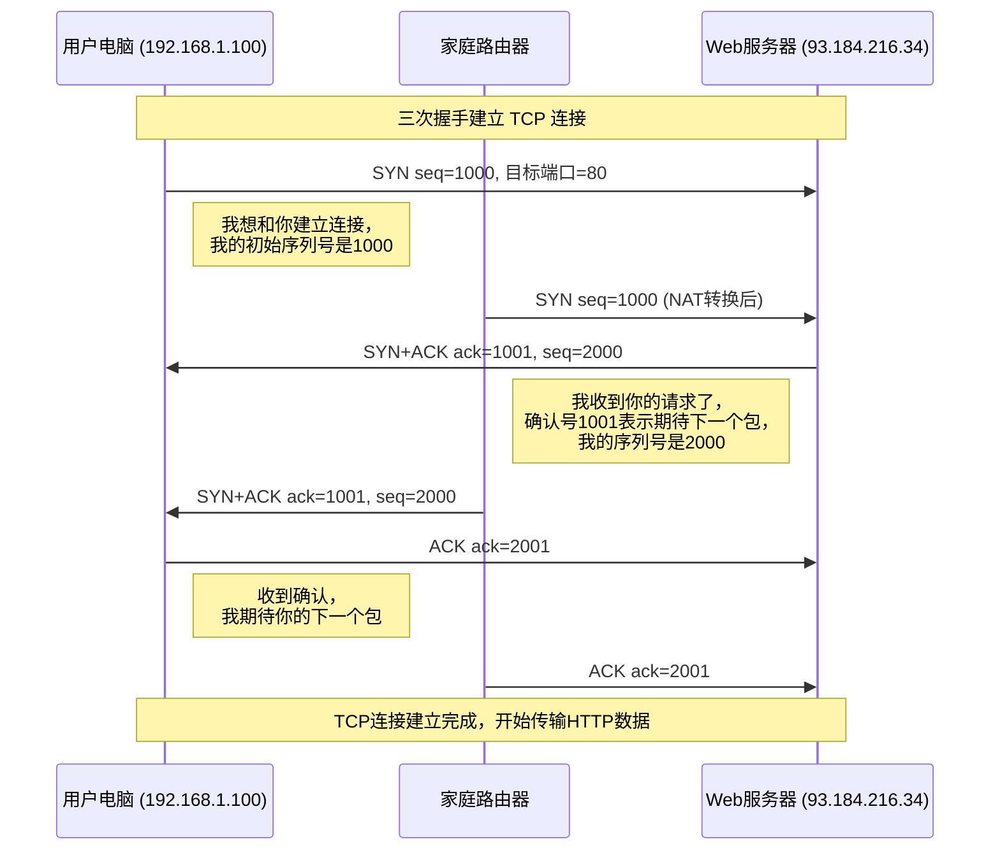
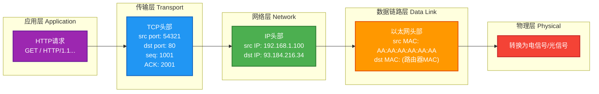
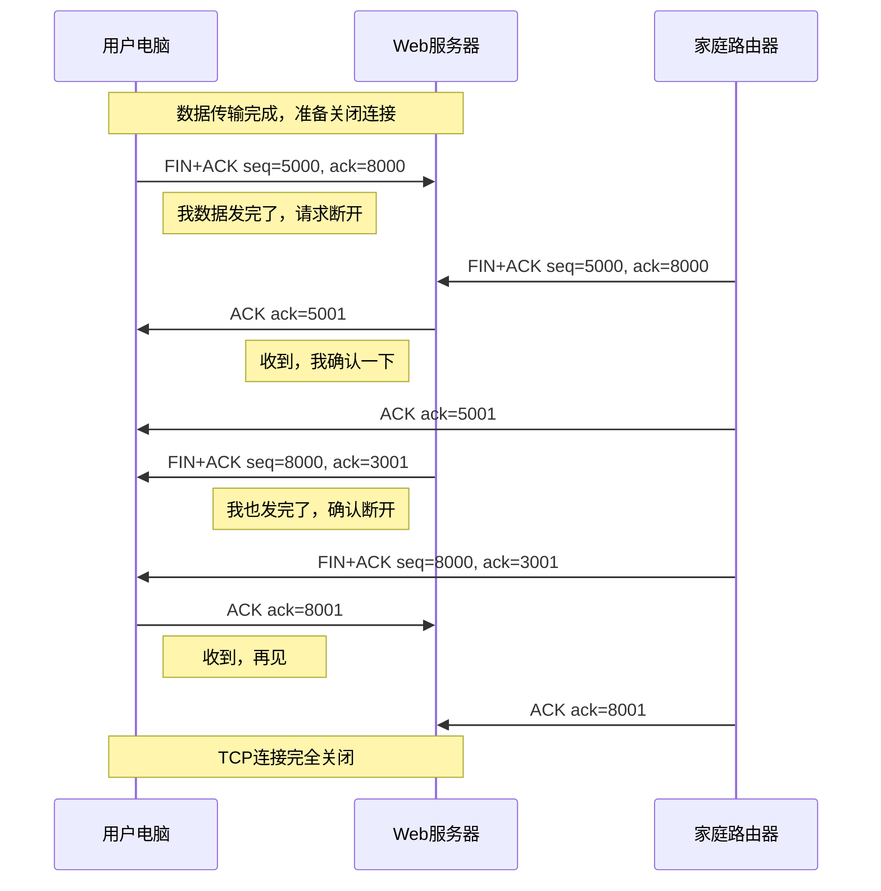

# 第一章：计算机网络概述

## 1.1 计算机网络的定义与发展

### 1.1.1 计算机网络的定义

计算机网络（Computer Network）是指通过通信设备和传输介质将地理位置分散的具有独立功能的多台计算机或设备连接起来，按照网络协议进行数据通信和资源共享的有机整体。

**理解这一一定义的关键要素：**

- **地理分散性**：网络中的设备可以分布在不同的房间、建筑物、城市甚至国家。
- **独立功能**：每个节点都具备独立的计算能力，能够独立运行和处理数据。
- **通信设备**：包括路由器（Router）、交换机（Switch）、集线器（Hub）等网络设备。
- **传输介质**：可以是双绞线、光纤、同轴电缆等有线介质，也可以是无线电波、微波等无线介质。
- **网络协议**：设备之间通信必须遵循统一的规则和标准，如 TCP/IP、HTTP 等。

**网络的核心功能可以归纳为两点：**

1. **数据通信**：实现不同计算机之间数据的可靠传输，这是网络最基本的功能。
2. **资源共享**：包括硬件资源共享（如打印机、存储设备）、软件资源共享（如应用程序、数据库）以及数据资源共享（如文件、文档）。

### 1.1.2 从 ARPANET 到互联网的发展历程

**第一阶段：雏形初现（1960s）**

1969 年，美国国防部高级研究计划局（ARPA，Advanced Research Projects Agency）建立了 ARPANET。ARPANET 是互联网的雏形，最初只有 4 个节点，连接了加州大学洛杉矶分校（UCLA）、加州大学圣巴巴拉分校（UCSB）、斯坦福研究院（SRI）和犹他大学（University of Utah）四所高校的研究计算机。

ARPANET 的建立源于冷战时期的军事需求：美国国防部希望建立一种能够在核战争情况下仍然保持通信能力的网络系统。这一背景催生了网络设计的核心原则——**分组交换（Packet Switching）**技术。

**分组交换 vs 电路交换：**

传统的电路交换（Circuit Switching）电话网络在通话双方之间建立一条专用物理通道，直到通话结束。这种方式在战争或灾害面前极其脆弱——一旦某个节点或线路被破坏，整个通信就会中断。

分组交换则将数据分割成多个独立的分组（Packet），每个分组可以独立选择路由传输。就像邮寄信件一样，每封信都有自己的地址，可以走不同的邮路到达目的地。这种方式大大提高了网络的健壮性和可靠性。

**第二阶段：协议标准化（1970s-1980s）**

1974 年，Vint Cerf 和 Bob Kahn 发表了著名的 TCP/IP 协议设计论文。1983 年，ARPANET 正式采用 TCP/IP 协议作为通信标准，这一年被公认为互联网的诞生年。

1989 年，Tim Berners-Lee 在欧洲核子研究组织（CERN）发明了万维网（World Wide Web），使互联网从仅为科研人员服务的技术转变为人人可用的信息基础设施。

**第三阶段：爆发式增长（1990s 至今）**

1995 年至 2000 年间，互联网用户数量呈指数级增长。Google（1998）、百度（2000）等搜索引擎相继诞生。2007 年 iPhone 的发布标志着移动互联网时代的到来。2010 年后，云计算、大数据、物联网（IoT）等新技术进一步推动了互联网的革新。

如今，互联网已经覆盖全球，承载着数十亿用户的日常通信、商务交易、信息获取和社交娱乐需求。

### 1.1.3 我国互联网发展

中国的互联网发展历程同样波澜壮阔：

- **1987 年**：中国科学院高能物理研究所钱天白教授发出中国第一封电子邮件，标志着中国正式接入互联网。
- **1994 年**：中国公用计算机互联网（CHINANET）建设完成，中国正式成为第 71 个接入互联网的国家。
- **1999 年**：腾讯 QQ 上线，即时通讯开始普及。
- **2003 年**：淘宝成立，电子商务时代开启。
- **2009 年**：3G 商用，移动互联网起步。
- **2015 年**：提出「互联网＋」行动计划，推动互联网与传统产业深度融合。
- **2020 年**：5G 商用部署全面展开，引领全球新一代移动通信技术。

---

## 1.2 网络的分类

### 1.2.1 按覆盖范围分类

网络的覆盖范围是划分网络类型最常用的标准，不同覆盖范围的网络具有不同的特点和应用场景。

| 网络类型 | 覆盖范围 | 典型传输速率 | 典型应用场景 |
|---------|---------|------------|------------|
| PAN（个人区域网） | 通常在 10 米以内 | 1-100 Mbps | 蓝牙耳机、智能手表、健康手环 |
| LAN（局域网） | 几十米到几公里 | 100 Mbps - 10 Gbps | 企业办公室、校园网络、家庭Wi-Fi |
| MAN（城域网） | 几公里到几十公里 | 100 Mbps - 10 Gbps | 城市有线电视网、校园互联 |
| WAN（广域网） | 几十公里以上 | 1 Mbps - 100 Gbps | 互联网、企业专网、跨国通信 |

**PAN（Personal Area Network，个人区域网）：**

PAN 是覆盖范围最小的网络，通常只覆盖一个人活动的主要区域。其核心用途是连接个人随身携带的设备，如智能手机与蓝牙耳机之间、智能手表与手机之间的连接。典型技术包括蓝牙（Bluetooth）、近场通信（NFC）和 ZigBee。PAN 的设计理念是低功耗、低成本、短距离通信。

**LAN（Local Area Network，局域网）：**

局域网是最常见的网络类型，通常覆盖一栋建筑物或一个院落。局域网的核心特点是高带宽和低延迟，这使得它非常适合支持大量用户同时访问共享资源。企业办公网络、学校校园网络、家庭 Wi-Fi 网络都属于局域网的范畴。局域网通常归某一组织所有和管理，私有 IP 地址（如 192.168.x.x）常用于局域网内部。

**MAN（Metropolitan Area Network，城域网）：**

城域网的覆盖范围介于局域网和广域网之间，通常覆盖一个城市或大型社区的有线电视网络、数据通信网络等。城域网连接多个局域网，实现城市范围内的数据交换和资源共享。典型的城域网技术包括分布式队列双总线（DQDB）和多兆位数据交换服务（SMDS）。

**WAN（Wide Area Network，广域网）：**

广域网覆盖范围广，能够跨越城市、国家甚至全球。互联网是最大的广域网。广域网通常由电信运营商或大型企业建设维护，租用电信运营商的传输线路是常见的接入方式。与局域网相比，广域网的传输延迟较高，因为数据需要经过更多的中间节点和更长的物理距离。

### 1.2.2 按拓扑结构分类

网络拓扑（Network Topology）描述了网络中节点（如计算机、服务器、网络设备）之间的物理或逻辑连接关系。不同的拓扑结构在可靠性、成本和性能方面各有优劣。



**星型拓扑（Star Topology）：**

星型拓扑以一个中心节点为核心，所有其他节点都与中心节点直接相连。中心节点通常是集线器（Hub）或交换机（Switch）。这种结构的优点是易于管理和扩展，单个节点的故障不会影响其他节点；但缺点是对中心节点依赖性强，一旦中心节点故障，整个网络将陷入瘫痪。以太网（Ethernet）中大量采用星型拓扑结构，现代企业网络几乎全部采用这种设计。

**总线型拓扑（Bus Topology）：**

总线型拓扑使用一根共享的传输介质（称为「总线」或「主干」），所有节点并联在这根总线上。信号从发送节点传播到总线上，所有节点都能收到。这种结构布线简单、成本低廉，但存在单点故障风险——总线某处断裂，整个网络将无法工作。总线型拓扑在早期的 10Base-2 和 10Base-5 以太网中非常流行，如今已被星型拓扑取代。

**环型拓扑（Ring Topology）：**

环型拓扑中每个节点只与相邻的两个节点直接相连，形成一个闭合的环路。数据沿一个方向在环中传输，每个节点检查目标地址后决定是否接收或转发。令牌环（Token Ring）网络是典型的环型拓扑应用。环型拓扑的优点是结构简单、公平性好；但任何节点或链路的故障都会导致整个网络中断。现代网络中单纯的环型拓扑已较少见，但光纤分布式数据接口（FDDI）和某些城域网仍在使用类似环型的双环结构。

**网状型拓扑（Mesh Topology）：**

网状型拓扑中每个节点与多个其他节点直接相连，形成错综复杂的连接结构。这种高度冗余的设计提供了极高的可靠性——即使多条路径失效，数据仍可通过其他路径到达目的地。互联网的核心骨干网络采用网状型拓扑，确保即使某个路由器故障，数据仍能绕道传输。网状拓扑的缺点是布线复杂、成本高，通常只在对可靠性要求极高的核心网络中采用。全网状（Full Mesh）连接中 n 个节点需要 n(n-1)/2 条链路，成本随节点数指数增长，因此实际应用中多采用部分网状（Partial Mesh）结构。

### 1.2.3 按传输方式分类

**广播式网络（Broadcast Network）：**

在广播式网络中，所有节点共享同一通信信道。一个节点发送的信号可以被所有其他节点接收。发送时，信号附带着目标地址（单播、组播或广播地址），只有目标节点才会处理该信号，其他节点则忽略。这就像公共场所的广播系统，播音员的声音每个人都能听到，但只有需要信息的人才会注意。

广播式网络通常用于局域网环境，如以太网、Wi-Fi。优点是实现简单、效率高；缺点是随着节点增多，竞争加剧，性能下降。广播域（Broadcast Domain）的概念指能接收广播信号的所有节点范围，过大的广播域需要通过网络设备（如路由器）进行分割。

**点对点式网络（Point-to-Point Network）：**

点对点式网络由多条独立的信道组成，每条信道只连接两个节点。数据从源到目的可能需要经过多个中间节点的转发，形成一条明确的路径。这就像城市间的电话通话，通话双方建立专用连接进行通信。

点对点式网络通常用于广域网环境，如PPP（Point-to-Point Protocol）、帧中继（Frame Relay）、租用线路等。路由器之间的连接、交换机与服务器之间的连接都属于点对点通信。优点是信道专用、不易冲突；缺点是需要复杂的路由算法来确定最佳路径。

---

## 1.3 网络体系结构

### 1.3.1 OSI 七层模型

开放系统互连参考模型（Open Systems Interconnection Reference Model，OSI 模型）是国际标准化组织（ISO）于 1984 年提出的网络通信标准框架。它将网络通信分为七个层次，每一层都有特定的功能，并且只与上下相邻层直接交互。OSI 模型虽然是一个理论框架，但它为理解网络通信提供了清晰的概念模型，是学习网络原理的重要工具。



**第一层：物理层（Physical Layer）**

物理层是 OSI 模型的最底层，负责在物理介质上传输原始比特流。它定义了网络的物理连接特性，包括：

- **电气特性**：电压等级、信号波形、比特率
- **机械特性**：接口形状、引脚数量、线缆规格
- **功能特性**：信号的建立、维持和释放
- **规程特性**：数据传输的时序和步骤

物理层关注的是「0」和「1」如何变成物理信号（电信号、光信号、无线电波）在介质上传输。常见的物理层设备包括集线器（Hub）、中继器（Repeater）、网络接口卡（NIC）的物理部分。传输介质包括双绞线（如 Cat5e、Cat6）、光纤（单模、多模）、同轴电缆、微波等。

物理层不关心数据的含义，只负责比特的正确传输。信号在传输过程中会衰减和失真，中继器用于放大和整形信号，集线器则将一个端口的信号复制到所有其他端口。

**第二层：数据链路层（Data Link Layer）**

数据链路层在物理层之上提供服务，它将原始的比特流组织成「帧」（Frame）的结构，并实现可靠的数据传输。数据链路层的核心功能包括：

- **帧封装**：将网络层传来的数据包封装成帧，添加帧起始标志、源 MAC 地址、目标 MAC 地址、校验序列等。
- **物理地址寻址**：使用 MAC 地址（Media Access Control Address）标识网络中的每个设备。MAC 地址是 48 位的硬件地址，由设备厂商烧录到网卡中。
- **差错检测与控制**：通过循环冗余校验（CRC）等算法检测传输错误，对于错误的帧进行重传。
- **流量控制**：避免发送方过快地发送数据导致接收方缓冲区溢出。
- **介质访问控制**：解决多个设备共享信道时的竞争问题，如 CSMA/CD（载波监听多路访问/冲突检测）用于以太网。

数据链路层的典型设备是交换机（Switch）。交换机根据 MAC 地址表进行帧转发，每个端口独享带宽，不同端口可以同时进行全双工通信，显著提升了网络效率。

**第三层：网络层（Network Layer）**

网络层负责在不同网络之间传输数据包，实现逻辑寻址（IP 地址）和路由选择（Routing）。当数据包需要跨越多个网络才能到达目的地时，网络层负责选择最优路径。

核心功能包括：

- **逻辑寻址**：为每个网络设备分配唯一的 IP 地址（IPv4 为 32 位，IPv6 为 128 位）。
- **路由选择**：根据路由协议（如 OSPF、BGP、RIP）和路由表，决定数据包的最佳传输路径。
- **分组转发**：将数据从源网络传输到目标网络，可能经过多个中间路由器。
- **拥塞控制**：检测网络拥塞状态，采取措施缓解拥塞。
- **网际互联**：连接不同的网络类型，处理它们之间的差异。

路由器的核心功能在网络层工作。路由器根据目标 IP 地址查找路由表，决定将数据包发送到哪个下一跳地址。路由器的每个接口连接不同的网络，拥有各自的 IP 地址和 MAC 地址。

**第四层：传输层（Transport Layer）**

传输层在网络层提供的点对点传输服务基础上，提供端到端的可靠数据传输服务。传输层解决了「进程到进程」的通信问题——网络中的主机可能运行多个应用程序，传输层需要将数据正确地交付给特定的应用程序（使用端口号区分）。

核心功能包括：

- **端到端连接**：在通信双方之间建立逻辑连接（TCP）或提供无连接服务（UDP）。
- **可靠性保证**（TCP）：序列号、确认应答（ACK）、重传机制确保数据可靠到达。
- **流量控制**：通过滑动窗口机制，避免发送方发送过快导致接收方处理不过来。
- **拥塞控制**：当网络拥塞时，减少发送方的发送速率（TCP 的慢启动、拥塞避免等算法）。
- **端口寻址**：使用 16 位端口号标识不同的应用程序进程，0-1023 为知名端口（如 HTTP 80、HTTPS 443）。

传输层的两个主要协议是 TCP（传输控制协议）和 UDP（用户数据报协议）。TCP 提供可靠、面向连接的服务，适用于对数据完整性要求高的应用（如网页浏览、邮件传输）。UDP 提供无连接、不可靠但效率高的服务，适用于实时性要求高的应用（如视频直播、在线游戏）。

**第五层：会话层（Session Layer）**

会话层负责建立、管理和终止通信双方之间的会话（Session）。会话是通信双方进行完整对话的过程，会话层确保对话的有序性和同步性。

核心功能包括：

- **会话建立与管理**：在通信双方之间建立会话连接，维护会话状态。
- **同步控制**：在数据传输过程中设置同步点（Checkpoint），当传输中断后，可以从最后一个同步点继续传输，而不必重新开始。
- **对话控制**：确定对话的模式——单工（Simplex，数据只能单向传输）、半双工（Half-Duplex，数据可以双向交替传输）、全双工（Full-Duplex，数据可以同时双向传输）。

虽然 OSI 模型定义了会话层，但实际中的 TCP/IP 协议族并没有独立的会话层。许多会话层功能被应用层的协议（如 HTTP、FTP）实现或由传输层的 TCP 协议部分承担。

**第六层：表示层（Presentation Layer）**

表示层负责处理数据的表示形式，确保一个系统发送的数据能被另一个系统正确识别。不同计算机可能使用不同的数据表示方式（如不同的字符编码、浮点数格式），表示层负责进行格式转换。

核心功能包括：

- **数据格式转换**：将应用层传来的数据转换为标准的网络格式，或将接收到的数据转换为主机本地格式。
- **字符编码转换**：如 ASCII、Unicode、GBK 之间的转换。
- **数据压缩**：减少传输的数据量，降低带宽消耗。
- **数据加密与解密**：对敏感数据进行加密处理，保障数据安全。SSL/TLS 协议的部分功能在此层工作。

常见的表示层标准包括 JPEG（图像）、GIF（图像）、MPEG（视频）、SSL/TLS（加密）等。虽然 TCP/IP 协议族中也没有独立的表示层，但这些功能在应用层协议中得到了实现。

**第七层：应用层（Application Layer）**

应用层是 OSI 模型中直接为用户提供服务的最高层，它定义了应用程序如何访问网络服务。应用层协议种类繁多，涵盖了各种网络应用场景。

核心协议包括：

- **Web 相关**：HTTP/HTTPS（超文本传输协议，用于网页浏览）
- **文件传输**：FTP（文件传输协议）、SFTP（安全文件传输协议）
- **电子邮件**：SMTP（简单邮件传输协议）、POP3（邮局协议第 3 版）、IMAP（互联网消息访问协议）
- **域名系统**：DNS（域名系统，将域名解析为 IP 地址）
- **远程登录**：SSH（安全外壳协议）、Telnet（已逐渐被 SSH 取代）
- **网络管理**：SNMP（简单网络管理协议）

应用层是用户与网络之间的接口，用户通过应用程序与网络交互，数据由应用程序产生后，逐层向下传递，最终通过网络传输到目标系统。

### 1.3.2 TCP/IP 四层模型

TCP/IP 模型是互联网事实上的标准模型，它将网络功能分为四层，比 OSI 模型更简洁实用。TCP/IP 模型并非由 ISO 制定，而是源于 ARPANET 的研究和实践。

| TCP/IP 四层 | 对应 OSI 七层 | 主要协议 | 核心设备 |
|------------|--------------|---------|---------|
| 应用层 | 5、6、7 层 | HTTP、HTTPS、FTP、SMTP、DNS、SSH | 网关（Application Gateway） |
| 传输层 | 4 层 | TCP、UDP | — |
| 网络层（互联网层） | 3 层 | IP、ICMP、ARP、RARP | 路由器（Router） |
| 网络接口层 | 1、2 层 | Ethernet、PPP、HDLC | 交换机（Switch）、网卡 |



**TCP/IP 四层模型各层职责：**

- **应用层**：直接为用户提供网络服务，如网页浏览（HTTP）、文件传输（FTP）、邮件发送（SMTP）等。应用层协议最接近用户，是用户感受最直接的层次。

- **传输层**：提供主机到主机的通信服务，负责进程间通信。TCP 提供可靠的面向连接服务，包括确认、重传、排序、流控、拥塞控制；UDP 提供不可靠的无连接服务，适用于实时性要求高的场景。

- **网络层**：负责将数据从源主机传输到目标主机，实现跨网络的路由选择。主要协议 IP（Internet Protocol）定义了 IP 地址和路由的基本机制。

- **网络接口层**：也称链路层或网络访问层，负责将 IP 数据报封装成适合在物理网络上传输的帧，并进行实际的数据传输。

### 1.3.3 两种模型的对比

OSI 七层模型和 TCP/IP 四层模型既有对应关系，也有显著差异：

| 对比维度 | OSI 七层模型 | TCP/IP 四层模型 |
|---------|------------|----------------|
| 制定者 | 国际标准化组织（ISO） | IETF（互联网工程任务组） |
| 制定时间 | 1984 年 | 1970 年代末 |
| 设计思想 | 先有理论框架，后有实现 | 先有实现，后有理论总结 |
| 层数 | 7 层 | 4 层 |
| 网络层 | 统一支持 | 支持多种网络层协议（IPX、AppleTalk） |
| 传输层 | 仅支持 TCP、SPX | 主要使用 TCP、UDP |
| 会话层、表示层 | 独立分层 | 功能合并到应用层 |
| 实用性 | 教学和理论分析 | 工程实践事实标准 |

**为什么 TCP/IP 更实用？**

TCP/IP 模型是在 ARPANET 实际运行中发展和完善的，它的设计更贴近实际实现。虽然 OSI 模型概念清晰、层次分明，但由于其复杂性和对市场的误判，最终没有被广泛采纳。TCP/IP 凭借其简洁性和实用性成为互联网的标准。

### 1.3.4 数据封装与解封装过程

数据在网络中传输时，需要经过发送方的层层封装，接收方的层层解封装。这个过程就像邮寄包裹：你要寄送的物品（应用层数据）先被放入箱中（传输层封装），再贴上地址标签（网络层封装），最后交给快递公司运输（数据链路层封装、物理层传输）。

```mermaid
%%{init: {'theme': 'dark', 'themeVariables': {
  'primaryColor': '#4CAF50',
  'primaryTextColor': '#FFFFFF',
  'primaryBorderColor': '#2E7D32',
  'lineColor': '#90CAF9',
  'secondaryColor': '#2196F3',
  'tertiaryColor': '#1E1E1E'
}}%%
flowchart TB
    subgraph 发送方封装过程["发送方封装过程"]
        direction LR
        A1["应用层<br/>数据 Data"] --> B1["传输层<br/>Data + TCP Header = Segment"]
        B1 --> C1["网络层<br/>Segment + IP Header = Packet"]
        C1 --> D1["数据链路层<br/>Packet + Frame Header/Footer = Frame"]
        D1 --> E1["物理层<br/>Frame 转换为 Bit 流"]
    end

    subgraph 接收方解封装过程["接收方解封装过程"]
        direction LR
        F1["物理层<br/>Bit 流"] --> G1["数据链路层<br/>提取 Frame 进行校验"]
        G1 --> H1["网络层<br/>提取 Packet 交付给 IP"]
        H1 --> I1["传输层<br/>提取 Segment 交付给 TCP"]
        I1 --> J1["应用层<br/>提取 Data 交付给应用"]
    end

    style A1 fill:#9C27B0,stroke:#6A1B9A,stroke-width:2px,color:#FFFFFF
    style B1 fill:#673AB7,stroke:#4527A0,stroke-width:2px,color:#FFFFFF
    style C1 fill:#3F51B5,stroke:#283593,stroke-width:2px,color:#FFFFFF
    style D1 fill:#2196F3,stroke:#1565C0,stroke-width:2px,color:#FFFFFF
    style E1 fill:#00BCD4,stroke:#00838F,stroke-width:2px,color:#FFFFFF
    style F1 fill:#FF9800,stroke:#E65100,stroke-width:2px,color:#FFFFFF
    style G1 fill:#FF5722,stroke:#BF360C,stroke-width:2px,color:#FFFFFF
    style H1 fill:#F44336,stroke:#C62828,stroke-width:2px,color:#FFFFFF
    style I1 fill:#E91E63,stroke:#AD1457,stroke-width:2px,color:#FFFFFF
    style J1 fill:#9C27B0,stroke:#6A1B9A,stroke-width:2px,color:#FFFFFF
```



**封装过程详解：**

以浏览网页为例，当你在浏览器地址栏输入网址并按下回车时：

1. **应用层**：浏览器生成 HTTP 请求报文，内容是你要访问的网页地址。

2. **传输层**：TCP 协议为报文添加 TCP 头部，包括源端口（随机分配如 54321）、目标端口（80 for HTTP）、序列号、标志位等信息。此时报文称为「段」（Segment）。

3. **网络层**：IP 协议为段添加 IP 头部，包括源 IP 地址（如 192.168.1.100）、目标 IP 地址（如 142.250.80.46）、协议号（6 表示 TCP）等。此时数据称为「数据包」（Packet）。

4. **数据链路层**：以太网协议为数据包添加帧头和帧尾，包括源 MAC 地址、目标 MAC 地址、帧类型、FCS 校验码等。此时数据称为「帧」（Frame）。

5. **物理层**：帧被转换为电信号或光信号，通过网线或光纤传输出去。

**传输过程中的变化：**

数据包在传输过程中，源 MAC 地址和目标 MAC 地址会不断变化。当你发送数据到互联网上的服务器时：

- 源 IP 始终是发送方的公网 IP（在 NAT 环境下是路由器的公网 IP）
- 目标 IP 始终是服务器的 IP
- 源 MAC 是当前发送网卡的 MAC
- 目标 MAC 是本地网关（路由器）的 MAC

每经过一个路由器，源 MAC 和目标 MAC 都会更新为当前网段的地址，但 IP 地址（源 IP 和目标 IP）保持不变（除非使用 NAT）。

**解封装过程：**

接收方的处理顺序与发送方相反：

1. **物理层**：网卡将接收到的比特流还原为帧。
2. **数据链路层**：检查帧的 MAC 地址是否匹配、FCS 校验是否正确，去掉帧头帧尾。
3. **网络层**：检查 IP 包头，根据目标 IP 判断是否转发或交付给上层。
4. **传输层**：根据 IP 头中的协议号（TCP 或 UDP），将数据交付给相应的协议（如 TCP），检查序列号、确认号，确认数据完整性。
5. **应用层**：HTTP 协议解析请求内容，生成响应数据。

---

## 1.4 网络协议与标准化

### 1.4.1 协议的概念与三要素

网络协议（Network Protocol）是网络中两台或多台设备（实体）为了实现通信而预先约定的规则和标准集合。没有协议，两台计算机即使物理上连接了，也无法相互理解对方发送的数据。

**协议的三要素：**

**语法（Syntax）**：也称为结构或格式，定义了数据报文的组织结构和字段顺序。例如，IP 数据包头部的长度是多少字节、哪个字节表示源 IP、哪个字节表示目标 IP。语法就像语言的文法，规定了单词如何排列成句子。

**语义（Semantics）**：定义了各个字段的含义以及不同类型报文的处理方式。例如，TCP 报文中某个标志位设为「1」表示这是一个 SYN 连接请求报文，接收方收到后应该进入连接等待状态。语义就像语言中每个词的意思以及不同句子的含义。

**时序（Timing）**：也称为同步或顺序，定义了事件发生的顺序和时机。例如，TCP 三次握手必须按照特定的顺序进行：先发送 SYN，再收到 SYN+ACK，最后发送 ACK。时序就像语言中的语调、重音和说话节奏，影响信息的表达效果。

**一个生活类比：**

写信的协议可能包括：
- 语法：信件必须包含收件人地址、发件人地址、信封格式
- 语义：「收件人地址」字段填写的是收信人的居住地址
- 时序：必须先写收件人地址，再写发件人地址，最后封口寄出

### 1.4.2 标准化组织

网络标准化是确保不同厂商设备能够互操作的基础。以下是主要的国际标准化组织：

**ISO（International Organization for Standardization，国际标准化组织）**

ISO 是独立的非政府组织，成立于 1947 年，总部位于瑞士日内瓦。ISO 负责制定国际标准，在计算机网络领域最著名的贡献是 OSI 参考模型（七层模型）。ISO 标准采用「ISO＋数字」的形式，如 ISO 9001（质量管理体系）、ISO/IEC 11801（综合布线标准）。

**ITU（International Telecommunication Union，国际电信联盟）**

ITU 是联合国下属的专门机构，负责电信领域的国际标准化。ITU 的前身是 1865 年成立的国际电报联盟。ITU 制定的著名标准包括：H.264/H.265（视频编码）、G.711/G.722（音频编码）、X.25（广域网协议）。ITU 下设三个部门：标准化部门（ITU-T）、无线电通信部门（ITU-R）、发展部门（ITU-D）。

**IETF（Internet Engineering Task Force，互联网工程任务组）**

IETF 是互联网最重要的技术标准组织，负责制定 TCP/IP 协议族的相关标准。IETF 采用「请求评论」（RFC，Request for Comments）文档形式发布标准，任何人都可以提交提案，经过公开讨论和修订后，可能被接受为正式标准。著名的 RFC 文档包括：RFC 791（IP 协议）、RFC 793（TCP 协议）、RFC 2616（HTTP 1.1）。IETF 的口号是「粗犷的共识和运行中的代码」（Rough consensus and running code），强调实用性和可行性。

**IEEE（Institute of Electrical and Electronics Engineers，电气与电子工程师协会）**

IEEE 是世界上最大的技术专业组织，在网络领域最著名的贡献是 IEEE 802 系列标准。IEEE 802 标准涵盖了局域网和城域网的各个方面：
- IEEE 802.3：以太网（Ethernet）
- IEEE 802.11：无线局域网（WLAN/Wi-Fi）
- IEEE 802.15.1：蓝牙（Bluetooth）
- IEEE 802.15.4：ZigBee
- IEEE 802.16：宽带无线接入（WiMAX）

### 1.4.3 主流协议族介绍

**TCP/IP 协议族**

TCP/IP 是互联网的核心协议族，分为四层架构：

- **应用层协议**：HTTP（网页浏览）、HTTPS（安全网页）、FTP（文件传输）、SMTP/POP3/IMAP（电子邮件）、DNS（域名解析）、SSH（安全远程登录）、SNMP（网络管理）
- **传输层协议**：TCP（可靠连接）、UDP（快速无连接）、DCCP（ Datagram Congestion Control Protocol）、SCTP（流控制传输协议）
- **网络层协议**：IP（IPv4、IPv6）、ICMP（互联网控制报文协议）、IGMP（互联网组管理协议）、ARP（地址解析协议）、RARP（逆向地址解析协议）
- **网络接口层协议**：Ethernet（以太网）、PPP（点对点协议）、HDLC（高级数据链路控制）

**以太网协议族（IEEE 802.3）**

以太网是目前局域网最广泛使用的技术，经历了从 10Mbps 到 100Gbps 甚至更高速率的发展：
- 10BASE-T（10 Mbps，双绞线）
- 100BASE-TX（Fast Ethernet，100 Mbps）
- 1000BASE-T（ Gigabit Ethernet，1 Gbps）
- 10GBASE-T（10 Gigabit Ethernet，10 Gbps）
- 40GBASE-T / 100GBASE-T（40/100 Gbps）

**Wi-Fi 协议族（IEEE 802.11）**

Wi-Fi 是无线局域网的标准，从 1997 年的 802.11 发展至今：
- 802.11b（2.4 GHz，11 Mbps）
- 802.11a（5 GHz，54 Mbps）
- 802.11g（2.4 GHz，54 Mbps）
- 802.11n（Wi-Fi 4，2.4/5 GHz，600 Mbps）
- 802.11ac（Wi-Fi 5，5 GHz，6.9 Gbps）
- 802.11ax（Wi-Fi 6，2.4/5 GHz，9.6 Gbps）

**其他重要协议**

- **DNS（Domain Name System）**：将人类可读的域名（如 www.example.com）转换为 IP 地址（如 93.184.216.34）。
- **DHCP（Dynamic Host Configuration Protocol）**：动态分配 IP 地址给网络设备，省去手动配置的麻烦。
- **NAT（Network Address Translation）**：将私有 IP 地址转换为公网 IP 地址，解决 IPv4 地址短缺问题。
- **OSPF（Open Shortest Path First）**：一种动态路由协议，用于在大型企业网络中计算最佳路由路径。
- **BGP（Border Gateway Protocol）**：互联网的核心路由协议，用于在不同自治系统（AS）之间交换路由信息。

---

## 1.5 工程示例：一次完整的网络通信过程

### 1.5.1 场景设定

让我们以一个实际场景为例，详细分析从浏览器输入网址到看到网页内容的完整网络通信过程。

**场景**：用户在家中使用台式电脑，通过路由器连接到互联网，想要访问位于美国的 Web 服务器（www.example.com）。

**简化网络拓扑**：



### 1.5.2 详细通信流程

**第一步：DNS 解析（域名到 IP 地址）**

在发送 HTTP 请求之前，浏览器需要知道目标服务器的 IP 地址。这一步由 DNS（域名系统）完成。

1. 浏览器检查自身 DNS 缓存，如果有直接使用。
2. 如果没有，浏览器检查操作系统 DNS 缓存和 hosts 文件。
3. 如果仍未命中，系统向配置的 DNS 服务器（通常是路由器 192.168.1.1）发送 DNS 查询请求。
4. 路由器将请求转发给上级 DNS 服务器，可能经过多级递归查询。
5. DNS 服务器返回域名对应的 IP 地址（93.184.216.34）。

**DNS 查询过程示例**：

```
用户电脑 → 路由器 → 运营商DNS → 根DNS服务器 → .com顶级域DNS → example.com权威DNS
                              ↑                                                        ↓
                         返回IP ←←←←←←←←←←←←←←←←←←←←←←←←←←←←←←←←←←←←←←←←←←←←←←←←←
```

**第二步：TCP 连接建立（三次握手）**

HTTP 协议底层使用 TCP 传输，发送数据前需要先建立连接。TCP 采用三次握手确保双方都准备好通信。



**三次握手的意义**：

- **第一次握手**：客户端发送 SYN 包（SYN=1, seq=x），表明客户端请求建立连接。服务器据此知道客户端的发送能力和自己的接收能力正常。
- **第二次握手**：服务器返回 SYN+ACK 包（SYN=1, ACK=1, ack=x+1, seq=y），表明服务器已收到请求并同意建立连接。客户端据此知道服务器的发送和接收能力正常。
- **第三次握手**：客户端发送 ACK 包（ACK=1, ack=y+1），表明客户端已收到服务器的确认。服务器据此知道客户端的接收能力正常。

三次握手确保双方都确认对方既能够发送又能够接收，这是可靠通信的基础。

**第三步：HTTP 请求与响应**

TCP 连接建立后，开始传输 HTTP 数据。

**HTTP 请求报文结构**：

```
GET / HTTP/1.1
Host: www.example.com
User-Agent: Mozilla/5.0 (Windows NT 10.0; Win64; x64)
Accept: text/html,application/xhtml+xml
Accept-Language: zh-CN,zh;q=0.9,en;q=0.8
Connection: keep-alive
```

**HTTP 响应报文结构**：

```
HTTP/1.1 200 OK
Content-Type: text/html; charset=UTF-8
Content-Length: 1256
Cache-Control: max-age=604800
Date: Thu, 23 May 2026 12:00:00 GMT

<!DOCTYPE html>
<html>
<head>
    <title>Example Domain</title>
    ...
</head>
<body>
    ...
</body>
</html>
```

**数据封装视角的完整过程**：



**第四步：TCP 连接释放（四次挥手）**

数据传输完成后，需要关闭连接。TCP 采用四次挥手确保双方都完成数据发送。



**为什么挥手需要四次？**

因为 TCP 连接是全双工的，每个方向都需要单独关闭。当一方发送 FIN 表示「我没有数据要发送了」，另一方需要发送 ACK 确认，但此时另一方可能还有数据要发送，所以不能同时发送 FIN。必须等到另一方也完成数据发送后，再发送 FIN，然后原发送方确认后，连接才完全关闭。

### 1.5.3 中间设备的作用

在这次通信过程中，不同的网络设备扮演着不同的角色：

**家庭路由器（网关）**：

- 执行 NAT（网络地址转换），将私有 IP（192.168.1.100）转换为公网 IP（203.0.113.50）
- 维护 NAT 表，跟踪每个连接的状态
- 提供 DHCP 服务，动态分配 IP 地址给内网设备
- 执行防火墙功能，过滤不安全的流量
- 作为默认网关，内网设备通过它访问外网

**运营商骨干路由器**：

- 根据路由协议（如 OSPF、BGP）选择最佳路径转发数据包
- 使用高速光纤连接，转发速度极快
- 可能部署负载均衡、流量工程等高级功能

**Web 服务器**：

- 运行 HTTP 服务软件（如 Apache、Nginx）
- 处理 HTTP 请求，生成响应内容
- 可能使用 CDN（内容分发网络）加速访问
- 通常部署在数据中心，具备高可用性和冗余设计

### 1.5.4 关键协议总结

| 协议层 | 协议 | 在本场景中的作用 |
|-------|------|---------------|
| 应用层 | DNS | 将 www.example.com 解析为 93.184.216.34 |
| 应用层 | HTTP | 生成和解析网页请求与响应 |
| 传输层 | TCP | 建立可靠连接，保证数据完整有序 |
| 网络层 | IP | 路径选择，端到端寻址 |
| 网络层 | ICMP | 网络诊断（如 ping） |
| 数据链路层 | Ethernet | 局域网帧传输，MAC 地址寻址 |
| 数据链路层 | ARP | 将 IP 地址解析为 MAC 地址 |
| 物理层 | — | 实际比特的电/光/射频传输 |

---

## 本章小结

本章我们系统学习了计算机网络的基础知识：

1. **计算机网络是由通信设备、传输介质和网络协议组成的，实现数据通信和资源共享的系统。** 从 ARPANET 到互联网的演变过程展示了分组交换技术的革命性意义。

2. **网络可以按覆盖范围（PAN/LAN/MAN/WAN）、拓扑结构（星型/总线型/环型/网状型）和传输方式（广播/点对点）进行分类，** 每种分类方式反映了不同的设计权衡和应用场景。

3. **OSI 七层模型和 TCP/IP 四层模型是理解网络体系结构的两个核心框架。** 数据在发送时层层封装，接收时层层解封装，每一层都有其独特的功能和价值。

4. **网络协议是通信的规则集合，由语法、语义和时序三要素构成。** ISO、ITU、IETF、IEEE 等组织制定的标准确保了网络的互联互通。

5. **一次完整的网络通信涉及 DNS 解析、TCP 连接建立、HTTP 数据传输和连接释放等多个步骤。** 理解这些过程对于网络故障排查和系统设计都至关重要。

---

## 思考与练习

1. 为什么 ARPARNET 采用分组交换而不是电路交换？这种选择对互联网有什么深远影响？

2. 请比较星型拓扑和网状型拓扑的优缺点，并说明为什么现代企业网络主要采用星型拓扑。

3. 在 OSI 七层模型中，哪一层负责错误检测？哪一层负责路由选择？请解释原因。

4. 如果你家的路由器坏了，无法连接互联网，请分析可能的原因及排查步骤（结合本章知识）。

5. 为什么 TCP 需要三次握手建立连接，而断开连接需要四次挥手？请从可靠性和资源释放的角度分析。
