# 第二章：物理层

## 目录

- [2.1 物理层概述](#21-物理层概述)
- [2.2 数据通信基础](#22-数据通信基础)
- [2.3 传输介质](#23-传输介质)
- [2.4 物理层设备](#24-物理层设备)
- [2.5 工程示例](#25-工程示例)

---

## 2.1 物理层概述

物理层（Physical Layer）是OSI七层模型中的最底层，负责在物理传输介质上传输原始比特流。它定义了网络设备与传输介质之间的物理连接规范，是整个网络通信的基础。

### 2.1.1 物理层的功能

物理层主要完成以下功能：

1. **比特同步**：提供时钟信号，确保发送端和接收端的比特同步。

2. **比特传输**：确定在传输介质上采用何种物理信号来表示逻辑的"0"和"1"。

3. **物理拓扑**：规定网络设备的物理连接方式，如总线型、星型、环型等。

4. **传输模式**：确定数据流的传输方向，包括单工、半双工和全双工三种模式。

5. **信号调制**：将数字信号转换为模拟信号，或进行相反的转换。

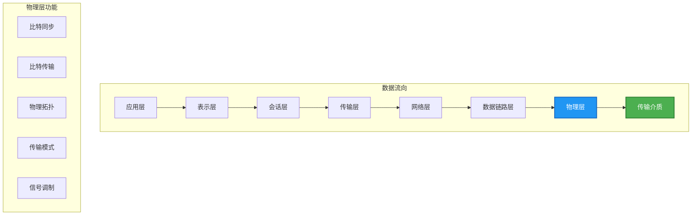

### 2.1.2 物理层标准

物理层标准主要由国际标准化组织（ISO）、国际电工委员会（IEC）和电气与电子工程师协会（IEEE）等机构制定。主要标准包括：

| 标准组织 | 主要标准 | 应用领域 |
|---------|---------|---------|
| IEEE | 802.3（以太网）、802.11（WLAN）、802.15（蓝牙） | 有线/无线网络 |
| EIA/TIA | EIA/TIA-568（布线标准）、EIA/TIA-232（串行通信） | 结构化布线、串口通信 |
| ISO/IEC | 11801（综合布线）、14631（光纤） | 商用建筑布线、光纤通信 |
| ITU-T | V系列（调制解调器）、I系列（ISDN） | 广域网、电信 |

### 2.1.3 比特率与波特率

**比特率（Bit Rate）** 是指单位时间内传输的比特数，单位为比特/秒（bps）。常用的单位还有：

- 千比特/秒（Kbps）
- 兆比特/秒（Mbps）
- 吉比特/秒（Gbps）

**波特率（Baud Rate）** 是指单位时间内传输的信号状态变化次数，也称为符号率。波特率与比特率的关系取决于每个符号携带的比特数：

$$\text{比特率} = \text{波特率} \times \log_2(n)$$

其中 $n$ 表示每个符号可以表示的不同状态数。

**示例**：如果使用4相位调制（每个符号携带2个比特），波特率为2400，则比特率为：

$$\text{比特率} = 2400 \times \log_2(4) = 2400 \times 2 = 4800 \text{ bps}$$

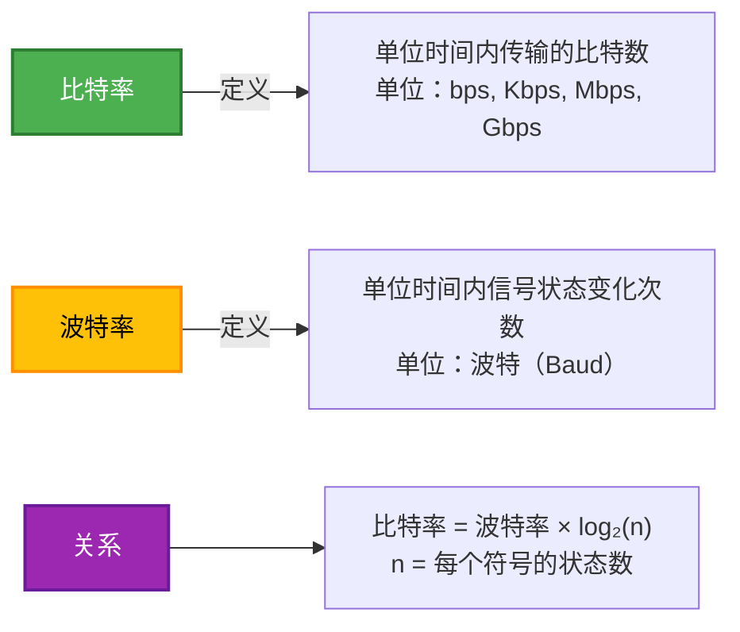

---

## 2.2 数据通信基础

### 2.2.1 基本通信模型

数据通信系统由源系统、传输系统和目的系统三部分组成。

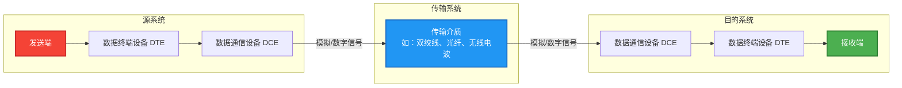

**源系统组件**：

- **数据终端设备（DTE）**：产生数据的设备，如计算机、终端等。
- **数据通信设备（DCE）**：进行信号转换的设备，如调制解调器、网络接口卡等。

**目的系统组件**：

- 与源系统类似，但执行相反的功能，将接收到的信号转换为数据。

### 2.2.2 数字信号与模拟信号

**模拟信号（Analog Signal）** 是连续变化的信号，如声音在空气中传播的声波。其特征参数（幅度、频率、相位）可以在一定范围内连续变化。

**数字信号（Digital Signal）** 是离散的信号，只有有限数量的离散值。在二进制系统中，数字信号只有"0"和"1"两种状态。


**模拟信号与数字信号的比较**：

| 特性 | 模拟信号 | 数字信号 |
|-----|---------|---------|
| 信号形式 | 连续变化 | 离散脉冲 |
| 抗干扰能力 | 较弱，易受噪声影响 | 较强，可再生重建 |
| 带宽效率 | 较低 | 较高 |
| 设备复杂度 | 较低 | 较高 |
| 典型应用 | 传统电话、广播 | 计算机网络、数字电话 |

### 2.2.3 信号的调制与解调

**调制（Modulation）** 是将基带信号转换为适合在传输介质上传输的频带信号的过程。**解调（Demodulation）** 是调制的逆过程。

调制的主要类型：

1. **幅移键控（ASK）**：通过改变载波信号的幅度来表示数据。

2. **频移键控（FSK）**：通过改变载波信号的频率来表示数据。

3. **相移键控（PSK）**：通过改变载波信号的相位来表示数据。

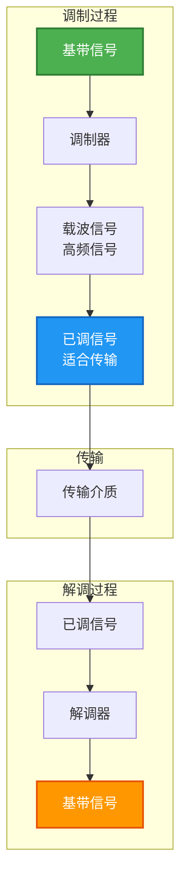

**复合调制技术**：

- **QPSK（正交相移键控）**：每个符号携带2个比特。
- **QAM（正交幅度调制）**：同时利用幅度和相位变化，如16-QAM、64-QAM、256-QAM。
- **OFDM（正交频分复用）**：将高速数据流分成多个低速子载波并行传输。

### 2.2.4 编码方式

数字信号在传输前需要进行线路编码，以提供时钟同步和直流平衡。

#### 2.2.4.1 不归零编码（NRZ）

**NRZ-L（不归零电平）**：用高电平表示"1"，低电平表示"0"。

**NRZ-I（不归零反转）**：用电平变化表示"1"，无变化表示"0"。

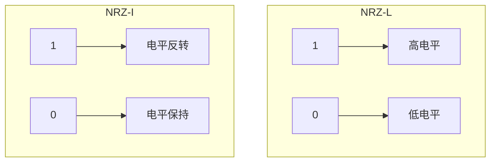

**NRZ的缺点**：

- 缺乏同步机制，长连"0"或"1"时难以提取时钟信号。
- 直流分量不定，不利于在某些传输介质中传输。

#### 2.2.4.2 曼彻斯特编码（Manchester Encoding）

曼彻斯特编码是一种自同步编码，每个比特周期都有电平变化：

- **IEEE 802.3标准**：从高到低的跳变表示"0"，从低到高的跳变表示"1"。
- **IEEE 802.4标准**：相反的定义。

每个比特周期的边界都有跳变，便于时钟同步。

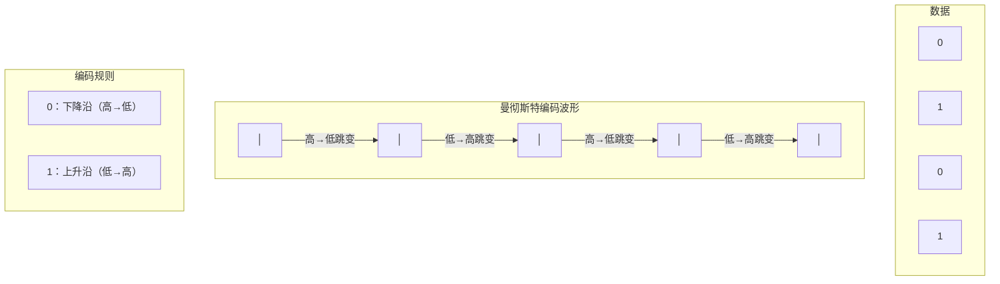

#### 2.2.4.3 差分曼彻斯特编码（Differential Manchester Encoding）

差分曼彻斯特编码在比特周期边界进行电平跳变来表示同步，在比特周期内是否有跳变来表示数据：

- **每比特周期边界**：总有跳变（提供时钟）。
- **比特中间**：有跳变表示"0"，无跳变表示"1"。

#### 2.2.4.4 常用编码方式对比

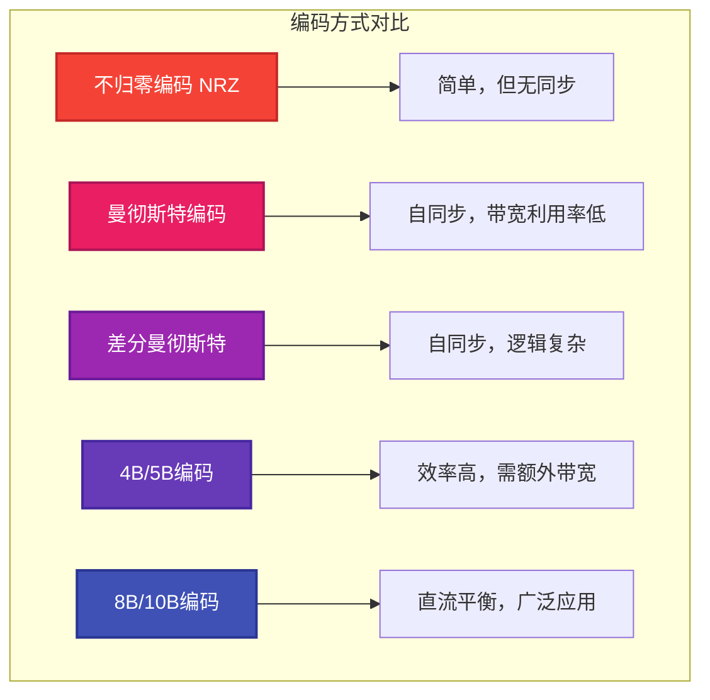

| 编码方式 | 时钟同步 | 带宽效率 | 直流平衡 | 应用场景 |
|---------|---------|---------|---------|---------|
| NRZ-L | 无 | 高 | 差 | 内部总线 |
| NRZ-I | 无 | 高 | 差 | 磁性存储 |
| Manchester | 有 | 50% | 好 | 10BASE-T以太网 |
| Differential Manchester | 有 | 50% | 好 | 令牌环网 |
| 4B/5B | 有 | 80% | 中 | 100BASE-FX |
| 8B/10B | 有 | 80% | 好 | 千兆以太网、光纤通道 |

### 2.2.5 带宽与信道容量

#### 2.2.5.1 带宽的概念

**带宽（Bandwidth）** 有两种含义：

1. **模拟带宽**：信号频率的范围，单位为赫兹（Hz）。例如，人耳能听到的声音频率范围约为20Hz至20kHz。

2. **数字带宽**：单位时间内能传输的数据量，单位为比特/秒（bps）。

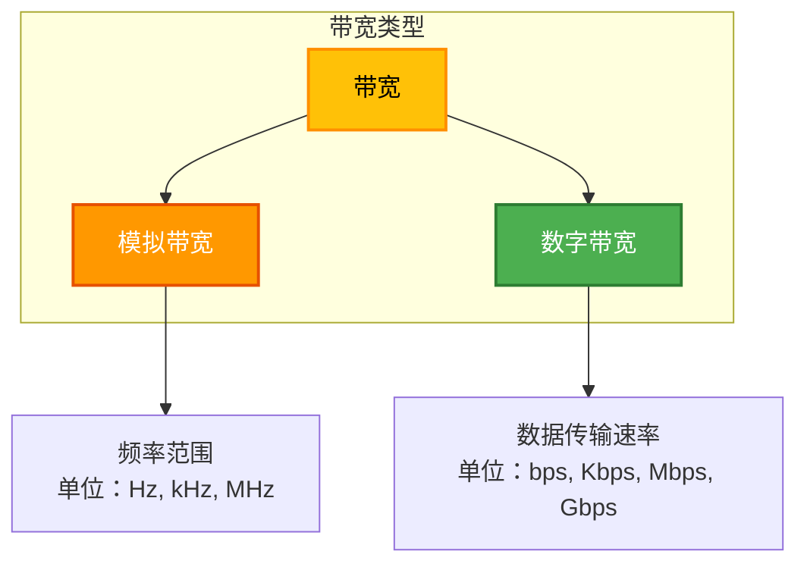

#### 2.2.5.2 奈奎斯特准则（Nyquist Criterion）

奈奎斯特准则描述了无噪声信道的最大数据传输速率：

$$C = 2 \times B \times \log_2(n)$$

其中：

- $C$：最大数据速率（bps）
- $B$：信道带宽（Hz）
- $n$：每个信号采样的离散等级数

**示例**：一个无噪声信道的带宽为3kHz，每个采样有8个离散等级，则最大数据速率为：

$$C = 2 \times 3000 \times \log_2(8) = 2 \times 3000 \times 3 = 18000 \text{ bps}$$

#### 2.2.5.3 香农定理（Shannon's Theorem）

香农定理描述了有噪声信道的理论最大信息传输速率：

$$C = B \times \log_2(1 + \frac{S}{N})$$

其中：

- $C$：最大信息速率（bps）
- $B$：信道带宽（Hz）
- $S/N$：信号噪声比（功率比）

**信噪比（dB）**：通常以分贝为单位表示：

$$\text{dB} = 10 \times \log_{10}(\frac{S}{N})$$

**示例**：一个信道的带宽为3kHz，信噪比为30dB，则最大信息速率为：

$$\frac{S}{N} = 10^{\frac{30}{10}} = 1000$$

$$C = 3000 \times \log_2(1 + 1000) = 3000 \times \log_2(1001) \approx 3000 \times 9.97 \approx 29910 \text{ bps}$$

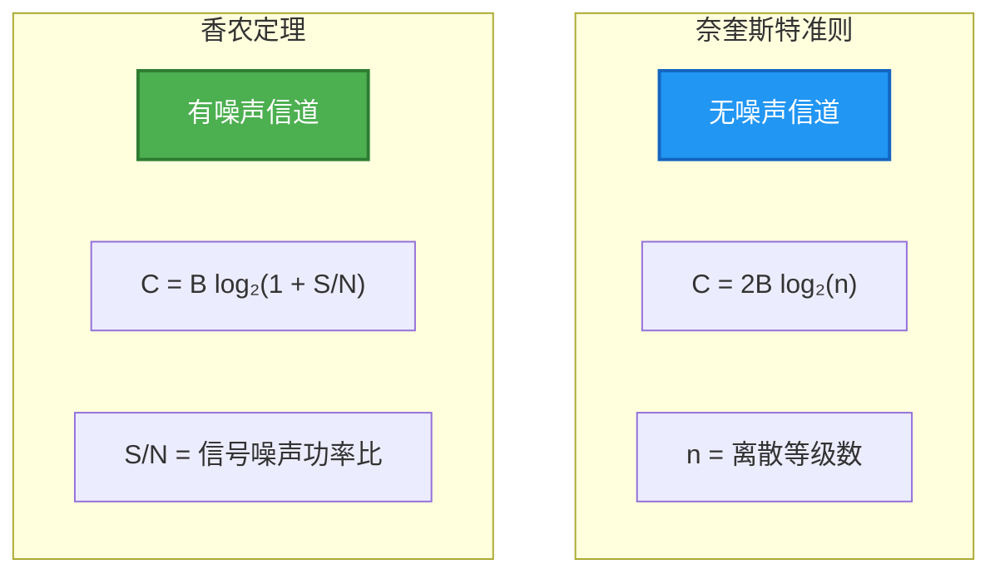

---

## 2.3 传输介质

传输介质是网络中数据传输的物理载体，可分为有线介质和无线介质两大类。

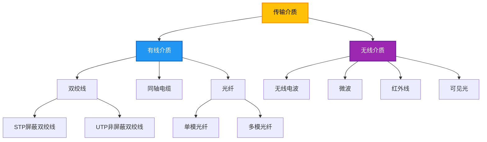

### 2.3.1 有线介质

#### 2.3.1.1 双绞线（Twisted Pair）

双绞线是由两根相互绞绕的绝缘铜线组成的线缆。绞绕的目的是减少电磁干扰（EMI）和串扰（crosstalk）。

**分类**：

1. **屏蔽双绞线（STP）**：每对线有金属屏蔽层，整个线缆有外屏蔽层。

2. **非屏蔽双绞线（UTP）**：没有屏蔽层，成本低，应用广泛。

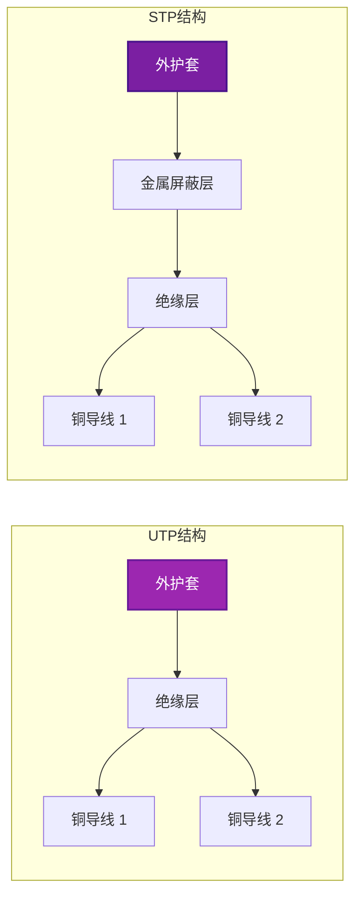

**双绞线类别（Cat）**：

| Category | 最大带宽 | 典型应用 | 最大传输距离 |
|----------|---------|---------|-------------|
| Cat 3 | 16 MHz | 10BASE-T以太网、语音 | 100米 |
| Cat 5 | 100 MHz | 100BASE-TX以太网 | 100米 |
| Cat 5e | 100 MHz | 1000BASE-T以太网 | 100米 |
| Cat 6 | 250 MHz | 10GBASE-T以太网 | 100米（55米在干扰环境）|
| Cat 6a | 500 MHz | 10GBASE-T以太网 | 100米 |
| Cat 7 | 600 MHz | 10GBASE-T以太网 | 100米 |
| Cat 8 | 2000 MHz | 25/40GBASE-T数据中心 | 30米 |

#### 2.3.1.2 同轴电缆（Coaxial Cable）

同轴电缆由中心铜导体、绝缘层、屏蔽层和外护套组成，具有较好的屏蔽性能和传输特性。

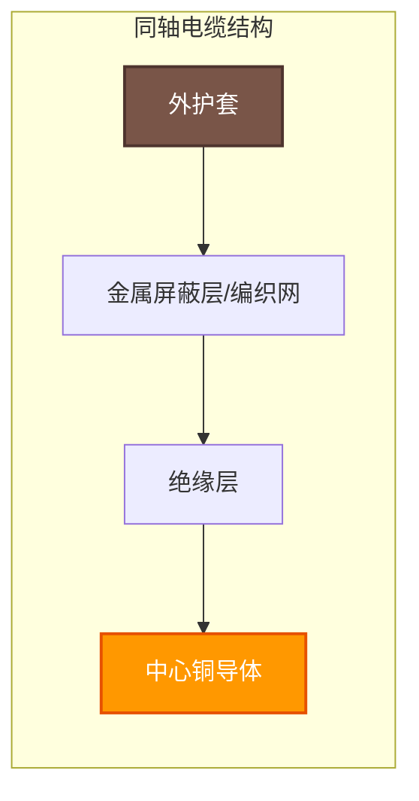

**同轴电缆类型**：

| 类型 | 阻抗 | 典型应用 | 直径 |
|------|-----|---------|------|
| RG-58 | 50Ω | 细缆以太网（10BASE-2） | 0.2英寸 |
| RG-6 | 75Ω | 有线电视、卫星电视 | 0.275英寸 |
| RG-11 | 75Ω | 长距离有线电视 | 0.4英寸 |
| LMR-400 | 50Ω | 无线通信馈线 | 0.4英寸 |

#### 2.3.1.3 光纤（Optical Fiber）

光纤利用光的全反射原理传输数据，具有带宽高、传输距离远、抗电磁干扰等优点。

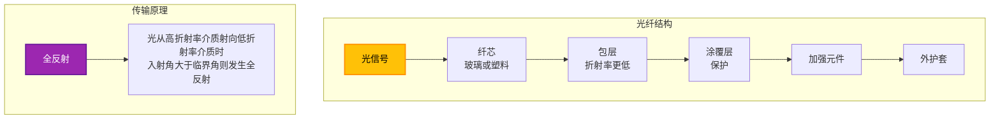

**单模光纤（Single-Mode Fiber）**：

- 纤芯直径：约8-10微米
- 数值孔径较小
- 只传输一种模式的光
- 适用于长距离传输（可达数十公里）
- 带宽极高

**多模光纤（Multi-Mode Fiber）**：

- 纤芯直径：约50-62.5微米
- 数值孔径较大
- 传输多种光模式
- 适用于短距离传输（通常小于2公里）
- 成本较低

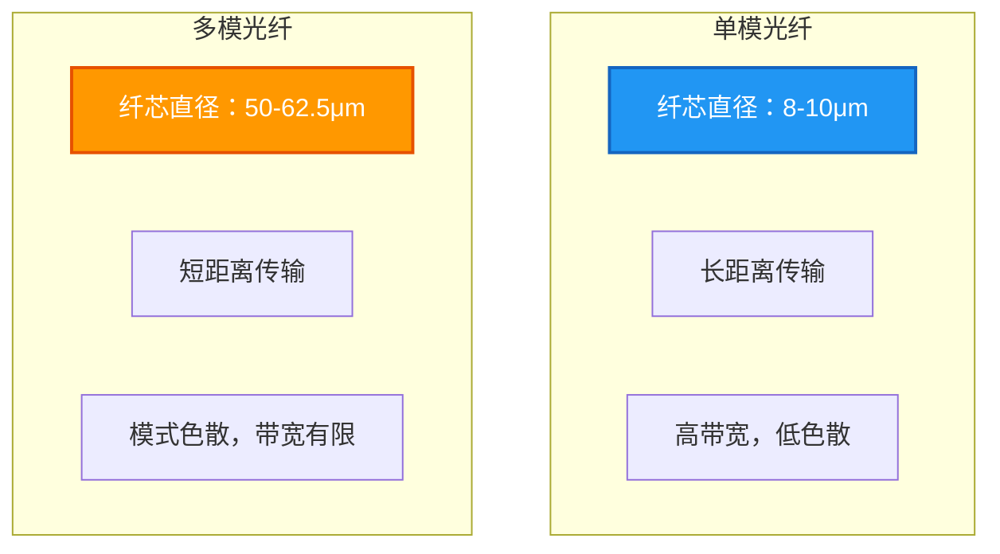

**光纤类型对比**：

| 特性 | 单模光纤 | 多模光纤 |
|-----|---------|---------|
| 纤芯直径 | 8-10 μm | 50-62.5 μm |
| 包层直径 | 125 μm | 125 μm |
| 典型光源 | 激光器 | LED/激光 |
| 波长 | 1310nm, 1550nm | 850nm, 1300nm |
| 最大距离 | 数十公里 | <2公里 |
| 成本 | 较高 | 较低 |
| 带宽 | 极高 | 中等 |

### 2.3.2 无线介质

#### 2.3.2.1 无线电波（Radio Waves）

无线电波的频率范围约为3kHz至300GHz，可穿透墙壁，应用广泛。

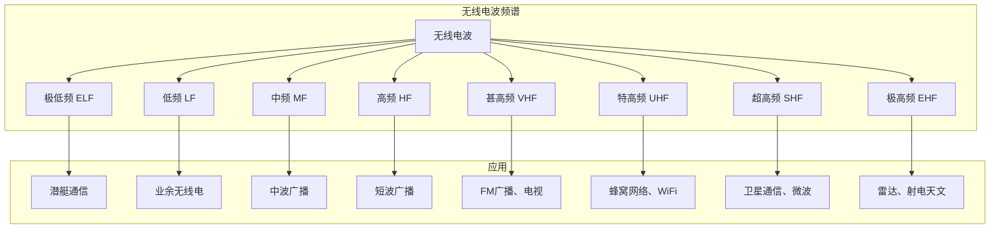

#### 2.3.2.2 微波（Microwave）

微波频率范围约为1GHz至300GHz，主要用于点对点通信。

**特性**：

- 直线传播，不能穿透障碍物
- 需要视线（Line-of-Sight）传输
- 频率高，穿透力强但易被吸收
- 常用于卫星通信和地面接力系统

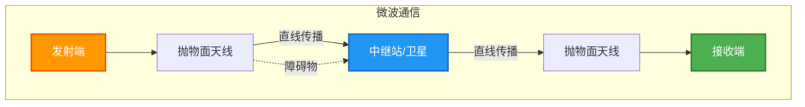

#### 2.3.2.3 红外线（Infrared）

红外线波长约为700nm至1mm，不能穿透墙壁，安全性高。

**应用**：

- 遥控器
- 红外数据传输（IrDA）
- 近距离无线通信

**限制**：

- 不能穿透墙壁
- 易受阳光干扰
- 传输距离有限

#### 2.3.2.4 可见光通信（VLC）

利用可见光（波长380-700nm）进行数据传输，是一项新兴技术。

**优势**：

- 频谱无需授权
- 可利用现有照明基础设施
- 安全性高（不能穿透墙壁）
- 可提供定位服务

### 2.3.3 传输介质特性对比

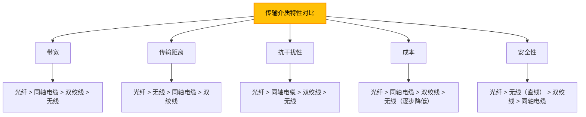

| 介质类型 | 带宽 | 距离 | 抗干扰 | 成本 | 安全性 |
|---------|------|------|--------|------|--------|
| 单模光纤 | 极高 | 数十公里 | 极高 | 高 | 高 |
| 多模光纤 | 高 | <2km | 高 | 中 | 高 |
| 同轴电缆 | 中高 | <500m | 高 | 中 | 中 |
| Cat 6a双绞线 | 高 | 100m | 中 | 低 | 低 |
| Cat 5e双绞线 | 中 | 100m | 中 | 低 | 低 |
| 无线电波 | 取决于频段 | 取决于环境 | 低 | 低 | 低 |
| 微波 | 高 | 视距 | 中 | 中高 | 中 |

---

## 2.4 物理层设备

### 2.4.1 中继器（Repeater）

中继器是物理层设备，用于在两个网段之间放大和再生信号，以延长网络的传输距离。

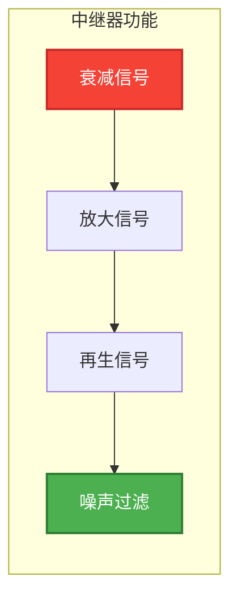

**功能特点**：

- 工作在OSI模型的物理层
- 只转发比特流，不进行任何协议处理
- 可以连接不同传输介质的网段（如双绞线和光纤）
- 不提供任何逻辑寻址功能
- 只能延伸网络在物理层面的长度

**应用限制**：

- 不能解决碰撞域过大的问题
- 不能连接不同速率的网络
- 严格遵循CSMA/CD的时序要求

### 2.4.2 集线器（Hub）

集线器是一种多端口中继器，工作在物理层，将接收到的信号广播到所有端口。

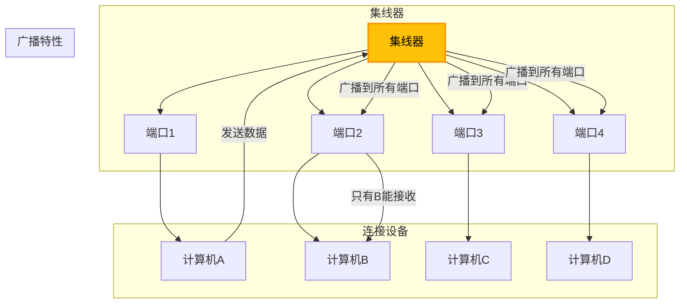

**类型**：

1. **主动集线器（Active Hub）**：放大信号，可级联。
2. **被动集线器（Passive Hub）**：不放大信号，仅用于星型布线。
3. **智能集线器（Intelligent Hub）**：支持网管功能。

**缺点**：

- 所有设备共享带宽
- 形成单一碰撞域
- 安全性差（任何设备都能收到所有数据）
- 已被交换机取代

### 2.4.3 设备对比

```mermaid
%%{init: {'theme': 'dark', 'themeVariables': {
  'primaryColor': '#4CAF50',
  'primaryTextColor': '#FFFFFF',
  'primaryBorderColor': '#2E7D32',
  'lineColor': '#90CAF9',
  'secondaryColor': '#2196F3',
  'tertiaryColor': '#1E1E1E'
}}%%
flowchart TB
    subgraph "物理层设备对比"
        A[物理层设备] --> B[中继器]
        A --> C[集线器]

        B --> B1["工作在物理层"]
        B --> B2["两个端口"]
        B --> B3["放大/再生信号"]
        B --> B4["延长传输距离"]

        C --> C1["工作在物理层"]
        C --> C2["多端口"]
        C --> C3["广播信号"]
        C --> C4["星型拓扑基础"]
    end

    style A fill:#FFC107,stroke:#FF8F00,stroke-width:2px,color:#000000
    style B fill:#2196F3,stroke:#1565C0,stroke-width:2px,color:#FFFFFF
    style C fill:#9C27B0,stroke:#6A1B9A,stroke-width:2px,color:#FFFFFF
```

| 特性 | 中继器 | 集线器 |
|------|--------|--------|
| 工作层次 | 物理层 | 物理层 |
| 端口数 | 2 | 4-48+ |
| 寻址功能 | 无 | 无 |
| 碰撞域 | 不隔离 | 不隔离 |
| 信号处理 | 放大/再生 | 放大/再生/广播 |
| 带宽共享 | N/A | 所有端口共享总带宽 |
| 设备类型 | 已被淘汰 | 已被交换机取代 |

### 2.4.4 物理层设备在网络中的位置

```mermaid
%%{init: {'theme': 'dark', 'themeVariables': {
  'primaryColor': '#4CAF50',
  'primaryTextColor': '#FFFFFF',
  'primaryBorderColor': '#2E7D32',
  'lineColor': '#90CAF9',
  'secondaryColor': '#2196F3',
  'tertiaryColor': '#1E1E1E'
}}%%
flowchart TB
    subgraph "OSI层次"
        L7[应用层]
        L6[表示层]
        L5[会话层]
        L4[传输层]
        L3[网络层]
        L2[数据链路层]
        L1[物理层]
    end

    subgraph "设备对应"
        R1[路由器] --> L3
        R2[交换机] --> L2
        R3[集线器/中继器] --> L1
    end

    style L1 fill:#2196F3,stroke:#1565C0,stroke-width:2px,color:#FFFFFF
    style R3 fill:#90CAF9,stroke:#42A5F5,stroke-width:2px,color:#000000
```

---

## 2.5 工程示例

### 2.5.1 网络线缆制作（RJ45接口的T568A/T568B标准）

#### 2.5.1.1 线缆类型

**直通线（Straight-Through Cable）**：

- 两端使用相同的线序标准（T568A或T568B）
- 用于连接不同类型的设备（如计算机与交换机）
- 实际应用中：目前几乎所有设备都支持Auto-MDI/MDIX，直通线与交叉线区别已不明显

**交叉线（Crossover Cable）**：

- 一端使用T568A，另一端使用T568B
- 用于连接相同类型的设备（如计算机与计算机）
- 已被支持Auto-MDI/MDIX的设备淘汰

```mermaid
%%{init: {'theme': 'dark', 'themeVariables': {
  'primaryColor': '#4CAF50',
  'primaryTextColor': '#FFFFFF',
  'primaryBorderColor': '#2E7D32',
  'lineColor': '#90CAF9',
  'secondaryColor': '#2196F3',
  'tertiaryColor': '#1E1E1E'
}}%%
flowchart TB
    subgraph "直通线"
        ST1[计算机端 T568B] --> ST2[交换机端 T568B]
    end

    subgraph "交叉线"
        CR1[计算机端 T568A] --> CR2[计算机端 T568B]
    end

    style ST1 fill:#4CAF50,stroke:#2E7D32,stroke-width:2px,color:#FFFFFF
    style CR1 fill:#FF9800,stroke:#E65100,stroke-width:2px,color:#FFFFFF
```

#### 2.5.1.2 T568A与T568B线序

**T568A线序（从左到右，面对插头引脚）**：

| 引脚 | 1 | 2 | 3 | 4 | 5 | 6 | 7 | 8 |
|------|---|---|---|---|---|---|---|---|
| 颜色 | 白绿 | 绿 | 白橙 | 蓝 | 白蓝 | 橙 | 白棕 | 棕 |

**T568B线序（从左到右，面对插头引脚）**：

| 引脚 | 1 | 2 | 3 | 4 | 5 | 6 | 7 | 8 |
|------|---|---|---|---|---|---|---|---|
| 颜色 | 白橙 | 橙 | 白绿 | 蓝 | 白蓝 | 绿 | 白棕 | 棕 |

```mermaid
%%{init: {'theme': 'dark', 'themeVariables': {
  'primaryColor': '#4CAF50',
  'primaryTextColor': '#FFFFFF',
  'primaryBorderColor': '#2E7D32',
  'lineColor': '#90CAF9',
  'secondaryColor': '#2196F3',
  'tertiaryColor': '#1E1E1E'
}}%%
flowchart TB
    subgraph "T568A"
        TA1["1: 白绿"]
        TA2["2: 绿"]
        TA3["3: 白橙"]
        TA4["4: 蓝"]
        TA5["5: 白蓝"]
        TA6["6: 橙"]
        TA7["7: 白棕"]
        TA8["8: 棕"]
    end

    subgraph "T568B"
        TB1["1: 白橙"]
        TB2["2: 橙"]
        TB3["3: 白绿"]
        TB4["4: 蓝"]
        TB5["5: 白蓝"]
        TB6["6: 绿"]
        TB7["7: 白棕"]
        TB8["8: 棕"]
    end
```

#### 2.5.1.3 制作工具

1. **压线钳**：用于剥线和压接RJ45插头。
2. **网线测试仪**：用于检测线缆的连通性和线序。
3. **斜口钳**：用于剪断线缆。
4. **打线刀**：用于在配线架上打线。
5. **剥线刀**：用于剥除线缆外皮。

#### 2.5.1.4 制作步骤

**步骤1：准备线缆**

使用压线钳的剥线刀口，在线缆端部约2-3厘米处环形切割外护套，注意不要损伤内部导线。

**步骤2：排列线序**

将8根导线按照所需的线序标准排列整齐。常用的是T568B标准。

```
T568B排列顺序：白橙、橙、白绿、蓝、白蓝、绿、白棕、棕
```

**步骤3：剪齐导线**

将排列好的8根导线剪断，留出约1.2-1.5厘米的长度。

**步骤4：插入RJ45插头**

将剪齐的导线小心插入RJ45插头，确保每根导线都到达插头最前端，且外护套被插头夹住。

**步骤5：压接**

将插头放入压线钳的RJ45压接口，用力压下，确保导线与插头引脚良好接触。

**步骤6：重复另一端**

按照相同的步骤制作另一端接头。

### 2.5.2 使用线缆测试仪检测连线

#### 2.5.2.1 测试仪类型

**基本线缆测试仪**：只能测试连通性，通过LED指示灯显示结果。

**高级线缆测试仪**：可测试线缆长度、衰减、近端串扰（NEXT）、回波损耗等参数。

#### 2.5.2.2 测试方法

**连通性测试**：

1. 将网线一端插入主测试仪的RJ45端口。
2. 将网线另一端插入远端单元的RJ45端口。
3. 打开测试仪电源。
4. 观察主测试仪和远端单元的LED灯对应亮起。

**正常结果**：主测试仪的1-8号灯依次亮起，远端单元的1-8号灯也依次亮起，且顺序一致。

**常见故障**：

| 故障现象 | 可能原因 |
|---------|---------|
| 某号灯不亮 | 该线未连接（断路） |
| 两端灯序不一致 | 线序错误（跳线） |
| 多个灯同时亮 | 短路 |
| 灯闪烁不定 | 接触不良 |

```mermaid
%%{init: {'theme': 'dark', 'themeVariables': {
  'primaryColor': '#4CAF50',
  'primaryTextColor': '#FFFFFF',
  'primaryBorderColor': '#2E7D32',
  'lineColor': '#90CAF9',
  'secondaryColor': '#2196F3',
  'tertiaryColor': '#1E1E1E'
}}%%
flowchart TB
    subgraph "线缆测试仪"
        MT[主测试仪] -->|"LED 1-8"| L1[指示灯组]
        L1 -->|"网线"| RE[远端单元]
        RE -->|"LED 1-8"| L2[指示灯组]
    end

    subgraph "测试判断"
        TB1["正常：两端1-8顺序一致"]
        TB2["断路：某号灯不亮"]
        TB3["短路：多个灯同时亮"]
        TB4["跳线：灯序不一致"]
    end

    style MT fill:#2196F3,stroke:#1565C0,stroke-width:2px,color:#FFFFFF
    style RE fill:#2196F3,stroke:#1565C0,stroke-width:2px,color:#FFFFFF
```

#### 2.5.2.3 线缆认证测试

对于Cat 5e、Cat 6等高性能线缆，需要进行认证测试，确保满足标准要求。

**认证测试参数**：

- **接线图（Wire Map）**：验证8根导线的正确连接。
- **长度（Length）**：每对线的物理/电气长度。
- **插入损耗（Insertion Loss）**：信号衰减程度。
- **近端串扰（NEXT）**：相邻线对之间的干扰。
- **远端串扰（FEXT）**：远端的串扰。
- **回波损耗（Return Loss）**：阻抗不匹配导致的反射。
- **综合功率串扰（PSNEXT）**：所有线对的总串扰。
- **衰减串扰比（ACR）**：衰减与串扰的比值。

### 2.5.3 实际布线注意事项

#### 2.5.3.1 环境考虑

1. **避免电磁干扰（EMI）**：
   - 远离电机、变压器、高压电线等设备。
   - 与电力电缆保持足够间距（建议30cm以上）。
   - 在强干扰环境中使用屏蔽线缆或光纤。

2. **避免潮湿和极端温度**：
   - 线缆不应暴露在潮湿环境中。
   - 注意线缆的温度额定值。

3. **机械保护**：
   - 在人员活动区域使用金属管或线槽保护。
   - 避免线缆受到拉伸、挤压或弯曲过度。

```mermaid
%%{init: {'theme': 'dark', 'themeVariables': {
  'primaryColor': '#4CAF50',
  'primaryTextColor': '#FFFFFF',
  'primaryBorderColor': '#2E7D32',
  'lineColor': '#90CAF9',
  'secondaryColor': '#2196F3',
  'tertiaryColor': '#1E1E1E'
}}%%
flowchart TB
    subgraph "布线间距要求"
        P1[电力电缆 < 480V] -->|"平行"| D1[30 cm]
        P1 -->|"交叉"| D2[15 cm]
        P2[电力电缆 > 480V] -->|"平行"| D3[60 cm]
        P2 -->|"交叉"| D4[30 cm]
    end

    style P1 fill:#FFC107,stroke:#FF8F00,stroke-width:2px,color:#000000
    style P2 fill:#FF9800,stroke:#E65100,stroke-width:2px,color:#FFFFFF
```

#### 2.5.3.2 安装规范

1. **弯曲半径**：
   - 对于Cat 5e/Cat 6线缆，弯曲半径应不小于线缆直径的4倍。
   - 对于光纤，弯曲半径应不小于线缆直径的15倍（单模）或10倍（多模）。

2. **拉力限制**：
   - 安装时的拉力不应超过线缆的额定拉力。
   - 常用双绞线的拉力限制约为110N。

3. **捆扎要求**：
   - 使用专用的线缆扎带，不要过紧。
   - 捆扎后的线缆束不应变形。

#### 2.5.3.3 标签标识

1. **线缆标签**：
   - 在线缆两端粘贴标签。
   - 标签内容应包括：起点、终点、用途、编号。

2. **配线架标签**：
   - 每个端口应有明确标识。
   - 建议使用统一的命名规则。

3. **文档记录**：
   - 保留完整的布线图纸。
   - 记录设备连接关系。
   - 记录测试报告。

#### 2.5.3.4 常见错误与避免方法

| 常见错误 | 后果 | 避免方法 |
|---------|------|---------|
| 拉力过大 | 线缆伸长，性能下降 | 使用放线架，控制拉力 |
| 弯曲半径过小 | 信号衰减增加 | 使用合适的弯头，保持最小半径 |
| 与电力电缆太近 | 电磁干扰 | 保持规定间距，使用屏蔽线 |
| 线序错误 | 网络不通或性能差 | 严格按照标准制作，使用测试仪验证 |
| 剥皮过长 | 串扰增加 | 控制剥皮长度在1.2-1.5cm |
| 压接不牢 | 接触不良 | 使用合格的压线钳，确保压接到位 |

---

## 本章小结

物理层是计算机网络的基础，负责在物理介质上传输原始比特流。本章主要知识点：

1. **物理层概述**：
   - 物理层的五大功能：比特同步、比特传输、物理拓扑、传输模式、信号调制
   - 比特率与波特率的概念及关系

2. **数据通信基础**：
   - 数字信号与模拟信号的区别
   - 调制解调的基本原理（ASK、FSK、PSK）
   - 常用编码方式：NRZ、曼彻斯特编码、差分曼彻斯特编码
   - 奈奎斯特准则和香农定理

3. **传输介质**：
   - 有线介质：双绞线（STP/UTP）、同轴电缆、光纤（单模/多模）
   - 无线介质：无线电波、微波、红外线、可见光
   - 各类介质的特性对比与应用场景

4. **物理层设备**：
   - 中继器：信号放大与再生
   - 集线器：多端口广播设备
   - 设备对比与适用场景

5. **工程实践**：
   - T568A/T568B线缆标准与制作方法
   - 线缆测试仪的使用
   - 布线规范与注意事项

---

## 习题思考

1. 解释比特率与波特率的区别，并说明它们之间的关系。

2. 曼彻斯特编码的主要优点是什么？为什么在10Mbps以太网中使用曼彻斯特编码？

3. 比较单模光纤和多模光纤的特点，说明各自的适用场景。

4. 简述香农定理和奈奎斯特准则的物理意义和应用场景。

5. 为什么在结构化布线中要求双绞线与电力电缆保持一定间距？

6. 解释T568A和T568B线序标准的区别，以及直通线与交叉线的应用场景。

7. 物理层的五大功能是什么？中继器和集线器分别实现哪些功能？

---

**上一页**：[第一章：计算机网络概述](./01_计算机网络概述.md)

**下一页**：[第三章：数据链路层](./03_数据链路层.md)
