# 第三章：数据链路层

## 3.1 数据链路层概述

数据链路层（Data Link Layer）是OSI七层模型中的第二层，位于物理层和网络层之间。它负责在相邻节点之间可靠地传输数据帧，并为网络层提供无差错的数据传输服务。

### 3.1.1 数据链路层的功能

数据链路层主要提供以下核心功能：

1. **帧定界与同步**：将网络层传来的数据报封装成帧，添加帧起始和结束标志，实现数据的透明传输。

2. **物理地址寻址**：使用MAC地址（Media Access Control Address）标识网络中的每个设备，确保数据能够正确送达目标设备。

3. **差错检测与控制**：检测数据在传输过程中产生的错误，并通过重传等机制进行纠正。

4. **流量控制**：协调发送端和接收端的数据传输速率，防止接收端因来不及处理而丢失数据。

5. **介质访问控制**：控制多个设备共享同一传输介质时的访问权限，避免冲突发生。

6. **链路管理**：建立、维持和释放数据链路连接，确保通信双方能够正常通信。

### 3.1.2 链路与数据链路

**链路（Link）** 是指一条物理线路，包括传输介质和相关的通信设备。例如，从计算机到交换机的双绞线就是一条链路。链路是硬件层面的概念，仅提供基本的连通性。

**数据链路（Data Link）** 是在链路的基础上增加了实现协议的软件和硬件而形成的逻辑通路。数据链路除了包含物理链路外，还包括一套完整的通信协议和必要的控制设备。例如，使用以太网协议进行通信的网络就是一条数据链路。

两者的区别可以用一个形象的比喻说明：链路就像一条公路，而数据链路则像是装备了交通规则、信号灯和交警的完整交通系统。

### 3.1.3 数据链路层的服务

数据链路层向网络层提供以下主要服务：

| 服务类型 | 说明 |
|---------|------|
| 无确认无连接服务 | 发送前不建立连接，接收方不确认收到，适用于误码率低的网络（如光纤） |
| 有确认无连接服务 | 不建立连接，但接收方需确认，适用于不可靠的传输介质（如无线网络） |
| 有确认有连接服务 | 先建立连接，传输数据，接收方确认，最后释放连接，提供最可靠的服务 |

数据链路层将网络层传来的数据报封装成帧，通过物理层发送给接收方的数据链路层，接收方验证帧的完整性后，将数据交给网络层。这一过程对网络层是透明的。

---

## 3.2 帧与帧定界

### 3.2.1 帧的结构

帧（Frame）是数据链路层的基本传输单位。它由帧头、数据部分和帧尾三部分组成。

```mermaid
%%{init: {'theme': 'dark', 'themeVariables': {
  'primaryColor': '#4CAF50',
  'primaryTextColor': '#FFFFFF',
  'primaryBorderColor': '#2E7D32',
  'lineColor': '#90CAF9',
  'secondaryColor': '#2196F3',
  'tertiaryColor': '#1E1E1E'
}}%%
flowchart LR
    subgraph 帧结构["帧结构"]
        A[帧头<br/>Header] --> B[数据部分<br/>Payload]
        B --> C[帧尾<br/>Trailer]
    end
    subgraph 帧头内容["帧头内容"]
        D[帧起始标志]
        E[源MAC地址]
        F[目标MAC地址]
        G[类型/长度字段]
    end
    subgraph 帧尾内容["帧尾内容"]
        H[帧校验序列<br/>FCS]
    end
    style 帧结构 fill:#1E1E1E,stroke:#4CAF50,stroke-width:2px
    style 帧头内容 fill:#1E1E1E,stroke:#2196F3,stroke-width:2px
    style 帧尾内容 fill:#1E1E1E,stroke:#2196F3,stroke-width:2px
```

典型的以太网帧结构如下：

```mermaid
%%{init: {'theme': 'dark', 'themeVariables': {
  'primaryColor': '#4CAF50',
  'primaryTextColor': '#FFFFFF',
  'primaryBorderColor': '#2E7D32',
  'lineColor': '#90CAF9',
  'secondaryColor': '#2196F3',
  'tertiaryColor': '#1E1E1E'
}}%%
flowchart TB
    subgraph Ethernet["Ethernet II 帧结构（64-1518字节）"]
        A[前导码<br/>7字节] --> B[帧起始定界符<br/>SFD<br/>1字节]
        B --> C[目的MAC地址<br/>6字节]
        C --> D[源MAC地址<br/>6字节]
        D --> E[类型字段<br/>2字节]
        E --> F[数据<br/>46-1500字节]
        F --> G[帧校验序列<br/>FCS<br/>4字节]
    end
    style Ethernet fill:#1E1E1E,stroke:#4CAF50,stroke-width:2px
    style A fill:#FFC107,stroke:#FF8F00,color:#000000
    style G fill:#FFC107,stroke:#FF8F00,color:#000000
```

**前导码（Preamble）**：7字节的10101010模式，用于接收方同步时钟频率。

**帧起始定界符（SFD，Start Frame Delimiter）**：1字节的10101011序列，标志帧的开始。

**目的MAC地址**：6字节，标识帧的接收方。

**源MAC地址**：6字节，标识帧的发送方。

**类型字段**：2字节，标识上层协议类型。例如，0x0800表示IPv4，0x0806表示ARP，0x86DD表示IPv6。

**数据部分**：46-1500字节，携带上层协议的数据。

**帧校验序列（FCS，Frame Check Sequence）**：4字节，使用CRC算法计算，用于检测传输错误。

### 3.2.2 帧定界方法

帧定界（Framing）的目的是让接收方能够正确识别一个帧的起始和结束位置。常用的帧定界方法有以下两种：

#### 字符填充法

字符填充法使用特殊字符作为帧的边界标志。当数据部分出现与标志字符相同的字符时，需要进行转义处理。

常见的字符填充法包括：

1. **面向字符的协议**：使用ASCII字符的特定模式（如STX、ETX）标记帧的起止。

2. **PPP协议（Point-to-Point Protocol）**：使用标志字节0x7E（01111110）作为帧的边界。当数据部分出现0x7E时，替换为0x7D 0x5E；当出现转义字符0x7D时，替换为0x7D 0x5D。

```mermaid
%%{init: {'theme': 'dark', 'themeVariables': {
  'primaryColor': '#4CAF50',
  'primaryTextColor': '#FFFFFF',
  'primaryBorderColor': '#2E7D32',
  'lineColor': '#90CAF9',
  'secondaryColor': '#2196F3',
  'tertiaryColor': '#1E1E1E'
}}%%
flowchart LR
    subgraph 发送端处理["发送端处理"]
        A[原始数据] --> B{检查数据}
        B -->|包含0x7E| C[替换为0x7D 0x5E]
        B -->|包含0x7D| D[替换为0x7D 0x5D]
        B -->|其他字符| E[保持不变]
        C --> F[添加帧标志0x7E]
        D --> F
        E --> F
    end
    F --> G[发送数据]
    style 发送端处理 fill:#1E1E1E,stroke:#4CAF50,stroke-width:2px
    style B fill:#FFC107,stroke:#FF8F00,color:#000000
    style G fill:#4CAF50,stroke:#2E7D32,color:#FFFFFF
```

```mermaid
%%{init: {'theme': 'dark', 'themeVariables': {
  'primaryColor': '#4CAF50',
  'primaryTextColor': '#FFFFFF',
  'primaryBorderColor': '#2E7D32',
  'lineColor': '#90CAF9',
  'secondaryColor': '#2196F3',
  'tertiaryColor': '#1E1E1E'
}}%%
flowchart LR
    subgraph 接收端处理["接收端处理"]
        H[接收数据] --> I{检查数据}
        I -->|遇到0x7D| J[读取下一字节]
        J -->|下一字节是0x5E| K[还原为0x7E]
        J -->|下一字节是0x5D| L[还原为0x7D]
        I -->|遇到0x7E| M[帧结束]
        I -->|其他字符| N[保留]
        K --> O[重组数据]
        L --> O
        N --> O
    end
    style 接收端处理 fill:#1E1E1E,stroke:#4CAF50,stroke-width:2px
    style I fill:#FFC107,stroke:#FF8F00,color:#000000
    style M fill:#4CAF50,stroke:#2E7D32,color:#FFFFFF
```

#### 位填充法

位填充法适用于面向比特的同步传输协议，如HDLC（High-Level Data Link Control）。它使用"01111110"作为帧边界标志。

位填充的规则如下：

- 发送端：在数据部分每遇到5个连续的"1"后，自动插入一个"0"
- 接收端：每遇到5个连续的"1"后，自动删除后面的"0"

```mermaid
%%{init: {'theme': 'dark', 'themeVariables': {
  'primaryColor': '#4CAF50',
  'primaryTextColor': '#FFFFFF',
  'primaryBorderColor': '#2E7D32',
  'lineColor': '#90CAF9',
  'secondaryColor': '#2196F3',
  'tertiaryColor': '#1E1E1E'
}}%%
flowchart TB
    subgraph 位填充示例["位填充示例"]
        A[发送数据<br/>011011111011111101] --> B[填充后<br/>011011111001111101]
        C[接收数据<br/>011011111001111101] --> D[还原后<br/>011011111011111101]
    end
    style 位填充示例 fill:#1E1E1E,stroke:#4CAF50,stroke-width:2px
    style A fill:#2196F3,stroke:#1565C0,color:#FFFFFF
    style C fill:#2196F3,stroke:#1565C0,color:#FFFFFF
```

这种方法的优点是不会出现伪同步标志，因为数据部分不可能出现6个连续的"1"。

### 3.2.3 常见的帧格式

#### Ethernet II 帧格式

Ethernet II是目前最广泛使用的以太网帧格式，其结构如下：

```
+----------+----------+----------+----------+----------------+----------+
| 前导码   | 目的MAC  | 源MAC    | 类型     | 数据           | FCS      |
| 7字节    | 6字节    | 6字节    | 2字节    | 46-1500字节    | 4字节    |
+----------+----------+----------+----------+----------------+----------+
```

**最小帧长度**：64字节（6+6+2+46+4=64）

**最大帧长度**：1518字节（6+6+2+1500+4=1518）

#### IEEE 802.3 帧格式

IEEE 802.3是IEEE发布的以太网标准，与Ethernet II略有不同：

```
+----------+----------+----------+----------+----------------+----------+
| 前导码   | 目的MAC  | 源MAC    | 长度     | 802.2头+数据   | FCS      |
| 7字节    | 6字节    | 6字节    | 2字节    | 最多1497字节   | 4字节    |
+----------+----------+----------+----------+----------------+----------+
```

两者的主要区别：

1. Ethernet II使用"类型"字段标识上层协议，而IEEE 802.3使用"长度"字段
2. IEEE 802.3在长度字段后添加LLC（Logical Link Control）子层头部
3. IEEE 802.3的最大数据载荷为1497字节（1500-3字节LLC头部）

---

## 3.3 差错控制

### 3.3.1 差错的类型与原因

数据在传输过程中可能发生错误，主要分为以下几类：

**随机错误**：由热噪声、电磁干扰等随机因素引起，错误的发生是独立的、随机的。

**突发错误**：由脉冲噪声、开关故障等引起，多个连续位同时出错，具有相关性。

**位错误**：单个位的翻转（0变为1或1变为0）。

**突发错误**：一群连续的错误位，如连续8位出错。

差错产生的主要原因包括：

- **热噪声**：电子热运动产生的随机波动
- **冲击噪声**：由闪电、电机启动等产生的强干扰
- **衰减**：信号在传输过程中强度减弱
- **失真**：信号波形在传输中发生变形
- **串扰**：相邻信号线之间的相互干扰

### 3.3.2 奇偶校验

奇偶校验（Parity Check）是最简单的检错码，分为奇校验和偶校验两种。

**偶校验**：加上校验位后，数据中"1"的个数为偶数。

**奇校验**：加上校验位后，数据中"1"的个数为奇数。

```mermaid
%%{init: {'theme': 'dark', 'themeVariables': {
  'primaryColor': '#4CAF50',
  'primaryTextColor': '#FFFFFF',
  'primaryBorderColor': '#2E7D32',
  'lineColor': '#90CAF9',
  'secondaryColor': '#2196F3',
  'tertiaryColor': '#1E1E1E'
}}%%
flowchart TB
    subgraph 奇偶校验示例["奇偶校验示例"]
        A[原始数据位] --> B[计算1的个数]
        B --> C{使用奇校验还是偶校验？}
        C -->|偶校验| D{1的个数是偶数？}
        C -->|奇校验| E{1的个数是奇数？}
        D -->|是| F[校验位 = 0]
        D -->|否| G[校验位 = 1]
        E -->|是| H[校验位 = 0]
        E -->|否| I[校验位 = 1]
    end
    style 奇偶校验示例 fill:#1E1E1E,stroke:#4CAF50,stroke-width:2px
    style C fill:#FFC107,stroke:#FF8F00,color:#000000
    style D fill:#FFC107,stroke:#FF8F00,color:#000000
    style E fill:#FFC107,stroke:#FF8F00,color:#000000
    style F fill:#4CAF50,stroke:#2E7D32,color:#FFFFFF
    style G fill:#F44336,stroke:#C62828,color:#FFFFFF
    style H fill:#4CAF50,stroke:#2E7D32,color:#FFFFFF
    style I fill:#F44336,stroke:#C62828,color:#FFFFFF
```

假设传输数据为"1011010"（4个1）：

- **偶校验**：1的个数是偶数（4个），校验位为0，发送"10110100"
- **奇校验**：1的个数是偶数（4个），校验位为1，发送"10110101"

假设接收到的数据为"10110101"（奇校验），计算1的个数为5个，是奇数，校验通过。

**局限性**：奇偶校验只能检测**奇数个位错误**，如果发生偶数个位错误，则无法检测。例如，两个位同时翻转时，奇偶校验无法发现。

### 3.3.3 循环冗余校验（CRC）原理

CRC（Cyclic Red Redundancy Check）是目前应用最广泛的检错码，具有很强的检错能力。

CRC的工作原理基于多项式除法：

1. **发送端**：
   - 将数据比特串看作一个多项式
   - 选择一个生成多项式（Generator Polynomial）
   - 用数据除以生成多项式，得到余数
   - 将余数附加到数据后面发送

2. **接收端**：
   - 用收到的数据除以同一个生成多项式
   - 如果余数为0，认为没有错误
   - 如果余数不为0，认为有错误

```mermaid
%%{init: {"theme": "dark", "themeVariables": {
  "primaryColor": "#4CAF50",
  "primaryTextColor": "#FFFFFF",
  "primaryBorderColor": "#2E7D32",
  "lineColor": "#90CAF9",
  "secondaryColor": "#2196F3",
  "tertiaryColor": "#1E1E1E"
}}}%%
flowchart TB
    subgraph CRC发送端处理["CRC发送端处理"]
        A["待发送数据<br/>M(x)"] --> B["附加零<br/>R个零"]
        B --> C["除以生成多项式<br/>G(x)"]
        C --> D["得到余数<br/>R(x)"]
        D --> E["附加余数到数据后面"]
        %% 修复点：将 xᴿ 替换为标准的 HTML 上标写法 x<sup>R</sup>
        E --> F["发送<br/>T(x) = M(x)·x<sup>R</sup> + R(x)"]
    end
    style CRC发送端处理 fill:#1E1E1E,stroke:#4CAF50,stroke-width:2px
    style F fill:#4CAF50,stroke:#2E7D32,color:#FFFFFF
```

常见的CRC生成多项式：

| 名称 | 多项式 | 应用 |
|------|--------|------|
| CRC-8 | x⁸ + x² + x + 1 | ATM HEC |
| CRC-16 | x¹⁶ + x¹² + x⁵ + 1 | HDLC、PPP |
| CRC-32 | x³² + x²⁶ + x²³ + ... + x² + x + 1 | Ethernet、ZIP |

**CRC的计算示例**：

设数据为"1101"，生成多项式为"1011"（x³ + x + 1）。

```
步骤1：在数据后附加R个零（R=3）

    1101000
  ÷ 1011
```

```
步骤2：执行除法（异或运算）

    1101000
  ÷ 1011
    1011    ← 异或
    ----
    0110
    0000
    ----
    1100
    1011
    ----
    0110
    0000
    ----
    110    ← 余数3位
```

最终发送的数据为"1101110"（1101 + 110）。

**CRC的检错能力**：

- 可以检测所有单位错、双位错、奇数个位错
- 可以检测所有长度小于等于R位的突发错误
- 可以检测99.999%长度大于R位的突发错误

### 3.3.4 纠错与检错

**检错码（Error Detecting Code）**：只能检测错误，不能定位和纠正错误。如奇偶校验、CRC。

**纠错码（Error Correcting Code）**：不仅能检测错误，还能定位错误位置并自动纠正。如汉明码（Hamming Code）。

**汉明码的原理**：

汉明码通过在数据位之间插入校验位，使得每个校验位负责校验一组特定的数据位。

对于m位数据，需要插入r个校验位，满足关系：2ʳ ≥ m + r + 1

```mermaid
%%{init: {'theme': 'dark', 'themeVariables': {
  'primaryColor': '#4CAF50',
  'primaryTextColor': '#FFFFFF',
  'primaryBorderColor': '#2E7D32',
  'lineColor': '#90CAF9',
  'secondaryColor': '#2196F3',
  'tertiaryColor': '#1E1E1E'
}}%%
flowchart TB
    subgraph 汉明码结构74["汉明码结构（7,4）"]
        direction TB
        D1[数据位 D₁] --> P1[校验位 P₁]
        D2[数据位 D₂] --> P2[校验位 P₂]
        D3[数据位 D₃] --> P3[校验位 P₃]
        D4[数据位 D₄] --> P4[校验位 P₄]
        
        P1 --> G1[位置1]
        P2 --> G1
        P3 --> G1
        P4 --> G1
        P1 --> G2[位置2]
        P2 --> G2
        P3 --> G2
        P4 --> G2
    end
    style 汉明码结构74 fill:#1E1E1E,stroke:#4CAF50,stroke-width:2px
    style D1 fill:#2196F3,stroke:#1565C0,color:#FFFFFF
    style D2 fill:#2196F3,stroke:#1565C0,color:#FFFFFF
    style D3 fill:#2196F3,stroke:#1565C0,color:#FFFFFF
    style D4 fill:#2196F3,stroke:#1565C0,color:#FFFFFF
```

**检错与纠错的选择**：

在实际应用中，选择检错还是纠错需要考虑以下因素：

- **误码率**：传输介质的可靠性
- **重传代价**：重传延迟和带宽成本
- **实时性要求**：是否可以等待重传
- **设备复杂度**：纠错需要更复杂的硬件

对于大多数有线网络，通常采用"检错 + 重传"机制；而对于某些无线网络或存储系统，则可能采用纠错码。

---

## 3.4 流量控制

### 3.4.1 流量控制的目的

流量控制（Flow Control）是指协调发送端和接收端的数据传输速率，确保发送端不会因为发送速度过快而导致接收端无法及时处理而丢失数据。

如果没有流量控制，可能会出现以下问题：

- **接收缓冲区溢出**：接收方的缓冲区已满，无法容纳新到达的数据帧
- **资源浪费**：丢失的数据帧需要重传，浪费网络带宽
- **死锁**：双方互相等待对方释放资源，形成死锁

### 3.4.2 停等协议

停等协议（Stop-and-Wait Protocol）是最简单的流量控制协议。其工作原理如下：

1. 发送方发送一个数据帧后，必须等待接收方的确认（ACK）才能发送下一个帧
2. 接收方收到数据帧后，发送确认帧
3. 如果发送方在规定时间内未收到确认，则重传该帧

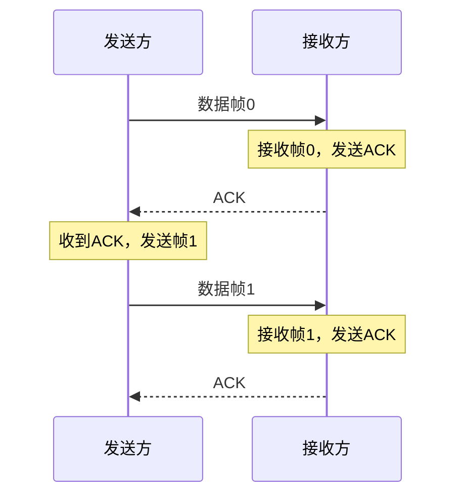

**停等协议的问题**：

- 链路利用率低：当帧的传播延迟远大于帧的传输时间时，发送方大部分时间都在等待

**信道利用率计算**：

设帧的传输时间为T，传播延迟为τ，则：

- 发送一帧所需总时间 = T + 2τ + T（确认帧传输时间）
- 信道利用率 = T / (T + 2τ)

当τ >> T时，信道利用率非常低。

**帧编号**：为了区分是新帧还是重传的帧，停等协议使用1位序号（0或1）。

**丢帧处理**：

```mermaid
%%{init: {'theme': 'dark', 'themeVariables': {
  'primaryColor': '#4CAF50',
  'primaryTextColor': '#FFFFFF',
  'primaryBorderColor': '#2E7D32',
  'lineColor': '#90CAF9',
  'secondaryColor': '#2196F3',
  'tertiaryColor': '#1E1E1E'
}}%%
flowchart TB
    subgraph 停等协议超时重传["停等协议超时重传"]
        A[发送帧0] --> B[启动定时器]
        B --> C{等待ACK}
        C -->|超时| D[重传帧0]
        D --> B
        C -->|收到ACK| E[停止定时器]
        E --> F[发送下一帧]
    end
    style 停等协议超时重传 fill:#1E1E1E,stroke:#4CAF50,stroke-width:2px
    style C fill:#FFC107,stroke:#FF8F00,color:#000000
    style D fill:#F44336,stroke:#C62828,color:#FFFFFF
    style F fill:#4CAF50,stroke:#2E7D32,color:#FFFFFF
```

### 3.4.3 滑动窗口协议

滑动窗口协议（Sliding Window Protocol）允许发送方在收到确认之前连续发送多个帧，从而提高信道利用率。

**发送窗口**：发送方可以连续发送的帧数范围。

**接收窗口**：接收方能够接受的帧序号范围。


**工作原理**：

1. 发送方维护一个发送窗口，窗口内的帧可以连续发送
2. 每发送一帧，窗口左边界前移；收到确认后，左边界前移
3. 接收方维护一个接收窗口，窗口内的帧可以接收
4. 按序接收帧，交付给上层后，窗口前移

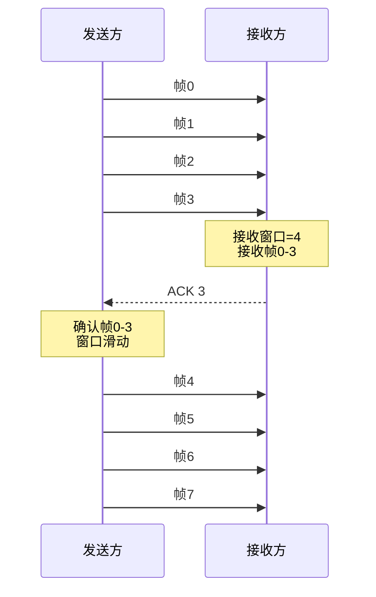

**滑动窗口的类型**：

1. **回退N帧协议（Go-Back-N）**：
   - 接收方只按序接收，丢弃乱序帧
   - 发送方需要重传丢失帧之后的所有帧
   - 实现简单，但效率较低

```mermaid
%%{init: {'theme': 'dark', 'themeVariables': {
  'primaryColor': '#4CAF50',
  'primaryTextColor': '#FFFFFF',
  'primaryBorderColor': '#2E7D32',
  'lineColor': '#90CAF9',
  'secondaryColor': '#2196F3',
  'tertiaryColor': '#1E1E1E'
}}%%
flowchart TB
    subgraph 回退N帧示例["回退N帧示例"]
        A[发送0,1,2,3,4] --> B[帧2丢失]
        B --> C[接收方丢弃2之后的帧]
        C --> D[发送方超时<br/>重传2,3,4]
    end
    style 回退N帧示例 fill:#1E1E1E,stroke:#4CAF50,stroke-width:2px
    style B fill:#F44336,stroke:#C62828,color:#FFFFFF
    style D fill:#FFC107,stroke:#FF8F00,color:#000000
```

2. **选择重传协议（Selective Repeat）**：
   - 接收方缓存乱序帧，只重传丢失的帧
   - 效率高，但实现复杂，需要较大的接收缓冲区


**窗口大小选择**：

窗口大小应该足够大，以充分利用信道带宽。对于传播延迟较大的链路（如卫星链路），需要较大的窗口。

公式：最小窗口大小 ≥ 2α + 1

其中，α = 传播延迟 / 帧传输时间

---

## 3.5 介质访问控制

### 3.5.1 随机访问协议

随机访问协议允许多个用户共享同一传输介质，且不进行集中控制。当多个用户同时发送数据时，会发生冲突（Collision），冲突后各用户随机退避后重试。

#### ALOHA协议

ALOHA是最早的随机接入协议，由夏威夷大学于1970年代开发。

**纯ALOHA（Pure ALOHA）**：

- 用户有数据就立即发送
- 如果发生冲突，发送站等待一段随机时间后重发
- 冲突窗口长度 = 2T（T为帧的传输时间）

```mermaid
%%{init: {'theme': 'dark', 'themeVariables': {
  'primaryColor': '#4CAF50',
  'primaryTextColor': '#FFFFFF',
  'primaryBorderColor': '#2E7D32',
  'lineColor': '#90CAF9',
  'secondaryColor': '#2196F3',
  'tertiaryColor': '#1E1E1E'
}}%%
flowchart TB
    subgraph 纯ALOHA["纯ALOHA"]
        A[用户A发送帧] --> B[帧传输时间=T]
        B --> C{冲突？}
        C -->|是| D[等待随机时间]
        D --> A
        C -->|否| E[发送成功]
    end
    style 纯ALOHA fill:#1E1E1E,stroke:#4CAF50,stroke-width:2px
    style C fill:#FFC107,stroke:#FF8F00,color:#000000
    style E fill:#4CAF50,stroke:#2E7D32,color:#FFFFFF
```

最大吞吐量约为18.5%（1/2e）。

**分槽ALOHA（Slotted ALOHA）**：

- 将时间划分为等长的时槽
- 用户只能在时槽开始时发送数据
- 冲突窗口长度 = T

最大吞吐量约为36.8%（1/e），是纯ALOHA的两倍。

#### CSMA/CD协议

CSMA/CD（Carrier Sense Multiple Access with Collision Detection，载波监听多路访问/冲突检测）是以太网使用的介质访问控制协议。

```mermaid
%%{init: {'theme': 'dark', 'themeVariables': {
  'primaryColor': '#4CAF50',
  'primaryTextColor': '#FFFFFF',
  'primaryBorderColor': '#2E7D32',
  'lineColor': '#90CAF9',
  'secondaryColor': '#2196F3',
  'tertiaryColor': '#1E1E1E'
}}%%
flowchart TB
    subgraph CSMACD工作流程["CSMA/CD工作流程"]
        A[监听信道] --> B{信道空闲？}
        B -->|是| C[发送数据]
        B -->|否| D[继续监听<br/>直到空闲]
        D --> B
        C --> E{检测冲突？}
        E -->|是| F[停止发送<br/>发送Jam信号]
        F --> G[等待随机时间]
        G --> A
        E -->|否| H[发送完成]
    end
    style CSMACD工作流程 fill:#1E1E1E,stroke:#4CAF50,stroke-width:2px
    style B fill:#FFC107,stroke:#FF8F00,color:#000000
    style E fill:#FFC107,stroke:#FF8F00,color:#000000
    style F fill:#F44336,stroke:#C62828,color:#FFFFFF
    style H fill:#4CAF50,stroke:#2E7D32,color:#FFFFFF
```

**CSMA/CD的工作过程**：

1. **载波监听（Carrier Sense）**：发送前先监听信道是否空闲
2. **多路访问（Multiple Access）**：多个站共享同一信道
3. **冲突检测（Collision Detection）**：发送时继续监听，检测是否与其他站冲突
4. **Jam信号**：检测到冲突后，发送32-48位Jam信号，通知所有站发生了冲突
5. **退避算法（Backoff Algorithm）**：采用截断二进制指数退避算法确定等待时间

```mermaid
%%{init: {'theme': 'dark', 'themeVariables': {
  'primaryColor': '#4CAF50',
  'primaryTextColor': '#FFFFFF',
  'primaryBorderColor': '#2E7D32',
  'lineColor': '#90CAF9',
  'secondaryColor': '#2196F3',
  'tertiaryColor': '#1E1E1E'
}}%%
flowchart TB
    subgraph CSMACD冲突处理["CSMA/CD冲突处理"]
        A[检测到冲突] --> B[立即停止发送]
        B --> C[发送Jam信号]
        C --> D[退避计数]
        D --> E{第几次冲突？}
        E -->|第i次| F[在0到2ⁱ-1中随机选一个数k]
        F --> G[等待k×512比特时间]
        G --> H[重新尝试发送]
    end
    style CSMACD冲突处理 fill:#1E1E1E,stroke:#4CAF50,stroke-width:2px
    style A fill:#F44336,stroke:#C62828,color:#FFFFFF
    style E fill:#FFC107,stroke:#FF8F00,color:#000000
    style H fill:#4CAF50,stroke:#2E7D32,color:#FFFFFF
```

**以太网最小帧长度**：

为保证CSMA/CD正常工作，以太网帧的最小长度不能小于64字节。这样才能确保在帧发送完毕之前能够检测到冲突。

最小帧长度 = 2τ × 数据传输速率

对于10Mbps以太网，最小帧长为64字节，传输时间为51.2μs；在2.5km的同轴电缆上，信号往返延迟约为25.6μs。

#### CSMA/CA协议

CSMA/CA（Carrier Sense Multiple Access with Collision Avoidance，载波监听多路访问/冲突避免）主要用于无线局域网（WLAN），如Wi-Fi。

由于无线设备难以实现冲突检测（接收信号强度远小于发送信号强度），所以采用冲突避免策略。

```mermaid
%%{init: {'theme': 'dark', 'themeVariables': {
  'primaryColor': '#4CAF50',
  'primaryTextColor': '#FFFFFF',
  'primaryBorderColor': '#2E7D32',
  'lineColor': '#90CAF9',
  'secondaryColor': '#2196F3',
  'tertiaryColor': '#1E1E1E'
}}%%
flowchart TB
    subgraph CSMACA工作流程["CSMA/CA工作流程"]
        A[监听信道] --> B{信道空闲？}
        B -->|空闲| C[等待DIFS时间]
        C --> D[生成随机退避时间]
        D --> E{退避计数器减到0？}
        E -->|是| F[发送数据帧]
        E -->|否| G{信道仍空闲？}
        G -->|是| H[继续倒计时]
        H --> E
        G -->|否| I[暂停倒计时<br/>等待信道空闲]
        I --> G
        B -->|忙| J[等待直到信道空闲]
        J --> C
    end
    style CSMACA工作流程 fill:#1E1E1E,stroke:#4CAF50,stroke-width:2px
    style B fill:#FFC107,stroke:#FF8F00,color:#000000
    style E fill:#FFC107,stroke:#FF8F00,color:#000000
    style G fill:#FFC107,stroke:#FF8F00,color:#000000
    style F fill:#4CAF50,stroke:#2E7D32,color:#FFFFFF
```

**Wi-Fi的帧间间隔（DIFS/ SIFS）**：

- **SIFS（Short InterFrame Space）**：短帧间间隔，用于高优先级帧（如ACK、CTS）
- **DIFS（DCF InterFrame Space）**：分布式协调功能帧间间隔，用于普通数据帧

### 3.5.2 令牌传递协议

令牌传递协议（Token Passing）是一种确定性的介质访问控制协议，使用一个特殊的令牌帧在环网上循环。

只有持有令牌的站才能发送数据，发送完成后释放令牌给下一个站。

```mermaid
%%{init: {'theme': 'dark', 'themeVariables': {
  'primaryColor': '#4CAF50',
  'primaryTextColor': '#FFFFFF',
  'primaryBorderColor': '#2E7D32',
  'lineColor': '#90CAF9',
  'secondaryColor': '#2196F3',
  'tertiaryColor': '#1E1E1E'
}}%%
flowchart TB
    subgraph 令牌环工作原理["令牌环工作原理"]
        A[令牌在环上循环] --> B[站A获得令牌]
        B --> C{有数据要发送？}
        C -->|是| D[发送数据<br/>将令牌改为数据帧]
        C -->|否| A
        D --> E[数据帧沿环传递]
        E --> F{目标是本站？}
        F -->|是| G[复制数据<br/>修改帧标志]
        F -->|否| H[转发给下一站]
        G --> I{数据帧返回发送站？}
        I -->|是| J[从环上移除数据帧]
        J --> K[生成新令牌]
        K --> A
    end
    style 令牌环工作原理 fill:#1E1E1E,stroke:#4CAF50,stroke-width:2px
    style C fill:#FFC107,stroke:#FF8F00,color:#000000
    style F fill:#FFC107,stroke:#FF8F00,color:#000000
    style I fill:#FFC107,stroke:#FF8F00,color:#000000
    style G fill:#2196F3,stroke:#1565C0,color:#FFFFFF
    style K fill:#4CAF50,stroke:#2E7D32,color:#FFFFFF
```

**令牌环的特点**：

- 优点：没有冲突，吞吐量大，适合实时性要求高的场景
- 缺点：令牌维护复杂，任一节点故障可能导致网络瘫痪

**令牌总线（Token Bus）**：物理上是总线拓扑，逻辑上是令牌环。

### 3.5.3 以太网工作原理

以太网（Ethernet）是目前最广泛的局域网技术，采用CSMA/CD协议。

```mermaid
%%{init: {'theme': 'dark', 'themeVariables': {
  'primaryColor': '#4CAF50',
  'primaryTextColor': '#FFFFFF',
  'primaryBorderColor': '#2E7D32',
  'lineColor': '#90CAF9',
  'secondaryColor': '#2196F3',
  'tertiaryColor': '#1E1E1E'
}}%%
flowchart TB
    subgraph 以太网帧处理流程["以太网帧处理流程"]
        A[收到数据帧] --> B[FCS校验]
        B --> C{FCS正确？}
        C -->|否| D[丢弃帧]
        C -->|是| E{目标MAC匹配？}
        E -->|否| F[检查是否是广播/多播？]
        F -->|否| D
        F -->|是| G[提交给上层协议]
        E -->|是| G
        G --> H[去掉帧头帧尾]
        H --> I[交付给网络层]
    end
    style 以太网帧处理流程 fill:#1E1E1E,stroke:#4CAF50,stroke-width:2px
    style C fill:#FFC107,stroke:#FF8F00,color:#000000
    style E fill:#FFC107,stroke:#FF8F00,color:#000000
    style F fill:#FFC107,stroke:#FF8F00,color:#000000
    style D fill:#F44336,stroke:#C62828,color:#FFFFFF
    style I fill:#4CAF50,stroke:#2E7D32,color:#FFFFFF
```

**以太网的演进**：

| 类型 | 速率 | 传输介质 | 最大网段长度 |
|------|------|----------|--------------|
| 10BASE-5 | 10Mbps | 粗同轴电缆 | 500m |
| 10BASE-2 | 10Mbps | 细同轴电缆 | 185m |
| 10BASE-T | 10Mbps | 双绞线 | 100m |
| 100BASE-TX | 100Mbps | 双绞线 | 100m |
| 1000BASE-T | 1Gbps | 双绞线 | 100m |
| 10GBASE-T | 10Gbps | 双绞线 | 100m |

---

## 3.6 数据链路层设备

### 3.6.1 网卡（NIC）的功能

网卡（Network Interface Card，NIC）是连接计算机与网络的接口设备，也称为网络适配器。

```mermaid
%%{init: {'theme': 'dark', 'themeVariables': {
  'primaryColor': '#4CAF50',
  'primaryTextColor': '#FFFFFF',
  'primaryBorderColor': '#2E7D32',
  'lineColor': '#90CAF9',
  'secondaryColor': '#2196F3',
  'tertiaryColor': '#1E1E1E'
}}%%
flowchart TB
    subgraph 网卡功能模块["网卡功能模块"]
        A[计算机系统] <--> B[网卡接口电路]
        B <--> C[缓冲区]
        C <--> D[帧处理单元]
        D <--> E[编码/解码器]
        E <--> F[物理接口]
    end
    style 网卡功能模块 fill:#1E1E1E,stroke:#4CAF50,stroke-width:2px
    style A fill:#2196F3,stroke:#1565C0,color:#FFFFFF
    style F fill:#2196F3,stroke:#1565C0,color:#FFFFFF
```

**网卡的主要功能**：

1. **数据封装/解封装**：将网络层数据封装成帧，或将接收到的帧解封装
2. **物理地址寻址**：使用MAC地址标识本机，每个网卡有全球唯一的MAC地址
3. **差错检测**：计算和验证FCS字段
4. **介质访问控制**：在共享介质网络中执行CSMA/CD协议
5. **数据缓存**：临时存储数据，补偿不同设备间的速度差异
6. **链路管理**：建立和维护链路连接

**网卡的类型**：

- 按传输速率：10Mbps、100Mbps、千兆网卡、10Gbps网卡等
- 按接口类型：PCI、PCIe、M.2等
- 按传输介质：RJ-45、光纤等

### 3.6.2 网桥（Bridge）

网桥是早期的互联设备，工作在数据链路层，用于连接两个或多个局域网段。

```mermaid
%%{init: {'theme': 'dark', 'themeVariables': {
  'primaryColor': '#4CAF50',
  'primaryTextColor': '#FFFFFF',
  'primaryBorderColor': '#2E7D32',
  'lineColor': '#90CAF9',
  'secondaryColor': '#2196F3',
  'tertiaryColor': '#1E1E1E'
}}%%
flowchart TB
    subgraph 网桥工作原理["网桥工作原理"]
        A[网段1] --> B[网桥端口1]
        B --> C[转发表]
        C --> D[网桥端口2]
        D --> E[网段2]
        F[广播帧] --> B
        B --> G{查转发表？}
        G -->|不在表中| H[泛洪到所有端口]
        G -->|在表中| D
    end
    style 网桥工作原理 fill:#1E1E1E,stroke:#4CAF50,stroke-width:2px
    style G fill:#FFC107,stroke:#FF8F00,color:#000000
    style H fill:#F44336,stroke:#C62828,color:#FFFFFF
    style F fill:#2196F3,stroke:#1565C0,color:#FFFFFF
```

**网桥的工作原理**：

1. **学习（Learning）**：网桥学习每个MAC地址对应的端口，构建转发表
2. **转发（Forwarding）**：根据转发表决定将帧从哪个端口转发
3. **泛洪（Flooding）**：对于未知目标地址的帧，向所有端口转发
4. **过滤（Filtering）**：阻止不必要的帧在网段间传输

**网桥与集线器的区别**：

| 特性 | 集线器 | 网桥 |
|------|--------|------|
| 工作层次 | 物理层 | 数据链路层 |
| 转发方式 | 复制到所有端口 | 根据MAC地址转发 |
| 冲突域 | 所有端口在同一冲突域 | 每个端口是独立的冲突域 |
| 智能程度 | 无 | 能学习MAC地址 |

### 3.6.3 交换机（Switch）的工作原理

交换机是现代局域网的核心设备，可以看作是多端口的网桥。

```mermaid
%%{init: {'theme': 'dark', 'themeVariables': {
  'primaryColor': '#4CAF50',
  'primaryTextColor': '#FFFFFF',
  'primaryBorderColor': '#2E7D32',
  'lineColor': '#90CAF9',
  'secondaryColor': '#2196F3',
  'tertiaryColor': '#1E1E1E'
}}%%
flowchart TB
    subgraph 交换机工作原理["交换机工作原理"]
        A[帧进入交换机] --> B[查找MAC地址表]
        B --> C{MAC地址已知？}
        C -->|是| D[从对应端口转发]
        C -->|否| E[泛洪到所有端口]
        D --> F[更新MAC地址表]
        E --> F
    end
    style 交换机工作原理 fill:#1E1E1E,stroke:#4CAF50,stroke-width:2px
    style C fill:#FFC107,stroke:#FF8F00,color:#000000
    style D fill:#4CAF50,stroke:#2E7D32,color:#FFFFFF
    style E fill:#F44336,stroke:#C62828,color:#FFFFFF
```

**交换机的核心功能**：

1. **MAC地址学习**：交换机自动学习每个MAC地址对应的端口

```mermaid
%%{init: {'theme': 'dark', 'themeVariables': {
  'primaryColor': '#4CAF50',
  'primaryTextColor': '#FFFFFF',
  'primaryBorderColor': '#2E7D32',
  'lineColor': '#90CAF9',
  'secondaryColor': '#2196F3',
  'tertiaryColor': '#1E1E1E'
}}%%
flowchart TB
    subgraph MAC地址学习过程["MAC地址学习过程"]
        A[PC1连接端口1<br/>发送帧到PC2] --> B[交换机记录<br/>MAC:PC1 Port:1]
        B --> C[帧目标MAC未知]
        C --> D[泛洪到所有端口（除端口1）]
        D --> E[PC2收到帧并响应]
        E --> F[交换机记录<br/>MAC:PC2 Port:2]
        F --> G[PC1收到响应帧<br/>通信建立]
        G --> H[MAC地址表已建立]
    end
    style MAC地址学习过程 fill:#1E1E1E,stroke:#4CAF50,stroke-width:2px
    style H fill:#4CAF50,stroke:#2E7D32,color:#FFFFFF
```

2. **帧转发**：基于MAC地址表进行确定性转发

3. **环路避免**：使用STP（Spanning Tree Protocol）协议避免交换环路

**交换机的交换方式**：

- **存储转发（Store-and-Forward）**：完整接收帧，检查FCS后再转发，延迟大但可靠性高
- **直通交换（Cut-Through）**：收到目标地址后立即转发，延迟小但可能转发错误帧
- **碎片隔离（Fragment-Free）**：检查帧的前64字节，确认不是冲突碎片后再转发

### 3.6.4 交换机与集线器的区别

```mermaid
%%{init: {'theme': 'dark', 'themeVariables': {
  'primaryColor': '#4CAF50',
  'primaryTextColor': '#FFFFFF',
  'primaryBorderColor': '#2E7D32',
  'lineColor': '#90CAF9',
  'secondaryColor': '#2196F3',
  'tertiaryColor': '#1E1E1E'
}}%%
flowchart TB
    subgraph 对比["对比"]
        A1[集线器] --> A2[物理层设备]
        A1 --> A3[广播式传输]
        A1 --> A4[所有设备共享带宽]
        A1 --> A5[同一冲突域]
        
        B1[交换机] --> B2[数据链路层设备]
        B1 --> B3[基于MAC地址转发]
        B1 --> B4[每个端口独立带宽]
        B1 --> B5[每个端口独立冲突域]
    end
    style 对比 fill:#1E1E1E,stroke:#4CAF50,stroke-width:2px
    style A1 fill:#F44336,stroke:#C62828,color:#FFFFFF
    style B1 fill:#4CAF50,stroke:#2E7D32,color:#FFFFFF
```

**带宽对比**：

假设有8台PC通过10Mbps链路连接到一台设备：

- 使用集线器：所有PC共享10Mbps带宽，任何时刻只有一对设备能通信
- 使用交换机：每个PC都有独立的10Mbps带宽，可以同时进行多对通信

| 特性 | 集线器 | 交换机 |
|------|--------|--------|
| 工作层次 | 物理层 | 数据链路层 |
| 转发依据 | 无（广播） | MAC地址 |
| 带宽效率 | 低（共享） | 高（独享） |
| 冲突域 | 整个网络 | 每个端口 |
| MAC地址表 | 无 | 有 |
| 价格 | 低 | 较高 |

---

## 3.7 工程示例：交换机配置与VLAN

### 3.7.1 交换机基本配置

以下是华为/H3C风格交换机的基本配置示例：

```bash
# 进入系统视图
<Huawei> system-view

# 配置交换机名称
[Huawei] sysname Core-Switch

# 创建VLAN
[Core-Switch] vlan 10
[Core-Switch-vlan10] description Engineering
[Core-Switch-vlan10] quit
[Core-Switch] vlan 20
[Core-Switch-vlan20] description Sales
[Core-Switch-vlan20] quit

# 进入接口视图
[Core-Switch] interface GigabitEthernet 0/0/1

# 配置接口速率和双工模式
[Core-Switch-GigabitEthernet0/0/1] speed 1000
[Core-Switch-GigabitEthernet0/0/1] duplex full

# 将接口分配给VLAN
[Core-Switch-GigabitEthernet0/0/1] port link-type access
[Core-Switch-GigabitEthernet0/0/1] port default vlan 10

# 配置管理接口（VLAN接口）
[Core-Switch] interface Vlanif 1
[Core-Switch-Vlanif1] ip address 192.168.1.254 255.255.255.0
[Core-Switch-Vlanif1] undo shutdown
[Core-Switch-Vlanif1] quit

# 保存配置
[Core-Switch] save
```

### 3.7.2 VLAN的创建与配置

VLAN（Virtual Local Area Network，虚拟局域网）是在逻辑上划分网络的技术，可以将同一物理交换机分成多个独立的广播域。

```mermaid
%%{init: {'theme': 'dark', 'themeVariables': {
  'primaryColor': '#4CAF50',
  'primaryTextColor': '#FFFFFF',
  'primaryBorderColor': '#2E7D32',
  'lineColor': '#90CAF9',
  'secondaryColor': '#2196F3',
  'tertiaryColor': '#1E1E1E'
}}%%
flowchart TB
    subgraph VLAN10["VLAN 10 工程部"]
        P1[PC1]
        P2[PC2]
    end
    subgraph VLAN20["VLAN 20 销售部"]
        P3[PC3]
        P4[PC4]
    end
    S[交换机] --> P1
    S --> P2
    S --> P3
    S --> P4
    style VLAN10 fill:#1E1E1E,stroke:#4CAF50,stroke-width:2px
    style VLAN20 fill:#1E1E1E,stroke:#2196F3,stroke-width:2px
    style P1 fill:#4CAF50,stroke:#2E7D32,color:#FFFFFF
    style P2 fill:#4CAF50,stroke:#2E7D32,color:#FFFFFF
    style P3 fill:#2196F3,stroke:#1565C0,color:#FFFFFF
    style P4 fill:#2196F3,stroke:#1565C0,color:#FFFFFF
    style S fill:#FFC107,stroke:#FF8F00,color:#000000
```

```bash
# 创建VLAN
[Switch] vlan batch 10 20 30

# 配置Access端口（连接终端设备）
[Switch] interface GigabitEthernet 0/0/1
[Switch-GigabitEthernet0/0/1] port link-type access
[Switch-GigabitEthernet0/0/1] port default vlan 10

[Switch] interface GigabitEthernet 0/0/2
[Switch-GigabitEthernet0/0/2] port link-type access
[Switch-GigabitEthernet0/0/2] port default vlan 10

[Switch] interface GigabitEthernet 0/0/3
[Switch-GigabitEthernet0/0/3] port link-type access
[Switch-GigabitEthernet0/0/3] port default vlan 20

[Switch] interface GigabitEthernet 0/0/4
[Switch-GigabitEthernet0/0/4] port link-type access
[Switch-GigabitEthernet0/0/4] port default vlan 20

# 配置Trunk端口（连接其他交换机或路由器）
[Switch] interface GigabitEthernet 0/0/24
[Switch-GigabitEthernet0/0/24] port link-type trunk
[Switch-GigabitEthernet0/0/24] port trunk allow-pass vlan 10 20
```

```mermaid
%%{init: {'theme': 'dark', 'themeVariables': {
  'primaryColor': '#4CAF50',
  'primaryTextColor': '#FFFFFF',
  'primaryBorderColor': '#2E7D32',
  'lineColor': '#90CAF9',
  'secondaryColor': '#2196F3',
  'tertiaryColor': '#1E1E1E'
}}%%
flowchart TB
    subgraph 交换机1["交换机1"]
        S1V10[VLAN10端口]
        S1V20[VLAN20端口]
    end
    subgraph 交换机2["交换机2"]
        S2V10[VLAN10端口]
        S2V20[VLAN20端口]
    end
    S1V10 <-.->|Trunk| S2V10
    S1V20 <-.->|Trunk| S2V20
    style 交换机1 fill:#1E1E1E,stroke:#4CAF50,stroke-width:2px
    style 交换机2 fill:#1E1E1E,stroke:#2196F3,stroke-width:2px
    style S1V10 fill:#4CAF50,stroke:#2E7D32,color:#FFFFFF
    style S2V10 fill:#4CAF50,stroke:#2E7D32,color:#FFFFFF
    style S1V20 fill:#2196F3,stroke:#1565C0,color:#FFFFFF
    style S2V20 fill:#2196F3,stroke:#1565C0,color:#FFFFFF
```

### 3.7.3 交换机端口安全设置

端口安全（Port Security）可以限制交换机端口允许学习的MAC地址数量，防止未授权设备接入。

```bash
# 配置端口安全
[Switch] interface GigabitEthernet 0/0/1

# 启用端口安全
[Switch-GigabitEthernet0/0/1] port-security enable

# 配置最大MAC地址数（默认为1）
[Switch-GigabitEthernet0/0/1] port-security max-mac-num 5

# 配置安全MAC地址的老化时间（单位：分钟）
[Switch-GigabitEthernet0/0/1] port-security aging-time 30

# 配置违规行为（protect/restrict/shutdown）
# protect：丢弃违规流量，不告警
# restrict：丢弃违规流量，发送告警（默认）
# shutdown：关闭端口
[Switch-GigabitEthernet0/0/1] port-security protect-action restrict

# 配置静态安全MAC地址表项
[Switch-GigabitEthernet0/0/1] port-security mac-address 5489-98EE-4B2C vlan 10
```

```bash
# 配置粘性MAC地址（Sticky MAC）
# 这种方式学习到的MAC地址会保存在配置文件中
[Switch-GigabitEthernet0/0/1] port-security mac-address sticky

# 查看端口安全配置
[Switch] display port-security interface GigabitEthernet 0/0/1

# 查看安全MAC地址表
[Switch] display mac-address security
```

**端口安全配置示例**：

```mermaid
%%{init: {'theme': 'dark', 'themeVariables': {
  'primaryColor': '#4CAF50',
  'primaryTextColor': '#FFFFFF',
  'primaryBorderColor': '#2E7D32',
  'lineColor': '#90CAF9',
  'secondaryColor': '#2196F3',
  'tertiaryColor': '#1E1E1E'
}}%%
flowchart TB
    subgraph 端口安全配置["端口安全配置"]
        A[启用端口安全] --> B[设置最大MAC数]
        B --> C[配置违规动作]
        C --> D{选择模式}
        D -->|protect| E[仅丢弃流量]
        D -->|restrict| F[丢弃+告警]
        D -->|shutdown| G[关闭端口]
    end
    style 端口安全配置 fill:#1E1E1E,stroke:#4CAF50,stroke-width:2px
    style D fill:#FFC107,stroke:#FF8F00,color:#000000
    style E fill:#4CAF50,stroke:#2E7D32,color:#FFFFFF
    style F fill:#FFC107,stroke:#FF8F00,color:#000000
    style G fill:#F44336,stroke:#C62828,color:#FFFFFF
```

**完整的端口安全配置示例**：

```bash
# 进入接口
[Switch] interface GigabitEthernet 0/0/5

# 配置为Access模式
[Switch-GigabitEthernet0/0/5] port link-type access

# 启用端口安全
[Switch-GigabitEthernet0/0/5] port-security enable

# 配置粘性学习
[Switch-GigabitEthernet0/0/5] port-security mac-address sticky

# 允许最多3个MAC地址
[Switch-GigabitEthernet0/0/5] port-security max-mac-num 3

# 绑定VLAN
[Switch-GigabitEthernet0/0/5] port default vlan 10

# 配置违规动作为restrict
[Switch-GigabitEthernet0/0/5] port-security protect-action restrict

# 查看配置
[Switch-GigabitEthernet0/0/5] display this
```

**常见问题排查**：

1. **端口突然进入shutdown状态**
   - 可能原因：接入了超过最大数量的MAC地址的设备
   - 解决方法：使用`shutdown`和`undo shutdown`命令重启端口，或增加允许的MAC地址数量

2. **用户无法上网**
   - 检查步骤：
     - 使用`display mac-address interface`查看MAC地址学习情况
     - 使用`display port-security interface`查看端口安全状态
     - 确认用户的MAC地址是否已被学习

3. **办公桌上换电脑后无法上网**
   - 这是端口安全机制的正常行为
   - 解决方案：使用`port-security mac-address sticky`并确保配置已保存，或联系网络管理员

---

## 本章小结

数据链路层是计算机网络体系结构中的关键层次，它在物理层提供的比特传输服务基础上，为网络层提供了可靠的数据传输服务。

本章主要知识点回顾：

1. **数据链路层功能**：帧定界、物理地址寻址、差错检测、流量控制、介质访问控制

2. **帧与帧定界**：掌握Ethernet II和IEEE 802.3帧结构，理解字符填充和位填充的原理

3. **差错控制**：理解奇偶校验的局限性，掌握CRC的检错原理，了解检错码与纠错码的区别

4. **流量控制**：理解停等协议和滑动窗口协议的工作原理

5. **介质访问控制**：掌握ALOHA、CSMA/CD、CSMA/CA的工作机制，理解令牌传递协议

6. **数据链路层设备**：理解网卡、网桥、交换机的工作原理和区别

7. **VLAN配置**：掌握VLAN的创建、端口分配和Trunk配置，理解端口安全设置

通过本章的学习，读者应该能够理解数据链路层的工作原理，并具备配置和管理二层交换网络的能力。
