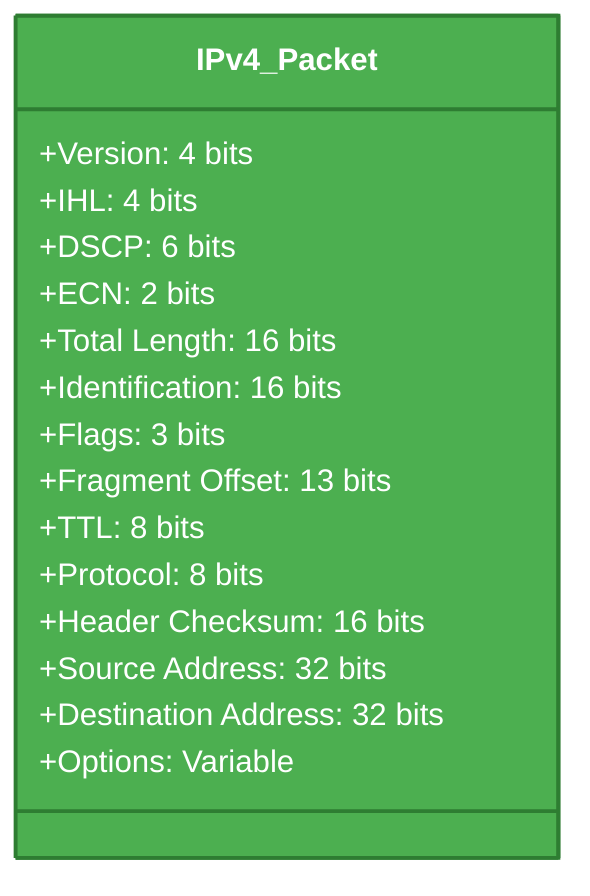
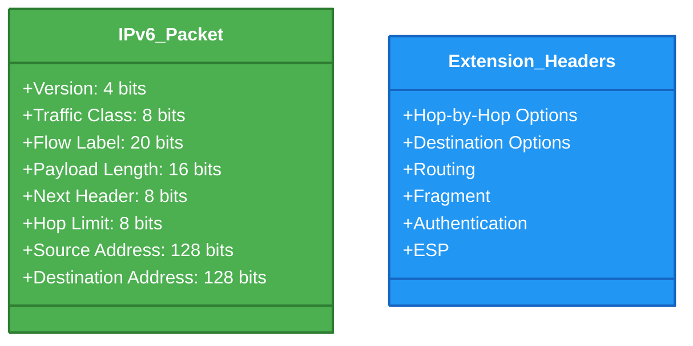
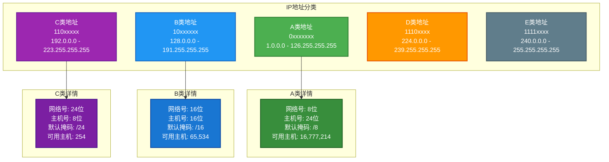
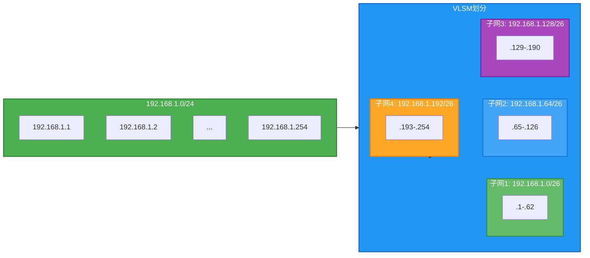
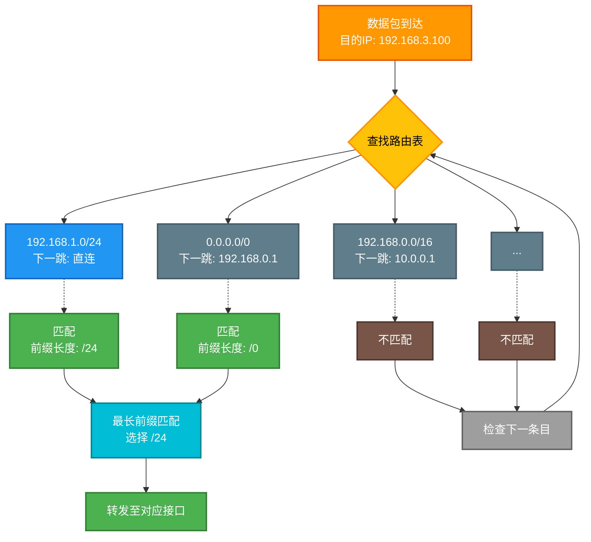
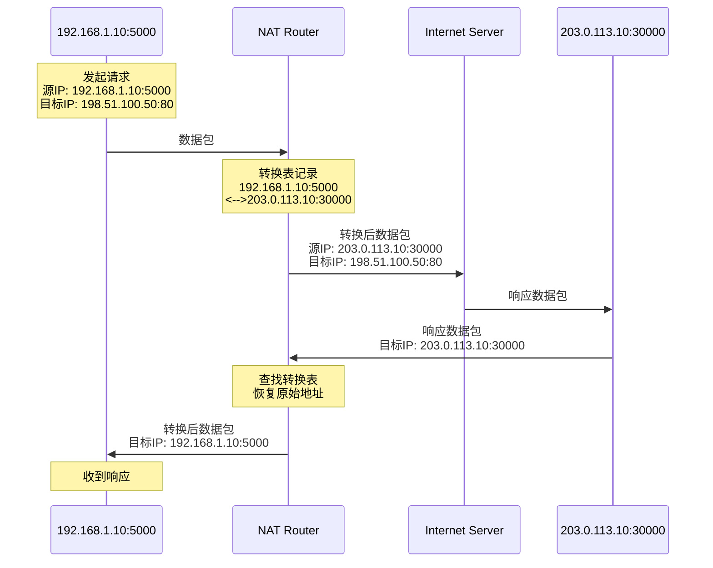
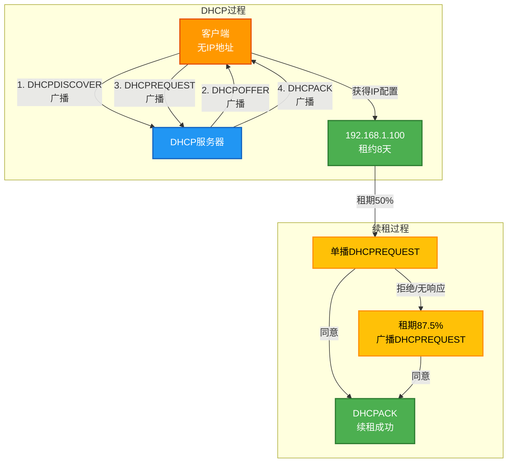
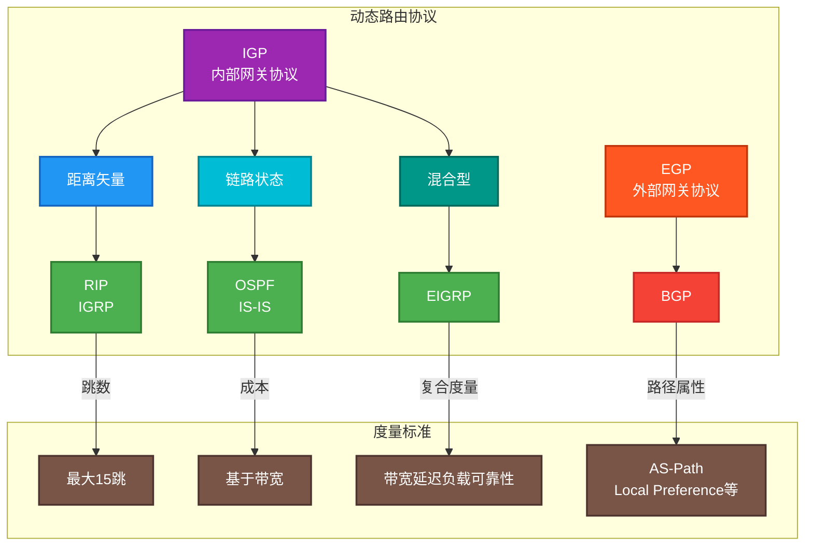
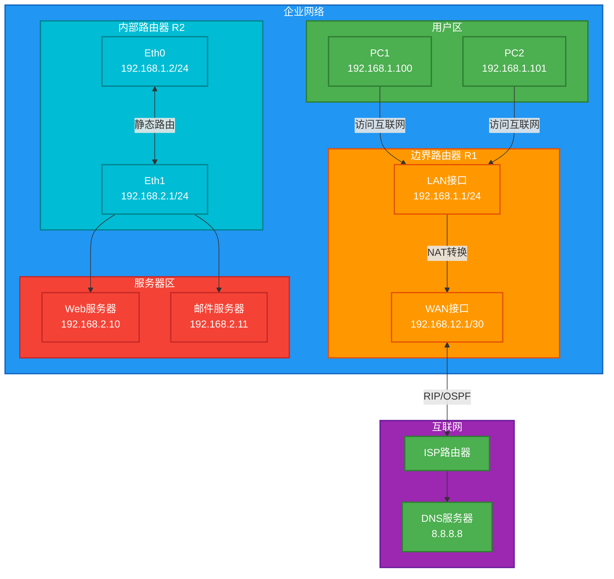

# 第四章：网络层

网络层（Network Layer）是OSI七层模型中的第三层，负责在不同的网络之间实现数据包的传输和路由选择。它是整个互联网架构的核心层，承载着端到端通信的关键功能。网络层的主要任务是将数据从源主机传输到目标主机，无论两者之间经过多少个中间节点，网络层都必须能够正确地寻址和路由数据包。本章将详细探讨网络层的功能、协议、数据包结构以及实际工程应用。

## 4.1 网络层概述

### 4.1.1 网络层的功能

网络层是计算机网络体系结构中最为关键的一层，它承担着多项核心功能，这些功能共同支撑起了整个互联网的运转。首先是**逻辑寻址功能**，网络层为每一个连接到网络的设备分配一个唯一的IP地址，这个地址就像现实世界中的门牌号一样，能够唯一标识网络中的每一台设备。通过IP地址，路由器能够判断数据包应该往哪个方向发送，以及如何最优化地到达目标设备。

其次是**路由选择功能**，这是网络层最核心的功能之一。当源主机需要向目标主机发送数据时，数据包可能会经过多个中间路由器。路由选择功能就是决定数据包从源到目的地的最佳路径的过程。路由器会根据路由表中的信息，结合各种路由算法和协议，动态地选择最优路径。这个过程需要考虑诸多因素，如跳数、带宽、延迟、负载等，以确保数据传输的效率和可靠性。

第三是**分组与重组功能**。由于不同的网络具有不同的最大传输单元（MTU），一个大的数据包可能需要被分割成多个小的分组进行传输，这就是分片。网络层负责在发送端将大的数据包进行分片，同时在接收端将分片重新组装成原始的数据包。这个过程对上层协议是透明的，上层协议不需要关心数据是否被分片。

第四是**拥塞控制功能**。当网络中的数据量超过其处理能力时，就会发生拥塞。网络层通过各种机制来检测和响应拥塞情况，例如通过ICMP源 quench报文通知发送端降低发送速率，或者通过路由器队列管理算法来缓解拥塞。

第五是**差错处理与诊断功能**。网络层通过ICMP协议实现各种差错报告和控制消息的传递，例如目标不可达、超时、参数问题等。ping命令和traceroute命令都是基于ICMP协议实现的网络诊断工具。

### 4.1.2 网络层提供的服务

网络层为上层协议（主要是传输层）提供两种类型的服务：数据报服务和虚电路服务。这两种服务方式有着本质的区别，适用于不同的应用场景。

**数据报服务（Datagram Service）** 是无连接的服务方式，每个数据包都被独立处理，就像邮寄包裹一样。每个数据包都携带着完整的目标地址信息，路由器根据每个数据包的目标地址独立进行路由选择。这意味着同一个会话中的不同数据包可能会经过不同的路径到达目的地，数据包到达的顺序也可能与发送顺序不同。Internet协议就是基于数据报服务的典型代表。数据报服务的优点是灵活性高、适应性强，即使某个路由器出现问题，数据包仍然可以通过其他路径到达目的地。但其缺点是数据包可能会丢失、重复或乱序，传输层协议需要负责处理这些问题。

**虚电路服务（Virtual Circuit Service）** 是面向连接的服务方式，在数据传输之前需要先建立一条逻辑连接。这就像打电话一样，在正式通话之前需要先拨号建立连接。所有的数据包都沿着同一条预先建立好的路径传输，所有数据包按序到达。X.25和帧中继等早期网络技术采用的就是虚电路服务。虚电路服务的优点是服务质量有保证，数据包按序到达，不需要网络层进行复杂的排序和差错控制。但其缺点是建立连接需要额外的开销，而且一旦某条链路出现故障，整个虚电路都需要重新建立。

### 4.1.3 无连接服务与面向连接服务

在网络层设计中，无连接服务和面向连接服务是两种根本不同的哲学理念，它们各有优缺点，适用于不同的网络环境和应用需求。

**无连接服务的核心思想是“尽最大努力交付”（Best-Effort Delivery）**。网络层不保证数据包一定能够到达目的地，也不保证数据包的顺序和完整性。这种设计使得网络层保持简单和高效，路由器不需要维护连接状态信息，每个数据包都可以独立处理。无连接服务的优势在于其强壮性和灵活性——即使网络中的某个节点或链路发生故障，路由器也能够通过动态路由选择找到替代路径，数据包仍然有可能到达目的地。Internet的蓬勃发展在很大程度上归功于这种简洁而强大的无连接服务模型。

**面向连接服务则强调服务的可靠性和可预测性**。在数据传输之前，通信双方需要通过三次握手或类似的机制建立一条可靠的连接。所有的数据包都沿着这条确定的路径传输，接收方按照发送顺序接收数据。如果发生丢包或错误，发送方会重传数据。这种服务模型使得上层协议可以假设数据按序、可靠地到达，大大简化了传输层的设计。但面向连接服务的代价是建立的连接会消耗网络资源，而且建立连接的过程本身也需要时间。

现代互联网主要采用无连接服务，但通过在传输层添加可靠性机制（如TCP的滑动窗口、重传、流量控制等）来弥补网络层的不足。这种分层设计的思想体现了“端到端原则”（End-to-End Principle），即网络的智能和复杂度应该放在网络的边缘而不是核心。这种设计使得Internet核心保持简单和高效，而复杂的功能留给端系统实现。

## 4.2 IPv4协议

### 4.2.1 IPv4数据包结构

IPv4（Internet Protocol version 4）是互联网最核心的协议之一，自1983年起开始部署，至今仍然是互联网的主要协议。IPv4数据包由两部分组成：头部（Header）和数据（Data Payload）。头部包含着路由和传输所需的所有控制信息，数据部分则是上层协议（通常是传输层的TCP或UDP）传来的数据。

IPv4数据包头部的标准长度为20字节（如果不包含选项字段），下面详细介绍各个字段的含义和作用：

```
 0                   1                   2                   3
 0 1 2 3 4 5 6 7 8 9 0 1 2 3 4 5 6 7 8 9 0 1 2 3 4 5 6 7 8 9 0 1
+-+-+-+-+-+-+-+-+-+-+-+-+-+-+-+-+-+-+-+-+-+-+-+-+-+-+-+-+-+-+-+
|Version|  IHL  |    DSCP   |ECN|         Total Length        |
+-+-+-+-+-+-+-+-+-+-+-+-+-+-+-+-+-+-+-+-+-+-+-+-+-+-+-+-+-+-+-+
|        Identification        |Flags|      Fragment Offset   |
+-+-+-+-+-+-+-+-+-+-+-+-+-+-+-+-+-+-+-+-+-+-+-+-+-+-+-+-+-+-+-+
|  Time to Live |    Protocol   |        Header Checksum     |
+-+-+-+-+-+-+-+-+-+-+-+-+-+-+-+-+-+-+-+-+-+-+-+-+-+-+-+-+-+-+-+
|                       Source Address                          |
+-+-+-+-+-+-+-+-+-+-+-+-+-+-+-+-+-+-+-+-+-+-+-+-+-+-+-+-+-+-+-+
|                    Destination Address                       |
+-+-+-+-+-+-+-+-+-+-+-+-+-+-+-+-+-+-+-+-+-+-+-+-+-+-+-+-+-+-+-+
|                    Options (if IHL > 5)                     |
+-+-+-+-+-+-+-+-+-+-+-+-+-+-+-+-+-+-+-+-+-+-+-+-+-+-+-+-+-+-+-+
```

以下是IPv4头部各字段的详细说明：

**版本（Version）**：占4位，表示IP协议的版本号。IPv4的版本号是4，这个字段让路由器能够识别数据包的协议版本，以便进行正确的处理。如果收到版本号为6的数据包，IPv4路由器知道这不是自己能处理的数据包。

**头部长度（IHL - Internet Header Length）**：占4位，表示IPv4头部的长度，单位是32位字（4字节）。最小值是5（5 × 4 = 20字节），最大值是15（15 × 4 = 60字节）。这个字段指出了头部后面选项字段的长度，如果没有选项则为20字节。

**区分服务字段（DSCP - Differentiated Services Code Point）**：占6位，用于实现服务质量（QoS）机制。这个字段允许不同的数据包获得不同的优先级，例如语音通话的数据包需要比普通网页数据更高的优先级，以保证通话质量。EF（DSCP 46）用于低延迟、低丢包率的紧急流量，如VoIP；AF（Assured Forwarding）用于不同级别的保证转发服务。

**显式拥塞通知（ECN - Explicit Congestion Notification）**：占2位，允许在不使用丢包的情况下向端系统通知网络拥塞状况。当路由器发生拥塞时，它可以将ECN字段设置为11，通知端系统降低发送速率，而不是简单地丢弃数据包。这是一种更优雅的拥塞控制机制。

**总长度（Total Length）**：占16位，表示整个IP数据包的长度，包括头部和数据，单位是字节。最大值为65535字节。理论上IPv4数据包可以长达65535字节，但实际网络中由于各种限制（如MTU），很少有数据包达到这个长度。

**标识（Identification）**：占16位，用于标识同一个数据包的分片。当一个大数据包被分片时，所有分片都有相同的标识号，接收端据此将分片重新组装。

**标志（Flags）**：占3位，用于控制分片行为。最低位是MF（More Fragments）标志位，值为1表示后面还有分片，值为0表示这是最后一个分片。中间位是DF（Don't Fragment）标志位，值为1表示不允许分片，值为0表示允许分片。如果目标主机收到一个不能分片且又无法传输的数据包，会返回ICMP错误报告。

**分片偏移（Fragment Offset）**：占13位，表示当前分片相对于原始数据包的偏移量，单位是8字节。这个字段用于在接收端重组分片数据包。

**生存时间（TTL - Time to Live）**：占8位，表示数据包在网络中的最大跳数。这是一个防止数据包在网络中无限循环的机制。每当数据包经过一个路由器，TTL值减1。当TTL值变为0时，路由器会丢弃该数据包，并向源主机发送ICMP超时报告。TTL的初始值通常是64或255，不同操作系统有不同的默认值。traceroute工具利用TTL字段来探测数据包经过的路径——它发送TTL从1开始递增的探测包，依次经过每一跳直到到达目标。

**协议（Protocol）**：占8位，表示IP数据包数据部分承载的高层协议类型。常见的值包括：1表示ICMP，6表示TCP，17表示UDP，89表示OSPF等。这个字段就像一个标签，告诉接收端的网络层应该把数据交给哪个上层协议处理。

**头部校验和（Header Checksum）**：占16位，用于检测IPv4头部在传输过程中是否发生错误。校验和计算范围仅限于IPv4头部，不包括数据部分。每当数据包经过一个路由器，TTL值改变，头部校验和就需要重新计算。这个字段的设计比较简单，但不能检测所有的错误，而且只保护头部不保护数据。

**源地址（Source Address）**：占32位，表示数据包发送者的IP地址。

**目标地址（Destination Address）**：占32位，表示数据包接收者的IP地址。

**选项（Options）**：这是一个可变长度的字段，长度必须是32位的整数倍。选项字段很少使用，常见的选项包括：记录路由（Record Route）让路由器记录自己的IP地址；时间戳（Timestamp）记录数据包经过每个路由器的时间；宽松源路由（Loose Source Route）指定数据包必须经过的路由器列表；严格源路由（Strict Source Route）指定数据包必须精确经过的路由器列表。

### 4.2.2 IPv4分片与重组

分片（Fragmentation）是IPv4协议解决不同网络MTU差异的重要机制。由于各种网络的物理特性不同，它们能够传输的最大数据包长度也不同。例如，以太网的标准MTU是1500字节，而某些广域网的MTU可能只有576字节甚至更小。当一个大的IP数据包需要穿越一个MTU较小的网络时，就必须进行分片处理。

IPv4的分片过程发生在路由器的出接口上。当路由器收到一个需要转发的大数据包时，它会检查该数据包是否设置了DF（Don't Fragment）标志。如果设置了DF标志且数据包长度超过了出接口的MTU，路由器会丢弃该数据包，并生成一个ICMP目的不可达（需要分片但DF置位）的错误消息返回给源主机。

分片的具体过程如下：首先，路由器根据MTU计算出可以传输的数据长度，通常是8字节的整数倍（这是因为分片偏移字段的单位就是8字节）。然后，路由器创建多个分片数据包，每个分片都有自己独立的IPv4头部，但共享原始数据包的标识号。第一个分片的偏移量为0，后续分片按照顺序增加。每个分片的MF标志位都设置为1，最后一个分片设置为0，表示分片序列的结束。

例如，假设要发送一个4000字节的数据包（包含20字节头部和3980字节数据），穿越一个MTU为1500字节的网络。那么可以分片的数据部分是1480字节（1500 - 20头部），需要分成3个分片：第一个分片包含0-1479字节的数据（1480字节），偏移量为0，MF=1；第二个分片包含1480-2959字节的数据（1480字节），偏移量为185（1480÷8），MF=1；第三个分片包含2960-3979字节的数据（1020字节），偏移量为370（2960÷8），MF=0。

IPv4的重组（Reassembly）过程发生在接收端，而不是中间路由器。这是一个重要的设计决策，因为如果在每个路由器都进行重组，那么经过多个不同MTU的网络时可能需要多次分片和重组，这会大大降低网络效率。将重组放在端点完成可以避免这个问题。接收端根据分片的标识号、偏移量和MF标志来重组原始数据。IPv4规范建议重组超时时间为60秒，如果在这个时间内没有收到所有分片，接收端会丢弃已收到的分片，并发送ICMP超时错误。

分片机制虽然解决了MTU差异的问题，但也带来了一些负面影响。首先，分片增加了路由器的处理负担，每个分片都需要独立的头部处理和转发决策。其次，分片降低了网络的可靠性——任何一个分片的丢失都意味着整个原始数据包需要重传。第三，分片可能被用于进行某些网络攻击，例如分片重叠攻击、分片隧道攻击等，这给网络安全带来了挑战。

现代网络越来越多地采用**路径MTU发现（Path MTU Discovery）**机制来避免分片。这个机制利用ICMP协议，让源主机在发送数据之前先探测整个路径上的最小MTU，然后按照这个MTU发送数据包，避免在传输过程中进行分片。路径MTU发现的工作过程是：源主机首先假设路径的MTU就是目标网络的MTU（或者是某个默认值），然后发送设置了DF标志的数据包。如果路径上的某个路由器发现数据包太大，它会返回ICMP目的不可达（需要分片但DF置位）的错误消息，错误消息中会包含该路由器出接口的MTU。源主机收到这个消息后，会减小发送的MTU并重试。这个过程持续进行，直到数据包能够顺利到达目标。

### 4.2.3 IPv4校验和

IPv4校验和（Checksum）是IPv4头部中的一个16位字段，用于检测头部在传输过程中是否发生错误。校验和是IPv4协议实现简单差错检测的重要机制，虽然它相对简单，但对于检测常见的传输错误非常有效。

IPv4校验和的计算遵循标准的求和取反算法。发送端在计算校验和之前，首先将校验和字段设置为0，然后对整个IPv4头部（包括校验和字段的0值）每16位进行一次求和。如果头部长度不是16位的整数倍，需要在末尾填充0使其成为16位的整数倍。求和可能产生溢出，这时需要将溢出的位加回到结果中（回卷操作）。最后，对求和结果取反码，就得到了校验和。

接收端在验证校验和时，也是对整个IPv4头部进行相同的求和运算，但这次校验和字段保留其原有值。如果头部在传输过程中没有发生错误，那么求和结果应该全是1（因为发送端的校验和是对求和结果取反得到的）。任何一位的错误都会导致求和结果不全为1，从而被检测出来。

IPv4校验和的一个显著特点是它在传输过程中需要频繁重新计算。每当数据包经过一个路由器时，TTL字段减1，这意味着校验和必须重新计算。这是因为校验和算法会将TTL的变化反映到校验和的变化上。这与其他一些使用校验和的协议（如TCP/UDP的校验和包括伪头部，TTL变化不影响校验和验证）不同。

虽然IPv4校验和能够检测出所有的单位错、双位错和奇数位错，但它不能检测出某些更复杂的错误模式。例如，如果头部的两个16位字都发生了错误，但错误模式恰好互补，校验和可能无法检测出这种错误。不过对于随机噪声错误，校验和的检测率还是相当高的。

现代网络中，链路层通常有自己的差错检测机制（如以太网的CRC校验），网络层的IPv4校验和被视为冗余的。但它仍然是一个有价值的多层保护机制，能够检测出链路层未能检测到的错误，特别是在数据通过不同类型的链路层协议传输时。

## 4.3 IPv6协议

### 4.3.1 IPv6的优势

IPv6（Internet Protocol version 6）是IPv4的下一代协议，被设计用来解决IPv4面临的诸多问题。IPv4在互联网发展初期被设计出来，当时只有少数研究人员使用互联网，32位地址空间似乎已经足够充裕。然而，随着互联网的爆炸式增长，IPv4地址枯竭的问题日益严峻。2011年2月3日，IANA（互联网号码分配局）将最后的IPv4地址块分配完毕，各地区互联网注册机构随后也相继耗尽地址池。

IPv6相对于IPv4具有多项显著优势。首先是**地址空间的大幅扩展**。IPv6采用128位地址，而IPv4只有32位。这意味着IPv6可以提供约3.4×10³⁸个地址，理论上可以为地球上的每一粒沙子分配一个IP地址。庞大的地址空间不仅解决了地址枯竭的问题，还为未来的物联网发展提供了充足的地址资源。

其次是**简化的报文头部结构**。IPv6头部去除了IPv4中许多不常用的字段（如IHL、标识、标志、分片偏移、头部校验和），并新增了一些有用的字段。这使得IPv6数据包的转发效率更高，路由器处理速度更快。IPv6头部的固定长度为40字节，相比IPv4的最小20字节（可变），虽然更长，但结构更规则、更简单。

第三是**内置的安全支持**。IPv6在协议设计时就将IPsec（IP Security）作为内置功能，而不是像IPv4那样作为可选扩展。IPsec提供了数据加密、完整性验证和身份认证等安全功能，为网络通信提供了更强的安全保障。虽然IPsec也可以用于IPv4，但其实现的一致性和普及程度不如IPv6。

第四是**更好的扩展性**。IPv6采用了扩展头部（Extension Headers）的设计，允许在基本头部之后添加多种类型的扩展头部来实现不同的功能，如分片、路由、认证、加密等。这种模块化的设计使得协议可以根据需要不断演进，而不需要修改基本协议本身。

第五是**支持自动配置和即插即用**。IPv6支持无状态地址自动配置（SLAAC），设备连接到网络后可以自动获取IP地址等配置信息，不需要 DHCP服务器的介入。这大大简化了网络管理和配置工作，尤其对于大型网络和移动设备非常有价值。

第六是**改善的QoS支持**。IPv6头部包含了流标签（Flow Label）字段，可以用来标识属于同一个数据流的所有数据包，从而为实时音视频等应用提供更好的服务质量保证。

第七是**消除NAT的需求**。由于IPv6拥有几乎无限的地址空间，不再需要像IPv4那样使用NAT来缓解地址短缺问题。NAT虽然暂时解决了地址问题，但也带来了复杂性、可靠性和安全性的挑战，IPv6使得网络可以回归端到端的透明性。

### 4.3.2 IPv6数据包结构

IPv6数据包由基本头部（Base Header）、扩展头部（Extension Headers）和上层协议数据（Upper Layer Data）三部分组成。这种分层的设计使得IPv6具有良好的扩展性和灵活性。

IPv6基本头部长度为固定的40字节，结构如下：

```
 0                   1                   2                   3
 0 1 2 3 4 5 6 7 8 9 0 1 2 3 4 5 6 7 8 9 0 1 2 3 4 5 6 7 8 9 0 1
+-+-+-+-+-+-+-+-+-+-+-+-+-+-+-+-+-+-+-+-+-+-+-+-+-+-+-+-+-+-+-+
|Version| Traffic Class |             Flow Label              |
+-+-+-+-+-+-+-+-+-+-+-+-+-+-+-+-+-+-+-+-+-+-+-+-+-+-+-+-+-+-+-+
|         Payload Length        |  Next Header  |   Hop Limit  |
+-+-+-+-+-+-+-+-+-+-+-+-+-+-+-+-+-+-+-+-+-+-+-+-+-+-+-+-+-+-+-+
+                                                               +
+                         Source Address                        |
+                                                               +
+                                                               +
+-+-+-+-+-+-+-+-+-+-+-+-+-+-+-+-+-+-+-+-+-+-+-+-+-+-+-+-+-+-+-+
+                                                               +
+                       Destination Address                     |
+                                                               +
+                                                               |
+-+-+-+-+-+-+-+-+-+-+-+-+-+-+-+-+-+-+-+-+-+-+-+-+-+-+-+-+-+-+-+
```

**版本（Version）**：占4位，IPv6的版本号是6。

**流量类别（Traffic Class）**：占8位，类似于IPv4的DSCP字段，用于区分不同类型的数据包，提供服务质量保证。

**流标签（Flow Label）**：占20位，用于标识同一个数据流的所有数据包。源节点可以为需要特殊处理的数据流分配一个流标签，中间节点可以根据流标签对数据包进行快速处理。这个字段为实时音视频等应用提供了有力的支持。

**负载长度（Payload Length）**：占16位，表示IPv6数据包负载的长度，包括扩展头部和上层协议数据，单位是字节。不包括基本头部本身的40字节。

**下一个头部（Next Header）**：占8位，类似于IPv4的协议字段。这个字段指示下一个头部的类型，可以是扩展头部（IPv6特有的），或者是上层协议（如TCP、UDP、ICMPv6）。最后一个下一个头字段指向上层协议数据。

**跳限制（Hop Limit）**：占8位，类似于IPv4的TTL字段。数据包每经过一个路由器该值减1，值为0时数据包被丢弃。

**源地址（Source Address）**：占128位，发送端的IPv6地址。

**目标地址（Destination Address）**：占128位，接收端的IPv6地址。

IPv6的扩展头部提供了额外的功能，目前定义的扩展头部有：

**逐跳选项头（Hop-by-Hop Options Header）**：值为0，包含仅需每跳处理的选项，如填充选项、Jumbogram选项（用于超大负载超过65535字节）、路由器警告等。

**目标选项头（Destination Options Header）**：值为60，包含仅需目标节点处理的选项。

**路由头（Routing Header）**：值为43，用于指定数据包必须经过的路由器列表，类似IPv4的源路由选项。IPv6的路由头支持更灵活的路由类型。

**分片头（Fragment Header）**：值为44，用于IPv6的分片处理。与IPv4不同，IPv6的分片只在源节点进行，不在中间路由器上进行，这简化了路由器的设计。

**认证头（Authentication Header, AH）**：值为51，用于IPsec的认证功能，提供数据完整性验证和身份认证。

**封装安全负载头（Encapsulating Security Payload, ESP）**：值为50，用于IPsec的加密功能，提供数据机密性和完整性保护。

**无下一个头部（No Next Header）**：值为59，表示这个头部之后没有其他头部或数据。

扩展头部按顺序排列，最后一个扩展头部的下一个头部字段指向上层协议。例如，一个使用分片和路由扩展头的IPv6数据包：基本头部 → 路由头 → 分片头 → TCP头部 → 应用数据。

### 4.3.3 IPv6地址表示方法

IPv6地址长达128位，如果像IPv4那样用点分十进制表示将会非常冗长。IPv6采用了一种更紧凑的表示方法：冒号十六进制表示法（Colon-Hexadecimal Notation）。

IPv6地址被划分为8个16位的段，每个段用4个十六进制数字表示，段与段之间用冒号分隔。例如，一个完整的IPv6地址如下：

```
2001:0db8:3a4e:0012:0000:0000:9c5a:ff35
```

为了进一步简化表示，IPv6地址还有一些特殊的简化规则：

**前导零省略**：每一段的 leading zeros（最前面的0）可以省略。例如，上面的地址中"0012"可以简化为"12"，"0000"可以简化为"0"。

**零段压缩**：连续的一个或多个全零段可以用一对冒号（::）替代。例如，上面地址中的两个"0000:0000"可以压缩为"::"。但注意，在一个地址中只能使用一次零段压缩，否则会产生歧义。

应用以上简化规则，上面的地址可以简化为：

```
2001:db8:3a4e:12::9c5a:ff35
```

**特殊地址**：

- ::1/128 是环回地址（Loopback Address），相当于IPv4的127.0.0.1，用于本地软件回环测试。
- ::/128 是未指定地址（Unspecified Address），表示地址未知或不存在，相当于IPv4的0.0.0.0。
- 2001:db8::/32 是文档示例地址，用于书籍、文档中的示例，不得在实际网络中使用。
- fe80::/10 是链路本地地址（Link-Local Address），仅在单个链路上有效，类似于IPv4的169.254.0.0/16地址。
- fc00::/7 是唯一本地地址（Unique Local Address），用于本地通信，类似于IPv4的私有地址。
- 2000::/3 是全球单播地址（Global Unicast Address），由IANA分配的公共互联网地址。

IPv6地址也可以带有前缀长度表示法，例如"2001:db8:3a4e::/48"表示一个/48前缀的地址块，前48位是"2001:db8:3a4e"，后面的80位可以分配给具体的主机。

### 4.3.4 IPv6地址类型

IPv6地址按照用途和特性可以分为三大类：单播地址（Unicast）、组播地址（Multicast）和任播地址（Anycast）。此外还有一些特殊地址。

**单播地址（Unicast）**用于标识一个唯一的网络接口，数据包发送到单播地址时，只会被该地址对应的唯一接口接收。单播地址是IPv6地址中最常用的类型，包括多种子类型：

**全球单播地址（Global Unicast Address）**是可在互联网上路由的公共地址，类似于IPv4的公网地址。目前分配的全球单播地址前缀是2000::/3。全球单播地址的结构通常为：n bits全球路由前缀 + m bits子网ID + (128-n-m) bits接口ID。例如，2001:db8:1234:5678::1/64，前64位2001:db8:1234:5678是前缀（其中2001:db8是全球路由前缀，1234是子网ID），后64位::1是接口ID。

**链路本地地址（Link-Local Address）**的前缀是fe80::/10，只在本地链路范围内有效，不能跨路由器转发。当IPv6接口启动时，会自动生成本链路本地地址，通常使用EUI-64格式从MAC地址派生。链路本地地址用于邻居发现、链路本地通信等，是IPv6网络正常运行所必需的。

**唯一本地地址（Unique Local Address）**的前缀是fc00::/7（分为fc00::/8和fd00::/8），用于本地通信，不会在互联网上路由。它类似于IPv4的私有地址（10.0.0.0/8、172.16.0.0/12、192.168.0.0/16），适用于内部网络使用。

**环回地址（Loopback Address）**是::1/128，用于本地软件回环测试，类似于IPv4的127.0.0.1。

**未指定地址（Unspecified Address）**是::/128，表示地址未知或缺失，类似于IPv4的0.0.0.0。

**组播地址（Multicast Address）**用于标识一组接口，数据包发送到组播地址时，该组内的所有接口都会接收。IPv6组播地址的前缀是ff00::/8。组播地址用于一对多的通信场景，如视频广播、路由协议邻接发现等。常见的组播地址包括：ff02::1 表示所有节点组播组，ff02::2 表示所有路由器组播组，ff02::1:ffxx:xxxx 是请求节点组播地址（用于邻居发现）等。

**任播地址（Anycast Address）**是从单播地址空间中分配的，格式上与单播地址没有区别。任播地址被分配给多个（通常属于不同节点的）接口，当数据包发送到任播地址时，会被路由到最近的拥有该地址的接口。这是一种负载均衡和容灾备份的技术，常用于DNS服务器、内容分发网络等场景。

IPv6不使用广播地址（Broadcast），这是与IPv4的一个显著区别。IPv4中的广播功能在IPv6中通过组播来实现。例如，IPv4的子网广播（发送到子网所有主机）对应IPv6的ff02::1（链路本地所有节点组播）。

## 4.4 IP地址与子网划分

### 4.4.1 IP地址分类

在IPv4协议中，IP地址是一个32位的二进制数，为了便于人类阅读和记忆，通常采用点分十进制表示法，将其划分为4个8位组，每组用0-255的十进制数表示。例如，192.168.1.1就是一个常见的IP地址。

最初，IPv4地址被划分为五类（A、B、C、D、E），这种分类方法被称为分类寻址（Classful Addressing）。分类寻址简化了早期互联网的地址分配和管理，但随着网络规模的增长，其局限性也越来越明显。

**A类地址**的第一个八位组最高位固定为0，地址范围是1.0.0.0到126.255.255.255（127.x.x.x保留用于环回测试）。A类地址的网络号占8位，主机号占24位，因此每个A类网络可以容纳约1677万个主机。A类地址的默认子网掩码是255.0.0.0（/8）。由于A类地址只有128个网络（实际上可分配的是126个），它们主要分配给大型机构。

**B类地址**的第一个八位组最高两位固定为10，地址范围是128.0.0.0到191.255.255.255。B类地址的网络号占16位，主机号占16位，每个B类网络可以容纳约65534台主机。B类地址的默认子网掩码是255.255.0.0（/16）。B类地址适用于中等规模的网络。

**C类地址**的第一个八位组最高三位固定为110，地址范围是192.0.0.0到223.255.255.255。C类地址的网络号占24位，主机号占8位，每个C类网络只能容纳254台主机。C类地址的默认子网掩码是255.255.255.0（/24）。C类地址适用于小型网络，是最常见的网络类型。

**D类地址**（组播地址）的前四位固定为1110，地址范围是224.0.0.0到239.255.255.255。D类地址没有网络号和主机号的划分，直接用于组播通信。常见的组播地址如224.0.0.1表示所有主机，224.0.0.2表示所有路由器。

**E类地址**的前四位固定为1111，地址范围是240.0.0.0到255.255.255.255。E类地址保留用于实验和未来扩展，不用于常规的单播通信。

下表总结了IP地址的分类：

| 类别 | 前缀 | 地址范围 | 网络数 | 每网络主机数 | 默认掩码 |
|------|------|----------|--------|--------------|----------|
| A    | 0    | 1.0.0.0-126.255.255.255 | 126 | 16,777,214 | 255.0.0.0 |
| B    | 10   | 128.0.0.0-191.255.255.255 | 16,384 | 65,534 | 255.255.0.0 |
| C    | 110  | 192.0.0.0-223.255.255.255 | 2,097,152 | 254 | 255.255.255.0 |
| D    | 1110 | 224.0.0.0-239.255.255.255 | - | - | - |
| E    | 1111 | 240.0.0.0-255.255.255.255 | - | - | - |

### 4.4.2 私有IP地址

随着互联网的飞速发展，IPv4地址枯竭的问题日益严峻。为了缓解这个问题，同时提高网络安全性，私有IP地址（Private IP Address）应运而生。私有IP地址是指在内部网络中使用的地址，这些地址不会在互联网上被路由，只能在本地网络（如企业、校园、家庭）内部使用。

RFC 1918定义了三个私有IP地址块：

**10.0.0.0/8**（10.0.0.0到10.255.255.255）：这是最大的私有地址块，提供了约1600万个私有IP地址，相当于一个完整的A类网络。整个10.0.0.0/8都可以被企业或组织作为内部网络使用。

**172.16.0.0/12**（172.16.0.0到172.31.255.255）：这是一个B类地址块，包含16个连续的C类大小的网络（172.16.0.0/16到172.31.0.0/16），共提供约100万个私有IP地址。

**192.168.0.0/16**（192.168.0.0到192.168.255.255）：这是一个C类地址块，包含256个C类网络（192.168.0.0/24到192.168.255.0/24），是最常用的私有地址块，一般家庭路由器就使用这个地址段。

私有IP地址的使用需要配合网络地址转换（NAT）技术。当内部网络的主机需要访问互联网时，路由器会将私有IP地址转换为公有IP地址（由ISP分配的公网地址）。这个转换过程使得多个内部主机可以共享少量的公网IP地址，有效缓解了IPv4地址短缺的问题。

除了私有IP地址，还有一些特殊用途的IP地址也需要了解：

- **169.254.0.0/16**：这是链路本地地址（Link-Local Address），当主机使用DHCP自动获取IP地址失败时，操作系统会自动分配一个这个范围的地址。这种情况下，主机只能与同一链路上其他配置了相同机制的设备通信，无法进行跨网段通信。

- **0.0.0.0/8**：这个地址块表示“本网络”，用于特殊用途。例如，0.0.0.0通常表示“本网络上的本主机”，在服务器监听时使用0.0.0.0表示监听所有网络接口。

- **127.0.0.0/8**：这是环回地址块，127.0.0.1是著名的环回地址。任何发送给127.x.x.x的数据包都会被环回到本机，相当于本地通信。

### 4.4.3 子网掩码与子网划分

子网划分（Subnetting）是将一个大的IP网络划分为多个较小的子网络的技术。在分类寻址中，每个A类、B类、C类网络都是一个独立的网段。但随着网络规模的增长，分类寻址的局限性变得明显——一个C类网络只能容纳254台主机，这对于大型组织来说远远不够；而一个B类网络可以容纳65000多台主机，但分配给小型组织又造成浪费。

子网划分通过借用主机号的一部分位作为子网号来解决这个问题。例如，一个B类网络（默认掩码是255.255.0.0或/16）可以借用8位主机号作为子网号，从而划分成254个子网（2⁸-2，减去全0和全1子网），每个子网有254台主机（2⁸-2）。这样，原本只能分配给一个组织的B类地址，就可以被划分成多个子网分配给不同的部门或建筑。

**子网掩码（Subnet Mask）**是用于区分IP地址中网络部分和主机部分的关键工具。子网掩码也是一个32位的数，与IP地址进行按位与运算，可以得到网络地址。子网掩码中值为1的位对应IP地址的网络部分（包括原有的网络号和子网号），值为0的位对应主机部分。

常见的子网掩码表示方法有两种：点分十进制表示法（如255.255.255.0）和CIDR斜线表示法（如/24）。/24表示前24位是网络部分，相当于255.255.255.0。CIDR表示法是目前最常用的方式，因为它更加简洁和灵活。

子网划分时需要遵循一些基本规则：

- 子网号的位数取决于需要的子网数量。n位子网号可以划分出2ⁿ个子网（不考虑全0和全1子网时为2ⁿ-2）。
- 主机号的位数决定了每个子网可以容纳的主机数量。m位主机号可以提供2ᵐ个IP地址，其中全0（子网地址）和全1（广播地址）不能分配给主机，所以可用主机数是2ᵐ-2。

例如，假设有一个192.168.1.0/24网络，需要划分成4个子网，每个子网至少需要50台主机。4个子网需要借用2位作为子网号（2²=4），原来C类网络有8位主机号，借用2位后还剩6位主机号，6位主机号可以提供2⁶=64个IP地址，可用主机数是64-2=62，满足50台主机的需求。划分后的子网掩码是/26（255.255.255.192），四个子网分别是：

- 子网1：192.168.1.0/26，可用地址范围192.168.1.1-192.168.1.62，广播地址192.168.1.63
- 子网2：192.168.1.64/26，可用地址范围192.168.1.65-192.168.1.126，广播地址192.168.1.127
- 子网3：192.168.1.128/26，可用地址范围192.168.1.129-192.168.1.190，广播地址192.168.1.191
- 子网4：192.168.1.192/26，可用地址范围192.168.1.193-192.168.1.254，广播地址192.168.1.255

子网划分的优势包括：提高IP地址利用率、减少网络流量（不同子网之间的通信需要通过路由器）、增强网络安全性（子网可以作为安全边界）、简化网络管理（将大网络划分为小网络便于管理）。

### 4.4.4 VLSM与CIDR

随着互联网规模的进一步扩大，分类寻址和简单子网划分的局限性日益明显。VLSM（Variable Length Subnet Mask，可变长子网掩码）和CIDR（Classless Inter-Domain Routing，无类别域间路由）的出现标志着寻址技术的重要变革。

**VLSM**是指在同一个网络（组织的网络）中使用不同长度的子网掩码。在传统的子网划分中，一个组织获得的网络地址块必须使用统一长度的子网掩码。但在实际应用中，不同的部门或子网可能需要不同数量的IP地址——一个拥有1000台主机的部门需要一个/22网络（1022个可用地址），而一个只有20台主机的部门只需要一个/27网络（30个可用地址）。如果使用固定长度的子网掩码，必然会造成大量IP地址浪费。

VLSM允许管理员根据每个子网的实际需求分配不同长度的子网掩码。例如，一个组织获得了一个192.168.0.0/16的地址块，可以这样进行VLSM划分：

- 总部需要5000台主机：使用/19（8190个地址）
- 分部A需要1000台主机：使用/22（1022个地址）
- 分部B需要500台主机：使用/23（510个地址）
- 各分部需要100台主机的子网：使用/25（126个地址）
- point-to-point链路只需要2个地址：使用/30（2个地址）

使用VLSM时，路由协议必须支持携带子网掩码信息，如OSPF、EIGRP、IS-IS、RIP version 2等。旧的RIP version 1等分类路由协议无法支持VLSM。

**CIDR**是1993年引入的一种新的IP地址分配和路由聚合方法，它完全摒弃了分类的概念。CIDR的核心思想是用“网络前缀”的概念替代传统的分类网络号，斜线后面的数字表示网络前缀的位数。例如，192.168.0.0/24表示网络前缀为24位，而不再区分这是C类网络。

CIDR的两个主要优势是**地址聚合**和**路由聚合**。地址聚合允许ISP根据客户实际需求分配适当大小的地址块，而不是受限于整类的A、B、C类地址。路由聚合则允许路由器将多个连续的较小网络汇总为一个较大的路由条目通告给其他路由器，大大减少了互联网核心路由器的路由表规模。如果没有CIDR和路由聚合，互联网骨干路由器的路由表将膨胀到无法管理的程度。

CIDR的另一个重要应用是**超网（Supernetting）**。超网是将多个连续的较小网络合并成一个较大网络的技术，这与子网划分正好相反。例如，将四个连续的C类网络（192.168.0.0/24、192.168.1.0/24、192.168.2.0/24、192.168.3.0/24）聚合为一个超网192.168.0.0/22。这个/22超网包含了从192.168.0.0到192.168.3.255的全部1024个IP地址。

### 4.4.5 超网聚合

超网聚合（Supernetting/Aggregation）是CIDR技术的重要组成部分，它允许将多个较小的网络合并为一个较大的网络块。这种技术主要有两个用途：一是在ISP层面，为客户分配更合适的地址空间；二是在路由器层面，减少路由表条目数量，提高路由效率。

超网聚合需要满足一个基本条件：要聚合的网络块必须是连续的，且网络块的边界必须是2的幂次方。例如，可以聚合4个C类网络（因为4=2²）、8个C类网络（8=2³）、16个C类网络，但不能聚合3个或5个C类网络。

超网聚合的计算方法与子网划分类似，但方向相反。假设需要将192.168.0.0/24、192.168.1.0/24、192.168.2.0/24、192.168.3.0/24聚合为一个超网：

首先，将这些地址转换为二进制：

- 192.168.0.0 = 11000000.10101000.00000000.00000000
- 192.168.1.0 = 11000000.10101000.00000001.00000000
- 192.168.2.0 = 11000000.10101000.00000010.00000000
- 192.168.3.0 = 11000000.10101000.00000011.00000000

观察可以发现，前22位是相同的（11000000.10101000.000000），第23、24位从00变化到11。因此，这四个网络的公共前缀是22位，超网是192.168.0.0/22。

在实际网络设计中，超网聚合是一种重要的优化手段。例如，一个ISP拥有2048个连续的C类地址（从194.0.0.0到195.255.255.255），在没有超网聚合的情况下，需要在互联网路由表中添加2048条路由条目。但如果使用超网聚合，只需要一条194.0.0.0/7路由就可以通告这个地址块，大大减小了全球互联网路由表的规模。

然而，超网聚合也有其局限性。如果聚合的路由覆盖了某些不存在的网络，可能会产生路由黑洞。例如，如果ISP的地址块中有某些地址已经被分配给其他组织，聚合后发往这些地址的数据包可能会被错误地发送到ISP而不是真正的目的地。因此，路由聚合需要谨慎规划，确保聚合的地址块与实际分配的地址相匹配。

## 4.5 路由与路由协议

### 4.5.1 路由的概念

路由（Routing）是网络层的核心功能，指的是确定数据包从源主机到目标主机所经过的路径的过程。这个过程涉及多个网络节点（主要是路由器），每个节点都需要根据数据包的目标地址做出转发决策。路由的实现依赖于路由表和路由算法。

路由与转发是两个密切相关但不同的概念。**转发（Forwarding）**是路由器将数据包从输入接口移动到适当的输出接口的过程，是微观的、数据包级别的行为。**路由（Routing）**是确定数据包从源到目的地所经过的路径的过程，是宏观的、路径级别的行为。路由协议负责构建和维护路由表，而转发则依赖路由表进行实际的数据包处理。

理解路由还需要了解几个关键概念：**跳数（Hop Count）**是指数据包从源到目的地需要经过的路由器数量，每经过一个路由器就是一跳。**跳数限制（TTL）**用于防止数据包在网络中无限循环。**路由度量（Metric）**是路由协议用来比较不同路径优劣的数值，不同的路由协议使用不同的度量标准——RIP使用跳数，OSPF使用成本（Cost），EIGRP使用复合度量等。

### 4.5.2 路由表结构

路由表（Routing Table）是路由器进行转发决策的核心数据结构。每个路由器都维护着一张路由表，其中存储着到达各种目标网络的路径信息。当路由器收到一个数据包时，它会查看数据包的目标IP地址，然后在路由表中查找最匹配的路由条目，决定将数据包从哪个接口发送出去。

典型的路由表条目包含以下信息：

- **目标网络（Destination Network）**：目的地的网络地址，通常用网络地址和子网掩码表示（如192.168.1.0/24）。
- **子网掩码（Subnet Mask）**：用于确定目标网络的网络部分。
- **下一跳地址（Next Hop）**：数据包需要发送到的下一个路由器的IP地址。
- **出接口（Outgoing Interface）**：路由器用于发送数据包的物理或逻辑接口。
- **度量值（Metric）**：到达目标网络的路由的优劣程度，不同路由协议有不同的度量标准。
- **路由来源（Route Source）**：该路由条目的来源，如直连网络（directly connected）、静态路由（static）或动态路由协议（OSPF、RIP等）。
- **管理距离（Administrative Distance）**：不同来源的路由的可信度，数值越小越优先。

路由表的查找遵循最长前缀匹配（Longest Prefix Match）原则。当有多个路由条目可以匹配目标地址时，路由器选择子网掩码最长（前缀最长）的那一条。这确保了数据包能够被发送到最具体网络。例如，目标地址192.168.1.100同时匹配192.168.0.0/16和192.168.1.0/24，路由器会选择/24的路由，因为它更具体。

路由器通常还有几种特殊路由：**默认路由（Default Route）**表示所有在其他路由表中没有匹配到的目标网络，下一跳通常是ISP路由器或出口路由器。在路由表中用0.0.0.0/0表示。**直连路由（Connected Route）**是路由器直接连接的网络，不需要经过其他路由器跳转。**静态路由（Static Route）**是管理员手动配置的路由，不会自动适应网络变化。

### 4.5.3 静态路由与默认路由

静态路由（Static Route）是由网络管理员手动配置到路由表中的路由信息。这种路由方式适用于小型、稳定的网络，或者用于控制特定的路由行为。静态路由的配置简单明了，但缺乏灵活性，无法自动适应网络拓扑的变化。

静态路由的优点包括：带宽占用为零（不需要像动态路由协议那样交换路由更新）；安全性高（攻击者无法通过发送路由更新来欺骗路由器）；路由可控（管理员完全掌握路由的选择）。

静态路由的缺点包括：不适合大型网络（配置和维护工作量太大）；无法自动适应网络故障（一旦路由路径上的某个节点出现问题，静态路由不会自动切换到备用路径）；配置复杂（网络拓扑变化时需要手动修改）。

静态路由的配置示例（以Cisco IOS为例）：

```
ip route 192.168.2.0 255.255.255.0 192.168.12.2
```

这条命令表示：到达192.168.2.0/24网络的下一跳是192.168.12.2。也可以指定出接口而非下一跳地址：

```
ip route 192.168.2.0 255.255.255.0 serial 0/0/1
```

**默认路由（Default Route）**是一种特殊的静态路由，用于匹配所有目标网络。当路由表中没有更具体的路由匹配时，数据包会按照默认路由转发。默认路由通常用于 Stub网络（只有一个出口的网络）或作为连接ISP的边界路由器的“网关”。

默认路由配置示例：

```
ip route 0.0.0.0 0.0.0.0 192.168.1.1
```

这条命令表示：所有目的地址都转发到192.168.1.1（即网关）。0.0.0.0 0.0.0.0表示一个“通配符”，匹配任何目标地址。

在小型家庭网络中，路由器通常只配置一条默认路由指向ISP，所有访问互联网的流量都通过这条路由转发到ISP的网关。

### 4.5.4 动态路由协议分类

动态路由协议（Dynamic Routing Protocol）是指路由器之间自动交换路由信息、能够自动适应网络拓扑变化的路由协议。与静态路由相比，动态路由更加灵活，适合中大型网络，但配置和维护相对复杂，且会消耗一定的网络带宽和路由器CPU资源。

动态路由协议可以按照多种方式分类：

**按照应用范围分类**：

- **IGP（Interior Gateway Protocol，内部网关协议）**：用于同一个自治系统（Autonomous System，AS）内部的路由，如RIP、OSPF、IS-IS、EIGRP等。
- **EGP（Exterior Gateway Protocol，外部网关协议）**：用于不同自治系统之间的路由，目前主要是BGP（Border Gateway Protocol）。

**按照路由算法分类**：

- **距离矢量协议（Distance-Vector）**：如RIP、IGRP。路由器只知道到达目标的距离（度量）和方向（下一跳），不知道整个网络的拓扑结构。距离矢量协议容易产生路由环路，但配置简单。
- **链路状态协议（Link-State）**：如OSPF、IS-IS。路由器保存整个网络的拓扑图（链路状态数据库），每个路由器独立计算最短路径。链路状态协议收敛快，不易产生路由环路，但消耗更多内存和CPU。
- **混合型协议（Hybrid）**：如EIGRP。结合了距离矢量和链路状态的优点，既能快速收敛，又能避免很多距离矢量的问题。

**按照度量标准分类**：

- **跳数**：RIP使用，限制最大15跳，适合小型网络。
- **带宽**：OSPF使用，以累积带宽的倒数作为度量。
- **延迟**：EIGRP使用，考虑接口延迟。
- **负载、可靠性**等：某些协议支持多度量复合。

**常见动态路由协议的特点**：

| 协议 | 类型 | 度量 | 最大跳数 | 适用范围 |
|------|------|------|----------|----------|
| RIP | 距离矢量 | 跳数 | 15 | 小型网络 |
| OSPF | 链路状态 | 成本 | 无限制 | 中大型网络 |
| EIGRP | 混合型 | 复合度量 | 100 | 中大型网络 |
| IS-IS | 链路状态 | 成本 | 无限制 | 运营商骨干网 |
| BGP | 路径矢量 | 路径属性 | 无限制 | 运营商/互联网 |

### 4.5.5 RIP协议原理

RIP（Routing Information Protocol，路由信息协议）是最古老且最简单的动态路由协议之一。虽然现在很少用于生产网络，但理解RIP对于学习路由协议原理仍然很有价值。

RIP使用跳数（Hop Count）作为路由的度量标准。每一个路由器算作一跳，最大跳数限制为15，16跳被认为是不可达。这意味着RIP只适用于小型网络（跳数限制），而且跳数没有考虑带宽因素（一个56Kbps的链路和一条1000Mbps的链路被认为具有相同的跳数）。

RIP的工作过程：

1. **初始化**：路由器启动时，发送请求报文（Request）给邻居路由器，请求完整路由表。
2. **路由更新**：RIP路由器每30秒发送一次完整的路由表更新（Response）给邻居，这被称为RIP的周期性更新。
3. **路由接收**：收到邻居的路由更新后，路由器将收到的路由条目添加到自己的路由表中（如果该路由比现有路由更好），或者更新现有路由的度量值。
4. **路由老化**：如果一条路由在180秒内没有收到更新，这条路由被标记为不可达（度量值设为16）。再过60秒（垃圾回收时间），该路由条目将被删除。

RIP有两种消息类型：**Request（请求）**用于向邻居请求路由信息；**Response（响应）**用于发送自己的路由表给邻居。

RIP的版本：RIP version 1（RIPv1）只支持分类网络，不支持VLSM和CIDR，且使用广播更新；RIP version 2（RIPv2）支持VLSM、CIDR和路由聚合，使用组播（224.0.0.9）发送更新。

RIP的主要问题是**路由环路**。由于距离矢量协议的特点，每个路由器只知道邻居告诉它的信息，如果网络拓扑发生变化，路由信息需要时间才能传播到整个网络，在这个过程中就可能产生环路。例如，如果网络某处发生故障，路由器A认为经过路由器B可以到达目标网络，而路由器B认为经过路由器A可以到达目标网络，数据包就会在两者之间来回转发，直到TTL耗尽。

RIP通过以下机制来减少路由环路：

- **水平分割（Split Horizon）**：不向路由条目的来源方向发送该路由条目。例如，如果路由器从接口X学到了一条路由，它不会向接口X发送这条路由。
- **毒性逆转（Poison Reverse）**：当某条路由变得不可达时，不是简单删除，而是将其度量设为16（无穷大）并广播，通知邻居该路由不可达。
- **触发更新（Triggered Update）**：当路由发生变化时，立即发送更新，而不等到下一个周期性更新。
- **抑制计时器（Hold-down Timer）**：当路由器收到一个路由不可达的信息后，会启动一个抑制计时器，在这个时间内不会接受同一路由的更好度量值，防止因错误信息而恢复路由。

### 4.5.6 OSPF协议原理

OSPF（Open Shortest Path First，开放最短路径优先）是一种链路状态路由协议，被广泛应用于企业网络和运营商网络。"Open"意味着它是公开的、不受某一厂商专有协议控制。OSPF是目前使用最广泛的IGP协议之一。

OSPF的核心特点是使用Dijkstra算法（最短路径优先算法）计算最短路径。运行OSPF的路由器保存整个网络的拓扑图（存储在链路状态数据库中），然后独立计算到每个网络的最短路径。这种设计使得OSPF具有快速收敛、不易产生路由环路的特点。

OSPF的几个核心概念：

**区域（Area）**：OSPF使用区域来层次化地组织网络。所有的OSPF网络必须有一个骨干区域（Area 0），其他区域必须与骨干区域直接相连（或通过虚链路连接）。区域的概念使得OSPF可以限制链路状态信息的传播范围，减少 LSDB（链路状态数据库）的大小，降低路由计算的复杂度。

**邻接（Adjacency）**：OSPF路由器与邻居建立邻接关系后，会互相交换LSA（链路状态通告）来同步链路状态数据库。不是所有邻居都会成为邻接关系——在点对点网络上，所有邻居都会成为邻接；但在广播多路访问网络（如以太网）上，会选举DR（Designated Router，指定路由器）和BDR（Backup Designated Router，备份指定路由器），只有DR和BDR与其他路由器建立邻接关系。

**链路状态通告（LSA）**：LSA是OSPF路由器之间交换的信息单元，用于描述网络拓扑。不同类型的LSA携带不同的信息：路由器LSA（Router LSA）描述路由器的接口和邻居；网络LSA（Network LSA）由DR生成，描述多路访问网络上的所有路由器；汇总LSA（Summary LSA）由ABR生成，描述区域间路由；AS外部LSA（AS External LSA）描述外部路由（通过重分发引入的路由）。

**OSPF的度量**：OSPF使用成本（Cost）作为路由度量。成本基于接口带宽计算，公式为：Cost = 100 Mbps / 接口带宽。成本越低表示路径越优。路径总成本是沿途所有出接口成本的总和。

**OSPF邻接关系建立过程**：

1. **Down状态**：没有收到任何OSPF报文。
2. **Init状态**：收到邻居的Hello报文，但邻居列表中没有自己的Router ID。
3. **Two-Way状态**：收到邻居的Hello报文，邻居列表中包含自己的Router ID。在广播网络上，这个状态会进行DR/BDR选举。
4. **ExStart状态**：邻居之间协商主从关系，确定DD（Database Description）报文的序列号。
5. **Exchange状态**：交换DD报文，描述LSDB中的LSA头部。
6. **Loading状态**：交换LSR（链路状态请求）和LSU（链路状态更新）报文，请求和接收完整的LSA。
7. **Full状态**：LSDB同步完成，邻接关系建立完成。

OSPF相对于RIP的优势包括：支持VLSM和CIDR；无跳数限制；使用带宽作为度量更合理；收敛速度快；触发更新，响应网络变化快；区域划分减少了 LSDB大小和路由计算开销。

### 4.5.7 BGP协议原理

BGP（Border Gateway Protocol，边界网关协议）是互联网的核心路由协议，负责不同自治系统（AS）之间的路由选择。BGP是目前唯一使用的EGP协议，被互联网工程任务组（IETF）定义为标准协议。

BGP与IGP协议（如RIP、OSPF）有着本质的不同。BGP不是为了找到最短路径或最快路径，而是为了找到**最佳路径**——这里的"最佳"涉及复杂的策略决策，可能包括政治、经济、安全等多方面因素。例如，一个国家可能不允许其互联网流量经过某些其他国家的网络，即使那条路径更短或更快。

**BGP的基本概念**：

- **自治系统（AS）**：一组在统一管理下的IP网络，由一个唯一的AS号（ASN）标识。ASN是一个16位或32位的数字，由IANA分配给全球的ISP和大型网络组织。
- **eBGP（External BGP）**：运行在不同AS之间的BGP，邻居位于不同的AS。
- **iBGP（Internal BGP）**：运行在同一AS内部的BGP，邻居位于同一个AS。iBGP用于在AS内部传递学到的外部路由。

**BGP的工作原理**：BGP使用TCP端口179建立连接，提供可靠的传输。BGP不像RIP或OSPF那样周期性地发送完整路由更新，而是只发送增量更新——当路由发生变化时，发送变化的路由。BGP会话建立时，会话双方交换完整的路由信息，之后只发送增量更新。

**BGP路径属性（Path Attributes）**：BGP使用多种属性来描述路由的特征和选择最佳路由：

- **AS-Path**：路由经过的AS序列，用于防止AS间的路由环路。
- **Next-Hop**：到达目标网络所需的下一跳地址。
- **Origin**：路由的来源（IGP、EGP或不完整）。
- **Local Preference**：本地优先级，用于AS内部的路由选择。
- **MED（Multi-Exit Discriminator）**：多出口分离器，告诉外部AS进入本AS的最佳入口。
- **Community**：团体属性，用于标记和过滤路由。

**BGP路由选择过程**：当有多条到达同一目标的路由时，BGP按照以下顺序选择最佳路由：

1. 最高Local Preference
2. 最短AS-Path
3. 最低Origin类型
4. 最低MED
5. 优先eBGP over iBGP
6. 最低IGP度量到Next-Hop
7. 最早建立的BGP会话
8. 最低Router ID

**BGP的安全问题**：BGP在设计时假设AS之间互相信任，因此存在一些安全漏洞。路由劫持、路由泄漏等问题时有发生。BGPSec和RPKI（Resource Public Key Infrastructure）是解决BGP安全问题的方案，正在逐步部署中。

## 4.6 NAT与DHCP

### 4.6.1 NAT的工作原理

NAT（Network Address Translation，网络地址转换）是一种在私有网络和公有网络之间转换IP地址的技术。NAT技术最初是为了解决IPv4地址枯竭的问题而设计的，它允许多个内部设备共享少量的公网IP地址访问互联网。

NAT的工作原理可以简单描述为：当内部网络的主机发送数据包到互联网时，NAT设备（通常是路由器）会将数据包的源IP地址从私有地址转换为公网地址。同时，NAT设备会记录这个转换关系，以便将返回的数据包正确地转换回私有地址并转发给源主机。

NAT有三种主要类型：

**静态NAT（Static NAT）**：在NAT设备上手动配置私有地址与公网地址的一对一映射关系。例如，将192.168.1.10永久映射到203.0.113.10。静态NAT的优点是外部设备可以直接访问内部服务器（如果配置了反向映射）；缺点是无法节省公网IP地址，每个内部主机都需要一个独立的公网地址。

**动态NAT（Dynamic NAT）**：NAT设备从一个公网地址池中动态分配公网地址给内部主机。例如，公网地址池有10个地址（203.0.113.10-19），当内部主机访问互联网时，NAT从中分配一个未使用的地址；会话结束后，该公网地址被回收。动态NAT比静态NAT更节省公网地址，但外部设备仍然无法主动访问内部主机（因为公网地址是动态分配的）。

**PAT（Port Address Translation，端口地址转换）**，也称为NAT overload或NAPT（Network Address Port Translation），是最常用的NAT形式。PAT使用不同的源端口号来区分不同的内部主机，将多个内部主机共享一个公网IP地址。例如，所有内部主机的访问互联网流量都被转换为203.0.113.10，但使用不同的源端口（如32768、32769等）。一个公网IP地址理论上可以支持65535个并发连接（减去保留端口）。

NAT的工作过程（以PAT为例）：

1. 内部主机192.168.1.10发起对外部服务器（198.51.100.50）的访问，源端口为5000。
2. NAT路由器收到数据包，将源IP替换为公网IP 203.0.113.10，源端口替换为分配的端口（如30000），并在转换表中记录这个映射关系。
3. NAT路由器将转换后的数据包发送到互联网。
4. 外部服务器返回数据包给NAT路由器（目标IP 203.0.113.10，目标端口30000）。
5. NAT路由器查找转换表，找到对应的内部主机192.168.1.10:5000，将数据包的目标IP和端口恢复，然后转发给内部主机。

NAT的优点包括：节省公网IP地址（解决IPv4地址枯竭问题）；提供一定的网络安全性（隐藏内部网络结构）；灵活性和简便性（配置简单，易于部署）。

NAT的缺点包括：破坏端到端透明性（某些P2P应用无法正常工作）；增加延迟（NAT转换需要处理时间）；配置复杂时可能影响性能；某些协议无法正确穿越NAT（如IPSec的某些模式）。

### 4.6.2 DHCP工作过程

DHCP（Dynamic Host Configuration Protocol，动态主机配置协议）是一种自动为网络设备分配IP地址等配置信息的协议。DHCP简化了网络管理，避免了手动配置IP地址可能出现的错误和冲突。

DHCP使用客户端-服务器模型，客户端是想要获取IP地址的设备（如电脑、手机），服务器是提供IP地址的DHCP服务器（通常是路由器或专门的DHCP服务器）。

**DHCP的分配方式**：

- **动态分配（Dynamic Allocation）**：DHCP服务器从一个地址池中临时分配IP地址给客户端，客户端只在租期内使用该地址，租期结束后地址被回收。
- **自动分配（Automatic Allocation）**：DHCP服务器永久分配一个IP地址给客户端，这个地址是从地址池中选择的，通常与客户端的MAC地址关联，使得每次都能获得相同的IP地址。
- **手动分配（Manual Allocation）**：管理员手动指定IP地址，DHCP服务器只是将这个预分配的地址传达给客户端。

**DHCP的四步租约过程（DHCPDISCOVER → DHCPOFFER → DHCPREQUEST → DHCPACK）**：

1. **DHCPDISCOVER（发现）**：DHCP客户端首次启动或无法使用已有地址时，广播发送DHCPDISCOVER报文，试图发现网络中的DHCP服务器。由于客户端此时没有IP地址，它使用0.0.0.0作为源地址，目标地址是255.255.255.255（广播）。报文还包括客户端的MAC地址和交易ID。

2. **DHCPOFFER（提供）**：网络中的DHCP服务器收到DHCPDISCOVER后，如果服务器有可分配的地址，它会广播DHCPOFFER报文作为响应。报文中包含可分配的IP地址、子网掩码、租约期限、DNS服务器地址、网关等配置信息，以及交易ID。服务器可能同时发送多个DHCPOFFER（如果有多个服务器）。

3. **DHCPREQUEST（请求）**：客户端可能收到一个或多个DHCPOFFER，它会选择其中一个（通常是第一个收到的），然后广播DHCPREQUEST报文，表明自己接受该服务器提供的地址。DHCPREQUEST中还包含客户端请求的IP地址（服务器在DHCPOFFER中提供的）。其他收到此请求的服务器会知道客户端选择了其他服务器提供的地址，它们会收回刚才预留的地址。

4. **DHCPACK（确认）**：被选中的服务器收到DHCPREQUEST后，发送DHCPACK报文进行确认。客户端收到DHCPACK后，就可以使用这个IP地址了。如果客户端之前已经有IP地址但租期到了，它会直接发送DHCPREQUEST请求续租。

**DHCP续租过程**：

DHCP分配的地址有租约期限，通常是几天到几周。客户端需要在租期过半时尝试续租：

1. 当租期过去一半时（T1），客户端向DHCP服务器单播DHCPREQUEST请求续租。
2. 如果服务器同意，回复DHCPACK（新的租约时间）。
3. 如果服务器不同意或客户端收不到响应，客户端继续使用原地址，直到租期过去87.5%（T2），此时客户端会广播DHCPREQUEST请求续租。
4. 如果租期到期但客户端没有成功续租，它必须停止使用该IP地址，重新开始四步过程。

**DHCP中继（DHCP Relay）**：

在大型网络中，DHCP服务器可能不在每个网段上。当DHCP客户端广播DHCPDISCOVER时，广播报文通常不能跨越路由器（除非配置了辅助地址或使用RFC 1542路由器）。DHCP中继（也称为IP Helper）解决了这个问题——在客户端所在网段的路由器上配置DHCP中继，路由器收到广播的DHCP请求后，会将其转发给指定DHCP服务器的UDP端口（通常是单播），并将请求的GIADDR（网关地址）字段设置为路由器的接口IP。DHCP服务器据此知道客户端所在的网段，从而分配正确的地址信息。

## 4.7 工程示例：路由器配置

### 4.7.1 路由器基本配置

本节通过实际案例展示路由器的配置方法。假设我们使用Cisco IOS路由器，常见的配置包括主机名、接口IP、密码等。

**网络拓扑说明**：假设有如下网络环境：

- 路由器R1连接两个网络：192.168.1.0/24（局域网）和192.168.12.0/30（连接ISP的广域网）
- 192.168.12.1是R1的WAN接口，192.168.12.2是ISP路由器的接口
- R1需要访问互联网，下一跳是ISP路由器

**基本配置步骤**：

1. **进入特权模式并配置主机名**：

```
Router> enable
Router# configure terminal
Router(config)# hostname R1
R1(config)#
```

2. **配置接口IP地址**：

```
R1(config)# interface gigabitethernet 0/0
R1(config-if)# description LAN Interface
R1(config-if)# ip address 192.168.1.1 255.255.255.0
R1(config-if)# no shutdown
R1(config-if)# exit

R1(config)# interface serial 0/0/0
R1(config-if)# description WAN Interface
R1(config-if)# ip address 192.168.12.1 255.255.255.252
R1(config-if)# clock rate 64000    # DCE端需要设置时钟频率
R1(config-if)# no shutdown
R1(config-if)# exit
```

3. **配置默认路由**（假设ISP路由器IP是192.168.12.2）：

```
R1(config)# ip route 0.0.0.0 0.0.0.0 192.168.12.2
```

4. **配置远程管理**（Telnet和SSH）：

```
R1(config)# line vty 0 4
R1(config-line)# password cisco123
R1(config-line)# login
R1(config-line)# transport input telnet ssh
R1(config-line)# exit

R1(config)# ip domain-name example.com
R1(config)# crypto key generate rsa modulus 2048
R1(config)# ip ssh version 2
```

5. **保存配置**：

```
R1# copy running-config startup-config
```

### 4.7.2 静态路由配置

继续上面的案例，假设R1连接了另一个内部网络192.168.2.0/24，该网络通过R2路由器连接，R2的IP是192.168.1.2。

**添加连接R2的路由**：

```
R1(config)# ip route 192.168.2.0 255.255.255.0 192.168.1.2
```

这条静态路由表示：到达192.168.2.0/24网络的流量，下一跳是192.168.1.2。

**配置浮动静态路由**（作为备份路由）：

```
R1(config)# ip route 192.168.2.0 255.255.255.0 192.168.1.2
R1(config)# ip route 192.168.2.0 255.255.255.0 192.168.1.3 10
```

第二条路由的管理距离是10（默认静态路由管理距离是1），当主路由不可用时，备份路由会生效。

### 4.7.3 RIP动态路由配置

RIP是配置最简单的动态路由协议，适用于小型网络。

**在R1上启用RIP**：

```
R1(config)# router rip
R1(config-router)# version 2
R1(config-router)# network 192.168.1.0
R1(config-router)# network 192.168.12.0
R1(config-router)# no auto-summary
R1(config-router)# end
```

**配置说明**：

- `version 2`：使用RIP第二版本，支持VLSM和CIDR
- `network 192.168.1.0`：宣告192.168.1.0网络，路由器会将在该网络上的接口启用RIP
- `no auto-summary`：关闭自动汇总，如果网络使用了子网划分，需要关闭自动汇总

**RIP passive-interface**（禁止在某个接口发送RIP更新）：

```
R1(config)# router rip
R1(config-router)# passive-interface gigabitethernet 0/0
```

这在LAN接口上很有用，因为LAN上的主机不需要接收RIP更新。

### 4.7.4 OSPF动态路由配置

OSPF适用于中大型网络，配置相对复杂但功能更强大。

**在R1上启用OSPF**：

```
R1(config)# router ospf 1
R1(config-router)# router-id 1.1.1.1
R1(config-router)# network 192.168.1.0 0.0.0.255 area 0
R1(config-router)# network 192.168.12.0 0.0.0.3 area 0
R1(config-router)# default-information originate
R1(config-router)# end
```

**配置说明**：

- `router ospf 1`：启用OSPF进程1（本地意义，多个OSPF进程互不影响）
- `router-id 1.1.1.1`：手动指定Router ID，通常使用loopback接口IP
- `network 192.168.1.0 0.0.0.255 area 0`：将LAN网络加入到骨干区域0，0.0.0.255是通配符掩码（与子网掩码相反）
- `default-information originate`：向OSPF区域注入默认路由

**OSPF Cost配置**：

```
R1(config)# interface serial 0/0/0
R1(config-if)# ip ospf cost 64
```

修改接口的OSPF Cost值，可以影响OSPF的路径选择。Cost值越低，路径越优。

### 4.7.5 NAT配置

NAT配置是边缘路由器的重要功能，用于让内部网络访问互联网。

**PAT配置（最常用的NAT形式）**：

```
R1(config)# access-list 1 permit 192.168.1.0 0.0.0.255
R1(config)# ip nat inside source list 1 interface serial 0/0/0 overload
R1(config)# interface gigabitethernet 0/0
R1(config-if)# ip nat inside
R1(config-if)# exit
R1(config)# interface serial 0/0/0
R1(config-if)# ip nat outside
R1(config-if)# end
```

**配置说明**：

- `access-list 1 permit 192.168.1.0 0.0.0.255`：定义要转换的内部网络（使用标准ACL）
- `ip nat inside source list 1 interface serial 0/0/0 overload`：将匹配ACL 1的流量PAT转换到serial 0/0/0接口，使用端口复用
- `ip nat inside`：指定内部接口
- `ip nat outside`：指定外部接口

**静态NAT配置**（将内部服务器发布到互联网）：

```
R1(config)# ip nat inside source static 192.168.1.10 203.0.113.10
```

这会将内部主机192.168.1.10永久映射到公网IP 203.0.113.10。

**动态NAT配置**：

```
R1(config)# ip nat pool NAT-POOL 203.0.113.10 203.0.113.20 netmask 255.255.255.0
R1(config)# access-list 2 permit 192.168.1.0 0.0.0.255
R1(config)# ip nat inside source list 2 pool NAT-POOL
```

**NAT验证命令**：

```
R1# show ip nat translations    # 查看NAT转换表
R1# show ip nat statistics      # 查看NAT统计信息
R1# clear ip nat translation *  # 清除NAT转换表
```

## 附录：Mermaid 图示

### IPv4 数据包结构图



### IPv6 数据包结构图



### IP地址分类图



### 子网划分示意图



### 路由表转发流程图



### NAT工作原理图



### DHCP工作流程图



### 路由协议分类图



### 工程拓扑图


