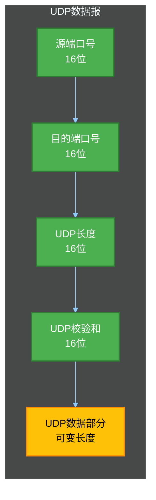
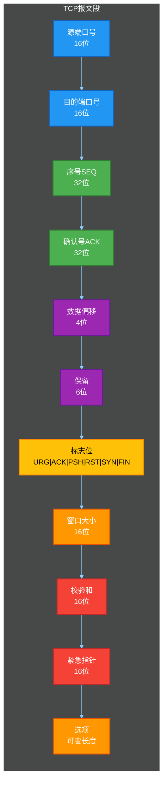
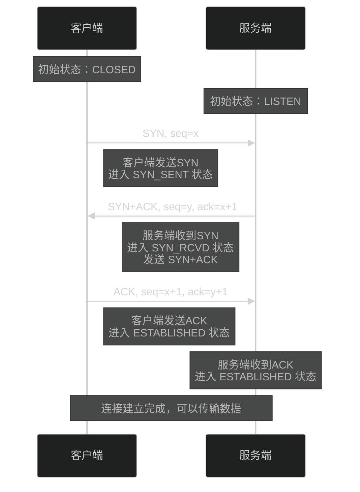
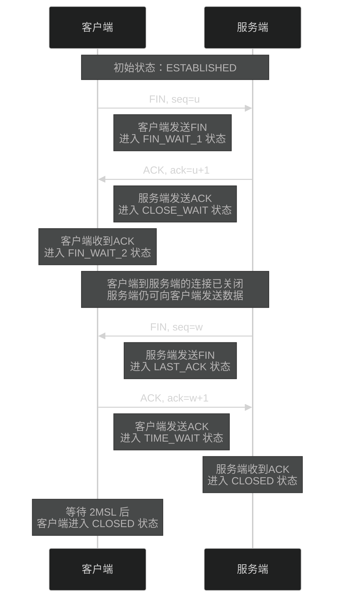
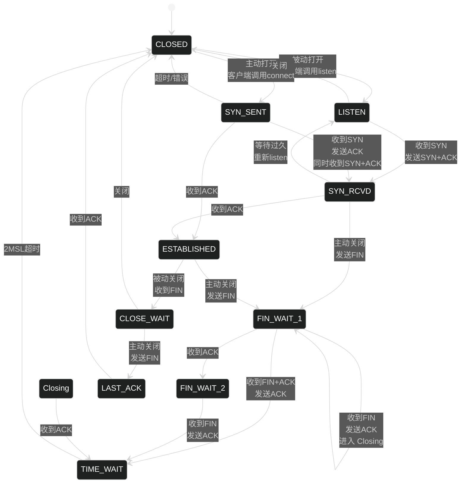
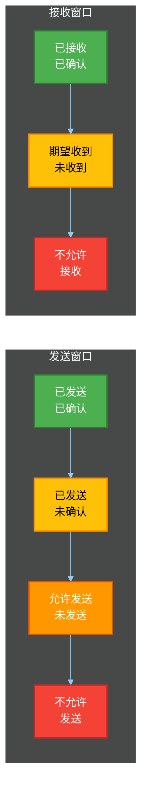
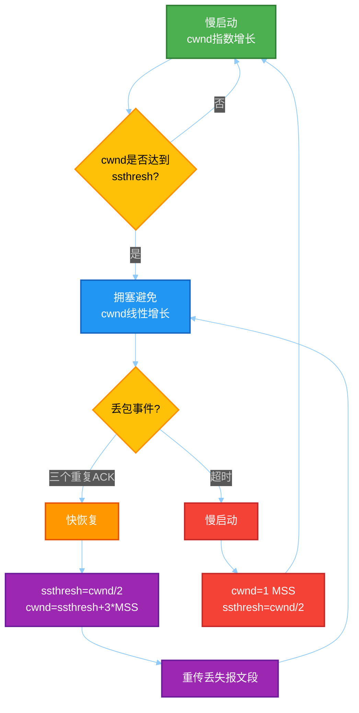

# 第五章：传输层

传输层是计算机网络体系结构中至关重要的一层，它位于网络层之上和应用层之下，负责提供端到端的通信服务。传输层使得网络编程成为可能，我们日常使用的网页浏览、电子邮件、即时通讯等应用，都离不开传输层协议的支持。本章将详细探讨传输层的核心概念、两种主要协议（UDP和TCP）的工作原理，以及Socket编程的实践方法。

## 5.1 传输层概述

### 5.1.1 传输层的功能

传输层承担着网络通信中承上启下的关键作用。它的主要功能可以从以下几个维度来理解。

**端到端通信服务**：传输层在源主机和目标主机之间提供逻辑通信服务，而网络层只能在主机之间提供路由和转发服务。打个比方，网络层就像是一个负责城市间快递运输的物流网络，它只知道把包裹从A城市运到B城市；而传输层则像是快递公司的客户服务部门，负责把包裹交到具体的收件人手中。

**进程间通信**：网络通信的最终目的是实现不同主机上应用程序之间的数据交换。传输层通过端口（Port）机制，实现了多个应用程序同时使用网络进行通信的需求。每一台主机可以同时运行多个网络应用，如浏览器、邮件客户端、即时通讯软件等，传输层能够区分这些应用的数据，把它们正确地交付给对应的应用程序。

**数据可靠性和完整性保证**：对于需要可靠传输的应用，传输层（尤其是TCP协议）提供了数据校验、重传机制、顺序保证等功能，确保数据能够完整、正确地从发送端传输到接收端。

**流量控制和拥塞控制**：传输层能够根据网络的实际情况和接收端的处理能力，动态调整数据的发送速率，避免发送过快导致数据丢失或接收端处理不过来。

**连接管理**：TCP协议需要建立连接、维护连接状态、释放连接，传输层负责这些连接管理工作，确保通信双方能够正确地建立和终止通信会话。

### 5.1.2 传输层与网络层的区别

理解传输层与网络层的区别，对于深入掌握计算机网络原理非常重要。下面从多个维度进行对比分析。

| 对比维度 | 网络层 | 传输层 |
|---------|--------|--------|
| 通信单元 | IP数据报（Datagram） | TCP报文段（Segment）/ UDP数据报（Datagram） |
| 通信模式 | 主机与主机之间 | 进程与进程之间 |
| 服务类型 | 无连接不可靠服务 | 面向连接可靠服务（TCP）或无连接不可靠服务（UDP） |
| 路由转发 | 实现路由选择和转发 | 不参与路由，仅负责端到端传输 |
| 寻址方式 | IP地址（32位或128位） | IP地址 + 端口号 |
| 状态管理 | 无状态 | 有状态（TCP有连接状态） |
| 典型协议 | IP、ICMP、ARP | TCP、UDP、RTP |

从功能定位来看，网络层关注的是如何把数据包从源主机路由到目标主机，它解决的是"如何走"的问题；而传输层关注的是如何把数据交付给具体的应用程序，它解决的是"交给谁"的问题。这两个层次相互配合，共同完成网络通信任务。

### 5.1.3 端口的概念与作用

端口（Port）是传输层协议为了区分同一台主机上不同应用程序而设计的逻辑标识。想象一下，一栋大楼（主机）有一个唯一的地址（IP地址），但大楼里有很多房间（应用程序），需要给每个房间分配一个房间号（端口号）才能准确送达物品。

端口号是一个16位的无符号整数，范围从0到65535。其中，0到1023被称为知名端口（Well-Known Ports），这些端口被广泛使用的系统服务所占用，如HTTP服务使用80端口、HTTPS使用443端口、SSH使用22端口等。端口1024到49151是注册端口（Registered Ports），可供用户程序或厂商注册使用。端口49152到65535是动态或私有端口（Dynamic/Private Ports），通常用于客户端连接时的临时端口分配。

在实际通信过程中，发送端会从本地分配一个临时端口用于通信，而接收端则通常使用知名端口来等待连接请求。例如，当你用浏览器访问一个网站时，浏览器会从本地分配一个临时端口（如54321）作为源端口，目标服务器的知名端口（如80）作为目的端口，这样服务器就能区分不同的浏览器会话并正确响应。

### 5.1.4 常用端口号

了解一些常用端口号对于网络编程和网络故障排查都非常有帮助。以下是一些最常见的端口号及其对应的服务。

HTTP（超文本传输协议）使用80端口，这是互联网上最广泛使用的端口之一。当你在浏览器中输入一个网址而没有指定端口时，浏览器默认会尝试连接目标服务器的80端口。HTTPS（HTTP over TLS/SSL）使用443端口，它在HTTP的基础上增加了加密层，保护数据在传输过程中的安全性。

FTP（文件传输协议）使用21端口来建立控制连接，数据传输则使用20端口。FTP是一种较老但仍然广泛使用的文件传输协议，支持上传、下载文件，以及在服务器上浏览目录结构。

SSH（安全外壳协议）使用22端口，它是Telnet的安全替代品，提供加密的远程登录会话。SMTP（简单邮件传输协议）使用25端口用于发送电子邮件，而POP3（邮局协议第三版）使用110端口、IMAP（互联网消息访问协议）使用143端口用于接收电子邮件。

DNS（域名系统）通常使用53端口，它负责把人类可读的域名（如www.example.com）转换为机器可读的IP地址。DNS同时支持TCP和UDP协议，通常查询使用UDP，但在响应数据较大或需要可靠传输时使用TCP。

MySQL数据库服务使用3306端口，PostgreSQL使用5432端口，Redis使用6379端口，MongoDB使用27017端口。这些数据库端口通常不应该直接暴露在公网上，而应该通过应用程序的访问来间接使用，以防止未授权访问。

### 5.1.5 套接字（Socket）的概念

套接字（Socket）是应用程序与网络协议栈之间的接口，它是进行网络编程的基础。通过套接字，应用程序能够发送和接收数据，就像操作文件一样简单。

从诞生背景来看，套接字最初由Berkeley大学在BSD Unix系统中实现，因此也被称为Berkeley套接字。后来成为了事实上的标准，几乎所有操作系统都支持套接字编程接口。套接字屏蔽了底层网络协议的复杂性，让程序员能够以统一的方式进行网络通信开发。

套接字由三个要素唯一确定：通信协议（TCP或UDP）、本地IP地址、本地端口号。对于面向连接的协议（如TCP），还需要远端IP地址和远端端口号来完整定义一个连接。想象一下，电话通话需要知道对方的电话号码（IP地址）和分机号（端口号），套接字就像是电话号码和分机号的组合。

在大多数编程语言中，套接字编程都遵循相似的模式：创建套接字、绑定地址（对于服务器端）、监听连接（对于TCP服务器）、接受连接、发送接收数据、关闭连接。掌握这个基本模式后，就能够快速上手各种语言的网络编程。

## 5.2 UDP协议

### 5.2.1 UDP的特点

UDP（用户数据报协议，User Datagram Protocol）是一种无连接的传输层协议，它提供最简单的端到端通信服务。UDP的设计哲学是：尽最大努力交付，但不保证可靠性和顺序性。

**无连接**：UDP在发送数据之前不需要建立连接。发送方只需要知道对方的IP地址和端口号，就可以直接发送数据报。这种特性使得UDP的通信效率非常高，省去了建立连接所需的往返时间。

**不可靠**：UDP不提供任何可靠性保证。数据报可能会丢失、重复或者乱序到达，UDP协议本身不会检测或修复这些问题。如果应用程序需要可靠性保证，必须在应用层自行实现。

**面向数据报**：UDP是面向数据报的协议。每个UDP数据报都是独立处理的，数据报之间没有任何关联。这与TCP的面向字节流形成了鲜明对比。发送端每发送一个UDP数据报，接收端就会完整地接收一个数据报。

**无流量控制和拥塞控制**：UDP协议本身不实施任何流量控制或拥塞控制机制。发送方可以以任意速率发送数据，这可能会导致数据丢失，但也为实时应用提供了灵活性。

**首部开销小**：UDP首部只有8个字节，相比TCP的20字节首部（还不包括选项字段），UDP更加轻量级。这个特点对于小数据量通信和高实时性要求的场景非常有价值。

### 5.2.2 UDP数据包结构

UDP数据报的结构非常简洁，整个数据报由两部分组成：UDP首部和UDP数据部分。首部只包含四个字段，每个字段都是16位（2字节）。

```
┌──────────────────┬──────────────────┐
│     源端口号      │     目的端口号     │
│      16位        │      16位         │
├──────────────────┼──────────────────┤
│    UDP长度       │    UDP校验和      │
│      16位        │      16位         │
├──────────────────┴──────────────────┤
│           UDP数据部分               │
│         （可变长度）                 │
└─────────────────────────────────────┘
```

**源端口号（Source Port）**：标识发送端应用程序的端口号。如果接收端不需要回复，可以使用0来表示。这是一个可选字段，在单向通信场景中非常有用。

**目的端口号（Destination Port）**：标识接收端应用程序的端口号。这是UDP数据报中最重要的字段之一，接收端的传输层根据这个字段把数据报交付给正确的应用程序。

**UDP长度（Length）**：整个UDP数据报的长度，包括首部和数据部分。最小值是8字节（只有首部，没有数据）。虽然这个字段是冗余的（可以从IP首部计算得出），但它仍然被保留以保证协议的一致性。

**UDP校验和（Checksum）**：用于检测UDP数据报在传输过程中是否发生了错误。这个字段是可选的，在IPv4中可以设置为0来表示未使用，但在IPv6中必须使用。校验和覆盖了UDP首部、数据部分，以及一个伪首部（包含源IP地址、目的IP地址、协议号、UDP长度等信息）。



### 5.2.3 UDP的适用场景

UDP因其简单和高效的特点，在多种场景中得到了广泛应用。了解这些场景有助于在实际开发中做出正确的协议选择。

**实时音视频通信**：视频通话、在线游戏、网络直播等场景对实时性要求很高，但对偶尔的数据丢失有较高的容忍度。在这些场景中，如果使用TCP，当网络拥塞导致数据包丢失时，TCP的重传机制会引入难以忍受的延迟；而使用UDP，即使偶尔丢包或乱序，也只会造成短暂的画面卡顿或声音断续，用户体验反而更好。WebRTC就是基于UDP协议实现实时通信的典型例子。

**DNS查询**：域名系统查询通常使用UDP协议。DNS查询的特点是请求数据量小（通常几十字节），而且需要快速响应。如果每次域名解析都要建立TCP连接，延迟将会显著增加。虽然DNS也支持TCP（用于区域传输和大响应），但在绝大多数情况下UDP都能满足需求。

**广播和多播通信**：UDP支持广播和多播，这使得它非常适合用于局域网发现和服务公告协议。例如，DHCP协议就使用广播UDP来动态获取IP地址，组播DNS（mDNS）用于局域网内的服务发现。

**简单请求-响应应用**：对于请求数据量小、响应也小、且不需要持久连接的应用，UDP是一个很好的选择。例如，某些物联网（IoT）协议和轻量级监控协议就采用UDP来减少通信开销。

**路由协议**：某些路由协议（如RIP距离向量路由协议）使用UDP来发送路由更新信息。这是因为路由表更新不需要TCP级别的可靠性，而且路由协议有自己的机制来处理数据丢失。

### 5.2.4 UDP的优点与局限

**UDP的主要优点**可以归纳为以下几点。首先是低延迟：由于不需要建立连接和复杂的可靠性机制，UDP的通信延迟显著低于TCP。在对实时性要求很高的场景中，这是一个关键优势。其次是低开销：UDP首部只有8字节，相比TCP的20字节首部（加上选项可能更长），对于小数据量传输来说，协议开销占比更小。第三是支持多播和广播：UDP原生支持一对多和多对多的通信模式，这在某些应用场景中非常有用。最后是更好的应用控制：UDP把可靠性控制完全交给应用程序，开发者可以根据应用需求灵活实现自己的重传、排序和流量控制策略。

**UDP的局限性**同样需要正视。由于没有内置的可靠性保证，应用程序需要自行处理数据丢失、重复、乱序等问题，这增加了开发复杂度。UDP容易受到放大攻击和欺骗攻击，因为无法验证数据来源的真实性。在网络拥塞时，UDP可能会加剧拥塞状况，因为它没有拥塞控制机制。对于需要大量数据传输且要求可靠交付的应用，TCP通常是更安全的选择。

## 5.3 TCP协议

### 5.3.1 TCP的特点

TCP（传输控制协议，Transmission Control Protocol）是互联网最重要的协议之一，它为应用程序提供了可靠的、面向连接的、端到端的字节流服务。TCP的设计目标是在不可靠的网络上实现可靠的传输。

**面向连接**：在数据传输之前，TCP需要在两端之间建立连接。这个过程需要三次握手，耗时约一个往返时间（RTT）。连接建立后，通信双方会维护连接状态，直到数据传输完成并显式关闭连接。这种模式类似于打电话，需要先拨号、接通后才能通话。

**可靠传输**：TCP通过多种机制确保数据可靠传输。数据被分割成合适的报文段，每个报文段都有序号，接收方会确认收到的数据，发送方会对未确认的数据进行重传。TCP使用累计确认机制，只要前面的数据没有全部到达，就不会确认后面的数据，这样可以保证数据的顺序性。如果网络状况不佳，TCP会自动调整重传策略。

**字节流服务**：TCP是一种字节流协议，不存在消息边界的概念。发送端写入100字节和写入两次50字节在接收端可能是不同的体验（取决于缓冲区的具体情况）。这与UDP的数据报模式形成对比，UDP的每个数据报都是独立的消息。这种特性使得TCP编程更灵活，但开发者也需要注意消息边界的处理。

**全双工通信**：TCP连接建立后，两端可以同时发送和接收数据，它们是平等的。这种全双工特性使得TCP能够高效地处理交互式应用，如SSH远程登录、即时通讯等。

**流量控制和拥塞控制**：TCP使用滑动窗口机制进行流量控制，确保发送方的发送速度不会超过接收方的处理能力。同时，TCP还实现了拥塞控制算法，在网络拥塞时主动降低发送速率，这有助于维护网络的整体稳定性。

### 5.3.2 TCP数据包结构

TCP报文段由TCP首部和TCP数据部分组成。TCP首部包含源端口、目的端口、序号、确认号、数据偏移、标志位、窗口大小、校验和、紧急指针以及可选的选项字段。

```
┌──────────────────┬──────────────────┐
│     源端口号      │     目的端口号     │
│      16位        │      16位         │
├──────────────────┼──────────────────┤
│              序号（SEQ）             │
│                32位                  │
├──────────────────────────────────────┤
│           确认号（ACK）               │
│                32位                  │
├────────┬────────┬────────────────────┤
│数据偏移 │标志位  │      窗口大小       │
│ 4位    │ 6位    │      16位          │
├────────┴────────┴────────────────────┤
│       TCP校验和       │   紧急指针      │
│         16位         │     16位       │
├──────────────────────────────────────┤
│           选项（可变长度）             │
└──────────────────────────────────────┘
```

**源端口号和目的端口号**：与UDP类似，用于标识发送和接收应用程序。

**序号（Sequence Number）**：32位字段，表示本报文段中数据的第一个字节在字节流中的编号。当建立连接时，会选择一个初始序号（ISN），后续所有字节的序号都基于这个初始值计算。

**确认号（Acknowledgment Number）**：32位字段，表示期望收到的下一个字节的序号。当ACK标志位被设置时，确认号才有效。在实际传输中，确认号表示"已成功收到该序号之前的所有数据"。

**数据偏移（Data Offset）**：4位字段，表示TCP首部的长度，以32位字为单位。由于选项字段长度可变，数据偏移字段指明了数据的起始位置。最小值是5（20字节），最大值是15（60字节）。

**保留位（Reserved）**：6位字段，保留供将来使用，目前必须设置为0。

**控制标志位（Flags）**：6位字段，每位都有特定的含义。URG表示紧急指针有效，ACK表示确认号有效，PSH表示要求接收方立即将数据推送给应用层，RST表示重置连接，SYN用于同步序号（建立连接时使用），FIN表示发送方已结束发送（关闭连接时使用）。

**窗口大小（Window Size）**：16位字段，表示发送方当前能够接收的字节数。这是TCP流量控制的核心机制，接收方通过通告窗口大小来控制发送方的发送速率。

**校验和（Checksum）**：16位字段，与UDP类似，TCP校验和也是必选项，覆盖了TCP首部、数据部分和伪首部。

**紧急指针（Urgent Pointer）**：16位字段，只有在URG标志位被设置时才有意义，指向紧急数据的最后一个字节的序号。

**选项（Options）**：可变长度字段，用于协商连接参数和传递扩展信息。常见的选项包括最大报文段长度（MSS）、窗口扩大因子、时间戳等。选项必须以32位字为单位对齐，不足的部分用0填充。



### 5.3.3 TCP的可靠传输机制

TCP的可靠传输机制是其核心价值所在，它通过多种技术的协同工作，在不可靠的网络上实现了可靠的数据传输。

**序号与确认机制**：每个TCP报文段都有一个序号，表示该报文段载荷数据的第一个字节在字节流中的位置。接收方收到数据后会发送确认报文（ACK），表明已成功接收到的数据序号。TCP使用累计确认机制，即确认号表示期望收到的下一个字节序号，这同时也确认了该序号之前的所有数据都已正确接收。

**超时重传**：当发送方发送一个报文段后，会启动一个定时器等待确认。如果在超时时间内没有收到确认，发送方会认为该报文段丢失，并重新发送这个报文段。TCP动态计算超时重传时间（RTO），通常基于往返时间（RTT）的测量来计算，使用指数加权移动平均算法来适应网络条件的变化。

**快速重传**：当接收方收到一个乱序的报文段时，它会立即发送对上一个正确接收的报文段的重复确认。例如，接收方期望收到序号1000的数据，却收到了1100的数据，它会立即发送对999及之前数据的确认。发送方收到连续三个相同的确认后，就会在超时计时器到期之前重传丢失的报文段，这就是快速重传机制。

**数据校验与完整性**：TCP校验和覆盖了TCP首部、数据部分和伪首部，能够检测出传输过程中的任何单比特错误。当校验和失败时，接收方会丢弃该报文段，这会触发发送方的重传。

**连接建立时的同步（SYN）**：在连接建立时，双方会交换初始序号（ISN），这个同步过程确保了双方都记住了已接收和已发送的数据量，为可靠传输奠定了基础。

### 5.3.4 TCP的差错控制

TCP的差错控制机制确保数据能够正确、完整、有序地从发送端传输到接收端。差错控制主要包括错误检测、错误纠正和重复检测三个方面。

**错误检测**：TCP使用校验和来检测数据在传输过程中的错误。校验和采用16位的补码求和计算，覆盖了伪首部、TCP首部和TCP数据部分。接收方在收到报文段后计算校验和，如果与报文段中的校验和不同，则认为数据出错，会丢弃该报文段并等待重传。

**错误纠正**：TCP主要通过重传来纠正传输错误。当报文段丢失或被检测出错误时，发送方会重新发送数据。为了更好地估计重传超时时间，TCP使用Jacobson算法计算RTT和RTO：

```
RTT = (1 - α) × 旧RTT + α × 新样本RTT
RTO = β × RTT
```

其中α通常取0.125，β通常取2。较新的算法还考虑了RTT的方差，而不仅仅是均值。

**重复检测**：当网络出现拥塞或延迟时，同一个报文段可能被多次发送。TCP通过序号来检测重复报文段，接收方会根据序号丢弃已经处理过的重复报文，只确认最后一个副本。

**选择确认（SACK）**：TCP的基本确认机制是累计确认，这可能导致效率问题。当接收到的数据出现较大间隙时，发送方可能需要重传大量已经成功接收的数据。SACK（Selective Acknowledgment）选项允许接收方告诉发送方哪些数据已经收到，这样发送方只需要重传真正丢失的数据。

## 5.4 TCP连接管理

### 5.4.1 三次握手过程与原因

TCP使用三次握手（Three-Way Handshake）来建立连接。三次握手的目的是同步连接双方的序列号、交换窗口信息，并为数据传输做好准备。



**第一次握手**：客户端发送一个TCP报文段，报文中标志位SYN设置为1，同时选择一个初始序号（ISN）记为x。这个报文段不携带数据，但消耗一个序号。发送完成后，客户端进入SYN_SENT状态。

**第二次握手**：服务端收到客户端的SYN报文段后，如果同意建立连接，会发送一个SYN+ACK报文段作为响应。这个报文段中SYN和ACK标志位都设置为1，服务端也选择一个初始序号y，同时确认号设置为x+1，表示期望收到客户端的下一个字节。发送完成后，服务端进入SYN_RCVD状态。

**第三次握手**：客户端收到服务端的SYN+ACK报文段后，发送一个确认报文段，ACK标志位设置为1，确认号设置为y+1。这个报文段可以携带数据。发送完成后，客户端进入ESTABLISHED状态。服务端收到这个ACK后，也进入ESTABLISHED状态。

**为什么需要三次握手而不是两次**：三次握手是建立可靠连接的最小次数要求。第一次握手让服务端知道客户端的发送能力和自己的接收能力正常；第二次握手让客户端知道服务端的发送能力和自己的接收能力正常，同时也让客户端知道服务端的接收能力和自己的发送能力正常；第三次握手让服务端知道客户端确实收到了自己的消息并同意建立连接。如果只有两次握手，服务端无法确认客户端是否收到了自己的同步信息；如果客户端因为网络延迟发送了过期的连接请求，服务端可能会建立无效的连接。

### 5.4.2 四次挥手过程与原因

TCP使用四次挥手（Four-Way Handshake）来关闭连接。四次挥手比握手多一步，这是因为TCP连接是全双工的，每个方向都需要单独关闭。



**第一次挥手**：主动关闭方（假设是客户端）发送一个FIN报文段，请求关闭客户端到服务端方向的连接。发送完成后，客户端进入FIN_WAIT_1状态。

**第二次挥手**：服务端收到FIN后，发送一个ACK确认报文段，确认号设置为u+1。发送完成后，服务端进入CLOSE_WAIT状态。此时客户端到服务端的连接已经关闭，但服务端到客户端的连接仍然存在，客户端仍然可以接收数据。

**第三次挥手**：当服务端也准备好关闭连接时，会发送自己的FIN报文段，请求关闭服务端到客户端方向的连接。发送完成后，服务端进入LAST_ACK状态。

**第四次挥手**：客户端收到FIN后，发送ACK确认报文段，确认号设置为w+1。发送完成后，客户端进入TIME_WAIT状态。服务端收到这个ACK后，进入CLOSED状态。客户端需要等待2MSL（最大报文段生存时间）后才能进入CLOSED状态。

**为什么需要四次挥手**：这是因为TCP连接是全双工的。当一方发送FIN时，只是表示这一方不再发送数据，但仍然可以接收数据。另一方需要完成数据发送后，才能发送自己的FIN。每个方向的连接都需要单独关闭，所以需要四次挥手。

**TIME_WAIT状态的作用**：客户端在发送最后一个ACK后会进入TIME_WAIT状态，等待2MSL时间。这主要有两方面原因：一是确保最后的ACK能够到达服务端，如果这个ACK丢失，服务端会重发FIN，客户端需要有时间重发ACK；二是让本连接的所有报文段从网络中消失，防止它们干扰后续的连接。

### 5.4.3 TCP状态转换图

TCP连接有十一种状态，理解这些状态以及状态之间的转换对于诊断网络问题和理解TCP行为非常重要。



**主要状态说明**：

LISTEN表示服务器被动打开连接，等待客户端的连接请求。SYN_SENT表示客户端已发送连接请求（SYN），正在等待服务器确认。SYN_RCVD表示服务器已收到SYN并回复，双方正在同步序号。ESTABLISHED表示连接已建立，双方可以正常传输数据。

FIN_WAIT_1表示主动关闭方已发送FIN，等待对方的ACK确认。FIN_WAIT_2表示主动关闭方已收到ACK，等待对方发送FIN。CLOSE_WAIT表示被动关闭方收到FIN并回复了ACK，正在等待本地应用程序关闭连接。CLOSING表示双方同时尝试关闭连接，收到对方的FIN后进入此状态。LAST_ACK表示被动关闭方发送了自己的FIN，正在等待最后一个ACK。TIME_WAIT表示主动关闭方已发送最后的ACK，需要等待2MSL后关闭。

### 5.4.4 SYN洪泛攻击与防御

SYN洪泛攻击（SYN Flood Attack）是一种常见的分布式拒绝服务（DDoS）攻击方式，它利用TCP三次握手的缺陷来耗尽服务器资源，使其无法响应正常用户的请求。

**攻击原理**：攻击者发送大量带有虚假源IP地址的SYN报文段到目标服务器。服务器收到SYN后，会为每个请求分配资源（创建TCP控制块、进入SYN_RCVD状态），并回复SYN+ACK等待确认。由于源IP地址是虚假的，服务器永远收不到最终的ACK。这些半开连接会持续占用服务器资源，直到超时被清除。如果攻击流量足够大，服务器的连接资源会被耗尽，导致正常用户无法建立新连接。

**防御措施**：

第一种是减少SYN+ACK重试次数，服务器在发送SYN+ACK后不进行多次重试，而是直接丢弃，减轻资源消耗。

第二种是使用SYN Cookies。服务器不立即为SYN分配资源，而是根据客户端IP、端口号和服务器信息计算一个特殊的cookie作为序列号。当收到客户的ACK后，服务器验证ACK中的确认号是否正确，只有验证通过才分配资源建立连接。SYN Cookies能够在攻击发生时保护服务器不被耗尽资源。

第三种是使用负载均衡和防火墙。防火墙可以检测异常的SYN流量模式（如短时间内来自同一IP的大量SYN请求），并进行过滤或限流。负载均衡器可以把攻击流量分散到多台服务器，提高整体抗攻击能力。

第四种是增加连接队列大小和缩短超时时间。通过增加半连接队列的最大长度，可以容纳更多等待连接的请求；缩短SYN_RCVD状态的超时时间，可以让无效连接更快地被清除。

## 5.5 流量控制与拥塞控制

### 5.5.1 流量控制（滑动窗口）

流量控制是TCP协议为防止发送方发送数据过快而导致接收方无法处理的技术。TCP使用滑动窗口（Sliding Window）机制来实现流量控制。

**滑动窗口的基本原理**：接收端维护一个接收窗口（rwnd），表示它当前能够接收的字节数。这个窗口大小会通过TCP首部的窗口大小字段告知发送端。发送端维护一个发送窗口，已发送但未确认的数据和可以发送但尚未发送的数据都必须落在发送窗口之内。发送窗口的大小由接收窗口和网络拥塞状况共同决定。

```
┌──────────────────────────────────────────────────────────────────┐
│                        发送方视角                                  │
├──────────────────────────────────────────────────────────────────┤
│  已发送并确认 │   已发送未确认   │  可以发送未发送  │   不能发送   │
│              │    (窗口内)      │    (窗口内)     │   (窗口外)   │
├──────────────┴─────────────────┴─────────────────┴───────────────┤
│                       ↑                ↑                         │
│                    窗口左边界         窗口右边界                    │
└──────────────────────────────────────────────────────────────────┘
```

**窗口滑动过程**：每当发送方收到一个确认（ACK），窗口就会向右滑动，窗口右边界向右移动，允许发送更多数据。接收方的接收窗口大小可以动态调整：当接收缓冲区数据被应用程序读取后，接收窗口会变大；当接收缓冲区接近满时，接收窗口会变小。

**零窗口问题**：当接收方通知的窗口大小为0时，发送方必须停止发送数据。这时TCP会启动一个持续定时器（Persist Timer），定期发送窗口探测（Window Probe）报文段，询问接收方的窗口是否已经变大。如果接收方窗口变为非零，后续的ACK报文段会告知发送方新的窗口大小，发送方就可以恢复数据传输。



### 5.5.2 拥塞控制

拥塞控制是TCP协议为防止过多数据注入网络，导致网络 routers 或 links 超过其处理能力而发生性能下降的技术。拥塞控制与流量控制不同：流量控制是端到端的，关注接收方能否处理数据；拥塞控制是全局的，关注整个网络能否承载数据。

**拥塞窗口（cwnd）**：发送方维护一个拥塞窗口（congestion window），表示发送方在网络拥塞情况下能够发送的最大数据量。发送方的实际发送窗口大小是接收窗口（rwnd）和拥塞窗口（cwnd）的最小值。

**慢启动（Slow Start）**：TCP连接建立后，拥塞窗口初始化为一个MSS（最大报文段长度，约1-4KB）。在慢启动阶段，每收到一个ACK，拥塞窗口就增加一个MSS。这意味着在一个往返时间（RTT）内，拥塞窗口可以翻倍。慢启动使得发送速率以指数方式增长，直到达到慢启动阈值（ssthresh）或发生丢包。

**拥塞避免（Congestion Avoidance）**：当拥塞窗口达到慢启动阈值后，TCP进入拥塞避免阶段。在这个阶段，每经过一个RTT，拥塞窗口只增加一个MSS（而不是翻倍）。这使得发送速率以线性方式增长，更缓慢地接近网络容量。

**判断拥塞的方法**：TCP通过丢包事件来判断网络拥塞。当发送方的定时器超时（意味着某个报文段可能丢失了）或收到三个重复的ACK（意味着后续报文段可能丢失了），就认为发生了拥塞。

### 5.5.3 慢启动算法

慢启动算法（Slow Start）是TCP拥塞控制的起点，它通过谨慎地增加发送速率来探测网络的可用带宽。

**算法描述**：

```
初始化：cwnd = 1 MSS，ssthresh = 65535 bytes
当收到一个ACK时：cwnd = cwnd + MSS
当cwnd >= ssthresh时：进入拥塞避免阶段
当丢包发生时：ssthresh = cwnd / 2，cwnd = 1 MSS，重新进入慢启动
```

**慢启动的"慢"是相对于连接带宽而言的**：虽然初始值1 MSS看起来很小，但按照上述指数增长规则，只需要很少的RTT就能达到很大的值。例如：第1个RTT结束时cwnd=2 MSS，第2个RTT结束时cwnd=4 MSS，第3个RTT结束时cwnd=8 MSS，第10个RTT结束时cwnd可达512 MSS。

**为什么需要慢启动**：想象如果发送方一开始就以很高的速率发送数据，而网络已经拥塞，这会导致大量报文段丢失，浪费带宽并加剧拥塞。慢启动让发送方从低速率开始，逐步"探测"网络的可用容量，找到网络能够承受的最大速率。

### 5.5.4 拥塞避免算法

拥塞避免算法（Congestion Avoidance）是TCP在慢启动之后的阶段，它以更保守的方式增加发送速率，避免网络接近拥塞状态。

**算法描述**：

```
当cwnd >= ssthresh时：
    每经过一个RTT：cwnd = cwnd + MSS
当丢包发生时：ssthresh = cwnd / 2，如果超时则cwnd = 1 MSS
```

**拥塞避免的增长曲线**：与慢启动的指数增长不同，拥塞避免采用线性增长，每RTT只增加一个MSS。以MTU=1500字节为例，拥塞窗口从1000个MSS增加到1001个MSS需要整整一个RTT时间。

**丢包后的处理**：当检测到丢包时，TCP会认为网络已经拥塞，因此会降低发送速率。ssthresh被设置为当前拥塞窗口的一半，cwnd根据丢包类型进行调整（超时则重启慢启动，收到三个重复ACK则进入快速恢复）。

### 5.5.5 快重传与快恢复

快重传（Fast Retransmit）和快恢复（Fast Recovery）是TCP对丢包事件的快速响应机制，它们避免了在检测到丢包后立即重启慢启动带来的性能损失。

**快重传**：当发送方收到三个相同的ACK（即三个重复ACK）时，说明接收方已经收到了一个乱序的报文段，且期望的报文段可能丢失了。发送方不必等待超时定时器到期，立即重传丢失的报文段。这就是快重传。

**快恢复**：在快重传之后，TCP执行快恢复而不是重启慢启动。具体做法是：ssthresh设置为当前cwnd的一半，cwnd设置为ssthresh加上3个MSS（因为收到了三个重复ACK，表明有三个报文段已经离开了网络），然后进入拥塞避免阶段（有的实现是进入快速重传阶段）。

```
快恢复算法（TCP Reno）：
ssthresh = cwnd / 2
cwnd = ssthresh + 3 * MSS
重传丢失的报文段
进入拥塞避免阶段
```

**与超时丢包的区别**：收到三个重复ACK通常意味着网络只是轻微拥塞（部分报文段丢失），而不是严重拥塞（大量报文段丢失或路由彻底不可达）。因此，快恢复采用了相对温和的降速策略，而不是像超时那样直接重启慢启动。

### 5.5.6 TCP Reno vs TCP Tahoe

TCP Reno和TCP Tahoe是两种经典的TCP拥塞控制算法，它们在处理丢包事件时的策略有所不同。

| 特性 | TCP Tahoe | TCP Reno |
|------|-----------|----------|
| 丢包检测 | 超时或三个重复ACK | 超时或三个重复ACK |
| 超时丢包 | cwnd=1 MSS，ssthresh=cwnd/2，重启慢启动 | 与Tahoe相同 |
| 三个重复ACK | cwnd=1 MSS，ssthresh=cwnd/2，重启慢启动 | ssthresh=cwnd/2，cwnd=ssthresh+3*MSS，快恢复 |
| 恢复效率 | 较低，需要重新经历慢启动过程 | 较高，保持较高的发送速率 |

**TCP Tahoe的处理方式**：无论是超时还是收到三个重复ACK，Tahoe都把cwnd重置为1 MSS，然后重新经历慢启动过程。这种方式简单但保守，在收到三个重复ACK（通常是轻微拥塞）时效率较低。

**TCP Reno的处理方式**：对于超时丢包（严重拥塞），Reno的处理与Tahoe相同；对于三个重复ACK（轻微拥塞），Reno采用快恢复策略，只把cwnd降低一半并快速恢复发送，避免了慢启动的开销。



**现代TCP变种**：除了Reno和Tahoe，还有很多改进的TCP拥塞控制算法，如：TCP NewReno（改进了Reno在多个丢包场景的表现）、TCP BIC（使用二分搜索寻找最优cwnd）、TCP CUBIC（Linux默认算法，使用三次函数调整cwnd）、TCP BBR（Google提出的基于带宽和延迟的算法）等。这些算法在不同的网络环境下有各自的优劣。

## 5.6 工程示例：Socket编程

### 5.6.1 Socket编程基本流程

Socket编程是网络应用开发的基础，无论是Web服务器、数据库客户端还是即时通讯应用，都离不开Socket操作。不同语言的Socket API细节不同，但基本流程是相似的。

**UDP Socket编程流程**：

UDP是无连接的协议，编程流程相对简单。服务器端：创建Socket、绑定地址端口（bind）、循环接收数据（recvfrom）、处理数据、发送响应（sendto）、关闭Socket。客户端：创建Socket、发送数据（sendto）、接收响应（recvfrom）、关闭Socket。

**TCP Socket编程流程**：

TCP是面向连接的协议，编程流程比UDP多一些步骤。服务器端：创建Socket、绑定地址端口（bind）、监听连接（listen）、接受连接（accept）、收发数据（send/recv）、关闭连接（close）、关闭监听Socket。客户端：创建Socket、连接服务器（connect）、收发数据（send/recv）、关闭Socket。

**关键函数说明**：

socket()函数创建一个新的Socket，指定协议族（IPv4或IPv6）和套接字类型（SOCK_STREAM表示TCP，SOCK_DGRAM表示UDP）。bind()函数将Socket绑定到一个地址和端口，通常只有服务器需要绑定，客户端由系统自动分配临时端口。listen()函数让服务器Socket进入监听状态，等待客户端连接请求，backlog参数指定等待连接队列的最大长度。accept()函数从已就绪的连接队列中取出一个连接，如果没有连接则阻塞等待，每个accept()会返回一个新的Socket用于与客户端通信。connect()函数用于客户端主动发起连接请求，TCP会执行三次握手直到连接建立或超时。

### 5.6.2 UDP Socket编程示例

下面使用Python语言展示UDP Socket编程的完整示例。Python的socket库提供了简洁而强大的网络编程接口。

```python
# UDP服务器端程序
import socket

def udp_server(host='0.0.0.0', port=8888):
    # 创建UDP Socket
    sock = socket.socket(socket.AF_INET, socket.SOCK_DGRAM)
    
    # 绑定地址和端口
    sock.bind((host, port))
    print(f"UDP服务器启动，监听 {host}:{port}")
    
    try:
        while True:
            # 接收数据，recvfrom返回(数据, 客户端地址)
            data, addr = sock.recvfrom(1024)
            print(f"收到来自 {addr} 的数据: {data.decode()}")
            
            # 发送响应
            message = f"服务器收到: {data.decode()}"
            sock.sendto(message.encode(), addr)
            print(f"已回复 {addr}")
    except KeyboardInterrupt:
        print("\n服务器关闭")
    finally:
        sock.close()

# UDP客户端程序
import socket

def udp_client(host='127.0.0.1', port=8888):
    # 创建UDP Socket
    sock = socket.socket(socket.AF_INET, socket.SOCK_DGRAM)
    
    try:
        # 发送数据
        message = "Hello, UDP Server!"
        sock.sendto(message.encode(), (host, port))
        print(f"已发送: {message}")
        
        # 接收响应
        data, server_addr = sock.recvfrom(1024)
        print(f"收到服务器响应: {data.decode()}")
    finally:
        sock.close()
        print("客户端关闭")
```

UDP客户端和服务器都可以直接sendto和recvfrom，不需要预先建立连接。recvfrom方法会阻塞直到收到数据，返回的是数据字节串和发送方地址。发送响应时使用sendto方法，指定目标和地址即可。

### 5.6.3 TCP Socket编程示例

TCP编程比UDP复杂，因为需要处理连接建立和数据传输两个阶段。下面分别展示服务器端和客户端的实现。

```python
# TCP服务器端程序
import socket

def tcp_server(host='0.0.0.0', port=9999):
    # 创建TCP Socket
    server_sock = socket.socket(socket.AF_INET, socket.SOCK_STREAM)
    
    # 设置端口复用，允许服务器关闭后立即重新使用该端口
    server_sock.setsockopt(socket.SOL_SOCKET, socket.SO_REUSEADDR, 1)
    
    # 绑定地址和端口
    server_sock.bind((host, port))
    
    # 开始监听，backlog=5表示等待连接队列最大长度为5
    server_sock.listen(5)
    print(f"TCP服务器启动，监听 {host}:{port}")
    
    try:
        while True:
            # 接受连接请求，返回新的Socket和客户端地址
            client_sock, addr = server_sock.accept()
            print(f"客户端 {addr} 连接成功")
            
            try:
                # 在循环中处理客户端请求，直到客户端关闭连接
                while True:
                    # 接收数据
                    data = client_sock.recv(1024)
                    if not data:
                        # 客户端关闭连接
                        print(f"客户端 {addr} 关闭连接")
                        break
                    
                    print(f"收到来自 {addr} 的数据: {data.decode()}")
                    
                    # 发送响应
                    message = f"服务器收到: {data.decode()}"
                    client_sock.sendall(message.encode())
            except Exception as e:
                print(f"处理客户端 {addr} 数据时出错: {e}")
            finally:
                # 关闭与客户端的连接
                client_sock.close()
                print(f"与客户端 {addr} 的连接已关闭")
    except KeyboardInterrupt:
        print("\n服务器关闭")
    finally:
        server_sock.close()

# TCP客户端程序
import socket

def tcp_client(host='127.0.0.1', port=9999):
    # 创建TCP Socket
    sock = socket.socket(socket.AF_INET, socket.SOCK_STREAM)
    
    try:
        # 连接服务器（内部完成三次握手）
        sock.connect((host, port))
        print(f"已连接到服务器 {host}:{port}")
        
        # 发送数据
        message = "Hello, TCP Server!"
        sock.sendall(message.encode())
        print(f"已发送: {message}")
        
        # 接收响应
        data = sock.recv(1024)
        print(f"收到服务器响应: {data.decode()}")
    finally:
        sock.close()
        print("客户端关闭")
```

TCP服务器通常采用循环accept的模式来处理多个客户端连接。每个accept返回一个新的Socket，专门用于与一个客户端通信。sendall方法确保所有数据都被发送，如果网络缓冲区满，会自动重试直到所有数据发送完毕或出现错误。

### 5.6.4 实际网络应用开发

下面展示一个更贴近实际应用的Echo服务器和客户端实现。Echo服务器是最简单的网络服务之一，它会原样返回客户端发送的数据，常用于测试网络连通性和Socket编程学习。

```python
# TCP Echo服务器 - 支持多客户端
import socket
import threading
import sys

class EchoServer:
    def __init__(self, host='0.0.0.0', port=9999):
        self.host = host
        self.port = port
        self.server_socket = None
        self.client_threads = []
        self.running = False
    
    def start(self):
        """启动服务器"""
        self.server_socket = socket.socket(socket.AF_INET, socket.SOCK_STREAM)
        self.server_socket.setsockopt(socket.SOL_SOCKET, socket.SO_REUSEADDR, 1)
        self.server_socket.bind((self.host, self.port))
        self.server_socket.listen(10)
        self.running = True
        
        print(f"Echo服务器启动，监听 {self.host}:{self.port}")
        print("按 Ctrl+C 停止服务器")
        
        try:
            while self.running:
                try:
                    # 设置超时以便处理停止信号
                    self.server_socket.settimeout(1.0)
                    client_sock, addr = self.server_socket.accept()
                    # 创建新线程处理客户端
                    thread = threading.Thread(
                        target=self.handle_client,
                        args=(client_sock, addr),
                        daemon=True
                    )
                    thread.start()
                    self.client_threads.append(thread)
                    print(f"客户端 {addr} 连接，当前活跃连接数: {threading.active_count() - 1}")
                except socket.timeout:
                    continue
        except KeyboardInterrupt:
            print("\n收到停止信号")
        finally:
            self.shutdown()
    
    def handle_client(self, client_sock, addr):
        """处理单个客户端连接"""
        try:
            # 设置 Socket 选项
            client_sock.setsockopt(socket.IPPROTO_TCP, socket.TCP_NODELAY, 1)
            
            while True:
                data = client_sock.recv(4096)
                if not data:
                    break
                
                # Echo：原样返回数据
                client_sock.sendall(data)
                print(f"[{addr}] 收到并回显 {len(data)} 字节")
                
        except ConnectionResetError:
            print(f"[{addr}] 客户端异常断开")
        except Exception as e:
            print(f"[{addr}] 处理错误: {e}")
        finally:
            client_sock.close()
            print(f"[{addr}] 连接已关闭")
    
    def shutdown(self):
        """关闭服务器"""
        self.running = False
        if self.server_socket:
            self.server_socket.close()
        print("服务器已关闭")

# TCP Echo客户端
class EchoClient:
    def __init__(self, host='127.0.0.1', port=9999):
        self.host = host
        self.port = port
        self.socket = None
    
    def connect(self):
        """连接到服务器"""
        self.socket = socket.socket(socket.AF_INET, socket.SOCK_STREAM)
        self.socket.connect((self.host, self.port))
        print(f"已连接到 Echo服务器 {self.host}:{self.port}")
    
    def send_and_receive(self, message):
        """发送消息并接收响应"""
        if not self.socket:
            raise RuntimeError("未连接到服务器")
        
        self.socket.sendall(message.encode())
        print(f"发送: {message}")
        
        response = self.socket.recv(4096)
        print(f"收到: {response.decode()}")
        return response.decode()
    
    def close(self):
        """关闭连接"""
        if self.socket:
            self.socket.close()
            self.socket = None
            print("连接已关闭")

# 使用示例
if __name__ == '__main__':
    import time
    
    # 启动服务器（在新线程中）
    server = EchoServer(port=9999)
    server_thread = threading.Thread(target=server.start, daemon=True)
    server_thread.start()
    time.sleep(0.5)  # 等待服务器启动
    
    # 创建客户端并测试
    client = EchoClient(port=9999)
    try:
        client.connect()
        
        # 测试多次发送
        for i in range(3):
            client.send_and_receive(f"测试消息 #{i+1}")
            time.sleep(0.1)
        
        # 测试大数据
        large_data = "A" * 10000
        client.send_and_receive(large_data[:50] + "...")
        
    except Exception as e:
        print(f"错误: {e}")
    finally:
        client.close()
        time.sleep(0.5)
        print(f"最终活跃线程数: {threading.active_count()}")
```

这个Echo服务器实现了几个在实际应用中非常重要的特性。使用SO_REUSEADDR选项允许服务器重启时立即绑定端口，而不需要等待TIME_WAIT状态结束。使用threading.Thread为每个客户端连接创建独立的处理线程，实现并发处理。TCP_NODELAY选项禁用Nagle算法，减少小数据包的延迟。使用settimeout让accept调用能够被中断，便于服务器优雅退出。

Socket编程还有更多高级主题值得深入学习，包括非阻塞I/O（使用select/poll/epoll）、异步I/O（ asyncio或IOCP）、安全传输（SSL/TLS）、原始套接字（用于网络协议开发）等。这些技术能够帮助开发者构建高性能、高可靠性的网络应用。
