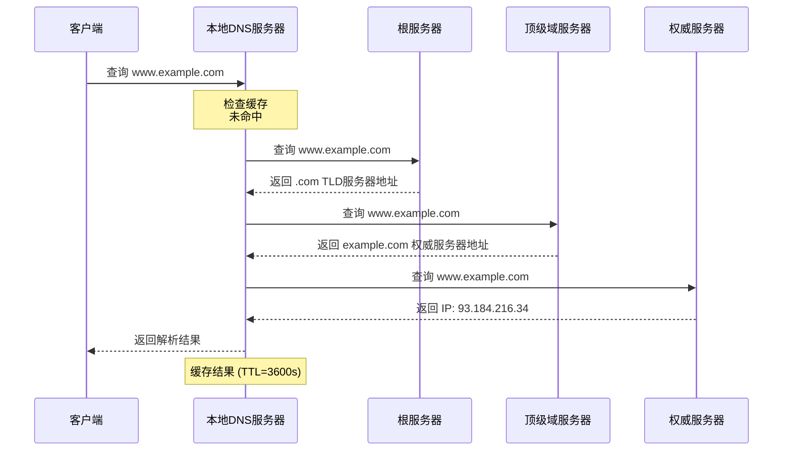
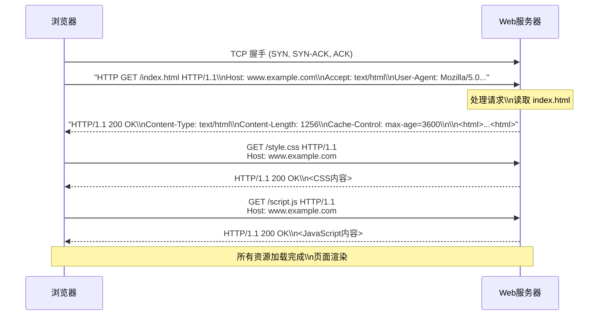
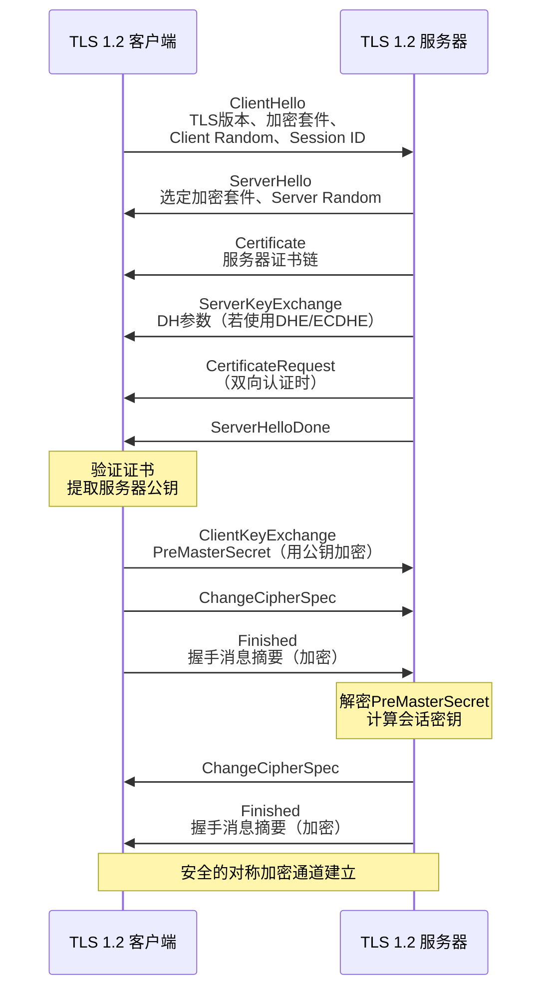
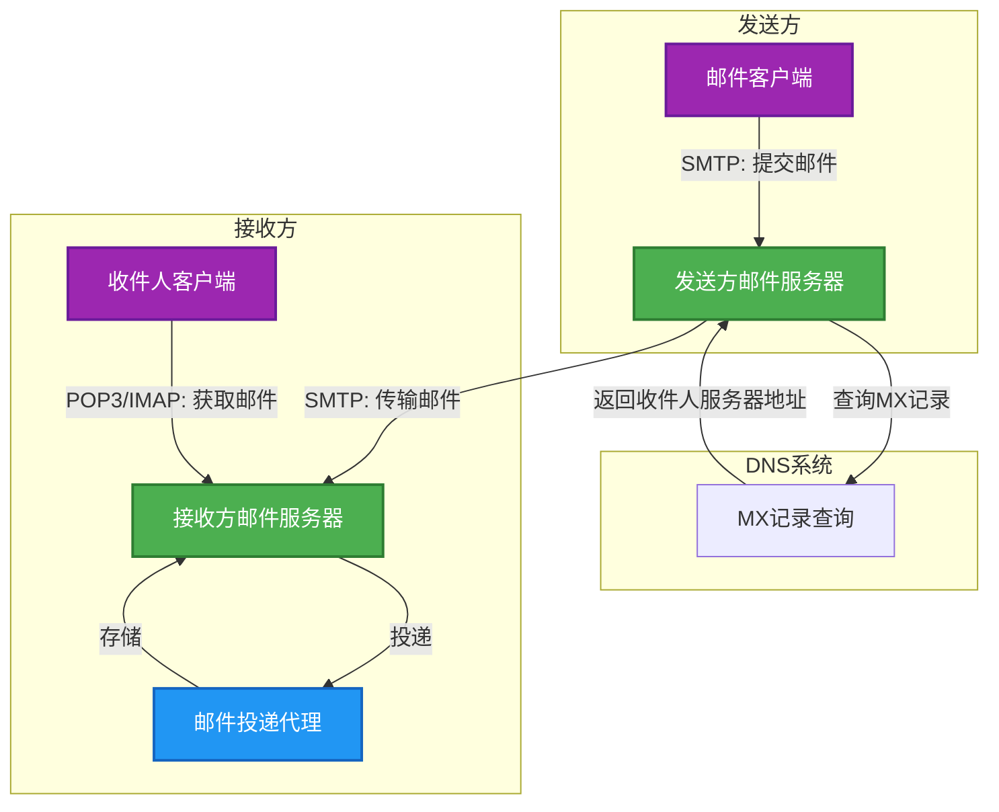
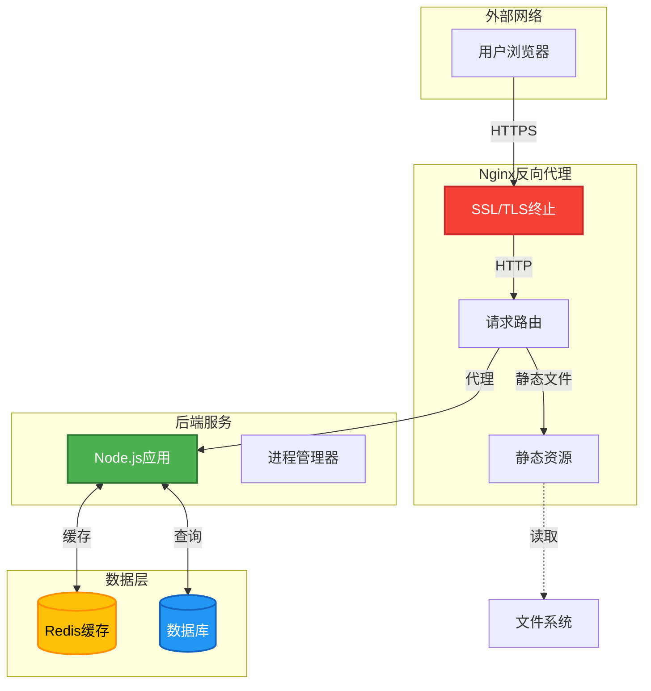

# 第六章 应用层

应用层（Application Layer）是计算机网络体系结构中的最高层，它是用户与网络之间的接口，负责为用户提供各种网络服务。应用层直接与用户的应用程序交互，使得用户能够通过各种各样的应用软件访问网络资源。本章将详细介绍应用层的基本概念、核心协议以及工程实践。

## 6.1 应用层概述

### 6.1.1 应用层的作用

应用层在TCP/IP四层模型中位于最高层，其主要作用是提供网络应用程序与网络之间的接口。这一层封装了网络通信的复杂性，为用户应用程序提供了简单、一致的网络服务访问方式。应用层使得编写网络应用程序变得相对简单，开发者无需关心数据如何在网络中传输、路由选择、错误处理等底层细节，只需要调用应用层提供的接口即可完成网络通信。

应用层的核心功能包括：进程间通信（不同主机上的应用程序可以相互交换数据）、资源访问（用户可以通过应用层协议访问远程服务器上的资源）、数据表示（处理不同系统之间的数据格式差异）以及应用状态管理（维护应用程序的会话状态信息）。这些功能共同构成了现代网络应用的基础架构，使得Web浏览、电子邮件、文件传输等各种网络服务得以实现。

从软件工程的角度来看，应用层协议定义了应用程序之间交换数据的格式和含义。每一个应用层协议都是为了解决特定的网络应用问题而设计的。例如，HTTP协议用于Web浏览器和Web服务器之间的通信，SMTP协议用于邮件发送，FTP协议用于文件传输。应用层协议通常建立在传输层协议之上，依赖传输层提供的端到端通信服务。

### 6.1.2 应用层协议原理

应用层协议是计算机网络中进行网络应用通信的规则和约定，它定义了应用程序之间交换消息的格式、含义和时序。理解应用层协议的工作原理对于设计和实现网络应用至关重要。应用层协议的核心要素包括语法（消息的结构和格式）、语义（消息中每个部分的含义）以及时序（消息的发送顺序和时机）。

一个完整的应用层交互过程通常包括连接建立、数据交换和连接释放三个阶段。在连接建立阶段，通信双方需要协商确定通信参数、建立连接状态。在数据交换阶段，双方按照协议规定的格式发送和接收数据。在连接释放阶段，双方需要有序地关闭连接，释放相关资源。不同的应用层协议在具体实现上有所不同，但都遵循这一基本模式。

应用层协议的设计需要考虑多方面因素。首先是可靠性要求，某些应用如文件传输需要保证数据的完整性和可靠性，而另一些应用如视频流媒体则可以容忍一定的数据丢失。其次是实时性要求，语音通话和视频会议等应用对延迟有严格要求，而电子邮件则对实时性要求较低。再次是效率要求，协议设计需要在功能性和开销之间取得平衡。最后是安全性要求，现代网络应用越来越重视数据安全和隐私保护，许多应用层协议都包含安全机制或建立在安全协议之上。

### 6.1.3 客户端/服务器模型

客户端/服务器模型（Client/Server Model）是网络应用中最基本也是最常见的分布式系统架构模式。在这一模型中，网络应用被分为两个部分：客户端和服务器。客户端是主动发起请求的一方，通常运行在用户本地设备上，负责向服务器发送请求并显示服务器返回的结果。服务器是被动等待请求的一方，通常运行在具有较高计算能力和稳定性的远程主机上，负责接收客户端请求、处理业务逻辑并返回响应结果。

客户端/服务器模型的工作流程相对简单直接。用户通过客户端应用程序发起操作请求，客户端将请求封装成网络协议规定的格式并发送给服务器。服务器接收到请求后，进行相应的处理，可能是访问数据库、执行计算或者调用其他服务。处理完成后，服务器将结果封装成响应消息返回给客户端。客户端接收到响应后，进行解析并以用户友好的方式呈现结果。整个过程中，客户端和服务器通过网络进行通信，但用户感知到的是本地客户端应用的功能。

这种架构模式具有多方面的优势。从资源管理的角度来看，服务器可以集中管理关键数据和业务逻辑，便于进行统一的安全控制和数据备份。从可扩展性的角度来看，可以通过增加服务器的数量来应对更多的用户请求。从可维护性的角度来看，服务器端代码的更新和升级只需要在服务器端进行，不会影响客户端用户。从安全性的角度来看，可以在服务器端实施严格的安全策略，保护敏感数据不被未授权访问。

然而，客户端/服务器模型也存在一些固有的局限性。当用户数量大幅增加时，服务器可能成为性能瓶颈，需要进行复杂的负载均衡和集群部署。服务器需要保持持续运行，任何服务器故障都可能导致相关服务不可用。此外，在某些应用场景中，客户端和服务器之间的频繁交互会造成较高的网络延迟，影响用户体验。这些局限性推动了其他架构模式如对等网络和边缘计算的发展。

### 6.1.4 P2P模型

对等网络（Peer-to-Peer，简称P2P）模型是一种分布式系统架构，与客户端/服务器模型不同，P2P网络中所有节点既可以作为客户端请求服务，也可以作为服务器提供服务。每个节点（称为对等体）既可以发起请求，也可以响应其他节点的请求。这种去中心化的架构使得网络中的资源和服务分散在各个节点上，而不是集中在一个或少数几个服务器上。

P2P网络的工作原理是通过节点之间的直接通信实现的。当一个新节点加入网络时，它可以通过种子节点或者已知节点列表发现网络中的其他节点。一旦连接到网络，节点就可以与任意其他节点建立直接连接，进行数据交换。这种直接通信的方式减少了数据中转的环节，在某些场景下可以提高传输效率。

P2P网络具有以下几个显著特点。首先是去中心化，资源和服务分散在各个节点上，不存在单一的控制点，这提高了网络的可靠性和抗故障能力。其次是可扩展性，随着更多节点加入网络，总资源容量和服务能力也随之增加，这与传统的客户端/服务器模型形成鲜明对比。再次是成本效益，由于不需要专门的服务器来提供核心服务，P2P网络可以降低基础设施成本。最后是隐私保护，由于通信是直接在节点之间进行的，数据不必经过中央服务器，这在一定程度上保护了用户的隐私。

P2P网络的应用场景非常广泛。文件分享是P2P最著名的应用之一，BitTorrent协议允许用户直接从其他用户那里下载文件，同时上传已经下载的部分。区块链技术也建立在P2P网络之上，比特币等加密货币通过P2P网络实现去中心化的交易验证。分布式计算利用P2P网络协调大量计算机共同完成复杂计算任务。VoIP应用如Skype在早期也采用了P2P架构来建立用户之间的语音通信。

然而，P2P模型也面临一些挑战。由于没有中央服务器管理和监控，内容版权问题和不良内容传播难以控制。节点可以随时加入和离开网络，这对网络拓扑的稳定性和数据可用性提出了挑战。安全也是一个重要问题，恶意节点可能传播虚假数据或进行攻击。此外，一些P2P应用由于占用大量带宽，可能引发网络运营商的限制和管理问题。

## 6.2 DNS域名系统

### 6.2.1 域名的结构与分类

域名系统（Domain Name System，简称DNS）是互联网的核心基础设施之一，它将人类可读的域名转换为机器可读的IP地址。由于IP地址难以记忆和识别，DNS提供了一种方便的记忆方式，使得用户可以通过有意义的域名访问互联网资源。例如，当用户在浏览器中输入"www.example.com"时，DNS系统会将其解析为对应的IP地址如"93.184.216.34"，然后才能建立网络连接。

域名采用层次化的树状结构组织，这种结构确保了域名在全球范围内的唯一性和可管理性。整个域名系统从根节点开始，根节点下分为多个顶级域（Top-Level Domain，TLD），每个顶级域又进一步分为二级域，以此类推。域名的阅读顺序是从右到左，越靠右的部分层级越高。例如，在域名"www.github.com"中，"com"是顶级域，"github"是二级域，"www"是子域。

顶级域分为几种类型。通用顶级域（gTLD）是最常见的类型，包括".com"（商业组织）、".org"（非营利组织）、".net"（网络服务提供商）、".edu"（教育机构）、".gov"（政府机构）等。国家代码顶级域（ccTLD）使用两个字母的国家或地区代码，如".cn"代表中国、".uk"代表英国、".jp"代表日本、".us"代表美国等，每个国家可以自行管理其国家代码顶级域下的二级域。基础设施顶级域（arpa）专门用于逆向域名解析。

二级域是域名系统中最重要的部分，通常由域名注册机构分配给个人或组织。在"example.com"中，"example"就是二级域。一旦获得了二级域的注册，就可以在其下创建任意数量的子域。三级域及更低的子域通常由域名持有者自行管理，可以根据业务需求灵活设置。常见的子域命名约定包括"www"用于Web服务、"mail"用于邮件服务、"ftp"用于文件传输服务、"api"用于应用程序接口等。

域名的注册遵循先申请先注册的原则，全球有多家ICANN（互联网名称与数字地址分配机构）认可的域名注册商负责域名的注册服务。域名注册通常需要按年付费，持有者需要定期续费以维持域名所有权。域名持有者可以通过域名注册商提供的管理平台修改域名的DNS记录，将域名指向不同的服务器。

### 6.2.2 DNS服务器类型

DNS系统的正常运转依赖于全球范围内分布的多种类型的DNS服务器，它们各司其职，共同完成域名解析任务。DNS服务器按照功能和层级可以分为根服务器、顶级域服务器、权威服务器和递归解析器四大类。

根服务器是DNS系统的最顶层，目前全球共有13组根服务器（编号从A到M），由不同的组织运营管理。根服务器的任务是回答对顶级域服务器的查询，它知道所有顶级域服务器的位置和IP地址。当递归解析器无法从缓存中找到答案时，最终会向根服务器发起查询。根服务器不存储具体的域名和IP地址映射，而是指向下级的顶级域服务器。需要特别说明的是，虽然有13组根服务器，但每组实际上由多台物理服务器组成，分布在世界各地以提高冗余和性能。

顶级域服务器负责管理各自顶级域下的所有二级域。举例来说，".com"顶级域服务器知道所有在".com"下注册二级域的权威服务器位置。当查询"example.com"时，根服务器会返回负责".com"顶级域的服务器列表，然后向这些服务器查询"example.com"的权威服务器地址。顶级域服务器由各注册管理机构运营，如VeriSign负责运营".com"和".net"顶级域。

权威服务器是存储和管理具体域名解析数据的服务器。当一个域名被注册时，注册者会在权威服务器上配置该域名的DNS记录。权威服务器对其管辖的域名具有最终的回答权限。权威服务器分为主要权威服务器（主服务器）和辅助权威服务器（从服务器）。主服务器存储原始的DNS记录数据，而从服务器通过区域传输从主服务器同步数据，提供冗余备份，提高解析服务的可用性。

递归解析器（也称为递归DNS服务器）是普通用户最常接触的DNS服务器类型。当用户在电脑上配置DNS服务器时，实际上就是配置了一个递归解析器。递归解析器接收来自客户端的查询请求，负责完成整个解析过程——它会依次查询根服务器、顶级域服务器和权威服务器，直到获得答案，然后将结果返回给客户端并缓存起来以备后用。递归解析器通常由互联网服务提供商（ISP）提供，也有公共DNS服务如Google的8.8.8.8和Cloudflare的1.1.1.1。

### 6.2.3 DNS查询过程

DNS查询是将域名转换为IP地址的过程，这个过程看似简单，实际上涉及多个服务器之间的协作。根据查询方式的不同，DNS查询可以分为递归查询、迭代查询和组合查询三种类型。

递归查询是指客户端向本地DNS服务器发送查询请求后，本地DNS服务器负责完成整个解析过程，直到返回最终结果或错误信息给客户端。在递归查询过程中，无论需要经过多少层级的服务器，客户端都只需要发送一次请求，等待一次响应。这种方式对客户端来说最为简单，但增加了本地DNS服务器的负担。普通用户设备和浏览器通常使用递归查询。

迭代查询是指DNS服务器收到查询请求后，如果无法直接回答，会返回下一个应该查询的DNS服务器的地址，让客户端自行继续查询。在迭代查询中，客户端需要知道如何逐步向下查询，直到找到能够回答问题的服务器。这种方式分散了查询负担，但增加了客户端的复杂度，需要多次往返才能完成解析。DNS服务器之间通常使用迭代查询方式进行通信。

在实际应用中，完整的DNS解析过程通常是递归查询和迭代查询的组合。当用户在浏览器中输入一个域名时，首先会检查本地缓存（包括浏览器缓存和操作系统缓存），如果命中则直接使用缓存结果。如果本地缓存没有命中，则向配置的递归DNS服务器发送递归查询请求。递归DNS服务器首先检查自己的缓存，如果缓存命中则直接返回结果。

如果递归DNS服务器缓存中也没有，则进入完整的解析流程。递归DNS服务器首先向根服务器发起迭代查询，根服务器返回负责该域名顶级域的服务器地址。然后递归DNS服务器向顶级域服务器查询，顶级域服务器返回该域名权威服务器的地址。接着向权威服务器查询，权威服务器返回该域名对应的IP地址。最后递归DNS服务器将结果返回给客户端，并缓存起来以备后用。

### 6.2.4 DNS记录类型

DNS记录是存储在DNS服务器中的资源记录，它们定义了域名与各种资源之间的映射关系。不同类型的DNS记录用于不同的目的，常见的有A记录、AAAA记录、CNAME记录、MX记录、TXT记录、NS记录和SOA记录等。

A记录（Address Record）是最基本也是最重要的DNS记录类型，它将域名映射到一个IPv4地址。例如，一条A记录可以将"example.com"映射到"93.184.216.34"。当用户访问"example.com"时，DNS系统会返回这个IP地址，然后浏览器才能建立到目标服务器的连接。每条A记录包含域名、TTL（生存时间）值、记录类型（A）和目标IP地址。

AAAA记录与A记录类似，但用于IPv6地址。IPv4地址资源日益枯竭，IPv6正在逐步推广，AAAA记录用于支持IPv6网络环境下的域名解析。例如，一条AAAA记录可以将"example.com"映射到"2606:2800:220:1::248a:1893"。如果一个域名同时配置了A记录和AAAA记录，客户端会根据其网络环境选择使用哪种记录进行连接。

CNAME记录（Canonical Name Record）用于创建域名的别名。例如，可以为"www.example.com"创建一条CNAME记录指向"example.com"，这样当访问"www.example.com"时，DNS会先解析到"example.com"，然后再解析"example.com"的IP地址。CNAME记录常用于将多个子域指向同一个服务器，或者在服务器IP地址变更时只需要更新一处记录。需要注意的是，CNAME记录不能与其他记录类型混合使用，同一个域名不能同时有CNAME记录和A记录。

MX记录（Mail Exchanger Record）用于指定处理电子邮件的邮件服务器。当发送一封邮件时，邮件系统会根据收件人的域名查找MX记录，确定应该将邮件投递到哪个邮件服务器。MX记录包含优先级和邮件服务器域名两个要素。当存在多个MX记录时，邮件系统会按照优先级从高到低的顺序尝试投递，优先级数字越小表示优先级越高。例如，两条MX记录分别是"10 mail1.example.com"和"20 mail2.example.com"，邮件系统会优先尝试投递到mail1，如果失败则尝试mail2。

TXT记录最初用于在域名中添加任意文本信息，用于验证域名所有权或安全配置。现在TXT记录广泛用于SPF（Sender Policy Framework）发件人策略框架，用于声明哪些邮件服务器被授权代表本域名发送邮件，有助于防止邮件伪造和钓鱼攻击。DKIM（DomainKeys Identified Mail）也使用TXT记录存储公钥用于邮件签名验证。DMARC（Domain-based Message Authentication, Reporting and Conformance）同样使用TXT记录定义邮件验证策略和报告接收地址。

NS记录（Name Server Record）用于指定负责管理某个域名的DNS服务器。NS记录指出了该域名的权威服务器是谁，其他DNS服务器需要通过NS记录知道到哪里去查询该域名的信息。每个域名至少需要两条NS记录以确保可用性。SOA记录（Start of Authority Record）包含区域文件的管理信息，包括主DNS服务器地址、域管理员邮箱、序列号（用于判断是否需要更新）、刷新间隔、重试间隔和过期时间等。

### 6.2.5 DNS缓存与TTL

DNS缓存是提高域名解析效率的重要机制，它通过将解析结果临时存储在缓存中，避免重复查询，加快解析速度并减轻DNS服务器的负载。DNS缓存存在于多个层级，包括浏览器缓存、操作系统缓存、递归DNS服务器缓存和ISP DNS服务器缓存等。

当浏览器需要解析一个域名时，首先会检查自己的DNS缓存。现代浏览器通常会缓存DNS记录一段时间，缓存时间由域名的TTL值决定。如果浏览器缓存中有有效的结果，就不需要发起任何网络请求，直接使用缓存的IP地址。浏览器的DNS缓存通常比较短暂，这是为了确保能够及时获取域名最新的解析结果。

操作系统层面的DNS缓存位于TCP/IP协议栈中，由操作系统的DNS客户端管理。当浏览器没有命中缓存或缓存已过期时，会向操作系统请求域名解析。如果操作系统缓存中有有效结果，就直接返回给浏览器。操作系统的DNS缓存时间通常也可以配置，默认值因操作系统而异。

递归DNS服务器是DNS缓存最关键的一环。由于递归DNS服务器需要处理大量的域名解析请求，为每个请求都进行完整的迭代查询是不现实的。通过缓存之前查询过的结果，递归DNS服务器可以快速响应重复的查询请求，大幅提高解析效率。当一个域名查询结果被返回给递归DNS服务器时，服务器会根据结果中指定的TTL值来决定缓存时长。

TTL（Time To Live，生存时间）是DNS记录的一个重要属性，它以秒为单位，告诉缓存服务器这条记录可以缓存多长时间。不同的DNS记录类型通常有不同的典型TTL值。A记录的TTL通常设置为300秒（5分钟）到3600秒（1小时）之间，MX记录和TXT记录的TTL通常设置为3600秒或更长。较短的TTL使得域名变更能够更快地生效，但会增加DNS服务器的负载；较长的TTL可以减少DNS查询流量，但会导致域名变更传播较慢。

DNS缓存的更新策略遵循TTL的指示。当缓存中的记录还未过期时，后续的相同查询会直接返回缓存结果，这称为缓存命中。当缓存中的记录过期后，下一次查询会触发新的DNS查询以获取最新数据，这个过程称为缓存失效或缓存刷新。某些递归DNS服务器实现了主动刷新策略，在TTL到期前一段时间就主动去查询权威服务器获取最新数据，以减少用户查询时的等待时间。

在实际工程中，修改域名解析后可能需要等待一段时间才能完全生效，这主要是因为DNS缓存的存在。即使权威服务器上的记录已经更新，但各级缓存服务器中旧的记录可能仍然有效，这就是所谓的"DNS传播延迟"。为了加速变更生效，可以在修改DNS记录时先将TTL设置为一个较小的值，等待变更生效后再将TTL调整回正常值。了解DNS缓存机制对于故障排查和域名迁移等操作都非常重要。

## 6.3 HTTP/HTTPS协议

### 6.3.1 HTTP协议的发展

超文本传输协议（HyperText Transfer Protocol，HTTP）是用于分布式、协作式和超媒体信息系统的应用层协议，是万维网（World Wide Web）数据通信的基础。HTTP由蒂姆·伯纳斯-李（Tim Berners-Lee）于1989年在欧洲核子研究组织（CERN）提出，最初的目的是使科学家们能够方便地共享研究文档和数据。

HTTP/0.9发布于1991年，是该协议的最初版本，极其简单。它只支持GET请求方法，没有请求头和响应头概念，只能传输纯HTML内容。服务器响应后立即关闭TCP连接，不支持任何扩展性。这个版本奠定了HTTP的基本请求-响应模型，但功能非常有限。

HTTP/1.0发布于1996年，是对HTTP/0.9的重大升级。HTTP/1.0添加了请求头和响应头的概念，支持多种请求方法（GET、POST、HEAD），引入了状态码来标识响应结果，支持多媒体内容类型（MIME类型），并开始支持缓存机制。然而，HTTP/1.0默认使用非持久连接，每个请求-响应周期都需要建立新的TCP连接，这在包含大量资源的网页中会造成显著的延迟。

HTTP/1.1发布于1999年，是使用时间最长的版本，直到现在仍被广泛使用。HTTP/1.1默认使用持久连接（Keep-Alive），允许在单个TCP连接上发送多个请求和响应，大大减少了连接建立和关闭的开销。它引入了管道化（Pipelining）技术，允许客户端在收到前一个响应之前发送下一个请求。HTTP/1.1还增加了一些重要的新特性，包括分块传输编码（Chunked Transfer Encoding）、压缩传输、虚拟主机支持、缓存更精细的控制等。

HTTP/2发布于2015年，由Google的SPDY协议发展而来。HTTP/2引入了多路复用（Multiplexing）技术，允许在单个TCP连接上并行传输多个请求和响应，完美解决了HTTP/1.1中的队头阻塞问题。它使用二进制分帧替代了文本格式，提高了协议解析效率和传输效率。HTTP/2还支持服务器推送（Server Push）、头部压缩（HPACK）等特性，显著提升了传输性能和用户体验。

HTTP/3发布于2022年，是最新版本的HTTP协议。HTTP/3最大的变化是使用QUIC协议替代了TCP作为传输层协议。QUIC是基于UDP实现的，能够解决TCP的队头阻塞问题，并且具有更低的连接建立延迟。HTTP/3还集成了TLS 1.3，实现了0-RTT或1-RTT的连接建立，进一步加快了页面加载速度。

### 6.3.2 HTTP请求/响应结构

HTTP协议采用请求-响应模型进行通信。客户端发送HTTP请求到服务器，服务器处理请求后返回HTTP响应。请求和响应都遵循特定的消息格式，这种格式化的设计使得客户端和服务器能够正确解析对方的消息。

HTTP请求消息由请求行、请求头、空行和请求体（可选）四部分组成。请求行包含请求方法、请求URL和HTTP版本三个部分，它们之间以空格分隔。例如，"GET /index.html HTTP/1.1"表示使用GET方法请求根目录下的index.html文件，协议版本为HTTP/1.1。请求头以键值对的形式提供，包含了关于请求的元信息，如主机地址、内容类型、客户端接受的编码格式等。请求头结束后有一个空行（仅包含CRLF），用于分隔头部和主体。请求体用于 POST、PUT 等方法，包含要提交的数据，如表单数据或JSON内容。

HTTP响应消息由状态行、响应头、空行和响应体（可选）四部分组成。状态行包含HTTP版本、状态码和状态描述三个部分。例如，"HTTP/1.1 200 OK"表示服务器使用HTTP/1.1协议响应，状态码为200（表示成功），状态描述为"OK"。响应头与请求头类似，以键值对形式提供响应的元信息，如内容类型、内容长度、服务器信息、缓存控制指令等。空行用于分隔响应头和响应体。响应体包含服务器返回的实际内容，如HTML文档、图片数据或JSON数据。

一个典型的HTTP请求头包含了多个重要字段。Host字段指定目标服务器的主机名和端口号，这是HTTP/1.1中必需的字段。User-Agent字段标识客户端类型，通常包含浏览器信息。Accept字段告诉服务器客户端能够处理的内容类型。Accept-Language字段指定客户端偏好的语言。Accept-Encoding字段指定支持的压缩编码方式。Connection字段控制连接行为，如"keep-alive"表示保持连接。Cookie字段用于发送之前服务器设置的Cookie。

响应头同样包含丰富的元信息。Content-Type字段指明响应体的MIME类型，如"text/html; charset=utf-8"。Content-Length字段给出响应体的字节长度。Server字段标识服务器软件信息。Date字段给出响应生成的时间。Last-Modified字段指明资源最后修改时间。Cache-Control字段控制缓存行为。Set-Cookie字段用于在客户端设置Cookie。

### 6.3.3 HTTP请求方法

HTTP定义了一组请求方法（也称为HTTP动词），用于指示对资源的不同操作。不同的请求方法具有不同的语义，服务器根据请求方法执行相应的操作并返回结果。

GET方法是最常用的请求方法，用于请求获取指定资源。GET请求应该只读取数据，不应该修改服务器上的资源，因此被认为是安全和幂等的。GET请求的参数可以通过URL查询字符串传递，例如"GET /search?q=keyword HTTP/1.1"。GET请求可以被浏览器缓存，可以被浏览器历史记录保存，URL可以直接分享给他人。由于参数直接暴露在URL中，GET方法不适合传递敏感信息。

POST方法用于向服务器提交数据进行处理，例如提交表单数据、上传文件。POST请求通常会导致服务器状态的变化或资源的创建，因此既不是安全的也不是幂等的。POST请求的参数通常放在请求体中，可以传输大量数据，且支持多种编码方式。POST请求一般不会被缓存，不会保留在浏览器历史记录中。

PUT方法用于上传或更新指定资源。如果指定位置的资源不存在，则创建该资源；如果已存在，则用请求中的数据替换现有资源。PUT方法是幂等的，多次执行相同的PUT请求应该产生相同的结果。PUT请求的参数同样放在请求体中。PUT方法通常用于更新整个资源，如果需要部分更新，应该使用PATCH方法。

DELETE方法用于请求删除指定的资源。DELETE请求是幂等的，执行一次和执行多次的效果应该相同（即使删除的资源已经不存在）。删除操作成功后通常返回204状态码（无内容）或200状态码（返回删除操作的信息）。需要注意的是，DELETE方法只是向服务器发送删除请求，实际删除操作由服务器决定是否执行。

PATCH方法用于对资源进行部分更新，与PUT的完整替换不同，PATCH只修改资源的特定部分。PATCH方法是安全的方法，因为它只修改数据而不删除资源，但不一定是幂等的，取决于服务器的实现。

HEAD方法与GET方法类似，但服务器只返回响应头，不返回响应体。HEAD请求用于获取资源的元信息，如检查资源是否存在、资源是否被修改、验证资源的类型等。由于不需要传输整个响应体，HEAD请求比GET请求更轻量，常用于检查链接的有效性或获取资源的大小。

OPTIONS方法用于请求服务器返回支持的通信选项。通过OPTIONS请求，客户端可以查询服务器支持哪些HTTP方法，或者检查是否支持跨域请求（CORS预检请求）。响应头中的Allow字段列出了服务器支持的请求方法。

TRACE方法主要用于诊断和调试，服务器会将收到的请求消息原样返回给客户端，包括请求行、请求头和请求体。TRACE方法可以用来查看请求在传输过程中被修改的情况，或检查代理服务器的行为。

CONNECT方法用于建立隧道（tunnel），通常用于SSL/TLS加密连接的代理。通过CONNECT请求，客户端可以要求服务器将其连接到指定的目标地址，并从此之后将数据直接转发，而不是作为代理处理HTTP协议。

### 6.3.4 HTTP状态码

HTTP状态码是服务器对客户端请求的响应结果，用三位数字表示。状态码的第一个数字定义了响应的类别，共分为五类：1xx表示信息性状态码，2xx表示成功状态码，3xx表示重定向状态码，4xx表示客户端错误状态码，5xx表示服务器错误状态码。

1xx状态码是信息性状态码，表示服务器已接收请求并继续处理。100 Continue状态码表示服务器已收到请求的头部，客户端可以继续发送请求体。这在上传大文件时特别有用，客户端可以先发送Expect: 100-continue头部，如果服务器能够处理则继续发送请求体，否则可以避免浪费带宽。101 Switching Protocols状态码表示服务器应客户端请求切换协议，如切换到WebSocket协议或HTTP/2协议。

2xx状态码表示请求已被服务器成功接收、理解并处理。200 OK是最常见的状态码，表示请求成功，响应内容取决于请求的方法。201 Created表示请求成功并且服务器创建了新的资源，通常在POST或PUT请求创建资源时返回，响应头中通常包含新资源的URL。202 Accepted表示请求已接收但尚未处理，常用于异步操作场景。204 No Content表示请求成功但响应没有内容，用于不希望改变客户端当前视图的场景，如删除操作后的确认。206 Partial Content表示服务器成功返回了部分内容，用于断点续传或大文件分片下载的场景。

3xx状态码表示需要进一步操作才能完成请求，通常用于重定向。301 Moved Permanently表示请求的资源已永久移动到新位置，后续请求应使用新的URL。302 Found表示临时重定向，资源暂时位于不同的URL，后续请求仍应使用原始URL。304 Not Modified表示资源未修改，客户端可以使用缓存的内容，这有助于减少不必要的带宽消耗。307 Temporary Redirect与302类似，但确保请求方法和请求体不会改变。308 Permanent Redirect与301类似，但确保请求方法和请求体不会改变。

4xx状态码表示请求有语法错误或无法完成，错误由客户端方面引起。400 Bad Request表示服务器无法理解请求的语法，客户端应该修改请求后重试。401 Unauthorized表示请求需要用户认证，响应中通常包含WWW-Authenticate头部提示认证方式。403 Forbidden表示服务器理解请求但拒绝执行，即使没有认证也可能返回此状态。404 Not Found表示请求的资源在服务器上不存在，这可能是URL错误或资源已被删除。405 Method Not Allowed表示请求方法不被支持，如使用POST方法访问只支持GET的资源。408 Request Timeout表示客户端未能在服务器时间内完成请求。409 Conflict表示请求与服务器当前状态冲突，如提交重复数据。413 Payload Too Large表示请求体过大，服务器拒绝处理。429 Too Many Requests表示用户在一定时间内发送了过多请求，即请求限流。

5xx状态码表示服务器在处理请求时发生内部错误，错误由服务器方面引起。500 Internal Server Error是通用的服务器错误状态码，当服务器遇到未预料的情况时返回。501 Not Implemented表示服务器不支持请求的功能或方法。502 Bad Gateway作为代理或网关的服务器收到无效响应。503 Service Unavailable表示服务器暂时无法处理请求，可能是由于过载或维护。504 Gateway Timeout作为代理或网关的服务器未及时收到上游服务器的响应。

### 6.3.5 Cookie与Session

Cookie和Session是HTTP协议中用于管理用户状态和会话的两种主要机制。由于HTTP本身是无状态的（即服务器不保留之前请求的任何信息），所以需要额外的机制来支持需要状态的应用，如用户登录、购物车功能等。

Cookie是由服务器发送到客户端并存储在本地的小型文本文件。当客户端首次访问服务器时，服务器可以通过响应头Set-Cookie字段设置Cookie。浏览器会保存这个Cookie，之后对该服务器的每次请求都会自动在请求头中携带这个Cookie。通过Cookie，服务器能够识别用户并维护用户相关的数据和偏好设置。

Cookie具有多个重要属性。Name和Value是最基本的属性，分别指定Cookie的名称和值。Domain属性指定Cookie所属的域名，只有来自该域名的请求才会发送该Cookie。Path属性指定Cookie生效的路径，只有请求该路径下的资源时才会发送Cookie。Expires/Max-Age属性指定Cookie的过期时间，如果设置了这个属性，Cookie会被持久化存储；如果没有设置，则为会话Cookie，关闭浏览器后自动删除。HttpOnly属性指示Cookie不能通过JavaScript访问，有助于防止XSS攻击。Secure属性指示Cookie只能通过HTTPS连接发送。SameSite属性可以防止CSRF攻击，指定Cookie是否可以在跨站请求中发送。

Session（会话）是另一种服务器端的状态管理机制。当用户首次访问服务器时，服务器会创建一个唯一的会话ID，并将这个会话ID发送给客户端。客户端通常将这个会话ID存储在Cookie中，后续请求时携带这个会话ID。服务器根据会话ID找到对应的会话数据，这些数据存储在服务器的内存、数据库或缓存中。

Cookie和Session各有优缺点。Cookie存储在客户端，不占用服务器资源，适合存储少量不敏感的数据。但Cookie有大小限制（通常不超过4KB），每个域名能存储的Cookie数量也有限制，而且Cookie随着每个请求发送，会增加网络流量。Session数据存储在服务器端，安全性较高，可以存储大量数据，但会增加服务器内存负担，在分布式环境中需要考虑会话共享问题。

在实际应用中，Cookie和Session经常配合使用。用户登录成功后，服务器创建Session，将用户信息存入Session，然后生成一个Session ID写入Cookie。后续请求时，服务器通过Cookie中的Session ID找到对应的Session，获取用户信息。这种模式既利用了Cookie的便捷性，又保证了关键数据的安全性。对于敏感数据如用户密码，绝不应该存储在Cookie中，而应该存储在Session中。

除了传统的Cookie机制，现代Web应用还使用Web Storage API（localStorage和sessionStorage）和IndexedDB来在客户端存储数据。localStorage提供持久化存储，除非手动清除否则永不过期；sessionStorage存储当前会话的数据，关闭浏览器标签页或窗口后自动清除。这些技术提供了比Cookie更大的存储空间和更灵活的API。

### 6.3.6 HTTPS工作原理

HTTPS（HyperText Transfer Protocol Secure）是HTTP的安全版本，它在HTTP之下添加了SSL/TLS层来提供数据加密、完整性验证和服务器身份认证。HTTPS的"S"来自"Secure"，它保护了HTTP协议在传输过程中的安全缺陷，使得通信内容无法被中间人窃听或篡改。

HTTPS的核心是SSL/TLS协议。SSL（Secure Sockets Layer）最初由网景公司开发，TLS（Transport Layer Security）是SSL的后续版本，由IETF标准化。虽然现在实际使用的是TLS，但人们仍然习惯性地称这种加密为"SSL"。TLS协议提供了三个核心安全功能：加密（Encryption）确保数据传输的机密性，即使被截获也无法读取；完整性（Integrity）确保数据在传输过程中不被篡改；认证（Authentication）确保通信的另一方是其声称的身份。

HTTPS的加密机制采用混合加密方案。实际的数据传输使用对称加密（Symmetric Encryption），因为对称加密速度快、效率高。但对称加密的密钥需要安全地传递给对方，这正是非对称加密（Asymmetric Encryption）的用武之地。非对称加密使用公钥和私钥配对的密钥体系，公钥加密的数据只能用私钥解密，私钥加密的数据只能用公钥解密。在TLS握手阶段，客户端使用服务器的公钥加密生成对称密钥所需的信息，服务器使用私钥解密获取信息，双方从而安全地协商出对称加密的密钥。

HTTPS还通过数字证书提供服务器身份认证。服务器需要向证书颁发机构（Certificate Authority，CA）申请数字证书，CA验证服务器身份后签发证书。证书中包含服务器的公钥、域名信息、有效期和CA的数字签名。当客户端连接服务器时，服务器会发送其证书。客户端会验证证书的有效性：检查证书是否由可信的CA签发、检查证书是否在有效期内、检查证书中的域名是否与访问的域名匹配、检查证书是否已被吊销等。只有证书验证通过后，客户端才会继续建立安全连接。

### 6.3.7 TLS/SSL握手过程

TLS握手是建立HTTPS安全连接的关键过程，在这个过程中，客户端和服务器协商加密算法、验证服务器身份，并生成会话密钥。TLS握手的具体步骤因TLS版本和加密套件的不同而有所差异，但基本流程是一致的。

TLS 1.2握手过程是最经典的版本，通常需要2-RTT（两次往返）才能完成。第一次往返（1-RTT）从客户端开始。客户端首先发送ClientHello消息，包含客户端支持的TLS版本、支持的加密算法列表、支持的压缩方法、客户端随机数（Client Random）以及可选的会话ID和扩展字段。服务器收到ClientHello后，发送ServerHello消息，选择双方都支持的加密算法和压缩方法，并发送服务器随机数（Server Random）。然后服务器发送Certificate消息，提供自己的证书链。服务器还可能发送ServerKeyExchange消息（如果使用的密钥交换算法需要）以及CertificateRequest（如果需要客户端认证）。最后服务器发送ServerHelloDone消息表示Hello阶段结束。

第二次往返（2-RTT）从客户端验证服务器证书开始。客户端验证证书的有效性后，发送ClientKeyExchange消息，其中包含客户端生成的预主密钥（Pre-Master Secret），并使用服务器的公钥加密。如果服务器请求客户端证书，客户端还会发送Certificate和CertificateVerify消息。客户端然后发送ChangeCipherSpec消息通知后续通信将使用协商的加密算法和密钥。接着发送Finished消息，包含之前所有握手消息的摘要，用新协商的密钥加密。服务器收到这些消息后，同样发送ChangeCipherSpec和Finished消息。握手完成后，双方开始使用对称加密进行安全通信。

TLS 1.3对握手过程进行了重大优化，将握手时间减少到1-RTT甚至0-RTT。TLS 1.3只支持前向安全的密钥交换算法，将支持的加密套件从复杂的列表简化为几个安全组合。在TLS 1.3的1-RTT握手过程中，客户端在ClientHello中就带上密钥共享信息，服务器直接计算密钥并返回。TLS 1.3还支持0-RTT模式，在之前连接过的前提下，客户端可以在第一个消息中就发送加密的数据，但这会带来重放攻击的风险。

## 6.4 电子邮件协议

### 6.4.1 邮件系统组成

电子邮件系统是一个复杂的分布式系统，由多个组件构成，包括邮件用户代理（MUA）、邮件传输代理（MTA）、邮件投递代理（MDA）和邮件存储服务等。这些组件协同工作，使得用户能够发送和接收电子邮件。

邮件用户代理（Mail User Agent，MUA）是用户与邮件系统交互的界面，也就是我们通常所说的邮件客户端。常见的MUA包括Microsoft Outlook、Mozilla Thunderbird、Apple Mail、以及各种Web邮件服务如Gmail、Outlook.com等。MUA负责显示邮件内容、编辑和发送邮件、管理邮件夹和联系人等。用户通过MUA编写邮件，提交给邮件服务器发送；收到邮件后，MUA从邮件服务器下载并显示给用户。

邮件传输代理（Mail Transfer Agent，MTA）是邮件系统中的核心组件，负责在不同邮件服务器之间传输邮件。当用户通过MUA发送邮件时，MUA首先将邮件提交给本地MTA。本地MTA根据收件人的邮件地址确定收件人邮箱所在的远程MTA，然后将邮件传输到远程MTA。常见的MTA软件包括Postfix、Sendmail、Exim、Microsoft Exchange等。MTA之间通过SMTP协议进行通信。

邮件投递代理（Mail Delivery Agent，MDA）负责将邮件投递给最终收件人。当MTA收到邮件后，MDA根据邮件的收件人地址将邮件投递到收件人的邮箱存储中。MDA还负责邮件的过滤、排序、自动回复等功能。常见的MDA包括Procmail、Maildrop等。在现代邮件系统中，MTA和MDA的功能经常集成在一起，边界比较模糊。

邮件存储服务负责持久化存储邮件。传统上邮件存储在邮件服务器本地的文件系统上，每封邮件作为一个文件或多个文件存储。邮箱格式包括mbox（所有邮件存储在一个文件中）和Maildir（每封邮件存储为独立文件）两种。现代邮件系统越来越多地使用数据库或分布式存储系统来存储邮件，以支持更大的规模和更高的可靠性。

整个邮件系统的工作流程如下：发件人通过MUA编写邮件，MUA使用SMTP协议将邮件提交给发件人邮箱所在的MTA。本地MTA查询收件人邮箱的MX记录，找到收件人邮箱服务器的地址，然后通过SMTP协议将邮件传输到收件人的MTA。收件人的MTA接收邮件后，通过MDA将邮件投递到收件人的邮箱存储。当收件人想要查看邮件时，通过MUA使用POP3或IMAP协议从邮箱服务器获取邮件。

### 6.4.2 SMTP协议原理

简单邮件传输协议（Simple Mail Transfer Protocol，SMTP）是用于发送电子邮件的应用层协议。SMTP最初由RFC 821定义（后被RFC 5321取代），是邮件系统中最核心的协议之一。它定义了邮件如何在发送方和接收方之间，以及在邮件服务器之间进行传输。

SMTP是一种基于文本的协议，命令和响应都是可读的ASCII文本。SMTP使用可靠的面向连接的TCP协议，默认端口为25，邮件提交端口为587，加密版本SMTPS使用端口465。SMTP的通信过程包括连接建立、邮件处理和连接释放三个阶段。

在连接建立阶段，客户端与服务器建立TCP连接后，服务器会发送220服务就绪消息。然后客户端发送HELO或EHLO命令进行自我介绍，EHLO命令表示客户端支持扩展功能。如果服务器接受，会返回250状态码和一系列支持的扩展列表。

邮件处理阶段是SMTP的核心。客户端首先发送MAIL FROM命令指定发件人邮箱地址。服务器返回250表示接受。然后客户端发送RCPT TO命令指定收件人邮箱地址，可以为同一封邮件指定多个收件人。服务器为每个收件人分别返回250或错误信息。接下来客户端发送DATA命令表示开始传输邮件内容。服务器返回354表示可以开始发送邮件正文。客户端发送邮件内容，以单个句点"."行作为结束标记。服务器返回250表示邮件被接受，并分配一个唯一的消息ID。

最后是连接释放阶段。客户端发送QUIT命令请求关闭连接。服务器返回221表示同意关闭连接，然后双方关闭TCP连接。一封邮件的发送过程完成。

SMTP协议的设计年代较早，主要考虑的是简单的邮件发送场景，缺少对安全性的原生支持。现代SMTP实现通常添加了多种安全机制。STARTTLS命令允许在SMTP连接上升级到TLS加密传输，防止中间人攻击。SMTP认证（SMTP AUTH）要求客户端在发送邮件前提供用户名和密码进行身份验证，防止未经授权的邮件转发。发件人策略框架（SPF）、DKIM和DMARC等机制用于验证发件人身份和邮件完整性，减少垃圾邮件和邮件伪造。

### 6.4.3 POP3协议原理

邮局协议第3版（Post Office Protocol version 3，POP3）是用于从邮件服务器接收邮件的协议。POP3设计用于支持用户离线下载邮件到本地查看，下载后可以删除服务器上的邮件副本以释放空间。POP3相对简单，至今仍被广泛使用。

POP3使用客户端-服务器模型，基于TCP连接，默认端口为110。POP3协议同样使用ASCII文本命令和响应。POP3会话的生命周期分为三个阶段：授权状态（Authorization）、事务状态（Transaction）和更新状态（Update）。

在授权状态阶段，客户端需要验证身份才能访问邮箱。客户端发送USER命令提供用户名，服务器返回"+OK"表示接受。然后客户端发送PASS命令提供密码，服务器验证后返回"+OK"表示授权成功。如果使用APOP命令，客户端可以发送加密形式的密码，服务器使用同样的加密方式验证。

在事务状态阶段，客户端可以执行各种操作来管理邮件。最基本的操作是RETR n命令用于获取第n封邮件的完整内容，服务器返回邮件的所有行。DELE n命令用于标记删除第n封邮件，删除操作在实际删除前只是标记，实际删除发生在从事务状态进入更新状态时。LIST命令列出邮箱中的邮件及其大小。STAT命令返回邮件数量和总大小。NOOP命令用于保持连接，服务器返回"+OK"。RSET命令用于重置状态，取消所有标记为删除的邮件。

当客户端发送QUIT命令后，协议进入更新状态。服务器会实际删除所有被标记为删除的邮件，然后关闭TCP连接。如果客户端在事务状态中直接关闭连接而没有发送QUIT，被标记删除的邮件将不会被删除。

POP3协议的主要特点是简单易实现，但也存在一些局限性。POP3不支持在服务器上同步查看邮件状态，如果用户在多个设备上使用邮件，不同设备上的邮件管理是独立的。通过POP3下载的邮件通常从服务器上删除，这意味着在其他设备上就无法再访问这些邮件了。为了解决这些问题，IMAP协议应运而生。

### 6.4.4 IMAP协议原理

互联网消息访问协议（Internet Message Access Protocol，IMAP）是比POP3更复杂的邮件访问协议。IMAP设计用于支持用户在多个设备上访问同一邮箱，保持邮件状态的同步。IMAP的所有操作都在服务器上执行，邮件可以选择性地下载到本地，服务器始终保留邮件的原始副本。

IMAP使用TCP连接，默认端口为143，加密版本使用端口993。与POP3不同，IMAP支持多个同时存在的文件夹，用户可以在服务器上创建、移动和删除文件夹。IMAP的每个邮件都有状态标志，如已读（\Seen）、已回复（\Answered）、已标记（\Flagged）、已删除（\Deleted）等，状态保存在服务器上，多个客户端可以同步这些状态。

IMAP连接建立后，首先进入未认证状态。客户端需要通过LOGIN命令提供用户名和密码进行认证，或者通过AUTHENTICATE命令使用更安全的认证机制。认证成功后进入已认证状态，可以访问邮箱。

在已认证状态，客户端可以执行多种操作。SELECT命令用于选择要操作的邮箱（如INBOX），之后的大多数命令都针对当前选中的邮箱。EXAMINE命令以只读模式打开邮箱。CREATE和DELETE命令用于创建和删除邮箱（RENAME用于重命名）。LIST命令列出邮箱列表，包括文件夹层次结构。STATUS命令获取邮箱的邮件数量、未读数量等信息，不改变当前状态。

邮件操作方面，FETCH命令是IMAP最核心的功能，用于获取邮件内容。客户端可以指定获取邮件的哪些部分，如邮件头（ENVELOPE）、正文（BODY）等。STORE命令用于修改邮件的标志，如标记为已读或删除。COPY命令用于复制邮件到其他邮箱。MOVE命令（IMAP4rev1扩展）用于移动邮件。SEARCH命令用于在服务器上搜索符合条件的邮件，避免下载所有邮件到本地再搜索。UID命令用于通过唯一标识符操作邮件，避免因邮箱变化导致的操作错误。

IMAP支持在服务器上执行邮件的读取和管理，这使得用户可以在多个设备上保持邮箱状态的同步。用户可以在手机上标记某封邮件为已读，这个状态会同步到电脑上。IMAP还支持服务器端搜索，用户不需要下载所有邮件到本地就可以搜索。IMAP的带宽效率也更高，只需要传输必要的邮件头部或指定部分，而不是每次都下载整个邮箱。

现代邮件客户端通常同时支持POP3和IMAP，用户可以根据需要选择。对于需要在多个设备上访问同一邮箱的用户，IMAP是更好的选择。对于只需要在单一设备上查看邮件、下载后希望从服务器删除以保护隐私的用户，POP3可能更合适。

### 6.4.5 邮件收发流程

一封电子邮件从发件人到达收件人需要经过多个环节，涉及多种协议的协同工作。理解邮件收发流程有助于故障排查和安全防护。

发送邮件的整体流程如下。首先，发件人使用邮件客户端（MUA）编辑邮件，填写收件人地址、主题和正文。客户端配置有发件人的邮件服务器地址。点击发送后，客户端使用SMTP协议将邮件提交到发件人的邮件服务器（通常使用587端口，要求认证）。发件人服务器验证发件人身份（通过SMTP认证），接收邮件并记录。

发件人服务器根据收件人地址的域名查询DNS的MX记录，获取收件人邮件服务器的地址。然后使用SMTP协议将邮件传输到收件人服务器。收件人服务器接收邮件，可能进行垃圾邮件过滤、病毒扫描等处理。处理通过后，邮件被存储在收件人的邮箱中。

接收邮件时，收件人打开邮件客户端。客户端使用POP3或IMAP协议连接到收件人服务器。如果使用POP3，客户端下载邮件到本地；如果使用IMAP，客户端可以同步查看服务器上的邮件。收件人可以在客户端阅读、回复、转发邮件。

在整个流程中，涉及到多个安全机制。在SMTP传输过程中，STARTTLS可以加密传输内容，防止窃听。SPF验证发件人服务器的IP地址是否有权发送该域名的邮件。DKIM在邮件中添加数字签名，验证邮件在传输过程中未被篡改。DMARC基于SPF和DKIM验证结果，决定如何处理验证失败的邮件。这些机制共同构成了现代邮件系统的安全基础。

## 6.5 文件传输协议

### 6.5.1 FTP工作原理

文件传输协议（File Transfer Protocol，FTP）是用于在网络上进行文件传输的应用层协议。FTP最初由RFC 114定义（1971年），后经历多次修订，目前使用的是RFC 959定义的版本。FTP采用客户端-服务器模型，支持用户身份验证、文件上传、文件下载、目录管理等功能。

FTP与其他应用层协议的一个显著区别是它使用两个并行的TCP连接：控制连接和数据连接。控制连接用于传输命令和响应，始终保持开放状态；数据连接用于实际的文件传输，根据传输需求建立和关闭。这种双重连接设计使得FTP可以在传输过程中仍然响应命令，而不需要为每个命令建立新的连接。

FTP协议的工作流程如下。首先，客户端与服务器建立TCP连接，服务器默认在21端口监听。控制连接建立后，客户端发送用户名和密码进行身份验证。认证通过后，客户端可以发送各种命令进行操作，如切换目录、列出文件、上传或下载文件。进行文件传输时，服务器会建立一个新的数据连接来传输文件。传输完成后，数据连接关闭，但控制连接保持。

FTP服务器在数据传输过程中需要确定数据连接的端口号。根据数据传输模式的不同，端口号的确定方式也不同。在主动模式（PORT模式）下，由客户端选择端口并告知服务器，服务器从这个端口主动连接客户端。在被动模式（PASV模式）下，由服务器选择端口并告知客户端，客户端主动连接服务器。

FTP支持两种文件传输格式：ASCII和二进制。ASCII格式用于传输文本文件，会进行字符集转换；二进制格式用于传输所有其他类型的文件，如图片、视频、可执行文件等。现代FTP实现通常会自动检测文件类型并选择合适的传输格式，但显式指定传输格式仍然是好的实践。

### 6.5.2 FTP命令与响应

FTP协议使用ASCII文本格式的命令和响应，这使得协议交互可以直接用肉眼观察和理解。FTP命令由四字母大写命令码组成，有些命令带有参数，命令和参数之间以空格分隔。

用户身份验证相关的命令包括USER和PASS。USER命令用于指定用户名，格式为"USER username"。PASS命令用于指定密码，格式为"PASS password"。这两个命令必须在建立连接后首先发送。ACCT命令用于提供账户信息，但很少使用。

目录操作命令包括PWD、CWD、CDUP、MKD、RMD。PWD（Print Working Directory）命令查询当前工作目录，服务器返回当前目录路径。CWD（Change Working Directory）命令切换目录，格式为"CWD directory_path"。CDUP（Change Directory Up）命令切换到父目录，相当于"CWD .."。MKD（Make Directory）命令创建目录，格式为"MKD directory_name"。RMD（Remove Directory）命令删除目录，格式为"RMD directory_name"。

文件操作命令包括LIST、RETR、STOR、DELE、REN。LIST命令列出目录内容，可以带参数指定目录或文件。RETR（Retrieve）命令下载文件，格式为"RETR filename"，服务器会在数据连接上发送文件内容。STOR（Store）命令上传文件，格式为"STOR filename"，客户端会在数据连接上发送文件内容。DELE（Delete）命令删除文件，格式为"DELE filename"。REN（Rename）命令重命名文件，格式为"REN oldname newname"。

FTP响应由三位数字状态码和可选的描述文本组成。响应码的第一位数字表示响应的类别：1xx表示信息性响应，表示请求被接受但需要进一步操作；2xx表示成功响应，表示命令成功执行；3xx表示中间响应，表示命令被接受但需要进一步信息；4xx表示暂时错误响应；5xx表示永久错误响应。第二位数字进一步分类响应类型。第三位数字提供更具体的信息。

常见的FTP响应包括：220表示服务器就绪，准备接受新用户；230表示用户登录成功；331表示需要密码才能登录；530表示登录失败；200表示命令执行成功；150表示服务器准备开始传输文件；226表示文件传输完成；227表示进入被动模式；550表示请求的操作未能执行，如文件不存在或权限不足。

### 6.5.3 FTP两种模式

FTP的两种工作模式——主动模式和被动模式——决定了数据连接建立的方式。这两种模式的主要区别在于数据连接由哪一方发起（客户端还是服务器），以及使用什么端口。

主动模式（PORT模式）的工作流程如下。客户端首先在本地随机选择一个未被占用的端口（如50000），然后发送PORT命令告知服务器这个端口号。PORT命令的格式是"PORT h1,h2,h3,h4,p1,p2"，其中前四个数是IP地址的四个字节，后两个数是端口号（p1*256+p2）。服务器收到PORT命令后，从自己的20端口（FTP数据端口）主动连接到客户端指定的端口。

主动模式的问题是，如果客户端位于防火墙或NAT网关后面，外部服务器无法穿过防火墙连接到客户端的随机端口。这就是为什么很多情况下需要使用被动模式的原因。

被动模式（PASV模式）的工作流程与主动模式相反。客户端发送PASV命令请求服务器进入被动模式。服务器收到PASV命令后，在本地随机选择一个未被占用的端口（如60000），然后回复227响应，告知客户端这个端口号。客户端收到服务器的IP地址和端口后，主动连接到服务器的该端口。

被动模式的问题是，如果服务器位于防火墙或NAT网关后面，外部客户端可能无法连接到服务器指定的端口。现代FTP服务器通常会配置正确的外部IP地址和端口范围，以支持被动模式。

在实际应用中，被动模式更常被使用，特别是在互联网上的文件传输场景中。但主动模式在某些内网环境中可能更稳定，因为客户端只需要建立到服务器的出站连接，更容易穿透防火墙。

两种模式的数据连接建立过程如下。在主动模式下，客户端发送PORT命令后，等待服务器从20端口建立到客户端的连接，然后客户端响应连接，完成数据连接的建立。在被动模式下，客户端发送PASV命令后，服务器响应227并提供连接信息，客户端建立到服务器的连接，然后服务器接受连接，完成数据连接的建立。

### 6.5.4 TFTP协议

简单文件传输协议（Trivial File Transfer Protocol，TFTP）是一种比FTP更简单的文件传输协议。TFTP最初由RFC 1350定义，设计用于在局域网中传输小文件，或者作为更复杂文件传输协议的基础。TFTP的特点是简单、小型易于实现，没有用户身份验证，也没有复杂的目录操作功能。

TFTP使用UDP协议进行传输，默认端口为69，这与使用TCP的FTP形成对比。UDP的无连接特性使得TFTP不需要建立连接的开销，适合在小文件传输或局域网环境中使用。但由于UDP不保证可靠性，TFTP必须在自己的协议层面实现重传和确认机制。

TFTP定义了五种数据包类型：读请求（RRQ）、写请求（WRQ）、数据（DATA）、确认（ACK）和错误（ERROR）。读请求和写请求用于发起文件传输，包含文件名和传输模式（ASCII或二进制）。数据数据包用于传输文件内容，每个数据包最多512字节。确认数据包用于确认收到的数据块，确认号表示期望的下一个块编号。错误数据包用于报告错误，如文件不存在、访问被拒绝等。

TFTP的文件传输过程很简单。发送方首先发送读请求或写请求。接收方收到请求后，如果同意则发送确认，然后开始传输第一个数据块（512字节）。发送方每发送一个数据块，接收方就发送确认。当发送方发送的数据少于512字节时，表示文件传输完成。

TFTP的优点是协议简单、开销小、易于在嵌入式系统中实现。TFTP常用于网络设备（如路由器、交换机）的配置文件备份和恢复，以及无盘工作站的启动引导（BOOTP/TFTP）。PXE（Preboot Execution Environment）网络启动就使用TFTP传输启动文件。

TFTP的缺点是缺乏安全性，没有认证机制，任何人都可以访问服务器上的文件。TFTP也不支持目录列表、用户权限控制等FTP具有的功能。因此，TFTP只适合用于受信任的网络环境中。

## 6.6 工程示例：Web服务器部署

### 6.6.1 Nginx基本配置

Nginx是一款高性能的HTTP服务器和反向代理服务器，以其高并发、低内存消耗著称。本节将通过实际示例展示如何配置Nginx来部署Web服务器。

首先需要安装Nginx。在Ubuntu系统上可以使用apt包管理器安装：

```bash
sudo apt update
sudo apt install nginx
```

安装完成后，Nginx会自动启动。配置文件位于`/etc/nginx/nginx.conf`，站点配置位于`/etc/nginx/sites-available/`和`/etc/nginx/sites-enabled/`目录。默认站点配置在`/etc/nginx/sites-available/default`。

一个基本的Nginx配置文件结构如下：

```nginx
# 全局块
worker_processes auto;
pid /run/nginx.pid;
error_log /var/log/nginx/error.log;

# events块
events {
    worker_connections 1024;
    use epoll;  # Linux最佳实践
}

# http块
http {
    # 基础设置
    include /etc/nginx/mime.types;
    default_type application/octet-stream;
    
    # 日志格式
    log_format main '$remote_addr - $remote_user [$time_local] "$request" '
                    '$status $body_bytes_sent "$http_referer" '
                    '"$http_user_agent" "$http_x_forwarded_for"';
    
    access_log /var/log/nginx/access.log main;
    
    # 性能设置
    sendfile on;
    tcp_nopush on;
    tcp_nodelay on;
    keepalive_timeout 65;
    types_hash_max_size 2048;
    
    # Gzip压缩
    gzip on;
    gzip_vary on;
    gzip_proxied any;
    gzip_comp_level 6;
    gzip_types text/plain text/css text/xml application/json application/javascript;
    
    # 引入站点配置
    include /etc/nginx/conf.d/*.conf;
    include /etc/nginx/sites-enabled/*;
}
```

创建一个简单的静态网站配置：

```nginx
server {
    listen 80 default_server;
    listen [::]:80 default_server;
    
    # 站点根目录
    root /var/www/html;
    
    # 默认首页文件
    index index.html index.htm index.php;
    
    # 服务器域名
    server_name example.com www.example.com;
    
    # 日志文件
    access_log /var/log/nginx/example.access.log;
    error_log /var/log/nginx/example.error.log;
    
    # URL处理
    location / {
        try_files $uri $uri/ =404;
    }
    
    # PHP处理（如果需要）
    location ~ \.php$ {
        include snippets/fastcgi-php.conf;
        fastcgi_pass unix:/var/run/php/php-fpm.sock;
    }
    
    # 静态资源缓存
    location ~* \.(jpg|jpeg|png|gif|ico|css|js)$ {
        expires 30d;
        add_header Cache-Control "public, immutable";
    }
}
```

### 6.6.2 虚拟主机配置

虚拟主机（Virtual Host）技术允许在一台服务器上托管多个独立的网站，每个网站可以有自己独立的域名和内容。这是互联网托管服务的基础技术。

Nginx支持两种虚拟主机类型：基于IP的虚拟主机和基于域名的虚拟主机。基于域名的虚拟主机是最常用的方式，因为可以让多个域名共享同一个IP地址。

假设我们需要在同一台服务器上托管两个网站：`site1.example.com`和`site2.example.com`。

首先创建两个站点的根目录：

```bash
sudo mkdir -p /var/www/site1 /var/www/site2
sudo chown -R www-data:www-data /var/www/site1 /var/www/site2
```

为第一个站点创建配置文件：

```nginx
# /etc/nginx/sites-available/site1.conf
server {
    listen 80;
    listen [::]:80;
    
    server_name site1.example.com www.site1.example.com;
    
    root /var/www/site1;
    index index.html;
    
    access_log /var/log/nginx/site1.access.log;
    error_log /var/log/nginx/site1.error.log;
    
    location / {
        try_files $uri $uri/ =404;
    }
}
```

为第二个站点创建配置文件：

```nginx
# /etc/nginx/sites-available/site2.conf
server {
    listen 80;
    listen [::]:80;
    
    server_name site2.example.com www.site2.example.com;
    
    root /var/www/site2;
    index index.html;
    
    access_log /var/log/nginx/site2.access.log;
    error_log /var/log/nginx/site2.error.log;
    
    location / {
        try_files $uri $uri/ =404;
    }
    
    # 第二个站点特有的配置
    location /images/ {
        alias /var/www/site2/static/images/;
        autoindex on;  # 允许目录浏览
    }
}
```

启用站点配置：

```bash
sudo ln -s /etc/nginx/sites-available/site1.conf /etc/nginx/sites-enabled/
sudo ln -s /etc/nginx/sites-available/site2.conf /etc/nginx/sites-enabled/
sudo nginx -t  # 测试配置语法
sudo systemctl reload nginx  # 重新加载配置
```

### 6.6.3 HTTPS证书配置

为网站启用HTTPS需要获取SSL/TLS证书。现代网站通常使用Let's Encrypt提供的免费证书，使用Certbot工具可以自动化获取和续订。

安装Certbot和Nginx插件：

```bash
sudo apt install certbot python3-certbot-nginx
```

获取证书并自动配置Nginx：

```bash
sudo certbot --nginx -d example.com -d www.example.com
```

Certbot会自动修改Nginx配置，添加HTTPS相关设置。配置后的效果类似于：

```nginx
server {
    listen 80;
    listen [::]:80;
    server_name example.com www.example.com;
    
    # HTTP强制跳转HTTPS
    return 301 https://$host$request_uri;
}

server {
    listen 443 ssl http2;
    listen [::]:443 ssl http2;
    
    server_name example.com www.example.com;
    
    # SSL证书配置
    ssl_certificate /etc/letsencrypt/live/example.com/fullchain.pem;
    ssl_certificate_key /etc/letsencrypt/live/example.com/privkey.pem;
    ssl_trusted_certificate /etc/letsencrypt/live/example.com/chain.pem;
    
    # SSL安全配置
    ssl_session_timeout 1d;
    ssl_session_cache shared:SSL:50m;
    ssl_session_tickets off;
    
    # 现代TLS配置
    ssl_protocols TLSv1.2 TLSv1.3;
    ssl_ciphers ECDHE-ECDSA-AES128-GCM-SHA256:ECDHE-RSA-AES128-GCM-SHA256;
    ssl_prefer_server_ciphers off;
    
    # HSTS配置
    add_header Strict-Transport-Security "max-age=63072000" always;
    
    # 安全头
    add_header X-Frame-Options "SAMEORIGIN" always;
    add_header X-Content-Type-Options "nosniff" always;
    add_header X-XSS-Protection "1; mode=block" always;
    
    root /var/www/html;
    index index.html;
    
    location / {
        try_files $uri $uri/ =404;
    }
}
```

设置证书自动续订：

```bash
sudo certbot renew --dry-run  # 测试续订
sudo systemctl enable certbot.timer  # 启用定时任务
```

### 6.6.4 简单Web应用部署

下面通过一个实际案例，展示如何部署一个基于Node.js的简单Web应用。

假设我们有一个Express应用，目录结构如下：

```
/opt/myapp/
├── package.json
├── app.js
└── public/
    ├── index.html
    └── styles.css
```

首先安装Node.js运行时：

```bash
curl -fsSL https://deb.nodesource.com/setup_18.x | sudo -E bash -
sudo apt install nodejs
```

安装应用依赖：

```bash
cd /opt/myapp
npm install
```

创建Systemd服务文件以便管理应用进程：

```nginx
# /etc/systemd/system/myapp.service
[Unit]
Description=My Express Application
After=network.target

[Service]
Type=simple
User=www-data
WorkingDirectory=/opt/myapp
ExecStart=/usr/bin/node app.js
Restart=on-failure
RestartSec=10
Environment=NODE_ENV=production PORT=3000

[Install]
WantedBy=multi-user.target
```

启动并启用服务：

```bash
sudo systemctl daemon-reload
sudo systemctl start myapp
sudo systemctl enable myapp
```

现在需要配置Nginx作为反向代理，将外部请求转发到Node.js应用：

```nginx
# /etc/nginx/sites-available/myapp.conf
server {
    listen 80;
    listen [::]:80;
    server_name myapp.example.com;
    
    # Let's Encrypt验证
    location /.well-known/acme-challenge/ {
        root /var/www/html;
    }
    
    location / {
        proxy_pass http://127.0.0.1:3000;
        proxy_http_version 1.1;
        proxy_set_header Upgrade $http_upgrade;
        proxy_set_header Connection 'upgrade';
        proxy_set_header Host $host;
        proxy_set_header X-Real-IP $remote_addr;
        proxy_set_header X-Forwarded-For $proxy_add_x_forwarded_for;
        proxy_set_header X-Forwarded-Proto $scheme;
        proxy_cache_bypass $http_upgrade;
    }
}
```

应用Nginx配置：

```bash
sudo ln -s /etc/nginx/sites-available/myapp.conf /etc/nginx/sites-enabled/
sudo nginx -t
sudo systemctl reload nginx
```

获取HTTPS证书：

```bash
sudo certbot --nginx -d myapp.example.com
```

部署完成后，应用可以通过`https://myapp.example.com`访问。整个架构中，Nginx作为前端反向代理，处理HTTPS连接和静态资源，Node.js应用运行在后端处理动态请求。这种架构便于扩展、监控和安全管理。

## 附录：Mermaid图示

以下是本章涉及的关键协议的交互流程图。

### DNS解析过程图



### HTTP请求响应交互图



### TLS握手流程图



### 邮件收发流程图



### FTP工作原理图

```mermaid
%%{init: {'theme': 'dark', 'themeVariables': {
  'primaryColor': '#4CAF50',
  'primaryTextColor': '#FFFFFF',
  'primaryBorderColor': '#2E7D32',
  'lineColor': '#90CAF9',
  'secondaryColor': '#2196F3',
  'tertiaryColor': '#1E1E1E',
  'noteBkgColor': '#2D2D2D',
  'noteTextColor': '#FFFFFF',
  'noteBorderColor': '#90CAF9'
}}%%
sequenceDiagram
    participant Client as FTP客户端
    participant Server as FTP服务器

    rect rgb(40, 60, 80)
        Note over Client,Server: 控制连接建立 (端口21)
    end

    Client->>Server: TCP SYN (端口21)
    Server-->>Client: TCP SYN-ACK
    Client->>Server: TCP ACK
    Server-->>Client: 220 Service ready

    Client->>Server: USER anonymous
    Server-->>Client: 331 Anonymous login ok

    Client->>Server: PASS user@example.com
    Server-->>Client: 230 User logged in

    rect rgb(50, 80, 60)
        Note over Client,Server: 被动模式数据连接
    end

    Client->>Server: PASV
    Server-->>Client: 227 Entering Passive Mode (192,168,1,100,234,56)

    Client->>Server: LIST
    Note over Server: 动态选择数据端口 60000

    Server-->>Client: 150 Opening data connection
    Server->>Client: TCP连接 (端口60000)
    Client-->>Server: ACK

    Server-->>Client: 文件列表数据
    Server-->>Client: 226 Transfer complete

    rect rgb(80, 60, 50)
        Note over Client,Server: 文件下载
    end

    Client->>Server: RETR example.txt
    Server-->>Client: 150 Opening data connection
    Server->>Client: 数据连接传输文件内容
    Server-->>Client: 226 Transfer complete

    Client->>Server: QUIT
    Server-->>Client: 221 Goodbye
```



### Web服务器部署架构图


