# 第七章：网络安全

网络安全是保护计算机网络系统中的硬件、软件和数据免受意外或恶意威胁的各种措施。随着互联网的快速发展和数字化转型的深入推进，网络安全问题已成为个人、企业和政府面临的重要挑战。本章将系统介绍网络安全的基本概念、加密技术、数字证书、防火墙技术、VPN技术，并通过企业网络安全方案的工程示例，帮助读者掌握网络安全的理论与实践知识。

---

## 7.1 网络安全概述

### 7.1.1 网络安全威胁类型

网络安全威胁是指可能对网络系统造成损害的任何潜在危险因素。根据威胁的来源和性质，可以将网络安全威胁分为以下几类：

**按威胁来源分类**

自然灾害类威胁包括地震、洪水、火灾、雷电等自然现象对网络基础设施造成的物理损坏。这类威胁虽然发生概率相对较低，但一旦发生可能造成毁灭性后果，导致数据丢失和系统瘫痪。防范这类威胁的主要措施包括建立异地灾备中心、使用不间断电源（UPS）、以及对关键设备进行物理防护。

人为因素威胁又可分为故意威胁和无意威胁两种。故意威胁包括黑客攻击、病毒攻击、拒绝服务攻击、身份盗用、间谍活动等，其实施者具有明确的恶意目的。无意威胁则包括操作失误、配置错误、安全策略不当等，通常是由于人员安全意识不足或技术能力欠缺导致。

**按威胁性质分类**

恶意软件（Malware）是最常见的网络威胁之一，包括计算机病毒、蠕虫、木马程序、勒索软件、间谍软件等。病毒具有自我复制能力，能够依附于合法程序传播；蠕虫则可以独立运行并通过网络快速传播；木马程序伪装成合法软件，实际执行恶意操作；勒索软件通过加密用户数据来索要赎金。

网络攻击类型多样，包括但不限于以下几种：拒绝服务攻击（DoS/DDoS）通过消耗系统资源使合法用户无法获得服务；SQL注入攻击利用应用程序对用户输入验证不足的漏洞来执行恶意数据库操作；跨站脚本攻击（XSS）通过在网页中注入恶意脚本代码来窃取用户信息；中间人攻击（MITM）则是在通信双方之间拦截和篡改数据。

社会工程学攻击利用人的心理弱点，通过欺骗、诱导等方式获取敏感信息。钓鱼攻击是最常见的社会工程学攻击形式，攻击者通过伪造电子邮件、网站等方式诱骗用户输入账号密码等敏感信息。

### 7.1.2 安全攻击分类

根据攻击对目标系统的影响方式，安全攻击可以分为主动攻击和被动攻击两大类。

**被动攻击**

被动攻击是指攻击者监听或截获通信内容，但不对数据进行篡改或破坏的攻击方式。这类攻击难以被检测，因为攻击行为不会改变任何系统状态。典型的被动攻击包括：

通信量分析攻击是指攻击者通过对网络通信量进行分析，推断出通信双方的位置、通信频率、数据量等敏感信息。即使通信内容被加密，攻击者仍然可以通过分析通信模式获取有价值的情报。例如，通过分析某个IP地址的通信流量，可以判断该用户是否在发送重要数据。

嗅探攻击使用网络抓包工具（如Wireshark、Tcpdump等）监听网络中的数据包。在共享式网络环境中，攻击者可以将网卡设置为混杂模式，从而接收所有经过的网络数据包。在交换式网络环境中，攻击者可能通过ARP欺骗等手段实现嗅探。

窃听攻击直接获取通信过程中的信息内容。在无线网络环境中，窃听攻击尤为普遍，因为无线信号在空间中传播，任何在信号覆盖范围内的人都可以接收。

针对被动攻击的防御措施主要是加密技术，通过加密即使攻击者获取了数据也无法理解其内容。

**主动攻击**

主动攻击是指攻击者主动修改、破坏数据或中断系统服务的攻击方式。这类攻击会对系统造成直接影响，通常可以被检测到。主动攻击的主要类型包括：

中断攻击（Interruption）也称为拒绝服务攻击，攻击者通过破坏网络基础设施（如路由器、服务器等）使系统无法正常提供服务。分布式拒绝服务攻击（DDoS）利用大量僵尸主机同时发起攻击，威力巨大。

篡改攻击（Modification）指攻击者修改合法消息的一部分，或延迟消息的传输，或改变消息的顺序。中间人攻击是典型的篡改攻击，攻击者插入到通信双方之间，既可以窃听内容，也可以篡改数据。

伪造攻击（Fabrication）指攻击者生成虚假的消息或数据，冒充合法用户与系统通信。典型的伪造攻击包括ARP欺骗、DNS欺骗、IP欺骗等。

重放攻击（Replay）是伪造攻击的变种，攻击者截获合法用户的认证信息（如登录请求），然后重新发送这些信息来冒充该用户。

### 7.1.3 网络安全目标

网络安全的核心目标通常用五个特性来概括：机密性、完整性、可用性、可控性和可审查性。这五个特性被称为网络安全的基本属性。

**机密性（Confidentiality）**

机密性确保信息在存储、传输和处理过程中不被未授权的用户获取。机密性保护的核心是数据加密，只有拥有正确密钥的合法用户才能解密并读取数据。敏感信息如个人隐私、商业机密、国家机密等都需要严格的机密性保护。实现机密性的主要技术手段包括加密技术、访问控制、数据分类等。

**完整性（Integrity）**

完整性保证信息在存储、传输和处理过程中不被未授权修改或破坏。完整性检测能够发现数据是否被篡改，确保数据处于真实和未被修改的状态。完整性验证通常使用哈希算法和数字签名技术。常见的完整性威胁包括数据篡改、插入恶意代码、删除关键数据等。

**可用性（Availability）**

可用性确保授权用户能够在需要时及时可靠地访问和使用信息资源。可用性是网络系统正常运作的基础。影响可用性的因素包括硬件故障、软件缺陷、自然灾害以及各种网络攻击（如DDoS攻击）。提高可用性的措施包括冗余设计、备份恢复、负载均衡、防DDoS设备等。

**可控性（Controllability）**

可控性指对信息的传播和内容具有控制能力，可以对网络行为进行监控和管理。在某些场景下，如国家关键基础设施的网络系统，需要确保对网络信息流动的管控能力。可控性包括对用户权限的管理、对网络行为的审计、对不良信息的过滤等。

**可审查性（Accountability）**

可审查性确保系统的操作和行为可以追溯和审计，能够记录谁在什么时候对系统做了什么操作。可审查性是实现安全审计和事后追责的基础。实现可审查性需要建立完善的日志系统、审计机制和责任认定制度。日志记录应当包括用户登录、操作行为、系统事件等信息，并确保日志的完整性和不可篡改性。

### 7.1.4 安全模型

**PDR模型**

PDR模型是由美国国际互联网安全系统公司（ISS）提出的自适应网络安全模型，由Protection（防护）、Detection（检测）和Response（响应）三个核心部分组成。

防护是安全体系的第一道防线，包括身份认证、访问控制、加密解密、防火墙、安全路由等技术手段。防护机制的作用是阻止潜在的安全威胁和攻击行为发生。

检测是安全体系的第二道防线，通过入侵检测系统（IDS）、漏洞扫描、安全审计等技术手段，发现已经发生或正在进行的攻击行为。检测机制能够识别已知攻击模式和异常行为。

响应是安全体系的第三道防线，在检测到安全事件后迅速采取措施，包括隔离受感染主机、阻断攻击流量、通知相关人员、恢复系统服务等。响应机制的目标是将攻击造成的损失降到最低。

PDR模型的核心思想是：在现有的防护措施下，如果攻击者能够穿透防护并被检测系统发现，那么从检测到响应的时间内，系统能够恢复到安全状态。用公式表示为：Pt（防护时间）> Dt（检测时间）+ Rt（响应时间）。

**P2DR模型**

P2DR模型是在PDR模型基础上发展而来的，也称为PPDR模型，增加了Policy（策略）作为核心组件。P2DR代表Policy（策略）、Protection（防护）、Detection（检测）和Response（响应）。

策略是整个安全体系的核心和灵魂，定义了安全管理的目标、原则和具体措施。安全策略需要根据系统的业务需求、风险评估和合规要求来制定。策略决定了需要保护什么、谁来保护、如何保护等根本问题。

在策略的指导下，防护、检测和响应三个环节相互配合，形成一个完整的安全闭环。P2DR模型强调了安全是一个动态的、持续的过程，需要不断地评估、调整和改进。

P2DR模型可以用一个公式来表示：Et（暴露时间）= Dt（检测时间）+ Rt（响应时间）。如果Et小于0，则系统是安全的。这个公式的含义是：攻击者的暴露时间（即从被发现到被阻止的时间）必须足够短，才能保证系统安全。

**其他安全模型**

除了PDR和P2DR模型外，还有其他一些重要的安全模型。PDRR模型将Recovery（恢复）作为一个独立环节，强调在安全事件发生后快速恢复系统的重要性。PDCA模型则将安全视为一个持续改进的过程，包括Plan（计划）、Do（执行）、Check（检查）和Act（改进）四个阶段。

---

## 7.2 加密技术

### 7.2.1 对称加密

对称加密是最古老、最基本的加密方式，其特点是加密和解密使用相同的密钥。发送方使用密钥将明文加密成密文，接收方使用相同的密钥将密文解密为明文。对称加密算法的优点是计算速度快、效率高，适合大量数据的加密。

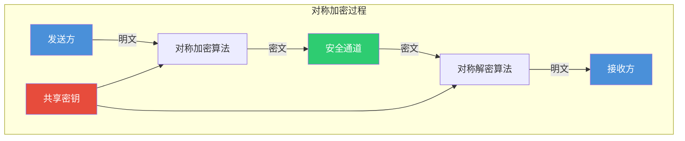

**DES（Data Encryption Standard）**

DES是最著名的对称加密算法，由IBM公司在1970年代开发，1977年被美国国家标准局（NIST）采纳为联邦标准。DES采用56位密钥对64位数据块进行加密，经过16轮迭代运算最终输出64位密文。

DES的加密过程包括初始置换、16轮Feistel迭代和最终置换三个阶段。每一轮迭代都使用48位子密钥对右半部分数据进行替代和置换操作。DES的设计具有较好的混淆和扩散特性，能够有效地抵抗穷举搜索攻击。

然而，随着计算能力的提升，56位密钥长度已经无法提供足够的安全保障。1999年，DES被正式宣布破解。现在，DES仅用于旧系统的兼容，不建议在新系统中使用。

**3DES（Triple DES）**

为了解决DES密钥长度不足的问题，3DES（也称为Triple DES）应运而生。3DES使用两个或三个不同的DES密钥，对数据进行三次DES加密运算。常见的3DES模式包括EDE（Encrypt-Decrypt-Encrypt）和EEE（Encrypt-Encrypt-Encrypt）。

3DES的密钥长度最大可达168位（三个56位密钥），大大提高了安全性。然而，3DES的效率较低，比DES慢约三倍。此外，3DES也存在一些安全弱点，不建议用于新的加密系统。

**AES（Advanced Encryption Standard）**

AES是DES的后继者，于2001年被NIST采纳为新的加密标准。AES采用替代-置换网络结构，支持128位、192位和256位三种密钥长度，分别称为AES-128、AES-192和AES-256。AES对128位数据块进行加密，经过10轮、12轮或14轮迭代（取决于密钥长度）。

AES的设计简洁高效，采用了列混淆、字节替代、行移位等数学运算，在软件和硬件上都能高效实现。AES经过多年的密码分析检验，目前没有发现实质性安全弱点，已成为世界上最广泛使用的对称加密算法。

AES的加密过程可以概括为：字节替代（SubBytes）、行移位（ShiftRows）、列混淆（MixColumns）和轮密钥加（AddRoundKey）四个步骤，最后一轮不进行列混淆操作。这种结构使得AES具有很好的扩散和混淆特性。

**对称加密的优缺点**

对称加密的主要优点包括：加密解密速度快、计算开销小、适合大量数据加密、算法公开接受广泛审查。其主要缺点包括：密钥分发困难，需要安全通道传输密钥、每对通信双方需要独立密钥，密钥管理复杂、不提供身份认证，无法验证通信对方身份。

在实际应用中，对称加密通常与公钥加密结合使用，用公钥加密来分发对称密钥，然后用对称密钥来加密实际数据，这就是混合加密体系的核心思想。

### 7.2.2 非对称加密

非对称加密也称为公钥密码体制，使用一对相关联的密钥：公钥和私钥。公钥可以公开分发，任何人都可以使用公钥加密数据；私钥必须严格保密，只有所有者才能使用私钥解密数据或生成数字签名。

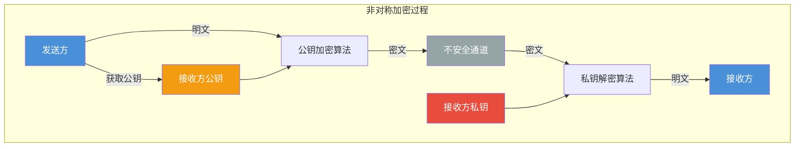

**RSA算法**

RSA是目前最广泛使用的非对称加密算法，由Rivest、Shamir和Adleman三位学者于1977年提出。RSA的安全性基于大数分解难题：给定两个大素数的乘积，很难通过数学方法分解出这两个素数。

RSA算法的工作原理如下：选择两个大素数p和q，计算n=p×q和φ(n)=(p-1)(q-1)；选择一个与φ(n)互素的整数e作为公钥；计算e的模反元素d作为私钥。加密时，计算C≡M^e mod n；解密时，计算M≡C^d mod n。

RSA的密钥长度通常在1024位到4096位之间。为了确保安全，建议使用2048位或更长的密钥。RSA的缺点是加密解密速度较慢，不适合大量数据的加密，通常用于密钥交换、数字签名等场景。

**ECC（Elliptic Curve Cryptography）**

椭圆曲线密码学是一种基于椭圆曲线数学理论的公钥密码体制。ECC相对于RSA的主要优势在于：在相同的安全强度下，ECC使用的密钥长度更短，计算效率更高。

例如，ECC-256提供的安全强度大致相当于RSA-2048，但密钥长度仅为其八分之一。这使得ECC特别适合资源受限的环境，如移动设备、物联网设备等。

ECC的安全性基于椭圆曲线离散对数难题。给定椭圆曲线上的一个点G和整数k，计算点kG是容易的；但给定点G和点kG，计算整数k在计算上是不可行的。

**ECC与RSA对比**

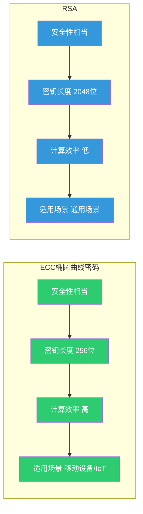

### 7.2.3 混合加密体系

混合加密体系结合了对称加密和非对称加密的优点，用非对称加密来安全地分发对称密钥，然后用对称加密来高效地加密大量数据。这种方式既保证了密钥分发的安全性，又保证了数据加密的效率。

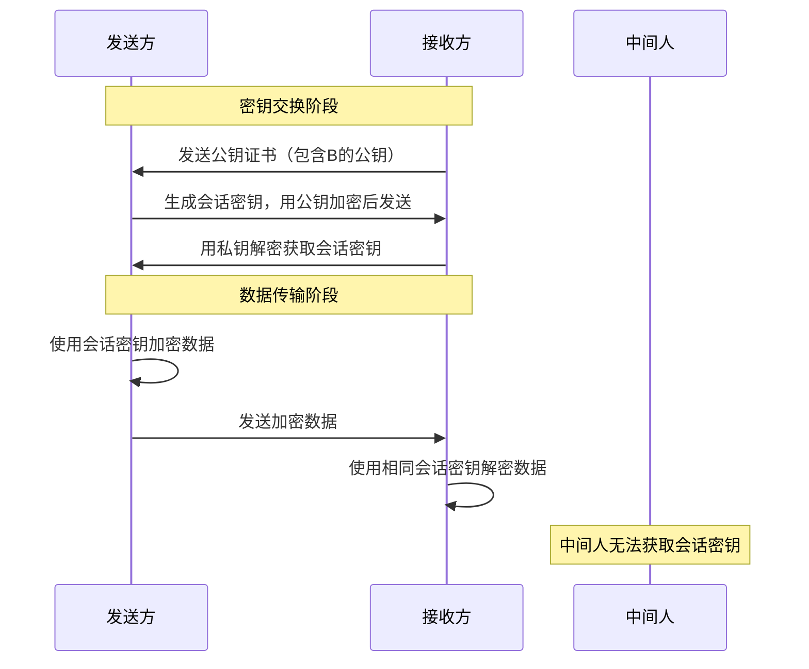

在实际应用中，混合加密体系的工作流程如下：接收方首先生成自己的公私钥对，并从可信的CA获取数字证书；发送方获取接收方的公钥证书并验证其有效性；发送方生成随机的会话密钥，用接收方的公钥加密后发送；接收方用自己的私钥解密获取会话密钥；双方使用会话密钥对数据进行对称加密传输。

TLS/SSL协议就是混合加密体系的典型应用。在TLS握手阶段，客户端使用服务器的公钥加密生成的主密钥（Pre-Master Secret），服务器用私钥解密后，双方基于主密钥导出会话密钥；之后的数据传输使用会话密钥进行对称加密。

### 7.2.4 哈希算法

哈希算法也称为散列函数或杂凑函数，将任意长度的输入通过数学算法转换为固定长度的输出，这个输出称为哈希值或摘要。哈希算法具有单向性，即可以从输入计算哈希值，但无法从哈希值反推原始输入。

**哈希算法的特性**

单向性（One-way）：给定输入可以容易地计算出哈希值，但给定哈希值在计算上不可能还原出原始输入。这使得哈希算法可用于存储密码，即使数据库泄露，攻击者也无法得知用户密码。

抗碰撞性（Collision Resistance）：找到两个不同的输入产生相同哈希值在计算上是不可行的。强抗碰撞性要求找到任意两个不同输入产生相同哈希值；弱抗碰撞性要求给定输入找到另一个不同输入产生相同哈希值。

雪崩效应（Avalanche Effect）：输入的微小变化会导致输出哈希值显着变化。一个位的改变应该导致大约一半的输出位发生变化。这保证了哈希值能够充分反映输入数据的特征。

**MD5（Message-Digest Algorithm 5）**

MD5由Ronald Rivest于1991年设计，产生128位（16字节）哈希值。MD5曾被广泛使用，但已被证明存在碰撞漏洞，不适合用于安全敏感的场景。目前MD5主要用于数据完整性校验等非安全用途。

2004年，中国密码学家王小云教授提出了针对MD5的碰撞攻击方法，可以在短时间内找到产生相同哈希值的两个不同输入。这使得MD5无法防止恶意篡改和伪造。

**SHA-1（Secure Hash Algorithm 1）**

SHA-1由NSA设计，产生160位（20字节）哈希值。SHA-1比MD5具有更长的输出，因此在理论上更安全。然而，2017年Google与荷兰研究机构合作展示了针对SHA-1的碰撞攻击。SHA-1已被淘汰，不建议在任何安全场景中使用。

**SHA-2家族**

SHA-2是SHA-1的后继者，包括SHA-224、SHA-256、SHA-384、SHA-512、SHA-512/224和SHA-512/256等变种。数字后缀表示输出的位长度。SHA-256产生256位哈希值，目前被广泛使用，是大多数安全协议的标准选择。

SHA-2算法采用复杂的压缩函数和 Merkle-Damgård结构，能够有效抵抗已知的各种攻击方法。SHA-256在 TLS、SSH、PGP、S/MIME 等安全协议中都有应用。

**SHA-3家族**

SHA-3采用完全不同的内部结构（Keccak算法），于2015年成为标准。SHA-3不是要取代SHA-2，而是提供了另一种算法选择，以防未来的密码分析突破。SHA-3系列包括SHA3-224、SHA3-256、SHA3-384和SHA3-512。

| 算法 | 输出长度 | 状态 | 推荐程度 |
|------|----------|------|----------|
| MD5 | 128位 | 已破解 | 不推荐 |
| SHA-1 | 160位 | 已淘汰 | 不推荐 |
| SHA-256 | 256位 | 安全 | 推荐 |
| SHA-384 | 384位 | 安全 | 推荐 |
| SHA-512 | 512位 | 安全 | 推荐 |
| SHA3-256 | 256位 | 安全 | 推荐 |

### 7.2.5 数字签名原理

数字签名是公钥密码学的重要应用，用于验证消息的完整性、真实性和不可抵赖性。数字签名相当于纸质文件的手写签名，但使用密码学技术实现，具有更高的安全性和可靠性。

**数字签名的工作原理**

发送方首先对消息进行哈希运算，得到消息摘要；然后使用自己的私钥对摘要进行加密，生成数字签名；将原始消息和数字签名一起发送给接收方。接收方使用发送方的公钥解密签名得到摘要，同时对接收到的消息计算哈希值；如果两个摘要匹配，则签名有效，否则签名无效。

```mermaid
%%{init: {'theme': 'dark', 'themeVariables': {
  'primaryColor': '#4CAF50',
  'primaryTextColor': '#FFFFFF',
  'primaryBorderColor': '#2E7D32',
  'lineColor': '#90CAF9',
  'secondaryColor': '#2196F3',
  'tertiaryColor': '#1E1E1E'
}}%%
sequenceDiagram
    participant A as 发送方
    participant B as 接收方

    rect rgb(40, 60, 80)
    Note over A: 签名生成过程
    A->>A: 对消息M计算哈希值 H(M)
    A->>A: 使用私钥对H(M)加密得到签名S
    A->>B: 发送消息M和签名S
    end

    rect rgb(50, 70, 60)
    Note over B: 签名验证过程
    B->>B: 使用发送方公钥解密S得到H(M)
    B->>B: 对消息M计算哈希值得到H'(M)
    B->>B: 比较H(M)和H'(M)
    alt 哈希值匹配
        B->>B: 签名验证通过
    else 哈希值不匹配
        B->>B: 签名验证失败
    end
    end
```

**数字签名的特性**

身份验证：接收方可以使用发送方的公钥验证签名确实是由对应的私钥生成的，从而确认发送方的身份。这解决了“我是谁”的问题。

完整性验证：如果消息在传输过程中被篡改，接收方计算出的哈希值将与你解密签名得到的哈希值不匹配，从而发现篡改行为。这解决了"消息是否被修改"的问题。

不可抵赖性：发送方使用私钥签名，私钥只有发送方自己知道，因此发送方无法否认自己发送过该消息。这解决了"我是否发送过"的问题。

**RSA数字签名**

RSA是最常用的数字签名算法之一。签名时，签名者使用私钥对消息哈希值进行加密；验证时，验证者使用签名者的公钥解密签名得到哈希值，然后与计算得到的哈希值比较。

RSA签名需要进行模幂运算，效率较低。对于大消息，通常先计算哈希值再签名。签名结果长度等于密钥长度（如2048位）。

**DSA（Digital Signature Algorithm）**

DSA是美国NIST制定的数字签名标准，专门用于数字签名，不具备加密功能。DSA的签名和验证过程比RSA更复杂，但密钥生成速度更快，签名速度相当。

**ECDSA（Elliptic Curve Digital Signature Algorithm）**

ECDSA是ECC与DSA的结合，使用椭圆曲线密码学。ECDSA在相同安全强度下使用更短的密钥，效率更高，已成为许多应用的首选。比特币就是使用ECDSA进行交易签名。

---

## 7.3 数字证书与PKI

### 7.3.1 PKI体系结构

公钥基础设施（Public Key Infrastructure，PKI）是一个综合性的安全架构，用于创建、管理、存储、分发和撤销数字证书。PKI提供了一套完整的解决方案，使得在开放网络环境中进行安全通信和身份认证成为可能。

**PKI的核心组件**

证书颁发机构（Certificate Authority，CA）是PKI的核心，负责证书的颁发、管理和撤销。CA具有自己的公私钥对，其公钥以自签名证书的形式发布。CA负责验证证书申请者的身份，为符合要求的申请者签发数字证书。

注册权威机构（Registration Authority，RA）是CA的延伸，负责证书申请的受理和身份验证。RA通常设置在组织的业务前端，负责收集和验证申请者的身份信息，然后将验证结果提交给CA进行证书签发。大型PKI系统通常有多个RA分布在不同地理位置。

证书存储库（Certificate Repository）用于存储和分发已签发的数字证书。证书存储库通常采用LDAP协议或HTTP协议提供查询服务。用户可以从中检索其他用户的公钥证书。

证书撤销列表（Certificate Revocation List，CRL）是PKI的重要组成部分，包含已被撤销的证书序列号和撤销时间。证书可能因密钥泄露、身份变更、权限终止等原因被撤销。使用者在验证证书时需要检查CRL以确保证书未被撤销。

**PKI体系结构图**

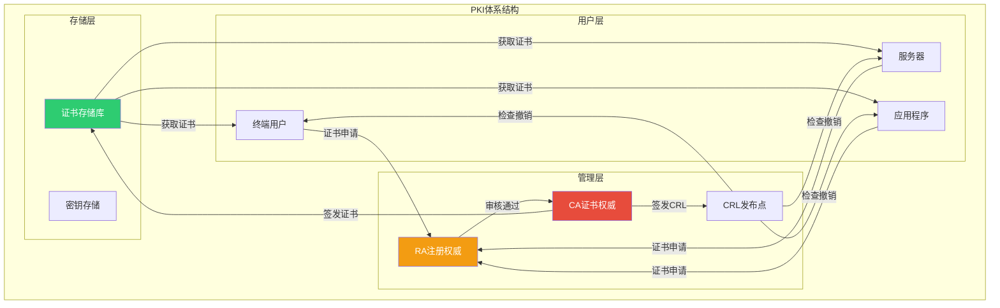

### 7.3.2 数字证书结构与内容

数字证书是将公钥与身份信息绑定的电子凭证，遵循X.509国际标准。X.509证书使用ASN.1（抽象语法标记）进行定义，并通常使用DER或PEM格式编码。

**X.509证书的主要字段**

版本号（Version）标识证书遵循的X.509标准版本。Version 1、Version 2和Version 3分别代表不同版本的格式。Version 3引入了扩展字段，提供了更多的功能。

序列号（Serial Number）是CA为每个证书分配的唯一整数。序列号用于标识证书，在证书撤销和验证过程中起重要作用。CA必须确保其签发的每个证书具有唯一的序列号。

签名算法标识符（Signature Algorithm Identifier）指定CA用于签名该证书的算法，如SHA256withRSA。

颁发者（Issuer）字段标识签发该证书的CA信息，包括国家、组织名称、部门名称和通用名称等。颁发者字段采用X.500命名格式。

有效期（Validity）指定证书的有效时间范围，包括起始日期和终止日期。证书只能在这个时间段内被视为有效。

主体（Subject）字段标识证书持有者的身份信息，与颁发者字段格式相同。主体信息包括国家、组织、部门、通用名称（通常是域名或邮箱）等。

主体公钥信息（Subject Public Key Info）包含证书持有者的公钥以及公钥所属的算法。

证书签名（Certificate Signature）由CA使用其私钥对上述所有字段计算生成的数字签名。

**X.509 v3扩展字段**

版本3引入了扩展字段，用于提供额外的功能。常见扩展包括：

基本约束（Basic Constraints）标识证书是否为CA证书，以及允许的路径深度。CA证书包含此扩展，普通用户证书不包含此扩展。

密钥用法（Key Usage）指定公钥的用途，如数字签名、密钥加密、数据加密、证书签名等。此扩展限制了密钥的使用范围。

扩展密钥用法（Extended Key Usage）提供更细致的密钥用途指定，如服务器认证（1.3.6.1.5.5.7.3.1）、客户端认证（1.3.6.1.5.5.7.3.2）等。

主题备用名称（Subject Alternative Name，SAN）允许证书绑定多个域名或IP地址，增加了证书的灵活性。

证书策略（Certificate Policies）标识证书遵循的政策和对应的认证practice statement，用于表明证书的信任级别。

### 7.3.3 证书颁发机构（CA）

证书颁发机构是PKI系统的核心组件，负责数字证书的签发、存储、发布和管理。

**CA的类型**

根CA（Root CA）是PKI信任链的顶点，通常采用自签名证书。根CA的公钥内置于操作系统、浏览器等软件中，作为信任锚。根CA一般不直接为最终用户签发证书，而是为中间CA签发证书。

中间CA（Intermediate CA）是位于根CA和最终用户证书之间的CA，由根CA为其签发证书。设置中间CA可以提高安全性，即使中间CA的私钥泄露，也可以通过撤销中间CA证书来保护根CA的信任。

运营CA（Operational CA）直接为用户和服务器签发终端实体证书。运营CA通常由中间CA签发，形成多级证书链。

**商业CA与自建CA**

商业CA（如DigiCert、GlobalSign、Let's Encrypt等）提供面向公众的证书服务，通常采用分级CA结构。商业CA的根证书预装在主流操作系统和浏览器中，由这些软件自动信任。

自建CA（也称为私有CA或内部CA）由组织自己建立，用于内部系统。内部CA的根证书需要手动安装到员工的设备上。企业可以使用Microsoft AD CS、OpenSSL等工具建立自建CA。

Let's Encrypt是一个免费的自动化CA，由非营利组织Internet Security Research Group（ISRG）运营。Let's Encrypt提供免费的域名验证（DV）证书，并通过ACME协议实现自动化签发和续期，目前为大量网站提供服务。

**CA的安全要求**

CA是整个PKI系统信任的基础，其安全性至关重要。CA的私钥必须存储在安全的硬件模块（如HSM）中，严格控制访问权限。CA的操作流程需要遵循严格的审计和监督机制。CA还需要建立完善的灾难恢复计划，确保在突发事件下能够恢复服务。

### 7.3.4 证书信任链

证书信任链（Certificate Chain）也称为证书路径（Certificate Path），是由终端实体证书到根CA之间一系列证书组成的链式结构。信任链建立了从终端证书到根CA的信任传递路径。

**信任链的验证过程**

信任链验证从终端实体证书开始，依次向上验证每一级证书，直到根CA。验证过程包括：检查每张证书的签名是否由其颁发者CA的正确公钥验证；检查证书是否在有效期内；检查证书是否被撤销；检查证书的用途是否与声明的用途匹配。

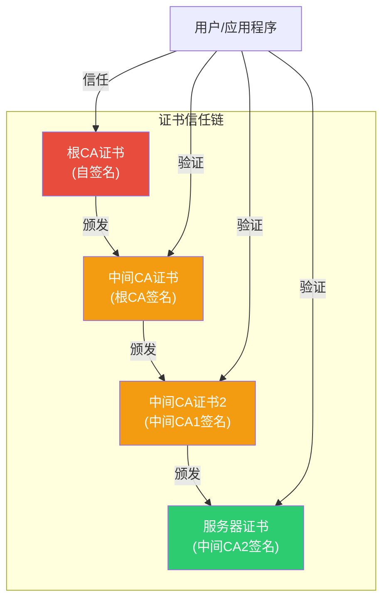

**信任锚**

信任锚（Trust Anchor）是信任链验证的起点，通常是根CA的自签名证书。操作系统、浏览器等软件预置了受信任根CA列表，这些根CA证书就是信任锚。用户也可以手动添加信任锚，但这需要谨慎操作。

**交叉认证**

交叉认证（Cross-Certification）允许不同PKI域之间的CA互相签发证书，建立信任关系。这使得来自不同CA的用户可以互相验证对方的证书。交叉认证证书通常包含特殊扩展，标明其信任限制。

### 7.3.5 证书验证过程

完整的证书验证是一个多步骤过程，需要检查证书的各个方面以确保其可信。

**证书验证的步骤**

首先进行证书链构建。根据目标证书的颁发者信息，在存储的证书中查找对应的颁发者证书，递归构建从终端实体到根CA的完整证书链。如果无法构建完整链，验证失败。

然后进行签名验证。从根CA开始，依次验证链上每张证书的签名，确保每个证书确实由其颁发者签发。签名验证使用颁发者的公钥对证书内容进行计算，并与证书中存储的签名比较。

接下来检查证书有效期。对于证书链上的每张证书，检查当前时间是否在证书的有效期内。如果证书已过期或尚未生效，验证失败。

进行撤销状态检查。向CRL发布点或OCSP服务器查询链上每张证书的撤销状态。如果证书已被撤销，验证失败。撤销检查是防止攻击者使用已泄露私钥对应的证书的关键步骤。

最后验证证书策略和用途。检查证书是否包含与预期用途匹配的策略声明和密钥用途扩展。例如，服务器证书必须包含服务器认证用途。

**OCSP（Online Certificate Status Protocol）**

OCSP是一种实时查询证书撤销状态的协议，相比CRL提供更及时的撤销信息。客户端向OCSP服务器发送证书序列号，服务器返回证书的当前状态（正常、已撤销、未知）。

OCSP减轻了客户端的负担，无需下载和处理整个CRL。同时，OCSP也带来隐私问题，因为OCSP请求会暴露用户访问的网站信息。为解决这个问题，出现了OCSP stapling技术，服务器预先获取并缓存OCSP响应，在TLS握手时提供给客户端。

**证书透明（Certificate Transparency，CT）**

CT是一个用于监测和审计证书签发的框架。CA在签发证书时，必须将证书提交到CT日志服务器。域名所有者可以监控CT日志，发现未经授权签发的证书。

CT通过三大组件实现：CT日志服务器接收并存储证书提交；CT监视器监控CT日志，发现异常签发行为；CT公证人验证CT日志的正确性和一致性。Chrome、Firefox等浏览器要求某些证书必须记录在CT日志中。

---

## 7.4 防火墙

### 7.4.1 防火墙的功能

防火墙是网络安全的核心设备，位于不同安全域之间，根据预定义的安全策略对网络流量进行过滤和控制。防火墙的主要功能包括访问控制、安全审计、边界防护和日志记录。

**访问控制**

访问控制是防火墙最核心的功能。防火墙根据源地址、目的地址、端口号、协议类型等信息，按照安全策略决定是否允许数据包通过。例如，企业可以配置防火墙只允许外部用户访问Web服务器的80和443端口，而阻止对内部数据库服务器的访问。

访问控制策略可以是白名单模式（默认拒绝，只允许明确允许的流量）或黑名单模式（默认允许，只禁止明确拒绝的流量）。白名单模式更安全，但配置更复杂。

**安全审计**

防火墙能够记录所有通过的安全策略的流量信息，生成详细的日志。这些日志包含连接的时间、源IP、目的IP、端口、协议、处理结果（允许或拒绝）等信息。安全审计日志对于分析网络攻击、排查故障、合规审计都有重要价值。

现代防火墙还提供实时告警功能，当检测到可疑流量或违反安全策略的行为时，能够立即向管理员发出通知。

**边界防护**

防火墙作为不同安全域之间的边界，控制着跨边界的流量。在企业网络中，通常将Internet作为不可信区域，内部网络作为可信区域，DMZ（非军事区）作为半信任区域。防火墙控制着这些区域之间的流量，是网络安全的第一道防线。

**NAT功能**

很多防火墙还提供网络地址转换（NAT）功能。NAT将内部私有IP地址转换为公共IP地址，实现多个内部主机共享少量公共IP地址。NAT隐藏了内部网络结构，增加了网络的安全性。

### 7.4.2 防火墙类型

**包过滤防火墙**

包过滤防火墙是最基本的防火墙类型，在网络层工作，检查每个数据包的头部信息，包括源IP地址、目的IP地址、源端口、目的端口、协议类型等。根据预定义的规则集，防火墙决定放行还是丢弃数据包。

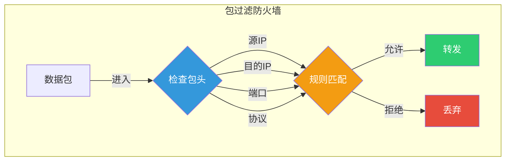

包过滤防火墙的优点是处理速度快、配置简单、成本低。但包过滤只能检查数据包的头部信息，无法检查数据内容，无法识别应用层协议，也无法跟踪连接状态。攻击者可能通过IP欺骗绕过包过滤规则。

**状态检测防火墙**

状态检测防火墙（也称为动态包过滤）在包过滤的基础上增加了连接状态跟踪能力。它维护一个连接状态表，记录所有活跃连接的状态信息。当数据包到达时，防火墙不仅检查规则，还检查这个数据包是否属于已建立的合法连接。

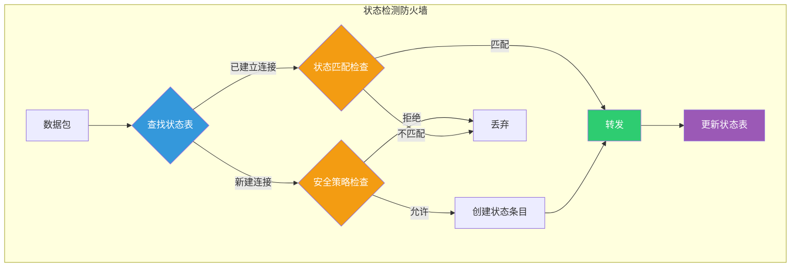

状态检测防火墙能够识别和跟踪TCP会话，理解三次握手过程。只有匹配已建立连接的数据包才被允许通过，大大提高了安全性。同时，由于只检查新建连接的包，性能也比全流检测高。

**应用层网关防火墙**

应用层网关（Application Layer Gateway，ALG）也称为代理防火墙，在应用层工作。代理防火墙不直接转发数据包，而是在客户端和服务器之间充当中介。客户端与代理建立连接，代理再与服务器建立连接，两个连接之间转发数据。

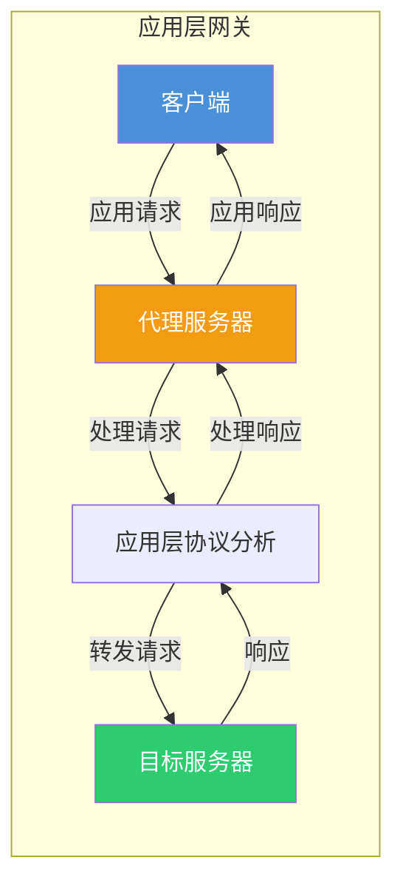

代理防火墙能够理解特定应用协议（如HTTP、FTP、SMTP），可以执行更精细的安全检查。例如，HTTP代理可以检查URL、过滤特定内容、缓存常用资源。代理防火墙还隐藏了内部网络的真实结构。

代理防火墙的缺点是性能较低，因为每个数据包都需要在应用层进行处理；支持的应用协议有限，配置复杂。

**下一代防火墙**

下一代防火墙（Next-Generation Firewall，NGFW）集成了传统防火墙的功能与应用识别、入侵防御、用户识别、内容过滤等高级功能。NGFW能够识别应用层协议，对应用进行精细化控制，而不仅仅依赖端口和协议。

NGFW的主要特性包括：应用感知和管控、集成IPS/IDS功能、用户身份集成、威胁情报集成、高級恶意软件检测。代表性产品包括Palo Alto Networks、Fortinet、Cisco ASA等。

### 7.4.3 防火墙部署方式

**单点部署**

最简单的方式是单防火墙部署，防火墙位于内部网络与Internet之间，所有进出流量都必须经过防火墙。这种部署方式适合小型网络或作为网络边界防护的第一道防线。

**DMZ部署**

DMZ（Demilitarized Zone，非军事区）是一种更安全的部署方式，使用双防火墙或三防火墙架构。将需要对外提供服务的服务器（如Web服务器、邮件服务器）部署在DMZ区域，DMZ与Internet和内部网络之间分别设置防火墙。

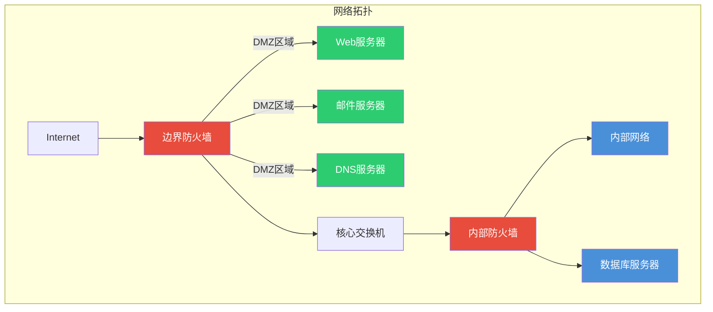

外部防火墙控制Internet到DMZ和Internet到内部网络的流量；内部防火墙控制DMZ到内部网络以及内部网络之间的流量。即使DMZ中的服务器被攻破，攻击者仍然无法直接访问内部网络。

**高可用性部署**

对于关键业务系统，需要配置高可用性（HA）防火墙方案。两台防火墙配置为HA模式，一台作为主设备，另一台作为备用设备。主设备故障时，备用设备自动接管，确保网络连接的连续性。

HA部署通常使用专用心跳线检测对端状态，采用配置同步和状态同步机制确保故障切换的透明性。

### 7.4.4 防火墙的局限

**防火墙的防护范围有限**

防火墙只能控制通过它的流量，对于不经过防火墙的流量（如内部攻击、直接物理接入）无法防护。在内部网络中的横向移动攻击，防火墙无法检测和阻止。

**应用层攻击**

传统防火墙主要工作在网络层和传输层，对于应用层攻击（如SQL注入、跨站脚本）的防护能力有限。攻击者可能利用HTTP等合法协议携带恶意内容绕过防火墙。解决这一问题需要配合WAF（Web应用防火墙）等专业设备。

**加密流量**

随着HTTPS的普及，大量恶意流量也采用加密传输。防火墙如果无法解密和检查加密流量，就无法识别其中的威胁。解决方案包括SSL/TLS解密、证书检查、蜜罐技术等。

**内部威胁**

防火墙主要防护来自外部的威胁，对于内部人员滥用权限或内部网络被攻陷后的横向攻击，防火墙的防护能力有限。应对内部威胁需要结合身份认证、访问控制、安全审计等多重措施。

**DDoS攻击**

防火墙本身可能成为DDoS攻击的目标。大量的合法请求可能耗尽防火墙的处理能力，导致无法处理正常流量。需要配合抗DDoS设备或云端DDoS防护服务。

---

## 7.5 VPN技术

### 7.5.1 VPN原理与作用

虚拟专用网络（Virtual Private Network，VPN）利用公网或其他不可信网络作为传输介质，通过加密和隧道技术，建立虚拟的专用网络，实现安全的远程访问和站点间互联。

**VPN的核心原理**

VPN的核心是隧道技术，将数据包封装在另一种协议中传输。隧道两端的设备（称为隧道端点）对原始数据包进行加密和封装，然后在公共网络上传输。到达对端后，进行解封装和解密，还原原始数据包。

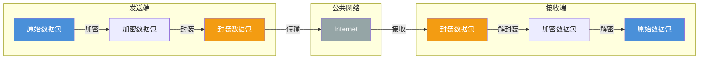

**VPN的作用**

VPN解决了远程办公和分布式企业的网络安全需求。在没有VPN的情况下，远程员工直接访问公司内部资源，所有流量都暴露在公网上，存在严重的安全风险。通过VPN，所有流量都经过加密传输，即使在公共WiFi等不安全环境中，也能保证通信安全。

VPN还常用于跨地域企业的站点间互联。通过VPN，可以在公网上建立虚拟的专用网络，连接不同地理位置的办公室，实现像在同一个局域网内一样的安全通信，相比租用专线成本更低。

VPN可以绕过地理限制，通过连接到其他地区的VPN服务器，用户可以访问该地区的内容和服务。但这种用途存在争议，可能违反服务条款。

### 7.5.2 VPN隧道技术

**PPTP（Point-to-Point Tunneling Protocol）**

PPTP是最早的VPN协议之一，由微软公司主导开发。PPTP在PPP协议基础上建立隧道，使用TCP端口1723进行控制通道协商，GRE（通用路由封装）协议进行数据通道传输。

PPTP的优缺点：配置简单，Windows系统原生支持；兼容性好在；安全性较低，MS-CHAPv2认证存在已知的弱点；容易被防火墙阻断。

**L2TP（Layer 2 Tunneling Protocol）/L2TP/IPsec**

L2TP由Cisco和Microsoft联合开发，结合了L2F和PPTP的优点。L2TP本身不提供加密，通常与IPsec结合使用，形成L2TP/IPsec方案，提供更强的安全性。

L2TP/IPsec的工作流程：首先使用IPsec建立安全关联（SA）；然后L2TP在IPsec加密通道中建立隧道；PPP帧封装在L2TP中传输。L2TP/IPsec通常使用UDP端口500、4500进行NAT穿越。

优点：安全性较高，IPsec提供强大的加密和认证；支持NAT穿越；跨平台兼容性较好。缺点：配置复杂；性能开销较大。

**IPsec（Internet Protocol Security）**

IPsec是一个综合性的安全协议套件，为IP层通信提供加密和认证服务。IPsec包含两个主要协议：AH（Authentication Header）和ESP（Encapsulating Security Payload）。

AH提供数据完整性保护和源认证，不加密数据；ESP提供加密、完整性保护和源认证。IPsec支持传输模式和隧道模式：传输模式只加密数据载荷，保持IP头不变；隧道模式加密整个IP数据包，添加新的IP头。

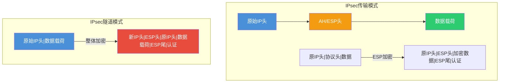

IPsec的优点：安全性高，是目前最安全的VPN协议之一；标准化程度高，跨厂商兼容性；网络层透明，不需要应用配合。缺点：配置复杂；某些环境下可能被防火墙阻断；需要客户端软件。

### 7.5.3 SSL VPN

SSL VPN基于SSL/TLS协议，利用浏览器作为客户端，通过HTTPS连接访问企业内部资源。SSL VPN不需要安装专用客户端（或只需轻量级插件），使用标准Web浏览器即可访问，特别适合远程办公和移动办公场景。

**SSL VPN的工作原理**

用户通过Web浏览器访问SSL VPN网关，使用用户名密码或数字证书进行身份认证。认证成功后，用户可以访问授权的企业内部资源。SSL VPN网关作为反向代理，将用户请求转发给内部服务器。

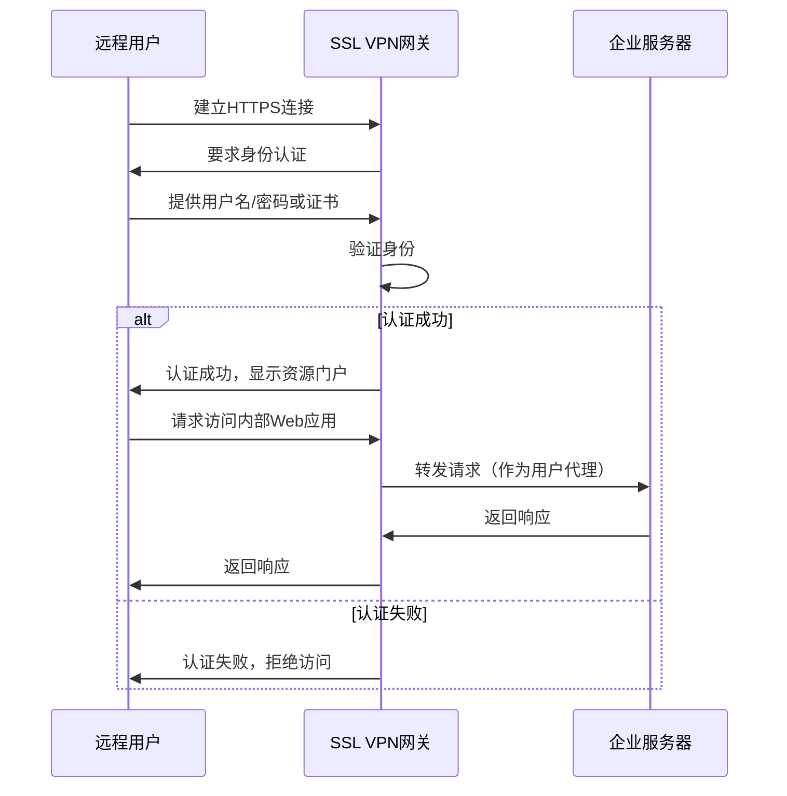

**SSL VPN的类型**

SSL VPN门户（Web VPN）提供基于Web的企业资源访问。用户通过浏览器登录SSL VPN门户，可以访问Web应用、查看文件、使用Web化的客户端程序。门户型SSL VPN配置简单，但只能访问Web应用。

SSL VPN隧道提供更全面的网络访问。安装SSL VPN客户端后，可以建立完整的IP隧道，支持TCP/UDP各种协议的应用。隧道型SSL VPN提供类似IPsec VPN的全面访问能力，但通过SSL/TLS传输，兼容性更好。

**SSL VPN与IPsec VPN对比**

| 特性 | SSL VPN | IPsec VPN |
|------|---------|-----------|
| 客户端 | 无需专用客户端，浏览器即可 | 需要专用客户端软件 |
| 兼容性 | 跨平台，易于使用 | 需要安装软件，配置复杂 |
| 安全性 | 基于SSL/TLS，安全性高 | 基于IPsec，安全性高 |
| 访问类型 | 主要用于远程访问 | 远程访问和站点间互联 |
| 网络层级 | 应用层 | 网络层 |
| NAT穿越 | 天然支持 | 需要额外配置 |

### 7.5.4 VPN应用场景

**远程办公访问**

员工在家庭、公共场所或分支机构通过VPN连接到公司网络，安全访问内部应用系统、文件服务器、数据库等资源。SSL VPN特别适合这种场景，员工只需通过浏览器即可访问，无需安装客户端软件。

**站点间互联**

跨地域的企业办公室、数据中心之间通过VPN建立安全连接，形成统一的专用网络。相比传统的MPLS专线，VPN成本更低，部署更灵活。对于中小型企业，站点间VPN是实现分布式组网的经济实惠方案。

**合作伙伴接入**

企业可能需要与供应商、客户、渠道商等外部合作伙伴共享特定资源。通过VPN在企业与合作伙网络之间建立受控的连接，只允许访问必要的资源，实现安全可控的外部访问。

**云服务安全访问**

随着云计算的普及，企业将敏感数据和关键业务系统迁移到云端。通过VPN建立企业网络与云服务之间的安全通道，确保云端资源访问的安全性和可控性。云专线是针对云服务优化的VPN解决方案。

**移动设备安全**

智能手机和平板电脑等移动设备需要安全访问企业内部资源。SSL VPN支持多种移动平台，可以为移动设备提供安全的远程访问能力。部分企业还采用MDM（移动设备管理）与VPN结合的方案，实现设备级的安全管控。

---

## 7.6 工程示例：企业网络安全方案

### 7.6.1 中小企业网络安全架构设计

本节以一家拥有100名员工的中小型制造企业为例，设计其网络安全架构。该企业已建立基本的网络基础设施，包括内部局域网、Internet接入和若干业务服务器。

**网络现状分析**

该企业网络目前面临的主要安全威胁包括：员工安全意识不足，可能访问恶意网站或下载恶意软件；远程办公需求增加，需要安全的远程访问手段；与合作伙伴存在数据交换需求；核心业务数据需要保护，防止泄露和篡改。

**网络安全架构设计**

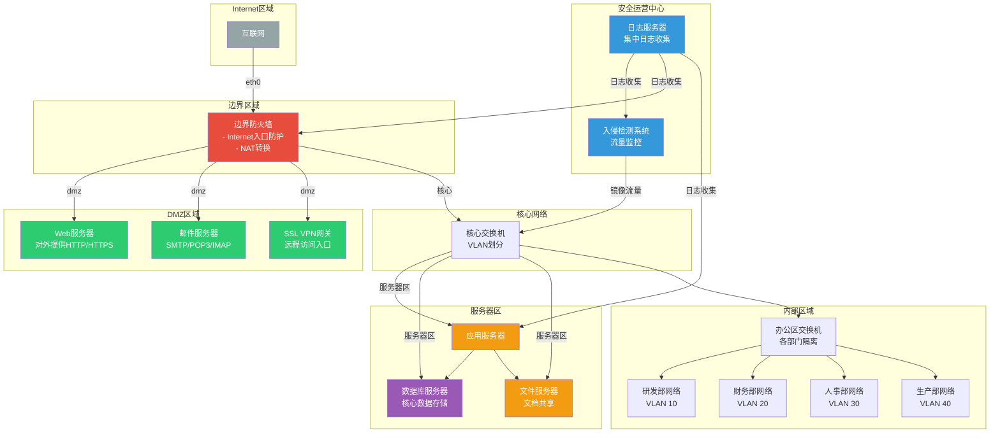

**网络安全域划分**

根据业务特性和安全需求，将网络划分为四个安全域：

Internet边界域：所有直接面向Internet的服务，包括边界防火墙、负载均衡器等。Internet边界是防护的第一线，配置最严格的访问控制策略。

DMZ域：对外提供服务的系统，如Web服务器、邮件服务器、SSL VPN网关等。这些服务器可能被攻击者直接接触，需要重点防护。

服务器域：内部应用服务器、数据库服务器、文件服务器等核心业务系统。只允许来自内部网络的访问，不对Internet开放。

办公网域：员工终端所在网络，按部门划分VLAN实施隔离。办公网到服务器域的访问需要通过防火墙控制。

### 7.6.2 防火墙规则配置

防火墙是企业网络安全的核心设备，合理配置防火墙规则至关重要。以下是该企业边界防火墙的规则配置示例。

**基本策略配置**

```bash
# 防火墙命名和基本设置
hostname: Edge-FW-01
timezone: Asia/Shanghai
set date 2026-05-23

# 定义安全区域
set zone name Internet
set zone name DMZ
set zone name Internal

# 定义接口并绑定区域
set interface eth0 zone Internet
set interface eth1 zone DMZ
set interface eth2 zone Internal

# 默认策略：拒绝所有
set policy default drop
```

**入站规则配置**

```bash
# 允许外部访问DMZ的Web服务
# HTTP (TCP 80)
set policy from Internet to DMZ any web-server 80 permit
# HTTPS (TCP 443)
set policy from Internet to DMZ any web-server 443 permit

# 允许外部访问邮件服务的SMTP
set policy from Internet to DMZ any mail-server 25 permit
set policy from Internet to DMZ any mail-server 465 permit
set policy from Internet to DMZ any mail-server 587 permit

# 允许外部访问SSL VPN网关
set policy from Internet to DMZ any vpn-gateway 443 permit

# 禁止外部访问其他所有端口
set policy from Internet to DMZ any any any deny
```

**出站规则配置**

```bash
# 允许内部用户访问Internet HTTP/HTTPS
set policy from Internal to Internet any any 80 permit
set policy from Internal to Internet any any 443 permit

# 允许内部用户访问外部邮件
set policy from Internal to Internet any any 25 permit
set policy from Internal to Internet any any 110 permit

# 允许内部用户使用DNS
set policy from Internal to Internet any any 53 permit

# 禁止P2P软件
set policy from Internal to Internet any any 6881-6889 deny

# 禁止外部源地址欺骗
set policy from Internet to Internal 10.0.0.0/8 any deny
set policy from Internet to Internal 172.16.0.0/12 any deny
set policy from Internet to Internal 192.168.0.0/16 any deny
```

**服务器域访问规则**

```bash
# 允许办公网访问应用服务器
set policy from Internal to Server any app-server 8080 permit
set policy from Internal to Server any app-server 443 permit

# 允许应用服务器访问数据库
set policy from Server to Database app-server 3306 permit
set policy from Server to Database app-server 1433 permit

# 禁止办公网直接访问数据库
set policy from Internal to Database any any deny

# 禁止DMZ访问内部网络
set policy from DMZ to Internal any any deny
```

**VPN访问规则**

```bash
# 允许SSL VPN用户访问内部网络
set policy from DMZ to Internal vpn-users any permit

# 限制VPN用户只能访问特定网段
set policy from DMZ to Internal vpn-users 10.10.10.0/24 permit
set policy from DMZ to Internal vpn-users 10.10.20.0/24 deny

# VPN用户访问日志记录
set policy log from DMZ to Internal vpn-users any permit log
```

**配置验证和备份**

```bash
# 查看当前配置
show config

# 验证规则语法
commit check

# 提交配置生效
commit

# 配置备份
backup config to ftp://backup-server/fw-config/edge-fw-01-20260523.cfg
```

### 7.6.3 IPSec VPN配置

该企业在北京和上海各有一个办公室，需要通过IPSec VPN实现站点间安全互联。以下是双方路由器/防火墙的IPSec VPN配置示例。

**北京总部配置**

```bash
# 北京总部防火墙VPN配置
hostname: BJ-FW-01

# 定义IPSec VPN参数
set vpn ipsec proposal BJ-proposal
set vpn ipsec proposal BJ-proposal encryption aes256
set vpn ipsec proposal BJ-proposal hash sha256
set vpn ipsec proposal BJ-proposal lifetime 3600

# 定义IKE协商参数
set vpn ike proposal BJ-ike-proposal
set vpn ike proposal BJ-ike-proposal encryption aes256
set vpn ike proposal BJ-ike-proposal hash sha256
set vpn ike proposal BJ-ike-proposal dh-group 14
set vpn ike proposal BJ-ike-proposal lifetime 86400

# 配置预共享密钥（生产环境应使用证书认证）
set vpn ike keypair BJ-keypair
set vpn ike keypair BJ-keypair pre-shared-key "Str0ngP@ssw0rd!2026"

# 创建VPN隧道
set vpn ipsec tunnel BJ-SH
set vpn ipsec tunnel BJ-SH local-address 203.0.113.10
set vpn ipsec tunnel BJ-SH remote-address 198.51.100.20
set vpn ipsec tunnel BJ-SH proposal BJ-proposal
set vpn ipsec tunnel BJ-SH ike-proposal BJ-ike-proposal
set vpn ipsec tunnel BJ-SH keypair BJ-keypair

# 配置感兴趣流：北京内网 <-> 上海内网
set vpn ipsec tunnel BJ-SH local-subnet 10.10.0.0/16
set vpn ipsec tunnel BJ-SH remote-subnet 10.20.0.0/16

# 配置路由
set route 10.20.0.0/16 via tunnel BJ-SH

# DPD（死亡对等体检测）配置
set vpn ipsec tunnel BJ-SH dpd enable
set vpn ipsec tunnel BJ-SH dpd interval 10
set vpn ipsec tunnel BJ-SH dpd action hold
```

**上海办公室配置**

```bash
# 上海办公室防火墙VPN配置
hostname: SH-FW-01

# 定义IPSec VPN参数
set vpn ipsec proposal SH-proposal
set vpn ipsec proposal SH-proposal encryption aes256
set vpn ipsec proposal SH-proposal hash sha256
set vpn ipsec proposal SH-proposal lifetime 3600

# 定义IKE协商参数
set vpn ike proposal SH-ike-proposal
set vpn ike proposal SH-ike-proposal encryption aes256
set vpn ike proposal SH-ike-proposal hash sha256
set vpn ike proposal SH-ike-proposal dh-group 14
set vpn ike proposal SH-ike-proposal lifetime 86400

# 配置预共享密钥（必须与北京一致）
set vpn ike keypair SH-keypair
set vpn ike keypair SH-keypair pre-shared-key "Str0ngP@ssw0rd!2026"

# 创建VPN隧道
set vpn ipsec tunnel SH-BJ
set vpn ipsec tunnel SH-BJ local-address 198.51.100.20
set vpn ipsec tunnel SH-BJ remote-address 203.0.113.10
set vpn ipsec tunnel SH-BJ proposal SH-proposal
set vpn ipsec tunnel SH-BJ ike-proposal SH-ike-proposal
set vpn ipsec tunnel SH-BJ keypair SH-keypair

# 配置感兴趣流：上海内网 <-> 北京内网
set vpn ipsec tunnel SH-BJ local-subnet 10.20.0.0/16
set vpn ipsec tunnel SH-BJ remote-subnet 10.10.0.0/16

# 配置路由
set route 10.10.0.0/16 via tunnel SH-BJ

# DPD配置
set vpn ipsec tunnel SH-BJ dpd enable
set vpn ipsec tunnel SH-BJ dpd interval 10
set vpn ipsec tunnel SH-BJ dpd action hold
```

**VPN连接测试和监控**

```bash
# 测试VPN隧道状态
show vpn ipsec tunnel BJ-SH status

# 查看IKE SA
show vpn ike sa

# 查看IPSec SA
show vpn ipsec sa

# 测试隧道连通性
ping 10.20.1.1 source 10.10.1.1

# 查看VPN日志
show log vpn
```

### 7.6.4 网络安全审计

网络安全审计是保障网络安全的重要环节，通过系统化的审计活动，可以发现安全漏洞、验证安全措施的有效性、满足合规要求。

**审计内容与周期**

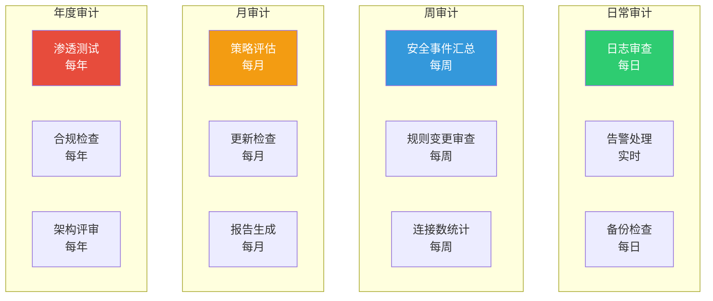

**日志审计配置**

```bash
# 集中日志收集配置
set log server 10.10.50.100
set log server 10.10.50.100 port 514
set log server protocol udp

# 日志级别配置
set log level info
set log category vpn level warn
set log category firewall level notice
set log category system level error

# 日志保留策略
set log retention days 90
set log archive enable
set log archive destination ftp://log-server/logs/

# 告警规则配置
set alert vpn tunnel down
set alert firewall connection-limit exceeded 10000
set alert system certificate expiring days 30
```

**定期安全检查清单**

```bash
# 防火墙规则检查
echo "=== 防火墙规则检查 ==="
show policy all
echo "--- 检查未使用的规则 ---"
show policy unused count

# 用户和认证检查
echo "=== 用户账户检查 ==="
show users
show users admin
show users vpn

# 证书状态检查
echo "=== 证书有效期检查 ==="
show certificates
show certificates expiry-date

# 系统资源检查
echo "=== 系统资源状态 ==="
show system cpu
show system memory
show system disk

# 攻击日志检查
echo "=== 近期安全事件 ==="
show log category attack | last 50
show log category firewall denied | last 20
```

**安全审计报告模板**

```
========================================
        企业网络安全审计报告
        审计周期：2026年5月
========================================

一、审计概述
   审计时间：2026-05-23
   审计范围：边界防火墙、SSL VPN、IPSec VPN、服务器区
   审计依据：GB/T 22239-2019 网络安全等级保护基本要求

二、网络安全状况

   2.1 防火墙运行状态
       - 设备运行时间：XXX天
       - CPU平均使用率：XX%
       - 内存平均使用率：XX%
       - 当前活跃会话数：XXXX

   2.2 攻击统计
       - 本月阻断攻击次数：XXX
       - 主要攻击类型：DoS SYN Flood、端口扫描
       - 来源地区分布：XXX

   2.3 VPN使用情况
       - SSL VPN并发用户数：XX
       - IPSec VPN隧道状态：正常
       - 本月VPN登录次数：XXX

三、风险发现与处置

   3.1 高风险
       - [HIGH-001] 检测到弱密码策略，建议启用双因素认证
         状态：处理中

   3.2 中风险
       - [MED-001] 防火墙固件版本过旧
         状态：已计划下周更新
       - [MED-002] 部分安全规则未启用日志
         状态：已修复

   3.3 低风险
       - [LOW-001] 日志保留期限为90天，建议增加到180天
         状态：评估中

四、合规检查

   | 检查项              | 要求           | 实际状态  | 结果 |
   |---------------------|----------------|-----------|------|
   | 密码复杂度          | 8位以上含特殊  | 12位含特殊 | 通过 |
   | 登录失败锁定        | 5次            | 3次       | 通过 |
   | 日志保留期限        | 90天           | 90天      | 通过 |
   | 重要数据加密        | AES-256        | AES-256   | 通过 |

五、建议与改进

   1. 建议部署Web应用防火墙，保护DMZ中的Web服务器
   2. 建议增加APT（高级持续性威胁）检测系统
   3. 建议完善数据备份机制，建立异地灾备中心
   4. 建议每季度进行一次员工安全意识培训

六、下次审计计划
   计划时间：2026-06-23
   重点关注：固件更新实施、双因素认证部署

========================================
           审计人：XXX    审核人：XXX
========================================
```

**应急响应流程**

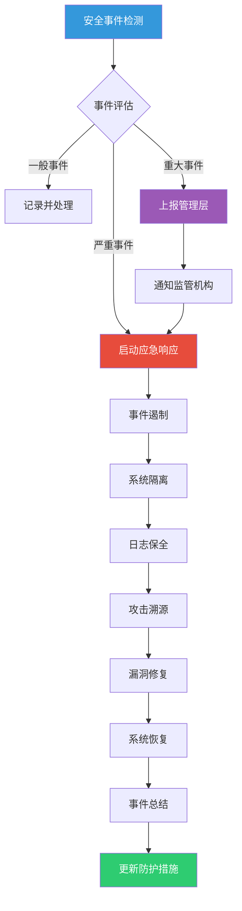

---

## 本章小结

本章系统介绍了网络安全的核心知识体系。在网络安全概述部分，我们学习了网络安全威胁的类型、安全攻击的分类方法（主动攻击与被动攻击）、网络安全的五大目标（机密性、完整性、可用性、可控性、可审查性），以及PDR和P2DR等安全模型。

加密技术是网络安全的基石。我们详细讲解了对称加密算法（DES、3DES、AES）和非对称加密算法（RSA、ECC）的工作原理，分析了混合加密体系如何结合两者优点实现安全高效的数据传输。哈希算法（MD5、SHA系列）和数字签名技术则为数据完整性保护和身份认证提供了可靠手段。

数字证书与PKI体系解决了公钥分发和信任传递问题。我们了解了PKI的体系结构、X.509数字证书的结构与内容、CA的职责与类型、证书信任链的验证机制，以及OCSP等证书验证技术。

防火墙作为网络边界的重要防护设备，其类型包括包过滤防火墙、状态检测防火墙、应用层网关防火墙和下一代防火墙。合理的防火墙部署架构能够有效保护内部网络安全。

VPN技术通过隧道和加密技术，在公共网络上建立安全的虚拟专用网络。我们学习了PPTP、L2TP/IPsec、IPsec和SSL VPN等主流VPN技术及其应用场景。

通过企业网络安全方案的工程示例，我们将理论知识与实践相结合，设计了完整的中小型企业网络安全架构，包括防火墙规则配置、IPSec VPN站点间互联配置，以及系统化的网络安全审计流程。

---

## 思考题

1. 解释主动攻击与被动攻击的区别，并各举两个实际攻击案例。

2. 对称加密和非对称加密各有什么优缺点？为什么实际系统中通常采用混合加密方式？

3. 数字签名如何实现身份认证、完整性和不可抵赖性？请描述数字签名的工作流程。

4. PKI体系中的信任链是如何建立的？根CA和中间CA各自的作用是什么？

5. 包过滤防火墙、状态检测防火墙和应用层网关防火墙有什么区别？各自适合什么场景？

6. SSL VPN和IPsec VPN有什么区别？各适合什么应用场景？

7. 设计一个安全的远程办公方案，需要考虑哪些安全因素？
