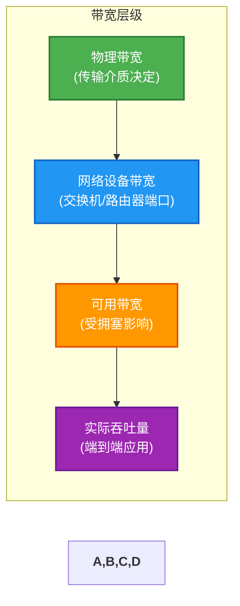
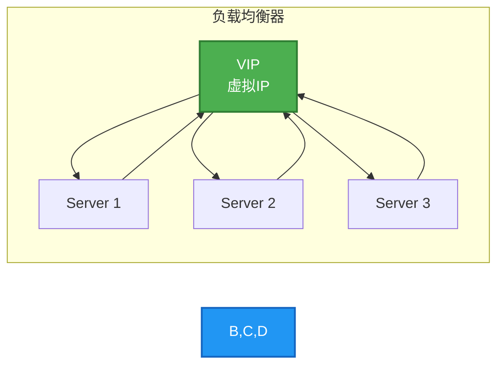
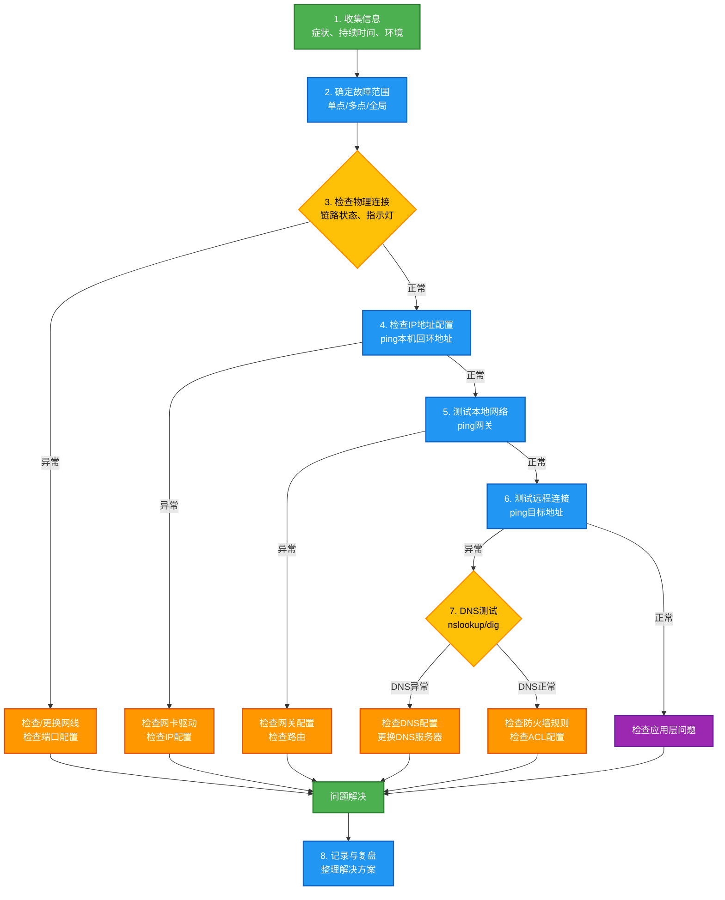
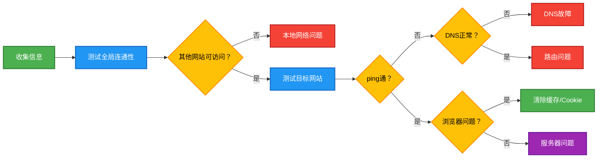
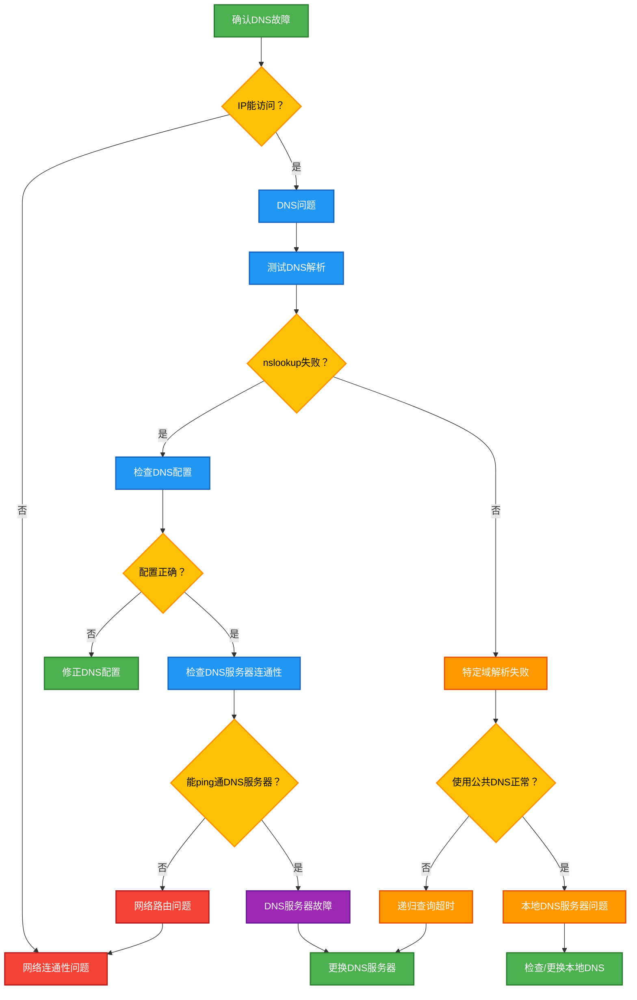

# 第八章：网络性能与故障排查

网络性能与故障排查是网络工程中最具实践性的内容之一。本章将介绍评估网络性能的关键指标、常用的性能优化方法，以及系统化的故障排查流程。通过学习本章内容，读者将能够独立诊断和解决常见的网络问题。

---

## 8.1 网络性能指标

网络性能指标是评估网络质量的核心标准，理解这些指标对于网络设计、运维和故障排查都至关重要。

### 8.1.1 带宽（Bandwidth）

带宽是指网络连接能够传输数据的最大速率，通常以比特每秒（bps）为单位表示。在数字通信中，带宽指的是单位时间内能够通过链路传输的最大数据量。

带宽分为两种类型：**物理带宽**和**实际可用带宽**。物理带宽由传输介质的物理特性决定，例如双绞线的带宽通常为100MHz至250MHz，光纤的带宽则可以达到数十THz。实际可用带宽则受到网络设备、协议开销、拥塞程度等多种因素影响，往往远低于物理带宽。

在实际应用中，带宽的单位通常使用倍数前缀：Kbps（千比特每秒）、Mbps（兆比特每秒）、Gbps（吉比特每秒）。需要注意的是，这里使用的是比特（bit），而不是字节（Byte）。1 Byte = 8 bits，所以在转换时需要除以8。

例如，千兆以太网（Gigabit Ethernet）的标称带宽为1 Gbps，但在实际使用中，由于协议开销（如以太网帧间隙、前导码等），最大有效载荷吞吐量约为125 MB/s（1000 Mbps / 8 = 125 MB/s）。



### 8.1.2 吞吐量（Throughput）

吞吐量是指单位时间内实际传输的数据量，它反映了网络在实际工作中的表现。与带宽是理论最大值不同，吞吐量是实际测量值，受到多种因素的影响。

影响吞吐量的主要因素包括：网络延迟、丢包率、协议效率、数据包大小、以及并发连接数等。在理想的网络环境下，吞吐量可以接近带宽值；但在现实网络中，由于各种损耗因素，吞吐量通常会低于带宽。

吞吐量的测量通常使用以下公式：

```
吞吐量 = 传输的数据总量 / 测量时间
```

在评估网络性能时，吞吐量是一个更为重要的指标，因为它直接反映了用户实际感受到的网络速度。例如，一条标称带宽为100 Mbps的网络链路，如果吞吐量只有60 Mbps，那么用户在传输文件时，感受到的速度就是60 Mbps，而不是100 Mbps。

### 8.1.3 时延（Latency）

时延是指数据从发送端到接收端所需的时间，通常以毫秒（ms）为单位。时延是评估网络性能的关键指标之一，尤其对于实时应用（如VoIP、视频会议、在线游戏等）至关重要。

时延由多个部分组成，主要包括：

**传播时延（Propagation Delay）**：信号在传输介质中传播所需的时间，取决于介质的物理特性和传播距离。计算公式为：传播时延 = 距离 / 传播速度。例如，光信号在光纤中的传播速度约为2 × 10^8 m/s（北京到上海约1200km，传播时延约6ms）。

**传输时延（Transmission Delay）**：将数据包的所有比特推送到传输介质所需的时间，取决于数据包大小和链路带宽。计算公式为：传输时延 = 数据包大小（bits）/ 带宽（bps）。

**处理时延（Processing Delay）**：网络设备（如路由器、交换机）对数据包进行处理所需的时间，包括检查首部、查找路由等操作。

**排队时延（Queuing Delay）**：数据包在网络设备中等待处理的时间，当设备繁忙时，数据包需要在队列中等待。

总时延的计算公式为：

```
总时延 = 传播时延 + 传输时延 + 处理时延 + 排队时延
```


在互联网中，典型的时延范围如下：本地网络（LAN）通常在1-5ms之间，城域网（MAN）在5-20ms之间，国内骨干网在20-50ms之间，而国际链路可能达到100-300ms。

### 8.1.4 丢包率（Packet Loss）

丢包率是指在网络传输过程中丢失数据包的比例，通常以百分比表示。丢包率是评估网络质量的重要指标，高丢包率会严重影响网络应用的性能。

丢包发生的常见原因包括：网络拥塞导致缓冲区溢出、传输链路上的信号干扰或衰减、网络设备故障、软件故障或配置错误等。

丢包率的计算公式为：

```
丢包率 = 丢失的数据包数 / 发送的数据包总数 × 100%
```

不同应用对丢包率的容忍度差异很大。对于Web浏览和文件下载，偶尔的丢包影响较小，因为TCP协议会自动重传丢失的数据。但对于实时音视频通信，丢包会导致画面卡顿、音视频不同步等问题，用户体验会明显下降。

一般而言，丢包率在1%以下可以认为网络质量良好；1%-3%之间可能会对实时应用产生影响；超过3%的丢包率会导致明显的网络质量问题。

### 8.1.5 时延抖动（Jitter）

时延抖动是指数据包延迟的变化程度，即不同数据包到达时间间隔的不一致性。对于实时应用而言，稳定的低延迟比偶尔的极低延迟更重要，因此抖动是评估网络质量的关键指标。

抖动的产生原因主要包括：网络拥塞导致数据包在路由器缓冲区中等待时间不确定、多路径路由导致数据包走不同路径到达、无线网络中的信号干扰和切换等。

抖动的计算通常使用统计学方法，常见的有平均抖动（Average Jitter）和最大抖动（Maximum Jitter）：

```
抖动 = |当前数据包到达时间 - 期望到达时间|
平均抖动 = 各数据包抖动的平均值
```

在VoIP应用中，ITU-T G.114建议单向抖动不超过30ms，否则用户会感受到明显的通话质量下降。对于视频会议，这一阈值可以适当放宽到50-100ms，具体取决于应用的缓冲能力。

为了应对抖动，网络应用通常会采用**抖动缓冲区（Jitter Buffer）**技术，通过在接收端设置适当大小的缓冲区，将到达时间不一致的数据包进行缓冲和排序后再播放，从而平滑抖动带来的影响。

### 8.1.6 可用性（Availability）

可用性是指网络或服务在任意时间点正常运行的概率，通常以百分比表示。可用性是评估网络可靠性的核心指标，对于企业关键业务系统尤为重要。

可用性的计算公式为：

```
可用性 = (总时间 - 故障时间) / 总时间 × 100%
```

常见的可用性级别及其对应的年允许故障时间如下：


提高网络可用性的方法包括：部署冗余设备和链路、使用高可用架构（如HSRP、VRRP）、实施定期维护和监控、建立灾备中心等。

---

## 8.2 性能优化

网络性能优化是一个系统性工程，需要从多个层面进行分析和调优。本节将介绍性能测试方法、瓶颈分析方法以及常用的优化策略。

### 8.2.1 网络性能测试方法

网络性能测试是优化工作的基础，通过科学的方法获取准确的性能数据，才能有的放矢地进行优化。常见的测试方法包括：

**带宽测试**：使用工具如iperf、speedtest-cli等测量链路的实际带宽。iperf是一个常用的网络性能测试工具，支持TCP和UDP协议测试，可以测量带宽、延迟、抖动等指标。

```bash
# iperf服务端设置
iperf -s -p 5001

# iperf客户端测试（测试带宽）
iperf -c <服务端IP> -p 5001 -t 60 -i 10
```

**延迟测试**：使用ping命令测量网络延迟，通过多次测量可以获取平均延迟和抖动信息。

```bash
# 基础延迟测试
ping -c 100 <目标地址>

# 记录详细时间戳
ping -D -c 100 <目标地址>
```

**吞吐量测试**：使用iperf的UDP模式测试实际吞吐量，同时可以测量丢包率和抖动。

```bash
# UDP吞吐量测试
iperf -c <服务端IP> -u -p 5001 -t 60 -b 100M
```

**端到端测试**：使用traceroute或MTR工具测试数据包的路由路径和各跳延迟。

```bash
# Linux/Mac使用traceroute
traceroute -m 30 -q 1 <目标地址>

# Windows使用tracert
tracert -d -h 30 -w 1000 <目标地址>

# MTR综合诊断（Linux）
mtr -r -c 100 <目标地址>
```

### 8.2.2 带宽瓶颈分析

带宽瓶颈分析是性能优化的关键步骤，需要系统性地检查从发送端到接收端的每一个环节。常见的瓶颈位置包括：

**接入层瓶颈**：用户端网络设备（如家用路由器）的处理能力有限，可能无法达到物理带宽。解决方法包括升级设备或调整QoS设置。

**链路层瓶颈**：物理链路的带宽限制。例如，使用百兆端口连接千兆网络会成为瓶颈。解决方法包括升级链路或优化路由。

**网络层瓶颈**：路由器和交换机的转发能力不足。表现为设备CPU或内存使用率过高。解决方法包括升级设备或优化路由策略。

**应用层瓶颈**：应用程序本身的设计问题，如串行传输、缺少并发等。解决方法包括代码优化或架构调整。


### 8.2.3 延迟优化策略

针对不同类型的延迟，优化策略也不相同：

**减少物理距离**：选择地理位置更近的服务器，或使用CDN服务将内容分发到用户就近的边缘节点。

**优化路由路径**：使用BGP协议选择更优的路由，或配置策略路由避免不必要的绕路。对于国际链路，选择优化线路可以显著降低延迟。

**升级网络设备**：老旧设备的处理能力不足，会增加处理时延和排队时延。升级路由器、交换机可以有效降低设备引入的延迟。

**实施QoS策略**：通过网络质量服务（QoS）设置优先级，确保关键业务的流量优先处理，减少重要数据包的排队等待时间。

**优化协议栈**：启用网卡offload功能（如TCP checksum offload、scatter-gather），减少CPU负担；调整TCP窗口大小和缓冲区配置。

### 8.2.4 CDN加速原理

CDN（Content Delivery Network，内容分发网络）是提升用户访问速度的重要技术。其核心原理是将内容缓存到离用户更近的边缘节点，从而减少传输距离和网络跳转。

CDN的工作流程如下：


CDN的核心优势包括：

- **就近访问**：用户请求被路由到最近的边缘节点，显著降低延迟。
- **骨干网络加速**：跨运营商、跨地区的访问通过CDN骨干网络优化。
- **负载分担**：减少源站压力，保护源站不被流量冲垮。
- **安全防护**：提供DDoS防护、WAF等安全功能。

### 8.2.5 负载均衡

负载均衡是将网络流量或请求分发到多个服务器的技术，用于提高整体处理能力和可靠性。

**DNS负载均衡**：通过DNS轮询将请求分发到不同的服务器。优点是实现简单，缺点是无法感知服务器状态，可能将请求分发到故障服务器。

**链路负载均衡**：基于链路状态的流量调度，如运营商链路优选。常见协议包括GLBP（Gateway Load Balancing Protocol）。

**服务器负载均衡**：将请求分发到多台后端服务器，常用技术包括：



**负载均衡算法**：

| 算法名称 | 工作原理 | 适用场景 |
|---------|---------|---------|
| 轮询（Round Robin） | 依次分发到每台服务器 | 服务器性能相近的场景 |
| 加权轮询（Weighted Round Robin） | 按权重比例分发 | 服务器性能不一的场景 |
| 最少连接（Least Connections） | 分发给当前连接数最少的服务器 | 长连接场景 |
| IP哈希（IP Hash） | 根据客户端IP计算哈希值分配 | 需要会话保持的场景 |
| 最短响应时间 | 分发给响应时间最短的服务器 | 追求最佳响应质量的场景 |

---

## 8.3 故障排查工具与方法

网络故障排查是一项系统性工作，需要遵循科学的方法论并熟练使用各种诊断工具。

### 8.3.1 ping命令的使用与原理

ping命令是网络故障排查中最基础且最常用的工具，通过发送ICMP回显请求（Echo Request）包并接收回显应答（Echo Reply）包来测试网络连通性和延迟。

**工作原理**：

ping命令使用ICMP协议（Internet Control Message Protocol），类型8的报文为回显请求，类型0的报文为回显应答。目标主机收到回显请求后，会返回一个回显应答，ping命令根据应答计算往返时间（RTT）。

**常用参数**：

```bash
# Windows基本用法
ping [-t] [-a] [-n count] [-l size] [-f] [-i TTL] <目标地址>

# Linux/Mac基本用法
ping [-c count] [-s size] [-i interval] [-t TTL] <目标地址>

# 参数说明：
# -t (Windows): 持续ping直到Ctrl+C停止
# -c count: ping指定次数后停止
# -l size: 指定数据包大小（字节）
# -a: 将IP地址解析为主机名
# -n count: 指定发送回显请求的次数
# -i interval: 指定发送间隔（秒）
# -f (Linux): 设置不分片标志
# -i TTL: 设置生存时间值
```

**输出解读**：

```
Reply from 8.8.8.8: bytes=32 time=15ms TTL=117
Reply from 8.8.8.8: bytes=32 time=14ms TTL=117
Reply from 8.8.8.8: bytes=32 time=15ms TTL=117

Ping statistics for 8.8.8.8:
    Packets: Sent = 4, Received = 4, Lost = 0 (0% loss),
Approximate round trip times in milli-seconds:
    Minimum = 14ms, Maximum = 15ms, Average = 14ms
```

- `bytes=32`：数据包大小
- `time=15ms`：往返时间
- `TTL=117`：生存时间（每经过一个路由器减1，可推算路由跳数）
- `0% loss`：丢包率
- `Minimum/Maximum/Average`：延迟统计

**常见故障判断**：

| ping结果 | 可能原因 |
|---------|---------|
| "Request timed out" | 目标不可达或防火墙阻止 |
| "Destination host unreachable" | 路由问题或目标主机离线 |
| "TTL expired in transit" | 路由环路或TTL设置过小 |
| 丢包率高 | 网络拥塞、链路质量差 |
| 延迟突然增大 | 链路拥塞或路由改变 |

### 8.3.2 traceroute/tracert命令

traceroute（Linux/Mac）或tracert（Windows）命令用于追踪数据包从源到目的所经过的路由路径，是排查路由相关问题的重要工具。

**工作原理**：

traceroute利用IP协议的TTL（Time to Live）字段工作。发送端发送TTL=1的数据包，第一跳路由器收到后TTL减为0，返回ICMP超时消息，从而暴露第一跳地址；然后发送TTL=2的数据包，暴露第二跳地址；以此类推，直到到达目标或超过最大跳数。

**Linux traceroute命令**：

```bash
# 基本用法
traceroute www.example.com

# 不解析IP地址为主机名
traceroute -n www.example.com

# 设置最大跳数
traceroute -m 30 www.example.com

# 设置超时时间
traceroute -w 3 www.example.com

# 使用UDP数据包（默认使用UDP）
traceroute -U www.example.com

# 使用TCP SYN数据包
traceroute -T -p 80 www.example.com
```

**Windows tracert命令**：

```bash
# 基本用法
tracert www.example.com

# 不解析IP地址
tracert -d www.example.com

# 设置最大跳数
tracert -h 30 www.example.com

# 设置超时时间（毫秒）
tracert -w 1000 www.example.com
```

**输出解读**：

```
traceroute to www.google.com (142.250.80.46), 30 hops max, 60 byte packets
 1  192.168.1.1     1.234 ms   1.089 ms   0.923 ms    # 网关
 2  10.0.0.1        5.432 ms   5.321 ms   5.456 ms    # ISP第一跳
 3  72.14.215.85   15.678 ms  15.432 ms  15.567 ms   # ISP骨干网
 4  *              *          *          *              # 路由器不响应
 5  142.250.80.46  14.321 ms  14.567 ms  14.432 ms   # 目标
```

星号（*）表示该跳在超时时间内没有响应，可能是路由器配置不允许响应ICMP或网络拥塞导致。

### 8.3.3 ipconfig/ifconfig命令

ipconfig（Windows）和ifconfig（Linux/Mac）命令用于查看和配置网络接口参数，是了解本地网络配置的基础工具。

**Windows ipconfig命令**：

```bash
# 显示所有网络接口信息
ipconfig /all

# 释放IP地址
ipconfig /release

# 刷新并重新获取IP地址
ipconfig /renew

# 清除DNS缓存
ipconfig /flushdns

# 显示详细的DHCP信息
ipconfig /showclassidadapter

# 设置DHCP类ID
ipconfig /setclassidadapter <classid>
```

**ifconfig（Linux/Mac）命令**：

```bash
# 显示所有网络接口信息
ifconfig

# 显示特定接口信息
ifconfig eth0

# 启用网络接口
ifconfig eth0 up

# 禁用网络接口
ifconfig eth0 down

# 设置IP地址
ifconfig eth0 192.168.1.100 netmask 255.255.255.0

# 设置MAC地址
ifconfig eth0 hw ether 00:11:22:33:44:55

# 显示网络接口统计信息
ifconfig -s
```

**关键输出字段解读**：

```
以太网适配器 Ethernet0:

   连接特定的 DNS 后缀 . . . . . . : localdomain
   本地链接 IPv6 地址. . . . . . . : fe80::xxxx%eth0
   IPv4 地址 . . . . . . . . . . . : 192.168.1.100
   子网掩码 . . . . . . . . . . . : 255.255.255.0
   默认网关. . . . . . . . . . . . : 192.168.1.1
   DHCP 服务器 . . . . . . . . . . : 192.168.1.1
   DNS 服务器 . . . . . . . . . . . : 8.8.8.8
```

### 8.3.4 netstat命令

netstat（Windows/Linux/Mac）命令用于显示网络连接、路由表、接口统计等信息，是排查网络连接问题的重要工具。

**常用命令选项**：

```bash
# Windows显示所有连接和监听端口
netstat -an

# Linux显示所有连接（含进程）
netstat -anp

# 显示TCP连接
netstat -tn

# 显示UDP连接
netstat -un

# 显示路由表
netstat -rn

# 显示接口统计
netstat -i

# 显示路由表（Linux）
route -n

# Windows显示路由表
netstat -rn
```

**输出解读**：

```
Active Internet connections (servers and established)
Proto Recv-Q Send-Q Local Address          Foreign Address        State
tcp        0      0 0.0.0.0:22             0.0.0.0:*              LISTEN
tcp        0     52 192.168.1.100:22        203.0.113.10:45678     ESTABLISHED
tcp        0      0 127.0.0.1:631          0.0.0.0:*              LISTEN
tcp        0      0 0.0.0.0:3306           0.0.0.0:*              LISTEN
udp        0      0 0.0.0.0:68              0.0.0.0:*
```

- `Proto`：协议类型（tcp/udp）
- `Local Address`：本地地址和端口
- `Foreign Address`：远端地址和端口
- `State`：连接状态（LISTEN/ESTABLISHED/TIME_WAIT等）

**连接状态说明**：

| 状态 | 含义 |
|-----|------|
| LISTEN | 正在监听，等待连接 |
| ESTABLISHED | 连接已建立 |
| TIME_WAIT | 等待足够的时间以确保远程TCP接收到连接关闭请求 |
| CLOSE_WAIT | 等待本地用户发起的关闭请求 |
| SYN_SENT | 正在发送连接请求 |
| SYN_RECEIVED | 收到并发送了连接请求，正在等待确认 |
| FIN_WAIT_1 | 已发送关闭请求，等待对方确认 |
| FIN_WAIT_2 | 已收到对方关闭确认，等待对方关闭 |

### 8.3.5 nslookup/dig命令

nslookup和dig命令用于查询DNS记录，是排查DNS相关问题的主要工具。

**nslookup命令**：

```bash
# 查询域名对应的IP
nslookup www.example.com

# 指定DNS服务器查询
nslookup www.example.com 8.8.8.8

# 查询MX记录
nslookup -type=mx example.com

# 查询NS记录
nslookup -type=ns example.com

# 查询所有记录
nslookup -type=any example.com

# 进入交互模式
nslookup
> set type=a
> www.example.com
> exit
```

**dig命令（Linux，更强大的DNS查询工具）**：

```bash
# 基本查询
dig www.example.com

# 指定DNS服务器
dig @8.8.8.8 www.example.com

# 查询特定记录类型
dig www.example.com A
dig www.example.com AAAA
dig example.com MX
dig example.com NS
dig example.com TXT
dig example.com SPF
dig example.com SOA
dig example.com CNAME

# 简略输出
dig +short www.example.com

# 显示查询全过程
dig +trace www.example.com

# 显示DNS服务器响应时间
dig +tries=1 www.example.com

# 反向查询
dig -x 93.184.216.34
```

**dig输出解读**：

```
; <<>> DiG 9.18.1 <<>> www.example.com
;; global options: +cmd
;; Got answer:
;; ->>HEADER<<- opcode: QUERY, status: NOERROR, id: 12345
;; flags: qr rd ra; QUERY: 1, ANSWER: 1, AUTHORITY: 0, ADDITIONAL: 1

;; QUESTION SECTION:
;www.example.com.               IN      A

;; ANSWER SECTION:
www.example.com.        86400   IN      A       93.184.216.34

;; Query time: 12 msec
;; SERVER: 8.8.8.8#53(8.8.8.8)
;; WHEN: Mon May 23 10:30:00 CST 2026
;; MSG SIZE  rcvd: 56
```

- `opcode: QUERY`：查询操作
- `status: NOERROR`：查询成功
- `ANSWER: 1`：返回1条答案
- `TTL`：缓存时间（秒）
- `Query time`：查询耗时

### 8.3.6 Wireshark抓包分析

Wireshark是功能强大的网络协议分析工具，可以捕获和分析网络上的数据包，是深入排查网络问题的必备工具。

**Wireshark安装与启动**：

Windows用户从官网下载安装包即可。Linux用户可以使用包管理器安装：

```bash
# Debian/Ubuntu
sudo apt-get install wireshark

# CentOS/RHEL
sudo yum install wireshark

# macOS
brew install wireshark
```

**捕获过滤器语法**：

捕获过滤器在开始捕获前设置，可以减少捕获的数据量。

```bash
# 只捕获HTTP流量
tcp port 80

# 只捕获特定IP的流量
host 192.168.1.100

# 只捕获特定网段的流量
net 192.168.1.0/24

# 只捕获TCP流量
tcp

# 排除特定IP
!(host 192.168.1.1)

# 组合条件
tcp port 80 or tcp port 443
```

**显示过滤器语法**：

显示过滤器在捕获后应用，更加灵活强大。

```bash
# 按IP地址过滤
ip.addr == 192.168.1.100
ip.src == 192.168.1.100
ip.dst == 192.168.1.100

# 按协议过滤
tcp
udp
http
dns
icmp

# 按端口过滤
tcp.port == 80
tcp.port == 443
udp.port == 53

# 按包长度过滤
tcp.len > 100

# 组合过滤
ip.addr == 192.168.1.100 and tcp.port == 80
http.request.method == "GET"
dns.qry.name contains "example"

# 排除条件
!(tcp.port == 80)
ip.addr != 192.168.1.1
```

**常见协议分析**：

**TCP三次握手**：

```
# 第一次握手（SYN）
192.168.1.100 -> 93.184.216.34    TCP 50342 > 80 [SYN] Seq=0 Win=65535 Len=0 MSS=1460

# 第二次握手（SYN-ACK）
93.184.216.34 -> 192.168.1.100    TCP 80 > 50342 [SYN, ACK] Seq=0 Ack=1 Win=65535 Len=0 MSS=1460

# 第三次握手（ACK）
192.168.1.100 -> 93.184.216.34    TCP 50342 > 80 [ACK] Seq=1 Ack=1 Win=65535 Len=0
```

**TCP四次挥手**：

```
# 第一次挥手（FIN）
192.168.1.100 -> 93.184.216.34    TCP 50342 > 80 [FIN, ACK] Seq=100 Ack=200 Win=65535 Len=0

# 第二次挥手（ACK）
93.184.216.34 -> 192.168.1.100    TCP 80 > 50342 [ACK] Seq=200 Ack=101 Win=65535 Len=0

# 第三次挥手（FIN）
93.184.216.34 -> 192.168.1.100    TCP 80 > 50342 [FIN, ACK] Seq=200 Ack=101 Win=65535 Len=0

# 第四次挥手（ACK）
192.168.1.100 -> 93.184.216.34    TCP 50342 > 80 [ACK] Seq=101 Ack=201 Win=65535 Len=0
```

**HTTP请求分析**：

```
Hypertext Transfer Protocol
    GET /index.html HTTP/1.1\r\n
    Host: www.example.com\r\n
    User-Agent: Mozilla/5.0\r\n
    Accept: text/html\r\n
    Accept-Language: zh-CN,zh;q=0.9\r\n
    Accept-Encoding: gzip, deflate\r\n
    Connection: keep-alive\r\n
    \r\n
```

### 8.3.7 网络故障排查方法论

网络故障排查需要遵循系统化的方法论，按照一定的流程逐步定位问题。推荐使用以下排查流程：



**分层排查法**：

从OSI模型的不同层次进行排查：

| 层次 | 排查内容 | 常用工具 |
|-----|---------|---------|
| 物理层 | 网线、光纤、网卡 | 目视检查、硬件检测 |
| 数据链路层 | MAC地址、VLAN | arp -a、交换机配置 |
| 网络层 | IP地址、路由 | ping、traceroute、route |
| 传输层 | 端口、连接状态 | netstat、telnet |
| 应用层 | 应用协议、认证 | Wireshark、浏览器开发者工具 |

**排除法**：

从已知正常到已知异常，逐步缩小范围：

1. 先检查本地配置，排除本地问题
2. 测试同类服务，区分应用问题还是网络问题
3. 对比正常与异常环境的差异
4. 逐个替换可能的故障组件

**庖丁解牛法**：

对于复杂问题，将其分解为多个子问题，逐个击破：

1. 将网络路径分段
2. 逐段测试连通性
3. 定位问题段落后，再细化排查

---

## 8.4 工程示例：实际网络问题诊断

本节通过四个典型案例，展示如何使用前面介绍的工具和方法进行实际网络故障排查。

### 案例1：无法访问网站

**故障现象**：用户反映无法访问某个特定网站，但可以访问其他网站。

**排查过程**：



**详细排查步骤**：

**第一步：确认故障范围**

```bash
# 测试是否能访问其他网站
ping www.baidu.com

# 结果：正常响应，说明本地网络基本正常

# 测试故障网站域名解析
nslookup www.example.com

# 结果：
# Server: 8.8.8.8
# Address: 8.8.8.8#53
#
# Non-authoritative answer:
# Name: www.example.com
# Address: 93.184.216.34
```

**第二步：测试目标网站连通性**

```bash
# ping目标地址
ping 93.184.216.34

# 结果：请求超时，说明到目标服务器的路由有问题

# 使用traceroute检查路由
traceroute -n 93.184.216.34

# 结果：
#  1  192.168.1.1      1.234 ms   0.923 ms   1.089 ms
#  2  10.0.0.1         5.432 ms   5.321 ms   5.456 ms
#  3  *                *          *          *
#  4  *                *          *          *
#  ...
# 在第3跳之后全部超时
```

**第三步：分析问题原因**

从traceroute结果可以看出，数据包在第3跳之后无法返回，说明问题出在ISP骨干网或更远的节点。可能的原因包括：

- 运营商骨干网故障或拥塞
- 目标服务器所在网络故障
- 路由策略导致数据包被丢弃

**第四步：验证与解决**

```bash
# 尝试使用其他DNS服务器或公共DNS
nslookup www.example.com 1.1.1.1

# 尝试使用不同的协议/端口
curl -v -I https://www.example.com

# 使用TCP协议测试80/443端口
telnet 93.184.216.34 80
telnet 93.184.216.34 443
```

**解决方案**：

1. 如果是DNS问题，更换为公共DNS（如8.8.8.8、1.1.1.1）
2. 如果是路由问题，等待运营商修复或联系技术支持
3. 如果是服务器问题，只能等待网站管理员修复
4. 可以尝试使用VPN绕过故障路由段落

**经验总结**：

- 无法访问特定网站通常与DNS或路由有关
- ping不通不代表目标不可达，可能是ICMP被禁用
- traceroute的星号需要结合上下文判断

### 案例2：网络延迟过高

**故障现象**：用户感觉网络速度慢，打开网页需要等待很长时间。

**排查过程**：


**详细排查步骤**：

**第一步：综合性能测试**

```bash
# 使用ping测试延迟和丢包
ping -c 100 -i 0.1 <网关地址>

# 结果分析
# Packets: Sent = 100, Received = 100, Lost = 0 (0% loss)
# Minimum = 1ms, Maximum = 3ms, Average = 1ms

# 测试外网延迟
ping -c 50 www.baidu.com

# 结果分析
# Packets: Sent = 50, Received = 48, Lost = 4 (4% loss)
# Minimum = 15ms, Maximum = 150ms, Average = 45ms
```

发现外网延迟波动很大，且有4%丢包率。

**第二步：使用MTR进行持续监测**

```bash
# 安装MTR
# Ubuntu: sudo apt-get install mtr
# CentOS: sudo yum install mtr

# 使用MTR持续分析
mtr -r -c 100 www.baidu.com
```

**MTR输出解读**：

```
HOST: localhost              Loss%   Snt   Last   Avg  Best  Wrst StDev
  1. 192.168.1.1            0.0%    100    1.2   1.3   0.9   2.1   0.3
  2. 10.0.0.1               0.0%    100    5.4   5.6   4.8   8.2   0.8
  3. 72.14.215.85           0.0%    100   15.6  18.3  14.2  45.2   8.1
  4. 142.250.80.46          4.0%    100   25.3  35.6  18.4 156.3  28.5
```

从MTR结果可以看出：
- 第4跳开始出现丢包（4%）
- 延迟波动明显（从18.4ms到156.3ms）
- 问题定位在ISP骨干网到目标服务器之间

**第三步：带宽测试**

```bash
# 使用iperf测试带宽
# 服务端
iperf -s -p 5001

# 客户端
iperf -c <服务端IP> -p 5001 -t 60 -i 10
```

**第四步：定位问题根因**

通过分析，问题可能是：
- 网络拥塞：特定时间段网络繁忙
- 路由劣化：网络路径发生变化
- 链路质量问题：物理链路存在干扰

**解决方案**：

1. 联系运营商报告故障，要求检查线路
2. 如果是企业用户，考虑备用线路
3. 优化应用架构，使用CDN加速静态资源
4. 实施QoS策略，优先保障关键业务

**经验总结**：

- 延迟高不一定都是网络问题，需要分段排查
- MTR比ping更能全面反映网络状况
- 丢包和延迟往往同时出现

### 案例3：间歇性断网

**故障现象**：网络每隔一段时间就会断开，过一会儿又会自动恢复，反复出现。

**排查过程**：


**详细排查步骤**：

**第一步：记录故障模式**

```bash
# 持续ping网关，观察是否出现超时
ping -t 192.168.1.1 > ping_log.txt

# 一段时间后分析日志
# 统计出现超时的时段和频率
```

**第二步：检查物理层**

```bash
# 检查网络接口状态
ipconfig /all

# 观察是否有"媒体状态"变为"媒体断开"的情况

# 检查交换机端口状态
show interface status

# 检查是否有端口err-disable的情况
show interfaces counters
```

**第三步：检查DHCP配置**

```bash
# 查看DHCP租约信息
ipconfig /all

# 输出示例：
#    租约获取时间 . . . . . . . . : 2026-05-23 08:00:00
#    租约过期时间 . . . . . . . . : 2026-05-24 08:00:00

# 如果租约时间过短，可能导致频繁续租
```

**第四步：使用Wireshark抓包分析**

```bash
# 捕获过滤器：只捕获DHCP和ARP
# 表达式：port 67 or port 68 or arp

# 在Wireshark中过滤DHCP
# 显示过滤器：dhcp
```

**Wireshark中观察到的可能现象**：

```
# 当网络断开时，可能看到：
# 1. 大量ARP请求（寻找网关）
# 2. DHCP Discover报文（重新获取IP）
# 3. TCP重传报文

# 分析：
# 如果看到频繁的DHCP续期失败，可能需要：
# 1. 增加DHCP租约时间
# 2. 检查DHCP服务器状态
```

**第五步：检查网络设备日志**

```bash
# 查看路由器日志
show log

# 查看交换机的MAC地址表变化
show mac address-table

# 查看是否有频繁的端口up/down
show interface status | include up|down
```

**问题定位与解决**：

1. **网线问题**：水晶头接触不良或网线质量问题
   - 解决方法：更换网线或重新制作水晶头

2. **网卡问题**：网卡驱动问题或硬件故障
   - 解决方法：更新驱动或更换网卡

3. **交换机端口问题**：端口老化或损坏
   - 解决方法：更换端口或使用其他端口

4. **DHCP租约时间过短**：
   - 解决方法：将租约时间设置为24小时或更长

5. **网络设备过热或电源不稳定**：
   - 解决方法：改善机房环境或更换设备

**经验总结**：

- 间歇性故障最难排查，需要长时间观察和记录
- 检查设备日志是定位问题的重要手段
- 物理层问题往往被忽视但其实很常见

### 案例4：DNS解析故障

**故障现象**：用户无法通过域名访问网站，但直接使用IP地址可以访问。

**排查过程**：



**详细排查步骤**：

**第一步：确认是DNS问题**

```bash
# 测试域名解析
nslookup www.example.com

# 结果：请求超时或无法解析

# 测试IP地址访问
ping 93.184.216.34

# 结果：正常响应
# 确认问题在DNS解析
```

**第二步：检查本地DNS配置**

```bash
# Windows查看DNS配置
ipconfig /all

# 输出示例：
# DNS 服务器 . . . . . . . . . . : 192.168.1.1
#                           8.8.8.8

# 检查DNS缓存
ipconfig /displaydns

# 清除DNS缓存
ipconfig /flushdns
```

**第三步：测试DNS服务器**

```bash
# 使用公共DNS服务器测试
nslookup www.example.com 8.8.8.8
nslookup www.example.com 1.1.1.1

# 如果公共DNS可以解析，说明本地DNS服务器有问题

# 使用dig命令详细测试
dig @8.8.8.8 www.example.com
```

**第四步：Wireshark抓包分析DNS**

```bash
# 捕获过滤器
# udp port 53

# 显示过滤器
# dns
```

**Wireshark中观察DNS问题**：

```
# 正常DNS查询：
# Frame 1: DNS Standard Query www.example.com
# Frame 2: DNS Standard Response www.example.com

# DNS超时（无响应）：
# Frame 1: DNS Standard Query www.example.com
# (无后续帧)

# DNS NXDOMAIN（域名不存在）：
# Frame 2: DNS Standard Response Response - NXDOMAIN
```

**第五步：常见DNS故障类型与解决**

| 故障类型 | 现象 | 解决方法 |
|---------|------|---------|
| DNS服务器不可达 | ping不通DNS服务器 | 检查网络路由 |
| DNS服务未启动 | DNS服务器无响应 | 启动DNS服务 |
| 缓存污染 | 解析到错误IP | 清除本地缓存 |
| 域名过期 | NXDOMAIN | 联系域名所有者 |
| DNS配置错误 | 解析失败 | 检查/etc/resolv.conf |

**解决方案示例**：

```bash
# 临时解决方案：使用公共DNS
# Linux修改 /etc/resolv.conf
nameserver 8.8.8.8
nameserver 1.1.1.1

# Windows修改网络配置
netsh interface ip set dns "以太网" static 8.8.8.8
netsh interface ip add dns "以太网" 1.1.1.1 index=2

# 永久解决方案：
# 1. 修复本地DNS服务器
# 2. 联系ISP解决DNS问题
# 3. 部署DNS缓存服务器（如dnsmasq、bind）
```

**经验总结**：

- DNS故障的典型特征是域名不能用但IP可以访问
- 优先使用公共DNS服务器测试
- DNS缓存可能导致解析到旧的错误IP

---

## 本章小结

本章介绍了网络性能与故障排查的核心知识，主要内容包括：

**性能指标**：

- 带宽、吞吐量、时延、丢包率、抖动、可用性构成了完整的性能评估体系
- 不同应用对各指标的敏感度不同，需要根据实际场景侧重关注

**性能优化**：

- 性能测试是优化的基础，使用iperf、ping、traceroute等工具
- CDN和负载均衡是提升用户体验的重要技术

**故障排查**：

- ping、traceroute、nslookup、netstat是基础排查工具
- Wireshark是深入分析网络问题的利器
- 分层排查法和排除法是系统的排查方法论

**最佳实践**：

- 建立完善的监控体系，及时发现性能问题
- 保持工具和文档的更新，积累故障处理经验
- 重视日志分析，它往往包含问题的关键线索

通过本章的学习，读者应该能够独立进行基本的网络故障排查，并掌握进一步深入分析问题的方法。网络故障排查是一项需要不断实践积累的技能，建议读者在实际工作中多加练习。
