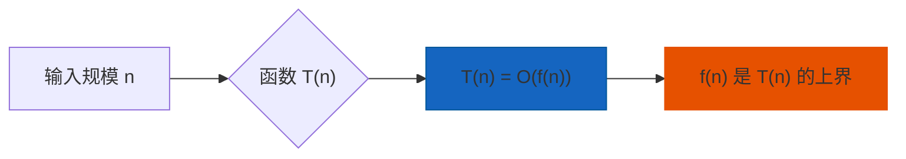
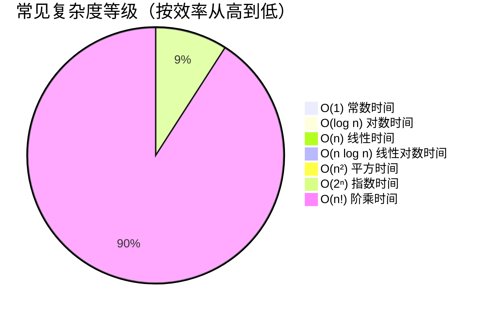
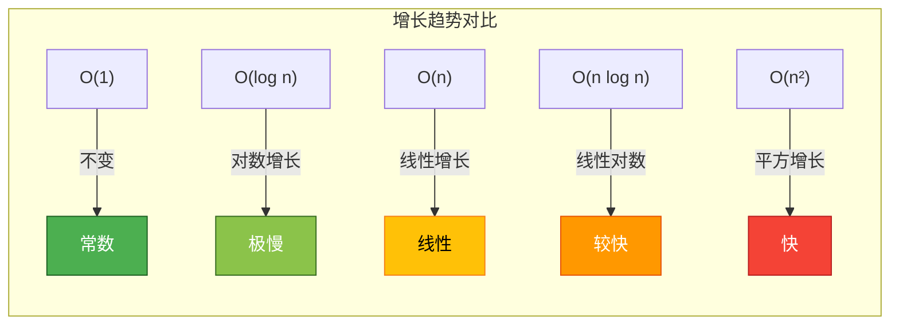
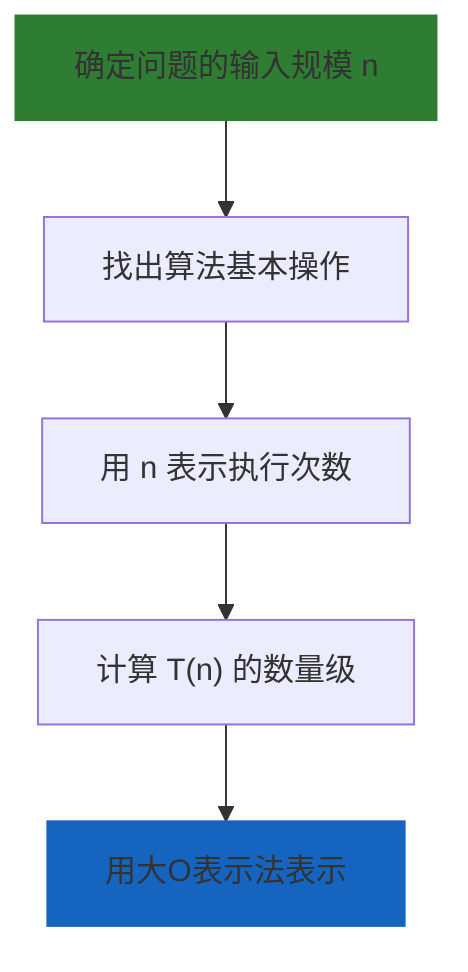
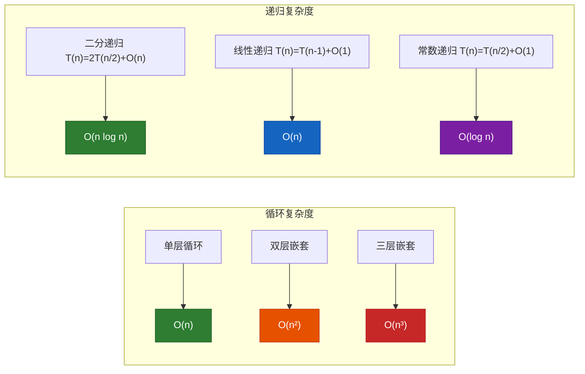
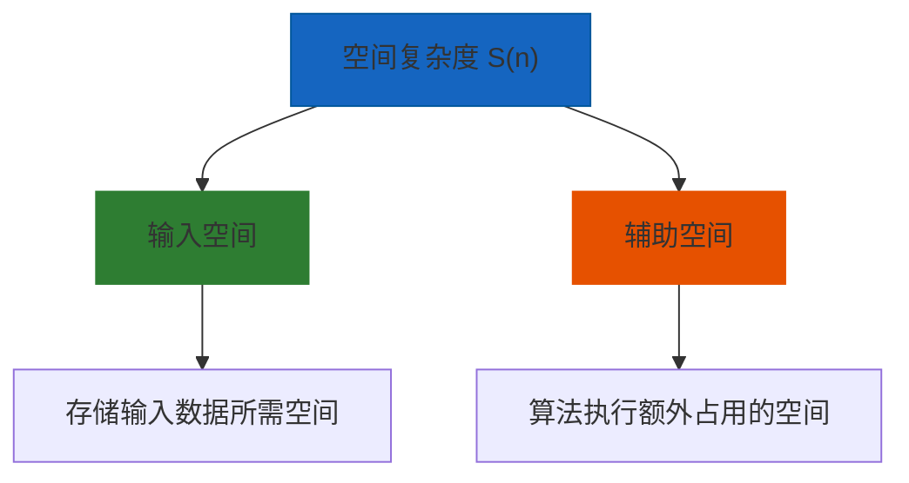
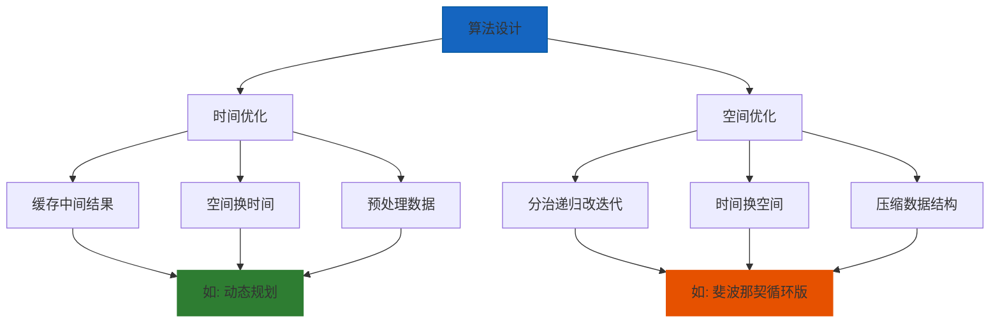
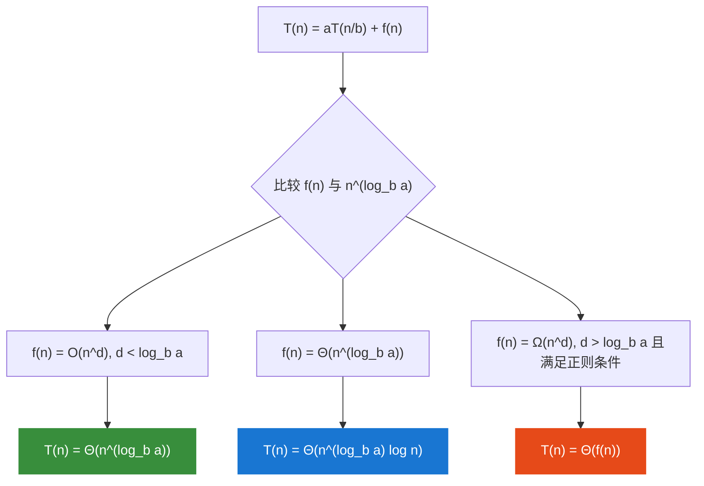
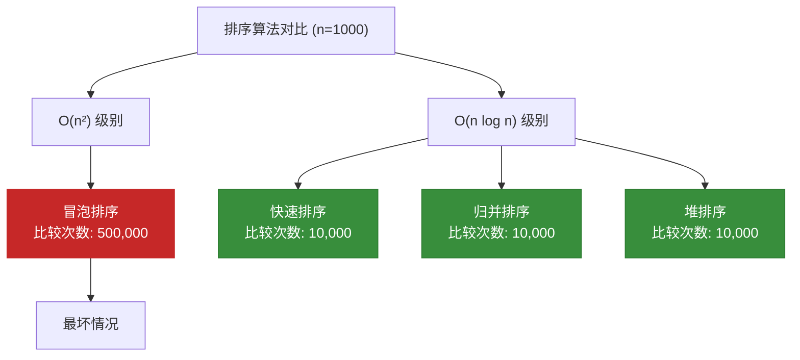
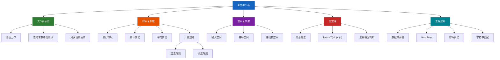

# 复杂度分析

复杂度分析是评估算法性能的核心工具，它帮助我们预测算法随输入规模增长的资源消耗（时间/空间）趋势。

---

## 1. 大O表示法

### 1.1 什么是渐近复杂度

大O表示法（Big O Notation）描述的是算法效率的**上界**，即最坏情况下算法运行时间或空间随输入规模增长的**增长趋势**。



### 1.2 复杂度等级对比



### 1.3 各复杂度等级详解

| 复杂度 | 名称 | 特征 | 典型场景 |
|--------|------|------|----------|
| **O(1)** | 常数时间 | 执行时间不随输入规模变化 | 哈希表查找 |
| **O(log n)** | 对数时间 | 每次操作减少一半数据 | 二分查找 |
| **O(n)** | 线性时间 | 与输入规模成正比 | 遍历数组 |
| **O(n log n)** | 线性对数时间 | 分治策略的典型复杂度 | 快速排序 |
| **O(n²)** | 平方时间 | 嵌套循环 | 冒泡排序 |
| **O(2ⁿ)** | 指数时间 | 指数增长 | 递归斐波那契 |
| **O(n!)** | 阶乘时间 | 增长极快 | 全排列 |

### 1.4 代码示例

#### O(1) - 常数时间
```java
// 数组随机访问，时间复杂度 O(1)
public int getElement(int[] arr, int index) {
    return arr[index];  // 直接计算内存地址: base + index * elementSize
}
```

#### O(log n) - 对数时间
```java
// 二分查找，时间复杂度 O(log n)
public int binarySearch(int[] sortedArr, int target) {
    int left = 0, right = sortedArr.length - 1;

    while (left <= right) {
        int mid = left + (right - left) / 2;  // 防止整数溢出

        if (sortedArr[mid] == target) {
            return mid;
        } else if (sortedArr[mid] < target) {
            left = mid + 1;
        } else {
            right = mid - 1;
        }
    }
    return -1;
}
```

#### O(n) - 线性时间
```java
// 线性查找，时间复杂度 O(n)
public int linearSearch(int[] arr, int target) {
    for (int i = 0; i < arr.length; i++) {
        if (arr[i] == target) {
            return i;
        }
    }
    return -1;
}
```

#### O(n log n) - 线性对数时间
```java
// 快速排序，时间复杂度 O(n log n)
public void quickSort(int[] arr, int low, int high) {
    if (low < high) {
        int pivotIndex = partition(arr, low, high);  // O(n) 划分
        quickSort(arr, low, pivotIndex - 1);        // 递归左半部分
        quickSort(arr, pivotIndex + 1, high);        // 递归右半部分
        // T(n) = 2T(n/2) + O(n) = O(n log n)
    }
}
```

#### O(n²) - 平方时间
```java
// 冒泡排序，时间复杂度 O(n²)
public void bubbleSort(int[] arr) {
    for (int i = 0; i < arr.length; i++) {
        for (int j = 0; j < arr.length - i - 1; j++) {
            if (arr[j] > arr[j + 1]) {
                swap(arr, j, j + 1);
            }
        }
    }
}
```

#### O(2ⁿ) - 指数时间
```java
// 递归斐波那契（朴素版本），时间复杂度 O(2ⁿ)
// 每个调用树分叉成2个，形成高度为n的二叉树
public int fibonacci(int n) {
    if (n <= 1) return n;
    return fibonacci(n - 1) + fibonacci(n - 2);
    // 调用树节点数约为 2ⁿ
}
```

#### O(n!) - 阶乘时间
```java
// 全排列生成，时间复杂度 O(n!)
public void permute(int[] arr, int start) {
    if (start == arr.length) {
        System.out.println(Arrays.toString(arr));
        return;
    }
    for (int i = start; i < arr.length; i++) {
        swap(arr, start, i);
        permute(arr, start + 1);  // n * (n-1) * (n-2) * ... * 1 = n!
        swap(arr, start, i);
    }
}
```

### 1.5 复杂度增长可视化

| n值 | O(1) | O(log n) | O(n) | O(n log n) | O(n²) |
|------|------|----------|------|------------|-------|
| 1 | 1 | 0 | 1 | 0 | 1 |
| 2 | 1 | 1 | 2 | 2 | 4 |
| 3 | 1 | 1.58 | 3 | 4.75 | 9 |
| 4 | 1 | 2 | 4 | 8 | 16 |
| 5 | 1 | 2.32 | 5 | 11.61 | 25 |
| 6 | 1 | 2.58 | 6 | 15.51 | 36 |
| 7 | 1 | 2.81 | 7 | 19.65 | 49 |
| 8 | 1 | 3 | 8 | 24 | 64 |
| 9 | 1 | 3.17 | 9 | 28.53 | 81 |
| 10 | 1 | 3.32 | 10 | 33.22 | 100 |



---

## 2. 时间复杂度分析

### 2.1 分析步骤



### 2.2 最好、最坏、平均情况

**以数组搜索为例：**

```java
public int search(int[] arr, int target) {
    for (int i = 0; i < arr.length; i++) {
        if (arr[i] == target) {
            return i;  // 找到目标
        }
    }
    return -1;
}
```

| 情况 | 条件 | 时间复杂度 | 原因 |
|------|------|------------|------|
| **最好情况** | 目标在数组首位 | O(1) | 第一次就找到 |
| **最坏情况** | 目标不存在或末尾 | O(n) | 遍历整个数组 |
| **平均情况** | 元素均匀分布 | O(n) | 需要遍历 n/2 个元素 |

### 2.3 复杂度计算规则

#### 规则1：只取最高阶
```
T(n) = 3n² + 2n + 1 = O(n²)
        ^^^ 忽略 ^^^
```

#### 规则2：常数系数忽略
```
T(n) = 5n = O(n)
     ^
     忽略
```

#### 规则3：加法规则（并列取最大）
```
T(n) = O(max(f(n), g(n)))
例: O(n) + O(n²) = O(n²)
```

#### 规则4：乘法规则（嵌套相乘）
```
T(n) = O(f(n)) * O(g(n)) = O(f(n) * g(n))
例: O(n) * O(log n) = O(n log n)
```

### 2.4 常见代码模式与复杂度



---

## 3. 空间复杂度分析

### 3.1 空间复杂度组成



### 3.2 常见空间复杂度

| 复杂度 | 名称 | 示例 |
|--------|------|------|
| **O(1)** | 常数空间 | 几个变量、固定循环变量 |
| **O(n)** | 线性空间 | 一维数组、递归调用栈深度 |
| **O(n²)** | 平方空间 | 二维数组 |

### 3.3 代码示例

#### O(1) - 常数空间
```java
// 只使用常数个额外变量
public int sum(int[] arr) {
    int sum = 0;        // O(1) 空间
    for (int i = 0; i < arr.length; i++) {
        sum += arr[i];
    }
    return sum;
}
```

#### O(n) - 线性空间
```java
// 创建与输入规模相关的数组
public int[] copyArray(int[] arr) {
    int[] copy = new int[arr.length];  // O(n) 空间
    for (int i = 0; i < arr.length; i++) {
        copy[i] = arr[i];
    }
    return copy;
}
```

#### O(n) - 递归调用栈
```java
// 递归深度为 n，空间复杂度 O(n)
public int factorial(int n) {
    if (n <= 1) return 1;
    return n * factorial(n - 1);
    // 调用栈深度: n
    // 每次调用占用 O(1) 空间
}
```

### 3.4 时间与空间权衡



---

## 4. 主定理（Master Theorem）

### 4.1 主定理定义

主定理用于计算**分治算法**的时间复杂度，形式如下：

> **T(n) = aT(n/b) + f(n)**
>
> 其中：
> - **a**: 子问题数量（>= 1）
> - **n/b**: 每个子问题的规模
> - **f(n)**: 分解和合并子问题的时间

### 4.2 主定理三种情况



### 4.3 公式速查表

| 条件 | 时间复杂度 | 典型算法 |
|------|------------|----------|
| f(n) = O(n<sup>d</sup>), d < log<sub>b</sub>a | Θ(n<sup>log<sub>b</sub>a</sup>) | 归并排序 |
| f(n) = Θ(n<sup>log<sub>b</sub>a</sup>) | Θ(n<sup>log<sub>b</sub>a</sup> log n) | 二分查找 |
| f(n) = Ω(n<sup>d</sup>), d > log<sub>b</sub>a | Θ(f(n)) | 快速排序partition |

### 4.4 应用示例

#### 示例1：归并排序
```
T(n) = 2T(n/2) + O(n)

a = 2, b = 2, f(n) = O(n)
log₂2 = 1

f(n) = Θ(n¹) = Θ(n^log₂2)

=> 情况2: T(n) = Θ(n log n)
```

#### 示例2：二分查找
```
T(n) = T(n/2) + O(1)

a = 1, b = 2, f(n) = O(1)
log₂1 = 0

f(n) = O(1) = Θ(n⁰) = Θ(n^log₂1)

=> 情况2: T(n) = Θ(log n)
```

#### 示例3：计算xⁿ（朴素算法）
```
T(n) = T(n-1) + O(1)

这不是主定理的标准形式！
a = 1, b = n/(n-1) ≈ 1, 不是常数比

=> T(n) = O(n)
```

### 4.5 主定理的局限性

以下情况**不适用**主定理：

1. f(n) 不是多项式级别与 n<sup>log<sub>b</sub>a</sup> 比较
2. 子问题规模不均匀（如 T(n) = T(n-1) + T(1) + O(n)）
3. 非多项式增长（如 T(n) = 2T(n/2) + O(n log n)）

---

## 5. 工程示例

### 5.1 数据库索引复杂度分析

**B+树索引查询：**

```
B+树高度 h ≈ logₘ(N/2) + 1

其中:
- m: 每个节点的分支数（通常 > 100）
- N: 索引数据量

查询复杂度: O(h) = O(logₘN) = O(log N / log m)

假设 m = 101, N = 1亿条记录:
h = log₁₀₁(100000000/2) + 1 ≈ 3

即使1亿条数据，B+树只需3次磁盘IO！
```

### 5.2 HashMap复杂度分析

```java
// Java HashMap 核心操作复杂度
public class HashMapAnalysis {
    public static void main(String[] args) {
        // put / get 平均复杂度: O(1)
        // 最坏情况: O(n) - 哈希冲突严重时

        // 影响复杂度的因素:
        // 1. 哈希函数质量 -> 分布均匀性
        // 2. 负载因子 loadFactor = size/capacity (默认0.75)
        // 3. 扩容机制: 翻倍扩容, rehash
    }
}
```

| 操作 | 平均复杂度 | 最坏复杂度 | 原因 |
|------|------------|------------|------|
| put | O(1) | O(n) | 哈希冲突 |
| get | O(1) | O(n) | 哈希冲突 |
| containsKey | O(1) | O(n) | 哈希冲突 |

### 5.3 排序算法复杂度对比



| 算法 | 最好 | 平均 | 最坏 | 空间 | 稳定 |
|------|------|------|------|------|------|
| 快速排序 | O(n log n) | O(n log n) | O(n²) | O(log n) | 不稳定 |
| 归并排序 | O(n log n) | O(n log n) | O(n log n) | O(n) | 稳定 |
| 堆排序 | O(n log n) | O(n log n) | O(n log n) | O(1) | 不稳定 |
| 冒泡排序 | O(n) | O(n²) | O(n²) | O(1) | 稳定 |

### 5.4 字符串匹配算法

```java
// KMP算法 vs 朴素算法
public class StringMatching {
    // 朴素算法: O(m*n) m=模式串长度, n=主串长度
    // KMP算法: O(m+n) 利用已匹配信息避免回溯

    public int[] computeLPS(String pattern) {
        // LPS: longest proper prefix which is also suffix
        // 计算失败函数，时间复杂度 O(m)
        int[] lps = new int[pattern.length()];
        // ...
        return lps;
    }
}
```

| 算法 | 时间复杂度 | 空间复杂度 |
|------|------------|------------|
| 朴素匹配 | O(m×n) | O(1) |
| KMP | O(m+n) | O(m) |
| Boyer-Moore | O(m×n) ~ O(n/m) | O(m) |

---

## 6. 复杂度分析知识图谱



---

## 7. 练习题

### 练习1：分析以下代码复杂度

```java
public void mystery(int n) {
    for (int i = 1; i < n; i *= 2) {
        for (int j = 0; j < i; j++) {
            System.out.println("O(log n) * O(i)");
        }
    }
}
// 答案: O(n log n)? 不对!
// 外层: i = 1,2,4,8...<n, 执行 log n 次
// 内层: i 次
// 总计: 1+2+4+...+n/2 = n-1 = O(n)
```

### 练习2：递归复杂度

```java
public void recursive(int n) {
    if (n <= 1) return;
    for (int i = 0; i < n; i++) {
        // O(n)
    }
    recursive(n - 1);
    recursive(n - 1);
}
// 答案: O(2^n)
// T(n) = 2T(n-1) + O(n)
// 展开: 2(2T(n-2) + O(n-1)) + O(n) = 4T(n-2) + 3O(n)
// 递归树深度为n，每个节点代价为O(n)
// 总代价: O(n * 2^n) ≈ O(n * 2^n) ≈ O(2^n)
```

### 练习3：主定理应用

```
T(n) = 4T(n/2) + n²

a = 4, b = 2, f(n) = n²
n^(log₂4) = n²

f(n) = Θ(n²) = Θ(n^log₂4)

=> 情况2: T(n) = Θ(n² log n)
```

---

## 总结

1. **大O表示法**是分析算法复杂度的标准工具，关注增长趋势而非精确值
2. **时间复杂度**分析要考虑最好、最坏、平均三种情况
3. **空间复杂度**区分输入空间和辅助空间
4. **主定理**是计算分治算法复杂度的利器
5. 工程实践中，复杂度分析帮助选择合适的算法和数据结构
