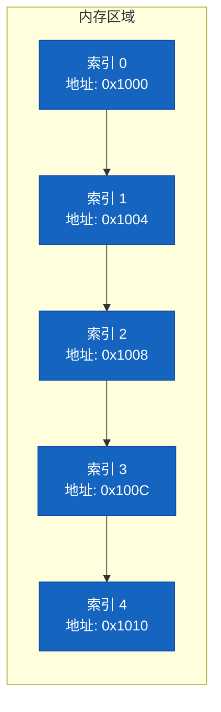
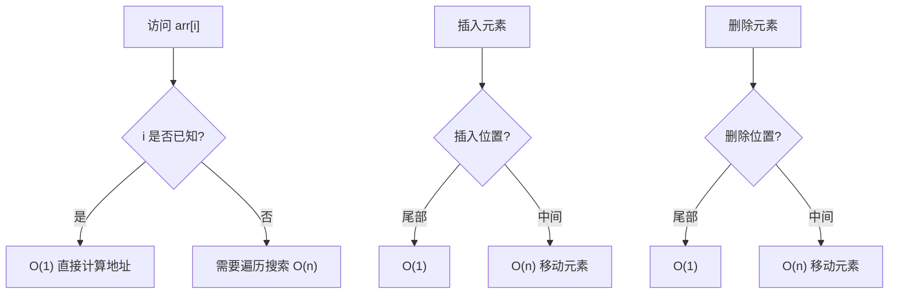
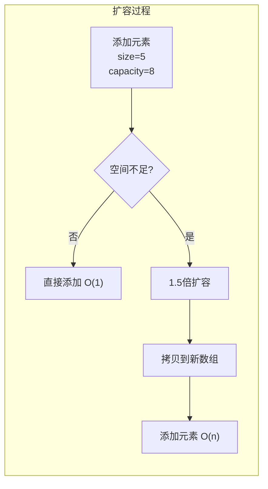
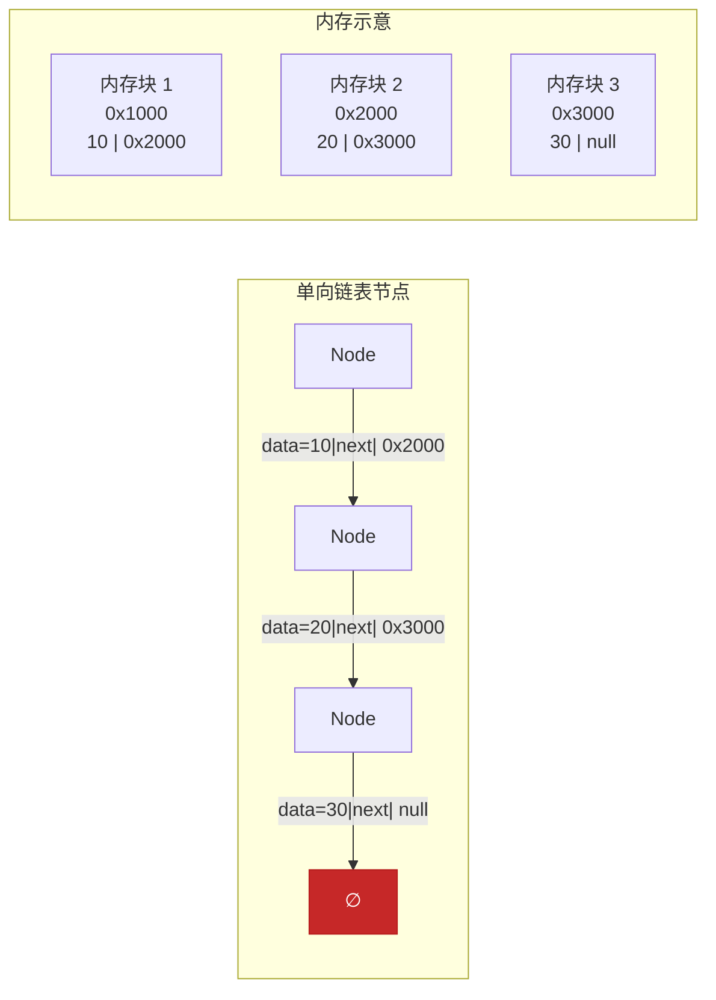
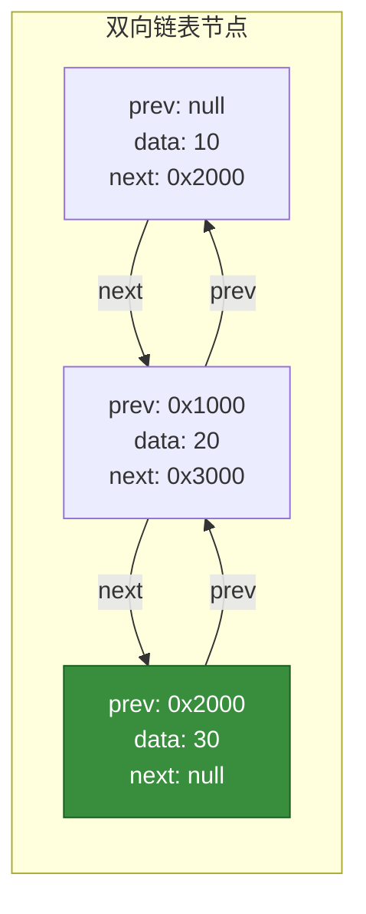
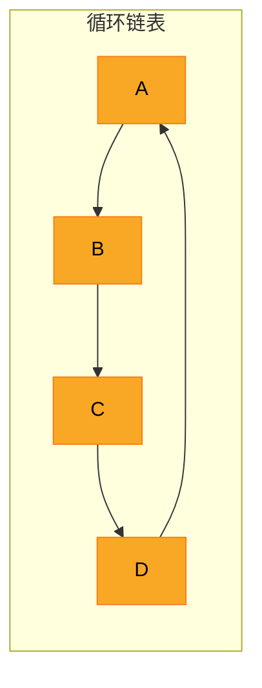
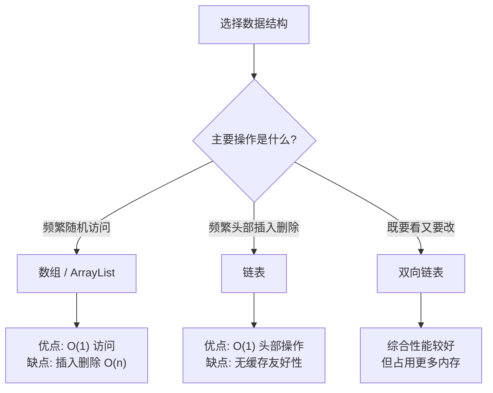
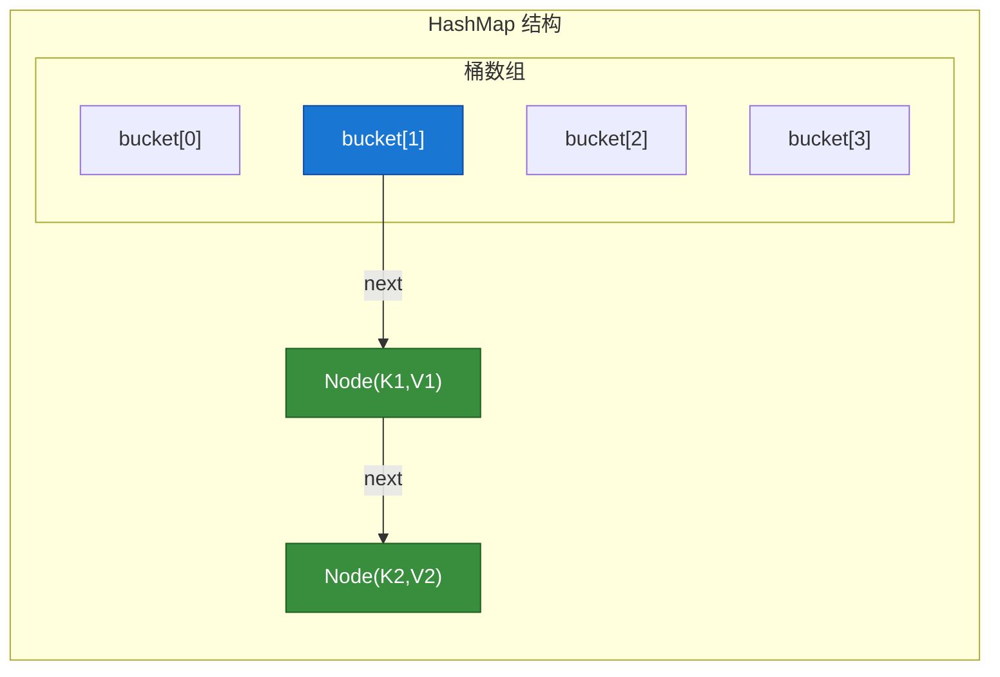

# 第二章：数组与链表

**数组**和**链表**是两种最基础的数据结构，它们代表了两种截然不同的存储方式：数组采用连续内存存储，链表采用分散内存存储。理解它们的原理和特性，是掌握所有复杂数据结构的基础。

---

## 1. 数组

### 1.1 数组原理

#### 1.1.1 连续内存存储

数组在内存中占用一块**连续**的空间，就像一排紧挨着的房间，每个房间都有对应的门牌号（索引）。



**内存布局示意图**（以 `int` 类型为例，每个 int 占 4 字节）：

```
内存地址:    0x1000    0x1004    0x1008    0x100C    0x1010
            ┌────────┬────────┬────────┬────────┬────────┐
数组内容:    │  10    │  20    │  30    │  40    │  50    │
            └────────┴────────┴────────┴────────┴────────┘
             索引[0]   索引[1]   索引[2]   索引[3]   索引[4]
```

#### 1.1.2 随机访问原理

由于数组内存连续，且每个元素大小固定，所以可以根据**首地址 + 偏移量**直接计算出任意元素的内存地址：

```
address(i) = base_address + i × element_size
```

例如：访问 `arr[3]`，首地址为 `0x1000`，元素大小为 4 字节
- 地址 = 0x1000 + 3 × 4 = 0x100C
- **一步到位**，时间复杂度 O(1)

---

### 1.2 数组操作时间复杂度

| 操作 | 时间复杂度 | 说明 |
|:---:|:---:|:---|
| **访问** `arr[i]` | **O(1)** | 通过公式直接计算地址 |
| **搜索**（查找元素） | **O(n)** | 需要遍历数组 |
| **插入**（尾部） | **O(1)** | 直接在末尾添加 |
| **插入**（中间） | **O(n)** | 需要移动后续元素 |
| **删除**（尾部） | **O(1)** | 直接删除末尾 |
| **删除**（中间） | **O(n)** | 需要移动后续元素 |



---

### 1.3 数组的分类

#### 1.3.1 一维数组

最基本的数组形式，线性排列。

```java
// Java
int[] arr = {10, 20, 30, 40, 50};
```

```cpp
// C++
int arr[] = {10, 20, 30, 40, 50};
```

```python
# Python
arr = [10, 20, 30, 40, 50]
```

#### 1.3.2 二维数组

以矩阵形式存储，行列结构。

```
内存中的实际布局（按行存储）:
┌────────┬────────┬────────┐
│ [0][0] │ [0][1] │ [0][2] │
├────────┼────────┼────────┤
│ [1][0] │ [1][1] │ [1][2] │
├────────┼────────┼────────┤
│ [2][0] │ [2][1] │ [2][2] │
└────────┴────────┴────────┘
```

```java
// Java - 3行3列矩阵
int[][] matrix = {
    {1, 2, 3},
    {4, 5, 6},
    {7, 8, 9}
};
// 访问元素: matrix[row][col]
```

```cpp
// C++
int matrix[3][3] = {
    {1, 2, 3},
    {4, 5, 6},
    {7, 8, 9}
};
```

```python
# Python
matrix = [
    [1, 2, 3],
    [4, 5, 6],
    [7, 8, 9]
]
# 访问元素: matrix[row][col]
```

#### 1.3.3 多维数组

三维及以上维度，以此类推。

```java
// Java - 三维数组 (2×3×4)
int[][][] threeD = new int[2][3][4];
```

---

### 1.4 ArrayList 动态数组原理

**ArrayList** 是数组的封装，提供了**动态扩容**的能力。

#### 1.4.1 动态扩容机制



**Java ArrayList 扩容源码分析：**

```java
// JDK 1.8+ ArrayList 扩容逻辑
private void grow(int minCapacity) {
    int oldCapacity = elementData.length;
    // 新容量 = 旧容量 + 旧容量/2 (即 1.5 倍)
    int newCapacity = oldCapacity + (oldCapacity >> 1);
    
    if (newCapacity - minCapacity < 0)
        newCapacity = minCapacity;
    
    // Arrays.copyOf 内部会创建新数组并拷贝数据
    elementData = Arrays.copyOf(elementData, newCapacity);
}
```

#### 1.4.2 ArrayList vs 数组

| 特性 | ArrayList | 普通数组 |
|:---|:---|:---|
| **大小** | 动态可变 | 固定长度 |
| **性能** | 扩容时有拷贝开销 | 无扩容开销 |
| **类型安全** | 泛型支持 | 编译时类型检查 |
| **基本类型** | 需要包装类 | 直接存储 |
| **多维** | 不直接支持 | 支持 |

```java
// ArrayList 使用示例
ArrayList<Integer> list = new ArrayList<>();
list.add(10);        // 尾部添加 O(1)
list.add(20);
list.get(0);         // 随机访问 O(1)
list.remove(0);      // 删除 O(n) - 移动后续元素
```

---

### 1.5 工程应用

#### 1.5.1 LRU 缓存

**LRU (Least Recently Used)** 缓存使用数组或 ArrayList 实现，通过**访问位置记录**实现淘汰最久未使用的元素。

```java
/**
 * 基于 ArrayList 的简单 LRU 缓存
 * 思路：每次访问将元素移动到尾部（最新使用）
 *      淘汰时从头部删除（最久未使用）
 */
public class LRUCache<K, V> {
    private final int capacity;
    private final ArrayList<Entry<K, V>> cache;
    
    public LRUCache(int capacity) {
        this.capacity = capacity;
        this.cache = new ArrayList<>();
    }
    
    public V get(K key) {
        for (int i = 0; i < cache.size(); i++) {
            if (cache.get(i).key.equals(key)) {
                // 找到后移动到尾部（表示最近使用）
                Entry<K, V> entry = cache.remove(i);
                cache.add(entry);
                return entry.value;
            }
        }
        return null; // 未找到
    }
    
    public void put(K key, V value) {
        // 如果已存在，先删除
        for (int i = 0; i < cache.size(); i++) {
            if (cache.get(i).key.equals(key)) {
                cache.remove(i);
                break;
            }
        }
        
        // 如果已满，淘汰头部（最久未使用）
        if (cache.size() >= capacity) {
            cache.remove(0);
        }
        
        // 添加到尾部
        cache.add(new Entry<>(key, value));
    }
    
    private static class Entry<K, V> {
        K key;
        V value;
        Entry(K key, V value) {
            this.key = key;
            this.value = value;
        }
    }
}
```

#### 1.5.2 稀疏矩阵

当矩阵中**大部分元素为 0** 时，使用稀疏矩阵存储可以节省大量空间。

**存储方式**：只存储非零元素的位置和值

```
原始矩阵 (5×5):
┌─────────────┐
│ 0  0  3  0  0 │
│ 0  0  0  0  7 │
│ 0  0  0  0  0 │
│ 9  0  0  0  0 │
│ 0  0  2  0  0 │
└─────────────┘

稀疏矩阵存储 (行, 列, 值):
┌─────────────────┐
│ 0, 2, 3         │  → (row=0, col=2, value=3)
│ 1, 4, 7         │
│ 3, 0, 9         │
│ 4, 2, 2         │
└─────────────────┘
存储效率: 16个0只占4个位置
```

```java
/**
 * 稀疏矩阵压缩存储
 * 使用三元组数组存储 (行, 列, 值)
 */
public class SparseMatrix {
    private final int rows;      // 行数
    private final int cols;      // 列数
    private final int[][] data; // 三元组: [index][0]=row, [1]=col, [2]=value
    
    public SparseMatrix(int[][] matrix) {
        this.rows = matrix.length;
        this.cols = matrix[0].length;
        
        // 统计非零元素个数
        int count = 0;
        for (int i = 0; i < rows; i++) {
            for (int j = 0; j < cols; j++) {
                if (matrix[i][j] != 0) count++;
            }
        }
        
        // 存储非零元素
        this.data = new int[count][3];
        int index = 0;
        for (int i = 0; i < rows; i++) {
            for (int j = 0; j < cols; j++) {
                if (matrix[i][j] != 0) {
                    data[index][0] = i;
                    data[index][1] = j;
                    data[index][2] = matrix[i][j];
                    index++;
                }
            }
        }
    }
    
    // 获取原始矩阵中的值
    public int get(int row, int col) {
        for (int[] tuple : data) {
            if (tuple[0] == row && tuple[1] == col) {
                return tuple[2];
            }
        }
        return 0;
    }
}
```

---

## 2. 链表

链表是一种**非连续**存储的数据结构，通过指针将分散的内存块连接起来。

### 2.1 单向链表

#### 2.1.1 节点结构



**节点结构对比：**

```java
// Java
class ListNode {
    int val;
    ListNode next;
    ListNode(int val) {
        this.val = val;
        this.next = null;
    }
}
```

```cpp
// C++
struct ListNode {
    int val;
    ListNode* next;
    ListNode(int v) : val(v), next(nullptr) {}
};
```

```python
# Python
class ListNode:
    def __init__(self, val=0, next=None):
        self.val = val
        self.next = next
```

#### 2.1.2 链表操作实现

##### 遍历链表

```java
// Java - 遍历
public void printList(ListNode head) {
    ListNode curr = head;
    while (curr != null) {
        System.out.print(curr.val + " -> ");
        curr = curr.next;
    }
    System.out.println("null");
}
```

```cpp
// C++ - 遍历
void printList(ListNode* head) {
    ListNode* curr = head;
    while (curr != nullptr) {
        cout << curr->val << " -> ";
        curr = curr->next;
    }
    cout << "null" << endl;
}
```

```python
# Python - 遍历
def print_list(head):
    curr = head
    while curr:
        print(f"{curr.val} -> ", end="")
        curr = curr.next
    print("null")
```

##### 头部插入

```java
// Java - 头部插入 O(1)
public ListNode insertAtHead(ListNode head, int val) {
    ListNode newNode = new ListNode(val);
    newNode.next = head;
    return newNode; // 返回新头部
}
```

##### 尾部插入

```java
// Java - 尾部插入 O(n)
public ListNode insertAtTail(ListNode head, int val) {
    ListNode newNode = new ListNode(val);
    if (head == null) {
        return newNode;
    }
    ListNode curr = head;
    while (curr.next != null) {
        curr = curr.next;
    }
    curr.next = newNode;
    return head;
}
```

##### 指定位置插入

```java
// Java - 在第 index 个位置插入 O(n)
public ListNode insertAtIndex(ListNode head, int index, int val) {
    if (index == 0) {
        return insertAtHead(head, val);
    }
    
    ListNode newNode = new ListNode(val);
    ListNode curr = head;
    
    // 找到插入位置的前一个节点
    for (int i = 0; i < index - 1; i++) {
        if (curr == null) return head; // index 越界
        curr = curr.next;
    }
    
    if (curr == null) return head;
    newNode.next = curr.next;
    curr.next = newNode;
    return head;
}
```

##### 删除节点

```java
// Java - 删除值为 val 的节点 O(n)
public ListNode deleteNode(ListNode head, int val) {
    if (head == null) return null;
    
    // 如果删除的是头节点
    if (head.val == val) {
        return head.next;
    }
    
    ListNode curr = head;
    while (curr.next != null && curr.next.val != val) {
        curr = curr.next;
    }
    
    if (curr.next != null) {
        curr.next = curr.next.next;
    }
    return head;
}
```

---

### 2.2 双向链表

#### 2.2.1 节点结构



**双向链表节点：**

```java
// Java
class DListNode {
    int val;
    DListNode prev;
    DListNode next;
    DListNode(int val) {
        this.val = val;
    }
}
```

```cpp
// C++
struct DListNode {
    int val;
    DListNode* prev;
    DListNode* next;
    DListNode(int v) : val(v), prev(nullptr), next(nullptr) {}
};
```

```python
# Python
class DListNode:
    def __init__(self, val=0, prev=None, next=None):
        self.val = val
        self.prev = prev
        self.next = next
```

#### 2.2.2 O(1) 删除操作

双向链表的最大优势：**已知节点时，删除操作 O(1)**

```java
// Java - O(1) 删除（已知节点引用）
public void deleteNode(DListNode node) {
    if (node == null) return;
    
    DListNode prev = node.prev;
    DListNode next = node.next;
    
    if (prev != null) {
        prev.next = next;
    } else {
        // 删除的是头节点
        head = next;
    }
    
    if (next != null) {
        next.prev = prev;
    }
}
```

#### 2.2.3 LinkedList 实现原理

Java 中的 `LinkedList` 是**双向链表**实现：

```java
// LinkedList 核心结构
public class LinkedList<E> {
    private static class Node<E> {
        E item;
        Node<E> next;
        Node<E> prev;
        Node(Node<E> prev, E element, Node<E> next) {
            this.item = element;
            this.next = next;
            this.prev = prev;
        }
    }
    
    Node<E> first; // 头节点
    Node<E> last;  // 尾节点
    int size;
}
```

---

### 2.3 循环链表

循环链表是链表的变体，**尾节点的 next 指向头节点**，形成环状。



#### 2.3.1 单向循环链表

```java
// Java - 单向循环链表节点
class CircleListNode {
    int val;
    CircleListNode next;
    CircleListNode(int val) {
        this.val = val;
    }
}

// 构建循环: A -> B -> C -> A
CircleListNode a = new CircleListNode(1);
CircleListNode b = new CircleListNode(2);
CircleListNode c = new CircleListNode(3);
a.next = b;
b.next = c;
c.next = a; // 尾节点指向头节点
```

#### 2.3.2 约瑟夫问题

经典应用：n 个人围成一圈，从第 k 个人开始报数，报到 m 的人出圈，求最后剩下的人。

```java
/**
 * 约瑟夫问题 - 循环链表实现
 * n=5, k=1, m=3
 * 过程: 1->2->3(出圈)->4->5->1->2->4(出圈)...
 */
public int josephus(int n, int k, int m) {
    // 构建循环链表
    CircleListNode head = new CircleListNode(1);
    CircleListNode prev = head;
    for (int i = 2; i <= n; i++) {
        prev.next = new CircleListNode(i);
        prev = prev.next;
    }
    prev.next = head; // 形成环
    
    // 报数删除
    CircleListNode curr = head;
    while (curr.next != curr) {
        // 找到第 m-1 个节点，其下一个节点出圈
        for (int i = 1; i < m - 1; i++) {
            curr = curr.next;
        }
        // 删除第 m 个节点
        curr.next = curr.next.next;
        curr = curr.next;
    }
    return curr.val;
}
```

---

### 2.4 链表 vs 数组对比

| 特性 | 数组 | 链表 |
|:---|:---|:---|
| **内存存储** | 连续内存 | 分散内存 |
| **随机访问** | **O(1)** | O(n) |
| **头部操作** | O(n) 需移动元素 | **O(1)** |
| **尾部操作** | O(1) 已知容量 | O(n) |
| **中间插入** | O(n) | **O(1)** (已知位置) |
| **删除操作** | O(n) | **O(1)** (已知节点) |
| **内存利用率** | 100% | 较低（有指针开销） |
| **缓存友好性** | 优秀 | 较差 |
| **实现复杂度** | 简单 | 较复杂 |



---

### 2.5 工程应用

#### 2.5.1 HashMap 链表

Java HashMap 在**哈希冲突**时使用**链表**（或红黑树）存储冲突的元素。



```java
// HashMap 链表节点（jdk 1.8 简化版）
class Node {
    int hash;
    Object key;
    Object value;
    Node next; // 指向下一个冲突节点
}
```

#### 2.5.2 LinkedList 实现

Java `LinkedList` 是双向链表，同时实现了 `List` 和 `Deque` 接口。

```java
LinkedList<Integer> list = new LinkedList<>();

list.add(1);        // 尾部添加
list.addFirst(0);   // 头部添加 O(1)
list.addLast(2);    // 尾部添加 O(1)
list.removeFirst(); // 头部删除 O(1)
list.removeLast();  // 尾部删除 O(1)

// 作为栈使用
list.push(1);       // 头部入栈 O(1)
list.pop();         // 头部出栈 O(1)

// 作为队列使用
list.offer(1);      // 尾部入队 O(1)
list.poll();        // 头部出队 O(1)
```

---

## 3. 总结

### 3.1 核心对比表

| 操作 | 数组 | 单向链表 | 双向链表 |
|:---|:---:|:---:|:---:|
| 访问 | O(1) | O(n) | O(n) |
| 头部插入 | O(n) | **O(1)** | **O(1)** |
| 尾部插入 | O(1) | O(n) | **O(1)** |
| 头部删除 | O(n) | **O(1)** | **O(1)** |
| 尾部删除 | O(1) | O(n) | **O(1)** |
| 中间插入 | O(n) | O(n) | O(n) |
| 已知节点删除 | O(n) | O(n) | **O(1)** |

### 3.2 选型指南

```
┌─────────────────────────────────────────────────────────────┐
│                        数据结构选型                          │
├─────────────────────────────────────────────────────────────┤
│  需要频繁按下标访问？           → 数组                        │
│  需要频繁在头部操作？           → 链表                        │
│  需要频繁在尾部操作？           → 数组(已知容量) / 双向链表    │
│  需要 O(1) 删除已知节点？      → 双向链表                    │
│  关注缓存性能？                 → 数组                        │
│  数据量巨大，频繁插入删除？     → 链表                        │
└─────────────────────────────────────────────────────────────┘
```

### 3.3 本章要点

- **数组**：连续内存，支持 O(1) 随机访问，但插入删除需要移动元素
- **ArrayList**：封装数组，提供动态扩容能力
- **单向链表**：分散内存，插入删除 O(1)，但访问需要遍历
- **双向链表**：支持 O(1) 的节点删除，是很多高级数据结构的基础
- **循环链表**：首尾相连，适用于环形场景（如约瑟夫问题）

---

*下一章将介绍 **栈与队列**，这两种数据结构基于数组或链表实现，提供了不同的操作约束。*
