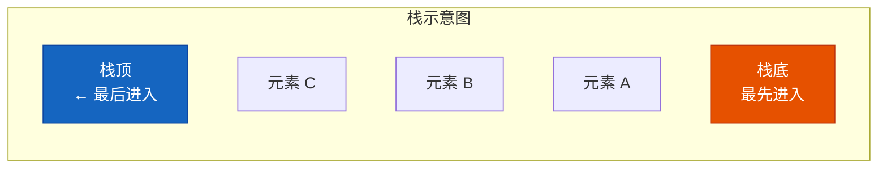
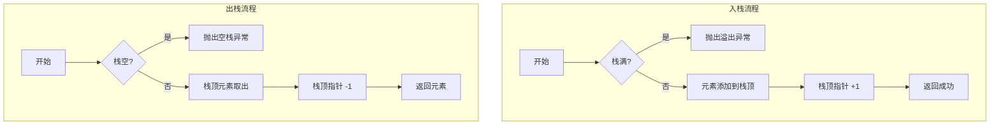
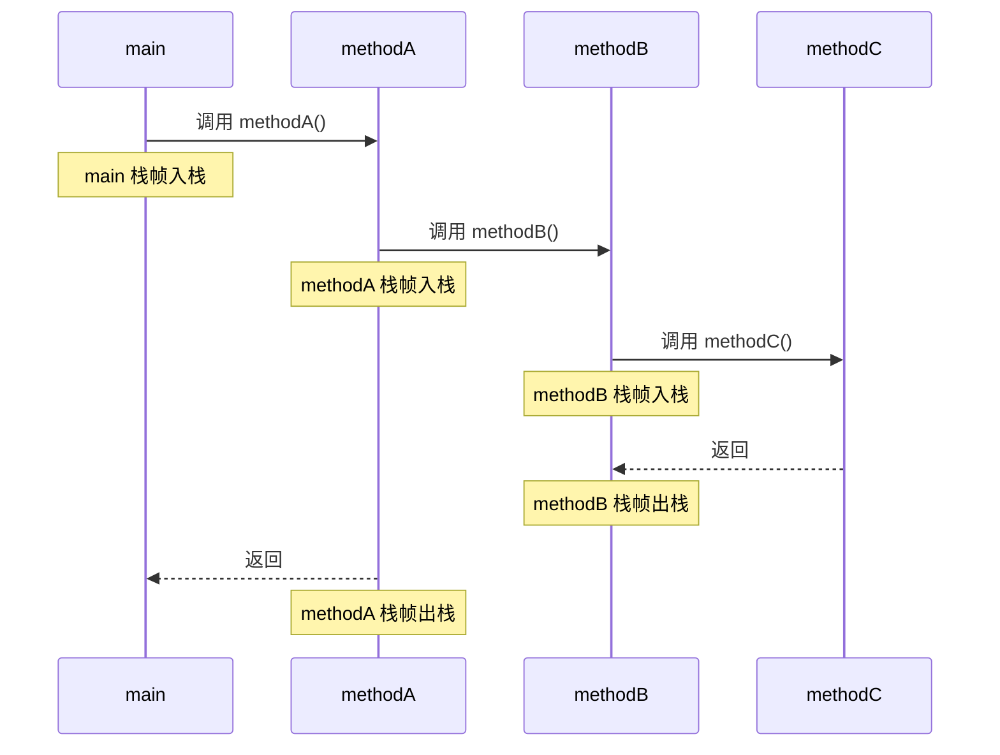
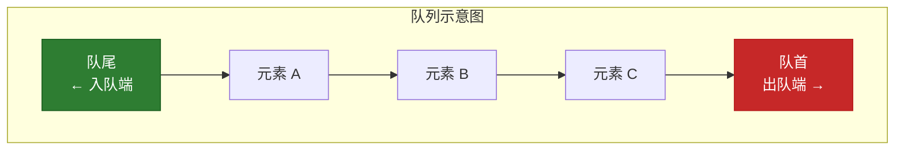
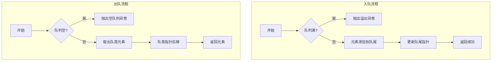
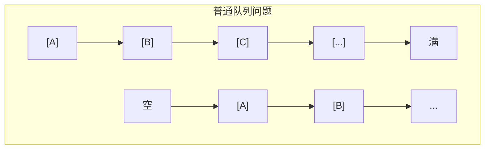
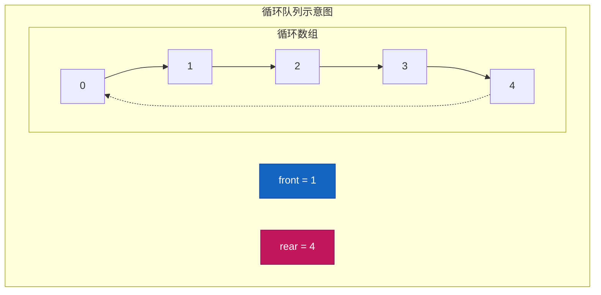
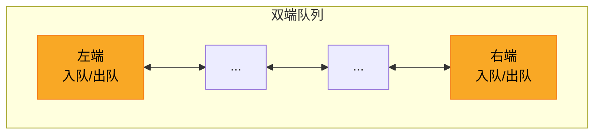
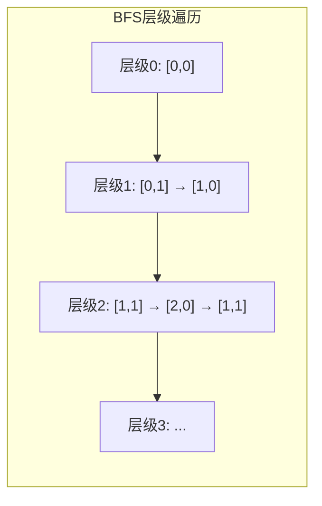
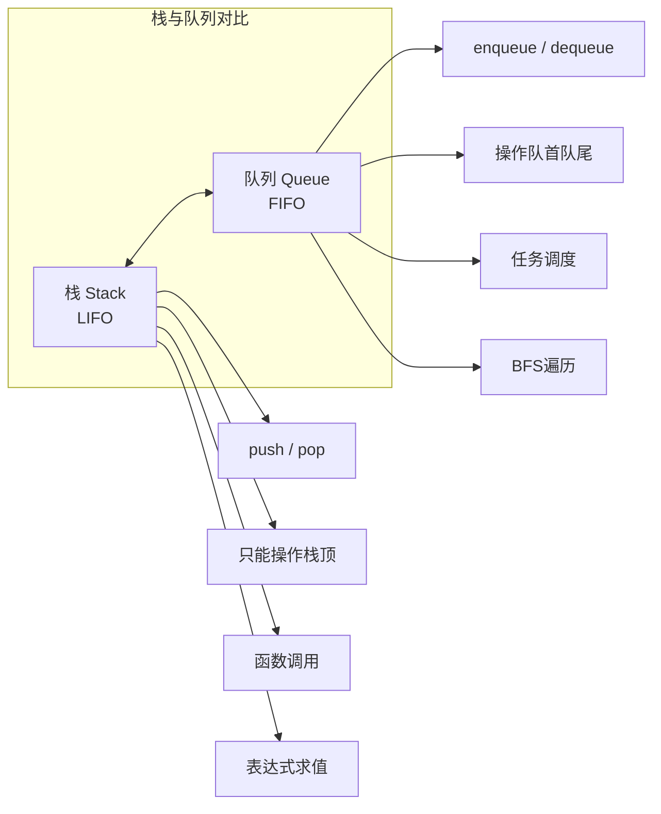

# 第三章：栈与队列

本章我们将学习两种重要的线性数据结构：栈（Stack）和队列（Queue）。它们在计算机科学中有着广泛的应用，是理解算法和系统设计的基础。

---

## 3.1 栈（Stack）

### 3.1.1 栈的原理

栈是一种**后进先出**（Last In First Out, LIFO）的数据结构。想象一下叠放盘子的场景：最后放上去的盘子会最先被取走。



**栈的核心特征：**
- 只允许在栈顶（Top）进行插入和删除操作
- 最后进入栈的元素最先离开
- 栈底（Bottom）是固定端，栈顶是活动端

### 3.1.2 栈的基本操作

栈支持以下核心操作：

| 操作 | 说明 | 时间复杂度 |
|------|------|-----------|
| `push(x)` | 将元素压入栈顶 | O(1) |
| `pop()` | 弹出栈顶元素并返回 | O(1) |
| `peek()` | 查看栈顶元素但不出栈 | O(1) |
| `isEmpty()` | 判断栈是否为空 | O(1) |
| `size()` | 返回栈中元素数量 | O(1) |

**入栈与出栈流程图：**



### 3.1.3 栈的实现

#### 数组实现

```java
public class ArrayStack<E> {
    private Object[] elements;  // 存储元素的数组
    private int top;            // 栈顶指针
    private int capacity;        // 栈容量
    
    // 构造函数
    public ArrayStack(int capacity) {
        this.capacity = capacity;
        this.elements = new Object[capacity];
        this.top = -1;  // -1 表示空栈
    }
    
    // 判断栈是否为空
    public boolean isEmpty() {
        return top == -1;
    }
    
    // 判断栈是否已满
    public boolean isFull() {
        return top == capacity - 1;
    }
    
    // 入栈
    public void push(E element) {
        if (isFull()) {
            throw new RuntimeException("Stack overflow");
        }
        elements[++top] = element;
    }
    
    // 出栈
    @SuppressWarnings("unchecked")
    public E pop() {
        if (isEmpty()) {
            throw new RuntimeException("Stack underflow");
        }
        return (E) elements[top--];
    }
    
    // 查看栈顶元素
    @SuppressWarnings("unchecked")
    public E peek() {
        if (isEmpty()) {
            throw new RuntimeException("Stack is empty");
        }
        return (E) elements[top];
    }
    
    // 获取栈大小
    public int size() {
        return top + 1;
    }
}
```

#### 链表实现

```java
public class LinkedListStack<E> {
    
    // 内部类：链表节点
    private static class Node<E> {
        E data;
        Node<E> next;
        
        Node(E data) {
            this.data = data;
        }
    }
    
    private Node<E> top;  // 栈顶节点
    private int size;     // 栈大小
    
    // 构造函数
    public LinkedListStack() {
        this.top = null;
        this.size = 0;
    }
    
    // 判断栈是否为空
    public boolean isEmpty() {
        return top == null;
    }
    
    // 入栈 - 头插法
    public void push(E element) {
        Node<E> newNode = new Node<>(element);
        newNode.next = top;
        top = newNode;
        size++;
    }
    
    // 出栈
    public E pop() {
        if (isEmpty()) {
            throw new RuntimeException("Stack underflow");
        }
        E data = top.data;
        top = top.next;
        size--;
        return data;
    }
    
    // 查看栈顶元素
    public E peek() {
        if (isEmpty()) {
            throw new RuntimeException("Stack is empty");
        }
        return top.data;
    }
    
    // 获取栈大小
    public int size() {
        return size;
    }
}
```

**两种实现对比：**

| 特性 | 数组实现 | 链表实现 |
|------|---------|---------|
| 时间复杂度 | 所有操作 O(1) | 所有操作 O(1) |
| 空间 | 固定容量，可能浪费 | 动态扩展，节省空间 |
| 扩容 | 需要resize | 无需扩容 |
| 线程安全 | 否 | 否 |

### 3.1.4 栈的应用场景

#### 场景1：函数调用栈

程序运行时，系统使用栈来管理函数调用。每当调用一个函数，就会在调用栈上创建一个栈帧。

```java
public class FunctionCallStackExample {
    
    public static void main(String[] args) {
        methodA();
    }
    
    static void methodA() {
        System.out.println("A 开始");
        methodB();
        System.out.println("A 结束");
    }
    
    static void methodB() {
        System.out.println("B 开始");
        methodC();
        System.out.println("B 结束");
    }
    
    static void methodC() {
        System.out.println("C 执行");
    }
}
```

**调用栈变化过程：**



#### 场景2：括号匹配

检查表达式中的括号是否成对出现。

```java
public class BracketMatcher {
    
    public boolean isValid(String s) {
        ArrayStack<Character> stack = new ArrayStack<>(s.length());
        
        for (char c : s.toCharArray()) {
            if (c == '(' || c == '[' || c == '{') {
                stack.push(c);  // 左括号入栈
            } else {
                // 右括号：检查栈顶是否有匹配的左括号
                if (stack.isEmpty()) {
                    return false;
                }
                char top = stack.pop();
                if (!isMatch(top, c)) {
                    return false;
                }
            }
        }
        
        // 最后栈必须为空
        return stack.isEmpty();
    }
    
    private boolean isMatch(char left, char right) {
        return (left == '(' && right == ')') ||
               (left == '[' && right == ']') ||
               (left == '{' && right == '}');
    }
    
    // 测试
    public static void main(String[] args) {
        BracketMatcher matcher = new BracketMatcher();
        System.out.println(matcher.isValid("()[]{}"));   // true
        System.out.println(matcher.isValid("([)]"));      // false
        System.out.println(matcher.isValid("{[]}"));       // true
    }
}
```

#### 场景3：表达式求值（逆波兰表达式）

将中缀表达式转换为后缀表达式，并计算结果。

```java
public class ExpressionEvaluator {
    
    public int evalRPN(String[] tokens) {
        ArrayStack<Integer> stack = new ArrayStack<>(tokens.length);
        
        for (String token : tokens) {
            if (isOperator(token)) {
                int b = stack.pop();  // 注意：先弹出的是右操作数
                int a = stack.pop();
                int result = calculate(a, b, token);
                stack.push(result);
            } else {
                stack.push(Integer.parseInt(token));
            }
        }
        
        return stack.pop();
    }
    
    private boolean isOperator(String token) {
        return token.equals("+") || token.equals("-") ||
               token.equals("*") || token.equals("/");
    }
    
    private int calculate(int a, int b, String operator) {
        switch (operator) {
            case "+": return a + b;
            case "-": return a - b;
            case "*": return a * b;
            case "/": return a / b;
            default: throw new IllegalArgumentException("Invalid operator");
        }
    }
    
    // 示例：计算 (3 + 4) * 5 -> 35
    // 后缀表达式：3 4 + 5 *
    public static void main(String[] args) {
        ExpressionEvaluator evaluator = new ExpressionEvaluator();
        String[] tokens = {"3", "4", "+", "5", "*"};
        System.out.println("结果: " + evaluator.evalRPN(tokens));  // 35
    }
}
```

#### 场景4：浏览器前进后退功能

使用两个栈实现浏览器的前进和后退功能。

```java
public class BrowserHistory {
    private ArrayStack<String> backStack;    // 后退栈
    private ArrayStack<String> forwardStack;  // 前进栈
    private String currentPage;
    
    public BrowserHistory(String homepage) {
        this.backStack = new ArrayStack<>(100);
        this.forwardStack = new ArrayStack<>(100);
        this.currentPage = homepage;
    }
    
    // 访问新页面
    public void visit(String url) {
        // 清除前进栈
        forwardStack = new ArrayStack<>(100);
        // 当前页入后退栈
        backStack.push(currentPage);
        currentPage = url;
    }
    
    // 后退
    public String back() {
        if (backStack.isEmpty()) {
            return currentPage;
        }
        forwardStack.push(currentPage);
        currentPage = backStack.pop();
        return currentPage;
    }
    
    // 前进
    public String forward() {
        if (forwardStack.isEmpty()) {
            return currentPage;
        }
        backStack.push(currentPage);
        currentPage = forwardStack.pop();
        return currentPage;
    }
    
    public String getCurrentPage() {
        return currentPage;
    }
    
    // 测试
    public static void main(String[] args) {
        BrowserHistory browser = new BrowserHistory("home.com");
        browser.visit("page1.com");
        browser.visit("page2.com");
        System.out.println("当前: " + browser.getCurrentPage());  // page2.com
        
        browser.back();
        System.out.println("后退: " + browser.getCurrentPage());  // page1.com
        
        browser.back();
        System.out.println("再后退: " + browser.getCurrentPage()); // home.com
        
        browser.forward();
        System.out.println("前进: " + browser.getCurrentPage());   // page1.com
    }
}
```

---

## 3.2 队列（Queue）

### 3.2.1 队列的原理

队列是一种**先进先出**（First In First Out, FIFO）的数据结构。想象排队买票的场景：最先排队的人最先买到票。



**队列的核心特征：**
- 入队（enqueue）在队尾进行
- 出队（dequeue）在队首进行
- 最先进入队列的元素最先离开

### 3.2.2 队列的基本操作

队列支持以下核心操作：

| 操作 | 说明 | 时间复杂度 |
|------|------|-----------|
| `enqueue(x)` | 将元素添加到队尾 | O(1) |
| `dequeue()` | 移除并返回队首元素 | O(1) |
| `front()` | 查看队首元素但不出队 | O(1) |
| `rear()` | 查看队尾元素 | O(1) |
| `isEmpty()` | 判断队列是否为空 | O(1) |

**入队与出队流程图：**



### 3.2.3 队列的实现

#### 数组实现（简单队列）

```java
public class ArrayQueue<E> {
    private Object[] elements;
    private int front;   // 队首指针
    private int rear;    // 队尾指针
    private int capacity;
    
    public ArrayQueue(int capacity) {
        this.capacity = capacity;
        this.elements = new Object[capacity];
        this.front = 0;
        this.rear = -1;
    }
    
    public boolean isEmpty() {
        return rear < front;
    }
    
    public boolean isFull() {
        return rear == capacity - 1;
    }
    
    // 入队
    public void enqueue(E element) {
        if (isFull()) {
            throw new RuntimeException("Queue overflow");
        }
        elements[++rear] = element;
    }
    
    // 出队
    @SuppressWarnings("unchecked")
    public E dequeue() {
        if (isEmpty()) {
            throw new RuntimeException("Queue underflow");
        }
        return (E) elements[front++];
    }
    
    // 查看队首
    @SuppressWarnings("unchecked")
    public E front() {
        if (isEmpty()) {
            throw new RuntimeException("Queue is empty");
        }
        return (E) elements[front];
    }
    
    // 查看队尾
    @SuppressWarnings("unchecked")
    public E rear() {
        if (isEmpty()) {
            throw new RuntimeException("Queue is empty");
        }
        return (E) elements[rear];
    }
    
    public int size() {
        return rear - front + 1;
    }
}
```

#### 链表实现

```java
public class LinkedListQueue<E> {
    
    private static class Node<E> {
        E data;
        Node<E> next;
        
        Node(E data) {
            this.data = data;
        }
    }
    
    private Node<E> front;  // 队首
    private Node<E> rear;   // 队尾
    private int size;
    
    public LinkedListQueue() {
        this.front = null;
        this.rear = null;
        this.size = 0;
    }
    
    public boolean isEmpty() {
        return front == null;
    }
    
    // 入队 - 在队尾添加
    public void enqueue(E element) {
        Node<E> newNode = new Node<>(element);
        if (isEmpty()) {
            front = rear = newNode;
        } else {
            rear.next = newNode;
            rear = newNode;
        }
        size++;
    }
    
    // 出队 - 从队首移除
    public E dequeue() {
        if (isEmpty()) {
            throw new RuntimeException("Queue underflow");
        }
        E data = front.data;
        front = front.next;
        if (front == null) {
            rear = null;  // 队列空了
        }
        size--;
        return data;
    }
    
    // 查看队首
    public E front() {
        if (isEmpty()) {
            throw new RuntimeException("Queue is empty");
        }
        return front.data;
    }
    
    public int size() {
        return size;
    }
}
```

### 3.2.4 循环队列

#### 为什么需要循环队列

普通队列在反复入队出队后，会出现"假满"问题：队尾已到达数组末尾，但队首还有空位。



**循环队列**通过将数组首尾相连来解决这个问题。

#### 循环队列原理



#### 循环队列实现

```java
public class CircularQueue<E> {
    private Object[] elements;
    private int front;   // 指向队首元素
    private int rear;    // 指向队尾的下一个位置
    private int capacity;
    
    public CircularQueue(int capacity) {
        this.capacity = capacity;
        this.elements = new Object[capacity];
        this.front = 0;
        this.rear = 0;
    }
    
    public boolean isEmpty() {
        return front == rear;
    }
    
    public boolean isFull() {
        return (rear + 1) % capacity == front;
    }
    
    // 入队
    public void enqueue(E element) {
        if (isFull()) {
            throw new RuntimeException("Queue overflow");
        }
        elements[rear] = element;
        rear = (rear + 1) % capacity;
    }
    
    // 出队
    @SuppressWarnings("unchecked")
    public E dequeue() {
        if (isEmpty()) {
            throw new RuntimeException("Queue underflow");
        }
        E element = (E) elements[front];
        front = (front + 1) % capacity;
        return element;
    }
    
    // 查看队首
    @SuppressWarnings("unchecked")
    public E front() {
        if (isEmpty()) {
            throw new RuntimeException("Queue is empty");
        }
        return (E) elements[front];
    }
    
    public int size() {
        return (rear - front + capacity) % capacity;
    }
}
```

**关键点：**
- `front` 指向队首元素
- `rear` 指向队尾的下一个空位置
- 队列满的判断：`(rear + 1) % capacity == front`
- 队列空的判断：`front == rear`
- 需要浪费一个空间来区分满和空

### 3.2.5 双端队列（Deque）

双端队列（Double-Ended Queue）是一种允许在两端进行插入和删除操作的数据结构。



#### Deque接口设计

```java
public interface Deque<E> {
    // 从头部操作
    void addFirst(E element);    // 头部添加
    E removeFirst();              // 头部移除
    E getFirst();                 // 获取头部元素
    
    // 从尾部操作
    void addLast(E element);      // 尾部添加
    E removeLast();              // 尾部移除
    E getLast();                 // 获取尾部元素
    
    boolean isEmpty();
    int size();
}
```

#### 双端队列实现

```java
public class ArrayDeque<E> {
    private Object[] elements;
    private int front;   // 指向队首
    private int rear;    // 指向队尾的下一个位置
    private int capacity;
    
    public ArrayDeque(int capacity) {
        this.capacity = capacity;
        this.elements = new Object[capacity];
        this.front = 0;
        this.rear = 0;
    }
    
    public boolean isEmpty() {
        return front == rear;
    }
    
    public boolean isFull() {
        return (rear + 1) % capacity == front;
    }
    
    // 头部添加
    public void addFirst(E element) {
        if (isFull()) {
            throw new RuntimeException("Deque overflow");
        }
        front = (front - 1 + capacity) % capacity;
        elements[front] = element;
    }
    
    // 尾部添加
    public void addLast(E element) {
        if (isFull()) {
            throw new RuntimeException("Deque overflow");
        }
        elements[rear] = element;
        rear = (rear + 1) % capacity;
    }
    
    // 头部移除
    @SuppressWarnings("unchecked")
    public E removeFirst() {
        if (isEmpty()) {
            throw new RuntimeException("Deque underflow");
        }
        E element = (E) elements[front];
        front = (front + 1) % capacity;
        return element;
    }
    
    // 尾部移除
    @SuppressWarnings("unchecked")
    public E removeLast() {
        if (isEmpty()) {
            throw new RuntimeException("Deque underflow");
        }
        rear = (rear - 1 + capacity) % capacity;
        return (E) elements[rear];
    }
    
    @SuppressWarnings("unchecked")
    public E getFirst() {
        if (isEmpty()) {
            throw new RuntimeException("Deque is empty");
        }
        return (E) elements[front];
    }
    
    @SuppressWarnings("unchecked")
    public E getLast() {
        if (isEmpty()) {
            throw new RuntimeException("Deque is empty");
        }
        return (E) elements[(rear - 1 + capacity) % capacity];
    }
    
    public int size() {
        return (rear - front + capacity) % capacity;
    }
}
```

### 3.2.6 队列的应用场景

#### 场景1：任务调度

操作系统使用队列来管理待执行的任务。

```java
import java.util.concurrent.Delayed;
import java.util.concurrent.TimeUnit;

public class TaskScheduler {
    private LinkedListQueue<Task> taskQueue;
    
    public TaskScheduler() {
        this.taskQueue = new LinkedListQueue<>();
    }
    
    // 添加任务
    public void addTask(Task task) {
        taskQueue.enqueue(task);
    }
    
    // 执行任务
    public void executeNext() {
        if (!taskQueue.isEmpty()) {
            Task task = taskQueue.dequeue();
            task.execute();
        }
    }
    
    // 批量执行
    public void executeAll() {
        while (!taskQueue.isEmpty()) {
            executeNext();
        }
    }
    
    // 任务类
    static class Task {
        private String name;
        private Runnable action;
        
        public Task(String name, Runnable action) {
            this.name = name;
            this.action = action;
        }
        
        public void execute() {
            System.out.println("执行任务: " + name);
            action.run();
        }
    }
    
    public static void main(String[] args) {
        TaskScheduler scheduler = new TaskScheduler();
        
        scheduler.addTask(new Task("任务1", () -> System.out.println("  → 下载文件")));
        scheduler.addTask(new Task("任务2", () -> System.out.println("  → 发送邮件")));
        scheduler.addTask(new Task("任务3", () -> System.out.println("  → 更新数据库")));
        
        scheduler.executeAll();
    }
}
```

#### 场景2：消息队列

消息队列用于异步通信和解耦系统组件。

```java
public class MessageQueue {
    private LinkedListQueue<Message> queue;
    private volatile boolean running;
    
    public MessageQueue() {
        this.queue = new LinkedListQueue<>();
        this.running = true;
    }
    
    // 生产者：发送消息
    public void send(String topic, String content) {
        Message message = new Message(topic, content);
        synchronized (queue) {
            queue.enqueue(message);
            queue.notify();  // 通知等待的消费者
        }
        System.out.println("[发送] 主题: " + topic + ", 内容: " + content);
    }
    
    // 消费者：接收消息
    public Message receive() {
        synchronized (queue) {
            while (queue.isEmpty() && running) {
                try {
                    queue.wait();
                } catch (InterruptedException e) {
                    Thread.currentThread().interrupt();
                }
            }
            if (!queue.isEmpty()) {
                return queue.dequeue();
            }
        }
        return null;
    }
    
    public void stop() {
        running = false;
    }
    
    static class Message {
        String topic;
        String content;
        
        Message(String topic, String content) {
            this.topic = topic;
            this.content = content;
        }
    }
    
    public static void main(String[] args) {
        MessageQueue mq = new MessageQueue();
        
        // 生产者
        new Thread(() -> {
            mq.send("order", "新订单 #1001");
            mq.send("order", "新订单 #1002");
            mq.send("notification", "发货通知");
        }).start();
        
        // 消费者
        new Thread(() -> {
            Message msg;
            while ((msg = mq.receive()) != null) {
                System.out.println("[接收] 主题: " + msg.topic + ", 内容: " + msg.content);
            }
        }).start();
    }
}
```

#### 场景3：广度优先搜索（BFS）

使用队列实现图的广度优先遍历。

```java
import java.util.*;
import java.awt.Point;

public class BFSSearch {
    
    // 使用队列进行BFS遍历
    public List<Point> bfs(int[][] grid, Point start) {
        List<Point> result = new ArrayList<>();
        LinkedListQueue<Point> queue = new LinkedListQueue<>();
        boolean[][] visited = new boolean[grid.length][grid[0].length];
        
        queue.enqueue(start);
        visited[start.x][start.y] = true;
        
        // 四个方向：上右下左
        int[][] directions = {{-1, 0}, {0, 1}, {1, 0}, {0, -1}};
        
        while (!queue.isEmpty()) {
            Point current = queue.dequeue();
            result.add(current);
            
            // 检查四个邻居
            for (int[] dir : directions) {
                int nx = current.x + dir[0];
                int ny = current.y + dir[1];
                
                if (nx >= 0 && nx < grid.length &&
                    ny >= 0 && ny < grid[0].length &&
                    grid[nx][ny] == 1 && !visited[nx][ny]) {
                    
                    visited[nx][ny] = true;
                    queue.enqueue(new Point(nx, ny));
                }
            }
        }
        
        return result;
    }
    
    // 迷宫问题 - 找到从起点到终点的最短路径
    public int shortestPath(int[][] maze, Point start, Point end) {
        if (maze == null || maze.length == 0) return -1;
        
        LinkedListQueue<Point> queue = new LinkedListQueue<>();
        boolean[][] visited = new boolean[maze.length][maze[0].length];
        
        queue.enqueue(start);
        visited[start.x][start.y] = true;
        int steps = 0;
        
        int[][] directions = {{-1, 0}, {0, 1}, {1, 0}, {0, -1}};
        
        while (!queue.isEmpty()) {
            int size = queue.size();  // 当前层级的节点数
            
            for (int i = 0; i < size; i++) {
                Point current = queue.dequeue();
                
                if (current.equals(end)) {
                    return steps;
                }
                
                for (int[] dir : directions) {
                    int nx = current.x + dir[0];
                    int ny = current.y + dir[1];
                    
                    if (nx >= 0 && nx < maze.length &&
                        ny >= 0 && ny < maze[0].length &&
                        maze[nx][ny] == 0 && !visited[nx][ny]) {
                        
                        visited[nx][ny] = true;
                        queue.enqueue(new Point(nx, ny));
                    }
                }
            }
            steps++;
        }
        
        return -1;  // 无法到达
    }
    
    // 测试
    public static void main(String[] args) {
        BFSSearch bfs = new BFSSearch();
        
        // 简单网格测试
        int[][] grid = {
            {1, 1, 1, 1},
            {1, 0, 0, 1},
            {1, 0, 0, 1},
            {1, 1, 1, 1}
        };
        
        Point start = new Point(0, 0);
        List<Point> path = bfs.bfs(grid, start);
        System.out.println("BFS遍历顺序: " + path);
    }
}
```

**BFS遍历过程图示：**



---

## 3.3 栈与队列对比



| 特性 | 栈 | 队列 | 双端队列 |
|------|-----|------|---------|
| 操作端 | 仅栈顶 | 队首出，队尾入 | 两端皆可 |
| 策略 | LIFO | FIFO | 灵活 |
| 主要应用 | 函数调用、括号匹配 | 任务调度、BFS | 滑动窗口 |

---

## 3.4 常见面试题

### 题目1：有效的括号

```java
/**
 * 给定一个只包含 '(', ')', '{', '}', '[', ']' 的字符串
 * 判断括号是否有效
 */
public boolean isValid(String s) {
    ArrayStack<Character> stack = new ArrayStack<>(s.length());
    
    Map<Character, Character> map = new HashMap<>();
    map.put(')', '(');
    map.put(']', '[');
    map.put('}', '{');
    
    for (char c : s.toCharArray()) {
        if (map.containsValue(c)) {
            // 左括号：入栈
            stack.push(c);
        } else {
            // 右括号：检查栈顶
            if (stack.isEmpty() || stack.pop() != map.get(c)) {
                return false;
            }
        }
    }
    
    return stack.isEmpty();
}
```

### 题目2：用栈实现队列

```java
public class StackToQueue {
    private ArrayStack<Integer> inStack;   // 入栈
    private ArrayStack<Integer> outStack;  // 出栈
    
    public StackToQueue() {
        inStack = new ArrayStack<>(100);
        outStack = new ArrayStack<>(100);
    }
    
    // 入队 - 总是进入inStack
    public void enqueue(int x) {
        inStack.push(x);
    }
    
    // 出队 - 从outStack出，如果outStack空则将inStack倒入
    public int dequeue() {
        if (outStack.isEmpty()) {
            while (!inStack.isEmpty()) {
                outStack.push(inStack.pop());
            }
        }
        return outStack.pop();
    }
    
    public int peek() {
        if (outStack.isEmpty()) {
            while (!inStack.isEmpty()) {
                outStack.push(inStack.pop());
            }
        }
        return outStack.peek();
    }
    
    public boolean isEmpty() {
        return inStack.isEmpty() && outStack.isEmpty();
    }
}
```

### 题目3：滑动窗口最大值

```java
/**
 * 使用双端队列实现滑动窗口最大值
 */
public int[] maxSlidingWindow(int[] nums, int k) {
    if (nums == null || k <= 0) return new int[0];
    
    int[] result = new int[nums.length - k + 1];
    ArrayDeque<Integer> deque = new ArrayDeque<>(nums.length);
    
    for (int i = 0; i < nums.length; i++) {
        // 移除窗口外的元素
        while (!deque.isEmpty() && deque.getLast() < i - k + 1) {
            deque.removeLast();
        }
        
        // 移除比当前元素小的所有元素
        while (!deque.isEmpty() && nums[deque.getFirst()] < nums[i]) {
            deque.removeFirst();
        }
        
        deque.addFirst(i);
        
        // 窗口形成后记录最大值
        if (i >= k - 1) {
            result[i - k + 1] = nums[deque.getLast()];
        }
    }
    
    return result;
}
```

---

## 本章小结

本章我们学习了栈和队列两种重要的数据结构：

**栈（LIFO）：**
- 后进先出，只允许栈顶操作
- 应用：函数调用栈、括号匹配、表达式求值、浏览器前进后退
- 实现方式：数组或链表，均为 O(1) 操作

**队列（FIFO）：**
- 先进先出，队首出队，队尾入队
- 应用：任务调度、消息队列、BFS遍历
- 实现方式：数组、链表、循环队列（解决假满问题）

**双端队列：**
- 两端皆可操作，更加灵活
- 应用：滑动窗口、LRU缓存

理解这些基础数据结构的特点和使用场景，是编写高效算法的基础。
