# 哈希表（Hash Table）

## 目录

1. [哈希表基础原理](#1-哈希表基础原理)
2. [哈希函数设计](#2-哈希函数设计)
3. [哈希碰撞问题](#3-哈希碰撞问题)
4. [碰撞解决方案](#4-碰撞解决方案)
5. [负载因子与扩容策略](#5-负载因子与扩容策略)
6. [工程应用](#6-工程应用)
7. [复杂度分析](#7-复杂度分析)
8. [总结](#8-总结)

---

## 1. 哈希表基础原理

### 1.1 什么是哈希表

哈希表（Hash Table）是一种 **键值对（Key-Value）** 映射的数据结构，通过 `哈希函数` 将键映射到数组中的特定位置，实现 **O(1)** 时间复杂度的查找、插入和删除操作。

### 1.2 核心思想

```
┌─────────────────────────────────────────────────────────────┐
│                      哈希表工作原理                          │
├─────────────────────────────────────────────────────────────┤
│                                                             │
│   键 (Key)          哈希函数          槽 (Slot)              │
│   ──────           ─────────         ─────                 │
│                                                             │
│   "Alice"    ───►   hash()    ───►    [0]  ───►  值: 25岁   │
│                                                             │
│   "Bob"      ───►   hash()    ───►    [3]  ───►  值: 30岁   │
│                                                             │
│   "Charlie"  ───►   hash()    ───►    [7]  ───►  值: 28岁   │
│                                                             │
│   ┌───┬───┬───┬───┬───┬───┬───┬───┬───┬───┐               │
│   │   │   │   │   │   │   │   │   │   │   │  数组/桶数组    │
│   └───┴───┴───┴───┴───┴───┴───┴───┴───┴───┘               │
│    0   1   2   3   4   5   6   7   8   9                   │
│                                                             │
└─────────────────────────────────────────────────────────────┘
```

### 1.3 哈希表结构示意

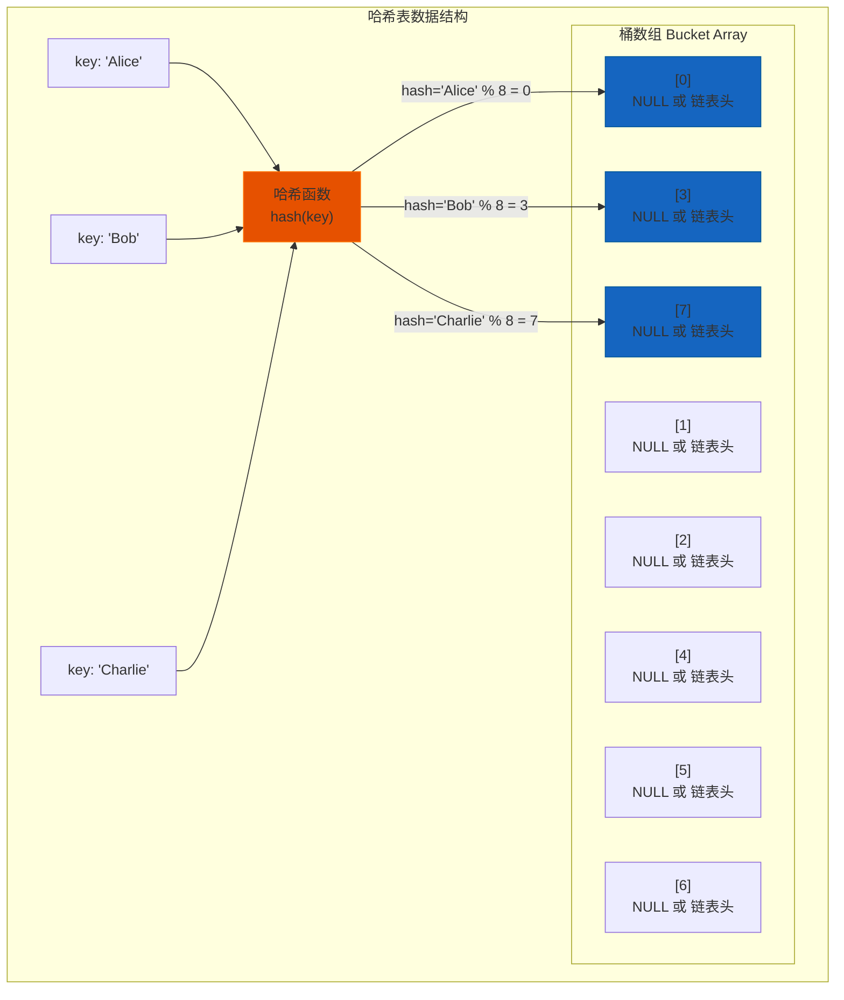

### 1.4 理想状态 vs 实际状态

```
理想状态（完美哈希）:                    实际状态（存在碰撞）:
┌───┬───┬───┬───┬───┬───┬───┬───┐     ┌───┬───┬───┬───┬───┬───┬───┬───┐
│ A │ B │ C │ D │ E │ F │ G │ H │     │ A │   │ C │ B │   │ G │   │ D │
└───┴───┴───┴───┴───┴───┴───┴───┘     └───┴───┴───┴───┴───┴───┴───┴───┘
 0   1   2   3   4   5   6   7         0   1   2   3   4   5   6   7
                                          ↑
                                      碰撞！B和D
                                      映射到同一位置
```

---

## 2. 哈希函数设计

### 2.1 哈希函数的基本要求

一个好的哈希函数应满足以下原则：

| 原则 | 描述 |
|------|------|
| **确定性** | 相同的键总是产生相同的哈希值 |
| **均匀分布** | 哈希值应均匀分布在整个数组范围 |
| **高效计算** | 哈希函数的计算复杂度应为 O(1) |
| **雪崩效应** | 输入的微小变化应导致输出的显著变化 |

### 2.2 常见的哈希函数设计方法

#### 2.2.1 除法哈希法

```java
// hash(key) = key % tableSize
public int hash(int key, int tableSize) {
    return key % tableSize;
}
```

**特点**: 简单高效，但需要选择合适的 tableSize

**最佳 tableSize**: 通常选择 **质数**，且远离 2 的幂次

```
tableSize = 1000  →  哈希分布不均匀
tableSize = 997   →  分布更均匀（97 * 10 + 3 = 973）
```

#### 2.2.2 乘法哈希法

```java
// hash(key) = floor((key * A) % 1 * tableSize)
// A 是一个常数，通常取 (sqrt(5) - 1) / 2 ≈ 0.6180339887
public int hash(int key, int tableSize) {
    double A = (Math.sqrt(5) - 1) / 2;
    return (int) (tableSize * (key * A % 1));
}
```

#### 2.2.3 字符串哈希

```java
// 简单字符串哈希
public int hashString(String key, int tableSize) {
    int hash = 0;
    for (char c : key.toCharArray()) {
        hash = (hash * 31 + c) % tableSize;
    }
    return hash;
}

// Java 中 String 的哈希计算
// s[0]*31^(n-1) + s[1]*31^(n-2) + ... + s[n-1]
```

#### 2.2.4 复合哈希

```java
public int hash(Object key, int tableSize) {
    if (key instanceof Integer) {
        return ((Integer) key) % tableSize;
    } else if (key instanceof String) {
        // 使用 String 的哈希码
        return ((String) key).hashCode() % tableSize;
    } else {
        // 使用对象的哈希码
        return key.hashCode() % tableSize;
    }
}
```

### 2.3 哈希函数设计原则图解

```mermaid
flowchart TB
    subgraph 哈希函数设计原则
        A["输入 Key"] --> B["确定性<br/>Same Key → Same Hash"]
        B --> C["均匀分布<br/>Hash 均匀落在数组各处"]
        C --> D["雪崩效应<br/>Small Change → Big Hash Change"]
        D --> E["高效计算<br/>O&#40;1&#41; 时间复杂度"]
    end
    
    style A fill:#2e7d32,stroke:#2e7d32
    style E fill:#2e7d32,stroke:#2e7d32
```

---

## 3. 哈希碰撞问题

### 3.1 什么是哈希碰撞

当两个或多个不同的键经过哈希函数计算后得到相同的哈希值时，就发生了 **哈希碰撞（Hash Collision）**。

```
┌────────────────────────────────────────────┐
│              哈希碰撞示意                    │
├────────────────────────────────────────────┤
│                                            │
│   "John"  ──►  hash("John") = 5            │
│                                            │
│   "Jane"  ──►  hash("Jane") = 5   ⚠️ 碰撞！ │
│                                            │
│   两个不同的键映射到同一个槽位               │
│                                            │
└────────────────────────────────────────────┘
```

### 3.2 碰撞发生的根本原因

| 原因 | 说明 |
|------|------|
| **抽屉原理** | n 个键放入 m 个槽位，当 n > m 时，必然存在碰撞 |
| **生日悖论** | 约 sqrt(m) 个键时，碰撞概率达到 50% |

**生日悖论示例**:
- 365 天的年份中，只需 23 个人，就有 50% 概率存在两人生日相同
- 哈希表大小为 100 万时，约 1180 个元素就有 50% 碰撞概率

### 3.3 碰撞概率分析

```
碰撞概率公式: P(n, m) ≈ 1 - e^(-n²/2m)

其中: n = 元素数量, m = 槽位数量

┌──────────────────────────────────────────────────────┐
│  负载因子 α = n/m     碰撞概率随负载因子变化          │
├──────────────────────────────────────────────────────┤
│                                                      │
│  α = 0.1  →  碰撞概率 ≈ 0.5%                         │
│  α = 0.5  →  碰撞概率 ≈ 11.7%                        │
│  α = 0.7  →  碰撞概率 ≈ 22.1%                        │
│  α = 0.9  →  碰撞概率 ≈ 40.0%                        │
│                                                      │
└──────────────────────────────────────────────────────┘
```

---

## 4. 碰撞解决方案

### 4.1 解决方案概览

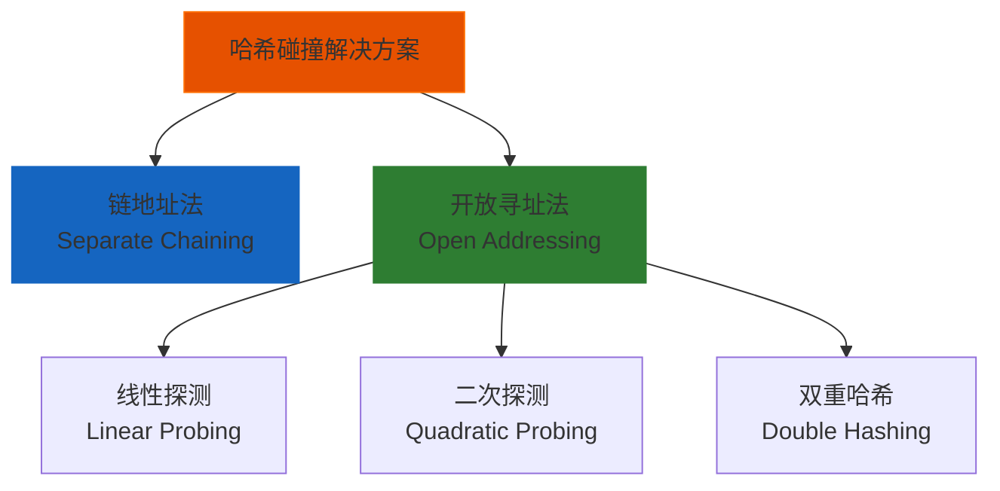

### 4.2 链地址法（Separate Chaining）

#### 4.2.1 原理

在每个槽位维护一个 **链表（或其他数据结构）**，所有映射到同一槽位的元素都放在这个链表中。

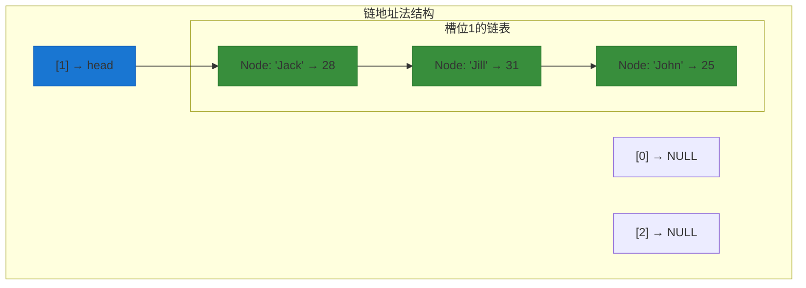

#### 4.2.2 链地址法操作示意

```
┌─────────────────────────────────────────────────────────────────┐
│                      链地址法操作演示                             │
├─────────────────────────────────────────────────────────────────┤
│                                                                 │
│  插入 "Alice" (hash = 3)                                        │
│  ─────────────────────────                                       │
│  [0] → NULL                                                     │
│  [1] → NULL                                                     │
│  [2] → NULL                                                     │
│  [3] → "Alice" ──► NULL                                         │
│  [4] → NULL                                                     │
│  ...                                                            │
│                                                                 │
│  插入 "Bob" (hash = 3, 碰撞!)                                    │
│  ─────────────────────────                                       │
│  [3] → "Bob" ──► "Alice" ──► NULL                               │
│                                                                 │
│  插入 "Charlie" (hash = 5)                                       │
│  ──────────────────────────                                      │
│  [5] → "Charlie" ──► NULL                                       │
│                                                                 │
└─────────────────────────────────────────────────────────────────┘
```

#### 4.2.3 Java 中的链地址法实现（HashMap）

```java
// JDK 1.8+ HashMap 核心结构
transient Node<K,V>[] table;

// Node 结构
static class Node<K,V> implements Map.Entry<K,V> {
    final int hash;
    final K key;
    V value;
    Node<K,V> next;  // 指向下一个节点的引用
}

// 查找操作
public V get(Object key) {
    Node<K,V>[] tab = table;
    int hash = hash(key);
    int n = tab.length;
    int index = (n - 1) & hash;
    
    Node<K,V> e = tab[index];
    if (e != null) {
        // 检查第一个节点
        if (e.hash == hash && (e.key == key || key.equals(e.key))) {
            return e.value;
        }
        // 遍历链表
        while (e.next != null) {
            e = e.next;
            if (e.hash == hash && (e.key == key || key.equals(e.key))) {
                return e.value;
            }
        }
    }
    return null;
}
```

#### 4.2.4 红黑树优化（JDK 1.8+）

当链表长度超过 **8** 时，链表会转换为 **红黑树**，以提升查找效率：

```java
// HashMap 中链表转红黑树的阈值
static final int TREEIFY_THRESHOLD = 8;

// 当单个桶的元素数量超过 8 时，链表转为红黑树
if (binCount >= TREEIFY_THRESHOLD - 1) {
    treeifyBin(tab, hash);
}
```

```
链表 vs 红黑树:
┌────────────────────────────────────────────────────────┐
│                                                        │
│   链表长度 ≤ 8                                          │
│   ├── 查找: O(n)                                       │
│   ├── 插入: O(1)                                       │
│   └── 适合少量元素                                      │
│                                                        │
│   链表长度 > 8 (且桶数组容量 ≥ 64)                       │
│   ├── 查找: O(log n)                                   │
│   ├── 插入: O(log n)                                   │
│   └── 适合大量元素                                      │
│                                                        │
└────────────────────────────────────────────────────────┘
```

### 4.3 开放寻址法（Open Addressing）

开放寻址法的核心思想是：**当发生碰撞时，寻找下一个空闲槽位**。

所有元素都存储在桶数组中，不使用额外的链表。

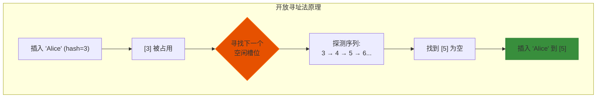

#### 4.3.1 线性探测（Linear Probing）

**探测公式**: `h(key, i) = (hash(key) + i) % m`  (i = 0, 1, 2, 3, ...)

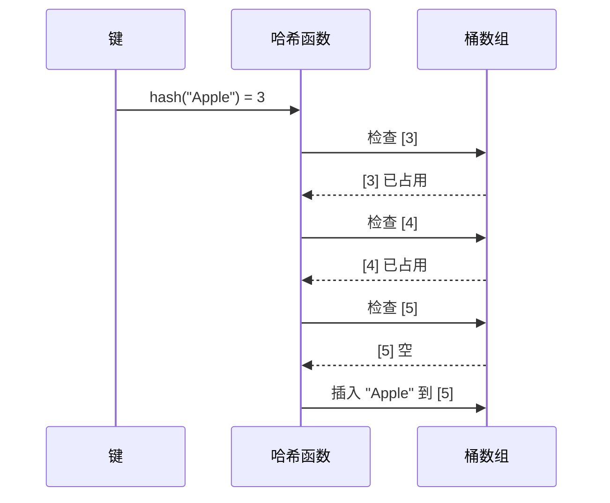

**示例**:

```
初始状态: [0]空 [1]空 [2]空 [3]空 [4]空 [5]空 [6]空 [7]空

插入 "Apple" (hash=3):  [3] → "Apple"

插入 "Banana" (hash=3, 碰撞!):
    [3] 已占用 → 检查 [4]
    [4] 空 → 插入 [4] → "Banana"

插入 "Cherry" (hash=5): [5] → "Cherry"

插入 "Date" (hash=4, 碰撞!):
    [4] 已占用 → 检查 [5]
    [5] 已占用 → 检查 [6]
    [6] 空 → 插入 [6] → "Date"

最终状态:
[0]空 [1]空 [2]空 [3]"Apple" [4]"Banana" [5]"Cherry" [6]"Date" [7]空
```

**线性探测的缺点**:

- 容易产生 **一次聚集（Primary Clustering）**
- 连续占用的槽位会越来越多，导致探测时间增加

```
一次聚集示意图:
┌─────────────────────────────────────┐
│  线性探测形成连续探测序列            │
├─────────────────────────────────────┤
│                                     │
│  [3]Apple → [4]Banana → [5]Cherry  │
│       ↑__________________↑          │
│         形成连续占用区间             │
│                                     │
│  当插入 hash=3 的元素时，           │
│  必须探测整个连续区间               │
│                                     │
└─────────────────────────────────────┘
```

#### 4.3.2 二次探测（Quadratic Probing）

**探测公式**: `h(key, i) = (hash(key) + c₁*i + c₂*i²) % m`  (i = 0, 1, 2, 3, ...)

通常取 `c₁ = 1, c₂ = 3`

```java
// 二次探测实现
private int probe(int hash, int i) {
    // h(key, i) = (hash + i + i²) % m
    return (hash + i + i * i) % tableSize;
}
```

**示例**:

```
插入 "Apple" (hash=3):  [3] → "Apple"

插入 "Banana" (hash=3, 碰撞!):
    i=0: [3] 已占用
    i=1: [3 + 1 + 1] = [5] 空 → 插入 [5] → "Banana"

插入 "Cherry" (hash=5): [5] → "Cherry"

插入 "Date" (hash=4, 碰撞!):
    i=0: [4] 已占用
    i=1: [4 + 1 + 1] = [6] 空 → 插入 [6] → "Date"
```

**二次探测的缺点**:

- 容易产生 **二次聚集（Secondary Clustering）**
- 具有相同起始探测位置的元素会形成相同的探测序列

```
二次聚集示意图:
┌─────────────────────────────────────┐
│  二次探测探测序列                    │
├─────────────────────────────────────┤
│                                     │
│  hash=3 的元素探测序列:              │
│  3 → 5 → 8 → 12 → 17 → ...         │
│                                     │
│  hash=7 的元素探测序列:              │
│  7 → 9 → 12 → 16 → 21 → ...        │
│        ↑                            │
│     在 12 再次碰撞                   │
│                                     │
└─────────────────────────────────────┘
```

#### 4.3.3 双重哈希（Double Hashing）

**探测公式**: `h(key, i) = (hash₁(key) + i * hash₂(key)) % m`

```java
// 双重哈希实现
public int hash(String key, int i) {
    int h1 = hash1(key);  // 主哈希
    int h2 = hash2(key);  // 二次哈希（必须与表大小互质）
    return (h1 + i * h2) % tableSize;
}

// hash₂(key) 通常选择: m - 2 的质数
public int hash2(String key, int tableSize) {
    int prime = tableSize - 2;  // 必须是质数且与 tableSize 互质
    return prime - (hash1(key) % prime);
}
```

**示例**:

```
假设 tableSize = 11, hash₁("Banana") = 3, hash₂("Banana") = 7

插入 "Banana":
    i=0: (3 + 0 * 7) % 11 = 3  → [3] 空 → 插入 [3]

    i=1: (3 + 1 * 7) % 11 = 10 → [10] 空 → 插入 [10]
```

**双重哈希的优点**:

- 有效避免聚集问题
- 探测序列更加均匀分布

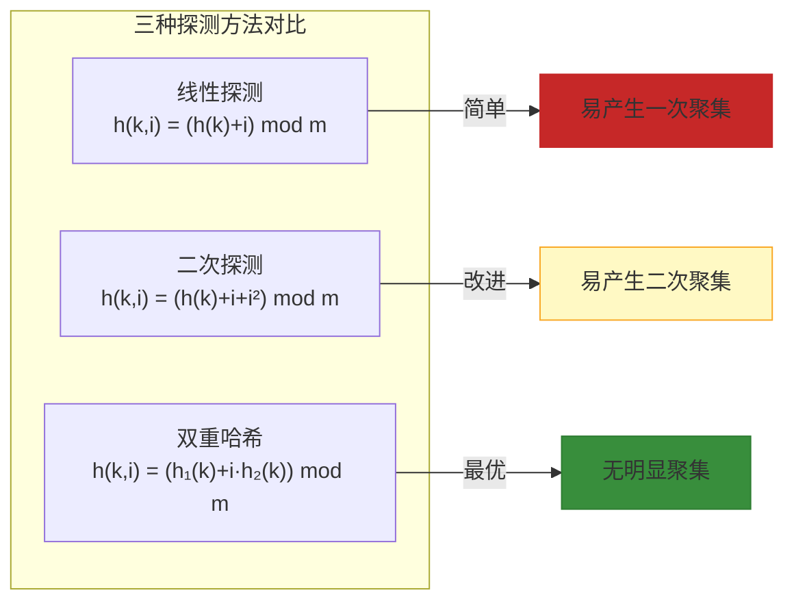

### 4.4 碰撞解决方案对比

| 特性 | 链地址法 | 线性探测 | 二次探测 | 双重哈希 |
|------|---------|---------|---------|---------|
| **数据结构** | 链表/红黑树 | 数组 | 数组 | 数组 |
| **最坏查找** | O(n) | O(n) | O(n) | O(n) |
| **平均查找** | O(1 + α) | O(1/(1-α)²) | O(-log(1-α)/α) | O(1/(1-α)) |
| **空间利用率** | α (可>1) | α < 1 | α < 1 | α < 1 |
| **聚集问题** | 无 | 一次聚集 | 二次聚集 | 无 |
| **实现复杂度** | 中等 | 简单 | 中等 | 复杂 |
| **删除操作** | 简单 | 复杂(需标记) | 复杂(需标记) | 复杂(需标记) |
| **缓存友好性** | 差 | 好 | 好 | 好 |

---

## 5. 负载因子与扩容策略

### 5.1 负载因子（Load Factor）

```
负载因子 α = n / m

其中:
  n = 存储的元素数量
  m = 桶数组的大小

α 越大 = 哈希表越拥挤 = 碰撞概率越高 = 性能下降
```

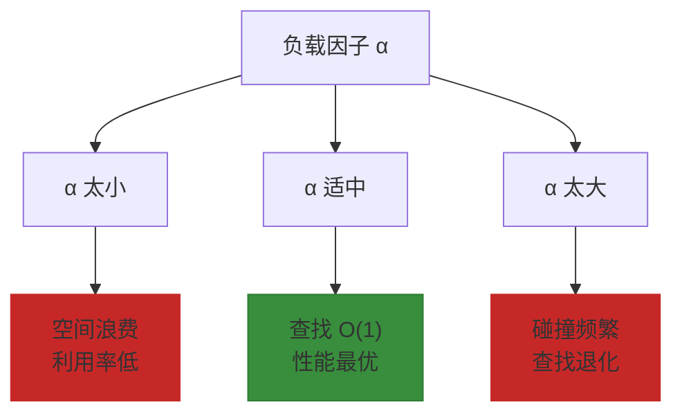

### 5.2 不同实现的负载因子阈值

| 实现 | 负载因子阈值 | 说明 |
|------|-------------|------|
| **Java HashMap** | 0.75 | 超过 0.75 触发扩容 |
| **Python dict** | 2/3 ≈ 0.667 | 超过 2/3 触发扩容 |
| **Redis** | 1 | 允许 100% 利用率，但性能下降 |
| **ConcurrentHashMap** | 0.75 | 同 HashMap |

### 5.3 扩容策略

#### 5.3.1 扩容时机

```java
// HashMap 扩容判断
if (size >= threshold) {
    resize();  // threshold = capacity * loadFactor
}
```

#### 5.3.2 扩容过程

```
扩容前 (capacity = 16, loadFactor = 0.75):
┌───┬───┬───┬───┬───┬───┬───┬───┐
│ A │ B │   │ C │   │ D │   │   │  实际元素: 12
└───┴───┴───┴───┴───┴───┴───┴───┘
 0   1   2   3   4   5   6   7

扩容后 (capacity = 32):
┌───┬───┬───┬───┬───┬───┬───┬───┬───┬───┬───┬───┬───┬───┬───┬───┐
│ A │   │   │   │ B │   │   │   │   │   │   │ C │   │   │   │ D │
└───┴───┴───┴───┴───┴───┴───┴───┴───┴───┴───┴───┴───┴───┴───┴───┘
 0   1   2   3   4   5   6   7   8   9  10  11  12  13  14  15
                                          ↑
                              元素重新分配，位置可能改变
```

#### 5.3.3 扩容时为什么需要重新哈希（Re-hashing）？

```
原因: 数组容量改变后，元素的下标计算公式 (key % capacity) 会改变

举例:
  原始 capacity = 8, key = "Alice"
  hash("Alice") = 15
  原下标: 15 % 8 = 7

  新 capacity = 16
  新下标: 15 % 16 = 15

  下标不同！必须重新计算所有元素的位置
```

### 5.4 渐进式扩容

为了避免一次性扩容带来的性能抖动，采用 **渐进式扩容**：

```java
// JDK 1.8+ HashMap 的优化
// 扩容时每个桶独立迁移，而不是一次性迁移所有元素

void resize() {
    Node<K,V>[] oldTab = table;
    int oldCap = oldTab.length;
    int newCap = oldCap << 1;  // 容量翻倍
    
    Node<K,V>[] newTab = new Node[newCap];
    table = newTab;
    
    // 迁移每个桶的链表/红黑树
    for (int i = 0; i < oldCap; i++) {
        Node<K,V> e = oldTab[i];
        if (e != null) {
            // 迁移逻辑
            split(e, i);
        }
    }
}

// 分批迁移，避免一次性性能抖动
private void split(Node<K,V> e, int i) {
    // 将一个桶的节点分散到新表的两个桶中
    // 低位桶: 原位置
    // 高位桶: 原位置 + oldCap
}
```

### 5.5 缩容策略

某些实现（如 Redis）会在元素删除后进行 **缩容**，以保持合理的内存利用率：

```
Redis 字典缩容:
┌─────────────────────────────────────┐
│                                     │
│  当元素数量 < 桶数组大小 * 哈希表缩容因子 │
│  时，触发缩容操作                    │
│                                     │
│  缩容因子默认: 0.1 (10%)             │
│                                     │
│  避免空间浪费                        │
│                                     │
└─────────────────────────────────────┘
```

---

## 6. 工程应用

### 6.1 Java HashMap 实现原理

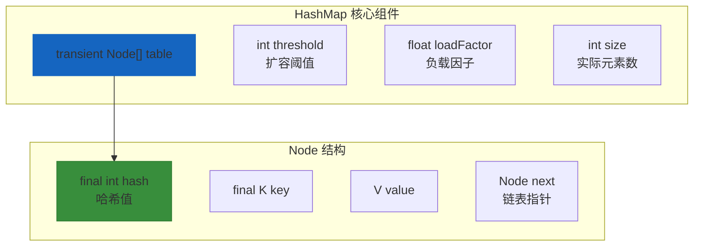

#### 6.1.1 HashMap 的关键参数

```java
public class HashMap<K,V> extends AbstractMap<K,V>
    implements Map<K,V>, Cloneable, Serializable {
    
    // 默认初始容量 = 16
    static final int DEFAULT_INITIAL_CAPACITY = 1 << 4;
    
    // 最大容量 = 2^30
    static final int MAXIMUM_CAPACITY = 1 << 30;
    
    // 默认负载因子 = 0.75
    static final float DEFAULT_LOAD_FACTOR = 0.75f;
    
    // 链表转红黑树阈值 = 8
    static final int TREEIFY_THRESHOLD = 8;
    
    // 红黑树转链表阈值 = 6
    static final int UNTREEIFY_THRESHOLD = 6;
    
    // 最小树化容量 = 64
    static final int MIN_TREEIFY_CAPACITY = 64;
}
```

#### 6.1.2 HashMap 的哈希计算

```java
// JDK 1.8+ 的哈希扰动函数
static final int hash(Object key) {
    int h;
    // 目的: 混合高16位和低16位，减少碰撞
    return (key == null) ? 0 : (h = key.hashCode()) ^ (h >>> 16);
}

// 计算数组下标
int index = (table.length - 1) & hash;
// 等价于: hash % table.length，但 & 运算更快
```

**哈希扰动图解**:

```
┌─────────────────────────────────────────────────────┐
│                 哈希扰动效果                          │
├─────────────────────────────────────────────────────┤
│                                                     │
│  key = "Alice"                                       │
│  key.hashCode() = 0b1001010101101110101011011100101 │
│                                                     │
│  高16位        │  低16位                             │
│  1001010101101110 │ 10101101011100101               │
│                                                     │
│  h >>> 16      = 0b00000000000000001001010101101110  │
│                                                     │
│  h ^ (h >>> 16)= 0b10010101011011101000000000100101  │
│                ↑________________↑                    │
│                  混合后的哈希值                       │
│                                                     │
│  效果: 原始 hashCode 只有低 16 位参与运算              │
│       扰动后，高 16 位也参与计算，减少碰撞            │
│                                                     │
└─────────────────────────────────────────────────────┘
```

### 6.2 Redis 字典（Dict）实现

Redis 的哈希表实现（字典）采用 **渐进式 rehash** 策略：

```c
// Redis 字典结构
typedef struct dict {
    dictType *type;        // 类型特定函数
    void *privdata;        // 私有数据
    dictht ht[2];          // 两个哈希表（用于渐进式 rehash）
    long rehashidx;        // rehash 进度标识，-1 表示未进行
    int iterators;         // 当前迭代器数量
} dict;

// 哈希表结构
typedef struct dictht {
    dictEntry **table;     // 哈希表数组
    unsigned long size;    // 桶数组大小
    unsigned long sizemask;// size - 1，用于计算索引
    unsigned long used;    // 已使用的节点数量
} dictht;
```

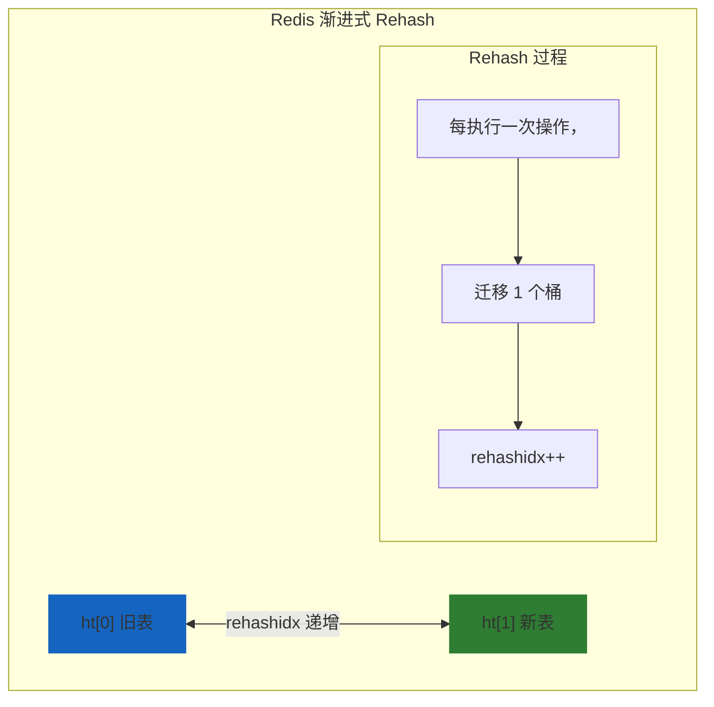

### 6.3 一致性哈希（Consistent Hashing）

#### 6.3.1 传统哈希的问题

```
传统哈希（取模法）:
┌─────────────────────────────────────────────────┐
│                                                 │
│  客户端 ──► hash(key) % N ──► 服务器             │
│                                                 │
│  问题: 当服务器数量变化时（扩容/缩容）            │
│       所有映射关系都需要重新计算                 │
│                                                 │
│  N = 3:  key % 3 = 0 ──► Server A              │
│  N = 4:  key % 4 = 0 ──► Server B  ← 错误!     │
│                                                 │
└─────────────────────────────────────────────────┘
```

#### 6.3.2 一致性哈希原理

```mermaid
graph TB
    subgraph 一致性哈希环
        direction TB
        
        subgraph 哈希空间 [0, 2³²)
            S1["Server A<br/>hash('A') = 100"]
            S2["Server B<br/>hash('B') = 300"]
            S3["Server C<br/>hash('C') = 500"]
            
            C1["Client 1<br/>key='user1' = 150"]
            C2["Client 2<br/>key='user2' = 450"]
            
            R1["顺时针找到 A<br/>150 → 300"]
            R2["顺时针找到 C<br/>450 → 500"]
        end
    end
    
    C1 -->|在环上| S1
    C2 -->|在环上| S3
    
    style S1 fill:#388e3c,stroke:#2e7d32
    style S2 fill:#388e3c,stroke:#2e7d32
    style S3 fill:#388e3c,stroke:#2e7d32
    style R1 fill:#e65100,stroke:#ff6f00
    style R2 fill:#e65100,stroke:#ff6f00
```

#### 6.3.3 虚拟节点

为了解决数据分布不均的问题，引入 **虚拟节点（Virtual Node）**：

```
物理节点与虚拟节点关系:
┌─────────────────────────────────────────────────┐
│                                                 │
│   Server A ──► A1, A2, A3, A4, A5 (5个虚拟节点) │
│   Server B ──► B1, B2, B3, B4, B5 (5个虚拟节点) │
│   Server C ──► C1, C2, C3, C4, C5 (5个虚拟节点) │
│                                                 │
│   总共 15 个虚拟节点均匀分布在哈希环上            │
│                                                 │
│   优点:                                         │
│   - 数据分布更均匀                               │
│   - 节点负载更均衡                               │
│   - 扩缩容影响更小                               │
│                                                 │
└─────────────────────────────────────────────────┘
```

#### 6.3.4 一致性哈希的优点

| 优点 | 说明 |
|------|------|
| **单调性** | 新增/删除节点只影响局部映射 |
| **负载均衡** | 虚拟节点实现更均匀的负载分布 |
| **容错性** | 节点故障只影响部分数据 |
| **可扩展性** | 容易添加新节点 |

### 6.4 LRU Cache 实现

#### 6.4.1 LRU 原理

LRU（Least Recently Used）缓存使用哈希表 + 双向链表实现：

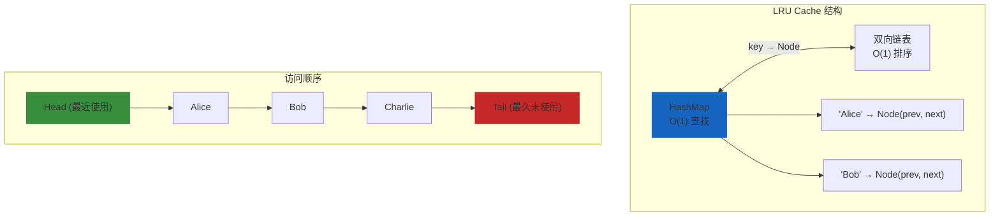

#### 6.4.2 Java LinkedHashMap 实现 LRU

```java
import java.util.*;

public class LRUCache<K, V> extends LinkedHashMap<K, V> {
    private final int capacity;
    
    public LRUCache(int capacity) {
        // accessOrder = true: 按访问顺序排序
        super(capacity, 0.75f, true);
        this.capacity = capacity;
    }
    
    @Override
    protected boolean removeEldestEntry(Map.Entry<K, V> eldest) {
        // 当 size 超过 capacity 时，删除最老的元素
        return size() > capacity;
    }
    
    public static void main(String[] args) {
        LRUCache<String, Integer> cache = new LRUCache<>(3);
        cache.put("Alice", 25);
        cache.put("Bob", 30);
        cache.put("Charlie", 28);
        
        // 访问 "Alice"，将其移到链表头部
        cache.get("Alice");
        
        // 再添加一个元素，会删除最久未使用的 "Bob"
        cache.put("David", 35);
        
        System.out.println(cache); // {Alice=25, Charlie=28, David=35}
    }
}
```

#### 6.4.3 Redis LRU 实现

Redis 使用以下策略实现 LRU：

```c
// Redis 近似 LRU 算法
// 每个对象有一个 lru 字段，记录最近访问时间
typedef struct redisObject {
    unsigned type:4;
    unsigned encoding:4;
    unsigned lru:24;  // LRU 时间戳（相对 server.lruclock）
    int refcount;
    void *ptr;
} robj;

// 采样淘汰：当内存超过 maxmemory 时，随机采样 n 个键
// 选择 lru 值最小的（最久未使用）进行淘汰
int freeMemoryIfNeeded(void) {
    while (server.memory_usage > server.maxmemory) {
        // 随机采样 5 个键
        for (int i = 0; i < server.maxmemory_samples; i++) {
            // 选择 lru 最老的键
        }
        evictionPoolPopulate();
    }
}
```

### 6.5 布隆过滤器（Bloom Filter）

#### 6.5.1 原理

布隆过滤器是一种 **空间效率极高的概率型数据结构**，用于判断一个元素 **可能存在** 或 **一定不存在**。

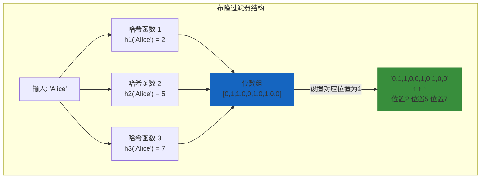

#### 6.5.2 添加和查询操作

```java
public class BloomFilter {
    private final BitSet bitArray;
    private final int size;
    private final int[] hashSeeds;
    
    public BloomFilter(int size, int hashCount) {
        this.bitArray = new BitSet(size);
        this.size = size;
        this.hashSeeds = new int[hashCount];
        Random random = new Random();
        for (int i = 0; i < hashCount; i++) {
            hashSeeds[i] = random.nextInt(size);
        }
    }
    
    // 添加元素
    public void add(String element) {
        for (int seed : hashSeeds) {
            int index = hash(element, seed) % size;
            bitArray.set(index, true);
        }
    }
    
    // 查询元素
    public boolean mightContain(String element) {
        for (int seed : hashSeeds) {
            int index = hash(element, seed) % size;
            if (!bitArray.get(index)) {
                return false;  // 一定不存在
            }
        }
        return true;  // 可能存在（存在误判）
    }
    
    private int hash(String element, int seed) {
        int result = 0;
        for (char c : element.toCharArray()) {
            result = result * 31 + c + seed;
        }
        return Math.abs(result);
    }
}
```

#### 6.5.3 布隆过滤器的特点

| 特性 | 说明 |
|------|------|
| **空间效率** | 只需约 9.6 bits/元素（误报率 1%） |
| **查询效率** | O(k)，k = 哈希函数数量 |
| **不存在确定** | 如果返回 false，则一定不存在 |
| **存在误报** | 如果返回 true，可能不存在（假阳性） |
| **不支持删除** | 无法删除已添加的元素 |

#### 6.5.4 参数计算

```
┌─────────────────────────────────────────────────────┐
│  布隆过滤器参数公式                                   │
├─────────────────────────────────────────────────────┤
│                                                     │
│  m = -n * ln(p) / (ln(2)²)                         │
│                                                     │
│  k = (m / n) * ln(2)                               │
│                                                     │
│  其中:                                              │
│    n = 预期元素数量                                 │
│    p = 期望误报率                                   │
│    m = 位数组大小                                   │
│    k = 哈希函数数量                                 │
│                                                     │
│  示例: n = 10000, p = 0.01 (1%)                    │
│    m ≈ 95851 bits ≈ 12 KB                          │
│    k ≈ 7 个哈希函数                                 │
│                                                     │
└─────────────────────────────────────────────────────┘
```

#### 6.5.5 布隆过滤器的应用场景

| 场景 | 用途 |
|------|------|
| **缓存穿透防护** | 判断请求是否存在于数据库 |
| **黑名单过滤** | 判断 IP/邮箱是否在黑名单 |
| **网页爬虫** | 判断 URL 是否已爬取 |
| **推荐系统** | 判断内容是否已推荐过 |
| **Redis 缓存** | Redis 6+ 内置 Bloom 模块 |

---

## 7. 复杂度分析

### 7.1 时间复杂度

| 操作 | 平均时间复杂度 | 最坏时间复杂度 | 说明 |
|------|---------------|---------------|------|
| **查找** | O(1) | O(n) | 无碰撞时 O(1)，有碰撞时取决于链表长度 |
| **插入** | O(1) | O(n) | 哈希计算 O(1)，碰撞时需遍历 |
| **删除** | O(1) | O(n) | 同插入 |
| **扩容** | O(n) | O(n) | 需要重新计算所有元素的位置 |

### 7.2 空间复杂度

| 数据结构 | 空间复杂度 |
|----------|-----------|
| 哈希表 | O(n + m) |
| 链地址法 | O(n + m) |
| 开放寻址法 | O(m) |

其中 n = 元素数量，m = 桶数组大小

### 7.3 不同实现的复杂度对比

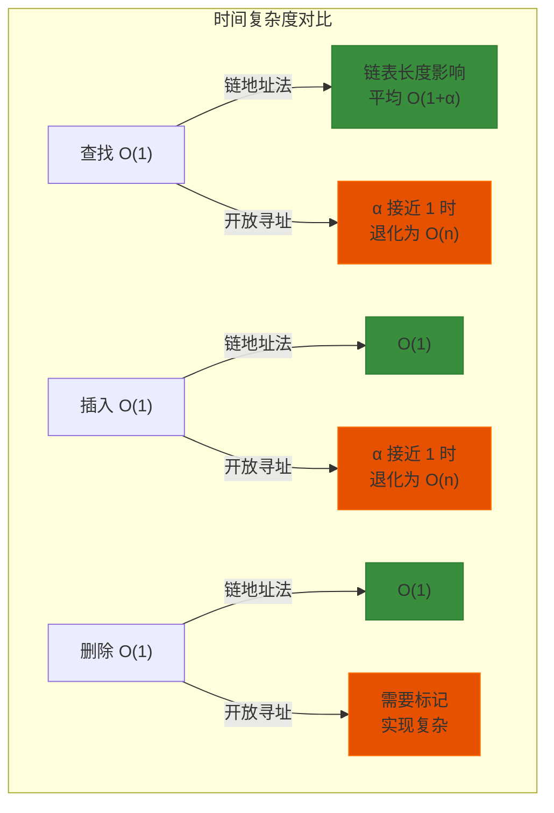

### 7.4 性能影响因素

| 因素 | 影响 |
|------|------|
| **负载因子 α** | α 越大，碰撞越多，性能下降 |
| **哈希函数质量** | 均匀分布减少碰撞 |
| **冲突解决方法** | 链地址法 vs 开放寻址法 |
| **扩容策略** | 适时扩容可保持低 α |
| **数据特性** | 键的分布影响碰撞概率 |

---

## 8. 总结

### 8.1 核心要点

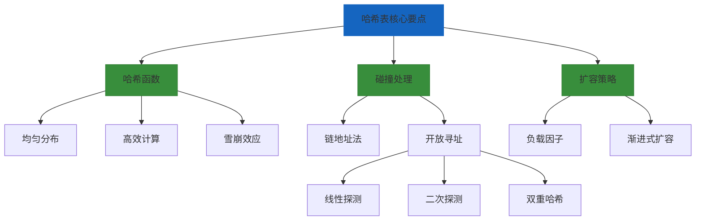

### 8.2 各方案对比总结

| 方案 | 优点 | 缺点 | 适用场景 |
|------|------|------|----------|
| **链地址法** | 实现简单，删除方便 | 链表占用额外空间 | 数据量不确定 |
| **线性探测** | 缓存友好，实现简单 | 聚集问题 | 小数据量 |
| **二次探测** | 缓解一次聚集 | 二次聚集 | 中等数据量 |
| **双重哈希** | 无明显聚集 | 实现复杂 | 通用场景 |

### 8.3 工程实践建议

1. **选择合适的负载因子**: 一般选择 0.7~0.75
2. **选择合适的初始容量**: 根据预估数据量设置，避免频繁扩容
3. **使用高质量哈希函数**: 减少碰撞概率
4. **考虑使用渐进式扩容**: 避免一次性性能抖动
5. **根据场景选择实现**: HashMap/Redis dict/ConcurrentHashMap

### 8.4 哈希表 vs 其他数据结构

| 特性 | 哈希表 | 数组 | 链表 | 平衡树 |
|------|--------|------|------|--------|
| **查找** | O(1) | O(1) | O(n) | O(log n) |
| **插入** | O(1) | O(n) | O(1) | O(log n) |
| **删除** | O(1) | O(n) | O(1) | O(log n) |
| **有序遍历** | 无序 | 有序 | 有序 | 有序 |
| **空间效率** | 较低 | 高 | 较低 | 较高 |

---

## 参考资料

- Cormen, T. H., et al. *Introduction to Algorithms* (CLRS)
- Java SE 17 API Documentation - HashMap
- Redis 7.0 Source Code - dict.c
- Knuth, D. E. *The Art of Computer Programming, Volume 3*
