# 树与二叉树

## 目录

- [树基础](#树基础)
- [二叉树](#二叉树)
- [二叉树遍历](#二叉树遍历)
- [工程应用](#工程应用)

---

## 树基础

### 树的定义

树（Tree）是一种非线性数据结构，由 n（n >= 0）个节点组成的有限集合。当 n = 0 时，称为空树。

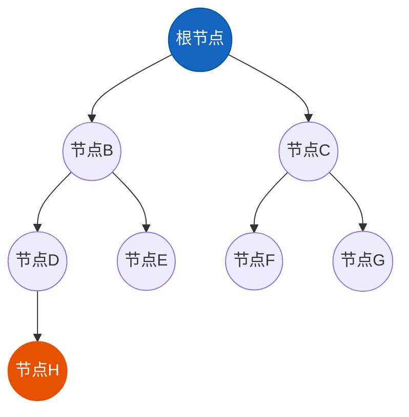

**树的核心特征：**
- 有且仅有一个根节点（Root）
- 根节点没有父节点
- 除根节点外，每个节点有且仅有一个父节点
- 节点间形成层次关系

### 树的基本术语

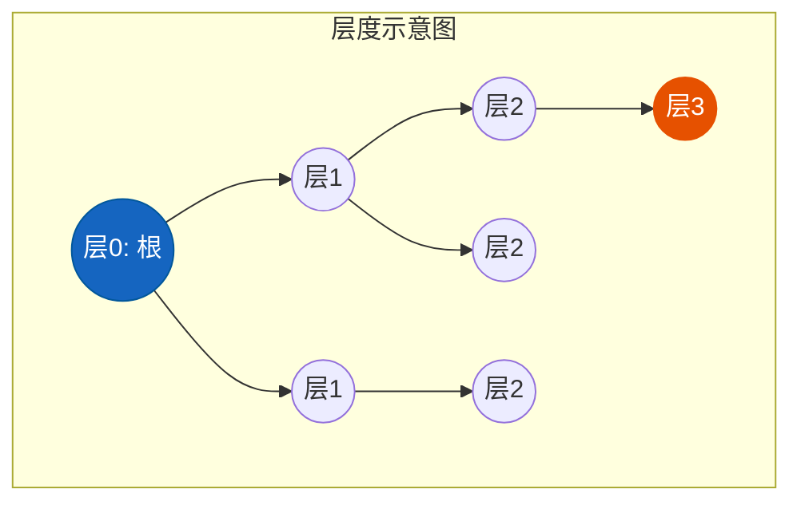

| 术语 | 定义 | 示例说明 |
|------|------|----------|
| **根节点（Root）** | 树的最顶层节点，没有父节点 | 上图中节点A |
| **父节点（Parent）** | 有子节点的节点 | 节点A是B和C的父节点 |
| **子节点（Child）** | 某个节点直接关联的下一层节点 | 节点B和C是A的子节点 |
| **叶节点（Leaf）** | 没有子节点的节点 | 上图中节点H |
| **子树（Subtree）** | 某个节点及其所有后代形成的树 | 以B为根的子树包含B,D,E,H |
| **节点的度（Degree）** | 子树的数量 | B的度为2，D的度为1 |
| **树的度** | 所有节点度的最大值 | 本树度为2 |

### 高度、深度、层

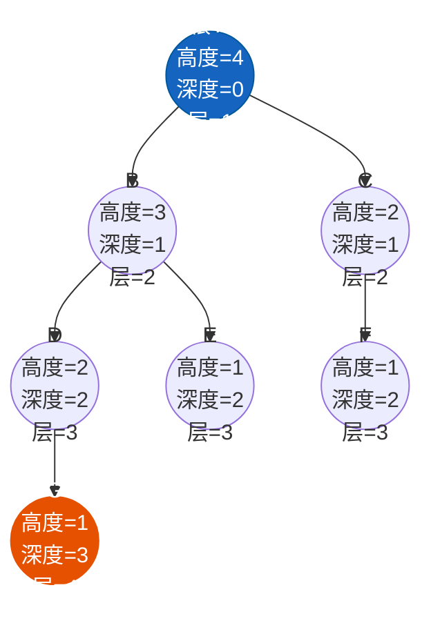

- **节点的深度（Depth）**：从根节点到该节点的唯一路径上的边数
- **节点的高度（Height）**：从该节点到最深叶节点的路径上的边数
- **树的深度**：所有节点深度的最大值
- **树的高度**：所有节点高度的最大值
- **节点的层（Level）**：根节点为第1层，其子节点为第2层，依此类推

### 树的分类

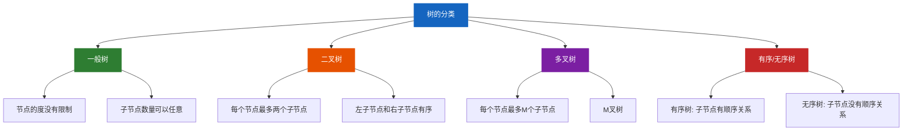

---

## 二叉树

### 二叉树定义

二叉树（Binary Tree）是每个节点最多有两个子节点的树结构，通常称为左子节点和右子节点。

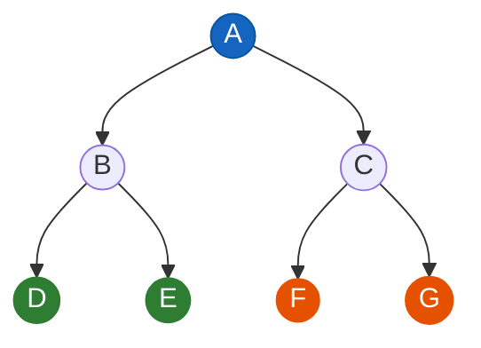

### 二叉树的分类

#### 满二叉树（Full Binary Tree）

所有叶节点都在最后一层，且所有非叶节点都有两个子节点。

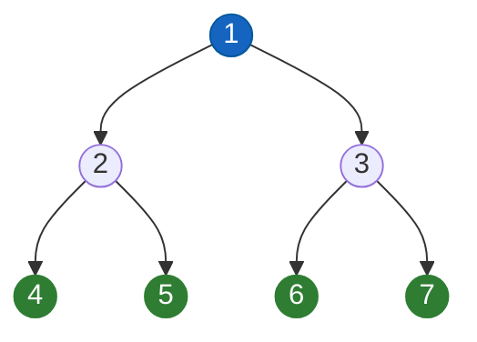

**特点：**
- 叶节点数 = 节点数 + 1 / 2
- 高度为 h 的满二叉树，节点总数 = 2^h - 1

#### 完全二叉树（Complete Binary Tree）

除最后一层外，每一层都是满的，最后一层的节点从左到右紧密排列。

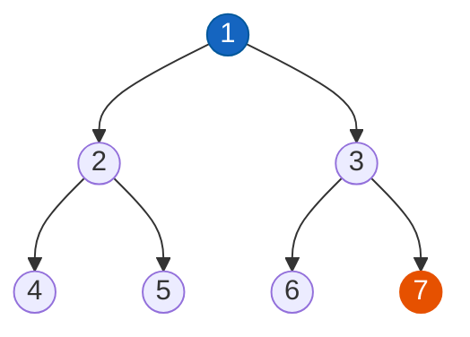

**特点：**
- 可以用数组连续存储
- 父节点索引为 i，则左子节点为 2i+1，右子节点为 2i+2

#### 平衡二叉树（AVL树）

左右子树高度差绝对值不超过1的二叉搜索树。

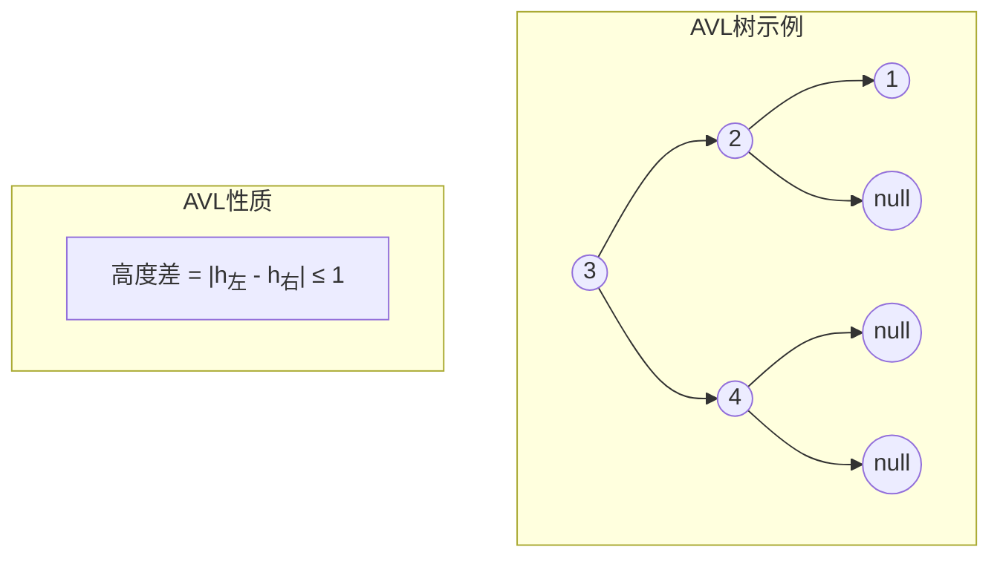

### 二叉树的存储

#### 链式存储

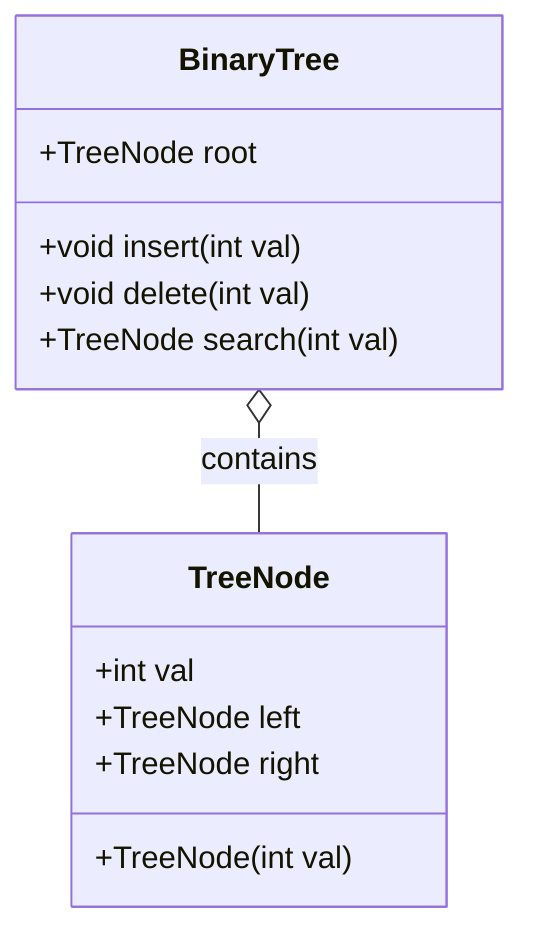

**节点定义：**

```java
public class TreeNode {
    int val;
    TreeNode left;
    TreeNode right;
    
    public TreeNode(int val) {
        this.val = val;
        this.left = null;
        this.right = null;
    }
}
```

#### 顺序存储

对于完全二叉树，可以使用数组顺序存储：

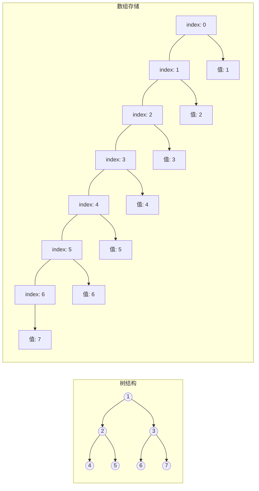

**索引关系：**
- 父节点索引为 i
- 左子节点索引：2i + 1
- 右子节点索引：2i + 2
- 子节点索引为 i，父节点索引：(i - 1) / 2

---

## 二叉树遍历

### 遍历概述

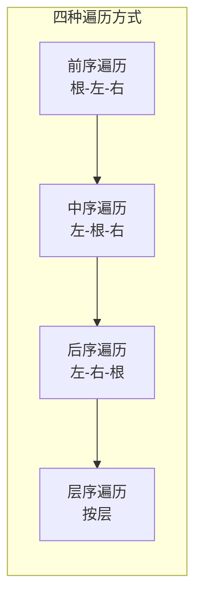

以以下二叉树为例：

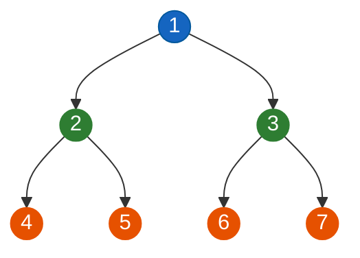

| 遍历方式 | 顺序 | 结果 |
|----------|------|------|
| 前序 | 根-左-右 | 1, 2, 4, 5, 3, 6, 7 |
| 中序 | 左-根-右 | 4, 2, 5, 1, 6, 3, 7 |
| 后序 | 左-右-根 | 4, 5, 2, 6, 7, 3, 1 |
| 层序 | 按层 | 1, 2, 3, 4, 5, 6, 7 |

### 前序遍历（Preorder）

**顺序：根节点 -> 左子树 -> 右子树**

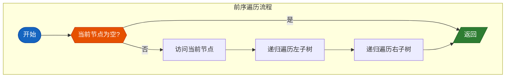

**遍历过程可视化：**

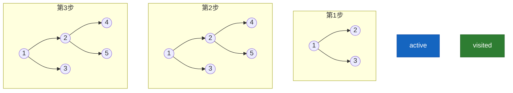

#### 递归实现

```java
public void preorderRecursive(TreeNode root) {
    if (root == null) {
        return;
    }
    // 访问根节点
    System.out.print(root.val + " ");
    // 递归遍历左子树
    preorderRecursive(root.left);
    // 递归遍历右子树
    preorderRecursive(root.right);
}

// 使用List收集结果
public List<Integer> preorderTraversal(TreeNode root) {
    List<Integer> result = new ArrayList<>();
    preorderHelper(root, result);
    return result;
}

private void preorderHelper(TreeNode node, List<Integer> result) {
    if (node == null) {
        return;
    }
    result.add(node.val);
    preorderHelper(node.left, result);
    preorderHelper(node.right, result);
}
```

#### 迭代实现

```java
public List<Integer> preorderIteration(TreeNode root) {
    List<Integer> result = new ArrayList<>();
    if (root == null) {
        return result;
    }
    
    Stack<TreeNode> stack = new Stack<>();
    stack.push(root);
    
    while (!stack.isEmpty()) {
        TreeNode node = stack.pop();
        result.add(node.val);
        
        // 先压右子节点，再压左子节点（出栈时先访问左）
        if (node.right != null) {
            stack.push(node.right);
        }
        if (node.left != null) {
            stack.push(node.left);
        }
    }
    
    return result;
}
```

### 中序遍历（Inorder）

**顺序：左子树 -> 根节点 -> 右子树**

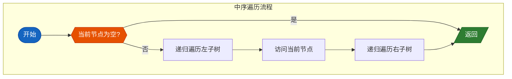

#### 递归实现

```java
public void inorderRecursive(TreeNode root) {
    if (root == null) {
        return;
    }
    // 递归遍历左子树
    inorderRecursive(root.left);
    // 访问根节点
    System.out.print(root.val + " ");
    // 递归遍历右子树
    inorderRecursive(root.right);
}

// 使用List收集结果
public List<Integer> inorderTraversal(TreeNode root) {
    List<Integer> result = new ArrayList<>();
    inorderHelper(root, result);
    return result;
}

private void inorderHelper(TreeNode node, List<Integer> result) {
    if (node == null) {
        return;
    }
    inorderHelper(node.left, result);
    result.add(node.val);
    inorderHelper(node.right, result);
}
```

#### 迭代实现

```java
public List<Integer> inorderIteration(TreeNode root) {
    List<Integer> result = new ArrayList<>();
    Stack<TreeNode> stack = new Stack<>();
    TreeNode current = root;
    
    while (current != null || !stack.isEmpty()) {
        // 一直向左走
        while (current != null) {
            stack.push(current);
            current = current.left;
        }
        // 弹出节点并访问
        current = stack.pop();
        result.add(current.val);
        // 转向右子树
        current = current.right;
    }
    
    return result;
}
```

### 后序遍历（Postorder）

**顺序：左子树 -> 右子树 -> 根节点**

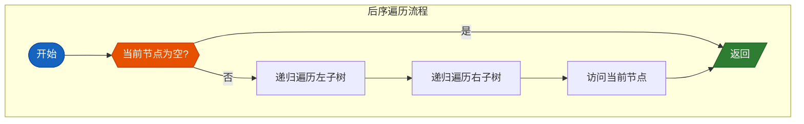

#### 递归实现

```java
public void postorderRecursive(TreeNode root) {
    if (root == null) {
        return;
    }
    // 递归遍历左子树
    postorderRecursive(root.left);
    // 递归遍历右子树
    postorderRecursive(root.right);
    // 访问根节点
    System.out.print(root.val + " ");
}

// 使用List收集结果
public List<Integer> postorderTraversal(TreeNode root) {
    List<Integer> result = new ArrayList<>();
    postorderHelper(root, result);
    return result;
}

private void postorderHelper(TreeNode node, List<Integer> result) {
    if (node == null) {
        return;
    }
    postorderHelper(node.left, result);
    postorderHelper(node.right, result);
    result.add(node.val);
}
```

#### 迭代实现

```java
public List<Integer> postorderIteration(TreeNode root) {
    List<Integer> result = new ArrayList<>();
    if (root == null) {
        return result;
    }
    
    Stack<TreeNode> stack = new Stack<>();
    TreeNode current = root;
    TreeNode lastVisited = null;
    
    while (current != null || !stack.isEmpty()) {
        // 一直向左走
        while (current != null) {
            stack.push(current);
            current = current.left;
        }
        
        // 查看当前节点
        TreeNode peekNode = stack.peek();
        
        // 如果右子节点存在且未被访问
        if (peekNode.right != null && lastVisited != peekNode.right) {
            current = peekNode.right;
        } else {
            // 访问节点
            result.add(peekNode.val);
            lastVisited = stack.pop();
        }
    }
    
    return result;
}
```

### 层序遍历（BFS）

**顺序：按层从左到右访问**

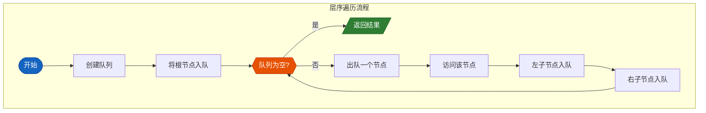

#### 实现

```java
public List<Integer> levelOrder(TreeNode root) {
    List<Integer> result = new ArrayList<>();
    if (root == null) {
        return result;
    }
    
    Queue<TreeNode> queue = new LinkedList<>();
    queue.offer(root);
    
    while (!queue.isEmpty()) {
        int levelSize = queue.size();
        
        for (int i = 0; i < levelSize; i++) {
            TreeNode node = queue.poll();
            result.add(node.val);
            
            if (node.left != null) {
                queue.offer(node.left);
            }
            if (node.right != null) {
                queue.offer(node.right);
            }
        }
    }
    
    return result;
}
```

#### 层序遍历分层结果

```java
public List<List<Integer>> levelOrderMulti(TreeNode root) {
    List<List<Integer>> result = new ArrayList<>();
    if (root == null) {
        return result;
    }
    
    Queue<TreeNode> queue = new LinkedList<>();
    queue.offer(root);
    
    while (!queue.isEmpty()) {
        int levelSize = queue.size();
        List<Integer> level = new ArrayList<>();
        
        for (int i = 0; i < levelSize; i++) {
            TreeNode node = queue.poll();
            level.add(node.val);
            
            if (node.left != null) {
                queue.offer(node.left);
            }
            if (node.right != null) {
                queue.offer(node.right);
            }
        }
        result.add(level);
    }
    
    return result;
}
```

### 遍历复杂度分析

| 遍历方式 | 时间复杂度 | 空间复杂度 | 说明 |
|----------|------------|------------|------|
| 前序/中序/后序 | O(n) | O(h) | h为树的高度 |
| 层序遍历 | O(n) | O(w) | w为树的最大宽度 |

---

## 工程应用

### 表达式树

表达式树是一种二叉树，用于表示算术表达式。

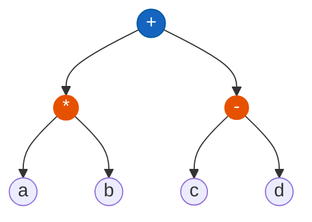

**表达式 (a * b) + (c - d) 的表达式树：**

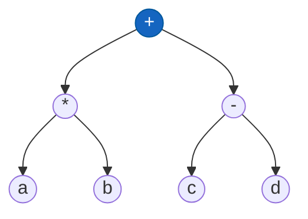

- **中序遍历**：a * b + c - d（原始表达式）
- **后序遍历**：a b * c d - +（后缀表达式/逆波兰表达式）
- **前序遍历**：+ * a b - c d（前缀表达式/波兰表达式）

### Trie树（字典树/前缀树）

Trie树用于存储和查找字符串集合，特别适合前缀匹配。

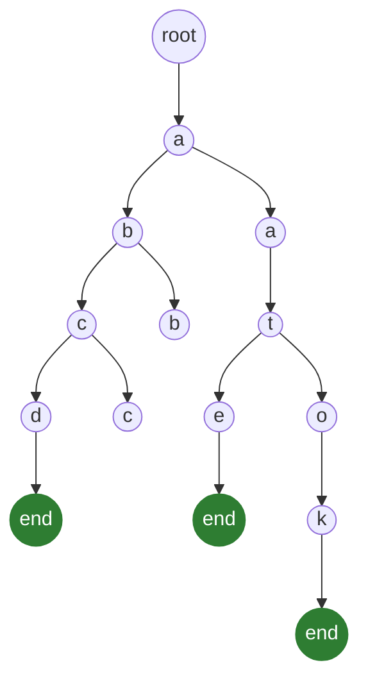

**存储的字符串：** "abcd", "abcat", "book"

**特点：**
- 每个节点代表一个字符
- 从根到叶节点的路径代表一个字符串
- 公共前缀共享节点
- 时间复杂度 O(m)，m为字符串长度

**Java实现：**

```java
class TrieNode {
    boolean isEnd;
    TrieNode[] children = new TrieNode[26];
    
    public TrieNode() {
        isEnd = false;
        for (int i = 0; i < 26; i++) {
            children[i] = null;
        }
    }
}

class Trie {
    private TrieNode root;
    
    public Trie() {
        root = new TrieNode();
    }
    
    // 插入
    public void insert(String word) {
        TrieNode node = root;
        for (char c : word.toCharArray()) {
            int index = c - 'a';
            if (node.children[index] == null) {
                node.children[index] = new TrieNode();
            }
            node = node.children[index];
        }
        node.isEnd = true;
    }
    
    // 查找
    public boolean search(String word) {
        TrieNode node = searchPrefix(word);
        return node != null && node.isEnd;
    }
    
    // 前缀匹配
    public boolean startsWith(String prefix) {
        return searchPrefix(prefix) != null;
    }
    
    private TrieNode searchPrefix(String prefix) {
        TrieNode node = root;
        for (char c : prefix.toCharArray()) {
            int index = c - 'a';
            if (node.children[index] == null) {
                return null;
            }
            node = node.children[index];
        }
        return node;
    }
}
```

### 文件系统目录结构

操作系统使用树结构管理文件目录：

```mermaid
graph TB
    ROOT((" / ")) --> HOME(("home"))
    ROOT((" / ")) --> USR(("usr"))
    ROOT((" / ")) --> ETC(("etc"))
    
    HOME(("home")) --> USER1(("user1"))
    HOME(("home")) --> USER2(("user2"))
    
    USER1(("user1")) --> DOCS(("docs"))
    USER1(("user1")) --> DOWNLOADS(("downloads"))
    
    DOCS(("docs")) --> FILE1(("readme.md"))
    DOCS(("docs")) --> FILE2(("notes.txt"))
    
    DOWNLOADS(("downloads")) --> FILE3(("package.zip"))
    
    USR(("usr")) --> BIN(("bin"))
    USR(("usr")) --> LIB(("lib"))
    
    style ROOT fill:#1565c0,stroke:#01579b,color:#ffffff
    style FILE1 fill:#2e7d32,stroke:#2e7d32,color:#ffffff
    style FILE2 fill:#2e7d32,stroke:#2e7d32,color:#ffffff
    style FILE3 fill:#2e7d32,stroke:#2e7d32,color:#ffffff
```

**应用场景：**
- 目录遍历（递归/迭代）
- 搜索文件
- 计算目录大小
- 权限管理

### XML/HTML解析（DOM树）

```mermaid
graph TB
    DOC(("document")) --> HTML(("html"))
    HTML --> HEAD(("head"))
    HTML --> BODY(("body"))
    
    HEAD(("head")) --> TITLE(("title"))
    TITLE --> TEXT(("文本内容"))
    
    BODY(("body")) --> DIV1(("div"))
    BODY(("body")) --> P(("p"))
    
    DIV1(("div")) --> H1(("h1"))
    DIV1(("div")) --> UL(("ul"))
    
    H1(("h1")) --> HTEXT(("标题"))
    
    UL(("ul")) --> LI1(("li"))
    UL(("ul")) --> LI2(("li"))
    UL(("ul")) --> LI3(("li"))
    
    LI1(("li")) --> L1TEXT(("列表项1"))
    LI2(("li")) --> L2TEXT(("列表项2"))
    LI3(("li")) --> L3TEXT(("列表项3"))
    
    P(("p")) --> PTEXT(("段落文本"))
    
    style DOC fill:#1565c0,stroke:#01579b,color:#ffffff
    style HTML fill:#e65100,stroke:#e65100,color:#ffffff
    style HEAD fill:#2e7d32,stroke:#2e7d32,color:#ffffff
    style BODY fill:#2e7d32,stroke:#2e7d32,color:#ffffff
```

**DOM树遍历示例：**

```java
// 伪代码：DOM树遍历
public void traverseDOM(Node node) {
    if (node == null) return;
    
    // 前序遍历
    processNode(node);  // 处理当前节点
    
    for (Node child : node.getChildren()) {
        traverseDOM(child);
    }
    
    // 后序遍历
    // postProcess(node);
}
```

### 二叉树构建可视化

#### 从数组构建

```java
public TreeNode buildTree(Integer[] arr) {
    if (arr == null || arr.length == 0) {
        return null;
    }
    
    TreeNode root = new TreeNode(arr[0]);
    Queue<TreeNode> queue = new LinkedList<>();
    queue.offer(root);
    
    int i = 1;
    while (!queue.isEmpty() && i < arr.length) {
        TreeNode current = queue.poll();
        
        // 构建左子节点
        if (i < arr.length && arr[i] != null) {
            current.left = new TreeNode(arr[i]);
            queue.offer(current.left);
        }
        i++;
        
        // 构建右子节点
        if (i < arr.length && arr[i] != null) {
            current.right = new TreeNode(arr[i]);
            queue.offer(current.right);
        }
        i++;
    }
    
    return root;
}
```

#### 构建过程图解

给定数组 [1, 2, 3, 4, 5, 6, 7]：

```mermaid
graph TB
    subgraph 第0步-初始
        R0["根节点: 1"]
    end
    
    subgraph 第1步-层1
        R1((1)) --> L1((2))
        R1((1)) --> R1_((3))
    end
    
    subgraph 第2步-层2
        R2((1)) --> L2((2))
        R2((1)) --> R2_((3))
        L2((2)) --> LL2((4))
        L2((2)) --> LR2((5))
        R2_((3)) --> RL2((6))
        R2_((3)) --> RR2((7))
    end
    
    style R0 fill:#1565c0,stroke:#0d47a1,color:#ffffff
    style R1 fill:#1565c0,stroke:#0d47a1,color:#ffffff
    style R2 fill:#1565c0,stroke:#0d47a1,color:#ffffff
    style LL2 fill:#e65100,stroke:#bf360c,color:#ffffff
    style LR2 fill:#e65100,stroke:#bf360c,color:#ffffff
    style RL2 fill:#e65100,stroke:#bf360c,color:#ffffff
    style RR2 fill:#e65100,stroke:#bf360c,color:#ffffff
```

---

## 总结

```mermaid
flowchart TB
    A["二叉树总结"] --> B["基础概念"]
    A --> C["二叉树分类"]
    A --> D["存储方式"]
    A --> E["遍历方式"]
    A --> F["工程应用"]
    
    B --> B1["节点、根节点、叶节点"]
    B --> B2["高度、深度、层"]
    B --> B3["度与子树"]
    
    C --> C1["满二叉树"]
    C --> C2["完全二叉树"]
    C --> C3["平衡二叉树"]
    
    D --> D1["链式存储"]
    D --> D2["顺序存储"]
    
    E --> E1["前序(根-左-右)"]
    E --> E2["中序(左-根-右)"]
    E --> E3["后序(左-右-根)"]
    E --> E4["层序(BFS)"]
    
    F --> F1["表达式树"]
    F --> F2["Trie字典树"]
    F --> F3["文件系统"]
    F --> F4["DOM解析"]
    
    style A fill:#1565c0,stroke:#1565c0,color:#ffffff
    style B fill:#2e7d32,stroke:#2e7d32,color:#ffffff
    style C fill:#e65100,stroke:#e65100,color:#ffffff
    style D fill:#7b1fa2,stroke:#7b1fa2,color:#ffffff
    style E fill:#c62828,stroke:#c62828,color:#ffffff
    style F fill:#00838f,stroke:#00838f,color:#ffffff
```

**关键要点：**
1. 二叉树遍历的核心是递归思想的体现
2. 迭代实现需要借助栈（DFS）或队列（BFS）
3. 不同遍历顺序适用于不同场景
4. 树结构在实际工程中应用广泛
