# 堆与优先队列

## 目录

- [堆的定义](#堆的定义)
- [堆的顺序存储](#堆的顺序存储)
- [堆的基本操作](#堆的基本操作)
- [堆排序算法](#堆排序算法)
- [优先队列](#优先队列)
- [工程应用](#工程应用)

---

## 堆的定义

堆（Heap）是一种特殊的完全二叉树，分为两种类型：

| 类型 | 定义 | 特点 |
|------|------|------|
| **大顶堆（Max Heap）** | 每个节点的值都大于等于其子节点的值 | 堆顶是最大值 |
| **小顶堆（Min Heap）** | 每个节点的值都小于等于其子节点的值 | 堆顶是最小值 |

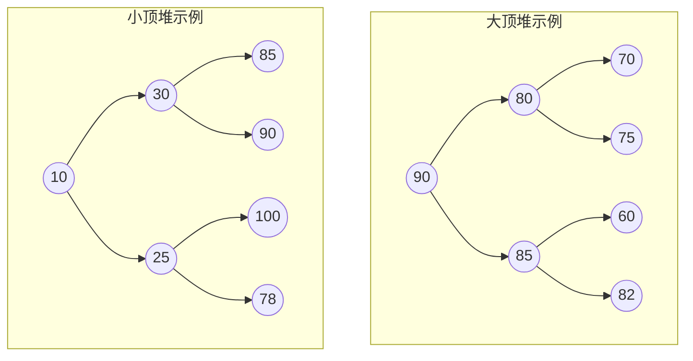

### 堆的性质

1. **完全二叉树**：除最后一层外，每一层都是满的，且最后一层的节点集中在左侧
2. **堆序性**：父节点与子节点之间存在特定的顺序关系
3. **结构性**：可以用数组高效存储

---

## 堆的顺序存储

堆通常使用数组来存储，不需要指针，节省空间且访问效率高。

### 索引关系

对于数组中索引为 `i` 的节点（从0开始）：
- **父节点索引**：`parent = (i - 1) / 2`
- **左子节点索引**：`left = 2 * i + 1`
- **右子节点索引**：`right = 2 * i + 2`

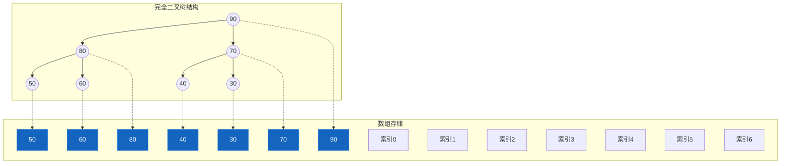

### 数组索引与树节点对应关系

```
数组索引:   0     1     2     3     4     5     6
          ┌─────┬─────┬─────┬─────┬─────┬─────┬─────┐
数组值:    │ 90  │ 80  │ 70  │ 50  │ 60  │ 40  │ 30  │
          └─────┴─────┴─────┴─────┴─────┴─────┴─────┘
              │     │     │     │     │     │     │
              ▼     ▼     ▼     ▼     ▼     ▼     ▼
树节点:      90    80    70    50    60    40    30
            ┌─┘┌──┘
            │  │
            └──┴──► 索引i的父节点 = (i-1)/2
                   索引i的左子 = 2*i+1
                   索引i的右子 = 2*i+2
```

---

## 堆的基本操作

### 1. sift up（上浮）

当向堆尾添加一个元素时，可能破坏堆的性质，需要将元素向上比较并交换。

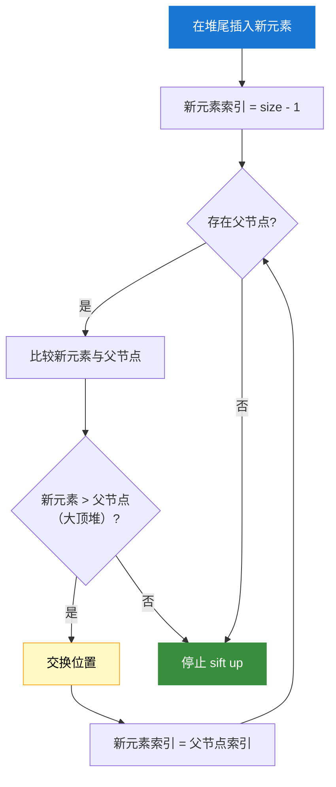

**代码实现（大顶堆 sift up）：**

```java
/**
 * sift up 上浮操作
 * 将索引i的元素上浮到正确位置
 * @param heap 堆数组
 * @param i 要上浮的索引
 */
public void siftUp(int[] heap, int i) {
    int n = heap.length;
    while (i > 0) {
        int parent = (i - 1) / 2;
        // 大顶堆：如果当前元素大于父节点，则交换
        if (heap[i] > heap[parent]) {
            swap(heap, i, parent);
            i = parent;
        } else {
            break;
        }
    }
}

/**
 * 向堆中添加元素
 * @param heap 堆数组
 * @param value 要添加的值
 * @return 添加后的堆大小
 */
public int push(int[] heap, int value) {
    int size = heap[0];
    heap[size + 1] = value;
    heap[0] = size + 1;
    siftUp(heap, size + 1);
    return heap[0];
}
```

### 2. sift down（下沉）

当移除堆顶或修改堆顶元素时，需要将元素向下比较并交换。

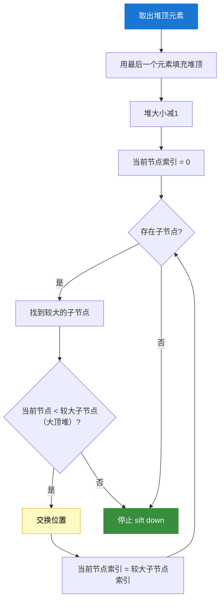

**代码实现（大顶堆 sift down）：**

```java
/**
 * sift down 下沉操作
 * 将索引i的元素下沉到正确位置
 * @param heap 堆数组
 * @param i 要下沉的索引
 * @param heapSize 堆的有效大小
 */
public void siftDown(int[] heap, int i, int heapSize) {
    while (true) {
        int left = 2 * i + 1;   // 左子节点
        int right = 2 * i + 2;  // 右子节点
        int largest = i;         // 假设当前节点最大

        // 左子节点比当前节点大
        if (left < heapSize && heap[left] > heap[largest]) {
            largest = left;
        }
        // 右子节点比当前节点大
        if (right < heapSize && heap[right] > heap[largest]) {
            largest = right;
        }

        // 如果最大节点不是当前节点，则交换并继续下沉
        if (largest != i) {
            swap(heap, i, largest);
            i = largest;
        } else {
            break;
        }
    }
}

/**
 * 交换数组中两个位置的值
 */
private void swap(int[] arr, int a, int b) {
    int temp = arr[a];
    arr[a] = arr[b];
    arr[b] = temp;
}
```

### 3. heapify（建堆）

将任意数组调整为堆结构的过程。

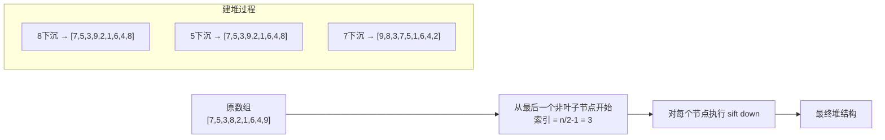

**代码实现（heapify）：**

```java
/**
 * 将任意数组调整为堆结构（heapify）
 * 时间复杂度: O(n)
 * @param array 原始数组
 */
public void heapify(int[] array) {
    int n = array.length;
    // 从最后一个非叶子节点开始，自底向上下沉
    // 最后一个非叶子节点索引 = n/2 - 1
    for (int i = n / 2 - 1; i >= 0; i--) {
        siftDown(array, i, n);
    }
}

/**
 * heapify 建堆过程图解
 * 
 * 原数组: [7, 5, 3, 8, 2, 1, 6, 4, 9]
 * 
 * 完全二叉树:
 *            7(0)
 *          /      \
 *       5(1)      3(2)
 *       /  \      /  \
 *    8(3) 2(4)  1(5) 6(6)
 *    /  \
 *  4(7) 9(8)
 * 
 * 最后一个非叶子节点索引 = 9/2 - 1 = 3 (值为8)
 * 
 * siftDown(3): 8与子节点9交换
 *            7(0)
 *          /      \
 *       5(1)      3(2)
 *       /  \      /  \
 *    9(3) 2(4)  1(5) 6(6)
 *    /  \
 *  4(7) 8(8)
 * 
 * siftDown(1): 5与子节点9交换
 *            7(0)
 *          /      \
 *       9(1)      3(2)
 *       /  \      /  \
 *    8(3) 2(4)  1(5) 6(6)
 *    /  \
 *  4(7) 9(8)
 * 
 * siftDown(0): 7与子节点9交换，再与子节点8交换
 *            9(0)
 *          /      \
 *       8(1)      6(2)
 *       /  \      /  \
 *    7(3) 2(4)  1(5) 3(6)
 *    /  \
 *  4(7) 5(8)
 * 
 * 最终大顶堆: [9, 8, 6, 7, 2, 1, 3, 4, 5]
 */
```

---

## 堆排序算法

堆排序利用堆的性质进行排序，是原地排序，时间复杂度 O(n log n)。

### 排序过程

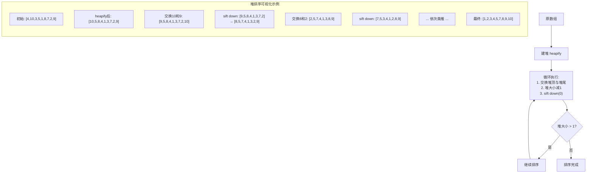

### 代码实现

```java
/**
 * 堆排序
 * @param array 待排序数组
 */
public void heapSort(int[] array) {
    int n = array.length;
    
    // 1. 建堆 - O(n)
    heapify(array);
    
    // 2. 逐个取出堆顶元素
    for (int i = n - 1; i > 0; i--) {
        // 交换堆顶和堆尾
        swap(array, 0, i);
        // sift down，堆大小减1
        siftDown(array, 0, i);
    }
}

/**
 * 堆排序完整过程
 * 
 * 输入: [4, 10, 3, 5, 1, 8, 7, 2, 9]
 * 
 * Step 1: heapify
 *         10
 *        /  \
 *       5    8
 *      / \  / \
 *     4  1 3   7
 *    /
 *   2
 *  数组: [10,5,8,4,1,3,7,2,9]
 * 
 * Step 2: i=8, 交换10和9, siftDown(0,8)
 *         9          交换
 *        / \    →   / \
 *       5   8       5   8
 *  数组: [9,5,8,4,1,3,7,2,10]
 * 
 * Step 3: i=7, 交换9和2, siftDown(0,7)
 *         8          
 *        / \
 *       5   7
 *      / \ / \
 *     4  1 3  2
 *  数组: [8,5,7,4,1,3,2,9,10]
 * 
 * Step 4: i=6, 交换8和2, siftDown(0,6)
 *         7          
 *        / \
 *       5   3
 *      / \ /
 *     4  1 2
 *  数组: [7,5,3,4,1,2,8,9,10]
 * 
 * ... 继续直到 i=1
 * 
 * 最终: [1,2,3,4,5,7,8,9,10]
 */
```

### 堆排序 vs 其他排序

| 排序算法 | 时间复杂度 | 空间复杂度 | 稳定性 |
|----------|-----------|-----------|--------|
| 堆排序 | O(n log n) | O(1) | 不稳定 |
| 快速排序 | O(n log n) | O(log n) | 不稳定 |
| 归并排序 | O(n log n) | O(n) | 稳定 |
| Timsort | O(n log n) | O(n) | 稳定 |

---

## 优先队列

### 定义

优先队列（Priority Queue）是一种抽象数据类型，其中每个元素都有一个关联的"优先级"，出队顺序按照优先级高低决定。

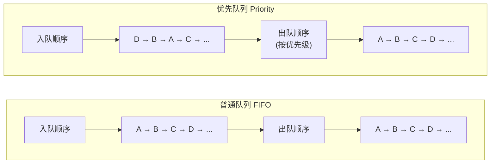

### 优先队列 vs 普通队列

| 特性 | 普通队列 | 优先队列 |
|------|---------|---------|
| 出队顺序 | 先进先出（FIFO） | 优先级最高者先出 |
| 应用场景 | 任务排队、消息队列 | 任务调度、路径搜索 |
| 实现方式 | 数组、链表 | 堆、二叉搜索树 |
| 入队时间 | O(1) | O(log n)（堆实现） |
| 出队时间 | O(1) | O(log n)（堆实现） |

### 优先队列的实现

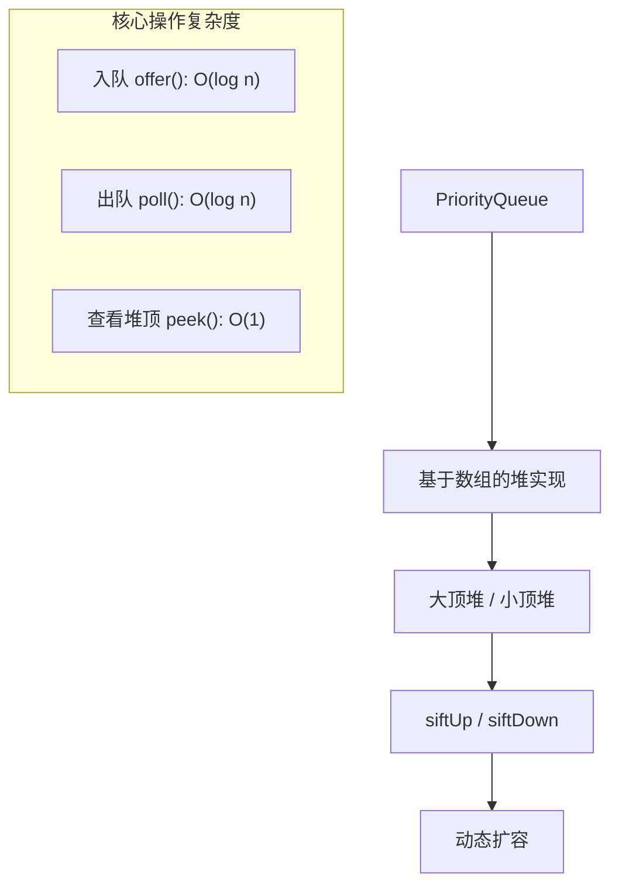

**Java 实现：**

```java
import java.util.PriorityQueue;
import java.util.Comparator;

/**
 * 优先队列示例
 */
public class PriorityQueueDemo {
    
    public static void main(String[] args) {
        // 1. 默认是小顶堆（最小元素先出队）
        PriorityQueue<Integer> minHeap = new PriorityQueue<>();
        minHeap.offer(5);
        minHeap.offer(2);
        minHeap.offer(8);
        minHeap.offer(1);
        System.out.println("小顶堆出队: " + minHeap.poll()); // 1
        System.out.println("小顶堆出队: " + minHeap.poll()); // 2
        
        // 2. 使用比较器实现大顶堆（最大元素先出队）
        PriorityQueue<Integer> maxHeap = new PriorityQueue<>(
            Comparator.reverseOrder()  // 逆序，即大顶堆
        );
        maxHeap.offer(5);
        maxHeap.offer(2);
        maxHeap.offer(8);
        maxHeap.offer(1);
        System.out.println("大顶堆出队: " + maxHeap.poll()); // 8
        System.out.println("大顶堆出队: " + maxHeap.poll()); // 5
        
        // 3. 自定义对象优先队列
        PriorityQueue<Task> taskQueue = new PriorityQueue<>(
            Comparator.comparingInt(t -> t.priority)  // 按优先级小顶堆
        );
        taskQueue.offer(new Task("发送邮件", 3));
        taskQueue.offer(new Task("备份数据", 1));
        taskQueue.offer(new Task("处理请求", 5));
        
        System.out.println("最高优先级任务: " + taskQueue.poll().name);
        // 输出: 备份数据
    }
}

class Task {
    String name;
    int priority;
    
    Task(String name, int priority) {
        this.name = name;
        this.priority = priority;
    }
}
```

### Java PriorityQueue 关键特性

```java
// 常用方法
PriorityQueue<E> queue = new PriorityQueue<>();

queue.offer(e);        // 入队，O(log n)
queue.poll();          // 出队（获取并移除堆顶），O(log n)
queue.peek();          // 查看堆顶（不移除），O(1)
queue.size();          // 获取大小，O(1)
queue.contains(o);     // 是否包含，O(n)
queue.clear();         // 清空，O(n)

// 底层结构
// - 数组存储，完全二叉树
// - 默认容量11，扩容因子1.5
// - 非线程安全（PriorityBlockingQueue是线程安全版本）
```

---

## 工程应用

### 1. Top-K 问题

找出数据流中最大的K个元素。

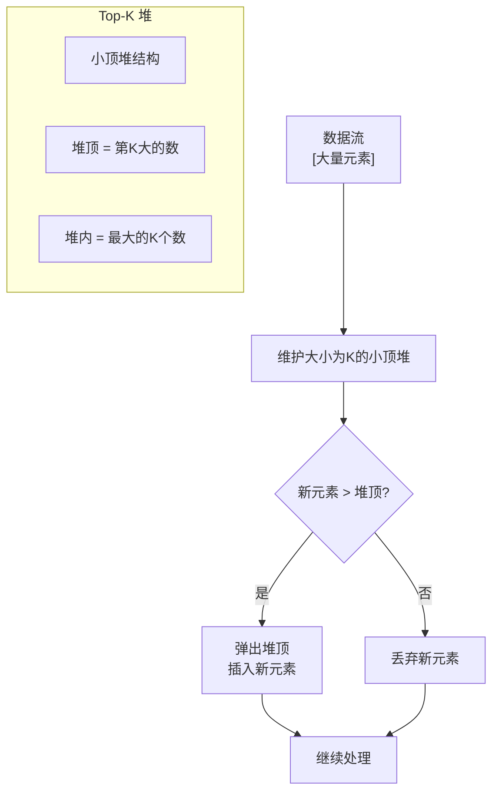

**代码实现：**

```java
import java.util.PriorityQueue;

/**
 * Top-K 问题
 * 
 * LeetCode 347: 前 K 个高频元素
 * 
 * 给你一个整数数组 nums 和一个整数 k ，请你返回其中出现频率前 k 高的元素。
 */
public class TopKProblem {
    
    /**
     * 找出前K个高频元素
     * 时间复杂度: O(n log k)
     * 空间复杂度: O(n)
     */
    public int[] topKFrequent(int[] nums, int k) {
        // 1. 统计每个元素的出现频率
        java.util.Map<Integer, Integer> frequency = new java.util.HashMap<>();
        for (int num : nums) {
            frequency.put(num, frequency.getOrDefault(num, 0) + 1);
        }
        
        // 2. 使用小顶堆，堆大小保持为k
        // 堆顶是k个元素中最小的，即第k大的频率
        PriorityQueue<int[]> minHeap = new PriorityQueue<>(
            Comparator.comparingInt(arr -> arr[1])  // 按频率排序
        );
        
        for (java.util.Map.Entry<Integer, Integer> entry : frequency.entrySet()) {
            int num = entry.getKey();
            int freq = entry.getValue();
            
            if (minHeap.size() < k) {
                minHeap.offer(new int[]{num, freq});
            } else if (freq > minHeap.peek()[1]) {
                // 频率比堆顶大，替换
                minHeap.poll();
                minHeap.offer(new int[]{num, freq});
            }
        }
        
        // 3. 提取结果
        int[] result = new int[k];
        for (int i = 0; i < k; i++) {
            result[i] = minHeap.poll()[0];
        }
        return result;
    }
    
    /**
     * Top-K 变种：流式数据中找最大的K个数
     */
    public static void findTopKStream(int[] stream, int k) {
        // 使用小顶堆
        PriorityQueue<Integer> minHeap = new PriorityQueue<>();
        
        for (int num : stream) {
            if (minHeap.size() < k) {
                minHeap.offer(num);
            } else if (num > minHeap.peek()) {
                minHeap.poll();
                minHeap.offer(num);
            }
        }
        
        System.out.println("Top-" + k + " 元素: " + minHeap);
    }
    
    public static void main(String[] args) {
        // 示例
        int[] nums = {1, 1, 1, 2, 2, 3, 3, 3, 3, 4, 4, 5};
        TopKProblem solution = new TopKProblem();
        int[] result = solution.topKFrequent(nums, 2);
        System.out.println("前2个高频元素: " + java.util.Arrays.toString(result));
        // 输出: [3, 1] 或 [1, 3]（3出现4次，1出现3次）
    }
}
```

### 2. 中位数问题（双堆法）

动态数据流中快速求中位数。

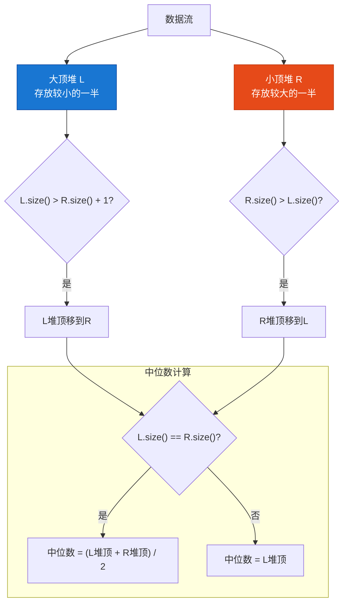

**代码实现：**

```java
import java.util.PriorityQueue;
import java.util.Comparator;

/**
 * 动态中位数（双堆法）
 * 
 * LeetCode 295: 数据流的中位数
 * 
 * 中位数是有序整数列表中的中间值。如果列表的大小是偶数，则没有中间值，此时中位数是中间两个值的平均值。
 */
public class MedianFinder {
    
    // 大顶堆：存放较小的一半，堆顶是这部分最大的
    private PriorityQueue<Integer> left;
    // 小顶堆：存放较大的一半，堆顶是这部分最小的
    private PriorityQueue<Integer> right;
    
    public MedianFinder() {
        left = new PriorityQueue<>(Comparator.reverseOrder());  // 大顶堆
        right = new PriorityQueue<>();                          // 小顶堆
    }
    
    /**
     * 添加一个数字到数据流中
     * 时间复杂度: O(log n)
     */
    public void addNum(int num) {
        // 1. 先加入大顶堆
        left.offer(num);
        
        // 2. 平衡：将大顶堆的最大值移到小顶堆
        right.offer(left.poll());
        
        // 3. 保持平衡：左堆最多比右堆多1个元素
        if (left.size() < right.size()) {
            left.offer(right.poll());
        }
    }
    
    /**
     * 返回目前数据流的中位数
     * 时间复杂度: O(1)
     */
    public double findMedian() {
        if (left.size() > right.size()) {
            // 奇数个：左堆多一个，中位数是左堆堆顶
            return left.peek();
        } else {
            // 偶数个：两个堆大小相等，中位数是两者堆顶的平均
            return (left.peek() + right.peek()) / 2.0;
        }
    }
    
    /**
     * 双堆法图解
     * 
     * 添加 1: left=[1], right=[], median=1
     * 
     * 添加 2: left=[1], right=[2], median=(1+2)/2=1.5
     * 
     * 添加 3: left=[3], right=[2], left.poll=3, right.offer=3, right.poll=2, left.offer=2
     *         left=[2,3], right=[], median=2
     *         (平衡后) left=[2], right=[3], median=(2+3)/2=2.5
     * 
     * 添加 4: left=[4,2], right=[3]
     *         left.poll=4, right.offer=4, right.poll=3, left.offer=3
     *         left=[2,3], right=[4], median=(2+4)/2=3
     * 
     * 添加 5: left=[5,2], right=[3,4]
     *         ... median=3.5
     */
    
    public static void main(String[] args) {
        MedianFinder finder = new MedianFinder();
        finder.addNum(1);
        finder.addNum(2);
        System.out.println("中位数: " + finder.findMedian()); // 1.5
        finder.addNum(3);
        System.out.println("中位数: " + finder.findMedian()); // 2.0
    }
}
```

### 3. 合并有序文件

将多个有序文件合并成一个有序文件。

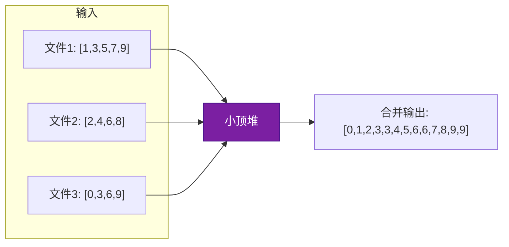

**代码实现：**

```java
import java.util.PriorityQueue;
import java.util.Iterator;

/**
 * 合并有序文件（K路归并）
 * 
 * 场景：多个已排序的文件，需要合并成一个有序文件
 * 思路：使用K个指针，每个指向一个文件，用小顶堆管理
 */
public class MergeSortedFiles {
    
    /**
     * 合并K个有序数组
     * 时间复杂度: O(N log k)，N为总元素数，k为数组数量
     */
    public static int[] mergeKSortedArrays(int[][] arrays) {
        if (arrays == null || arrays.length == 0) {
            return new int[0];
        }
        
        // 小顶堆: 存储 (值, 数组索引, 元素索引)
        PriorityQueue<int[]> minHeap = new PriorityQueue<>(
            Comparator.comparingInt(arr -> arr[0])
        );
        
        int totalLength = 0;
        // 初始化：每个数组的第一个元素入堆
        for (int i = 0; i < arrays.length; i++) {
            if (arrays[i] != null && arrays[i].length > 0) {
                minHeap.offer(new int[]{arrays[i][0], i, 0});
                totalLength += arrays[i].length;
            }
        }
        
        int[] result = new int[totalLength];
        int resultIndex = 0;
        
        while (!minHeap.isEmpty()) {
            int[] current = minHeap.poll();
            int value = current[0];
            int arrayIdx = current[1];
            int elementIdx = current[2];
            
            result[resultIndex++] = value;
            
            // 如果该数组还有更多元素，入堆
            if (elementIdx + 1 < arrays[arrayIdx].length) {
                minHeap.offer(new int[]{
                    arrays[arrayIdx][elementIdx + 1],
                    arrayIdx,
                    elementIdx + 1
                });
            }
        }
        
        return result;
    }
    
    public static void main(String[] args) {
        int[][] arrays = {
            {1, 3, 5, 7, 9},
            {2, 4, 6, 8},
            {0, 3, 6, 9}
        };
        
        int[] merged = mergeKSortedArrays(arrays);
        System.out.println("合并结果: " + java.util.Arrays.toString(merged));
        // 输出: [0, 1, 2, 3, 3, 4, 5, 6, 6, 7, 8, 9, 9]
    }
}
```

### 4. 任务调度器

根据任务优先级进行调度。

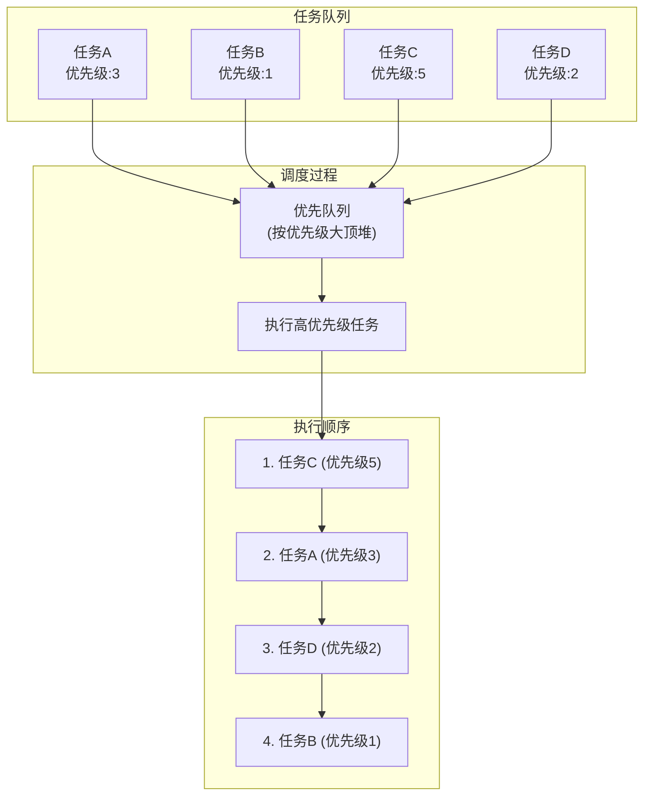

**代码实现：**

```java
import java.util.PriorityQueue;
import java.util.concurrent.DelayQueue;
import java.util.concurrent.Delayed;
import java.util.concurrent.TimeUnit;
import java.util.Comparator;

/**
 * 任务调度器
 */
public class TaskScheduler {
    
    /**
     * 简单的优先级任务调度器
     */
    static class PriorityTask {
        String name;
        int priority;  // 数值越大优先级越高
        long createTime;
        
        PriorityTask(String name, int priority) {
            this.name = name;
            this.priority = priority;
            this.createTime = System.currentTimeMillis();
        }
        
        @Override
        public String toString() {
            return name + "(优先级:" + priority + ")";
        }
    }
    
    /**
     * 带优先级的任务队列调度
     */
    public static void priorityScheduler() {
        PriorityQueue<PriorityTask> taskQueue = new PriorityQueue<>(
            Comparator.comparingInt(t -> -t.priority)  // 逆序，优先级高的先执行
        );
        
        // 添加任务
        taskQueue.offer(new PriorityTask("发送邮件", 3));
        taskQueue.offer(new PriorityTask("备份数据", 1));
        taskQueue.offer(new PriorityTask("处理请求", 5));
        taskQueue.offer(new PriorityTask("日志记录", 2));
        
        // 按优先级顺序执行
        System.out.println("任务执行顺序:");
        while (!taskQueue.isEmpty()) {
            PriorityTask task = taskQueue.poll();
            System.out.println("执行: " + task);
        }
    }
    
    /**
     * 延迟任务调度器（类似 JDK 的 DelayQueue）
     */
    static class DelayedTask implements Delayed {
        String name;
        long executeTime;  // 执行时间戳
        
        DelayedTask(String name, long delayMs) {
            this.name = name;
            this.executeTime = System.currentTimeMillis() + delayMs;
        }
        
        @Override
        public long getDelay(TimeUnit unit) {
            return unit.convert(executeTime - System.currentTimeMillis(), TimeUnit.MILLISECONDS);
        }
        
        @Override
        public int compareTo(Delayed o) {
            DelayedTask other = (DelayedTask) o;
            return Long.compare(this.executeTime, other.executeTime);
        }
        
        @Override
        public String toString() {
            return name + "(执行时间:" + executeTime + ")";
        }
    }
    
    public static void delayedScheduler() throws InterruptedException {
        DelayQueue<DelayedTask> delayQueue = new DelayQueue<>();
        
        delayQueue.offer(new DelayedTask("任务A-5秒后", 5000));
        delayQueue.offer(new DelayedTask("任务B-2秒后", 2000));
        delayQueue.offer(new DelayedTask("任务C-8秒后", 8000));
        delayQueue.offer(new DelayedTask("任务D-1秒后", 1000));
        
        System.out.println("延迟任务调度开始...");
        while (!delayQueue.isEmpty()) {
            DelayedTask task = delayQueue.take();
            System.out.println("执行: " + task.name);
        }
    }
    
    public static void main(String[] args) throws InterruptedException {
        System.out.println("=== 优先级调度 ===");
        priorityScheduler();
        
        System.out.println("\n=== 延迟调度（示例输出） ===");
        // 注意：延迟调度会实际等待，不在demo中演示完整流程
    }
}
```

### 5. Huffman编码

用于数据压缩的贪心算法。

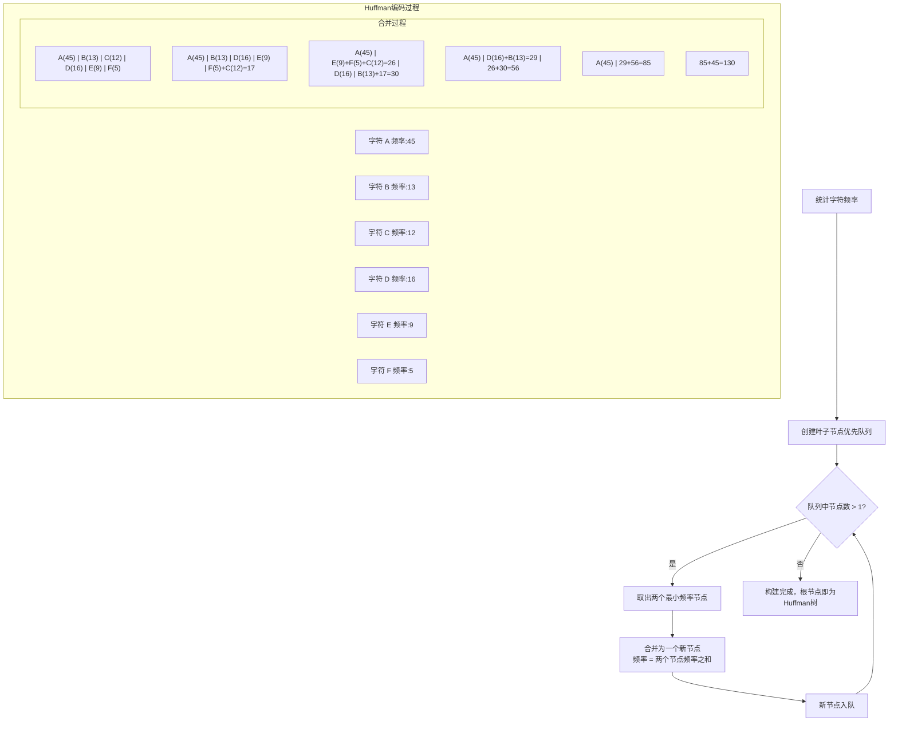

**代码实现：**

```java
import java.util.PriorityQueue;
import java.util.Map;
import java.util.HashMap;

/**
 * Huffman 编码
 * 
 * 一种广泛使用的数据压缩算法，通过变长编码实现压缩
 * 核心思想：高频字符用短码，低频字符用长码
 */
public class HuffmanCoding {
    
    /**
     * Huffman 树节点
     */
    static class HuffmanNode {
        char ch;           // 字符（叶子节点使用）
        int frequency;     // 频率
        HuffmanNode left;  // 左子节点（编码0）
        HuffmanNode right; // 右子节点（编码1）
        
        HuffmanNode(char ch, int frequency) {
            this.ch = ch;
            this.frequency = frequency;
        }
        
        HuffmanNode(HuffmanNode left, HuffmanNode right) {
            this.left = left;
            this.right = right;
            this.frequency = left.frequency + right.frequency;
        }
        
        boolean isLeaf() {
            return left == null && right == null;
        }
    }
    
    /**
     * 构建 Huffman 树
     */
    public static HuffmanNode buildHuffmanTree(Map<Character, Integer> frequencyMap) {
        // 创建优先队列（最小堆），按频率排序
        PriorityQueue<HuffmanNode> pq = new PriorityQueue<>(
            Comparator.comparingInt(n -> n.frequency)
        );
        
        // 将所有叶子节点加入队列
        for (Map.Entry<Character, Integer> entry : frequencyMap.entrySet()) {
            pq.offer(new HuffmanNode(entry.getKey(), entry.getValue()));
        }
        
        // 构建 Huffman 树
        while (pq.size() > 1) {
            // 取出两个频率最小的节点
            HuffmanNode left = pq.poll();
            HuffmanNode right = pq.poll();
            // 合并为新节点
            HuffmanNode parent = new HuffmanNode(left, right);
            pq.offer(parent);
        }
        
        return pq.poll();
    }
    
    /**
     * 生成 Huffman 编码表
     */
    public static Map<Character, String> generateCodes(HuffmanNode root) {
        Map<Character, String> codes = new HashMap<>();
        generateCodesHelper(root, "", codes);
        return codes;
    }
    
    private static void generateCodesHelper(HuffmanNode node, String code, Map<Character, String> codes) {
        if (node.isLeaf()) {
            // 叶子节点，保存编码
            // 空编码处理（只有一个字符的情况）
            codes.put(node.ch, code.isEmpty() ? "0" : code);
            return;
        }
        // 左子节点添加0，右子节点添加1
        if (node.left != null) {
            generateCodesHelper(node.left, code + "0", codes);
        }
        if (node.right != null) {
            generateCodesHelper(node.right, code + "1", codes);
        }
    }
    
    /**
     * 编码字符串
     */
    public static String encode(String text, Map<Character, String> codes) {
        StringBuilder sb = new StringBuilder();
        for (char c : text.toCharArray()) {
            sb.append(codes.get(c));
        }
        return sb.toString();
    }
    
    /**
     * 解码字符串
     */
    public static String decode(String encoded, HuffmanNode root) {
        StringBuilder sb = new StringBuilder();
        HuffmanNode current = root;
        for (char bit : encoded.toCharArray()) {
            current = (bit == '0') ? current.left : current.right;
            if (current.isLeaf()) {
                sb.append(current.ch);
                current = root;
            }
        }
        return sb.toString();
    }
    
    public static void main(String[] args) {
        String text = "ABRADABRADA";
        
        // 统计频率
        Map<Character, Integer> frequencyMap = new HashMap<>();
        for (char c : text.toCharArray()) {
            frequencyMap.put(c, frequencyMap.getOrDefault(c, 0) + 1);
        }
        System.out.println("字符频率: " + frequencyMap);
        // {A=5, B=2, R=2, D=2}
        
        // 构建 Huffman 树
        HuffmanNode root = buildHuffmanTree(frequencyMap);
        
        // 生成编码表
        Map<Character, String> codes = generateCodes(root);
        System.out.println("Huffman编码: " + codes);
        // 例如: {A=0, D=10, R=110, B=111}（取决于树的具体结构）
        
        // 编码
        String encoded = encode(text, codes);
        System.out.println("原文: " + text);
        System.out.println("编码: " + encoded);
        
        // 解码
        String decoded = decode(encoded, root);
        System.out.println("解码: " + decoded);
        
        // 计算压缩率
        int originalBits = text.length() * 8;  // ASCII
        int compressedBits = encoded.length();
        System.out.println("压缩率: " + (100 - compressedBits * 100.0 / originalBits) + "%");
    }
}
```

---

## 总结

```mermaid
flowchart TB
    A["堆与优先队列"] --> B["堆 Heap"]
    A --> C["堆排序"]
    A --> D["优先队列"]
    A --> E["工程应用"]
    
    B --> B1["完全二叉树结构"]
    B --> B2["大顶堆 / 小顶堆"]
    B --> B3["数组顺序存储"]
    B --> B4["sift up 上浮"]
    B --> B5["sift down 下沉"]
    B --> B6["heapify 建堆"]
    
    C --> C1["时间 O(n log n)"]
    C --> C2["空间 O(1)"]
    C --> C3["不稳定排序"]
    
    D --> D1["基于堆实现"]
    D --> D2["入队 O(log n)"]
    D --> D3["出队 O(log n)"]
    D --> D4["查看 O(1)"]
    
    E --> E1["Top-K 问题"]
    E --> E2["中位数问题"]
    E --> E3["合并有序文件"]
    E --> E4["任务调度器"]
    E --> E5["Huffman编码"]
    
    style A fill:#1565c0,stroke:#1565c0,color:#ffffff
    style B fill:#2e7d32,stroke:#2e7d32,color:#ffffff
    style C fill:#e65100,stroke:#e65100,color:#ffffff
    style D fill:#7b1fa2,stroke:#7b1fa2,color:#ffffff
    style E fill:#c62828,stroke:#c62828,color:#ffffff
```

### 关键要点

1. **堆的本质**：完全二叉树 + 堆序性，可用数组高效存储
2. **核心操作**：sift up（插入）和 sift down（删除）是堆操作的基石
3. **heapify**：从最后一个非叶子节点开始，自底向上下沉，时间复杂度 O(n)
4. **堆排序**：先 heapify 建堆，再逐个取出堆顶
5. **优先队列**：用堆实现，出队顺序由优先级决定
6. **应用场景**：Top-K、中位数、合并有序、任务调度、数据压缩

---

## 参考

- LeetCode 347: 前 K 个高频元素
- LeetCode 295: 数据流的中位数
- 《算法导论》第6章：堆排序
- 《数据结构与算法》堆与优先队列章节
