# 图

## 概述

图（Graph）是一种非常重要的非线性数据结构，用于表示对象之间的复杂关系。与树结构不同，图没有根节点的概念，节点之间可以通过多条路径相连。

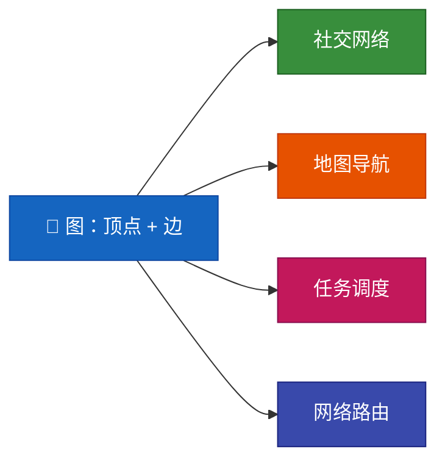

---

## 1. 图基础

### 1.1 图的定义

图由两个核心要素组成：

| 要素 | 说明 |
|------|------|
| **顶点（Vertex）** | 图中的节点，记作 V（Vertex） |
| **边（Edge）** | 顶点之间的连接关系，记作 E（Edge） |

图记作 **G = (V, E)**，其中：
- V 是顶点的有限集合
- E 是边的有限集合

### 1.2 图的分类

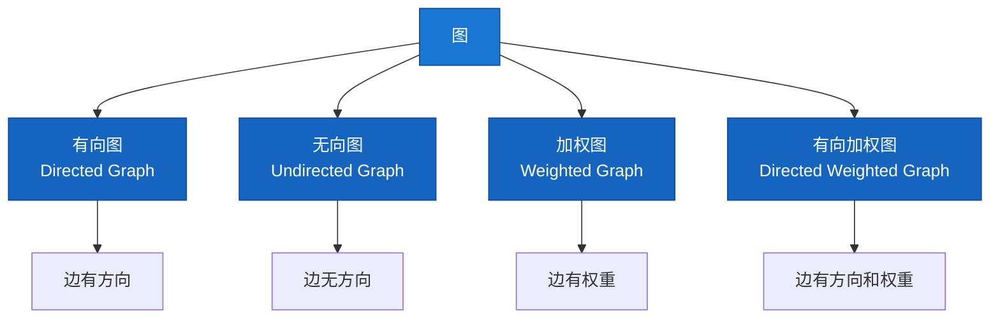

#### 有向图 vs 无向图

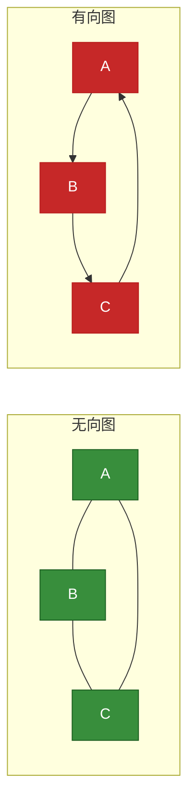

**关键区别：**
- **无向图**：边 (A, B) 等价于 (B, A)，关系是双向的
- **有向图**：边 A → B 不等价于 B → A，关系是单向的

### 1.3 图的表示方法

#### 1.3.1 邻接矩阵

邻接矩阵是一个 V×V 的二维数组，其中 `matrix[i][j]` 表示顶点 i 到顶点 j 的关系。

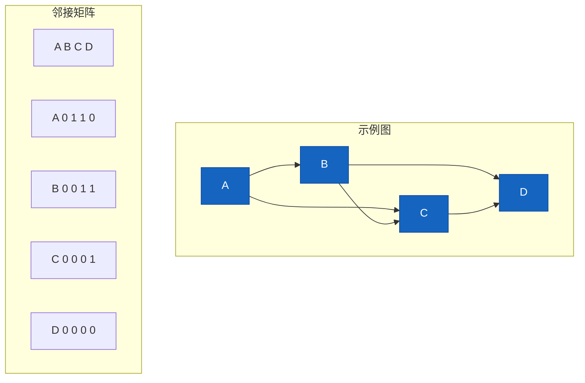

**特点：**
| 特性 | 说明 |
|------|------|
| 空间复杂度 | O(V²) |
| 查询边 | O(1) |
| 遍历邻边 | O(V) |
| 适用场景 | 稠密图，边较多时效率高 |

**Java 实现：**

```java
public class AdjacencyMatrix {
    private int[][] matrix;
    private int vertices;
    
    public AdjacencyMatrix(int vertices) {
        this.vertices = vertices;
        this.matrix = new int[vertices][vertices];
    }
    
    // 添加边
    public void addEdge(int i, int j) {
        matrix[i][j] = 1;
        matrix[j][i] = 1;  // 无向图
    }
    
    // 添加有向边
    public void addDirectedEdge(int i, int j) {
        matrix[i][j] = 1;
    }
    
    // 添加加权边
    public void addWeightedEdge(int i, int j, int weight) {
        matrix[i][j] = weight;
        matrix[j][i] = weight;
    }
    
    // 判断边是否存在
    public boolean hasEdge(int i, int j) {
        return matrix[i][j] != 0;
    }
    
    // 获取邻接点
    public List<Integer> getNeighbors(int v) {
        List<Integer> neighbors = new ArrayList<>();
        for (int i = 0; i < vertices; i++) {
            if (matrix[v][i] != 0) {
                neighbors.add(i);
            }
        }
        return neighbors;
    }
}
```

#### 1.3.2 邻接表

邻接表使用链表或数组存储每个顶点的邻接顶点。

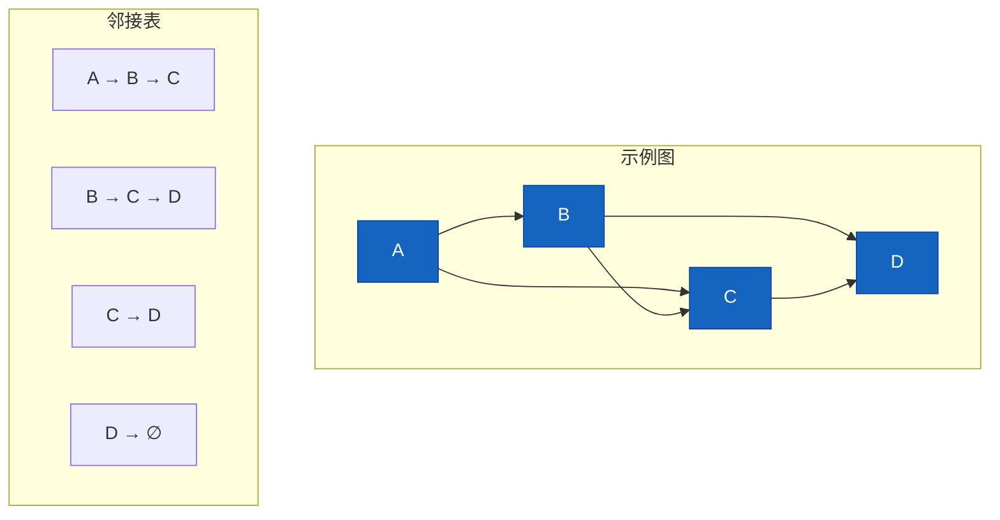

**特点：**
| 特性 | 说明 |
|------|------|
| 空间复杂度 | O(V + E) |
| 查询边 | O(V)（需遍历） |
| 遍历邻边 | O(1)（直接访问） |
| 适用场景 | 稀疏图，边较少时节省空间 |

**Java 实现：**

```java
public class AdjacencyList {
    private Map<String, List<String>> adjList;
    
    public AdjacencyList() {
        this.adjList = new HashMap<>();
    }
    
    // 添加顶点
    public void addVertex(String vertex) {
        adjList.putIfAbsent(vertex, new ArrayList<>());
    }
    
    // 添加边
    public void addEdge(String source, String dest) {
        adjList.putIfAbsent(source, new ArrayList<>());
        adjList.putIfAbsent(dest, new ArrayList<>());
        adjList.get(source).add(dest);
        adjList.get(dest).add(source);  // 无向图
    }
    
    // 添加有向边
    public void addDirectedEdge(String source, String dest) {
        adjList.putIfAbsent(source, new ArrayList<>());
        adjList.putIfAbsent(dest, new ArrayList<>());
        adjList.get(source).add(dest);
    }
    
    // 获取邻接点
    public List<String> getNeighbors(String vertex) {
        return adjList.getOrDefault(vertex, new ArrayList<>());
    }
}
```

#### 1.3.3 边列表

边列表是一种更直接的表示方法，将所有边存储在列表中。

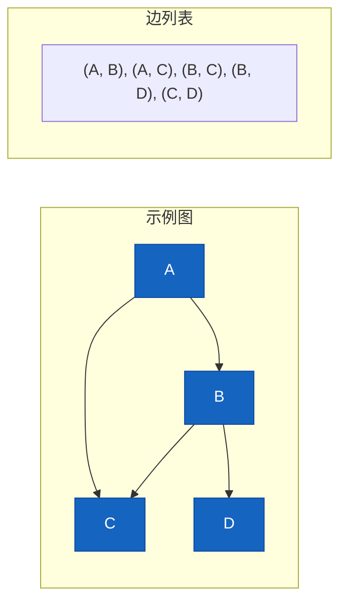

**Java 实现：**

```java
public class EdgeList {
    private List<Edge> edges;
    
    public static class Edge {
        String source;
        String dest;
        int weight;
        
        public Edge(String source, String dest) {
            this.source = source;
            this.dest = dest;
            this.weight = 1;
        }
        
        public Edge(String source, String dest, int weight) {
            this.source = source;
            this.dest = dest;
            this.weight = weight;
        }
    }
    
    public EdgeList() {
        this.edges = new ArrayList<>();
    }
    
    public void addEdge(String source, String dest) {
        edges.add(new Edge(source, dest));
    }
    
    public void addWeightedEdge(String source, String dest, int weight) {
        edges.add(new Edge(source, dest, weight));
    }
    
    public List<Edge> getEdges() {
        return edges;
    }
}
```

#### 1.3.4 三种表示方法对比

| 特性 | 邻接矩阵 | 邻接表 | 边列表 |
|------|----------|--------|--------|
| 空间复杂度 | O(V²) | O(V + E) | O(E) |
| 添加边 | O(1) | O(1) | O(1) |
| 查询边 | O(1) | O(V) | O(E) |
| 遍历邻边 | O(V) | O(degree) | O(E) |
| 适用场景 | 稠密图 | 稀疏图 | 边操作频繁 |

---

## 2. 图的遍历

### 2.1 深度优先搜索（DFS）

深度优先搜索像走迷宫一样，沿着一条路走到底，然后回溯。

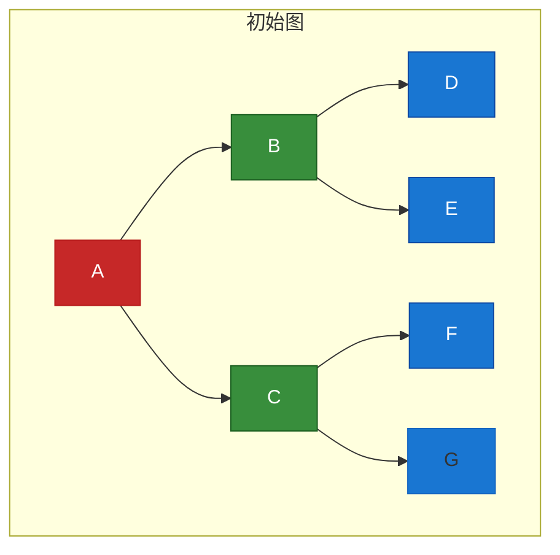

#### 递归实现

```java
public class DFSRecursive {
    private Map<String, List<String>> adjList;
    private Set<String> visited;
    
    public DFSRecursive() {
        this.adjList = new HashMap<>();
        this.visited = new HashSet<>();
    }
    
    public void dfs(String start) {
        // 标记起始顶点已访问
        visited.add(start);
        System.out.print(start + " ");
        
        // 递归访问所有未访问的邻接点
        for (String neighbor : adjList.getOrDefault(start, new ArrayList<>())) {
            if (!visited.contains(neighbor)) {
                dfs(neighbor);
            }
        }
    }
    
    // 递归实现
    public void dfsRecursive(String start) {
        dfs(start);
    }
}
```

#### 迭代实现（栈）

```java
public class DFSIterative {
    private Map<String, List<String>> adjList;
    
    public DFSIterative() {
        this.adjList = new HashMap<>();
    }
    
    public void dfsIterative(String start) {
        Set<String> visited = new HashSet<>();
        Stack<String> stack = new Stack<>();
        
        stack.push(start);
        
        while (!stack.isEmpty()) {
            String vertex = stack.pop();
            
            if (!visited.contains(vertex)) {
                visited.add(vertex);
                System.out.print(vertex + " ");
                
                // 逆序入栈，保证顺序
                List<String> neighbors = adjList.getOrDefault(vertex, new ArrayList<>());
                for (int i = neighbors.size() - 1; i >= 0; i--) {
                    if (!visited.contains(neighbors.get(i))) {
                        stack.push(neighbors.get(i));
                    }
                }
            }
        }
    }
}
```

**DFS 遍历过程图解：**

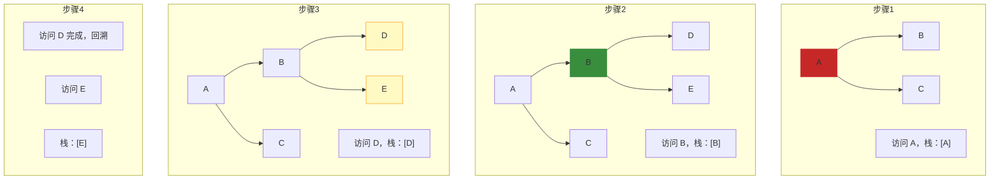

### 2.2 广度优先搜索（BFS）

广度优先搜索像水面波纹一样，一层一层向外扩展。

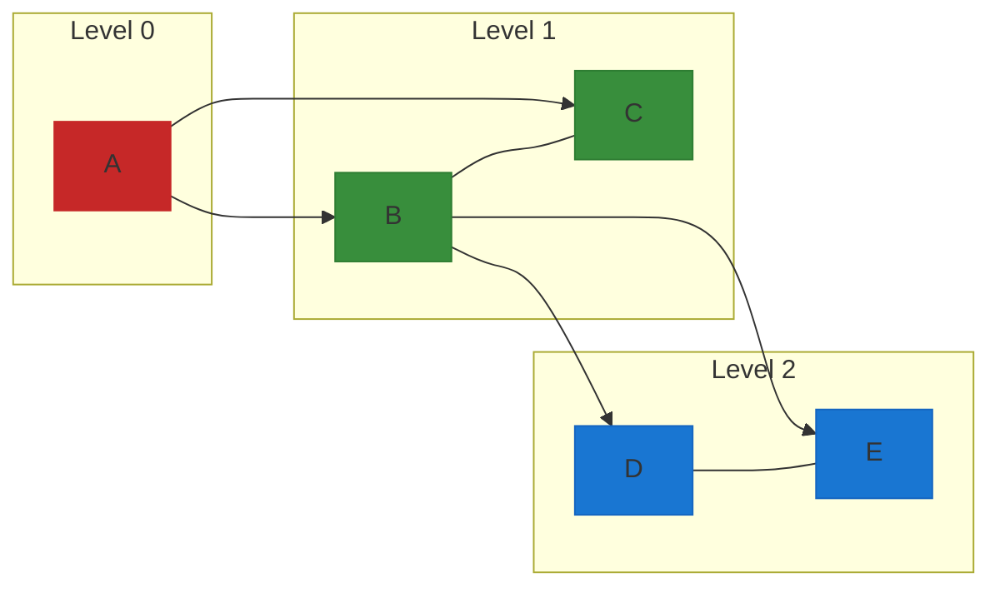

**BFS 实现（队列）：**

```java
public class BFS {
    private Map<String, List<String>> adjList;
    
    public BFS() {
        this.adjList = new HashMap<>();
    }
    
    public void bfs(String start) {
        Set<String> visited = new HashSet<>();
        Queue<String> queue = new LinkedList<>();
        
        queue.offer(start);
        visited.add(start);
        
        while (!queue.isEmpty()) {
            String vertex = queue.poll();
            System.out.print(vertex + " ");
            
            for (String neighbor : adjList.getOrDefault(vertex, new ArrayList<>())) {
                if (!visited.contains(neighbor)) {
                    visited.add(neighbor);
                    queue.offer(neighbor);
                }
            }
        }
    }
}
```

**BFS 遍历过程图解：**

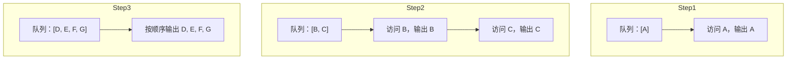

### 2.3 DFS vs BFS 对比

| 特性 | DFS | BFS |
|------|-----|-----|
| 数据结构 | 栈（Stack） | 队列（Queue） |
| 遍历顺序 | 深度优先 | 广度优先 |
| 最短路径 | 不保证 | 保证（无权图） |
| 空间复杂度 | O(V) | O(V) |
| 适用场景 | 拓扑排序、环检测 | 最短路径、层次遍历 |

### 2.4 连通分量检测

连通分量是无向图中任意两个顶点都相互可达的最大子图。

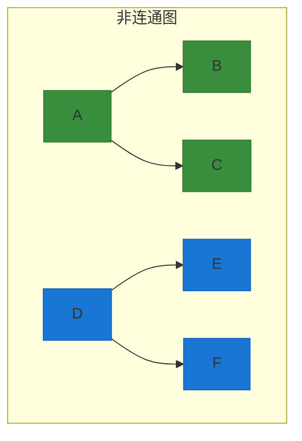

**连通分量算法：**

```java
public class ConnectedComponents {
    private Map<String, List<String>> adjList;
    private Set<String> visited;
    private int componentCount;
    
    public int countComponents() {
        visited = new HashSet<>();
        componentCount = 0;
        
        for (String vertex : adjList.keySet()) {
            if (!visited.contains(vertex)) {
                componentCount++;
                dfsComponent(vertex);
            }
        }
        
        return componentCount;
    }
    
    private void dfsComponent(String start) {
        visited.add(start);
        for (String neighbor : adjList.getOrDefault(start, new ArrayList<>())) {
            if (!visited.contains(neighbor)) {
                dfsComponent(neighbor);
            }
        }
    }
}
```

### 2.5 环检测

#### 无向图环检测

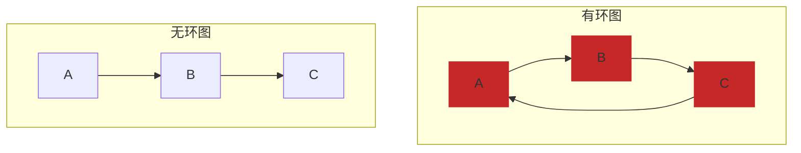

```java
public class CycleDetectionUndirected {
    private Map<String, List<String>> adjList;
    private Set<String> visited;
    
    public boolean hasCycle() {
        visited = new HashSet<>();
        
        // 森林中可能有多个连通分量
        for (String vertex : adjList.keySet()) {
            if (!visited.contains(vertex)) {
                if (dfsHasCycle(vertex, null)) {
                    return true;
                }
            }
        }
        return false;
    }
    
    private boolean dfsHasCycle(String vertex, String parent) {
        visited.add(vertex);
        
        for (String neighbor : adjList.getOrDefault(vertex, new ArrayList<>())) {
            if (!visited.contains(neighbor)) {
                if (dfsHasCycle(neighbor, vertex)) {
                    return true;
                }
            } else if (!neighbor.equals(parent)) {
                // 邻接点已访问且不是父节点，说明有环
                return true;
            }
        }
        return false;
    }
}
```

#### 有向图环检测

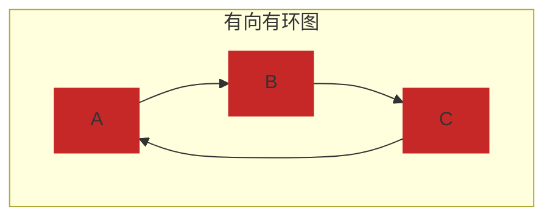

```java
public class CycleDetectionDirected {
    private Map<String, List<String>> adjList;
    private Set<String> visited;
    private Set<String> recStack;  // 递归栈
    
    public boolean hasCycle() {
        visited = new HashSet<>();
        recStack = new HashSet<>();
        
        for (String vertex : adjList.keySet()) {
            if (!visited.contains(vertex)) {
                if (dfsHasCycle(vertex)) {
                    return true;
                }
            }
        }
        return false;
    }
    
    private boolean dfsHasCycle(String vertex) {
        visited.add(vertex);
        recStack.add(vertex);
        
        for (String neighbor : adjList.getOrDefault(vertex, new ArrayList<>())) {
            if (!visited.contains(neighbor)) {
                if (dfsHasCycle(neighbor)) {
                    return true;
                }
            } else if (recStack.contains(neighbor)) {
                // 邻接点在递归栈中，说明有环
                return true;
            }
        }
        
        recStack.remove(vertex);
        return false;
    }
}
```

---

## 3. 最短路径算法

### 3.1 算法对比总览

| 算法 | 时间复杂度 | 空间复杂度 | 适用场景 | 限制 |
|------|------------|------------|----------|------|
| **BFS** | O(V + E) | O(V) | 无权图最短路 | 边权必须相等 |
| **Dijkstra** | O((V+E)logV) | O(V) | 正权图最短路 | 不能有负权边 |
| **Bellman-Ford** | O(VE) | O(V) | 检测负权边 | 可以有负权边 |
| **Floyd-Warshall** | O(V³) | O(V²) | 多源最短路 | 可以有负权边 |

### 3.2 BFS（无权图最短路）

当所有边权相等时，BFS 可以找到最短路径。

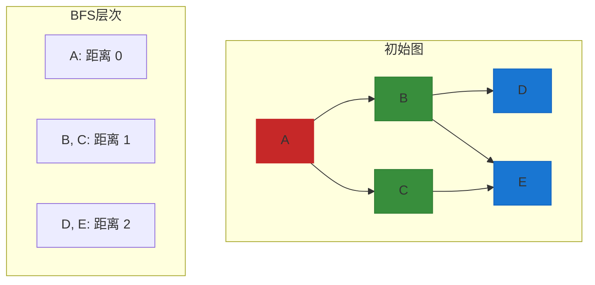

**BFS 最短路径实现：**

```java
public class ShortestPathBFS {
    private Map<String, List<String>> adjList;
    
    public Map<String, Integer> shortestPath(String start) {
        Map<String, Integer> distances = new HashMap<>();
        Queue<String> queue = new LinkedList<>();
        
        queue.offer(start);
        distances.put(start, 0);
        
        while (!queue.isEmpty()) {
            String vertex = queue.poll();
            int distance = distances.get(vertex);
            
            for (String neighbor : adjList.getOrDefault(vertex, new ArrayList<>())) {
                if (!distances.containsKey(neighbor)) {
                    distances.put(neighbor, distance + 1);
                    queue.offer(neighbor);
                }
            }
        }
        
        return distances;
    }
    
    // 获取最短路径
    public List<String> getShortestPath(String start, String end) {
        Map<String, Integer> distances = new HashMap<>();
        Map<String, String> parents = new HashMap<>();
        Queue<String> queue = new LinkedList<>();
        
        queue.offer(start);
        distances.put(start, 0);
        parents.put(start, null);
        
        while (!queue.isEmpty()) {
            String vertex = queue.poll();
            
            if (vertex.equals(end)) {
                break;
            }
            
            int distance = distances.get(vertex);
            for (String neighbor : adjList.getOrDefault(vertex, new ArrayList<>())) {
                if (!distances.containsKey(neighbor)) {
                    distances.put(neighbor, distance + 1);
                    parents.put(neighbor, vertex);
                    queue.offer(neighbor);
                }
            }
        }
        
        // 重建路径
        List<String> path = new ArrayList<>();
        String current = end;
        while (current != null) {
            path.add(current);
            current = parents.get(current);
        }
        Collections.reverse(path);
        
        return path;
    }
}
```

### 3.3 Dijkstra 算法

Dijkstra 算法用于带正权边的图，能找到单源最短路径。

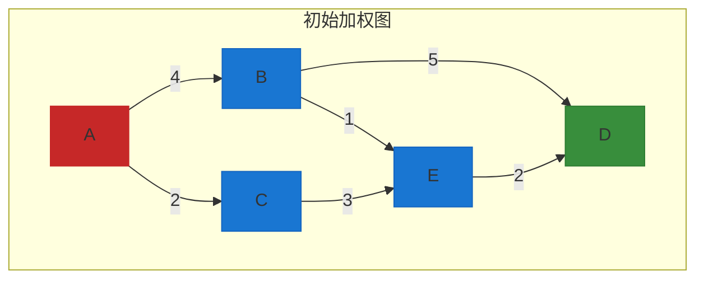

**算法执行过程：**

| 步骤 | 已确定顶点 | 候选距离 |
|------|------------|----------|
| 初始 | A: 0 | B: 4, C: 2 |
| 1 | A: 0, C: 2 | B: 4, E: 5 |
| 2 | A: 0, C: 2, B: 4 | E: 5, D: 9 |
| 3 | A: 0, C: 2, B: 4, E: 5 | D: 7 |
| 4 | A: 0, C: 2, B: 4, E: 5, D: 7 | - |

**Dijkstra 算法实现：**

```java
public class Dijkstra {
    private Map<String, Map<String, Integer>> graph;
    
    public Dijkstra() {
        this.graph = new HashMap<>();
    }
    
    public void addEdge(String source, String dest, int weight) {
        graph.putIfAbsent(source, new HashMap<>());
        graph.putIfAbsent(dest, new HashMap<>());
        graph.get(source).put(dest, weight);
        // 无向图需要这句
        graph.get(dest).put(source, weight);
    }
    
    public Map<String, Integer> shortestPath(String start) {
        // 距离表
        Map<String, Integer> distances = new HashMap<>();
        for (String vertex : graph.keySet()) {
            distances.put(vertex, Integer.MAX_VALUE);
        }
        distances.put(start, 0);
        
        // 优先级队列：(距离, 顶点)
        PriorityQueue<Map.Entry<String, Integer>> pq = 
            new PriorityQueue<>(Map.Entry.comparingByValue());
        pq.add(new AbstractMap.SimpleEntry<>(start, 0));
        
        Set<String> visited = new HashSet<>();
        
        while (!pq.isEmpty()) {
            Map.Entry<String, Integer> current = pq.poll();
            String vertex = current.getKey();
            
            if (visited.contains(vertex)) {
                continue;
            }
            visited.add(vertex);
            
            int currentDist = current.getValue();
            
            // 更新邻接点的距离
            if (graph.containsKey(vertex)) {
                for (Map.Entry<String, Integer> neighbor : 
                     graph.get(vertex).entrySet()) {
                    String neighborVertex = neighbor.getKey();
                    int weight = neighbor.getValue();
                    
                    if (!visited.contains(neighborVertex)) {
                        int newDist = currentDist + weight;
                        if (newDist < distances.get(neighborVertex)) {
                            distances.put(neighborVertex, newDist);
                            pq.add(new AbstractMap.SimpleEntry<>(
                                neighborVertex, newDist));
                        }
                    }
                }
            }
        }
        
        return distances;
    }
}
```

### 3.4 Bellman-Ford 算法

Bellman-Ford 算法可以处理负权边，并且能检测负权环。

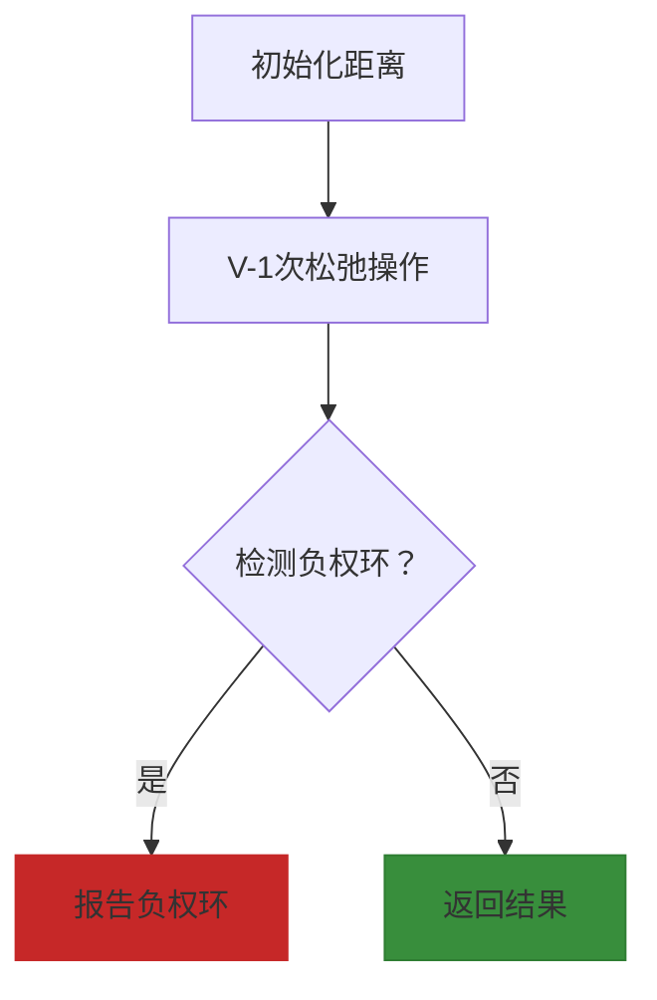

**Bellman-Ford 算法实现：**

```java
public class BellmanFord {
    private List<Edge> edges;
    private int vertices;
    
    public static class Edge {
        String source;
        String dest;
        int weight;
        
        public Edge(String source, String dest, int weight) {
            this.source = source;
            this.dest = dest;
            this.weight = weight;
        }
    }
    
    public BellmanFord(int vertices) {
        this.vertices = vertices;
        this.edges = new ArrayList<>();
    }
    
    public void addEdge(String source, String dest, int weight) {
        edges.add(new Edge(source, dest, weight));
    }
    
    public Map<String, Integer> shortestPath(String start) {
        Map<String, Integer> distances = new HashMap<>();
        
        // 初始化
        for (int i = 0; i < vertices; i++) {
            distances.put(String.valueOf(i), Integer.MAX_VALUE);
        }
        distances.put(start, 0);
        
        // V-1 次松弛操作
        for (int i = 0; i < vertices - 1; i++) {
            for (Edge edge : edges) {
                Integer sourceDist = distances.get(edge.source);
                Integer destDist = distances.get(edge.dest);
                
                if (sourceDist != Integer.MAX_VALUE && 
                    sourceDist + edge.weight < destDist) {
                    distances.put(edge.dest, sourceDist + edge.weight);
                }
            }
        }
        
        // 检测负权环
        boolean hasNegativeCycle = false;
        for (Edge edge : edges) {
            Integer sourceDist = distances.get(edge.source);
            Integer destDist = distances.get(edge.dest);
            
            if (sourceDist != Integer.MAX_VALUE && 
                sourceDist + edge.weight < destDist) {
                hasNegativeCycle = true;
                break;
            }
        }
        
        if (hasNegativeCycle) {
            throw new RuntimeException("图中存在负权环");
        }
        
        return distances;
    }
}
```

### 3.5 Floyd-Warshall 算法

Floyd-Warshall 算法用于多源最短路径问题。

```java
public class FloydWarshall {
    private int[][] dist;
    private int[][] next;
    private int vertices;
    
    public FloydWarshall(int vertices) {
        this.vertices = vertices;
        this.dist = new int[vertices][vertices];
        this.next = new int[vertices][vertices];
        
        // 初始化距离矩阵
        for (int i = 0; i < vertices; i++) {
            for (int j = 0; j < vertices; j++) {
                if (i == j) {
                    dist[i][j] = 0;
                } else {
                    dist[i][j] = Integer.MAX_VALUE / 2;
                }
                next[i][j] = -1;
            }
        }
    }
    
    public void addEdge(int i, int j, int weight) {
        dist[i][j] = weight;
        next[i][j] = j;
    }
    
    public void floydWarshall() {
        // V 次迭代
        for (int k = 0; k < vertices; k++) {
            for (int i = 0; i < vertices; i++) {
                for (int j = 0; j < vertices; j++) {
                    if (dist[i][k] + dist[k][j] < dist[i][j]) {
                        dist[i][j] = dist[i][k] + dist[k][j];
                        next[i][j] = next[i][k];
                    }
                }
            }
        }
    }
    
    // 获取最短路径
    public List<Integer> getPath(int i, int j) {
        if (next[i][j] == -1) {
            return new ArrayList<>();
        }
        
        List<Integer> path = new ArrayList<>();
        path.add(i);
        
        while (i != j) {
            i = next[i][j];
            path.add(i);
        }
        
        return path;
    }
}
```

---

## 4. 工程应用

### 4.1 社交网络（人际关系）

社交网络是一个典型的大规模图结构，用户是顶点，好友关系是边。

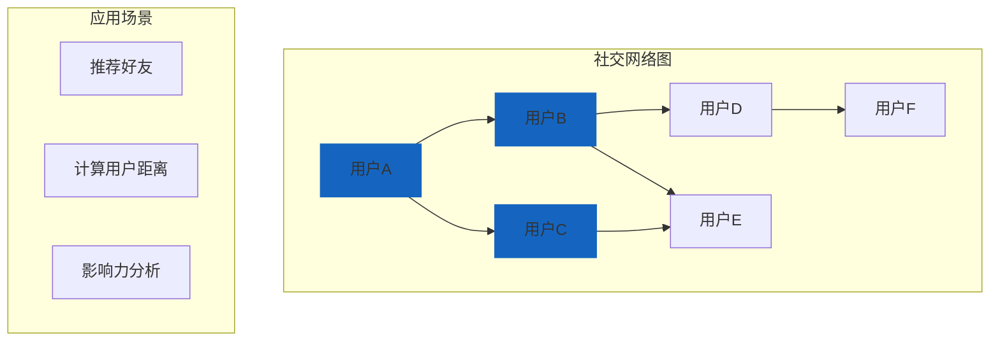

**应用示例 - 二度好友推荐：**

```java
public class FriendRecommendation {
    private Map<String, Set<String>> socialGraph;
    
    // 获取二度好友（朋友的朋友）
    public Set<String> getSecondDegreeFriends(String user) {
        Set<String> secondDegree = new HashSet<>();
        Set<String> firstDegree = socialGraph.getOrDefault(user, new HashSet<>());
        
        for (String friend : firstDegree) {
            Set<String> friendsOfFriend = socialGraph.getOrDefault(friend, new HashSet<>());
            for (String fof : friendsOfFriend) {
                if (!fof.equals(user) && !firstDegree.contains(fof)) {
                    secondDegree.add(fof);
                }
            }
        }
        
        return secondDegree;
    }
    
    // 计算两人之间的最短路径
    public List<String> getShortestConnection(String user1, String user2) {
        Map<String, Integer> distances = new HashMap<>();
        Map<String, String> parents = new HashMap<>();
        Queue<String> queue = new LinkedList<>();
        
        queue.offer(user1);
        distances.put(user1, 0);
        parents.put(user1, null);
        
        while (!queue.isEmpty()) {
            String current = queue.poll();
            
            if (current.equals(user2)) {
                break;
            }
            
            for (String neighbor : socialGraph.getOrDefault(current, new HashSet<>())) {
                if (!distances.containsKey(neighbor)) {
                    distances.put(neighbor, distances.get(current) + 1);
                    parents.put(neighbor, current);
                    queue.offer(neighbor);
                }
            }
        }
        
        // 重建路径
        List<String> path = new ArrayList<>();
        String current = user2;
        while (current != null) {
            path.add(current);
            current = parents.get(current);
        }
        Collections.reverse(path);
        
        return path;
    }
}
```

### 4.2 地图导航（最短路径）

地图导航使用加权图，顶点是地点，边是道路，权重是距离或时间。

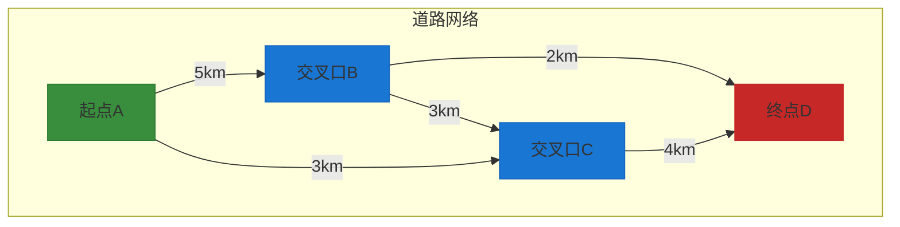

**应用示例 - 最短路径导航：**

```java
public class NavigationSystem {
    private Map<String, Map<String, Integer>> roadNetwork;
    
    // 使用 Dijkstra 寻找最短路径
    public List<String> findShortestPath(String start, String end) {
        Map<String, Integer> distances = new HashMap<>();
        Map<String, String> parents = new HashMap<>();
        PriorityQueue<Map.Entry<String, Integer>> pq = 
            new PriorityQueue<>(Map.Entry.comparingByValue());
        
        for (String vertex : roadNetwork.keySet()) {
            distances.put(vertex, Integer.MAX_VALUE);
        }
        distances.put(start, 0);
        pq.add(new AbstractMap.SimpleEntry<>(start, 0));
        parents.put(start, null);
        
        while (!pq.isEmpty()) {
            Map.Entry<String, Integer> current = pq.poll();
            String vertex = current.getKey();
            int dist = current.getValue();
            
            if (dist > distances.get(vertex)) {
                continue;
            }
            
            if (vertex.equals(end)) {
                break;
            }
            
            for (Map.Entry<String, Integer> neighbor : 
                 roadNetwork.getOrDefault(vertex, new HashMap<>()).entrySet()) {
                String nextVertex = neighbor.getKey();
                int weight = neighbor.getValue();
                
                if (dist + weight < distances.get(nextVertex)) {
                    distances.put(nextVertex, dist + weight);
                    parents.put(nextVertex, vertex);
                    pq.add(new AbstractMap.SimpleEntry<>(nextVertex, dist + weight));
                }
            }
        }
        
        // 重建路径
        List<String> path = new ArrayList<>();
        String current = end;
        while (current != null) {
            path.add(current);
            current = parents.get(current);
        }
        Collections.reverse(path);
        
        return path;
    }
}
```

### 4.3 任务依赖拓扑排序

拓扑排序用于有向无环图（DAG），常用于任务调度和依赖管理。

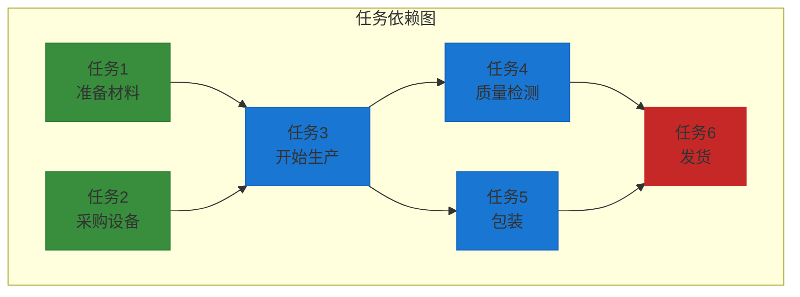

**拓扑排序实现（Kahn 算法）：**

```java
public class TopologicalSort {
    private Map<String, List<String>> adjList;
    private Map<String, Integer> inDegree;
    
    public TopologicalSort() {
        this.adjList = new HashMap<>();
        this.inDegree = new HashMap<>();
    }
    
    public void addTask(String task) {
        adjList.putIfAbsent(task, new ArrayList<>());
        inDegree.putIfAbsent(task, 0);
    }
    
    public void addDependency(String prerequisite, String task) {
        adjList.putIfAbsent(prerequisite, new ArrayList<>());
        adjList.putIfAbsent(task, new ArrayList<>());
        adjList.get(prerequisite).add(task);
        inDegree.put(task, inDegree.getOrDefault(task, 0) + 1);
    }
    
    // Kahn 算法
    public List<String> topologicalSort() {
        List<String> result = new ArrayList<>();
        Queue<String> queue = new LinkedList<>();
        
        // 入度为0的顶点入队
        for (Map.Entry<String, Integer> entry : inDegree.entrySet()) {
            if (entry.getValue() == 0) {
                queue.offer(entry.getKey());
            }
        }
        
        while (!queue.isEmpty()) {
            String current = queue.poll();
            result.add(current);
            
            for (String neighbor : adjList.getOrDefault(current, new ArrayList<>())) {
                inDegree.put(neighbor, inDegree.get(neighbor) - 1);
                if (inDegree.get(neighbor) == 0) {
                    queue.offer(neighbor);
                }
            }
        }
        
        // 如果结果不包含所有顶点，说明有环
        if (result.size() != adjList.size()) {
            throw new RuntimeException("图中存在环，无法进行拓扑排序");
        }
        
        return result;
    }
}
```

### 4.4 网络路由

网络路由使用图算法来找到数据包传输的最优路径。

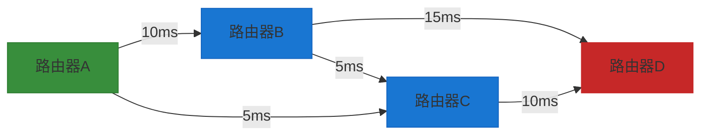

---

## 5. Java 中的图应用

### 5.1 Spring Social - 社交网络

Spring Social 是 Spring 框架的社交网络扩展，提供了与 Facebook、Twitter、LinkedIn 等社交平台集成的能力。

```mermaid
graph TD
    S1["Spring Social"] --> S2["Connection"]
    S1 --> S3["ConnectionRepository"]
    S1 --> S4["ServiceProvider"]
    
    S2 --> S5["用户连接数据"]
    S3 --> S6["管理用户连接"]
    S4 --> S7["API操作"]
    
    style S1 fill:#388e3c,stroke:#2e7d32
```

**核心接口：**

```java
// 社交连接接口
public interface Connection<S> {
    String getProviderId();
    String getProviderUserId();
    String getDisplayName();
    String getProfileUrl();
    String getImageUrl();
    void sync();
}

// 连接仓库接口
public interface ConnectionRepository {
    // 添加连接
    void addConnection(Connection<?> connection);
    // 获取用户的连接
    List<Connection<?>> findConnections(String providerId);
    // 按类型获取连接
    List<Connection<?>> findConnections(Class<? extends ServiceProvider<?>> providerType);
    // 查找用户的所有连接
    MultiValueMap<String, Connection<?>> findAllConnections();
    // 删除连接
    void removeConnection(Connection<?> connection);
}
```

### 5.2 Redis Graph - RedisModules

Redis 提供了图数据库模块 RedisGraph，基于图数据结构存储和查询社交关系。

```mermaid
graph TD
    R1["Redis Graph"] --> R2["节点"]
    R1 --> R3["边"]
    R1 --> R4["属性"]
    
    R2 --> R5[":User {name}"]
    R2 --> R6[":Post {content}"]
    R3 --> R7[:FOLLOWS]
    R3 --> R8[:LIKES]
    
    style R1 fill:#388e3c,stroke:#2e7d32
    style R2 fill:#1976d2,stroke:#1565c0
    style R3 fill:#c62828,stroke:#c62828
```

**Redis Graph 基本操作：**

```cypher
# 创建用户节点
GRAPH.ADDNODE graph user1 :User {name: "Alice", age: 25}
GRAPH.ADDNODE graph user2 :User {name: "Bob", age: 30}

# 创建关系边
GRAPH.ADDEDGE graph user1 user2 :FOLLOWS {since: 2020}

# 查询：找到 Alice 关注的所有用户
GRAPH.QUERY graph "MATCH (a:User {name: 'Alice'})-[:FOLLOWS]->(f) RETURN f"

# 查询：两人之间的最短路径
GRAPH.QUERY graph "MATCH (a:User {name: 'Alice'}), (b:User {name: 'Bob'}), p = shortestPath((a)-[*]->(b)) RETURN p"
```

**Java 客户端使用示例：**

```java
import redis.clients.jedis.graph.*;
import redis.clients.jedis.params.*;

public class RedisGraphExample {
    public static void main(String[] args) {
        JedisPool pool = new JedisPool("localhost", 6379);
        Graph graph = new Graph("social_network", pool.getResource());
        
        // 创建节点
        Node alice = Node.node()
            .label("User")
            .property("name", "Alice")
            .property("age", 25);
        
        Node bob = Node.node()
            .label("User")
            .property("name", "Bob")
            .property("age", 30);
        
        graph.addNode(alice);
        graph.addNode(bob);
        
        // 创建边
        Edge follows = Edge.edge()
            .source(alice.getId())
            .destination(bob.getId())
            .relation("FOLLOWS")
            .property("since", 2020);
        
        graph.addEdge(follows);
        
        // 查询
        Result result = graph.query(
            "MATCH (a:User {name: 'Alice'})-[:FOLLOWS]->(f) RETURN f.name"
        );
        
        // 释放资源
        pool.close();
    }
}
```

---

## 6. 总结

```mermaid
flowchart TB
    A["图总结"] --> B["图基础"]
    A --> C["图遍历"]
    A --> D["最短路径"]
    A --> E["工程应用"]
    
    B --> B1["定义: 顶点 Vertex + 边 Edge"]
    B --> B2["分类: 有向图/无向图/加权图"]
    B --> B3["表示: 邻接矩阵/邻接表/边列表"]
    
    C --> C1["DFS: 递归/迭代"]
    C --> C2["BFS: 队列实现"]
    C --> C3["连通分量检测"]
    C --> C4["环检测"]
    
    D --> D1["BFS: 无权图最短路"]
    D --> D2["Dijkstra: 正权边"]
    D --> D3["Bellman-Ford: 负权边"]
    D --> D4["Floyd-Warshall: 多源最短路"]
    
    E --> E1["社交网络"]
    E --> E2["地图导航"]
    E --> E3["拓扑排序"]
    E --> E4["网络路由"]
    
    style A fill:#1565c0,stroke:#1565c0,color:#ffffff
    style B fill:#2e7d32,stroke:#2e7d32,color:#ffffff
    style C fill:#e65100,stroke:#e65100,color:#ffffff
    style D fill:#7b1fa2,stroke:#7b1fa2,color:#ffffff
    style E fill:#c62828,stroke:#c62828,color:#ffffff
```

**关键要点：**

1. **选择合适的数据结构**：稀疏图用邻接表，稠密图用邻接矩阵
2. **选择合适的算法**：无权图用 BFS，有正权边用 Dijkstra，有负权边用 Bellman-Ford
3. **理解算法限制**：Dijkstra 不能处理负权边，Floyd-Warshall 时间复杂度较高
4. **实际应用**：社交网络、地图导航、任务调度等场景都依赖图算法
