# 排序算法

排序是计算机科学中最基本的问题之一，即将一组数据按照特定顺序（升序或降序）进行排列。本章将详细介绍各类排序算法，从基础的 O(n²) 算法到高效的 O(n log n) 算法，再到特殊的 O(n) 线性排序算法。

## 排序算法分类

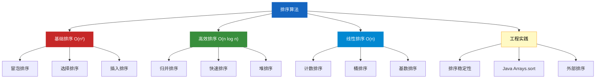

---

## 1. 基础排序 O(n²)

### 1.1 冒泡排序 (Bubble Sort)

冒泡排序是最简单的排序算法之一，通过不断比较相邻元素并交换，将最大值"冒泡"到序列末端。

#### 算法思想

1. 从序列起始位置开始，依次比较相邻的两个元素
2. 如果前面的元素大于后面的元素，就交换它们
3. 每一轮冒泡后，未排序部分的最大值会移动到最后
4. 重复 n-1 轮，直到整个序列有序

#### 排序过程示意

```
原始数组: [5, 3, 8, 4, 2]

第1轮冒泡:
  比较 (5,3) → 交换 → [3, 5, 8, 4, 2]
  比较 (5,8) → 不交换 → [3, 5, 8, 4, 2]
  比较 (8,4) → 交换 → [3, 5, 4, 8, 2]
  比较 (8,2) → 交换 → [3, 5, 4, 2, 8]
  最大值 8 已就位

第2轮冒泡:
  比较 (3,5) → 不交换 → [3, 5, 4, 2, 8]
  比较 (5,4) → 交换 → [3, 4, 5, 2, 8]
  比较 (5,2) → 交换 → [3, 4, 2, 5, 8]
  最大值 5 已就位

第3轮冒泡:
  比较 (3,4) → 不交换 → [3, 4, 2, 5, 8]
  比较 (4,2) → 交换 → [3, 2, 4, 5, 8]
  最大值 4 已就位

第4轮冒泡:
  比较 (3,2) → 交换 → [2, 3, 4, 5, 8]
  排序完成!

最终结果: [2, 3, 4, 5, 8]
```

#### 冒泡排序流程图

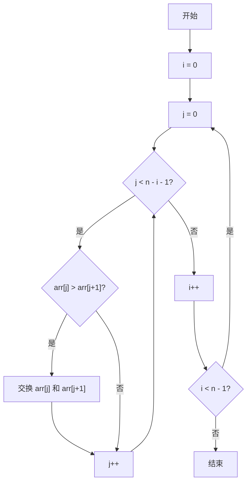

#### 优化版本：鸡尾酒排序（双向冒泡）

```java
/**
 * 冒泡排序 - 基础版本
 * 时间复杂度: 最好 O(n) 最坏 O(n²) 平均 O(n²)
 * 空间复杂度: O(1)
 * 稳定性: 稳定
 */
public static void bubbleSort(int[] arr) {
    int n = arr.length;
    for (int i = 0; i < n - 1; i++) {
        for (int j = 0; j < n - 1 - i; j++) {
            if (arr[j] > arr[j + 1]) {
                swap(arr, j, j + 1);
            }
        }
    }
}

/**
 * 冒泡排序 - 优化版本
 * 添加 flag 记录每轮是否有交换，若无交换则提前结束
 */
public static void bubbleSortOptimized(int[] arr) {
    int n = arr.length;
    for (int i = 0; i < n - 1; i++) {
        boolean swapped = false;
        for (int j = 0; j < n - 1 - i; j++) {
            if (arr[j] > arr[j + 1]) {
                swap(arr, j, j + 1);
                swapped = true;
            }
        }
        // 如果没有交换，说明已经有序，直接退出
        if (!swapped) {
            break;
        }
    }
}

/**
 * 鸡尾酒排序（双向冒泡）
 * 每一轮同时从左到右和从右到左进行冒泡
 */
public static void cocktailSort(int[] arr) {
    int left = 0;
    int right = arr.length - 1;
    while (left < right) {
        // 从左到右冒泡
        for (int i = left; i < right; i++) {
            if (arr[i] > arr[i + 1]) {
                swap(arr, i, i + 1);
            }
        }
        right--;
        // 从右到左冒泡
        for (int i = right; i > left; i--) {
            if (arr[i] < arr[i - 1]) {
                swap(arr, i, i - 1);
            }
        }
        left++;
    }
}

private static void swap(int[] arr, int i, int j) {
    int temp = arr[i];
    arr[i] = arr[j];
    arr[j] = temp;
}
```

#### 复杂度分析

| 情况 | 时间复杂度 | 说明 |
|------|-----------|------|
| 最好 | O(n) | 序列已经有序，一轮冒泡后提前结束 |
| 最坏 | O(n²) | 序列逆序，每轮都要比较和交换 |
| 平均 | O(n²) | 一般情况下的比较次数 |

---

### 1.2 选择排序 (Selection Sort)

#### 算法思想

1. 在未排序序列中找到最小元素，放到排序序列的起始位置
2. 从剩余未排序元素中继续寻找最小元素，放到已排序序列的末尾
3. 重复直到所有元素排序完成

#### 排序过程示意

```
原始数组: [64, 25, 12, 22, 11]

第1轮: 找到最小值 11，与 arr[0] 交换
  [64, 25, 12, 22, 11] → [11, 25, 12, 22, 64]

第2轮: 在 [25, 12, 22, 64] 中找到最小值 12，与 arr[1] 交换
  [11, 25, 12, 22, 64] → [11, 12, 25, 22, 64]

第3轮: 在 [25, 22, 64] 中找到最小值 22，与 arr[2] 交换
  [11, 12, 25, 22, 64] → [11, 12, 22, 25, 64]

第4轮: 在 [25, 64] 中找到最小值 25，与 arr[3] 交换
  [11, 12, 22, 25, 64] → [11, 12, 22, 25, 64]

最终结果: [11, 12, 22, 25, 64]
```

#### 选择排序流程图

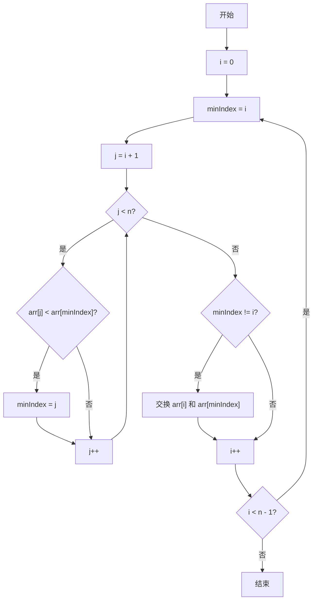

#### 代码实现

```java
/**
 * 选择排序
 * 时间复杂度: O(n²) - 无论最好还是最坏情况都是 O(n²)
 * 空间复杂度: O(1)
 * 稳定性: 不稳定（相同元素可能改变相对位置）
 */
public static void selectionSort(int[] arr) {
    int n = arr.length;
    for (int i = 0; i < n - 1; i++) {
        int minIndex = i;
        // 在未排序部分寻找最小元素
        for (int j = i + 1; j < n; j++) {
            if (arr[j] < arr[minIndex]) {
                minIndex = j;
            }
        }
        // 将最小元素交换到已排序部分末尾
        if (minIndex != i) {
            swap(arr, i, minIndex);
        }
    }
}

private static void swap(int[] arr, int i, int j) {
    int temp = arr[i];
    arr[i] = arr[j];
    arr[j] = temp;
}
```

#### 为什么选择排序不稳定？

```
原始数组: [2a, 1, 2b, 3]  (2a 表示第一个2，2b 表示第二个2)

第1轮: 找到最小值 1，与 arr[0] 交换
  [2a, 1, 2b, 3] → [1, 2a, 2b, 3]

第2轮: 在 [2a, 2b, 3] 中找到最小值 2a，与 arr[1] 交换（位置不变）
  [1, 2a, 2b, 3]

第3轮: 在 [2b, 3] 中找到最小值 2b，与 arr[2] 交换（位置不变）

最终结果: [1, 2a, 2b, 3]

但是，如果交换时机不同：
原始数组: [2a, 1, 2b, 3]
第1轮找到最小值1，与arr[0]交换 → [1, 2a, 2b, 3]

如果是用 minIndex 记录最小值位置的方式，2a 和 2b 的相对位置保持不变
但如果实现中涉及多次交换，可能导致相同元素的相对位置改变
```

---

### 1.3 插入排序 (Insertion Sort)

#### 算法思想

1. 将数组分为已排序区和未排序区，初始时已排序区只有第一个元素
2. 取出未排序区的第一个元素，在已排序区从后向前扫描
3. 如果已排序元素大于待插入元素，就将它后移一位
4. 找到合适位置插入待排序元素
5. 重复直到所有元素排序完成

#### 排序过程示意

```
原始数组: [12, 11, 13, 5, 6]

已排序区: [12]
未排序区: [11, 13, 5, 6]

第1轮: 插入 11
  已排序区: [12]
  从后向前比较: 12 > 11，12 后移 → [_, 12]
  插入 11 → [11, 12]
  已排序区: [11, 12]

第2轮: 插入 13
  已排序区: [11, 12]
  从后向前比较: 12 > 13? 否
  插入 13 → [11, 12, 13]
  已排序区: [11, 12, 13]

第3轮: 插入 5
  已排序区: [11, 12, 13]
  从后向前比较: 13 > 5? 是，13 后移 → [11, 12, _, 13]
              12 > 5? 是，12 后移 → [11, _, 12, 13]
              11 > 5? 是，11 后移 → [_, 11, 12, 13]
  插入 5 → [5, 11, 12, 13]
  已排序区: [5, 11, 12, 13]

第4轮: 插入 6
  已排序区: [5, 11, 12, 13]
  从后向前比较: 13 > 6? 是，后移
              12 > 6? 是，后移
              11 > 6? 是，后移
               5 > 6? 否
  插入 6 → [5, 6, 11, 12, 13]

最终结果: [5, 6, 11, 12, 13]
```

#### 插入排序流程图

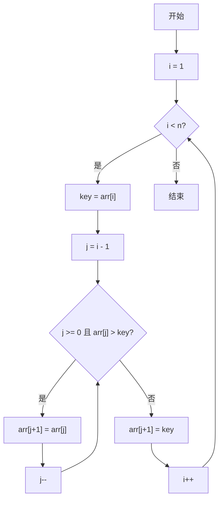

#### 代码实现

```java
/**
 * 插入排序
 * 时间复杂度: 最好 O(n) 最坏 O(n²) 平均 O(n²)
 * 空间复杂度: O(1)
 * 稳定性: 稳定
 * 特点: 对于小规模数据或基本有序的数据效率很高
 */
public static void insertionSort(int[] arr) {
    int n = arr.length;
    for (int i = 1; i < n; i++) {
        int key = arr[i];
        int j = i - 1;
        // 将比 key 大的元素向后移动
        while (j >= 0 && arr[j] > key) {
            arr[j + 1] = arr[j];
            j--;
        }
        arr[j + 1] = key;
    }
}

/**
 * 插入排序 - 二分查找优化版本
 * 使用二分查找找到插入位置，减少比较次数
 * 但移动次数不变，所以时间复杂度仍是 O(n²)
 */
public static void insertionSortBinary(int[] arr) {
    int n = arr.length;
    for (int i = 1; i < n; i++) {
        int key = arr[i];
        // 二分查找插入位置
        int insertPos = binarySearch(arr, 0, i - 1, key);
        // 元素后移
        for (int j = i; j > insertPos; j--) {
            arr[j] = arr[j - 1];
        }
        arr[insertPos] = key;
    }
}

private static int binarySearch(int[] arr, int left, int right, int key) {
    while (left <= right) {
        int mid = left + (right - left) / 2;
        if (arr[mid] <= key) {
            left = mid + 1;
        } else {
            right = mid - 1;
        }
    }
    return left;
}
```

#### 三种基础排序算法对比

| 算法 | 最好时间 | 最坏时间 | 平均时间 | 空间 | 稳定性 |
|------|---------|---------|---------|------|-------|
| 冒泡排序 | O(n) | O(n²) | O(n²) | O(1) | 稳定 |
| 选择排序 | O(n²) | O(n²) | O(n²) | O(1) | 不稳定 |
| 插入排序 | O(n) | O(n²) | O(n²) | O(1) | 稳定 |

---

## 2. 高效排序 O(n log n)

### 2.1 归并排序 (Merge Sort)

#### 算法思想

归并排序采用分治策略，将问题分解为更小的子问题：

1. **分解**：将数组平分为两半
2. **解决**：递归地对两个子数组进行排序
3. **合并**：将两个有序子数组合并为一个有序数组

#### 分治过程示意

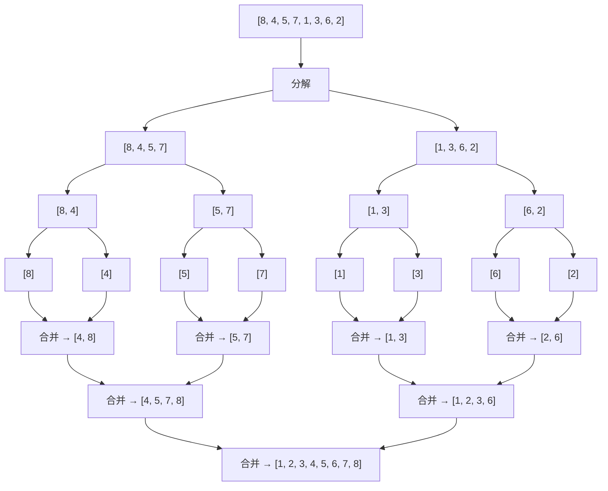

#### 代码实现

```java
/**
 * 归并排序 - 自顶向下（递归版本）
 * 时间复杂度: O(n log n) - 所有情况都一样
 * 空间复杂度: O(n) - 需要额外的辅助数组
 * 稳定性: 稳定
 */
public static void mergeSort(int[] arr) {
    if (arr == null || arr.length <= 1) {
        return;
    }
    int[] temp = new int[arr.length];
    mergeSort(arr, 0, arr.length - 1, temp);
}

private static void mergeSort(int[] arr, int left, int right, int[] temp) {
    if (left >= right) {
        return;
    }
    int mid = left + (right - left) / 2;
    // 递归分解左半部分
    mergeSort(arr, left, mid, temp);
    // 递归分解右半部分
    mergeSort(arr, mid + 1, right, temp);
    // 合并两个有序数组
    merge(arr, left, mid, right, temp);
}

private static void merge(int[] arr, int left, int mid, int right, int[] temp) {
    int i = left;      // 左数组起始指针
    int j = mid + 1;   // 右数组起始指针
    int k = left;      // 临时数组指针

    // 将两个数组的元素按大小放入 temp
    while (i <= mid && j <= right) {
        if (arr[i] <= arr[j]) {
            temp[k++] = arr[i++];
        } else {
            temp[k++] = arr[j++];
        }
    }

    // 处理剩余元素
    while (i <= mid) {
        temp[k++] = arr[i++];
    }
    while (j <= right) {
        temp[k++] = arr[j++];
    }

    // 将合并结果复制回原数组
    for (int idx = left; idx <= right; idx++) {
        arr[idx] = temp[idx];
    }
}

/**
 * 归并排序 - 自底向上（迭代版本）
 * 不使用递归，直接从最小的子数组开始合并
 */
public static void mergeSortBottomUp(int[] arr) {
    int n = arr.length;
    int[] temp = new int[n];

    // 子数组大小从 1 开始，每次翻倍
    for (int size = 1; size < n; size *= 2) {
        // 对所有大小为 size 的子数组进行合并
        for (int left = 0; left < n - size; left += 2 * size) {
            int mid = Math.min(left + size - 1, n - 1);
            int right = Math.min(left + 2 * size - 1, n - 1);
            merge(arr, left, mid, right, temp);
        }
    }
}
```

---

### 2.2 快速排序 (Quick Sort)

#### 算法思想

快速排序同样采用分治策略：

1. **分区(Pivot)**：选择一个基准元素(pivot)，将数组分为两部分
   - 左部分所有元素 <= pivot
   - 右部分所有元素 > pivot
2. **递归**：递归地对左右两部分进行快速排序

#### 分区过程详解

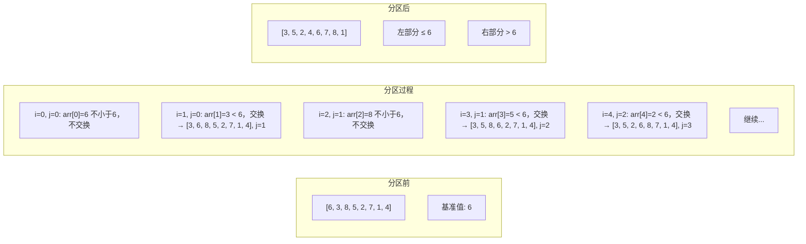

#### 代码实现

```java
/**
 * 快速排序
 * 时间复杂度: 最好 O(n log n) 最坏 O(n²) 平均 O(n log n)
 * 空间复杂度: O(log n) - 递归栈空间
 * 稳定性: 不稳定
 */
public static void quickSort(int[] arr) {
    if (arr == null || arr.length <= 1) {
        return;
    }
    quickSort(arr, 0, arr.length - 1);
}

private static void quickSort(int[] arr, int left, int right) {
    if (left >= right) {
        return;
    }
    // 分区，返回基准值的最终位置
    int pivotIndex = partition(arr, left, right);
    // 递归排序左部分
    quickSort(arr, left, pivotIndex - 1);
    // 递归排序右部分
    quickSort(arr, pivotIndex + 1, right);
}

/**
 * Lomuto 分区方案
 * 选择最右边的元素作为基准
 */
private static int partition(int[] arr, int left, int right) {
    int pivot = arr[right];
    int i = left - 1;  // 小于基准元素的区域边界

    for (int j = left; j < right; j++) {
        if (arr[j] <= pivot) {
            i++;
            swap(arr, i, j);
        }
    }
    // 将基准元素放到正确位置
    swap(arr, i + 1, right);
    return i + 1;
}

/**
 * Hoare 分区方案
 * 使用两个指针从两端向中间扫描
 */
private static int partitionHoare(int[] arr, int left, int right) {
    int pivot = arr[left];  // 选择最左边的元素作为基准
    int i = left - 1;
    int j = right + 1;

    while (true) {
        // 从左向右找到第一个大于等于 pivot 的元素
        do {
            i++;
        } while (arr[i] < pivot);

        // 从右向左找到第一个小于等于 pivot 的元素
        do {
            j--;
        } while (arr[j] > pivot);

        if (i >= j) {
            return j;
        }
        swap(arr, i, j);
    }
}

/**
 * 快速排序 - 三数取中基准选择
 * 避免最坏情况（有序数组）
 */
public static void quickSortMedianOfThree(int[] arr) {
    if (arr == null || arr.length <= 1) {
        return;
    }
    quickSortMedian(arr, 0, arr.length - 1);
}

private static void quickSortMedian(int[] arr, int left, int right) {
    if (left >= right) {
        return;
    }
    // 三数取中确定基准
    int mid = left + (right - left) / 2;
    if (arr[left] > arr[right]) swap(arr, left, right);
    if (arr[mid] > arr[right]) swap(arr, mid, right);
    if (arr[mid] > arr[left]) swap(arr, mid, left);

    // 将中位数放到 right-1 位置
    swap(arr, mid, right - 1);
    int pivot = arr[right - 1];

    int pivotIndex = partitionMedian(arr, left, right, pivot);
    quickSortMedian(arr, left, pivotIndex - 1);
    quickSortMedian(arr, pivotIndex + 1, right);
}

private static int partitionMedian(int[] arr, int left, int right, int pivot) {
    int i = left;
    int j = right - 1;
    while (true) {
        while (arr[++i] < pivot) {}
        while (arr[--j] > pivot) {}
        if (i >= j) break;
        swap(arr, i, j);
    }
    swap(arr, i, right - 1);
    return i;
}

/**
 * 快速排序优化：小区间使用插入排序
 */
private static void quickSortOptimized(int[] arr, int left, int right) {
    if (right - left <= 10) {
        // 小区间使用插入排序
        insertionSort(arr, left, right);
        return;
    }
    int pivotIndex = partition(arr, left, right);
    quickSortOptimized(arr, left, pivotIndex - 1);
    quickSortOptimized(arr, pivotIndex + 1, right);
}

private static void insertionSort(int[] arr, int left, int right) {
    for (int i = left + 1; i <= right; i++) {
        int key = arr[i];
        int j = i - 1;
        while (j >= left && arr[j] > key) {
            arr[j + 1] = arr[j];
            j--;
        }
        arr[j + 1] = key;
    }
}

private static void swap(int[] arr, int i, int j) {
    int temp = arr[i];
    arr[i] = arr[j];
    arr[j] = temp;
}
```

#### 快速排序 vs 归并排序

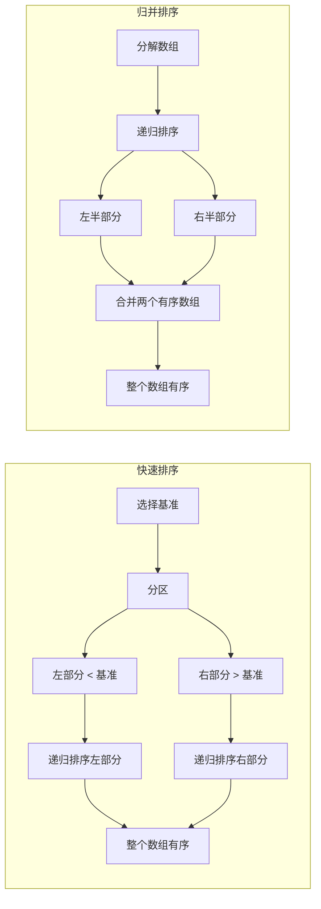

| 特性 | 快速排序 | 归并排序 |
|------|---------|---------|
| 时间复杂度(平均) | O(n log n) | O(n log n) |
| 时间复杂度(最坏) | O(n²) | O(n log n) |
| 空间复杂度 | O(log n) | O(n) |
| 稳定性 | 不稳定 | 稳定 |
| 原地排序 | 是 | 否 |

---

### 2.3 堆排序 (Heap Sort)

#### 堆的概念

堆是一种完全二叉树，分为最大堆和最小堆：

- **最大堆**：父节点的值 >= 子节点的值
- **最小堆**：父节点的值 <= 子节点的值

#### 堆的数组表示

```
堆结构:           数组表示:
       90              [90, 85, 70, 60, 50, 75, 65, 30, 40]
      /  \
    85    70          父节点 i 的左子节点: 2i + 1
    / \   / \
  60  50 75  65      父节点 i 的右子节点: 2i + 2
  /\   /            子节点 i 的父节点: (i - 1) / 2
 30 40
```

#### 堆排序思想

1. **构建最大堆**：将数组构建成最大堆
2. **循环排序**：
   - 交换堆顶（最大值）和堆尾
   - 堆大小减 1
   - 对新的堆顶进行 heapify（下沉）
   - 重复直到堆大小为 1

#### 堆排序过程示意

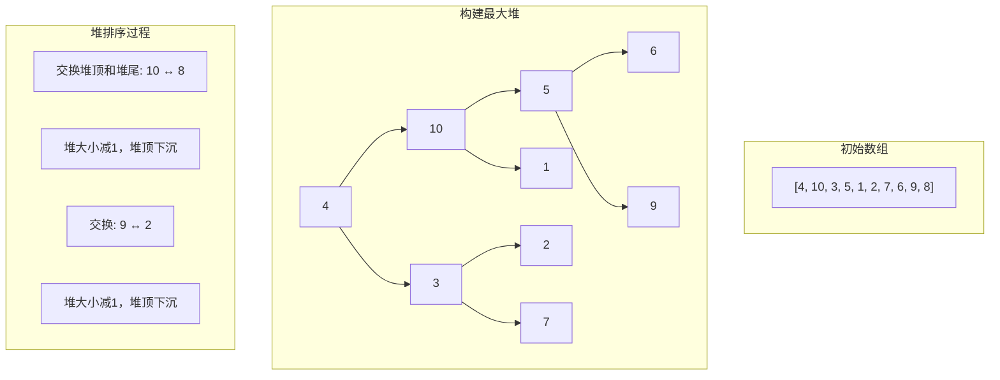

#### 代码实现

```java
/**
 * 堆排序
 * 时间复杂度: O(n log n) - 所有情况都一样
 * 空间复杂度: O(1)
 * 稳定性: 不稳定
 */
public static void heapSort(int[] arr) {
    int n = arr.length;

    // 1. 构建最大堆（从最后一个非叶子节点开始下沉）
    for (int i = n / 2 - 1; i >= 0; i--) {
        heapify(arr, n, i);
    }

    // 2. 循环提取最大值
    for (int i = n - 1; i > 0; i--) {
        // 将堆顶（最大值）移到数组末尾
        swap(arr, 0, i);
        // 堆大小减1，对新的堆顶进行下沉
        heapify(arr, i, 0);
    }
}

/**
 * 下沉操作：维护最大堆性质
 * @param arr 待排序数组
 * @param heapSize 堆的大小（不是数组长度）
 * @param i 要下沉的节点索引
 */
private static void heapify(int[] arr, int heapSize, int i) {
    int largest = i;      // 假设当前节点最大
    int left = 2 * i + 1;  // 左子节点
    int right = 2 * i + 2; // 右子节点

    // 检查左子节点
    if (left < heapSize && arr[left] > arr[largest]) {
        largest = left;
    }

    // 检查右子节点
    if (right < heapSize && arr[right] > arr[largest]) {
        largest = right;
    }

    // 如果最大值不是当前节点，需要下沉
    if (largest != i) {
        swap(arr, i, largest);
        // 递归下沉被交换的子节点
        heapify(arr, heapSize, largest);
    }
}

/**
 * 获取父节点索引
 */
private static int parent(int i) {
    return (i - 1) / 2;
}

/**
 * 获取左子节点索引
 */
private static int leftChild(int i) {
    return 2 * i + 1;
}

/**
 * 获取右子节点索引
 */
private static int rightChild(int i) {
    return 2 * i + 2;
}

private static void swap(int[] arr, int i, int j) {
    int temp = arr[i];
    arr[i] = arr[j];
    arr[j] = temp;
}
```

#### 堆排序流程图

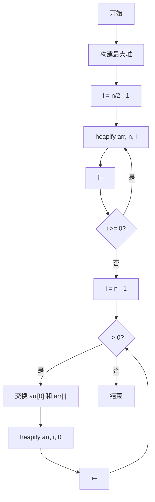

---

## 3. 线性排序 O(n)

### 3.1 计数排序 (Counting Sort)

#### 算法思想

1. 找出待排序数组的最大值和最小值
2. 创建一个计数数组，长度为 (max - min + 1)
3. 统计每个元素出现的次数
4. 对计数数组进行前缀和计算（确定元素最终位置）
5. 从后向前遍历原数组，将元素放到正确位置

#### 为什么从后向前遍历？

保证排序的稳定性，相同元素的相对位置不变。

#### 排序过程示意

```
原始数组: [2, 5, 3, 1, 2, 8, 5, 3, 1]

步骤1: 找出范围
  min = 1, max = 8
  计数数组大小 = 8 - 1 + 1 = 8

步骤2: 统计计数
  值:   1  2  3  4  5  6  7  8
  计数: 2  2  2  0  2  0  0  1

步骤3: 前缀和
  值:    1   2   3   4   5   6   7   8
  前缀和: 2   4   6   6   8   8   8   9

步骤4: 从后向前遍历，放置元素
  原数组从后向前: 1, 3, 5, 8, 2, 1, 2, 3, 5, 2
  放置 1: 前缀和[1]=2, 放到位置1 → [_, 1], 前缀和[1]--
  放置 3: 前缀和[3]=6, 放到位置5 → [_, 1, _, _, _, 3]
  ...

最终结果: [1, 1, 2, 2, 2, 3, 3, 5, 5, 8]
```

#### 代码实现

```java
/**
 * 计数排序
 * 时间复杂度: O(n + k) - k 为数据范围
 * 空间复杂度: O(k)
 * 稳定性: 稳定
 * 限制: 只适合整数，且数据范围不能太大
 */
public static void countingSort(int[] arr) {
    if (arr == null || arr.length <= 1) {
        return;
    }

    // 1. 找出最大值和最小值
    int min = arr[0], max = arr[0];
    for (int num : arr) {
        min = Math.min(min, num);
        max = Math.max(max, num);
    }

    // 2. 创建计数数组
    int range = max - min + 1;
    int[] count = new int[range];

    // 3. 统计每个元素出现的次数
    for (int num : arr) {
        count[num - min]++;
    }

    // 4. 计算前缀和（确定元素最终位置）
    for (int i = 1; i < range; i++) {
        count[i] += count[i - 1];
    }

    // 5. 从后向前遍历，放置元素（保证稳定性）
    int[] temp = new int[arr.length];
    for (int i = arr.length - 1; i >= 0; i--) {
        int value = arr[i];
        int index = --count[value - min];
        temp[index] = value;
    }

    // 6. 复制回原数组
    System.arraycopy(temp, 0, arr, 0, arr.length);
}

/**
 * 计数排序 - 简化版本（适合非负整数且范围不大）
 */
public static void countingSortSimple(int[] arr) {
    if (arr == null || arr.length <= 1) {
        return;
    }

    // 找出最大值
    int max = arr[0];
    for (int num : arr) {
        max = Math.max(max, num);
    }

    // 计数
    int[] count = new int[max + 1];
    for (int num : arr) {
        count[num]++;
    }

    // 输出
    int index = 0;
    for (int i = 0; i <= max; i++) {
        while (count[i]-- > 0) {
            arr[index++] = i;
        }
    }
}
```

---

### 3.2 桶排序 (Bucket Sort)

#### 算法思想

1. 将数据分散到有限数量的桶中
2. 对每个桶内部进行排序（可以使用其他排序算法）
3. 按顺序合并所有桶中的数据

#### 排序过程示意

```
原始数组: [0.42, 0.65, 0.32, 0.87, 0.76, 0.12, 0.23, 0.45]

创建5个桶，范围分别是: [0-0.2), [0.2-0.4), [0.4-0.6), [0.6-0.8), [0.8-1.0)

桶0: [0.12]        范围: 0.0 - 0.2
桶1: [0.23, 0.32]  范围: 0.2 - 0.4
桶2: [0.42, 0.45]  范围: 0.4 - 0.6
桶3: [0.65, 0.76]  范围: 0.6 - 0.8
桶4: [0.87]        范围: 0.8 - 1.0

对每个桶内部进行排序（插入排序）:
桶0: [0.12]
桶1: [0.23, 0.32]
桶2: [0.42, 0.45]
桶3: [0.65, 0.76]
桶4: [0.87]

合并所有桶:
[0.12, 0.23, 0.32, 0.42, 0.45, 0.65, 0.76, 0.87]
```

#### 桶排序流程图

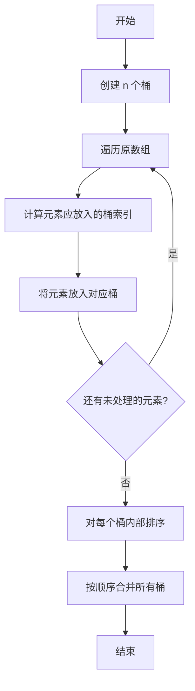

#### 代码实现

```java
/**
 * 桶排序
 * 时间复杂度: O(n + k) - k 为桶的数量
 * 空间复杂度: O(n + k)
 * 稳定性: 取决于桶内排序算法
 */
public static void bucketSort(double[] arr) {
    if (arr == null || arr.length <= 1) {
        return;
    }

    // 1. 创建桶
    int bucketCount = arr.length;
    List<Double>[] buckets = new ArrayList[bucketCount];
    for (int i = 0; i < bucketCount; i++) {
        buckets[i] = new ArrayList<>();
    }

    // 2. 将元素放入桶中
    double min = arr[0], max = arr[0];
    for (double num : arr) {
        min = Math.min(min, num);
        max = Math.max(max, num);
    }
    double range = max - min;

    for (double num : arr) {
        // 计算桶索引
        int bucketIndex = (int) ((num - min) / range * (bucketCount - 1));
        buckets[bucketIndex].add(num);
    }

    // 3. 对每个桶内部排序
    for (List<Double> bucket : buckets) {
        Collections.sort(bucket);
    }

    // 4. 合并所有桶
    int index = 0;
    for (List<Double> bucket : buckets) {
        for (double num : bucket) {
            arr[index++] = num;
        }
    }
}

/**
 * 桶排序 - 整数版本
 */
public static void bucketSortInt(int[] arr, int bucketSize) {
    if (arr == null || arr.length <= 1) {
        return;
    }

    // 找出最大值和最小值
    int min = arr[0], max = arr[0];
    for (int num : arr) {
        min = Math.min(min, num);
        max = Math.max(max, num);
    }

    // 创建桶
    int bucketCount = (max - min) / bucketSize + 1;
    List<Integer>[] buckets = new ArrayList[bucketCount];
    for (int i = 0; i < bucketCount; i++) {
        buckets[i] = new ArrayList<>();
    }

    // 分配元素到桶
    for (int num : arr) {
        int bucketIndex = (num - min) / bucketSize;
        buckets[bucketIndex].add(num);
    }

    // 桶内排序并合并
    int index = 0;
    for (List<Integer> bucket : buckets) {
        Collections.sort(bucket);
        for (int num : bucket) {
            arr[index++] = num;
        }
    }
}
```

---

### 3.3 基数排序 (Radix Sort)

#### 算法思想

基数排序按位进行排序，从最低位（个位）到最高位：

1. 统计每一位上每个数字出现的次数
2. 根据计数确定每位数字的起始位置
3. 按位从后向前收集元素（保证稳定性）
4. 重复直到最高位排序完成

#### 排序过程示意

```
原始数组: [170, 45, 75, 90, 802, 24, 2, 66]

按最低位排序（个位）:
  170 → 0    45 → 5    75 → 5    90 → 0
  802 → 2    24 → 4    2 → 2    66 → 6

  按个位排序后: [170, 90, 802, 2, 24, 45, 75, 66]

按十位排序:
  170 → 7    90 → 9    802 → 0
  2 → 0      24 → 2    45 → 4
  75 → 7     66 → 6

  按十位排序后: [802, 2, 24, 45, 66, 170, 75, 90]

按百位排序:
  802 → 8    2 → 0      24 → 0
  45 → 0     66 → 0     170 → 1
  75 → 0     90 → 0

  按百位排序后: [2, 24, 45, 66, 75, 90, 170, 802]

最终结果: [2, 24, 45, 66, 75, 90, 170, 802]
```

#### 基数排序 vs 计数排序 vs 桶排序

| 排序算法 | 桶数量 | 桶内排序 | 分配依据 |
|---------|-------|---------|---------|
| 计数排序 | max - min + 1 | 无（直接计数） | 元素值本身 |
| 桶排序 | 预先设定 | 需要 | 元素值映射 |
| 基数排序 | 10（数字）或 26（字母） | 需要（计数排序） | 元素的每一位 |

#### 代码实现

```java
/**
 * 基数排序（LSD - 最低位优先）
 * 时间复杂度: O(d * (n + k)) - d 为位数，k 为进制（10）
 * 空间复杂度: O(n + k)
 * 稳定性: 稳定
 */
public static void radixSort(int[] arr) {
    if (arr == null || arr.length <= 1) {
        return;
    }

    // 找出最大值，确定位数
    int max = arr[0];
    for (int num : arr) {
        max = Math.max(max, num);
    }

    // 处理负数：将数组分为正数和负数两部分
    // 分别排序后合并
    List<Integer> positives = new ArrayList<>();
    List<Integer> negatives = new ArrayList<>();

    for (int num : arr) {
        if (num >= 0) {
            positives.add(num);
        } else {
            negatives.add(-num); // 取绝对值
        }
    }

    // 对正数部分进行基数排序
    if (!positives.isEmpty()) {
        int[] posArray = positives.stream().mapToInt(Integer::intValue).toArray();
        radixSortLSD(posArray);
        // 复制回原数组
        int idx = 0;
        for (int num : posArray) {
            arr[idx++] = num;
        }
    }

    // 对负数部分进行基数排序
    if (!negatives.isEmpty()) {
        int[] negArray = negatives.stream().mapToInt(Integer::intValue).toArray();
        radixSortLSD(negArray);
        // 复制回原数组（负数要倒序）
        int idx = arr.length - negArray.length;
        for (int i = 0; i < negArray.length; i++) {
            arr[idx++] = -negArray[negArray.length - 1 - i];
        }
    }
}

private static void radixSortLSD(int[] arr) {
    // 找出最大值，确定位数
    int max = arr[0];
    for (int num : arr) {
        max = Math.max(max, num);
    }

    // 从个位开始，逐位排序
    int exp = 1; // 当前处理的位数（1, 10, 100, ...）
    while (max / exp > 0) {
        countingSortByDigit(arr, exp);
        exp *= 10;
    }
}

/**
 * 按指定位数进行计数排序
 * @param arr 待排序数组
 * @param exp 位数权重（1表示个位，10表示十位，...）
 */
private static void countingSortByDigit(int[] arr, int exp) {
    int n = arr.length;
    int[] output = new int[n];
    int[] count = new int[10]; // 每一位是 0-9

    // 统计每个数字出现的次数
    for (int num : arr) {
        int digit = (num / exp) % 10;
        count[digit]++;
    }

    // 计算前缀和
    for (int i = 1; i < 10; i++) {
        count[i] += count[i - 1];
    }

    // 从后向前遍历，保证稳定性
    for (int i = n - 1; i >= 0; i--) {
        int digit = (arr[i] / exp) % 10;
        output[--count[digit]] = arr[i];
    }

    // 复制回原数组
    System.arraycopy(output, 0, arr, 0, n);
}

/**
 * 基数排序 - MSD 版本（最高位优先）
 * 使用递归，适合字符串排序
 */
public static void radixSortMSD(String[] arr, int maxLen) {
    radixSortMSD(arr, 0, arr.length - 1, 0, maxLen);
}

private static void radixSortMSD(String[] arr, int left, int right, int index, int maxLen) {
    if (right <= left || index >= maxLen) {
        return;
    }

    // 计数排序
    int[] count = new int[256 + 1]; // 假设 ASCII 字符
    for (int i = left; i <= right; i++) {
        int c = index < arr[i].length() ? arr[i].charAt(index) + 1 : 0;
        count[c]++;
    }

    for (int i = 1; i < count.length; i++) {
        count[i] += count[i - 1];
    }

    String[] temp = new String[right - left + 1];
    for (int i = right; i >= left; i--) {
        int c = index < arr[i].length() ? arr[i].charAt(index) + 1 : 0;
        temp[--count[c]] = arr[i];
    }

    for (int i = left; i <= right; i++) {
        arr[i] = temp[i - left];
    }

    // 递归处理每个桶
    for (int i = 0; i < count.length - 1; i++) {
        if (count[i] < count[i + 1]) {
            radixSortMSD(arr, left + count[i], left + count[i + 1] - 1, index + 1, maxLen);
        }
    }
}
```

---

## 4. 排序算法对比

### 4.1 复杂度对比表

| 算法 | 最好时间 | 最坏时间 | 平均时间 | 空间 | 稳定性 |
|------|---------|---------|---------|------|-------|
| **基础排序 O(n²)** ||||||
| 冒泡排序 | O(n) | O(n²) | O(n²) | O(1) | 稳定 |
| 选择排序 | O(n²) | O(n²) | O(n²) | O(1) | 不稳定 |
| 插入排序 | O(n) | O(n²) | O(n²) | O(1) | 稳定 |
| **高效排序 O(n log n)** ||||||
| 归并排序 | O(n log n) | O(n log n) | O(n log n) | O(n) | 稳定 |
| 快速排序 | O(n log n) | O(n²) | O(n log n) | O(log n) | 不稳定 |
| 堆排序 | O(n log n) | O(n log n) | O(n log n) | O(1) | 不稳定 |
| **线性排序 O(n)** ||||||
| 计数排序 | O(n + k) | O(n + k) | O(n + k) | O(k) | 稳定 |
| 桶排序 | O(n + k) | O(n²) | O(n + k) | O(n + k) | 稳定 |
| 基数排序 | O(d * (n + k)) | O(d * (n + k)) | O(d * (n + k)) | O(n + k) | 稳定 |

> 注: k 为数据范围，d 为位数

### 4.2 算法选择指南

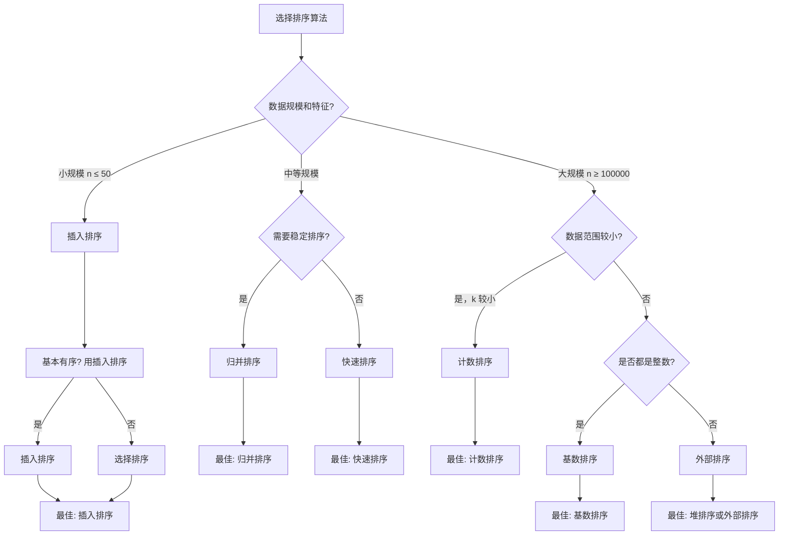

### 4.3 各算法适用场景

| 算法 | 适用场景 |
|------|---------|
| 冒泡排序 | 教学理解、基本入门，实际很少使用 |
| 选择排序 | 需要最少交换次数的场景（写入磁盘等） |
| 插入排序 | 小规模数据、基本有序的数据、链表排序 |
| 归并排序 | 需要稳定排序、外部排序、链表排序 |
| 快速排序 | 一般情况下的通用排序（实际应用最广） |
| 堆排序 | 需要最坏情况保证、有限空间的排序 |
| 计数排序 | 数据范围较小的整数排序 |
| 桶排序 | 数据均匀分布的浮点数排序 |
| 基数排序 | 整数或字符串的高效排序 |

---

## 5. 排序算法稳定性

### 5.1 什么是排序稳定性？

排序稳定性指相同元素在排序后的相对位置与排序前保持一致。

```
不稳定排序示例:
  原始: [(A, 2), (B, 1), (C, 1)]
  排序后: [(B, 1), (C, 1), (A, 2)]  ← B 和 C 的相对位置可能改变

稳定排序示例:
  原始: [(A, 2), (B, 1), (C, 1)]
  排序后: [(B, 1), (C, 1), (A, 2)]  ← B 和 C 的相对位置保持不变
```

### 5.2 稳定性分析

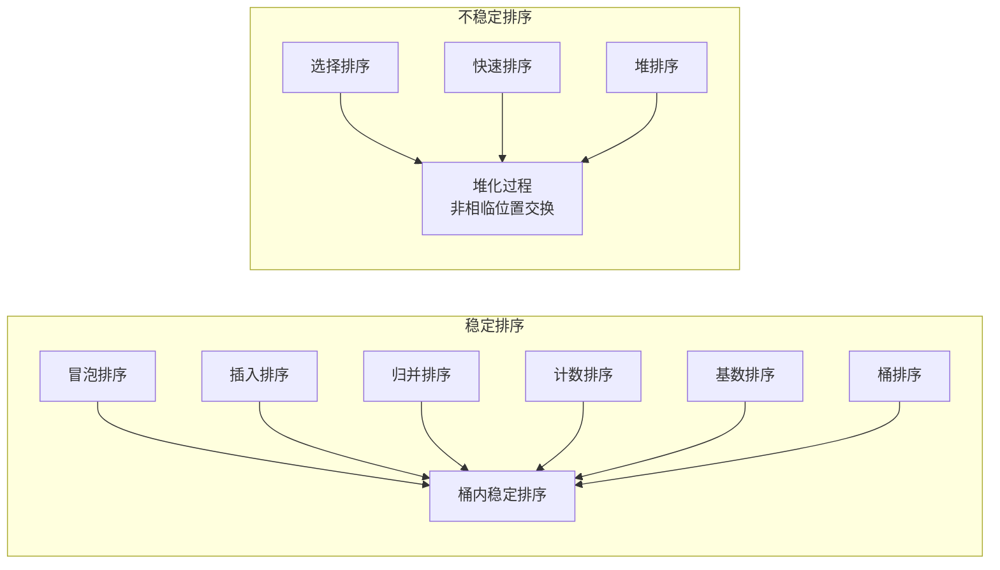

### 5.3 稳定性的实际意义

```java
// 示例：按成绩和姓名双重排序
Student[] students = {
    new Student("Alice", 90),
    new Student("Bob", 85),
    new Student("Charlie", 90)
};

// 第一次按成绩排序
stableSort(students, byScore());  // 稳定排序
// 结果: [(Bob, 85), (Alice, 90), (Charlie, 90)]

// 第二次按姓名排序（稳定排序保证成绩相同时按姓名）
stableSort(students, byName());
// 结果: [(Bob, 85), (Alice, 90), (Charlie, 90)] ← Alice 仍在 Charlie 前

// 如果第一次用的是不稳定排序
unstableSort(students, byScore());
// 结果: 可能变成 [(Bob, 85), (Charlie, 90), (Alice, 90)]
// 再按姓名排序后，Alice 和 Charlie 的相对位置可能不符合预期
```

---

## 6. 工程实践

### 6.1 Java Arrays.sort() 源码分析

Java 的 `Arrays.sort()` 对不同数据类型使用不同算法：

#### 对于基本类型（int[], double[], char[]）

使用 **双轴快速排序（Dual-Pivot Quicksort）**：

```java
// java.util.DualPivotQuicksort.sort()

/*
 * 双轴快速排序是对传统快速排序的优化：
 * 1. 选择两个基准元素，将数组分为三部分
 * 2. < pivot1, pivot1 <= x <= pivot2, > pivot2
 * 3. 减少比较次数，提高缓存命中率
 */

// 核心伪代码
public static void sort(int[] a, int left, int right) {
    if (right - left < 286) {
        // 小数组使用快速排序
        quickSort(a, left, right);
    } else {
        // 大数组使用归并排序 + 双轴快速排序的混合
        mergeSort(a, left, right);
    }
}

private static void quickSort(int[] a, int left, int right) {
    // 双轴基准选择
    int pivot1 = a[left];
    int pivot2 = a[right];

    if (pivot1 > pivot2) {
        swap(a, left, right);
        pivot1 = a[left];
        pivot2 = a[right];
    }

    // 三个区域的边界
    int low = left + 1;
    int high = right - 1;
    int k = low;

    // 分区过程
    while (k <= high) {
        if (a[k] < pivot1) {
            swap(a, k++, low++);
        } else if (a[k] > pivot2) {
            while (k < high && a[high] > pivot2) {
                high--;
            }
            swap(a, k, high--);
        } else {
            k++;
        }
    }

    // 将基准放到正确位置
    swap(a, left, low - 1);
    swap(a, right, high + 1);

    // 递归排序三个分区
    quickSort(a, left, low - 2);
    quickSort(a, high + 2, right);
}
```

#### 对于对象类型（Object[]）

使用 **TimSort**（优化的归并排序）：

```java
// java.util.TimSort.sort()

/*
 * TimSort 结合了归并排序和插入排序的优点：
 * 1. 利用数据中的已有顺序（runs）
 * 2. 小区块使用插入排序
 * 3. 使用栈来合并 runs
 */

// 核心思想
public static <T> void sort(T[] a, Comparator<? super T> c) {
    int n = a.length;

    // 特殊情况
    if (n < 2) return;

    // 小数组使用二分插入排序
    if (n < 32) {
        int runLength = n;
        // ...
    }

    // 构建 runs（已排序的连续序列）
    // 识别数据中的自然有序段

    // 合并 runs（使用栈）
    while (stackSize > 1) {
        mergeStack();
    }
}
```

#### Java 排序选择策略

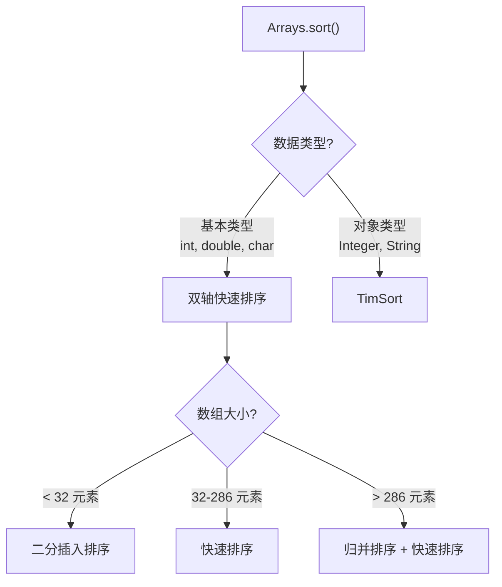

### 6.2 外部排序（大数据排序）

当数据量太大无法一次性加载到内存时，需要使用外部排序。

#### 算法思想

1. **分块读取**：将大数据分成小块，每块可以放入内存
2. **内存内排序**：对每个小块进行排序
3. **归并阶段**：使用多路归并将有序的小块合并成更大的有序块

#### 外部排序流程图

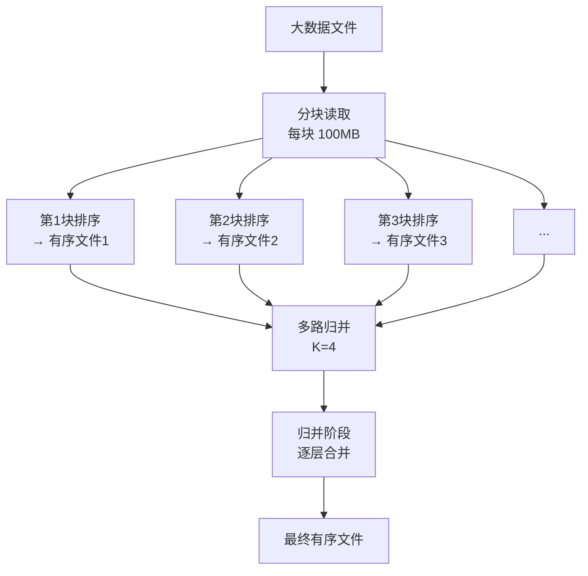

#### 代码实现（简化版）

```java
import java.io.*;
import java.util.*;

/**
 * 外部排序示例
 * 假设内存只能容纳 10000 个整数
 */
public class ExternalSort {

    private static final int MEMORY_SIZE = 10000;  // 内存能容纳的元素数
    private static final String TEMP_DIR = "temp/";
    private static final int RUNS_PER_MERGE = 16; // 每次合并 16 个有序块

    /**
     * 外部排序主方法
     */
    public static void externalSort(String inputFile, String outputFile) throws IOException {
        // 阶段1: 生成分块的有序文件
        List<String> tempFiles = splitAndSort(inputFile);

        // 阶段2: 多路归并
        kWayMerge(tempFiles, outputFile);

        // 清理临时文件
        for (String file : tempFiles) {
            new File(file).delete();
        }
    }

    /**
     * 将大文件分成小块，每块排序后写入临时文件
     */
    private static List<String> splitAndSort(String inputFile) throws IOException {
        List<String> tempFiles = new ArrayList<>();
        int[] buffer = new int[MEMORY_SIZE];

        try (BufferedReader reader = new BufferedReader(
                new FileReader(inputFile), 64 * 1024)) {

            int count;
            int fileIndex = 0;

            while ((count = readBlock(reader, buffer)) > 0) {
                // 内存内排序
                Arrays.sort(buffer, 0, count);

                // 写入临时文件
                String tempFile = TEMP_DIR + "run_" + fileIndex++ + ".txt";
                writeBlock(tempFile, buffer, count);
                tempFiles.add(tempFile);
            }
        }

        return tempFiles;
    }

    /**
     * K路归并
     */
    private static void kWayMerge(List<String> inputFiles, String outputFile)
            throws IOException {

        // 为每个输入文件创建优先队列节点
        PriorityQueue<MergeNode> pq = new PriorityQueue<>(
                Comparator.comparingInt(n -> n.value)
        );

        BufferedReader[] readers = new BufferedReader[inputFiles.size()];
        BufferedWriter writer = new BufferedWriter(
                new FileWriter(outputFile), 64 * 1024);

        try {
            // 初始化读取器和优先队列
            for (int i = 0; i < inputFiles.size(); i++) {
                readers[i] = new BufferedReader(
                        new FileReader(inputFiles.get(i)), 64 * 1024);
                String line = readers[i].readLine();
                if (line != null) {
                    pq.offer(new MergeNode(Integer.parseInt(line), i));
                }
            }

            // K路归并
            while (!pq.isEmpty()) {
                MergeNode node = pq.poll();
                writer.write(node.value + "\n");

                // 从同一个文件读取下一个
                String line = readers[node.fileIndex].readLine();
                if (line != null) {
                    pq.offer(new MergeNode(Integer.parseInt(line), node.fileIndex));
                }
            }

        } finally {
            writer.close();
            for (BufferedReader reader : readers) {
                if (reader != null) reader.close();
            }
        }
    }

    private static int readBlock(BufferedReader reader, int[] buffer) throws IOException {
        int count = 0;
        String line;
        while (count < buffer.length && (line = reader.readLine()) != null) {
            buffer[count++] = Integer.parseInt(line.trim());
        }
        return count;
    }

    private static void writeBlock(String file, int[] buffer, int count) throws IOException {
        File dir = new File(TEMP_DIR);
        if (!dir.exists()) dir.mkdirs();

        try (PrintWriter writer = new PrintWriter(file)) {
            for (int i = 0; i < count; i++) {
                writer.println(buffer[i]);
            }
        }
    }

    static class MergeNode {
        int value;
        int fileIndex;

        MergeNode(int value, int fileIndex) {
            this.value = value;
            this.fileIndex = fileIndex;
        }
    }
}
```

#### 外部排序优化策略

| 优化策略 | 说明 |
|---------|------|
| 增加归并路数 K | 减少归并趟数，但增加内存和比较开销 |
| 增大缓冲区块 | 减少 IO 次数 |
| 产生更长的初始 runs | 使用替换选择算法产生平均 2M 长度的 runs |
| 资源ample 归并 | 使用败者树减少比较次数 |

---

## 7. 小结

### 排序算法全景图

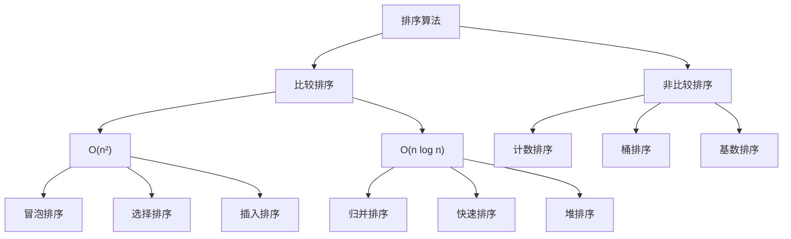

### 关键要点

1. **选择合适算法**：
   - 小数据或基本有序 → 插入排序
   - 一般情况 → 快速排序（实际应用最广）
   - 需要稳定 → 归并排序
   - 整数且范围小 → 计数排序
   - 字符串/整数 → 基数排序

2. **优化技巧**：
   - 快速排序：小数据用插入排序，三数取中基准
   - 归并排序：小区间优化
   - 堆排序：使用 System.arraycopy 批量移动

3. **稳定性**：实际应用中，稳定排序在多重排序时非常重要
