# 二分查找与递归

## 一、二分查找

### 1.1 二分查找原理

二分查找（Binary Search）是一种在**有序数组**中查找目标元素的算法。其核心思想是"折半查找"：每次将搜索范围缩小一半，通过比较中间元素与目标值的大小关系，确定目标值可能存在的区间，直到找到目标值或搜索区间为空。

二分查找的时间复杂度为 **O(log n)**，空间复杂度为 **O(1)**（迭代实现）。

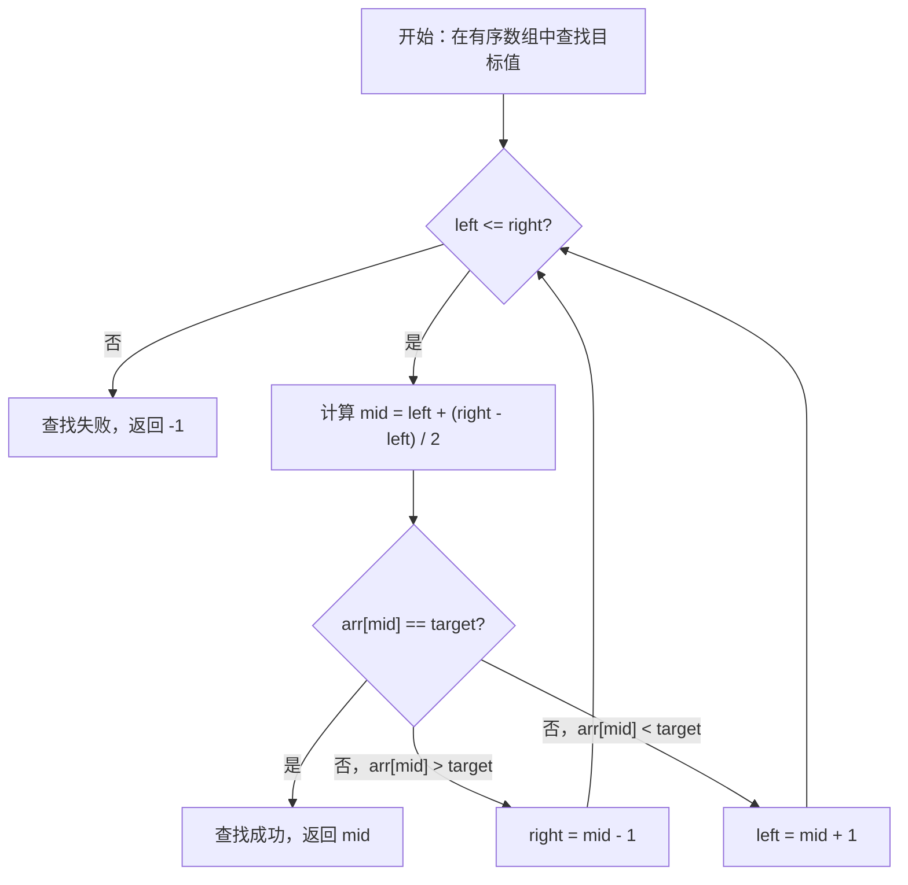

**二分查找的前提条件**：
- 有序数组（升序或降序）
- 数组支持随机访问（下标访问）

### 1.2 二分查找模板

#### 1.2.1 左闭右闭区间 [left, right]

```java
/**
 * 二分查找（左闭右闭区间）
 * @param arr 有序数组
 * @param target 目标值
 * @return 目标值索引，未找到返回 -1
 */
public int binarySearch(int[] arr, int target) {
    int left = 0;
    int right = arr.length - 1;  // right 在有效范围内

    while (left <= right) {      // left <= right，表示区间非空
        int mid = left + ((right - left) >> 1);  // 防止整数溢出
        if (arr[mid] == target) {
            return mid;
        } else if (arr[mid] > target) {
            right = mid - 1;     // target 在左半部分
        } else {
            left = mid + 1;      // target 在右半部分
        }
    }
    return -1;
}
```

**区间定义**：left 和 right 都是有效的索引位置，初始区间为 [0, n-1]。

#### 1.2.2 左闭右开区间 [left, right)

```java
/**
 * 二分查找（左闭右开区间）
 * @param arr 有序数组
 * @param target 目标值
 * @return 目标值索引，未找到返回 -1
 */
public int binarySearchRightOpen(int[] arr, int target) {
    int left = 0;
    int right = arr.length;     // right 是第一个"不可访问"的位置

    while (left < right) {      // left < right，表示区间非空
        int mid = left + ((right - left) >> 1);
        if (arr[mid] == target) {
            return mid;
        } else if (arr[mid] > target) {
            right = mid;        // target 在左半部分，右边界收缩到 mid
        } else {
            left = mid + 1;     // target 在右半部分
        }
    }
    return -1;
}
```

**区间定义**：left 是有效索引，right 是第一个"不可访问"的位置，初始区间为 [0, n)。

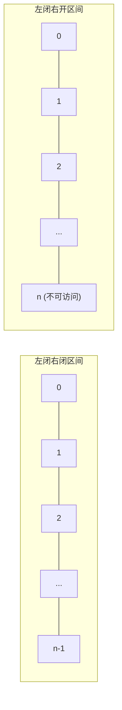

### 1.3 二分查找变形

#### 1.3.1 查找第一个等于目标值的位置

```java
/**
 * 查找第一个等于目标值的位置
 * @return 找到返回索引，否则返回 -1
 */
public int findFirstEqual(int[] arr, int target) {
    int left = 0;
    int right = arr.length - 1;
    int result = -1;

    while (left <= right) {
        int mid = left + ((right - left) >> 1);
        if (arr[mid] == target) {
            result = mid;       // 记录位置，继续向左查找
            right = mid - 1;
        } else if (arr[mid] > target) {
            right = mid - 1;
        } else {
            left = mid + 1;
        }
    }
    return result;
}
```

**示例**：arr = [1, 2, 2, 2, 3, 4]，target = 2 → 返回 1

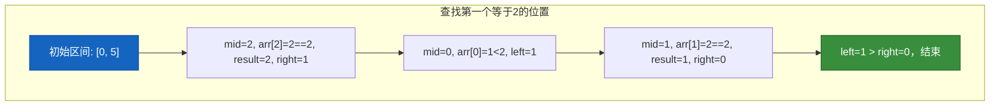

#### 1.3.2 查找最后一个等于目标值的位置

```java
/**
 * 查找最后一个等于目标值的位置
 */
public int findLastEqual(int[] arr, int target) {
    int left = 0;
    int right = arr.length - 1;
    int result = -1;

    while (left <= right) {
        int mid = left + ((right - left) >> 1);
        if (arr[mid] == target) {
            result = mid;       // 记录位置，继续向右查找
            left = mid + 1;
        } else if (arr[mid] > target) {
            right = mid - 1;
        } else {
            left = mid + 1;
        }
    }
    return result;
}
```

**示例**：arr = [1, 2, 2, 2, 3, 4]，target = 2 → 返回 3

#### 1.3.3 查找第一个大于等于目标值的位置

```java
/**
 * 查找第一个 >= target 的位置
 */
public int findFirstGreaterOrEqual(int[] arr, int target) {
    int left = 0;
    int right = arr.length - 1;
    int result = -1;

    while (left <= right) {
        int mid = left + ((right - left) >> 1);
        if (arr[mid] >= target) {
            result = mid;       // 记录位置，继续向左查找
            right = mid - 1;
        } else {
            left = mid + 1;
        }
    }
    return result;
}
```

**示例**：arr = [1, 2, 2, 2, 3, 4]，target = 2 → 返回 1

#### 1.3.4 查找最后一个小于等于目标值的位置

```java
/**
 * 查找最后一个 <= target 的位置
 */
public int findLastLessOrEqual(int[] arr, int target) {
    int left = 0;
    int right = arr.length - 1;
    int result = -1;

    while (left <= right) {
        int mid = left + ((right - left) >> 1);
        if (arr[mid] <= target) {
            result = mid;       // 记录位置，继续向右查找
            left = mid + 1;
        } else {
            right = mid - 1;
        }
    }
    return result;
}
```

**示例**：arr = [1, 2, 2, 2, 3, 4]，target = 2 → 返回 3

### 1.4 二分答案技巧

二分答案是一种"反向思考"的算法技巧。当我们难以直接解决问题时，但可以**验证某个答案是否可行**，且答案具有**单调性**（如果答案可行，那么更大的答案也可能可行），就可以使用二分答案。

**典型应用场景**：
- 最大化最小值、最小化最大值
- 查找满足条件的边界值
- 优化问题（如最小化最大值）

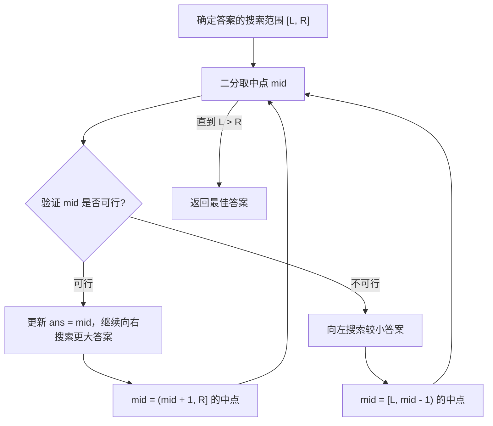

**LeetCode 典型题目**：

- [LeetCode 875 - 爱吃香蕉的珂珂](https://leetcode.cn/problems/koko-eating-bananas/)
- [LeetCode 410 - 分割数组的最大值](https://leetcode.cn/problems/split-array-largest-sum/)
- [LeetCode 1011 - 在 D 天内送达包裹的能力](https://leetcode.cn/problems/capacity-to-ship-packages-within-d-days/)

```java
/**
 * LeetCode 875: 爱吃香蕉的珂珂
 * 珂珂每小时最多吃一根香蕉，问速度为多少时能在 H 小时内吃完所有香蕉？
 */
public int minEatingSpeed(int[] piles, int H) {
    int left = 1;
    int right = Arrays.stream(piles).max().getAsInt();
    int ans = right;

    while (left <= right) {
        int mid = left + ((right - left) >> 1);
        if (canFinish(piles, H, mid)) {
            ans = mid;           // mid 可行，尝试更小速度
            right = mid - 1;
        } else {
            left = mid + 1;     // mid 不可行，需要更快速度
        }
    }
    return ans;
}

private boolean canFinish(int[] piles, int H, int speed) {
    int hours = 0;
    for (int pile : piles) {
        hours += (pile + speed - 1) / speed;  // 向上取整
    }
    return hours <= H;
}
```

### 1.5 工程应用：LeetCode 典型题目

| 题目 | 难度 | 描述 |
|------|------|------|
| [704. 二分查找](https://leetcode.cn/problems/binary-search/) | 简单 | 基础二分查找 |
| [34. 在排序数组中查找元素的第一个和最后一个位置](https://leetcode.cn/problems/find-first-and-last-position-of-element-in-sorted-array/) | 中等 | 二分查找变形 |
| [33. 搜索旋转排序数组](https://leetcode.cn/problems/search-in-rotated-sorted-array/) | 中等 | 变种二分 |
| [4. 寻找两个正序数组的中位数](https://leetcode.cn/problems/median-of-two-sorted-arrays/) | 困难 | 二分查找扩展 |

---

## 二、递归

### 2.1 递归的本质

**递归的本质是函数调用栈**。每一次函数调用都会在栈上创建一个新的栈帧（Stack Frame），保存函数的参数、局部变量和返回地址。当函数执行完成后，栈帧被弹出，控制权返回到调用者。

```mermaid
flowchart TD
    subgraph "调用栈变化过程"
        A1["main() 调用 factorial(4)"] --> A2["factorial(4) 调用 factorial(3)"]
        A2 --> A3["factorial(3) 调用 factorial(2)"]
        A3 --> A4["factorial(2) 调用 factorial(1)"]
        A4 --> A5["factorial(1) 返回 1"]
        A5 --> A6["factorial(2) 返回 2"]
        A6 --> A7["factorial(3) 返回 6"]
        A7 --> A8["factorial(4) 返回 24"]
        A8 --> A9["main() 得到结果 24"]
    end

    style A1 fill:#1565c0,stroke:#0d47a1,color:#ffffff
    style A5 fill:#388e3c,stroke:#1b5e20,color:#ffffff
    style A9 fill:#388e3c,stroke:#1b5e20,color:#ffffff
```

**递归调用示例**：计算阶乘 n!

```java
public int factorial(int n) {
    if (n <= 1) {               // 终止条件
        return 1;
    }
    return n * factorial(n - 1); // 递归调用
}
```

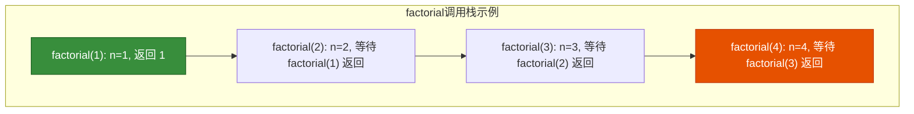

### 2.2 递归三要素

编写递归程序时，必须明确以下三个要素：

#### 要素一：定义（Function Definition）

**明确递归函数的功能**——这个函数要做什么。

```java
// 定义：计算数组 arr 在区间 [left, right] 的和
public int sum(int[] arr, int left, int right) {
    // ...
}
```

#### 要素二：拆解（Recursion Breakdown）

**将大问题拆解为小问题**——如何将问题规模缩小。

```java
public int sum(int[] arr, int left, int right) {
    // 拆解：sum(arr, left, right) = arr[mid] + sum(arr, left, mid-1) + sum(arr, mid+1, right)
    int mid = left + ((right - left) >> 1);
    return arr[mid] + sum(arr, left, mid - 1) + sum(arr, mid + 1, right);
}
```

#### 要素三：终止条件（Base Case）

**递归必须何时停止**——防止无限递归。

```java
public int sum(int[] arr, int left, int right) {
    if (left > right) {         // 终止条件：区间为空
        return 0;
    }
    if (left == right) {        // 终止条件：区间只有一个元素
        return arr[left];
    }
    // ...
}
```

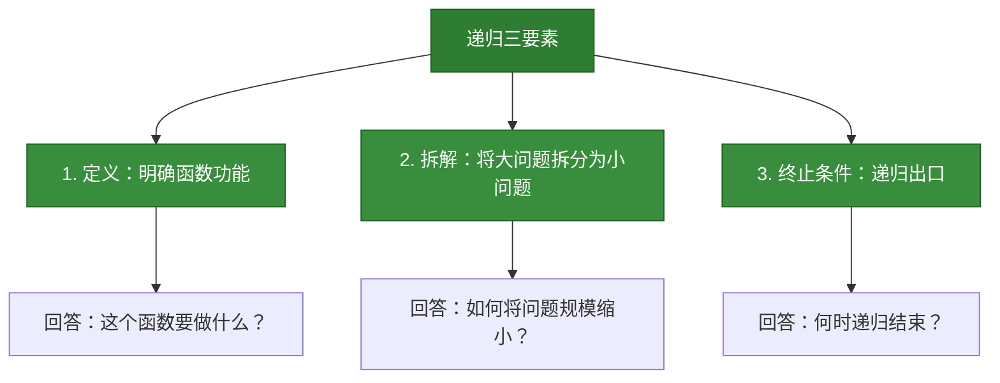

### 2.3 递归与迭代的转换

递归和迭代可以相互转换。递归是从**问题的结果向问题的起点**推导（分析法），而迭代是从**问题的起点向问题的结果**推导（直接法）。

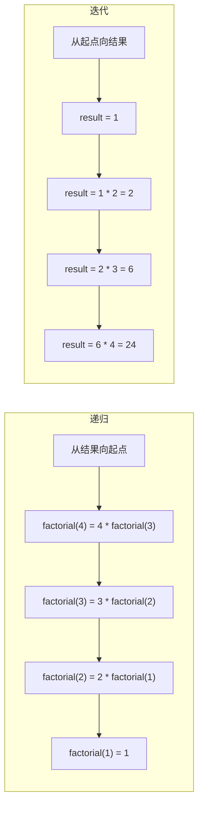

#### 递归转迭代

```java
// 递归版本
public int factorialRecursive(int n) {
    if (n <= 1) return 1;
    return n * factorialRecursive(n - 1);
}

// 迭代版本（使用显式栈模拟递归）
public int factorialIterative(int n) {
    int result = 1;
    for (int i = 2; i <= n; i++) {
        result *= i;
    }
    return result;
}
```

#### 迭代转递归

```java
// 迭代版本：计算数组和
public int sumIterative(int[] arr) {
    int sum = 0;
    for (int num : arr) {
        sum += num;
    }
    return sum;
}

// 递归版本
public int sumRecursive(int[] arr, int index) {
    if (index >= arr.length) {
        return 0;
    }
    return arr[index] + sumRecursive(arr, index + 1);
}
```

### 2.4 递归的复杂度分析

#### 时间复杂度分析

递归的时间复杂度可以通过**递归树**来分析。

**示例**：计算斐波那契数列 F(n) = F(n-1) + F(n-2)

```java
public int fibonacci(int n) {
    if (n <= 1) return n;
    return fibonacci(n - 1) + fibonacci(n - 2);
}
```

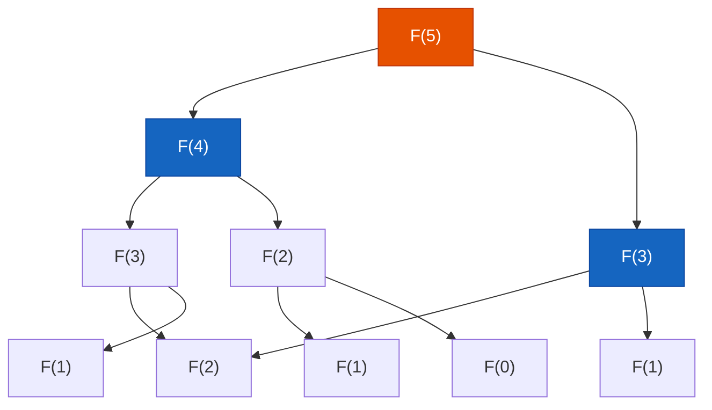

**复杂度分析**：
- 递归树深度为 n
- 每层节点数呈指数增长（近似为 2^n）
- 时间复杂度：**O(2^n)**

#### 空间复杂度分析

递归的空间复杂度 = **递归深度 × 每层递归使用的辅助空间**

```java
public int fibonacci(int n) {
    if (n <= 1) return n;
    return fibonacci(n - 1) + fibonacci(n - 2);
}
```

此递归的调用深度为 n，但每层递归只使用了常数级别的空间，所以空间复杂度为 **O(n)**。

### 2.5 尾递归优化

**尾递归**是指递归调用是函数的最后一个操作（即 return 语句中只有递归调用，没有其他运算）。

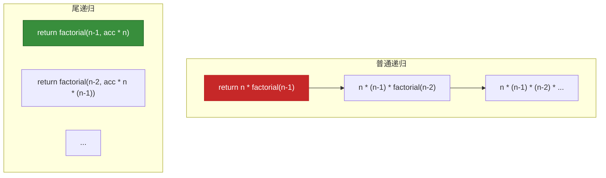

#### 普通递归 vs 尾递归

```java
// 普通递归：计算 n!
public int factorialNormal(int n) {
    if (n <= 1) return 1;
    return n * factorialNormal(n - 1);  // 最后一步是乘法，不是递归调用
}

// 尾递归：使用累加器
public int factorialTail(int n) {
    return factorialTailHelper(n, 1);
}

private int factorialTailHelper(int n, int acc) {
    if (n <= 1) return acc;
    return factorialTailHelper(n - 1, acc * n);  // 最后一个操作是递归调用
}
```

**注意**：JVM 不支持尾递归优化，但 Scala、Kotlin 等语言支持。Java 可以通过将尾递归转换为迭代来避免栈溢出。

### 2.6 工程应用

#### 2.6.1 文件系统遍历

```java
/**
 * 递归遍历目录结构
 */
public class FileTraversal {

    /**
     * 打印目录树
     */
    public void printDirectoryTree(File dir, String prefix) {
        File[] files = dir.listFiles();
        if (files == null) return;

        for (int i = 0; i < files.length; i++) {
            File file = files[i];
            boolean isLast = (i == files.length - 1);

            System.out.println(prefix + (isLast ? "└── " : "├── ") + file.getName());

            if (file.isDirectory()) {
                String newPrefix = prefix + (isLast ? "    " : "│   ");
                printDirectoryTree(file, newPrefix);  // 递归遍历子目录
            }
        }
    }

    /**
     * 统计文件数量
     */
    public int countFiles(File dir) {
        File[] files = dir.listFiles();
        if (files == null) return 0;

        int count = 0;
        for (File file : files) {
            if (file.isDirectory()) {
                count += countFiles(file);  // 递归
            } else {
                count++;
            }
        }
        return count;
    }
}
```

#### 2.6.2 UI 组件树遍历

```java
/**
 * UI 组件树遍历（类似 Android View 树或 Web DOM 树）
 */
public class ComponentTree {

    static class Component {
        String name;
        List<Component> children = new ArrayList<>();

        Component(String name) {
            this.name = name;
        }

        void addChild(Component child) {
            children.add(child);
        }
    }

    /**
     * 递归查找组件
     */
    public Component findComponent(Component parent, String targetId) {
        if (parent.name.equals(targetId)) {
            return parent;
        }
        for (Component child : parent.children) {
            Component found = findComponent(child, targetId);  // 递归
            if (found != null) {
                return found;
            }
        }
        return null;
    }

    /**
     * 递归统计组件数量
     */
    public int countComponents(Component parent) {
        int count = 1;  // 当前组件
        for (Component child : parent.children) {
            count += countComponents(child);  // 递归统计子组件
        }
        return count;
    }
}
```

#### 2.6.3 Java Stream API 中的递归

Java Stream 的 `reduce` 操作在内部使用类似递归的方式处理数据。

```java
/**
 * 使用 Stream 实现递归求和
 */
public class StreamRecursiveSum {

    // 递归计算列表所有元素的和
    public int sum(List<Integer> numbers) {
        return numbers.stream()
                .reduce(0, Integer::sum);  // 累加操作，类似于递归求和
    }

    // 递归 flatten（展开嵌套列表）
    public List<Integer> flatten(List<List<Integer>> nested) {
        return nested.stream()
                .flatMap(List::stream)  // flatMap 内部使用类似递归的方式展开
                .collect(Collectors.toList());
    }

    // 使用递归生成树形结构的 Stream
    public Stream<String> generateTreeNodes(Node root) {
        return Stream.concat(
            Stream.of(root.value),  // 当前节点
            Stream.of(root.children)
                  .flatMap(this::generateTreeNodes)  // 递归处理子节点
        );
    }
}
```

### 2.7 递归与迭代对比

| 维度 | 递归 | 迭代 |
|------|------|------|
| **代码简洁性** | 代码简洁直观 | 代码相对复杂 |
| **空间复杂度** | O(n)（调用栈） | O(1)（常量） |
| **时间复杂度** | O(n)（简单递归） | O(n) |
| **栈溢出风险** | 有（深度过大时） | 无 |
| **适用场景** | 树/图结构、分治 | 线性问题、循环操作 |

---

## 三、分治策略

### 3.1 分治模板

**分治（Divide and Conquer）** 是一种高效的算法设计策略。其核心思想是将原问题分解为若干个规模较小的相同子问题，递归解决子问题，然后合并子问题的解得到原问题的解。

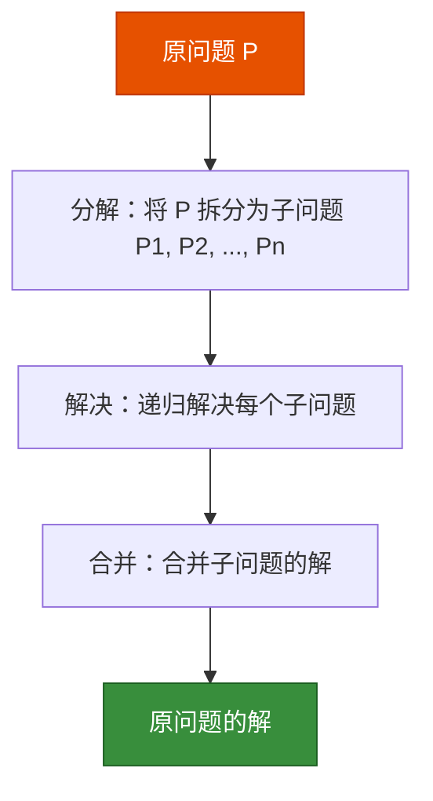

**分治算法模板**：

```java
/**
 * 分治算法模板
 */
public class DivideAndConquer {

    /**
     * 分治主方法
     * @param problem 原问题
     * @return 问题的解
     */
    public Result divideAndConquer(Problem problem) {
        // 1. 分解：将问题拆分为子问题
        if (isBaseCase(problem)) {
            return solveBaseCase(problem);  // 终止条件：解决最小子问题
        }

        Problem[] subProblems = split(problem);

        // 2. 解决：递归解决子问题
        Result[] subResults = new Result[subProblems.length];
        for (int i = 0; i < subProblems.length; i++) {
            subResults[i] = divideAndConquer(subProblems[i]);
        }

        // 3. 合并：合并子问题的解
        return merge(subResults);
    }

    // 判断是否为基本问题
    private boolean isBaseCase(Problem problem) {
        return problem.size() <= 1;
    }

    // 拆分问题
    private Problem[] split(Problem problem) {
        // 将问题拆分为两个或多个子问题
        return new Problem[]{problem.leftHalf(), problem.rightHalf()};
    }

    // 解决基本问题
    private Result solveBaseCase(Problem problem) {
        return new Result(problem.solve());
    }

    // 合并结果
    private Result merge(Result[] subResults) {
        // 将多个子问题的解合并为原问题的解
        Result result = subResults[0];
        for (int i = 1; i < subResults.length; i++) {
            result = result.combine(subResults[i]);
        }
        return result;
    }
}
```

### 3.2 分治复杂度分析（主定理）

对于分治算法，其时间复杂度通常可以用**主定理（Master Theorem）**来分析。

**主定理**：

设递归关系为 `T(n) = a * T(n/b) + f(n)`，其中：
- a：子问题数量
- b：子问题规模缩减比例
- f(n)：分解和合并的代价

则时间复杂度有三种情况：

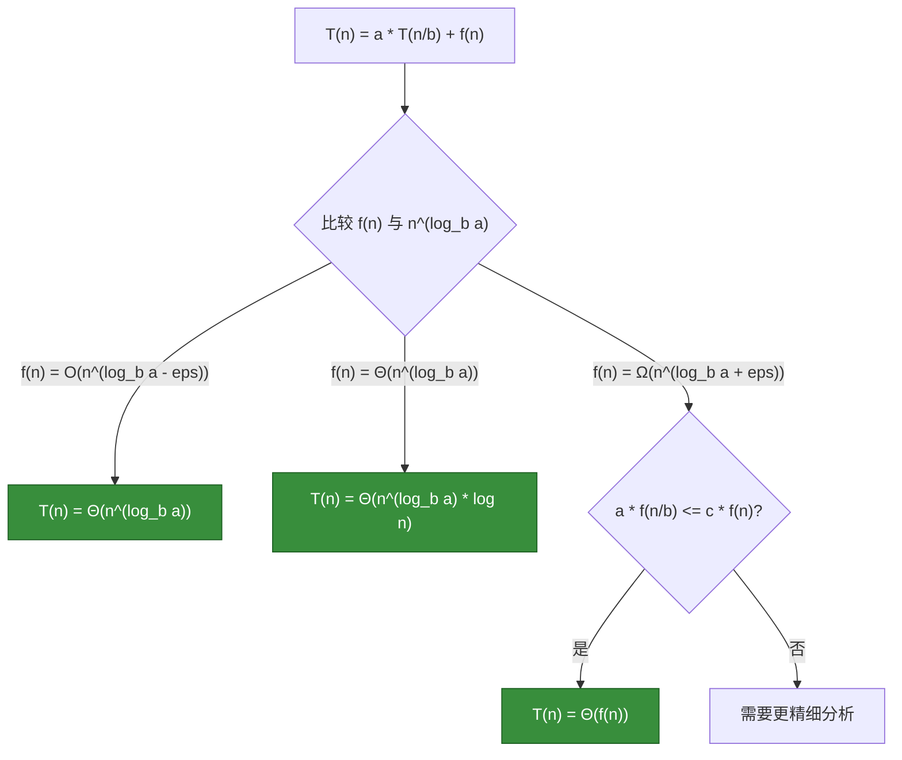

| 情况 | 条件 | 时间复杂度 |
|------|------|------------|
| 情况1 | f(n) = O(n<sup>log<sub>b</sub>a - ε</sup>) | T(n) = Θ(n<sup>log<sub>b</sub>a</sup>) |
| 情况2 | f(n) = Θ(n<sup>log<sub>b</sub>a</sup>) | T(n) = Θ(n<sup>log<sub>b</sub>a</sup> * log n) |
| 情况3 | f(n) = Ω(n<sup>log<sub>b</sub>a + ε</sup>) 且满足正则条件 | T(n) = Θ(f(n)) |

### 3.3 经典分治问题

#### 3.3.1 大整数乘法

将大整数拆分为高低两部分，使用分治策略减少乘法次数。

```java
/**
 * 大整数乘法（分治策略）
 * 计算 X * Y，其中 X 和 Y 都是 n 位整数
 */
public class BigIntegerMultiply {

    /**
     * 简化版本：两个 2 位数的乘法
     * X = a * 10 + b
     * Y = c * 10 + d
     * X * Y = ac * 100 + (ad + bc) * 10 + bd
     */
    public long multiply(int x, int y) {
        // 转为字符串处理大整数
        String s1 = String.valueOf(x);
        String s2 = String.valueOf(y);
        return multiply(s1, s2);
    }

    public long multiply(String num1, String num2) {
        int n1 = num1.length();
        int n2 = num2.length();

        // 基本情况：一位数乘法
        if (n1 == 1 && n2 == 1) {
            return (num1.charAt(0) - '0') * (num2.charAt(0) - '0');
        }

        // 分解：拆分为高低两部分
        int n = Math.max(n1, n2);
        int half = n / 2;

        // 拆分 num1
        String a = n1 > half ? num1.substring(0, n1 - half) : "0";
        String b = n1 > half ? num1.substring(n1 - half) : num1;

        // 拆分 num2
        String c = n2 > half ? num2.substring(0, n2 - half) : "0";
        String d = n2 > half ? num2.substring(n2 - half) : num2;

        // 递归计算子问题
        long ac = multiply(a, c);
        long bd = multiply(b, d);
        long ad = multiply(a, d);
        long bc = multiply(b, c);

        // 合并结果：ac * 10^(2*half) + (ad + bc) * 10^half + bd
        return ac * (long) Math.pow(10, 2 * half)
             + (ad + bc) * (long) Math.pow(10, half)
             + bd;
    }
}
```

#### 3.3.2 矩阵乘法（Strassen 算法）

传统矩阵乘法需要 O(n³) 时间，Strassen 算法将复杂度降低到 O(n^log₂⁷) ≈ O(n^2.81)。

```java
/**
 * 矩阵乘法（分治策略 - 简化的 2x2 矩阵）
 * | a  b |   | e  f |   | ae+bg  af+bh |
 * | c  d | × | g  h | = | ce+dg  cf+dh |
 */
public class MatrixMultiply {

    /**
     * 分治矩阵乘法
     */
    public int[][] multiply(int[][] A, int[][] B) {
        int n = A.length;
        int[][] C = new int[n][n];

        if (n == 1) {
            C[0][0] = A[0][0] * B[0][0];
            return C;
        }

        // 分解：将矩阵分为 4 个子矩阵
        int half = n / 2;
        int[][] a = new int[half][half];
        int[][] b = new int[half][half];
        int[][] c = new int[half][half];
        int[][] d = new int[half][half];
        int[][] e = new int[half][half];
        int[][] f = new int[half][half];
        int[][] g = new int[half][half];
        int[][] h = new int[half][half];

        splitMatrix(A, a, b, c, d);
        splitMatrix(B, e, f, g, h);

        // 递归计算 7 个乘积（Strassen 优化）
        int[][] p1 = multiply(a, subtract(f, h));
        int[][] p2 = multiply(add(a, b), h);
        int[][] p3 = multiply(add(c, d), e);
        int[][] p4 = multiply(d, subtract(g, e));
        int[][] p5 = multiply(add(a, d), add(e, h));
        int[][] p6 = multiply(subtract(b, d), add(g, h));
        int[][] p7 = multiply(subtract(a, c), add(e, f));

        // 合并结果
        int[][] c11 = add(add(p5, p4), subtract(p6, p2));
        int[][] c12 = add(p1, p2);
        int[][] c21 = add(p3, p4);
        int[][] c22 = add(add(p1, p5), subtract(p3, p7));

        mergeMatrix(C, c11, c12, c21, c22);

        return C;
    }

    // 辅助方法：矩阵分割
    private void splitMatrix(int[][] src, int[][] a, int[][] b,
                            int[][] c, int[][] d) {
        int n = src.length / 2;
        for (int i = 0; i < n; i++) {
            for (int j = 0; j < n; j++) {
                a[i][j] = src[i][j];
                b[i][j] = src[i][j + n];
                c[i][j] = src[i + n][j];
                d[i][j] = src[i + n][j + n];
            }
        }
    }

    // 辅助方法：矩阵合并
    private void mergeMatrix(int[][] dest, int[][] c11, int[][] c12,
                            int[][] c21, int[][] c22) {
        int n = c11.length;
        for (int i = 0; i < n; i++) {
            for (int j = 0; j < n; j++) {
                dest[i][j] = c11[i][j];
                dest[i][j + n] = c12[i][j];
                dest[i + n][j] = c21[i][j];
                dest[i + n][j + n] = c22[i][j];
            }
        }
    }

    // 辅助方法：矩阵加法
    private int[][] add(int[][] A, int[][] B) {
        int n = A.length;
        int[][] C = new int[n][n];
        for (int i = 0; i < n; i++) {
            for (int j = 0; j < n; j++) {
                C[i][j] = A[i][j] + B[i][j];
            }
        }
        return C;
    }

    // 辅助方法：矩阵减法
    private int[][] subtract(int[][] A, int[][] B) {
        int n = A.length;
        int[][] C = new int[n][n];
        for (int i = 0; i < n; i++) {
            for (int j = 0; j < n; j++) {
                C[i][j] = A[i][j] - B[i][j];
            }
        }
        return C;
    }
}
```

#### 3.3.3 煎饼排序

煎饼排序（Pancake Sort）是一种使用分治策略的排序算法，通过"翻转"操作对数组排序。

```java
/**
 * 煎饼排序
 * 每次找到当前最大的元素，通过两次翻转将其放到正确位置
 */
public class PancakeSort {

    /**
     * 煎饼排序
     */
    public void pancakeSort(int[] arr) {
        int n = arr.length;
        for (int size = n; size > 1; size--) {
            // 1. 找到当前区间 [0, size) 中最大元素的位置
            int maxIdx = findMaxIndex(arr, size);

            // 2. 如果最大元素不在位置 size-1，进行翻转
            if (maxIdx != size - 1) {
                // 第一次翻转：将最大元素翻到区间开头
                flip(arr, maxIdx + 1);
                // 第二次翻转：将最大元素翻到位置 size-1
                flip(arr, size);
            }
        }
    }

    /**
     * 翻转数组 arr[0...k-1]
     */
    private void flip(int[] arr, int k) {
        int i = 0, j = k - 1;
        while (i < j) {
            int temp = arr[i];
            arr[i] = arr[j];
            arr[j] = temp;
            i++;
            j--;
        }
    }

    /**
     * 找到区间 [0, n) 中最大元素的索引
     */
    private int findMaxIndex(int[] arr, int n) {
        int maxIdx = 0;
        for (int i = 1; i < n; i++) {
            if (arr[i] > arr[maxIdx]) {
                maxIdx = i;
            }
        }
        return maxIdx;
    }
}
```

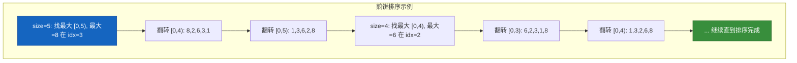

---

## 四、总结

### 核心要点

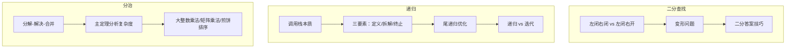

| 主题 | 关键点 | 时间复杂度 |
|------|--------|------------|
| 二分查找 | 有序数组、折半查找、多种变形 | O(log n) |
| 递归 | 调用栈、三要素、复杂度分析 | O(n) ~ O(2^n) |
| 分治 | 分解子问题、合并解、主定理 | O(n log n) ~ O(n^2.81) |

### 面试高频考点

1. **二分查找**：边界条件处理、循环不变式、多种变形
2. **递归**：画出递归树、分析时间和空间复杂度
3. **分治**：归并排序、快速排序、Top-K 问题
