# 动态规划（Dynamic Programming）

## 概述

动态规划（Dynamic Programming，简称DP）是一种重要的算法设计技术，用于解决具有**最优子结构**和**重叠子问题**特性的复杂问题。动态规划的核心思想是将原问题分解为更小的子问题，通过求解子问题并保存结果，避免重复计算，从而大幅提升算法效率。

本章将系统讲解动态规划的理论基础、经典问题分析、优化技巧以及工程应用。

---

## 1. 动态规划基础

### 1.1 动态规划定义

**动态规划**是一种通过把原问题分解为相互重叠的子问题，对每个子问题只求解一次并将结果保存到表格中，从而高效求解原问题的算法策略。

**核心特征**：
- **最优子结构**：一个问题的最优解可以由其子问题的最优解组合构成
- **重叠子问题**：在递归过程中，相同的子问题会被多次求解
- **无后效性**：某阶段的状态一旦确定，后续阶段的决策不受之前状态影响

**时间复杂度优势**：
- 普通递归：指数级 $O(2^n)$
- 记忆化递归：$O(n)$ - $O(n^2)$
- 动态规划：$O(n)$ - $O(n^2)$

### 1.2 DP vs 分治 vs 贪心

| 特性 | 动态规划 | 分治法 | 贪心算法 |
|------|----------|--------|----------|
| **子问题关系** | 子问题可能重叠 | 子问题互不相交 | 子问题互不相交 |
| **最优子结构** | 必须满足 | 必须满足 | 必须满足 |
| **子问题求解顺序** | 自底向上（通常） | 自顶向下 | 自顶向下 |
| **局部最优** | 不一定 | 不一定 | 保证全局最优 |
| **回溯** | 通常不需要 | 不需要 | 不需要 |
| **典型问题** | 最优子序列、背包 | 归并排序、快速排序 | 活动选择、哈夫曼编码 |

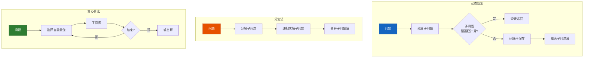

### 1.3 DP解题四要素

解决动态规划问题的四个核心要素：

| 要素 | 含义 | 关键问题 |
|------|------|----------|
| **状态（State）** | 描述问题在某个阶段的样子 | 什么变量可以唯一确定当前局面？ |
| **转移（Transition）** | 如何从子问题到当前问题 | dp[i] 和 dp[i-1], dp[i-2]...的关系？ |
| **初始化（Initialization）** | 最小子问题的解 | 边界条件是什么？ |
| **结果（Result）** | 最终要求的答案 | 如何从dp表中获取答案？ |

**四要素分析流程**：

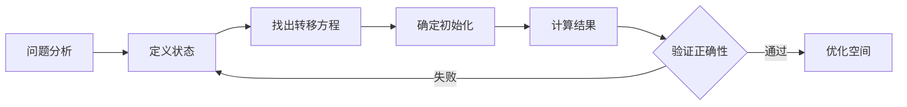

### 1.4 DP表（dp数组）设计

#### 1.4.1 一维DP

适用于线性递推关系，如斐波那契数列、爬楼梯等。

```
dp[i] = 从起始状态到达第i个位置的解
```

#### 1.4.2 二维DP

适用于需要考虑两组决策因素的问题，如背包问题、LCS等。

```
dp[i][j] = 考虑前i个物品，容量为j时的最优解
```

#### 1.4.3 状态压缩DP

当dp[i]只与dp[i-1]和dp[i-2]等相关时，可以用滚动数组将空间降为O(1)或O(k)。

---

## 2. 经典DP问题

### 2.1 斐波那契数列

#### 问题描述

求解斐波那契数列第n项，定义：
- F(0) = 0
- F(1) = 1
- F(n) = F(n-1) + F(n-2)（n >= 2）

#### DP分析

**四要素**：
| 要素 | 内容 |
|------|------|
| **状态** | dp[i] = 第i个斐波那契数 |
| **转移** | dp[i] = dp[i-1] + dp[i-2] |
| **初始化** | dp[0] = 0, dp[1] = 1 |
| **结果** | dp[n] |

**递归树（n=5）**：

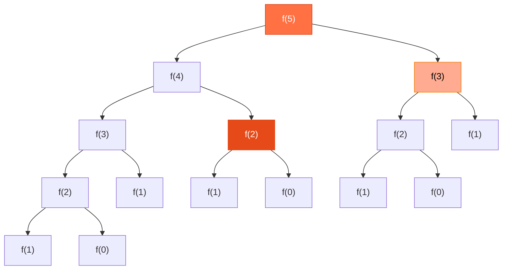

**普通递归重复计算**：f(3)计算了3次，f(2)计算了5次

#### 代码实现

```java
// ============ 普通递归（指数级） ============
public int fibRecursive(int n) {
    if (n <= 1) return n;
    return fibRecursive(n - 1) + fibRecursive(n - 2);
}

// ============ 记忆化递归（自顶向下） ============
public int fibMemo(int n, int[] memo) {
    if (n <= 1) return n;
    if (memo[n] != 0) return memo[n];
    memo[n] = fibMemo(n - 1, memo) + fibMemo(n - 2, memo);
    return memo[n];
}

// ============ 动态规划（自底向上） ============
public int fibDP(int n) {
    if (n <= 1) return n;
    int[] dp = new int[n + 1];
    dp[0] = 0;
    dp[1] = 1;
    for (int i = 2; i <= n; i++) {
        dp[i] = dp[i - 1] + dp[i - 2];
    }
    return dp[n];
}

// ============ 空间优化（滚动数组） ============
public int fibOptimized(int n) {
    if (n <= 1) return n;
    int prev2 = 0, prev1 = 1, curr = 0;
    for (int i = 2; i <= n; i++) {
        curr = prev1 + prev2;
        prev2 = prev1;
        prev1 = curr;
    }
    return curr;
}
```

**复杂度对比**：

| 方法 | 时间复杂度 | 空间复杂度 |
|------|-----------|-----------|
| 普通递归 | $O(2^n)$ | $O(n)$ |
| 记忆化递归 | $O(n)$ | $O(n)$ |
| DP | $O(n)$ | $O(n)$ |
| 空间优化 | $O(n)$ | $O(1)$ |

### 2.2 爬楼梯问题

#### 问题描述

假设你正在爬楼梯，需要n阶才能到达楼顶。每次你可以爬1阶或2阶，有多少种不同的方法可以爬到楼顶？

**示例**：
- n = 2：2种方法（1+1, 2）
- n = 3：3种方法（1+1+1, 1+2, 2+1）
- n = 4：5种方法（1+1+1+1, 1+1+2, 1+2+1, 2+1+1, 2+2）

#### DP分析

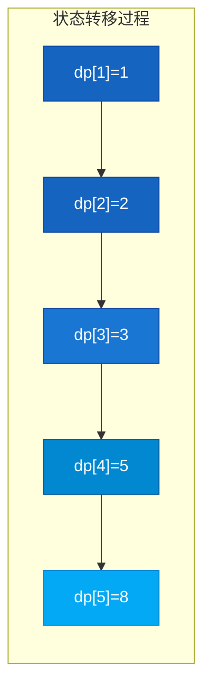

**状态转移表**：

| 阶数n | 到达方式 | dp[n] |
|-------|----------|-------|
| 1 | 1 | 1 |
| 2 | 1+1, 2 | 2 |
| 3 | 1+1+1, 1+2, 2+1 | 3 |
| 4 | 1+1+1+1, 1+1+2, 1+2+1, 2+1+1, 2+2 | 5 |
| 5 | ... | 8 |

#### 代码实现

```java
// ============ 一维DP ============
public int climbStairs(int n) {
    if (n <= 2) return n;
    int[] dp = new int[n + 1];
    dp[1] = 1;
    dp[2] = 2;
    for (int i = 3; i <= n; i++) {
        dp[i] = dp[i - 1] + dp[i - 2];
    }
    return dp[n];
}

// ============ 空间优化 ============
public int climbStairsOptimized(int n) {
    if (n <= 2) return n;
    int prev2 = 1, prev1 = 2, curr = 0;
    for (int i = 3; i <= n; i++) {
        curr = prev1 + prev2;
        prev2 = prev1;
        prev1 = curr;
    }
    return curr;
}

// ============ 变体：可爬1/2/3阶 ============
public int climbStairsV2(int n) {
    if (n <= 2) return n;
    if (n == 3) return 4;
    int[] dp = new int[n + 1];
    dp[1] = 1;
    dp[2] = 2;
    dp[3] = 4;
    for (int i = 4; i <= n; i++) {
        dp[i] = dp[i - 1] + dp[i - 2] + dp[i - 3];
    }
    return dp[n];
}
```

### 2.3 0-1背包问题

#### 问题描述

给定n个物品，每个物品有重量w[i]和价值v[i]，以及一个容量为W的背包。要求选择物品放入背包，使得物品总重量不超过背包容量，且总价值最大。

**注意**：每个物品只能选择一次（0或1）。

#### DP分析

**四要素**：

| 要素 | 内容 |
|------|------|
| **状态** | dp[i][j] = 考虑前i个物品，背包容量为j时的最大价值 |
| **转移** | dp[i][j] = max(dp[i-1][j], dp[i-1][j-w[i]] + v[i]) |
| **初始化** | dp[0][j] = 0, dp[i][0] = 0 |
| **结果** | dp[n][W] |

**状态转移表（物品：[w,v]=[2,3],[3,4],[4,5]，背包容量W=5）**：

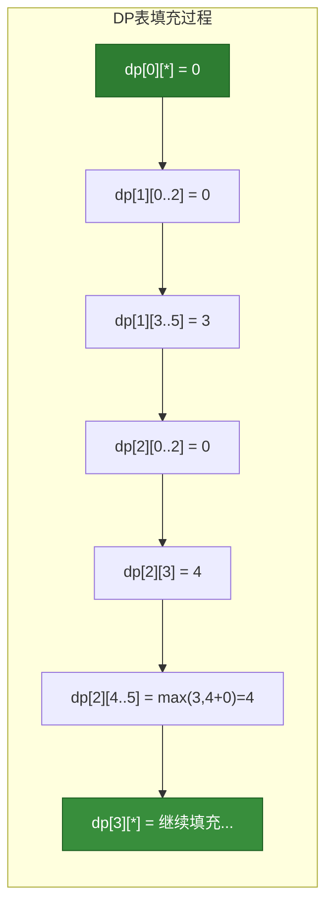

**二维DP表可视化**：

```
物品\容量   0    1    2    3    4    5
   0        0    0    0    0    0    0
   1[w=2,v=3] 0    0    3    3    3    3
   2[w=3,v=4] 0    0    3    4    4    7
   3[w=4,v=5] 0    0    3    4    5    7
```

#### 代码实现

```java
// ============ 二维DP（标准解法） ============
public int knapsack01(int[] weights, int[] values, int W) {
    int n = weights.length;
    int[][] dp = new int[n + 1][W + 1];

    for (int i = 1; i <= n; i++) {
        for (int j = 0; j <= W; j++) {
            // 不选第i个物品
            dp[i][j] = dp[i - 1][j];
            // 选第i个物品（如果能装下）
            if (j >= weights[i - 1]) {
                dp[i][j] = Math.max(dp[i][j],
                    dp[i - 1][j - weights[i - 1]] + values[i - 1]);
            }
        }
    }
    return dp[n][W];
}

// ============ 一维DP（空间优化） ============
public int knapsack01Optimized(int[] weights, int[] values, int W) {
    int[] dp = new int[W + 1];

    for (int i = 0; i < weights.length; i++) {
        // 逆序遍历，保证每个物品只被使用一次
        for (int j = W; j >= weights[i]; j--) {
            dp[j] = Math.max(dp[j], dp[j - weights[i]] + values[i]);
        }
    }
    return dp[W];
}

// ============ 空间优化图解 ============
/*
   为什么需要逆序遍历？

   正序遍历（错误）：
   dp[3] = max(dp[3], dp[3-w]+v) -> dp[3]依赖本轮新计算的dp[2]
   会导致同一物品被重复选取

   逆序遍历（正确）：
   dp[3] = max(dp[3], dp[3-w]+v) -> dp[3]依赖上一轮的dp[2]
   每个物品只被使用一次
*/
```

**空间优化对比**：

| 方法 | 空间复杂度 | 适用场景 |
|------|-----------|----------|
| 二维DP | $O(n \times W)$ | 理解原理、调试 |
| 一维DP（逆序） | $O(W)$ | 生产环境 |

### 2.4 完全背包问题

#### 问题描述

与0-1背包类似，但每种物品可以选择无限次。

#### DP分析

**状态转移对比**：

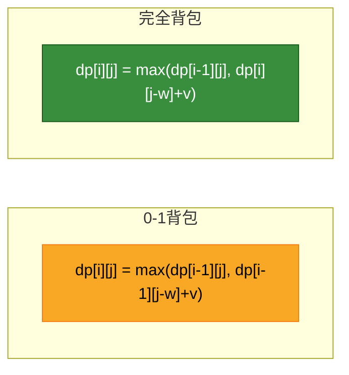

**核心区别**：完全背包使用dp[i][j-w]而非dp[i-1][j-w]

| 背包类型 | 转移方程 | 遍历顺序 |
|----------|----------|----------|
| 0-1背包 | dp[i][j] = max(dp[i-1][j], dp[i-1][j-w]+v) | 逆序 |
| 完全背包 | dp[i][j] = max(dp[i-1][j], dp[i][j-w]+v) | 正序 |

#### 代码实现

```java
// ============ 完全背包（一维DP） ============
public int knapsackComplete(int[] weights, int[] values, int W) {
    int[] dp = new int[W + 1];

    for (int i = 0; i < weights.length; i++) {
        // 正序遍历，可以重复选择同一物品
        for (int j = weights[i]; j <= W; j++) {
            dp[j] = Math.max(dp[j], dp[j - weights[i]] + values[i]);
        }
    }
    return dp[W];
}

// ============ 组合问题：硬币找零 ============
public int coinChange(int[] coins, int amount) {
    int[] dp = new int[amount + 1];
    Arrays.fill(dp, amount + 1);
    dp[0] = 0;

    for (int coin : coins) {
        for (int j = coin; j <= amount; j++) {
            dp[j] = Math.min(dp[j], dp[j - coin] + 1);
        }
    }
    return dp[amount] > amount ? -1 : dp[amount];
}
```

### 2.5 多重背包问题

#### 问题描述

每种物品有有限数量k件，其他条件同0-1背包。

#### 代码实现

```java
// ============ 多重背包（展开成0-1背包） ============
public int knapsackMultiple(int[] weights, int[] values, int[] counts, int W) {
    int[] dp = new int[W + 1];

    for (int i = 0; i < weights.length; i++) {
        // 将k件物品展开为k个0-1物品
        for (int k = 0; k < counts[i]; k++) {
            for (int j = W; j >= weights[i]; j--) {
                dp[j] = Math.max(dp[j], dp[j - weights[i]] + values[i]);
            }
        }
    }
    return dp[W];
}

// ============ 多重背包（二进制优化） ============
/*
   二进制优化思想：
   物品数量为13，可以拆分为1,2,4,6（而不是1,2,3,4,5...）

   原理：任何数都可以用二进制表示
   13 = 1 + 2 + 4 + 6（其中6 = 13 - 1 - 2 - 4）
   通过选择这4组，可以组合出1~13任意数量
*/
public int knapsackMultipleOptimized(int[] weights, int[] values, int[] counts, int W) {
    int[] dp = new int[W + 1];

    for (int i = 0; i < weights.length; i++) {
        int count = counts[i];
        // 二进制拆分
        int k = 1;
        while (k < count) {
            for (int j = W; j >= k * weights[i]; j--) {
                dp[j] = Math.max(dp[j], dp[j - k * weights[i]] + k * values[i]);
            }
            count -= k;
            k *= 2;
        }
        // 剩余部分
        if (count > 0) {
            for (int j = W; j >= count * weights[i]; j--) {
                dp[j] = Math.max(dp[j], dp[j - count * weights[i]] + count * values[i]);
            }
        }
    }
    return dp[W];
}
```

### 2.6 最长递增子序列（LIS）

#### 问题描述

给定一个无序整数序列，找到其中最长的严格递增子序列的长度。

**示例**：
- 输入：[10, 9, 2, 5, 3, 7, 101, 18]
- 输出：4（最长递增子序列是[2, 3, 7, 101]或[2, 3, 7, 18]，长度为4）

#### DP分析

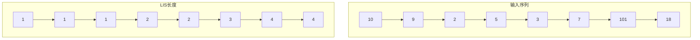

**四要素**：

| 要素 | 内容 |
|------|------|
| **状态** | dp[i] = 以第i个元素结尾的LIS长度 |
| **转移** | dp[i] = max(dp[j] + 1)，其中j < i且nums[j] < nums[i] |
| **初始化** | dp[i] = 1（每个元素自己构成一个LIS） |
| **结果** | max(dp[i]) |

#### 代码实现

```java
// ============ O(n²) DP解法 ============
public int lisDP(int[] nums) {
    if (nums == null || nums.length == 0) return 0;

    int n = nums.length;
    int[] dp = new int[n];
    int result = 1;

    // 初始化：每个元素至少是长度为1的LIS
    Arrays.fill(dp, 1);

    for (int i = 1; i < n; i++) {
        for (int j = 0; j < i; j++) {
            if (nums[j] < nums[i]) {
                dp[i] = Math.max(dp[i], dp[j] + 1);
            }
        }
        result = Math.max(result, dp[i]);
    }
    return result;
}

// ============ O(n log n) 二分优化 ============
/*
   维护一个有序数组tails，
   tails[i] = 所有长度为i+1的递增子序列中，结尾元素的最小值

   对于每个元素：
   - 使用二分查找找到第一个 >= nums[i] 的位置
   - 如果找到位置为len，说明可以扩展到长度len+1
   - 否则替换该位置的值
*/
public int lisBinary(int[] nums) {
    if (nums == null || nums.length == 0) return 0;

    int[] tails = new int[nums.length];
    int len = 0;

    for (int num : nums) {
        int i = Arrays.binarySearch(tails, 0, len, num);
        if (i < 0) {
            i = -(i + 1); // 插入点
        }
        tails[i] = num;
        if (i == len) {
            len++;
        }
    }
    return len;
}

// ============ 打印LIS路径 ============
public List<Integer> lisPath(int[] nums) {
    if (nums == null || nums.length == 0) return new ArrayList<>();

    int n = nums.length;
    int[] dp = new int[n];
    int[] pre = new int[n]; // 记录前驱索引
    Arrays.fill(dp, 1);
    Arrays.fill(pre, -1);

    int maxLen = 1, maxIdx = 0;

    for (int i = 1; i < n; i++) {
        for (int j = 0; j < i; j++) {
            if (nums[j] < nums[i] && dp[j] + 1 > dp[i]) {
                dp[i] = dp[j] + 1;
                pre[i] = j;
            }
        }
        if (dp[i] > maxLen) {
            maxLen = dp[i];
            maxIdx = i;
        }
    }

    // 回溯路径
    List<Integer> path = new ArrayList<>();
    while (maxIdx != -1) {
        path.add(nums[maxIdx]);
        maxIdx = pre[maxIdx];
    }
    Collections.reverse(path);
    return path;
}
```

**复杂度对比**：

| 方法 | 时间复杂度 | 空间复杂度 |
|------|-----------|-----------|
| DP | $O(n^2)$ | $O(n)$ |
| 二分优化 | $O(n \log n)$ | $O(n)$ |

### 2.7 最长公共子序列（LCS）

#### 问题描述

给定两个字符串，找到它们的最长公共子序列的长度。

**示例**：
- 字符串1："ABCDGH"
- 字符串2："AEDFHR"
- LCS："ADH"，长度为3

#### DP分析

**状态转移表**：

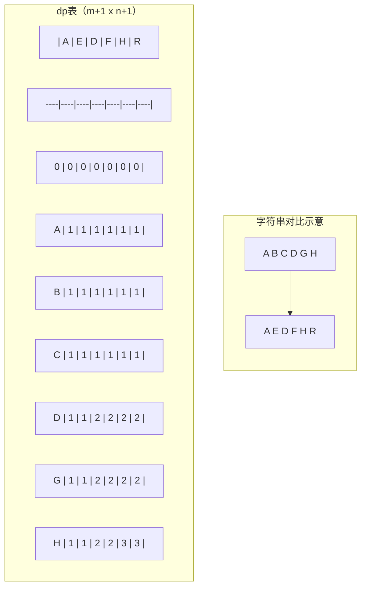

**四要素**：

| 要素 | 内容 |
|------|------|
| **状态** | dp[i][j] = str1前i个字符与str2前j个字符的LCS长度 |
| **转移** | 若str1[i-1]==str2[j-1]，dp[i][j]=dp[i-1][j-1]+1；否则dp[i][j]=max(dp[i-1][j],dp[i][j-1]) |
| **初始化** | dp[0][j]=0, dp[i][0]=0 |
| **结果** | dp[m][n] |

#### 代码实现

```java
// ============ 二维DP ============
public int lcs(String str1, String str2) {
    int m = str1.length(), n = str2.length();
    int[][] dp = new int[m + 1][n + 1];

    for (int i = 1; i <= m; i++) {
        for (int j = 1; j <= n; j++) {
            if (str1.charAt(i - 1) == str2.charAt(j - 1)) {
                dp[i][j] = dp[i - 1][j - 1] + 1;
            } else {
                dp[i][j] = Math.max(dp[i - 1][j], dp[i][j - 1]);
            }
        }
    }
    return dp[m][n];
}

// ============ 空间优化（滚动数组） ============
public int lcsOptimized(String str1, String str2) {
    int m = str1.length(), n = str2.length();
    int[] dp = new int[n + 1];

    for (int i = 1; i <= m; i++) {
        int prev = 0; // 保存dp[i-1][j-1]
        for (int j = 1; j <= n; j++) {
            int temp = dp[j];
            if (str1.charAt(i - 1) == str2.charAt(j - 1)) {
                dp[j] = prev + 1;
            } else {
                dp[j] = Math.max(dp[j], dp[j - 1]);
            }
            prev = temp;
        }
    }
    return dp[n];
}

// ============ 打印LCS路径 ============
public String lcsPath(String str1, String str2) {
    int m = str1.length(), n = str2.length();
    int[][] dp = new int[m + 1][n + 1];

    // 构建dp表
    for (int i = 1; i <= m; i++) {
        for (int j = 1; j <= n; j++) {
            if (str1.charAt(i - 1) == str2.charAt(j - 1)) {
                dp[i][j] = dp[i - 1][j - 1] + 1;
            } else {
                dp[i][j] = Math.max(dp[i - 1][j], dp[i][j - 1]);
            }
        }
    }

    // 回溯
    StringBuilder sb = new StringBuilder();
    int i = m, j = n;
    while (i > 0 && j > 0) {
        if (str1.charAt(i - 1) == str2.charAt(j - 1)) {
            sb.append(str1.charAt(i - 1));
            i--;
            j--;
        } else if (dp[i - 1][j] > dp[i][j - 1]) {
            i--;
        } else {
            j--;
        }
    }
    return sb.reverse().toString();
}
```

### 2.8 编辑距离

#### 问题描述

给你两个单词word1和word2，请你计算出将word1转换成word2所使用的最少操作数。

**允许的操作**：
1. 插入一个字符
2. 删除一个字符
3. 替换一个字符

**示例**：
- word1 = "horse", word2 = "ros"
- 输出：3
- 解释：horse -> rorse（替换'h'）-> rose（删除'r'）-> ros（删除'e'）

#### DP分析

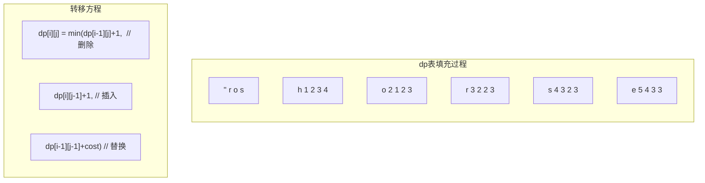

**四要素**：

| 要素 | 内容 |
|------|------|
| **状态** | dp[i][j] = word1前i个字符转换成word2前j个字符的最少操作数 |
| **转移** | dp[i][j] = min(dp[i-1][j]+1, dp[i][j-1]+1, dp[i-1][j-1]+(word1[i-1]==word2[j-1]?0:1)) |
| **初始化** | dp[i][0]=i（删除i个字符），dp[0][j]=j（插入j个字符） |
| **结果** | dp[m][n] |

#### 代码实现

```java
// ============ 标准DP ============
public int editDistance(String word1, String word2) {
    int m = word1.length(), n = word2.length();
    int[][] dp = new int[m + 1][n + 1];

    // 初始化
    for (int i = 0; i <= m; i++) dp[i][0] = i;
    for (int j = 0; j <= n; j++) dp[0][j] = j;

    for (int i = 1; i <= m; i++) {
        for (int j = 1; j <= n; j++) {
            if (word1.charAt(i - 1) == word2.charAt(j - 1)) {
                dp[i][j] = dp[i - 1][j - 1];
            } else {
                dp[i][j] = Math.min(
                    Math.min(dp[i - 1][j] + 1, dp[i][j - 1] + 1), // 删除或插入
                    dp[i - 1][j - 1] + 1                          // 替换
                );
            }
        }
    }
    return dp[m][n];
}

// ============ 空间优化 ============
public int editDistanceOptimized(String word1, String word2) {
    int m = word1.length(), n = word2.length();
    int[] dp = new int[n + 1];

    for (int j = 0; j <= n; j++) dp[j] = j;

    for (int i = 1; i <= m; i++) {
        int prev = dp[0];
        dp[0] = i;
        for (int j = 1; j <= n; j++) {
            int temp = dp[j];
            if (word1.charAt(i - 1) == word2.charAt(j - 1)) {
                dp[j] = prev;
            } else {
                dp[j] = Math.min(prev, Math.min(dp[j], dp[j - 1])) + 1;
            }
            prev = temp;
        }
    }
    return dp[n];
}
```

---

## 3. DP优化技巧

### 3.1 空间优化（滚动数组）

#### 原理

很多DP问题中，dp[i]只依赖于dp[i-1]或dp[i-2]，这时可以将整个dp数组压缩为几个变量。

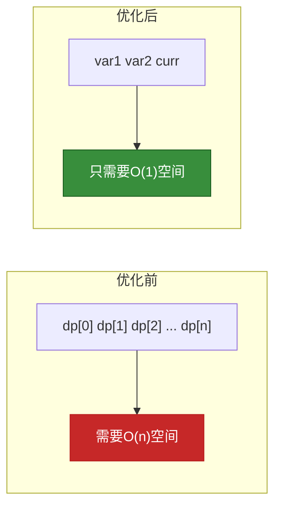

#### 适用场景

| 问题类型 | 依赖关系 | 优化后空间 |
|----------|----------|----------|
| 斐波那契数列 | dp[i-1], dp[i-2] | O(1) |
| 爬楼梯 | dp[i-1], dp[i-2] | O(1) |
| 0-1背包 | dp[j]（逆序） | O(W) |
| 完全背包 | dp[j]（正序） | O(W) |
| LCS | dp[j] | O(min(m,n)) |

#### 代码示例

```java
// ============ 斐波那契空间优化 ============
public int fib(int n) {
    if (n <= 1) return n;
    int prev2 = 0, prev1 = 1;
    for (int i = 2; i <= n; i++) {
        int curr = prev1 + prev2;
        prev2 = prev1;
        prev1 = curr;
    }
    return prev1;
}

// ============ 矩阵DP空间优化 ============
// 适用于dp[i]依赖前k项的情况
public int linearDP(int[] arr, int k) {
    if (arr == null || arr.length == 0) return 0;

    // 只需要保存最近k个状态
    int[] window = new int[k];
    for (int num : arr) {
        // 滑动窗口更新
        int sum = 0;
        for (int i = k - 1; i > 0; i--) {
            window[i] = window[i - 1];
            sum += window[i];
        }
        window[0] = num;
    }
    return Arrays.stream(window).max().orElse(0);
}
```

### 3.2 时间优化（单调队列优化）

#### 适用场景

当DP转移具有以下形式时：
```
dp[i] = max/min(dp[j] + cost(j, i))，其中 j < i 且 cost 随 j 单调
```

#### 原理

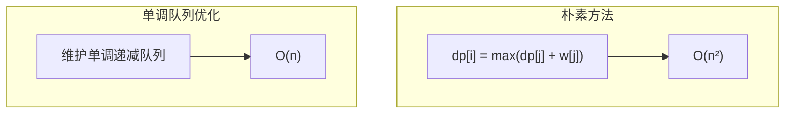

#### 代码示例

```java
// ============ 单调队列优化（最大子序和变体） ============
/*
   问题：给定序列，求每个长度为k的窗口的最大值

   使用单调递减队列，保持队列中元素索引对应的值递减
*/
public int[] maxSlidingWindow(int[] nums, int k) {
    if (nums == null || nums.length == 0) return new int[0];

    int[] result = new int[nums.length - k + 1];
    LinkedList<Integer> queue = new LinkedList<>(); // 存储索引

    for (int i = 0; i < nums.length; i++) {
        // 移除超出窗口范围的元素
        while (!queue.isEmpty() && queue.peek() < i - k + 1) {
            queue.poll();
        }
        // 保持单调递减
        while (!queue.isEmpty() && nums[queue.peekLast()] < nums[i]) {
            queue.pollLast();
        }
        queue.add(i);

        // 记录结果
        if (i >= k - 1) {
            result[i - k + 1] = nums[queue.peek()];
        }
    }
    return result;
}

// ============ DP中的单调队列优化 ============
/*
   问题：股票买卖问题 with cooldown
   dp[i] = max(dp[i-1], prices[i] - minPrice)
         = max(dp[i-1], prices[i] + maxProfitWithCooldown)
*/
public int maxProfitWithCooldown(int[] prices) {
    if (prices == null || prices.length < 2) return 0;

    int n = prices.length;
    int[] dp = new int[n];

    int minPrice = prices[0];
    for (int i = 1; i < n; i++) {
        // 状态转移
        dp[i] = Math.max(dp[i - 1], prices[i] - minPrice);
        // 更新最低价格（考虑cooldown）
        minPrice = Math.min(minPrice, prices[i] - (i >= 2 ? dp[i - 2] : 0));
    }
    return dp[n - 1];
}
```

### 3.3 状态压缩（位运算）

#### 适用场景

当问题状态可以用二进制位表示时，如：
- 集合的子集问题
- 棋盘覆盖问题
- 状态机DP

#### 代码示例

```java
// ============ 旅行商问题（TSP） ============
/*
   问题：给定n个城市之间的距离，求访问所有城市的最短路径

   状态压缩：使用n位二进制表示城市访问状态
   dp[mask][i] = 从城市i出发，访问状态为mask的最短路径
*/
public int tsp(int[][] dist) {
    int n = dist.length;
    int N = 1 << n;
    int[][] dp = new int[N][n];

    // 初始化：从任意城市出发，只访问该城市
    for (int i = 0; i < n; i++) {
        dp[1 << i][i] = 0;
    }

    // 枚举状态
    for (int mask = 1; mask < N; mask++) {
        for (int last = 0; last < n; last++) {
            if ((mask & (1 << last)) == 0) continue;

            // 枚举下一个城市
            for (int next = 0; next < n; next++) {
                if ((mask & (1 << next)) != 0) continue;
                int nextMask = mask | (1 << next);
                dp[nextMask][next] = Math.min(
                    dp[nextMask][next],
                    dp[mask][last] + dist[last][next]
                );
            }
        }
    }

    // 返回最优解
    int fullMask = N - 1;
    return Arrays.stream(dp[fullMask]).min().orElse(0);
}

// ============ 集合状态DP ============
/*
   问题：给定一组数，选出若干使和最接近target

   状态压缩：将数组分成两半，分别枚举子集
*/
public int minAbsSubset(int[] nums, int target) {
    int n = nums.length;
    int mid = n / 2;

    // 枚举前半部分的子集和
    List<Integer> leftSums = new ArrayList<>();
    for (int mask = 0; mask < (1 << mid); mask++) {
        int sum = 0;
        for (int i = 0; i < mid; i++) {
            if ((mask & (1 << i)) != 0) sum += nums[i];
        }
        leftSums.add(sum);
    }

    // 枚举后半部分的子集和
    int result = Integer.MAX_VALUE;
    for (int mask = 0; mask < (1 << (n - mid)); mask++) {
        int sum = 0;
        for (int i = 0; i < n - mid; i++) {
            if ((mask & (1 << i)) != 0) sum += nums[mid + i];
        }
        // 找最接近 target - sum 的值
        int complement = target - sum;
        int bs = binarySearch(leftSums, complement);
        result = Math.min(result, Math.abs(target - (sum + bs)));
    }
    return result;
}
```

### 3.4 斜率优化

#### 适用场景

当DP转移具有线性形式且斜率单调时：
```
dp[i] = min/max(A[i] * B[j] + dp[j])，其中 A[i] 和 B[j] 是单调序列
```

#### 原理

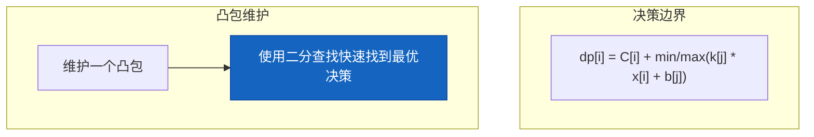

#### 代码示例

```java
// ============ 斜率优化示例：序列划分 ============
/*
   问题：将序列划分为m段，最小化每段和的最大值

   dp[i][k] = min(max(dp[j][k-1], sum[j+1..i]))
*/
public int splitArray(int[] nums, int m) {
    int n = nums.length;
    long[] prefixSum = new long[n + 1];
    for (int i = 0; i < n; i++) prefixSum[i + 1] = prefixSum[i] + nums[i];

    long[][] dp = new long[n + 1][m + 1];
    for (int i = 0; i <= n; i++) Arrays.fill(dp[i], Long.MAX_VALUE);
    dp[0][0] = 0;

    for (int k = 1; k <= m; k++) {
        // 斜率优化：维护凸包
        List<Integer> hull = new ArrayList<>();

        for (int i = 1; i <= n; i++) {
            // 二分查找最优分割点
            int left = 0, right = hull.size() - 1;
            while (left < right) {
                int mid = (left + right) / 2;
                int j1 = hull.get(mid);
                int j2 = hull.get(mid + 1);
                if (dp[j1][k - 1] - prefixSum[j1] <= dp[j2][k - 1] - prefixSum[j2]) {
                    right = mid;
                } else {
                    left = mid + 1;
                }
            }

            int bestJ = hull.isEmpty() ? 0 : hull.get(left);
            dp[i][k] = Math.max(dp[bestJ][k - 1], prefixSum[i] - prefixSum[bestJ]);

            // 维护凸包
            while (hull.size() >= 2) {
                int j1 = hull.get(hull.size() - 2);
                int j2 = hull.get(hull.size() - 1);
                if ((dp[i][k - 1] - prefixSum[i]) * (prefixSum[j2] - prefixSum[j1])
                        <= (dp[j2][k - 1] - prefixSum[j2]) * (prefixSum[j1] - prefixSum[j0])) {
                    hull.remove(hull.size() - 1);
                } else {
                    break;
                }
            }
            hull.add(i);
        }
    }
    return (int) dp[n][m];
}
```

---

## 4. 工程应用

### 4.1 字符串相似度（编辑距离）

#### Levenshtein距离

编辑距离在以下场景有广泛应用：

| 应用领域 | 具体场景 |
|----------|----------|
| **拼写检查** | 找出最接近输入的单词 |
| **DNA序列比对** | 计算两条DNA链的相似度 |
| ** plagiarism检测** | 文本相似度计算 |
| **模糊搜索** | 近似字符串匹配 |

```java
// ============ 实际应用：拼写检查 ============
public class SpellChecker {
    private Set<String> dictionary;

    public SpellChecker(Set<String> dictionary) {
        this.dictionary = dictionary;
    }

    public List<String> suggestCorrections(String word, int maxDistance) {
        List<String> suggestions = new ArrayList<>();
        for (String candidate : dictionary) {
            if (Math.abs(candidate.length() - word.length()) > maxDistance) {
                continue;
            }
            if (editDistance(word, candidate) <= maxDistance) {
                suggestions.add(candidate);
            }
        }
        return suggestions;
    }
}

// ============ 实际应用：DNA序列比对 ============
public class DNAAnalyzer {
    public int similarity(String seq1, String seq2) {
        int distance = editDistance(seq1, seq2);
        int maxLen = Math.max(seq1.length(), seq2.length());
        return (maxLen - distance) * 100 / maxLen; // 相似度百分比
    }
}
```

### 4.2 股票买卖问题

#### 问题变体

| 问题 | 限制条件 | 解法 |
|------|----------|------|
| 买卖一次 | 冷冻期1天 | DP + 状态机 |
| 买卖无限次 | 无 | 贪心 |
| 买卖k次 | 交易次数限制 | DP三维 |
| 手续费 | 每次交易付手续费 | DP + 优化 |

#### 代码实现

```java
// ============ 买卖股票 with 冷冻期 ============
/*
   状态机：
   - hold: 持有股票
   - sold: 卖出后处于冷冻期
   - free: 卖出后不在冷冻期

   转移：
   hold = max(hold, free - prices[i])
   sold = hold + prices[i]
   free = max(free, sold)
*/
public int maxProfitWithCooldown(int[] prices) {
    if (prices == null || prices.length < 2) return 0;

    int n = prices.length;
    int[] hold = new int[n + 1];
    int[] sold = new int[n + 1];
    int[] free = new int[n + 1];

    hold[0] = Integer.MIN_VALUE;
    sold[0] = 0;
    free[0] = 0;

    for (int i = 1; i <= n; i++) {
        hold[i] = Math.max(hold[i - 1], free[i - 1] - prices[i - 1]);
        sold[i] = hold[i - 1] + prices[i - 1];
        free[i] = Math.max(free[i - 1], sold[i - 1]);
    }
    return Math.max(sold[n], free[n]);
}

// ============ 买卖股票 with 手续费 ============
public int maxProfitWithFee(int[] prices, int fee) {
    if (prices == null || prices.length < 2) return 0;

    int n = prices.length;
    int[] hold = new int[n];
    int[] cash = new int[n];

    hold[0] = -prices[0];
    cash[0] = 0;

    for (int i = 1; i < n; i++) {
        hold[i] = Math.max(hold[i - 1], cash[i - 1] - prices[i]);
        cash[i] = Math.max(cash[i - 1], hold[i - 1] + prices[i] - fee);
    }
    return cash[n - 1];
}

// ============ 买卖股票 k 次 ============
public int maxProfit(int k, int[] prices) {
    if (prices == null || prices.length < 2 || k <= 0) return 0;

    int n = prices.length;
    if (k >= n / 2) {
        // 无限次交易，贪心
        int profit = 0;
        for (int i = 1; i < n; i++) {
            if (prices[i] > prices[i - 1]) {
                profit += prices[i] - prices[i - 1];
            }
        }
        return profit;
    }

    int[][][] dp = new int[k + 1][n][2];
    for (int t = 0; t <= k; t++) {
        dp[t][0][1] = Integer.MIN_VALUE;
    }

    for (int i = 1; i < n; i++) {
        for (int t = 1; t <= k; t++) {
            dp[t][i][0] = Math.max(dp[t][i - 1][0], dp[t][i - 1][1] + prices[i]);
            dp[t][i][1] = Math.max(dp[t][i - 1][1], dp[t - 1][i - 1][0] - prices[i]);
        }
    }
    return dp[k][n - 1][0];
}
```

### 4.3 资源分配问题

#### 问题描述

将有限资源分配给多个项目，每个项目有不同的收益函数，求最大总收益。

```java
// ============ 资源分配DP ============
/*
   问题：总资源R，n个项目，每个项目投入x资源的收益为profit[i][x]

   dp[i][r] = 项目i在资源r下的最大收益
*/
public int resourceAllocation(int[][] profit, int R) {
    int n = profit.length;
    int[][] dp = new int[n + 1][R + 1];

    for (int i = 1; i <= n; i++) {
        for (int r = 0; r <= R; r++) {
            for (int x = 0; x <= r; x++) {
                dp[i][r] = Math.max(dp[i][r], dp[i - 1][r - x] + profit[i - 1][x]);
            }
        }
    }
    return dp[n][R];
}

// ============ 任务调度问题 ============
/*
   问题：n个任务，每个任务有开始时间、结束时间、价值
   选择不冲突的任务子集，最大化总价值

   状态：按结束时间排序后，dp[i] = 前i个任务的最优价值
*/
public int taskScheduling(int[][] tasks) {
    Arrays.sort(tasks, Comparator.comparingInt(t -> t[1]));

    int n = tasks.length;
    int[] dp = new int[n + 1];

    for (int i = 1; i <= n; i++) {
        // 不选第i-1个任务
        dp[i] = dp[i - 1];

        // 选第i-1个任务，找最后一个不冲突的任务
        int start = tasks[i - 1][0];
        int value = tasks[i - 1][2];

        int lo = 1, hi = i - 1;
        while (lo < hi) {
            int mid = (lo + hi + 1) / 2;
            if (tasks[mid - 1][1] <= start) {
                lo = mid;
            } else {
                hi = mid - 1;
            }
        }

        if (lo >= 1 && tasks[lo - 1][1] <= start) {
            dp[i] = Math.max(dp[i], dp[lo] + value);
        } else {
            dp[i] = Math.max(dp[i], value);
        }
    }
    return dp[n];
}
```

### 4.4 语音识别/NLP中的DP

#### 应用场景

| 应用 | DP技术 | 用途 |
|------|--------|------|
| 维特比算法 | 隐马尔可夫 | 词性标注、语音识别 |
| 前向算法 | 动态规划 | 概率计算 |
| 编辑距离 | 字符串DP | 拼写纠错、机器翻译 |
| CKY算法 | Chart DP | 句法分析 |

```java
// ============ 维特比算法（Viterbi Algorithm） ============
/*
   用于找到最可能的隐藏状态序列
   应用：词性标注、语音识别、基因序列分析
*/
public class ViterbiAlgorithm {

    // 隐马尔可夫模型参数
    private double[] initialProb;      // 初始概率
    private double[][] transProb;      // 转移概率
    private double[][] emitProb;       // 发射概率
    private String[] states;          // 隐藏状态
    private String[] observations;     // 观测序列

    public ViterbiAlgorithm(double[] initialProb,
                          double[][] transProb,
                          double[][] emitProb,
                          String[] states) {
        this.initialProb = initialProb;
        this.transProb = transProb;
        this.emitProb = emitProb;
        this.states = states;
    }

    public List<String> decode(String[] observations) {
        this.observations = observations;
        int T = observations.length;
        int N = states.length;

        double[][] dp = new double[T][N];
        int[][] path = new int[T][N];

        // 初始化
        String obs = observations[0];
        for (int s = 0; s < N; s++) {
            dp[0][s] = initialProb[s] * emitProb[s][getObsIndex(obs)];
        }

        // 递归
        for (int t = 1; t < T; t++) {
            obs = observations[t];
            for (int s = 0; s < N; s++) {
                double maxProb = 0;
                int bestPrev = 0;
                for (int prev = 0; prev < N; prev++) {
                    double prob = dp[t - 1][prev] * transProb[prev][s];
                    if (prob > maxProb) {
                        maxProb = prob;
                        bestPrev = prev;
                    }
                }
                dp[t][s] = maxProb * emitProb[s][getObsIndex(obs)];
                path[t][s] = bestPrev;
            }
        }

        // 回溯
        List<String> result = new ArrayList<>();
        int lastState = 0;
        double maxProb = 0;
        for (int s = 0; s < N; s++) {
            if (dp[T - 1][s] > maxProb) {
                maxProb = dp[T - 1][s];
                lastState = s;
            }
        }

        for (int t = T - 1; t >= 0; t--) {
            result.add(0, states[lastState]);
            lastState = path[t][lastState];
        }

        return result;
    }

    private int getObsIndex(String obs) {
        // 根据观测获取索引
        return obs.hashCode() % emitProb[0].length;
    }
}

// ============ 最小编辑距离在机器翻译中的应用 ============
public class MachineTranslation {

    // 获取两个句子的编辑距离和编辑操作序列
    public EditResult getEditDistance(String source, String target) {
        int m = source.length(), n = target.length();
        int[][] dp = new int[m + 1][n + 1];
        String[][] ops = new String[m + 1][n + 1];

        // 初始化
        for (int i = 0; i <= m; i++) {
            dp[i][0] = i;
            ops[i][0] = "DELETE";
        }
        for (int j = 0; j <= n; j++) {
            dp[0][j] = j;
            ops[0][j] = "INSERT";
        }

        for (int i = 1; i <= m; i++) {
            for (int j = 1; j <= n; j++) {
                if (source.charAt(i - 1) == target.charAt(j - 1)) {
                    dp[i][j] = dp[i - 1][j - 1];
                    ops[i][j] = "MATCH";
                } else {
                    int min = Math.min(
                        Math.min(dp[i - 1][j], dp[i][j - 1]),
                        dp[i - 1][j - 1]
                    );
                    dp[i][j] = min + 1;
                    if (dp[i - 1][j] == min) {
                        ops[i][j] = "DELETE";
                    } else if (dp[i][j - 1] == min) {
                        ops[i][j] = "INSERT";
                    } else {
                        ops[i][j] = "REPLACE";
                    }
                }
            }
        }

        return new EditResult(dp[m][n], ops);
    }

    public static class EditResult {
        public final int distance;
        public final String[][] operations;

        public EditResult(int distance, String[][] operations) {
            this.distance = distance;
            this.operations = operations;
        }
    }
}
```

---

## 5. 总结

### DP知识体系

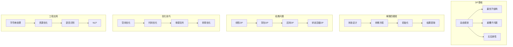

### 学习建议

1. **从简单开始**：先掌握斐波那契、爬楼梯等一维DP
2. **理解四要素**：状态定义是最关键的一步
3. **画表分析**：手动填充dp表有助于理解转移过程
4. **空间意识**：考虑每道题是否可以空间优化
5. **多做练习**：动态规划需要大量练习来培养直觉

### 复杂度速查表

| 问题 | 时间复杂度 | 空间复杂度 |
|------|-----------|-----------|
| 斐波那契 | $O(n)$ | $O(1)$ |
| 爬楼梯 | $O(n)$ | $O(1)$ |
| 0-1背包 | $O(n \times W)$ | $O(W)$ |
| 完全背包 | $O(n \times W)$ | $O(W)$ |
| LCS | $O(m \times n)$ | $O(\min(m,n))$ |
| LIS（DP） | $O(n^2)$ | $O(n)$ |
| LIS（二分） | $O(n \log n)$ | $O(n)$ |
| 编辑距离 | $O(m \times n)$ | $O(\min(m,n))$ |
| TSP | $O(n^2 \times 2^n)$ | $O(n \times 2^n)$ |
