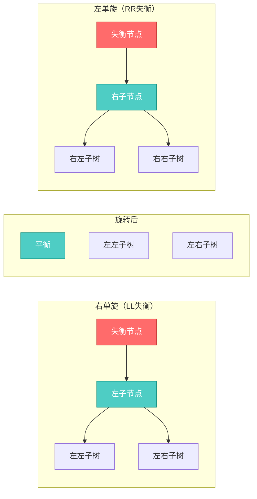
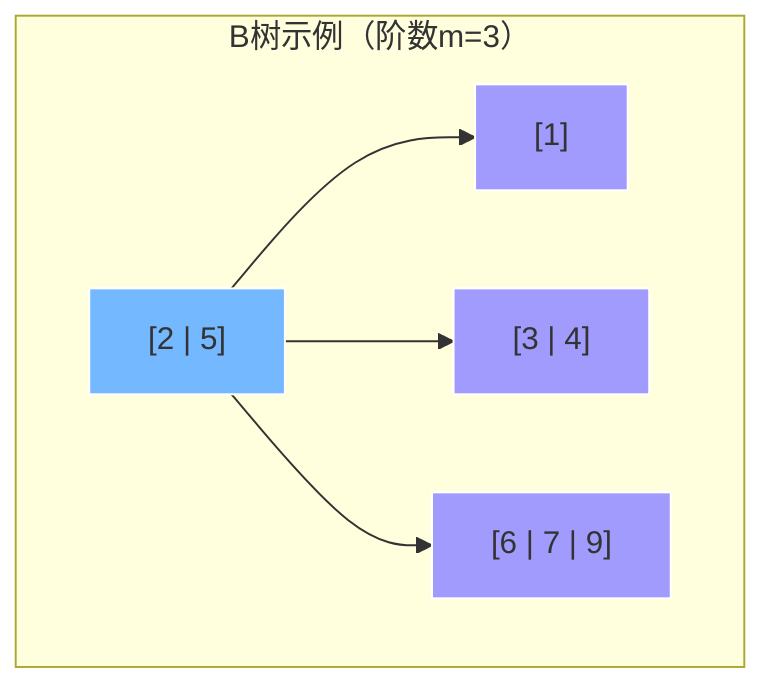
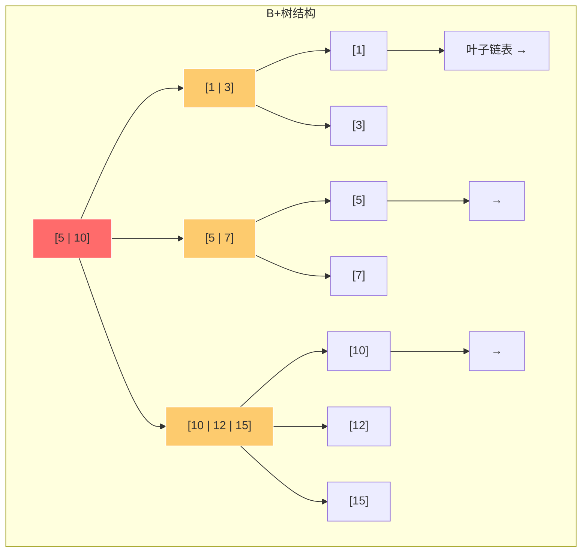
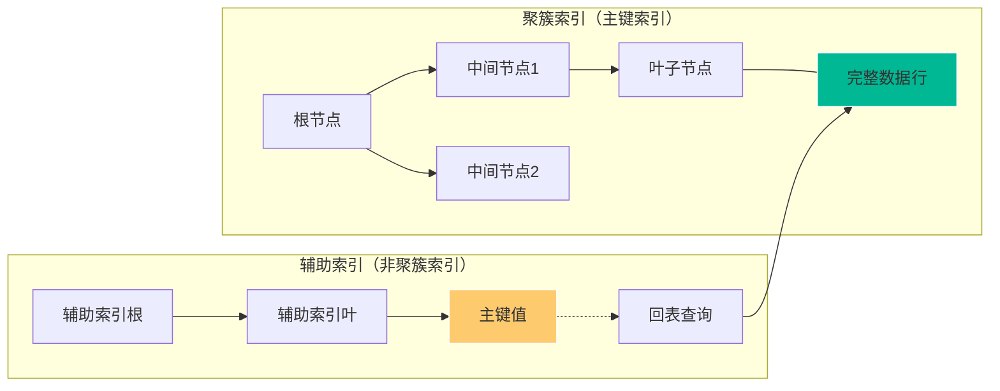
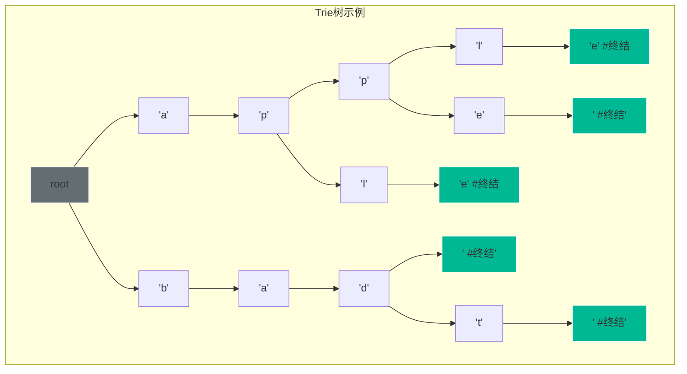
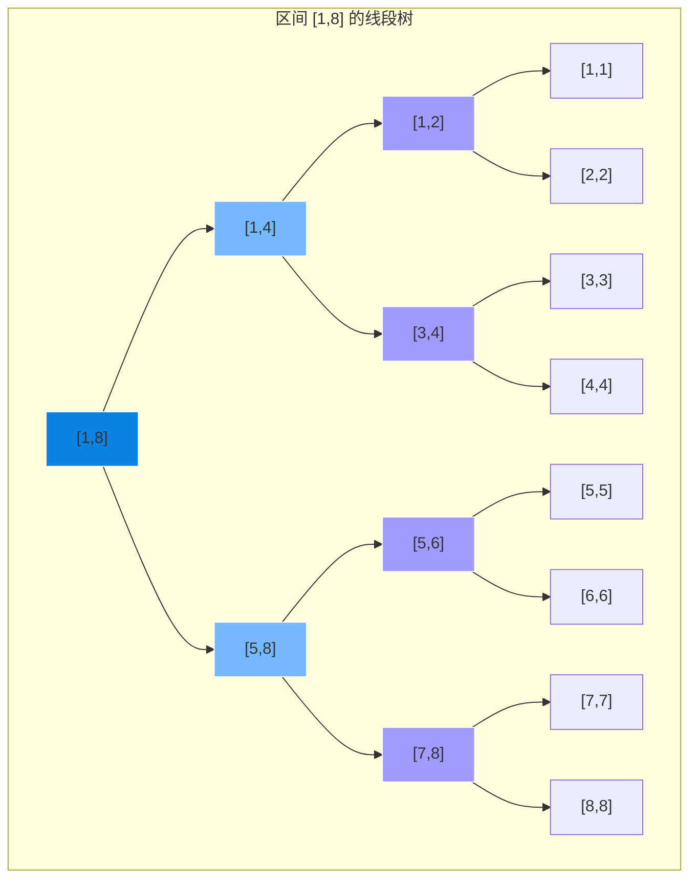
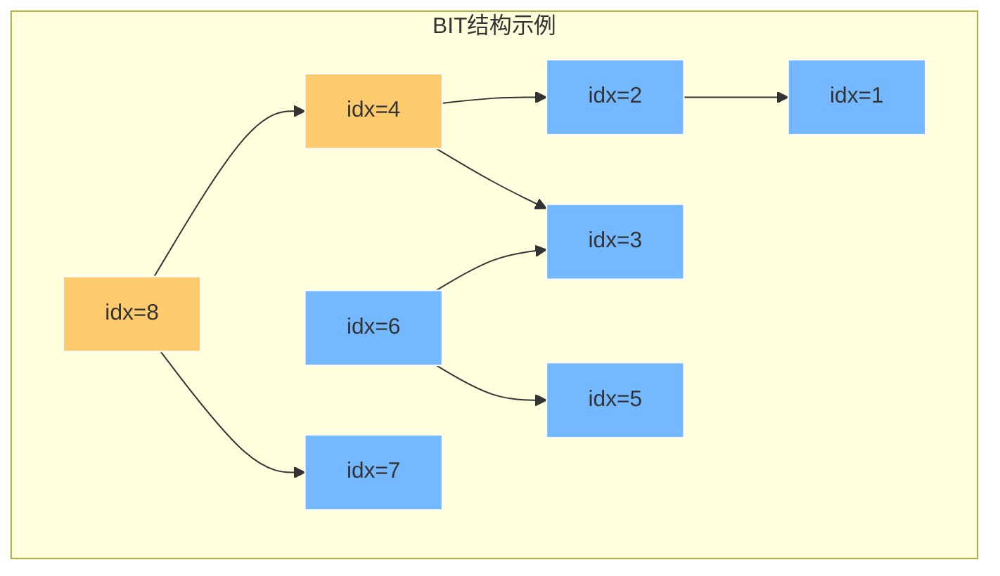
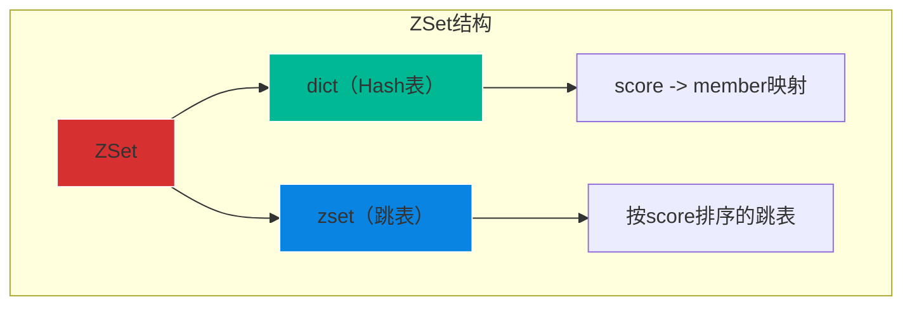

# 高级数据结构

本章介绍几种重要的进阶数据结构，它们在数据库索引、缓存系统、网络路由等领域有着广泛应用。

---

## 1. 平衡二叉搜索树

### 1.1 AVL树

AVL树是最早发明的自平衡二叉搜索树，由Adelson-Velsky和Landis在1962年提出。

#### AVL树性质

- 左子树和右子树的高度差（平衡因子）不超过1
- 每个子树本身也是AVL树
- 平衡因子 = 左子树高度 - 右子树高度，取值只能是-1、0、1

```java
/**
 * AVL树节点
 */
static class AVLNode {
    int key;
    int height;
    AVLNode left;
    AVLNode right;
    
    AVLNode(int key) {
        this.key = key;
        this.height = 1;
    }
}

public class AVLTree {
    private AVLNode root;
    
    // 获取高度
    private int height(AVLNode node) {
        return node == null ? 0 : node.height;
    }
    
    // 获取平衡因子
    private int getBalance(AVLNode node) {
        return node == null ? 0 : height(node.left) - height(node.right);
    }
}
```

#### 旋转操作

当插入或删除节点后，需要通过旋转来恢复平衡：



```java
// 右旋 - 处理LL失衡
private AVLNode rightRotate(AVLNode y) {
    AVLNode x = y.left;
    AVLNode T2 = x.right;
    
    x.right = y;
    y.left = T2;
    
    // 更新高度（先更新y再更新x）
    y.height = Math.max(height(y.left), height(y.right)) + 1;
    x.height = Math.max(height(x.left), height(x.right)) + 1;
    
    return x;
}

// 左旋 - 处理RR失衡
private AVLNode leftRotate(AVLNode x) {
    AVLNode y = x.right;
    AVLNode T2 = y.left;
    
    y.left = x;
    x.right = T2;
    
    x.height = Math.max(height(x.left), height(x.right)) + 1;
    y.height = Math.max(height(y.left), height(y.right)) + 1;
    
    return y;
}
```

#### 四种失衡情况

| 失衡类型 | 触发条件 | 处理方式 |
|---------|---------|---------|
| LL | 在节点的左子树的左子树插入 | 单次右旋 |
| RR | 在节点的右子树的右子树插入 | 单次左旋 |
| LR | 在节点的左子树的右子树插入 | 先左旋后右旋 |
| RL | 在节点的右子树的左子树插入 | 先右旋后左旋 |

```java
// 插入操作
private AVLNode insert(AVLNode node, int key) {
    // 1. 普通BST插入
    if (node == null) return new AVLNode(key);
    
    if (key < node.key) {
        node.left = insert(node.left, key);
    } else if (key > node.key) {
        node.right = insert(node.right, key);
    } else {
        return node; // 不允许重复
    }
    
    // 2. 更新高度
    node.height = Math.max(height(node.left), height(node.right)) + 1;
    
    // 3. 获取平衡因子并调整
    int balance = getBalance(node);
    
    // LL: 右旋
    if (balance > 1 && key < node.left.key) {
        return rightRotate(node);
    }
    
    // RR: 左旋
    if (balance < -1 && key > node.right.key) {
        return leftRotate(node);
    }
    
    // LR: 先左旋后右旋
    if (balance > 1 && key > node.left.key) {
        node.left = leftRotate(node.left);
        return rightRotate(node);
    }
    
    // RL: 先右旋后左旋
    if (balance < -1 && key < node.right.key) {
        node.right = rightRotate(node.right);
        return leftRotate(node);
    }
    
    return node;
}
```

### 1.2 红黑树

红黑树是一种近似平衡的二叉搜索树，通过节点颜色约束确保任何路径长度不超过其他路径的两倍。

#### 红黑树性质

1. 每个节点非红即黑
2. 根节点是黑色
3. 叶节点（NIL/空节点）是黑色
4. 红节点的子节点必须是黑色（不能有连续红色）
5. 从任一节点到其每个叶子的路径上，黑节点数量相同

```mermaid
graph TB
    subgraph "红黑树示例"
        A["4B"] --> B["2B"]
        A --> C["6B"]
        B --> D["1R"]
        B --> E["3R"]
        C --> F["5R"]
        C --> G["7R"]
    end
    
    style A fill:#2d3436,stroke:#fff
    style B fill:#2d3436,stroke:#fff
    style C fill:#2d3436,stroke:#fff
    style D fill:#e17055,stroke:#fff
    style E fill:#e17055,stroke:#fff
    style F fill:#e17055,stroke:#fff
    style G fill:#e17055,stroke:#fff
```



> B = 黑色节点，R = 红色节点

#### 红黑树 vs AVL树

| 特性 | 红黑树 | AVL树 |
|-----|-------|------|
| 平衡标准 | 近似平衡（路径≤2倍） | 严格平衡（高度差≤1） |
| 查找性能 | O(log n) | O(log n)，更好 |
| 插入/删除性能 | 最多2次旋转 | 最多O(log n)次旋转 |
| 适用场景 | 读多写少 | 写多读少 |

#### 插入操作与修复

新插入节点默认为红色，然后根据父节点和叔节点颜色进行修复。

```java
public class RedBlackTree {
    private static final boolean RED = true;
    private static final boolean BLACK = false;
    
    private Node root;
    
    class Node {
        int key;
        boolean color;
        Node left, right, parent;
    }
    
    // 插入修复
    private void insertFixup(Node z) {
        while (z.parent != null && isRed(z.parent)) {
            Node parent = z.parent;
            Node grandparent = parent.parent;
            
            // 父节点是祖父的左子
            if (parent == grandparent.left) {
                Node uncle = grandparent.right;
                
                // Case 1: 叔节点为红色
                if (uncle != null && isRed(uncle)) {
                    parent.color = BLACK;
                    uncle.color = BLACK;
                    grandparent.color = RED;
                    z = grandparent;
                    continue;
                }
                
                // Case 2: 叔节点为黑色，z是右子
                if (z == parent.right) {
                    z = parent;
                    rotateLeft(z);
                }
                
                // Case 3: 叔节点为黑色，z是左子
                parent.color = BLACK;
                grandparent.color = RED;
                rotateRight(grandparent);
                
            } else {
                // 父节点是祖父的右子（对称情况）
                Node uncle = grandparent.left;
                
                if (uncle != null && isRed(uncle)) {
                    parent.color = BLACK;
                    uncle.color = BLACK;
                    grandparent.color = RED;
                    z = grandparent;
                    continue;
                }
                
                if (z == parent.left) {
                    z = parent;
                    rotateRight(z);
                }
                
                parent.color = BLACK;
                grandparent.color = RED;
                rotateLeft(grandparent);
            }
        }
        
        // 确保根节点为黑色
        root.color = BLACK;
    }
}
```

#### Java TreeMap/TreeSet 原理

Java中的TreeMap和TreeSet内部都使用红黑树实现：

```java
// TreeMap关键源码结构
public class TreeMap<K,V> extends AbstractMap<K,V>
    implements NavigableMap<K,V>, Cloneable {
    
    // 红黑树节点
    private static final boolean RED = true;
    private static final boolean BLACK = false;
    
    private transient Entry<K,V> root;
    
    static final class Entry<K,V> {
        K key;
        V value;
        Entry<K,V> left;
        Entry<K,V> right;
        Entry<K,V> parent;
        boolean color = RED; // 新节点默认为红色
    }
    
    // 插入操作
    public V put(K key, V value) {
        Entry<K,V> t = root;
        if (t == null) {
            root = new Entry<>(key, value, null);
            root.color = BLACK; // 根节点必须为黑色
            return null;
        }
        
        // 查找插入位置
        Entry<K,V> parent;
        int cmp;
        do {
            parent = t;
            cmp = compare(key, t.key);
            if (cmp < 0) t = t.left;
            else if (cmp > 0) t = t.right;
            else return t.setValue(value);
        } while (t != null);
        
        // 创建新节点
        Entry<K,V> e = new Entry<>(key, value, parent);
        if (cmp < 0) parent.left = e;
        else parent.right = e;
        
        // 修复红黑树性质
        fixAfterInsertion(e);
        return null;
    }
}
```

TreeSet内部完全依赖TreeMap，只使用Map的key，value使用同一个Object：

```java
// TreeSet内部结构
public class TreeSet<E> extends AbstractSet<E> {
    private transient NavigableMap<E,Object> m;
    
    // Dummy value来占用Map的value位置
    private static final Object PRESENT = new Object();
    
    public TreeSet() {
        m = new TreeMap<>();
    }
    
    public boolean add(E e) {
        return m.put(e, PRESENT) == null;
    }
}
```

---

## 2. B树与B+树

### 2.1 B树

B树是一种多路平衡查找树，适合磁盘读写场景。



#### B树性质

- 每个节点最多有m个子节点
- 每个节点最多有m-1个关键字
- 根节点至少2个子节点（非叶子节点至少m/2个子节点）
- 所有叶子节点在同一层

### 2.2 B+树

B+树是B树的变体，在数据库索引中广泛应用。



#### B+树 vs B树

| 特性 | B树 | B+树 |
|-----|-----|------|
| 数据存储 | 所有节点都存数据 | 仅叶子节点存数据 |
| 查找效率 | 不稳定（可能中途找到） | 稳定（必须到叶子） |
| 范围查询 | 需要中序遍历 | 叶子节点链表，支持顺序访问 |
| 空间利用率 | 较低 | 更高（内节点只存索引） |
| 适用场景 | 内存数据库 | 磁盘数据库索引 |

### 2.3 MySQL索引结构原理

InnoDB存储引擎使用B+树作为索引结构：



**InnoDB索引特点**：
- 聚簇索引：叶子节点存储完整数据行
- 辅助索引：叶子节点存储主键值，需要回表查询
- 所有索引都是B+树结构

```sql
-- 查看查询执行计划
EXPLAIN SELECT * FROM users WHERE age = 25;

-- 使用索引（覆盖索引，避免回表）
EXPLAIN SELECT age, name FROM users WHERE age = 25;
```

**B+树在MySQL中的优势**：
1. 磁盘IO次数少（树高矮，3层可存2000万+数据）
2. 范围查询效率高（叶子链表）
3. 查询稳定性（所有查询路径长度相同）

---

## 3. 字典树（Trie）

### 3.1 Trie树结构

字典树又称前缀树或Trie树，用于高效存储和查找字符串。



### 3.2 Trie操作实现

```java
public class Trie {
    
    private class Node {
        Node[] children = new Node[26]; // 26个字母
        boolean isEnd = false; // 是否是单词结尾
    }
    
    private Node root;
    
    public Trie() {
        root = new Node();
    }
    
    // 插入
    public void insert(String word) {
        Node cur = root;
        for (char c : word.toCharArray()) {
            int index = c - 'a';
            if (cur.children[index] == null) {
                cur.children[index] = new Node();
            }
            cur = cur.children[index];
        }
        cur.isEnd = true;
    }
    
    // 查找完整单词
    public boolean search(String word) {
        Node cur = root;
        for (char c : word.toCharArray()) {
            int index = c - 'a';
            if (cur.children[index] == null) {
                return false;
            }
            cur = cur.children[index];
        }
        return cur.isEnd;
    }
    
    // 前缀匹配
    public boolean startsWith(String prefix) {
        Node cur = root;
        for (char c : prefix.toCharArray()) {
            int index = c - 'a';
            if (cur.children[index] == null) {
                return false;
            }
            cur = cur.children[index];
        }
        return true;
    }
}
```

### 3.3 Trie应用场景

| 应用 | 说明 |
|-----|------|
| 自动补全 | 搜索引擎、IDE代码补全 |
| IP路由 | 最长前缀匹配（LCP） |
| 字符串检索 | 词典查找、敏感词过滤 |
| 前缀统计 | 统计以某前缀开头的单词数量 |

```java
// 前缀统计示例
public int prefixCount(String prefix) {
    Node cur = root;
    for (char c : prefix.toCharArray()) {
        int index = c - 'a';
        if (cur.children[index] == null) {
            return 0;
        }
        cur = cur.children[index];
    }
    return countNodes(cur);
}

// 统计以某节点为根的子树中的单词数
private int countNodes(Node node) {
    int count = 0;
    if (node.isEnd) count++;
    for (Node child : node.children) {
        if (child != null) {
            count += countNodes(child);
        }
    }
    return count;
}
```

---

## 4. 线段树

### 4.1 线段树原理

线段树是一种用于区间查询的数据结构，适合频繁查询和更新的场景。



### 4.2 线段树实现

```java
public class SegmentTree {
    private int[] tree; // 线段树数组
    private int n;      // 原数组长度
    
    public SegmentTree(int[] arr) {
        n = arr.length;
        tree = new int[4 * n];
        build(1, 0, n - 1, arr);
    }
    
    // 构建线段树
    private void build(int node, int start, int end, int[] arr) {
        if (start == end) {
            tree[node] = arr[start];
            return;
        }
        
        int mid = (start + end) / 2;
        int left = node * 2;
        int right = node * 2 + 1;
        
        build(left, start, mid, arr);
        build(right, mid + 1, end, arr);
        
        tree[node] = tree[left] + tree[right]; // 求和操作
    }
    
    // 区间查询
    public int query(int left, int right) {
        return query(1, 0, n - 1, left, right);
    }
    
    private int query(int node, int start, int end, int left, int right) {
        if (right < start || left > end) {
            return 0; // 无交集
        }
        if (left <= start && end <= right) {
            return tree[node]; // 完全包含
        }
        
        int mid = (start + end) / 2;
        return query(node * 2, start, mid, left, right) +
               query(node * 2 + 1, mid + 1, end, left, right);
    }
    
    // 点更新
    public void update(int index, int value) {
        update(1, 0, n - 1, index, value);
    }
    
    private void update(int node, int start, int end, int index, int value) {
        if (start == end) {
            tree[node] = value;
            return;
        }
        
        int mid = (start + end) / 2;
        if (index <= mid) {
            update(node * 2, start, mid, index, value);
        } else {
            update(node * 2 + 1, mid + 1, end, index, value);
        }
        
        tree[node] = tree[node * 2] + tree[node * 2 + 1];
    }
}
```

### 4.3 懒标记（Lazy Propagation）

对于区间更新，使用懒标记延迟更新到子节点。

```java
public class LazySegmentTree {
    private int[] tree;
    private int[] lazy;
    private int n;
    
    public LazySegmentTree(int[] arr) {
        n = arr.length;
        tree = new int[4 * n];
        lazy = new int[4 * n];
        build(1, 0, n - 1, arr);
    }
    
    // 区间更新（加上指定值）
    public void updateRange(int left, int right, int val) {
        updateRange(1, 0, n - 1, left, right, val);
    }
    
    private void updateRange(int node, int start, int end, 
                             int left, int right, int val) {
        if (lazy[node] != 0) {
            // 之前有未应用的懒标记
            apply(node, start, end, lazy[node]);
            lazy[node] = 0;
        }
        
        if (right < start || left > end) {
            return; // 无交集
        }
        
        if (left <= start && end <= right) {
            // 完全包含，应用更新并设置懒标记
            apply(node, start, end, val);
            lazy[node] = val;
            return;
        }
        
        // 部分包含，递归处理子节点
        int mid = (start + end) / 2;
        updateRange(node * 2, start, mid, left, right, val);
        updateRange(node * 2 + 1, mid + 1, end, left, right, val);
        
        tree[node] = tree[node * 2] + tree[node * 2 + 1];
    }
    
    private void apply(int node, int start, int end, int val) {
        tree[node] += val * (end - start + 1);
    }
}
```

### 4.4 线段树应用

| 应用场景 | 说明 |
|---------|------|
| 区间求和 | 频繁查询区间和，点更新 |
| 区间最值 | 查询区间最大值/最小值 |
| 区间染色 | 涂色问题，统计颜色段数 |
| 动态排名 | 支持动态插入的排名查询 |

---

## 5. 树状数组（Fenwick Tree）

### 5.1 BIT结构

树状数组（Binary Indexed Tree）是一种O(log n)时间复杂度的数据结构，用于动态前缀和查询。



**核心思想**：利用二进制分解，每个位置管理特定范围的区间和。

### 5.2 BIT实现

```java
public class FenwickTree {
    private int[] tree;
    private int n;
    
    public FenwickTree(int size) {
        n = size;
        tree = new int[n + 1];
    }
    
    // lowbit: 取最低位的1
    // 例如: lowbit(6) = lowbit(110) = 2
    private int lowbit(int x) {
        return x & (-x);
    }
    
    // 单点更新：在index位置加上val
    public void update(int index, int val) {
        while (index <= n) {
            tree[index] += val;
            index += lowbit(index);
        }
    }
    
    // 前缀和查询：求arr[1..index]的和
    public int query(int index) {
        int sum = 0;
        while (index > 0) {
            sum += tree[index];
            index -= lowbit(index);
        }
        return sum;
    }
    
    // 区间和查询：求arr[left..right]的和
    public int rangeQuery(int left, int right) {
        return query(right) - query(left - 1);
    }
}
```

### 5.3 BIT应用

#### 逆序对计数

```java
public int reversePairs(int[] nums) {
    if (nums == null || nums.length < 2) {
        return 0;
    }
    
    // 离散化
    int[] sorted = nums.clone();
    Arrays.sort(sorted);
    
    FenwickTree bit = new FenwickTree(sorted.length);
    int count = 0;
    
    for (int i = 0; i < nums.length; i++) {
        // 找当前元素在排序数组中的位置
        int rank = Arrays.binarySearch(sorted, nums[i]) + 1;
        
        // 查询比当前元素大的数的个数（已出现的元素中）
        // 即当前位置之前比它大的数的个数
        count += bit.query(sorted.length) - bit.query(rank);
        
        // 将当前元素加入BIT
        bit.update(rank, 1);
    }
    
    return count;
}
```

#### 动态排名

```java
public class OrderStatistics {
    private FenwickTree bit;
    private int maxVal;
    
    public OrderStatistics(int maxVal) {
        this.maxVal = maxVal;
        this.bit = new FenwickTree(maxVal);
    }
    
    // 添加一个元素
    public void add(int value) {
        bit.update(value, 1);
    }
    
    // 查询第k小的元素（k从1开始）
    public int kthSmallest(int k) {
        int low = 1, high = maxVal;
        while (low < high) {
            int mid = (low + high) / 2;
            if (bit.query(mid) >= k) {
                high = mid;
            } else {
                low = mid + 1;
            }
        }
        return low;
    }
    
    // 查询小于等于value的元素个数
    public int rank(int value) {
        return bit.query(value);
    }
}
```

---

## 6. 总结对比

| 数据结构 | 插入 | 删除 | 查找 | 区间查询 | 适用场景 |
|---------|------|------|------|---------|---------|
| AVL树 | O(log n) | O(log n) | O(log n) | - | 读多写少，严格平衡 |
| 红黑树 | O(log n) | O(log n) | O(log n) | - | 读少写多，Java集合 |
| B树 | O(log n) | O(log n) | O(log n) | 较慢 | 文件系统、NoSQL |
| B+树 | O(log n) | O(log n) | O(log n) | 极快 | 数据库索引 |
| Trie | O(m) | O(m) | O(m) | O(m) | 字符串前缀 |
| 线段树 | O(log n) | O(log n) | - | O(log n) | 区间统计 |
| BIT | O(log n) | - | - | O(log n) | 前缀和统计 |

> 注：m为字符串长度，n为数据规模

---

## 7. 实战：Redis有序集合（ZSet）

Redis的ZSet底层采用压缩列表（ziplist）+ 跳表（skiplist）+ 哈希表的组合实现：



**为什么用跳表而不是红黑树？**
1. 跳表实现更简单，调试方便
2. 范围查询（ZRANGE）跳表更高效
3. 跳表插入不需要旋转操作，并发友好
4. Redis作者antirez的观点：跳表更美观

```java
// Redis跳表节点简化结构
class ZSkipListNode {
    String member;
    double score;
    ZSkipListNode[] forward; // 多层前向指针
    int span[];              // 跨度
}

// 跳表层级上限
private static final int ZSKIPLIST_MAXLEVEL = 64;
```
