# 算法技巧

算法技巧是解决特定类型问题的高效思维模式，本章介绍四种广泛应用的核心技巧：双指针、滑动窗口、位运算和字符串匹配。

---

## 1. 双指针

双指针是一种通过两个指针协同遍历来解决问题的技巧，核心思想是利用指针的位置关系减少遍历次数。

### 1.1 双指针原理

#### 快慢指针

两个指针同向移动，移动速度不同（通常慢指针每次移动1步，快指针每次移动2步）。


**应用场景**：链表找中点、检测循环、删除重复元素

#### 左右指针

两个指针分别从序列两端向中间移动。


**应用场景**：二分查找、两数之和、有序数组合并

### 1.2 经典问题

#### 有序数组去重

**问题**：删除有序数组中的重复元素，返回新长度

**LeetCode 26. 删除有序数组中的重复项**

```java
public int removeDuplicates(int[] nums) {
    if (nums == null || nums.length == 0) return 0;

    int slow = 0;  // 慢指针指向当前不重复元素的末尾

    for (int fast = 1; fast < nums.length; fast++) {
        // 发现新元素，将其移到慢指针后面
        if (nums[fast] != nums[slow]) {
            nums[++slow] = nums[fast];
        }
    }
    return slow + 1;
}
```

**图解过程**：

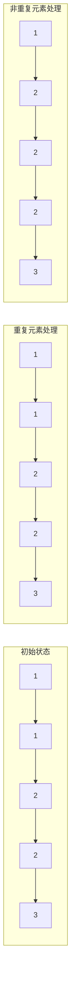

**时间复杂度**：O(n)，空间复杂度：O(1)

---

#### 两数之和（有序数组）

**问题**：在有序数组中找两个数使它们和为目标值

**LeetCode 167. 两数之和 II - 输入有序数组**

```java
public int[] twoSum(int[] numbers, int target) {
    int left = 0;
    int right = numbers.length - 1;

    while (left < right) {
        int sum = numbers[left] + numbers[right];

        if (sum == target) {
            return new int[]{left + 1, right + 1}; // 1-indexed
        } else if (sum < target) {
            left++;  // 增大和
        } else {
            right--; // 减小和
        }
    }
    return new int[]{-1, -1};
}
```

**图解过程**：

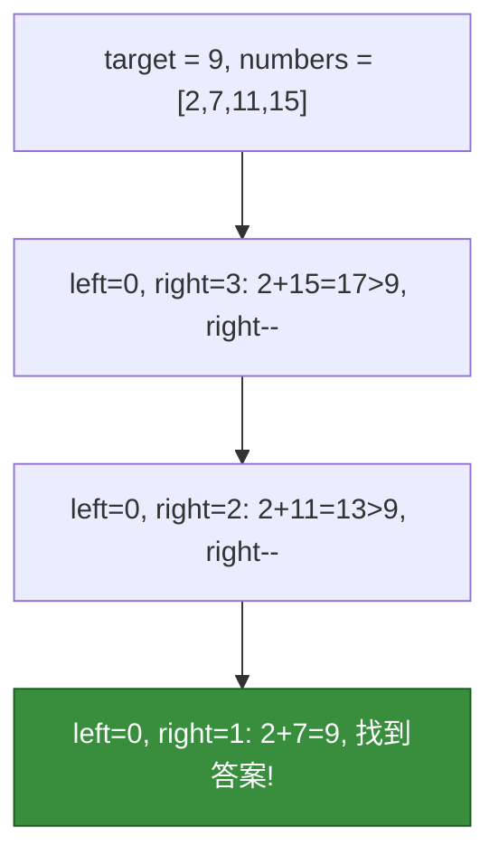

**时间复杂度**：O(n)，空间复杂度：O(1)

---

#### 回文链表检测

**问题**：判断链表是否为回文

**LeetCode 234. 回文链表**

```java
public boolean isPalindrome(ListNode head) {
    if (head == null || head.next == null) return true;

    // 1. 找中点
    ListNode slow = head, fast = head;
    while (fast.next != null && fast.next.next != null) {
        slow = slow.next;
        fast = fast.next.next;
    }

    // 2. 反转后半部分
    ListNode prev = null, curr = slow.next;
    while (curr != null) {
        ListNode next = curr.next;
        curr.next = prev;
        prev = curr;
        curr = next;
    }

    // 3. 比较前后两部分
    ListNode left = head, right = prev;
    while (right != null) {
        if (left.val != right.val) return false;
        left = left.next;
        right = right.next;
    }
    return true;
}
```

**图解过程**：

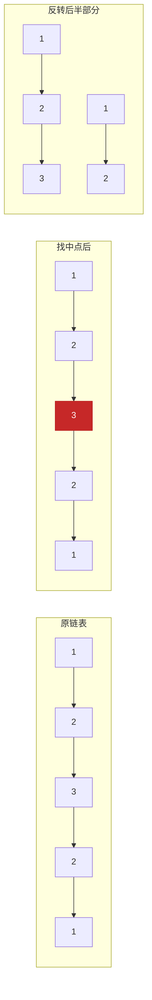

**时间复杂度**：O(n)，空间复杂度：O(1)

---

#### 链表中点查找

**问题**：找到链表的中间节点

**LeetCode 876. 链表的中间结点**

```java
public ListNode middleNode(ListNode head) {
    ListNode slow = head;
    ListNode fast = head;

    while (fast != null && fast.next != null) {
        slow = slow.next;      // 慢指针走1步
        fast = fast.next.next; // 快指针走2步
    }
    return slow;
}
```

**图解过程**：

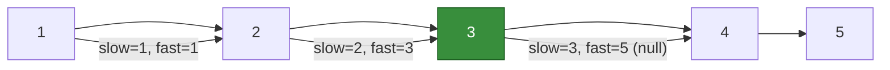

**奇数长度返回中间，偶数长度返回下中点**

---

#### 环形链表检测

**问题**：判断链表是否有环

**LeetCode 141. 环形链表**

```java
public boolean hasCycle(ListNode head) {
    if (head == null || head.next == null) return false;

    ListNode slow = head;
    ListNode fast = head;

    while (fast != null && fast.next != null) {
        slow = slow.next;
        fast = fast.next.next;

        if (slow == fast) {
            return true; // 相遇，说明有环
        }
    }
    return false;
}
```

**图解过程**：

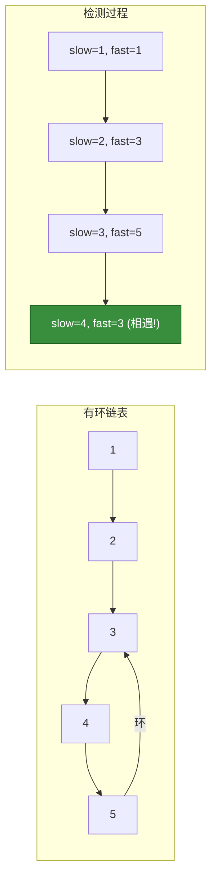

**时间复杂度**：O(n)，空间复杂度：O(1)

**数学证明**：若有环，快指针总能追上慢指针，最多遍历两圈

---

### 1.3 双指针总结

| 类型 | 指针关系 | 适用场景 | 复杂度 |
|------|----------|----------|--------|
| 快慢指针 | 同向，步长不同 | 环检测、中点查找 | O(n) |
| 左右指针 | 反向，相向移动 | 二分查找、两数之和 | O(n) |
| 滑动窗口 | 同向，动态调整 | 子串问题 | O(n) |

---

## 2. 滑动窗口

滑动窗口是一种高效的区间遍历技巧，通过维护一个可变长子数组/子串，在线性时间内解决子串/子数组问题。

### 2.1 滑动窗口原理

滑动窗口像是一个可以伸缩的窗口在数组/字符串上滑动：

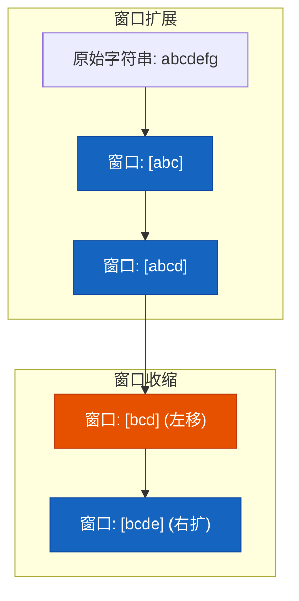

#### 核心思想

1. **右指针扩展**：不断右移，纳入新元素
2. **左指针收缩**：当条件不满足时，右移左指针排除元素
3. **更新答案**：在窗口变化过程中维护最优解

### 2.2 固定窗口 vs 可变窗口

#### 固定窗口模板

窗口大小始终为 k：

```java
public void fixedWindow(int[] nums, int k) {
    int left = 0;
    int sum = 0;

    for (int right = 0; right < nums.length; right++) {
        sum += nums[right];

        // 窗口大小达到k时，滑动
        if (right >= k - 1) {
            // 处理窗口 sum
            sum -= nums[left]; // 移除左侧元素
            left++;
        }
    }
}
```

#### 可变窗口模板

窗口大小动态变化：

```java
public void variableWindow(String s) {
    Map<Character, Integer> window = new HashMap<>();
    int left = 0, right = 0;
    int valid = 0;

    while (right < s.length()) {
        char c = s.charAt(right);
        right++;

        // 扩大窗口
        window.put(c, window.getOrDefault(c, 0) + 1);

        // 收缩窗口
        while (needShrink(window)) {
            char d = s.charAt(left);
            left++;

            // 缩小窗口
            window.put(d, window.get(d) - 1);
        }

        // 更新答案
        // ...
    }
}
```

### 2.3 经典问题

#### 最大子数组和

**问题**：找出连续子数组的最大和

**LeetCode 53. 最大子数组和**

```java
public int maxSubArray(int[] nums) {
    int maxSum = nums[0];
    int curSum = nums[0];

    for (int i = 1; i < nums.length; i++) {
        // 当前和要么加上当前元素，要么从当前元素重新开始
        curSum = Math.max(curSum + nums[i], nums[i]);
        maxSum = Math.max(maxSum, curSum);
    }
    return maxSum;
}
```

**滑动窗口解法**（可变窗口）：

```java
public int maxSubArraySliding(int[] nums) {
    int left = 0;
    int curSum = 0;
    int maxSum = Integer.MIN_VALUE;

    for (int right = 0; right < nums.length; right++) {
        curSum += nums[right];

        // 当和小于0时，丢弃整个窗口
        while (curSum < 0 && left <= right) {
            curSum -= nums[left];
            left++;
        }

        maxSum = Math.max(maxSum, curSum);
    }
    return maxSum;
}
```

**图解过程**：

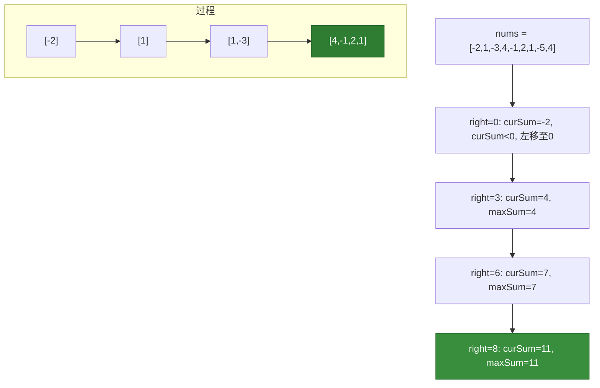

**时间复杂度**：O(n)，空间复杂度：O(1)

---

#### 无重复字符最长子串

**问题**：找出不含有重复字符的最长子串长度

**LeetCode 3. 无重复字符的最长子串**

```java
public int lengthOfLongestSubstring(String s) {
    Map<Character, Integer> window = new HashMap<>();
    int left = 0, right = 0;
    int maxLen = 0;

    while (right < s.length()) {
        char c = s.charAt(right);
        right++;

        // 记录字符最新位置
        window.put(c, window.getOrDefault(c, 0) + 1);

        // 收缩窗口直到没有重复
        while (window.get(c) > 1) {
            char d = s.charAt(left);
            left++;
            window.put(d, window.get(d) - 1);
        }

        maxLen = Math.max(maxLen, right - left);
    }
    return maxLen;
}
```

**图解过程**：

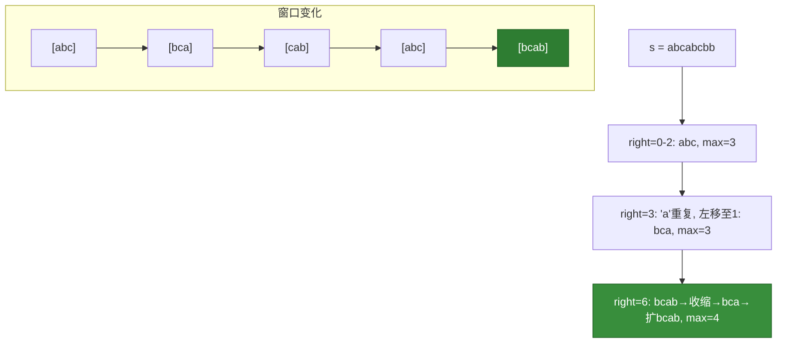

**时间复杂度**：O(n)，空间复杂度**：O(min(m,n))，其中 m 为字符集大小

---

#### 最小覆盖子串

**问题**：找出 s 中包含 t 所有字符的最小子串

**LeetCode 76. 最小覆盖子串**

```java
public String minWindow(String s, String t) {
    Map<Character, Integer> need = new HashMap<>();
    Map<Character, Integer> window = new HashMap<>();

    // 统计t中需要的字符
    for (char c : t.toCharArray()) {
        need.put(c, need.getOrDefault(c, 0) + 1);
    }

    int left = 0, right = 0;
    int valid = 0; // 已满足的字符种类数
    int start = 0, len = Integer.MAX_VALUE;

    while (right < s.length()) {
        char c = s.charAt(right);
        right++;

        // 是需要的字符则加入窗口
        if (need.containsKey(c)) {
            window.put(c, window.getOrDefault(c, 0) + 1);
            if (window.get(c).equals(need.get(c))) {
                valid++;
            }
        }

        // 收缩窗口直到不满足条件
        while (valid == need.size()) {
            // 更新最小覆盖子串
            if (right - left < len) {
                start = left;
                len = right - left;
            }

            char d = s.charAt(left);
            left++;

            // 移除左侧字符
            if (need.containsKey(d)) {
                if (window.get(d).equals(need.get(d))) {
                    valid--;
                }
                window.put(d, window.get(d) - 1);
            }
        }
    }
    return len == Integer.MAX_VALUE ? "" : s.substring(start, start + len);
}
```

**图解过程**：

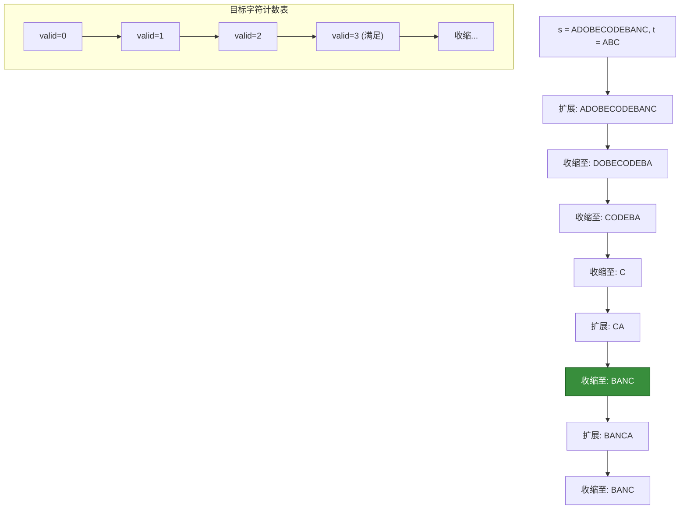

**时间复杂度**：O(n)，空间复杂度**：O(m)，m 为字符集大小

---

#### 字符串排列

**问题**：判断 s2 是否包含 s1 的排列

**LeetCode 567. 字符串的排列**

```java
public boolean checkInclusion(String s1, String s2) {
    Map<Character, Integer> need = new HashMap<>();
    Map<Character, Integer> window = new HashMap<>();

    for (char c : s1.toCharArray()) {
        need.put(c, need.getOrDefault(c, 0) + 1);
    }

    int left = 0, right = 0;
    int valid = 0;

    while (right < s2.length()) {
        char c = s2.charAt(right);
        right++;

        if (need.containsKey(c)) {
            window.put(c, window.getOrDefault(c, 0) + 1);
            if (window.get(c).equals(need.get(c))) {
                valid++;
            }
        }

        // 窗口大小等于s1长度时收缩
        while (right - left >= s1.length()) {
            if (valid == need.size()) {
                return true; // 找到排列
            }

            char d = s2.charAt(left);
            left++;

            if (need.containsKey(d)) {
                if (window.get(d).equals(need.get(d))) {
                    valid--;
                }
                window.put(d, window.get(d) - 1);
            }
        }
    }
    return false;
}
```

**时间复杂度**：O(n)，空间复杂度**：O(m)

---

### 2.4 滑动窗口总结

| 问题类型 | 窗口策略 | 核心判断 |
|----------|----------|----------|
| 固定长度子数组 | 固定窗口大小 | right - left + 1 == k |
| 最大/最小子数组 | 可变窗口 | 维护全局最优 |
| 子串包含问题 | 可变窗口 | 窗口覆盖目标 |
| 排列问题 | 可变窗口 | 窗口大小等于目标大小 |

---

## 3. 位运算

位运算是直接对二进制位进行操作的技巧，在特定场景下可带来显著的性能提升。

### 3.1 位运算基础

#### 基本运算符

| 运算符 | 含义 | 示例 | 结果 |
|--------|------|------|------|
| `&` | 按位与 | `5 & 3` | `0101 & 0011 = 0001 = 1` |
| `\|` | 按位或 | `5 \| 3` | `0101 \| 0011 = 0111 = 7` |
| `^` | 按位异或 | `5 ^ 3` | `0101 ^ 0011 = 0110 = 6` |
| `~` | 按位取反 | `~5` | `...11111010 = -6` |
| `<<` | 左移 | `5 << 1` | `1010 = 10` |
| `>>` | 右移 | `5 >> 1` | `0010 = 2` |

#### 核心性质

```
异或运算：
  a ^ a = 0           // 任何数与自身异或为0
  a ^ 0 = a           // 任何数与0异或为其自身
  a ^ b ^ c = a ^ c ^ b // 交换律

应用：
  - 找出唯一出现的数
  - 交换两数（不使用临时变量）
```

### 3.2 常用技巧

#### 交换两数

```java
// 普通方式需要临时变量
int temp = a;
a = b;
b = temp;

// 位运算：不需要临时变量
a = a ^ b;
b = a ^ b;  // b = (a ^ b) ^ b = a
a = a ^ b;  // a = (a ^ b) ^ a = b
```

**注意**：当 a 和 b 相同时会变为0，需谨慎使用

#### 找出唯一出现一次的数

**问题**：数组中除一个数字只出现一次外，其余数字都出现两次，找出该数字

**LeetCode 260. 只出现一次的数字 III**

```java
public int singleNumber(int[] nums) {
    int xor = 0;
    for (int num : nums) {
        xor ^= num;  // 最终结果为两个只出现一次的数的异或
    }

    // 找出两个数不同的最低位，用于分组
    int diff = xor & (-xor);

    int result = 0;
    for (int num : nums) {
        if ((num & diff) == 0) {
            result ^= num;  // 在第一组中找到只出现一次的数
        }
    }
    return result;
}
```

**LeetCode 136. 只出现一次的数字**（其他数字都出现两次）：

```java
public int singleNumber(int[] nums) {
    int result = 0;
    for (int num : nums) {
        result ^= num;
    }
    return result;
}
```

**图解**：

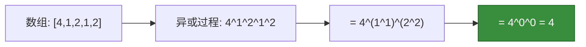

---

#### 统计二进制中1的个数

**LeetCode 191. 位1的个数**

```java
// 方法1：位移动
public int hammingWeight1(int n) {
    int count = 0;
    while (n != 0) {
        count += (n & 1);
        n >>>= 1;  // 无符号右移
    }
    return count;
}

// 方法2：n & (n-1) 技巧
public int hammingWeight2(int n) {
    int count = 0;
    while (n != 0) {
        n &= (n - 1);  // 消除最低位的1
        count++;
    }
    return count;
}
```

**n & (n-1) 原理**：

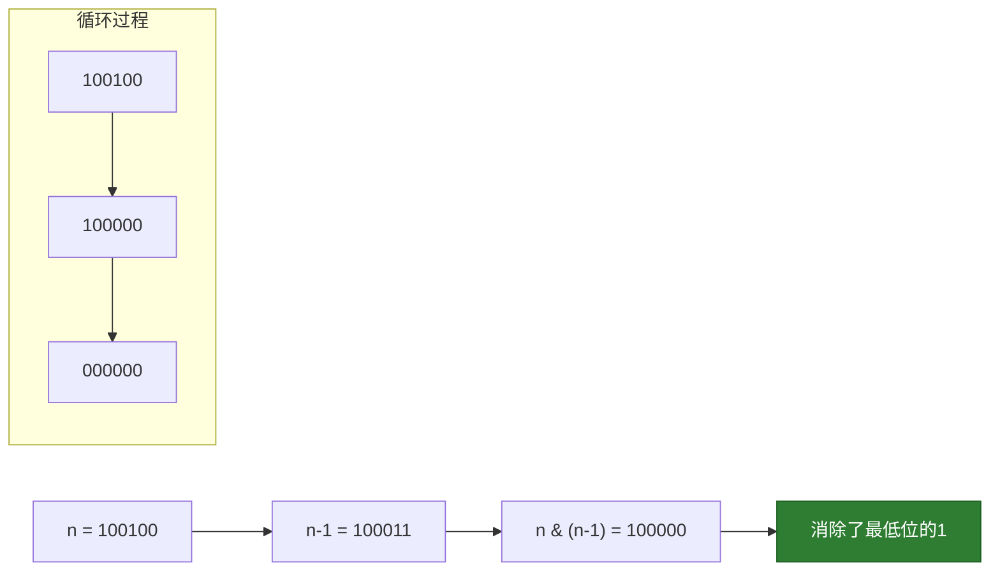

---

#### 状态压缩 DP

使用单个或多个整数表示集合状态，常用于小规模问题的状态枚举。

**经典问题**：旅行商问题（TSP）的状态压缩 DP

```java
// 假设有n个城市，使用dp[mask][i]表示经过城市集合mask后当前在i的最短路径
int n = 4;
int[][] dp = new int[1 << n][n];

// 初始化：只经过起点
for (int i = 0; i < n; i++) {
    dp[1 << i][i] = 0;
}

// 状态转移
for (int mask = 1; mask < (1 << n); mask++) {
    for (int last = 0; last < n; last++) {
        if ((mask & (1 << last)) == 0) continue;

        int prevMask = mask ^ (1 << last);
        if (prevMask == 0) continue;

        for (int prev = 0; prev < n; prev++) {
            if ((prevMask & (1 << prev)) == 0) continue;
            dp[mask][last] = Math.min(dp[mask][last],
                dp[prevMask][prev] + dist[prev][last]);
        }
    }
}
```

### 3.3 位运算应用

#### 布隆过滤器 (Bloom Filter)

使用多个哈希函数和位数组实现高效的集合成员判断：

```java
public class BloomFilter {
    private int[] bitArray;  // 位数组
    private int size;        // 位数组大小
    private int hashCount;   // 哈希函数数量

    public BloomFilter(int size, int hashCount) {
        this.size = size;
        this.hashCount = hashCount;
        this.bitArray = new int[(size + 31) / 32];
    }

    // 添加元素
    public void add(String item) {
        for (int i = 0; i < hashCount; i++) {
            int index = hash(item, i) % size;
            bitArray[index / 32] |= (1 << (index % 32));
        }
    }

    // 判断是否可能存在（可能有false positive）
    public boolean mightContain(String item) {
        for (int i = 0; i < hashCount; i++) {
            int index = hash(item, i) % size;
            if ((bitArray[index / 32] & (1 << (index % 32))) == 0) {
                return false;
            }
        }
        return true;
    }

    private int hash(String item, int seed) {
        // 使用不同的seed实现多个哈希函数
        return Math.abs((item.hashCode() * 31 + seed) % size);
    }
}
```

#### Bitmap（位图）

用每一位表示一个数是否存在，适合大规模数据去重和统计：

```java
public class Bitmap {
    private int[] bits;

    public Bitmap(int maxValue) {
        bits = new int[(maxValue + 31) / 32];
    }

    // 设置第i位为1
    public void set(int i) {
        bits[i / 32] |= (1 << (i % 32));
    }

    // 判断第i位是否为1
    public boolean get(int i) {
        return (bits[i / 32] & (1 << (i % 32))) != 0;
    }

    // 删除：设置第i位为0
    public void clear(int i) {
        bits[i / 32] &= ~(1 << (i % 32));
    }
}
```

**应用场景**：
- 大规模数据去重（100亿个数去重，只需125MB内存）
- 排序（若数据范围确定）
- 统计出现次数

### 3.4 位运算总结

| 技巧 | 应用 | 复杂度 |
|------|------|--------|
| `n & (n-1)` | 消除最低位1 | O(1) |
| `n & (-n)` | 获取最低位的1 | O(1) |
| 异或swap | 两数交换 | O(1) |
| 状态压缩 | 集合状态表示 | O(2^n) |
| Bitmap | 大规模数据处理 | O(1) |

---

## 4. 字符串匹配

字符串匹配是查找子串位置的算法，在文本搜索、DNA序列分析等领域有广泛应用。

### 4.1 暴力匹配

**算法思想**：逐个字符比较，不匹配则模式串右移一位。

```java
public int bruteForce(String text, String pattern) {
    int n = text.length(), m = pattern.length();

    for (int i = 0; i <= n - m; i++) {
        int j = 0;
        while (j < m && text.charAt(i + j) == pattern.charAt(j)) {
            j++;
        }
        if (j == m) {
            return i;  // 找到匹配
        }
    }
    return -1;
}
```

**图解过程**：

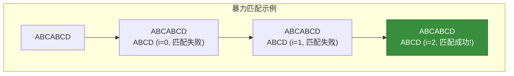

**时间复杂度**：O(nm)，空间复杂度：O(1)

**问题**：最坏情况下，如 `text = "AAAA...A"`, `pattern = "AAAAB"`，每次比较m次，共比较nm次。

### 4.2 KMP 算法

KMP（Knuth-Morris-Pratt）算法利用已匹配信息，避免重复比较，达到 O(n+m) 的时间复杂度。

#### 最长前缀后缀（LPS）数组

对于模式串的每个位置 i，求出 `LPS[i]` = 最长相等前后缀长度。

**前后缀定义**：
- 前缀：不包含最后一个字符的所有子串
- 后缀：不包含第一个字符的所有子串

**示例**：`pattern = "ABAB"`

| 位置 | 子串 | 前缀 | 后缀 | LPS |
|------|------|------|------|-----|
| 0 | A | {} | {} | 0 |
| 1 | AB | {A} | {B} | 0 |
| 2 | ABA | {A,AB} | {A,BA} | 1 |
| 3 | ABAB | {A,AB,ABA} | {B,AB,BAB} | 2 |

#### 前缀函数构建过程

```java
public int[] buildLPS(String pattern) {
    int m = pattern.length();
    int[] lps = new int[m];
    int len = 0;  // 当前最长前后缀长度
    int i = 1;

    while (i < m) {
        if (pattern.charAt(i) == pattern.charAt(len)) {
            len++;
            lps[i] = len;
            i++;
        } else {
            if (len != 0) {
                len = lps[len - 1];  // 尝试更短的前缀
            } else {
                lps[i] = 0;
                i++;
            }
        }
    }
    return lps;
}
```

**图解：LPS 构建过程**：

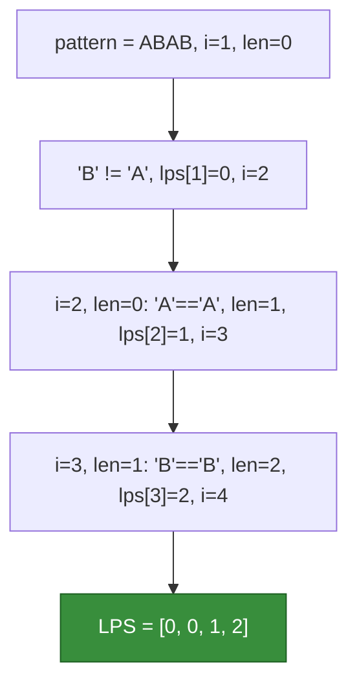

#### KMP 完整实现

```java
public int kmpSearch(String text, String pattern) {
    int n = text.length(), m = pattern.length();
    int[] lps = buildLPS(pattern);

    int i = 0;  // text指针
    int j = 0;  // pattern指针

    while (i < n) {
        if (text.charAt(i) == pattern.charAt(j)) {
            i++;
            j++;
        }

        if (j == m) {
            return i - j;  // 找到匹配
        } else if (i < n && text.charAt(i) != pattern.charAt(j)) {
            if (j != 0) {
                j = lps[j - 1];  // 利用已匹配信息
            } else {
                i++;
            }
        }
    }
    return -1;
}
```

**图解：KMP 匹配过程**：

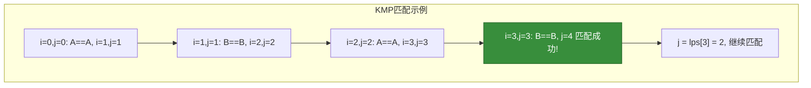

**时间复杂度**：O(n+m)，空间复杂度：O(m)

### 4.3 Sunday 算法

Sunday 算法在失配时关注文本串中与模式串后一位对应的字符，O(nm) 复杂度但实际很快。

```java
public int sundaySearch(String text, String pattern) {
    int n = text.length(), m = pattern.length();

    // 预处理：记录每个字符在模式串中最右边的位置
    Map<Character, Integer> lastPos = new HashMap<>();
    for (int i = 0; i < m; i++) {
        lastPos.put(pattern.charAt(i), i);
    }

    int i = 0;
    while (i <= n - m) {
        int j = 0;
        while (j < m && text.charAt(i + j) == pattern.charAt(j)) {
            j++;
        }

        if (j == m) {
            return i;
        }

        // 计算偏移：若超出范围则右移 m+1，否则使用预处理表
        if (i + m < n) {
            Integer last = lastPos.get(text.charAt(i + m));
            i += (last != null) ? (m - last) : (m + 1);
        } else {
            return -1;
        }
    }
    return -1;
}
```

**图解**：

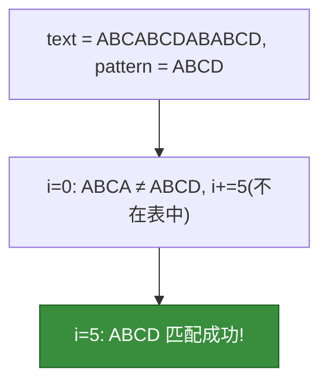

### 4.4 算法对比

| 算法 | 时间复杂度 | 空间复杂度 | 特点 |
|------|------------|------------|------|
| 暴力匹配 | O(nm) | O(1) | 简单，直观 |
| KMP | O(n+m) | O(m) | 稳定，工业标准 |
| Sunday | O(nm) | O(σ) | 实际速度快，易实现 |

**KMP vs 暴力对比**：

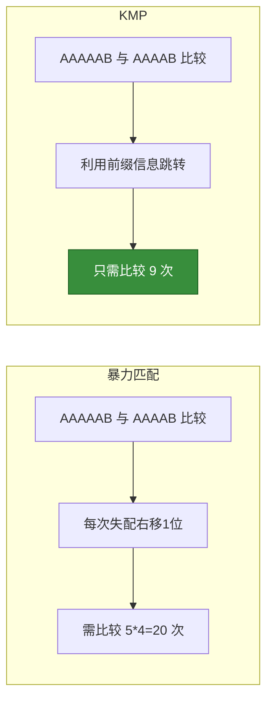

### 4.5 工程应用

#### 字符串搜索
- 文本编辑器中的查找功能（Ctrl+F）
- 代码 IDE 的全局搜索
- 日志关键词检索

#### DNA 序列匹配
- 生物信息学中的基因序列比对
- 病毒检测
- 蛋白质结构分析

#### 其他应用
- 敏感词过滤
- 网络协议中的模式匹配
- 数据压缩

---

## 5. 总结与对比

### 技巧选择指南

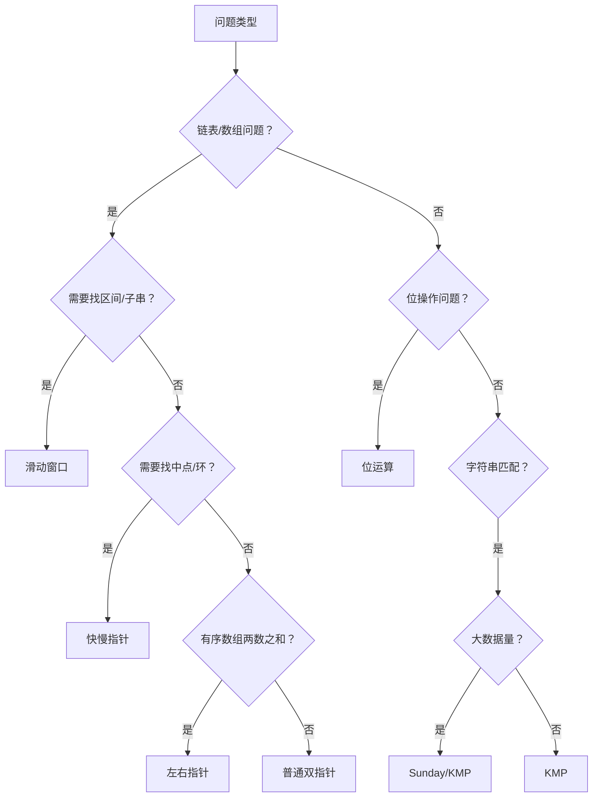

### 复杂度总结

| 技巧 | 时间复杂度 | 空间复杂度 |
|------|------------|------------|
| 双指针 | O(n) | O(1) |
| 滑动窗口 | O(n) | O(k) 或 O(σ) |
| 位运算 | O(1) 每操作 | O(1) |
| KMP | O(n+m) | O(m) |
| Sunday | O(nm) | O(σ) |

### 实战建议

1. **双指针**：遇到链表/数组的成对问题，优先考虑
2. **滑动窗口**：子串/子数组问题首选，注意窗口收缩条件
3. **位运算**：遇到统计、状态压缩场景时考虑
4. **KMP**：字符串匹配首选，理解前缀函数是核心

---

## 6. 典型 LeetCode 题目

| 技巧 | 题目 | 难度 |
|------|------|------|
| 双指针 | 26. 删除有序数组中的重复项 | 简单 |
| 双指针 | 167. 两数之和 II | 简单 |
| 双指针 | 234. 回文链表 | 中等 |
| 双指针 | 876. 链表的中间结点 | 简单 |
| 双指针 | 141. 环形链表 | 简单 |
| 滑动窗口 | 3. 无重复字符的最长子串 | 中等 |
| 滑动窗口 | 53. 最大子数组和 | 简单 |
| 滑动窗口 | 76. 最小覆盖子串 | 困难 |
| 滑动窗口 | 567. 字符串的排列 | 中等 |
| 位运算 | 136. 只出现一次的数字 | 简单 |
| 位运算 | 260. 只出现一次的数字 III | 中等 |
| 位运算 | 191. 位1的个数 | 简单 |
| 字符串匹配 | 28. 找出字符串中第一个匹配项的下标 | 中等 |
